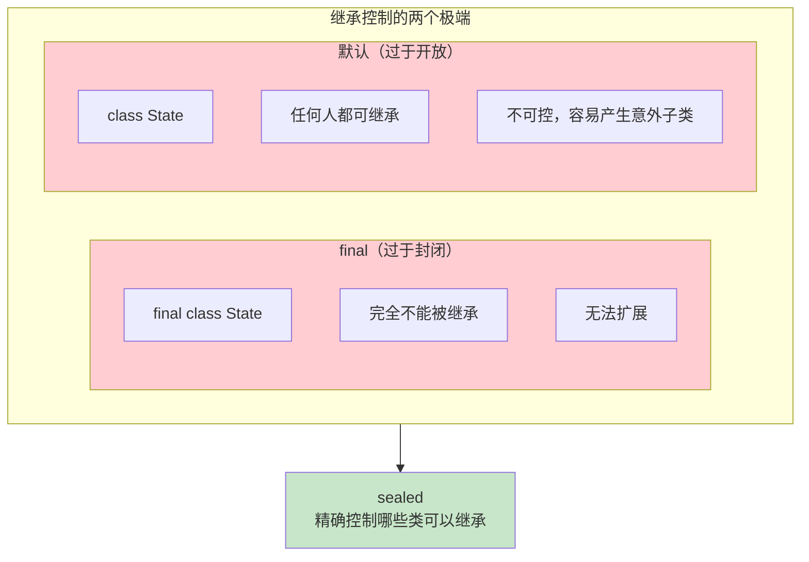
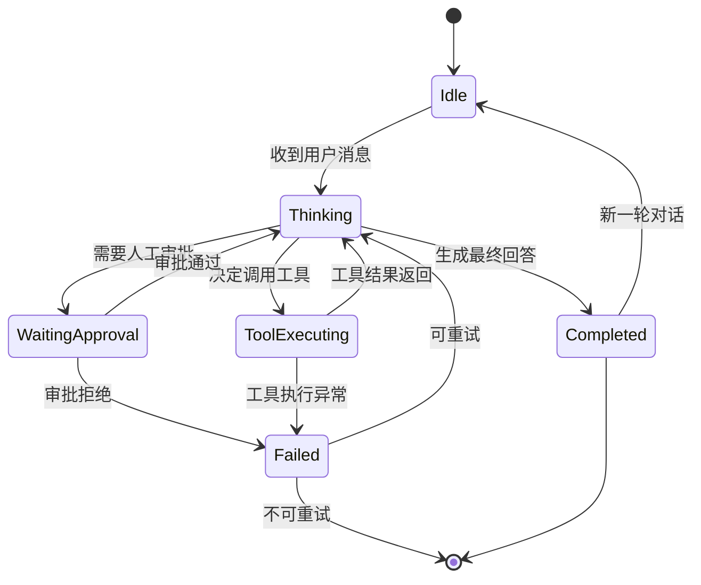
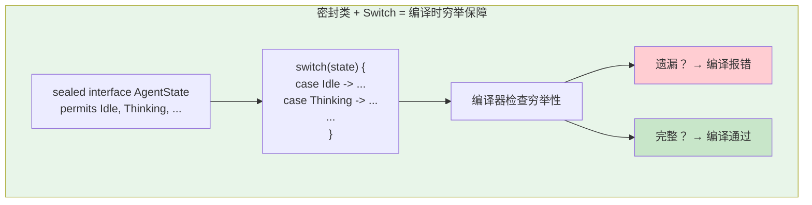
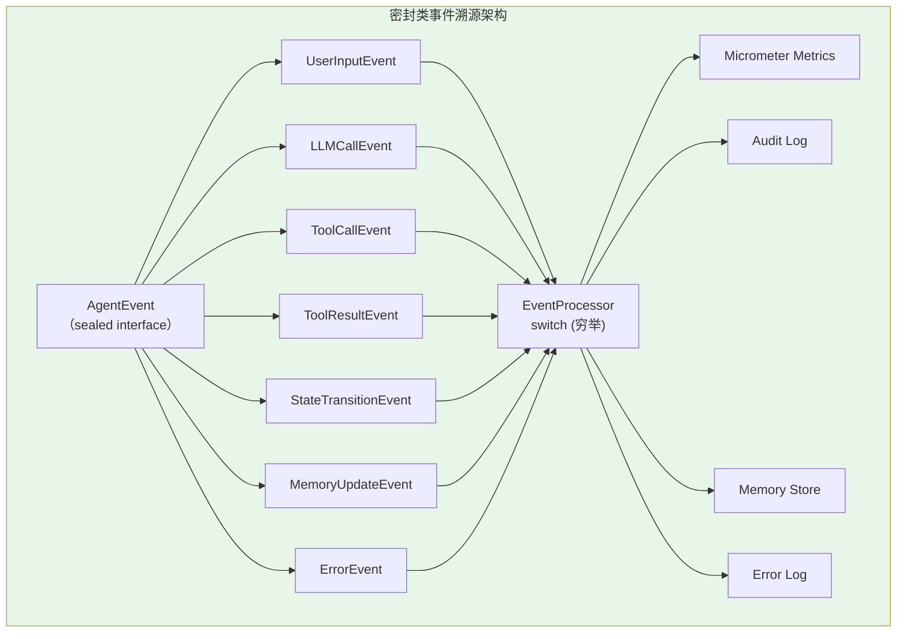
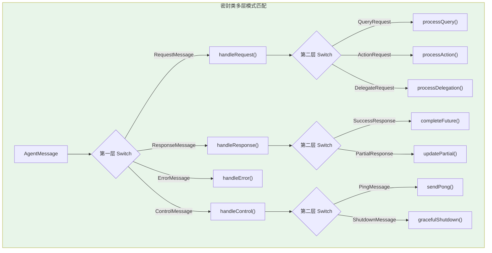
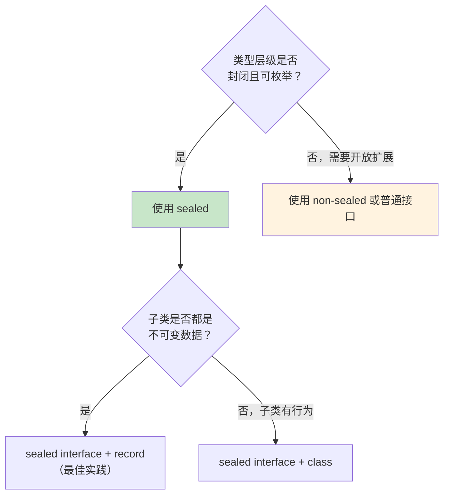

# 密封类（Sealed Classes）在 Agent 状态/事件建模中的应用

> 「本文是对 [教程 21-Agent状态管理 §2-§4] 的深入展开」

> **定位**：深入讲解 Java 17+ 的密封类（Sealed Classes）特性，以及它如何在 Agent 状态机建模、事件溯源（Event Sourcing）、密封类型层级中实现"穷举安全"。
>
> **读者画像**：理解 Java 继承机制，需要在 Agent 架构中构建类型安全的状态/事件模型的开发者。

---

## 1. 密封类是什么

### 1.1 继承的两难

Java 的类继承体系一直面临两难：



- `final`：完全封闭，不允许任何继承——太极端
- 默认（无修饰符）：任何类都能继承——不可控，特别是在库/框架场景中

密封类（Sealed Classes，Java 17 正式）给出了**第三条路**：允许继承，但只允许**指定的子类**继承。

### 1.2 基本语法

```java
// 密封接口：指定允许的实现
public sealed interface AgentState
    permits Idle, Thinking, ToolExecuting, WaitingApproval, Completed, Failed {
    // 接口方法
    String describe();
}

// 子类必须声明为 final、sealed 或 non-sealed
public record Idle(String reason) implements AgentState {
    @Override
    public String describe() { return "空闲: " + reason; }
}

public record Thinking(String currentStep) implements AgentState {
    @Override
    public String describe() { return "推理中: " + currentStep; }
}

public record ToolExecuting(String toolName, Map<String, Object> args) implements AgentState {
    @Override
    public String describe() { return "执行工具: " + toolName; }
}

public record WaitingApproval(String action, String requestedBy) implements AgentState {
    @Override
    public String describe() { return "等待审批: " + action; }
}

public record Completed(String result, long durationMs) implements AgentState {
    @Override
    public String describe() { return "已完成"; }
}

public record Failed(String error, boolean retryable) implements AgentState {
    @Override
    public String describe() { return "失败: " + error; }
}
```

### 1.3 三个修饰符的含义

| 修饰符 | 含义 | 能否再被继承 |
|--------|------|-------------|
| `final` | 最终，不可继承 | 不能 |
| `sealed` | 密封，继续限制子类 | 能，但子类必须指定（permits） |
| `non-sealed` | 非密封，回到开放继承 | 能，任何类都可以继承它 |

```java
sealed interface Event permits LoginEvent, LogoutEvent, SystemEvent
    // sealed → 子类必须继续声明 final/sealed/non-sealed

record LoginEvent(String userId, Instant time) implements Event {}      // 隐式 final（record 总是 final）

sealed abstract class SystemEvent permits ErrorEvent, InfoEvent         // 继续密封
    // ErrorEvent 和 InfoEvent 还可以继续限制

non-sealed class CustomEvent implements Event                            // 开放，任何类都可以继承 CustomEvent
```

---

## 2. 密封类在 Agent 状态机中的应用

### 2.1 Agent 状态机的完整建模

Agent 的生命周期是一个典型的状态机。用密封类建模：



```java
// ==== Agent 状态的密封层级 ====

public sealed interface AgentState
    permits Idle, Thinking, ToolExecuting, WaitingApproval, Completed, Failed {

    String sessionId();
    Instant enteredAt();
}

// 每个状态用 Record 实现（不可变 + 简洁）
public record Idle(
    String sessionId,
    Instant enteredAt,
    String lastTopic   // 上一轮对话话题
) implements AgentState {}

public record Thinking(
    String sessionId,
    Instant enteredAt,
    String userQuery,
    int reasoningStep,    // 推理步骤编号
    int maxSteps          // 最大步数
) implements AgentState {}

public record ToolExecuting(
    String sessionId,
    Instant enteredAt,
    String toolName,
    String toolCallId,
    Map<String, Object> arguments
) implements AgentState {}

public record WaitingApproval(
    String sessionId,
    Instant enteredAt,
    String proposedAction,
    String justification,
    String approver        // 审批人ID
) implements AgentState {}

public record Completed(
    String sessionId,
    Instant enteredAt,
    String result,
    long durationMs,
    int tokensConsumed
) implements AgentState {}

public record Failed(
    String sessionId,
    Instant enteredAt,
    String errorMessage,
    Throwable cause,
    boolean retryable
) implements AgentState {}
```

### 2.2 穷举式状态处理

密封类的最大价值：**编译器保证 switch 穷举所有子类型**。如果你新增了一个状态但忘记处理某处逻辑，编译器报错：

```java
public class StateProcessor {

    // 编译器强制处理所有 6 个状态——遗漏任何一个就编译报错
    public String describe(AgentState state) {
        return switch (state) {
            case Idle s -> "会话 " + s.sessionId() + " 空闲中";
            case Thinking s -> "推理第 " + s.reasoningStep() + "/" + s.maxSteps() + " 步";
            case ToolExecuting s -> "执行工具: " + s.toolName();
            case WaitingApproval s -> "等待 " + s.approver() + " 审批";
            case Completed s -> "完成，耗时 " + s.durationMs() + "ms";
            case Failed s -> "失败: " + s.errorMessage()
                + (s.retryable() ? "（可重试）" : "（不可重试）");
        };
    }

    public boolean canTransition(AgentState from, AgentState to) {
        return switch (from) {
            case Idle _ -> to instanceof Thinking;
            case Thinking _ -> to instanceof ToolExecuting
                            || to instanceof WaitingApproval
                            || to instanceof Completed
                            || to instanceof Failed;
            case ToolExecuting _ -> to instanceof Thinking
                                 || to instanceof Failed;
            case WaitingApproval _ -> to instanceof Thinking
                                   || to instanceof Failed;
            case Completed _ -> to instanceof Idle;  // 新一轮对话
            case Failed _ -> to instanceof Thinking  // 重试
                          || to instanceof Idle;     // 放弃
        };
    }

    // 如果将来新增了状态 Aborted，上述所有 switch 都会编译报错
    // 强制你处理新状态——这是密封类的核心价值
}
```



### 2.3 状态转换的守卫

```java
public class StateMachine {

    public AgentState transition(AgentState current, Event event) {
        return switch (current) {
            case Idle idle when event instanceof UserMessageEvent um ->
                new Thinking(
                    idle.sessionId(),
                    Instant.now(),
                    um.content(),
                    0,
                    10
                );

            case Thinking t when event instanceof ToolDecisionEvent td ->
                new ToolExecuting(
                    t.sessionId(),
                    Instant.now(),
                    td.toolName(),
                    td.callId(),
                    td.arguments()
                );

            case Thinking t when event instanceof FinalAnswerEvent fa ->
                new Completed(
                    t.sessionId(),
                    Instant.now(),
                    fa.answer(),
                    Duration.between(t.enteredAt(), Instant.now()).toMillis(),
                    fa.tokens()
                );

            case Thinking t when event instanceof ApprovalRequiredEvent ar ->
                new WaitingApproval(
                    t.sessionId(),
                    Instant.now(),
                    ar.action(),
                    ar.reason(),
                    ar.approver()
                );

            case ToolExecuting te when event instanceof ToolResultEvent tr ->
                new Thinking(
                    te.sessionId(),
                    Instant.now(),
                    "工具 " + te.toolName() + " 返回结果",
                    0,
                    10
                );

            case ToolExecuting te when event instanceof ToolErrorEvent terr ->
                new Failed(
                    te.sessionId(),
                    Instant.now(),
                    "工具 " + te.toolName() + " 执行失败: " + terr.error(),
                    terr.cause(),
                    terr.retryable
                );

            // 非法转换
            default -> throw new IllegalStateTransitionException(
                "无法从 " + current.getClass().getSimpleName()
                + " 处理事件 " + event.getClass().getSimpleName()
            );
        };
    }
}
```

---

## 3. 密封类在事件溯源中的应用

### 3.1 领域事件的密封层级

事件溯源（Event Sourcing）是 Agent 系统的常见模式——所有状态变化以事件形式记录。密封类让事件类型完整可控：

```java
// 所有 Agent 生命周期事件的密封接口
public sealed interface AgentEvent
    permits UserInputEvent, LLMCallEvent, ToolCallEvent, ToolResultEvent,
            StateTransitionEvent, MemoryUpdateEvent, ErrorEvent {

    String eventId();
    String sessionId();
    Instant timestamp();
}

// 用户输入事件
public record UserInputEvent(
    String eventId, String sessionId, Instant timestamp,
    String userMessage,
    Map<String, String> metadata
) implements AgentEvent {}

// LLM 调用事件
public record LLMCallEvent(
    String eventId, String sessionId, Instant timestamp,
    String model,
    int inputTokens,
    int outputTokens,
    long latencyMs,
    double cost
) implements AgentEvent {}

// 工具调用事件
public record ToolCallEvent(
    String eventId, String sessionId, Instant timestamp,
    String toolName,
    Map<String, Object> arguments
) implements AgentEvent {}

// 工具返回事件
public record ToolResultEvent(
    String eventId, String sessionId, Instant timestamp,
    String toolName,
    String result,
    boolean success
) implements AgentEvent {}

// 状态转换事件
public record StateTransitionEvent(
    String eventId, String sessionId, Instant timestamp,
    String fromState,
    String toState,
    String reason
) implements AgentEvent {}

// 记忆更新事件
public record MemoryUpdateEvent(
    String eventId, String sessionId, Instant timestamp,
    String operation,    // ADD / UPDATE / DELETE
    String memoryKey,
    String memoryValue
) implements AgentEvent {}

// 错误事件
public record ErrorEvent(
    String eventId, String sessionId, Instant timestamp,
    String errorCode,
    String errorMessage,
    boolean retryable
) implements AgentEvent {}
```

### 3.2 事件处理器的穷举式分发

```java
@Component
public class AgentEventProcessor {

    private final MeterRegistry meters;

    // 穷举所有事件类型——新增事件类型时编译器强制处理
    public void process(AgentEvent event) {
        switch (event) {
            case UserInputEvent e -> {
                meters.counter("agent.user_input",
                    "session", e.sessionId()).increment();
            }
            case LLMCallEvent e -> {
                meters.counter("agent.llm.tokens",
                    "model", e.model(),
                    "direction", "input").increment(e.inputTokens());
                meters.counter("agent.llm.tokens",
                    "model", e.model(),
                    "direction", "output").increment(e.outputTokens());
                meters.timer("agent.llm.latency",
                    "model", e.model()).record(e.latencyMs(), TimeUnit.MILLISECONDS);
            }
            case ToolCallEvent e -> {
                meters.counter("agent.tool.call",
                    "tool", e.toolName()).increment();
            }
            case ToolResultEvent e -> {
                meters.counter("agent.tool.result",
                    "tool", e.toolName(),
                    "success", String.valueOf(e.success())).increment();
            }
            case StateTransitionEvent e -> {
                // 记录状态转换审计日志
                auditLog.record(e);
            }
            case MemoryUpdateEvent e -> {
                // 同步记忆更新
                memoryStore.apply(e);
            }
            case ErrorEvent e -> {
                meters.counter("agent.error",
                    "code", e.errorCode(),
                    "retryable", String.valueOf(e.retryable())).increment();
                errorLog.record(e);
            }
        }
    }
}
```



---

## 4. 密封类 + Record + Pattern Switch 三位一体

### 4.1 完整示例：Agent 消息协议

```java
// ==== 密封接口：Agent 间通信消息 ====
public sealed interface AgentMessage
    permits RequestMessage, ResponseMessage, ErrorMessage, ControlMessage {

    UUID messageId();
    String fromAgent();
    String toAgent();
    Instant sentAt();
}

// 请求类消息
public sealed interface RequestMessage extends AgentMessage
    permits QueryRequest, ActionRequest, DelegateRequest {}

public record QueryRequest(
    UUID messageId, String fromAgent, String toAgent, Instant sentAt,
    String query,
    Map<String, String> context
) implements RequestMessage {}

public record ActionRequest(
    UUID messageId, String fromAgent, String toAgent, Instant sentAt,
    String action,
    Map<String, Object> parameters
) implements RequestMessage {}

public record DelegateRequest(
    UUID messageId, String fromAgent, String toAgent, Instant sentAt,
    String task,
    String deadline,
    int priority
) implements RequestMessage {}

// 响应类消息
public sealed interface ResponseMessage extends AgentMessage
    permits SuccessResponse, PartialResponse {}

public record SuccessResponse(
    UUID messageId, String fromAgent, String toAgent, Instant sentAt,
    UUID inReplyTo,
    Object result
) implements ResponseMessage {}

public record PartialResponse(
    UUID messageId, String fromAgent, String toAgent, Instant sentAt,
    UUID inReplyTo,
    Object partialResult,
    boolean isFinal
) implements ResponseMessage {}

// 错误消息
public record ErrorMessage(
    UUID messageId, String fromAgent, String toAgent, Instant sentAt,
    UUID inReplyTo,
    String errorCode,
    String errorMessage
) implements AgentMessage {}

// 控制消息
public sealed interface ControlMessage extends AgentMessage
    permits PingMessage, ShutdownMessage {}

public record PingMessage(
    UUID messageId, String fromAgent, String toAgent, Instant sentAt
) implements ControlMessage {}

public record ShutdownMessage(
    UUID messageId, String fromAgent, String toAgent, Instant sentAt,
    String reason,
    int gracePeriodSeconds
) implements ControlMessage {}
```

### 4.2 消息路由：层层解构

```java
public class MessageRouter {

    // 第一层：大类型分发
    public Mono<Void> route(AgentMessage message) {
        return switch (message) {
            case RequestMessage req -> handleRequest(req);
            case ResponseMessage res -> handleResponse(res);
            case ErrorMessage err -> handleError(err);
            case ControlMessage ctrl -> handleControl(ctrl);
        };
    }

    // 第二层：子类型分发（RequestMessage 的子类仍然密封）
    private Mono<Void> handleRequest(RequestMessage req) {
        return switch (req) {
            case QueryRequest q -> processQuery(q);
            case ActionRequest a -> processAction(a);
            case DelegateRequest d -> processDelegation(d);
        };
    }

    private Mono<Void> handleResponse(ResponseMessage res) {
        return switch (res) {
            case SuccessResponse s -> completeFuture(s);
            case PartialResponse p -> {
                updatePartialResult(p);
                if (!p.isFinal()) {
                    yield Mono.empty();  // 等待更多部分结果
                } else {
                    yield completeFuture(p);
                }
            }
        };
    }

    private Mono<Void> handleControl(ControlMessage ctrl) {
        return switch (ctrl) {
            case PingMessage ping -> sendPong(ping);
            case ShutdownMessage shutdown -> gracefulShutdown(shutdown);
        };
    }
}
```



每一层 switch 都有编译时穷举保障。新增任何消息子类型，编译器会指出所有遗漏的 switch 分支。

---

## 5. 密封类在结构化输出中的角色

### 5.1 多态结构化输出

LLM 可能返回不同类型的结构化结果。用密封类建模：

```java
public sealed interface ExtractionResult
    permits PersonExtraction, OrganizationExtraction, EventExtraction {}

public record PersonExtraction(
    String name, Integer age, String email, String organization
) implements ExtractionResult {}

public record OrganizationExtraction(
    String name, String industry, int employeeCount, String headquarters
) implements ExtractionResult {}

public record EventExtraction(
    String title, LocalDate date, String location, List<String> participants
) implements ExtractionResult {}
```

### 5.2 与 Spring AI 的配合

Spring AI 的 `entity()` 方法配合密封类时，需要在 Prompt 中指明返回哪种子类型。Spring AI 2.0 支持通过 `@JsonTypeInfo` 注解处理多态：

```java
@JsonTypeInfo(use = JsonTypeInfo.Id.NAME, include = JsonTypeInfo.As.PROPERTY, property = "@type")
@JsonSubTypes({
    @JsonSubTypes.Type(value = PersonExtraction.class, name = "person"),
    @JsonSubTypes.Type(value = OrganizationExtraction.class, name = "organization"),
    @JsonSubTypes.Type(value = EventExtraction.class, name = "event")
})
public sealed interface ExtractionResult
    permits PersonExtraction, OrganizationExtraction, EventExtraction {}
```

---

## 6. 密封类的设计原则

### 6.1 何时使用密封类



**适合密封类的场景**：
- Agent 状态机（状态数量固定）
- 事件类型（领域事件可枚举）
- 消息协议（通信消息类型固定）
- 配置选项（有限选项集合）
- API 响应类型（有限响应模式）

**不适合的场景**：
- 面向用户的插件接口（用户需要自由扩展）
- 开源库的核心 SPI（使用者需要实现）

### 6.2 sealed interface + record 的黄金组合

```java
// 最佳实践：sealed interface 做类型约束，record 做数据载体
public sealed interface Shape permits Circle, Rectangle, Triangle {}

public record Circle(double radius) implements Shape {}
public record Rectangle(double width, double height) implements Shape {}
public record Triangle(double a, double b, double c) implements Shape {}

// area 计算穷举所有形状——新增形状时编译器提醒
public double area(Shape shape) {
    return switch (shape) {
        case Circle c -> Math.PI * c.radius() * c.radius();
        case Rectangle r -> r.width() * r.height();
        case Triangle t -> {
            double s = (t.a() + t.b() + t.c()) / 2;
            yield Math.sqrt(s * (s - t.a()) * (s - t.b()) * (s - t.c()));
        }
    };
}
```

这就是 **代数数据类型（Algebraic Data Type, ADT）** 在 Java 中的实现——"或类型"（sealed interface 表示"或"）+ "和类型"（record 表示"和"），是函数式编程中经过数十年验证的建模方式。

---

## 7. 总结

密封类为 Java 的类型系统补上了"受控继承"这一块拼图。在 Agent 架构中，它的价值集中在三个方面：

1. **状态机穷举安全**：Agent 状态用密封接口建模，switch 处理所有状态，新增状态时编译器强制更新所有处理逻辑
2. **事件溯源类型安全**：领域事件用密封层级建模，事件处理器穷举所有事件类型，杜绝运行时遗漏
3. **消息协议完整性**：Agent 间通信消息用密封类层级，路由器层层解构，保证消息处理不遗漏

密封类 + Record + Pattern Switch 是 Java 21 提供的"三位一体"——它们不是孤立的新特性，而是**代数数据类型（ADT）**在 Java 中的完整实现。在 Agent 系统的每一层——状态、事件、消息、配置——这套组合都能带来编译时类型安全和运行时可靠性。
