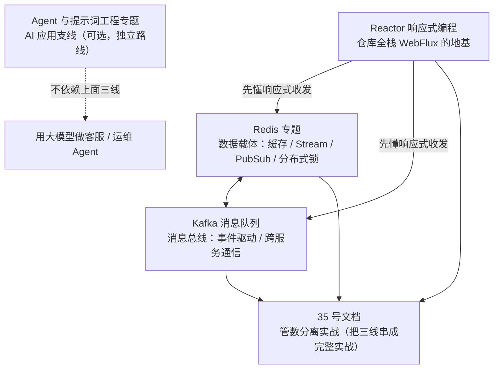
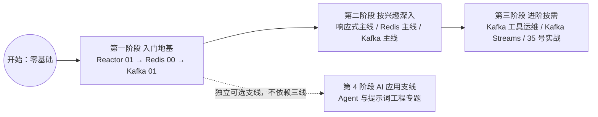

# 附录 · 初学者学习路线总览（先读这份）

> **这份文档是什么**：给**零基础初学者**的一份"我该按什么顺序读"的路线图。附录里有很多专题文件夹，新手最容易困惑"从哪开始、读到哪算完"。这份总览把最核心的 **5 个文件夹**（基础设施主干）串成一条**清晰的进阶路径**，再配一个可选的 **AI 应用支线**（[Agent 与提示词工程专题](./Agent与提示词工程专题/README.md)）——读完这条线，你就有能力读任何一份专题，也能读懂 [35 号文档](../tutorials/spring-ai-2.0/35-管数分离实战-从Sinks到Kafka演进.md) 这样的实战教程。

---

## 0. 一句话

> **学三条线，拼一个系统**：
> **响应式（Reactor）** 是地基 → **Redis** 是数据载体 → **Kafka** 是消息总线。
> 先用最小集入门（每条线读 1 篇），再按需深入。别一口气全读。

---

## 1. 各文件夹是什么角色

| 文件夹 | 角色 | 一句话 |
|--------|------|--------|
| [Reactor 响应式编程](./Reactor响应式编程/README.md) | **地基** | 理解整个仓库 WebFlux/流式代码的前提 |
| [Redis 专题](./Redis专题/README.md) | **数据载体** | 缓存、Stream/Pub/Sub、分布式锁 |
| [Kafka 消息队列实战专题](./Kafka消息队列实战专题/README.md) | **消息总线** | 事件驱动、跨服务通信的主干 |
| [Kafka 工具与运维专题](./Kafka工具与运维专题/README.md) | **工具** | 可视化、部署（按需读） |
| [Kafka Streams 流处理专题](./Kafka-Streams流处理专题/README.md) | **流计算** | 在消息流上做实时计算（进阶） |
| [Agent 与提示词工程专题](./Agent与提示词工程专题/README.md) | **AI 应用（可选支线）** | 大模型应用入门：提示词怎么写、Agent 是什么（**独立路线**，不依赖上面五线） |

**依赖关系**：Reactor 是地基（仓库全栈是 WebFlux 响应式）；Redis 和 Kafka 是两类中间件（可并行学，但都要先懂 Reactor 的响应式收发的坑）。

**整体依赖**：



---

## 2. 初学者主线路径（按顺序读）

**主线路径**：



### 第一阶段：入门地基（3 篇，必读）

| 顺序 | 读什么 | 读完你会 |
|:---:|--------|---------|
| **①** | [Reactor 01 响应式入门](./Reactor响应式编程/01-Reactor响应式入门.md) | 懂 `Mono`/`Flux`、冷流热流、订阅机制——仓库一切响应式代码的前提 |
| **②** | [Redis 00 基础与 Spring Boot 使用](./Redis专题/00-Redis基础与SpringBoot使用.md) | 起 Redis、敲五种数据结构、在 Spring Boot 里收发 |
| **③** | [Kafka 01 消息队列从入门到架构师](./Kafka消息队列实战专题/01-Kafka消息队列从入门到架构师.md) | 用 `KafkaTemplate`/`@KafkaListener` 收发消息，懂 topic/分区/offset/消费组 |

> **为什么不直接读 35 号文档？** 35 号是"实战"，会用到这三篇的概念。先把地基打好，读 35 号才不卡壳。

### 第二阶段：按兴趣深入（各选主线）

**响应式主线**（如果你要写 WebFlux/流式代码）：
```
Reactor 02 Flux速查 → 03 Sinks → 04 背压 → 06 调度器 → 07 错误处理 → 08 练手小项目
```
> 06 调度器（subscribeOn/publishOn）和 07 错误处理是**新手两大坎**，必看；**08 练手小项目**把 01-07 串成"实时股票行情推送"应用，敲完它你就"会用"了。

**Redis 主线**：
```
Redis 01 Streams/PubSub → 02 分布式锁 → 03 缓存实战
```

**Kafka 主线**（企业消息系统）：
```
Kafka 02 进阶 → 03 事件驱动微服务 → 04 生产级(Outbox/Schema) → 05 实践项目 → 06 可靠性 → 07 Kafka Connect → 08 面试题复盘
```
> 05 是动手敲、06 是可靠性编码、07 是数据管道——都建立在 01-04 上；08 面试题用来自测巩固。

### 第三阶段：进阶/按需

- **Kafka 工具运维**：做项目时按需（可视化 01、Conduktor 部署 02）。
- **Kafka Streams**：要做实时计算/仪表盘时读（01 流处理、02 选型与 ksqlDB），**前置**是 Kafka 02 第 3 章。
- **35 号文档**：把 Reactor + Redis + Kafka 串成一套完整实战（管数分离），读完前两阶段后回头看会豁然开朗。

### 第 4 阶段：AI 应用支线（可选，独立路线）

**完全不依赖上面的三线**。想做"用大模型写代码、做客服/运维 Agent"的，直接读 [Agent 与提示词工程专题](./Agent与提示词工程专题/README.md)——它从"我该不该学提示词工程"讲起，一路到能写带工具、护栏、评估的 Agent。读完想深入代码实现，再去 [tutorials/agent](../tutorials/agent/00-阶段总览.md)（Java 框架实操）或 [spring-ai-2.0 系列](../tutorials/spring-ai-2.0/00-目录索引.md)。

---

## 3. 每个节点的"你会什么 / 下一步学什么"

| 阶段节点 | 你已经会 | 下一步 |
|---------|---------|--------|
| Reactor 01 | Mono/Flux 心智模型 | 02 速查（查操作符）/ 04 背压 |
| Redis 00 | 数据结构 + SpringBoot 收发 | 01 Streams（消息载体）/ 03 缓存 |
| Kafka 01 | 收发 + 核心概念 | 02 进阶（生产调优）/ 03 事件驱动 |
| 三线入门完成 | 能读懂大部分响应式代码 | 35 号文档实战，或按兴趣深入第二阶段 |
| Agent 专题读完（可选支线） | 会写结构化提示词、懂 Agent 心智模型 | 深入 [tutorials/agent](../tutorials/agent/00-阶段总览.md) 或 [spring-ai-2.0](../tutorials/spring-ai-2.0/00-目录索引.md) 写代码 |

---

## 4. 常见误区（新手必看）

1. **跳过 Reactor 直接学 Kafka/Redis**：仓库全是 WebFlux 响应式栈，不懂 Reactor，Kafka/Redis 的响应式收发代码你会看不懂"为什么这样写"。
2. **一口气把整个文件夹读完**：不要。每条线先读主线 1-2 篇入门，用到再深读。附录是"字典"，不是"小说"。
3. **跳读 35 号文档**：35 号是进阶实战，前置概念（响应式/Redis Stream/Kafka）跳过了会很吃力。
4. **只背 API 不敲**：每个文档都有"本章验证"，敲一遍比读十遍强。

---

## 5. 附：这条路线对应的能力

| 读完 | 你能 |
|------|------|
| 三线入门（第一阶段） | 看懂 35 号文档的主线代码 |
| 响应式主线 + Redis 主线 | 自己写 WebFlux + Redis 的流式/缓存代码 |
| Kafka 主线全读完 | 设计并实现事件驱动微服务（Saga/Outbox/可靠性） |
| + Kafka Streams | 做实时聚合/仪表盘 |
| + Agent 专题（可选支线） | 用大模型做带工具/护栏/评估的 Agent 应用 |

> **最后一句**：路线是死的，人是活的。哪条线是你当前项目最需要的，就先深入那条。**入门三篇（Reacto 01 / Redis 00 / Kafka 01）是无论如何都建议先读的**——它们是整个仓库的地基。
