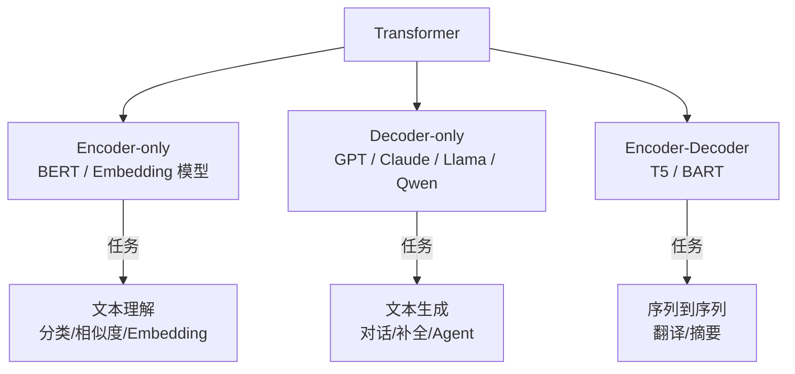
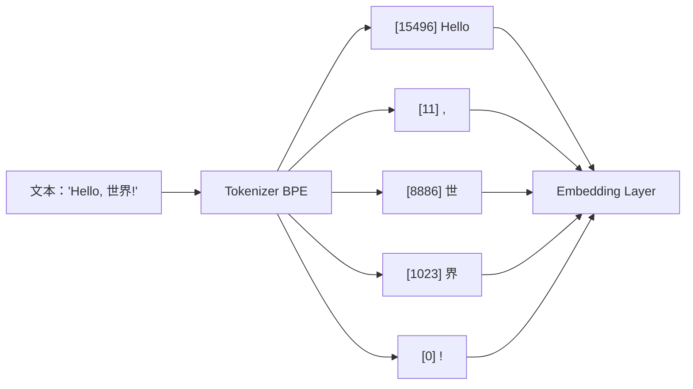
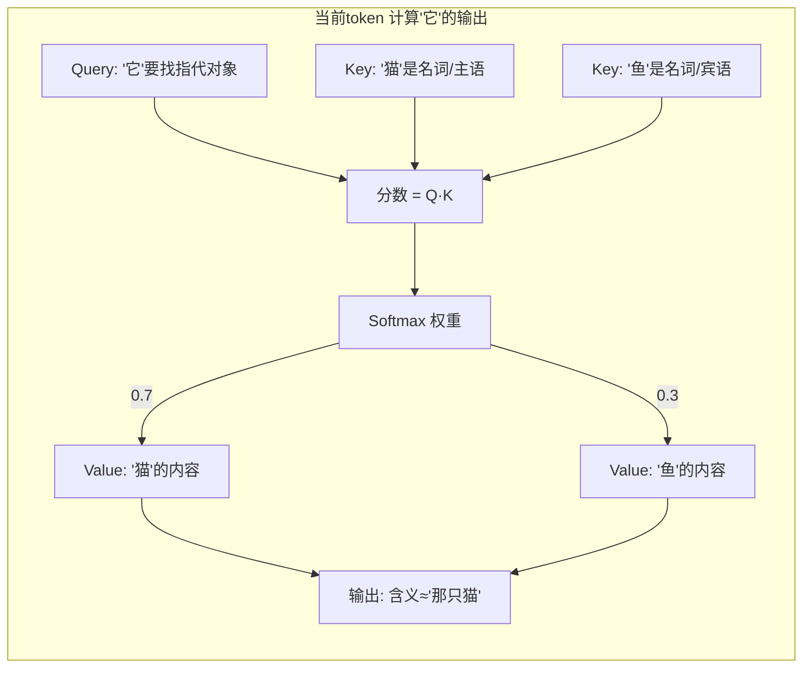
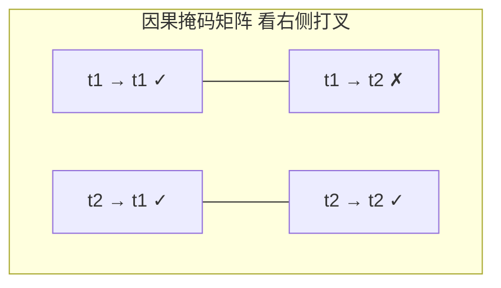
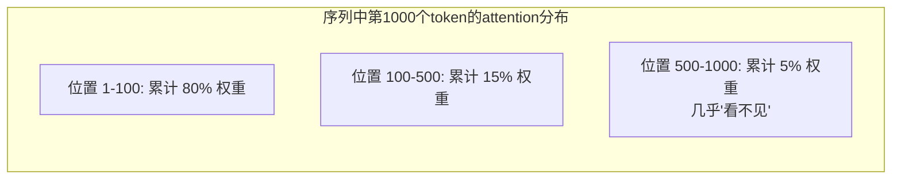
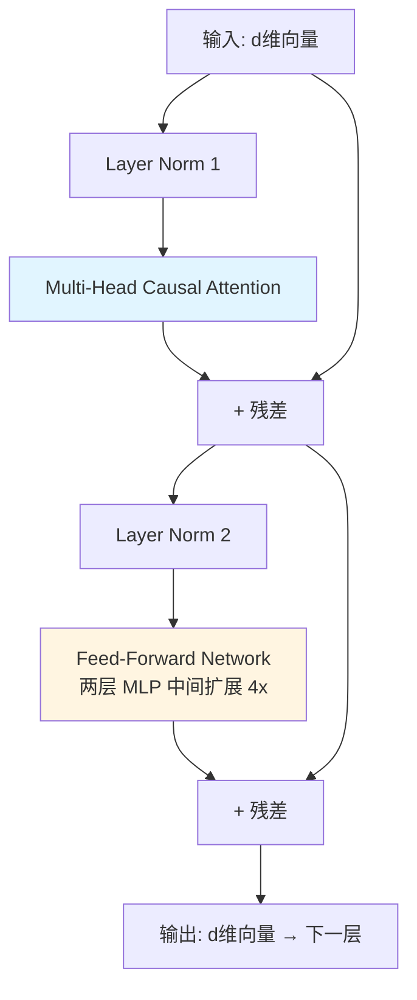
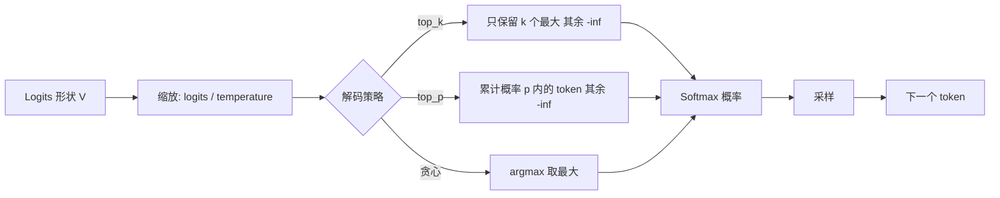
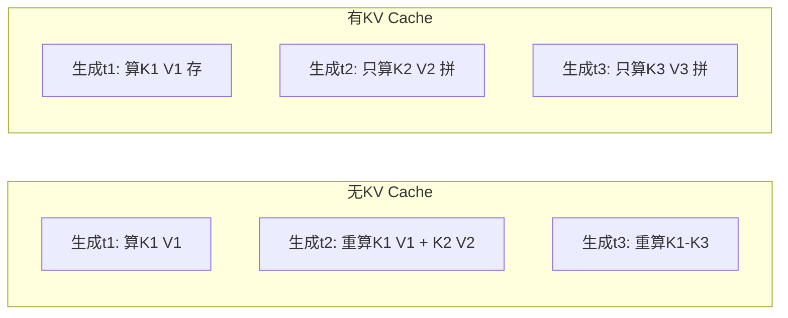

# Transformer 架构：注意力机制的本质

> 「本文是对 [教程 05-RAG §2] 的深入展开」
>
> 技术栈：Spring Boot 4.1 + Spring AI 2.0.0 + WebFlux + Java 21

## 1. 为什么 Spring AI 工程师要懂 Transformer

`ChatClient`、`EmbeddingModel`、`VectorStore` 这些抽象屏蔽了底层模型细节，日常开发并不需要写 attention 代码。但理解 Transformer 的工程师在以下场景拥有显著优势：

- **调参时知道每个参数在改什么**：`temperature` 影响的是 softmax 平滑度，`top_p` 截断的是概率分布尾部，`repetition_penalty` 改的是 logits 缩放——不懂前向过程就只能瞎试。
- **读懂 RAG 失败的原因**：检索片段为什么"明明在文档里却没被采用"？往往与 attention 的远程衰减、上下文窗口的"位置编码截断"有关。
- **架构决策有依据**：选 8K 还是 128K 上下文？是否值得做 KV cache？长文档切分粒度怎么定？这些都需要回到模型工作机制。

本文自底向上拆解 Transformer，重点放在与 Spring AI 应用层直接相关的工作机制上。

## 2. 整体结构：Encoder、Decoder 与三大家族

Transformer 论文（Attention Is All You Need, 2017）提出的是 Encoder-Decoder 结构。今天的模型分三大谱系：



| 谱系 | 代表模型 | 典型用途 | Spring AI 对应 |
|------|---------|---------|----------------|
| Encoder-only | BERT、bge、e5 | Embedding、分类 | `EmbeddingModel` |
| Decoder-only | GPT-4、Claude、Qwen | 对话、生成、Agent | `ChatModel` |
| Encoder-Decoder | T5、BART | 翻译、摘要 | `ChatModel`（少用） |

**今天 95% 的 LLM 应用是 Decoder-only**——这是 ChatGPT/Claude/Qwen 等大模型的主流架构。本文重点讲 Decoder-only，Encoder-only 留到 [01-Embedding原理] 详述。

## 3. Token：Transformer 的最小单元

模型不直接处理字符，而是处理 **token**。token 由 tokenizer（BPE、WordPiece、SentencePiece）从文本切分得到，介于"字符"和"词"之间。



关键工程含义：

- **中文与英文的 token 效率不同**：中文常 1 字 = 1~2 token，英文 1 词 ≈ 1.3 token。同样的 token 预算，中文承载的信息密度更低。
- **代码 token 昂贵**：缩进、括号、关键字都会消耗 token。给 Agent 喂大段代码时务必做摘要。
- **token 数直接决定成本与延迟**：OpenAI 按 input+output token 计价；延迟与生成长度近似线性。Spring AI 的 `Usage` 对象能读出这些字段，应进入 Observability 指标。

## 4. Embedding：从 token 到向量

每个 token 通过一个可学习的 embedding 矩阵映射为 d 维向量（d=4096/8192 等模型规格）。这一层本质是"查表"：`embedding = W[token_id]`。

但这只是**静态 embedding**——同一个词在任何句子里都是同一个向量。Transformer 的核心创新是在此基础上叠加**多层动态上下文**，让每个 token 的表示随周围 token 变化。

```
"苹果" 在 "吃了一个苹果" 和 "苹果发布了 iPhone" 里
静态 embedding 相同
经过多层 attention 后的表示截然不同
```

这就是为什么 `EmbeddingModel`（只用静态 embedding 或浅层 encoder）对多义词效果差，而完整 LLM 不存在这个问题。

## 5. 自注意力：Transformer 的核心机制

### 5.1 直觉

对序列中的每个 token，注意力机制问三个问题：

- **Query（Q）**：我（当前 token）想找什么样的信息？
- **Key（K）**：我（其他 token）能提供什么样的信息？
- **Value（V）**：如果我（其他 token）被选中，我会贡献什么内容？

最终输出 = softmax(Q·K^T / √d) · V。这是一个**加权平均**：当前 token 对每个其他 token 算一个"相关度分数"，然后按分数加权求和。



例：句子 "猫吃了鱼，它很满足" 中的 "它"，attention 分数会偏向 "猫"（主语、语义匹配），最终 "它" 的表示被注入了 "猫" 的语义。

### 5.2 多头注意力（Multi-Head Attention）

单一 attention 只能学一种"关注模式"。多头并行多个 attention，每个头学不同模式：有的头专门看句法依赖、有的看指代消解、有的看实体关系。最终拼接所有头的输出做线性变换。

```
head_1: 语法角色（主谓宾）
head_2: 共指消解（"它"→"猫"）
head_3: 实体关系（"苹果"→"公司"）
...
head_h: 长距离依赖
```

层数（depth）和头数（heads）共同决定模型的"理解力"。GPT-4 / Claude 这类模型通常 32~96 层，每层 32~128 头。

### 5.3 因果掩码（Causal Mask）：Decoder 的关键约束

Decoder-only 模型生成文本时**只能看到左侧 token**，不能看右侧（否则训练时就泄露了答案）。通过在 attention 分数矩阵上加一个上三角掩码（未来位置 = -∞，softmax 后权重为 0）实现。



这条约束有一个直接的工程后果：**Decoder 推理无法并行**——生成第 N 个 token 必须等前 N-1 个生成完。这是 LLM 流式逐字输出、且长文本延迟随长度增加的根本原因。

## 6. 位置编码：让模型知道顺序

attention 本身是**置换不变的**（打乱 token 顺序结果不变）。为了让模型感知顺序，必须在输入里注入位置信息。

| 方案 | 代表模型 | 特点 |
|------|---------|------|
| 正弦位置编码 | 原始 Transformer | 绝对位置，外推性差 |
| 可学习位置编码 | GPT-2、BERT | 训练长度固定，超出失效 |
| ALiBi | BLOOM | 偏置随距离衰减，可外推 |
| RoPE（旋转位置编码） | Llama、Qwen、DeepSeek | 通过旋转变换编码相对位置，外推性强 |

今天主流大模型几乎都用 **RoPE**。它的关键性质：

- 编码的是**相对位置**（两个 token 的距离），而非绝对位置。
- 通过旋转矩阵作用在 Q 和 K 上，attention 内积天然变成"距离的函数"。
- **外推性**：训练时见过的最大长度之外，仍能给出合理（虽非完美）的位置信号——这就是为什么很多模型支持"扩展上下文"（如 32K → 128K）。

理解 RoPE 后，下面两个工程问题就有答案：

- **为什么模型有"最大上下文长度"**：训练时 RoPE 见过的距离有上限，超出后位置编码失真。
- **为什么长上下文不一定效果好**：虽然有外推，但 attention 的远程信号本就稀薄（详见 §7），扩展窗口 ≠ 提升远程理解。

## 7. 注意力的"远程衰减"与长上下文困境

实验观察：标准 attention 对**近距离 token**的关注权重远高于远距离。这有数学根源——softmax 归一化后，分数会被"赢家"主导，远处弱信号几乎被忽略。



这条性质解释了 RAG 中的经典现象：

- **"lost in the middle"**：长上下文里，中间位置的信息被忽略。Haynes et al. 2024 的实验表明，把关键事实放在上下文开头或结尾时模型表现显著好于中间。
- **检索片段排序很重要**：把最相关的片段放在 prompt 头尾而非中间。
- **RAG 优于无检索长 prompt**：与其塞 100K 文档让 attention 自己找，不如先检索 top-5 精准喂入。

## 8. 前向传播的完整数据流

一个 Decoder 层的内部：



要点：

1. **残差连接**：每层输出 = 输入 + 子层变换，使深层网络可训练（梯度能直通）。
2. **Pre-LN**：现代模型用 Pre-LN（先归一化再进子层），训练更稳定。
3. **FFN 是参数量大头**：两个线性层中间夹 GELU/SwiGLU，中间维度通常是 d 的 4 倍。整个 Transformer 70%+ 参数在 FFN。
4. **层叠**：上述结构重复 L 次（L=32/64/96），最后一层输出经 LM head（线性层 + softmax）得到下一个 token 的概率分布。

## 9. 解码策略：从 logits 到 token

模型每一步输出的是一个**词表大小的 logits 向量**，需要"解码策略"把它变成最终 token：



| 参数 | 作用 | 调小 | 调大 |
|------|------|------|------|
| `temperature` | 缩放 logits | 更确定、保守、重复 | 更随机、多样、发散 |
| `top_p` | 核采样截断 | 候选更少、更确定 | 候选更多、更多样 |
| `top_k` | 截断候选数 | 同上 | 同上 |
| `max_tokens` | 生成长度上限 | 短回答 | 长回答，可能截断 |
| `frequency_penalty` | 抑制已出现 token | 重复多 | 重复少 |
| `presence_penalty` | 抑制已出现过的主题 | 主题集中 | 主题发散 |

工程经验：

- **代码生成 / 工具调用**：`temperature=0~0.3`，`top_p=0.9`，求稳定。
- **创意写作 / 头脑风暴**：`temperature=0.8~1.2`，求多样。
- **Eval 评估**：`temperature=0`（贪心），保证可复现。
- **生产环境避免极端值**：`temperature>1.5` 经常产生乱码，`top_p<0.1` 容易死循环。

Spring AI 通过 `ChatOptions` / `OpenAiChatOptions` / `AnthropicChatOptions` 暴露这些参数，建议把它们做成**按场景预设的 profile**，而不是让业务代码每次手填。

## 10. KV Cache：推理加速的关键

生成第 N 个 token 时，前面 N-1 个 token 的 K、V 矩阵可以**复用**——它们在前一步已经算过且不依赖当前位置。把每层的 K、V 缓存下来，每步只算新 token 的 K、V，能大幅降低重复计算。



KV cache 是 LLM 推理的核心优化，但也带来两个工程问题：

- **显存占用随上下文线性增长**：128K 上下文的 KV cache 可能比模型权重还大。这是长上下文推理昂贵的根本原因。
- **批处理冲突**：不同请求的 KV cache 不能混。这就是为什么 batch 推理对长上下文收益有限。

主流推理框架（vLLM、SGLang、TensorRT-LLM）的核心创新几乎都围绕 KV cache 的管理（PagedAttention 等）。详见 [10-语义缓存与性能/01-Prompt缓存与KVCache]。

## 11. 训练阶段：预训练 → SFT → RLHF/DPO

| 阶段 | 关键点 |
|------|--------|
| 预训练 | 万亿 token 自回归 |
| SFT 监督微调 | 指令-回答对 |
| RLHF / DPO | 人类偏好对齐 |
| Chat 模型上线 | — |

| 阶段 | 数据 | 目标 | 产出 |
|------|------|------|------|
| 预训练 | 海量无标注文本 | 学语言规律 | Base 模型（只会续写） |
| SFT | 指令-回答对 | 学会"按指令回答" | Instruct 模型 |
| RLHF / DPO | 偏好对比数据 | 对齐人类价值观 | Chat 模型 |

**Spring AI 开发者通常直接用 Chat 模型**，但理解这个谱系能解释：

- **为什么 Base 模型不能直接做 Agent**：没经过 SFT，不会遵循指令。
- **为什么相同模型不同版本行为差异大**：SFT/RLHF 数据变化导致对齐方向改变。
- **为什么开源模型工具调用能力弱**：很多开源模型 SFT 数据里没有 function calling 格式，需要自己微调或用强约束 prompt。

## 11（补充）、解码参数在 Spring AI 中的落地

理解了 §9 的解码策略后，下面看它如何映射到 Spring AI 2.0 的 `ChatOptions`。不同任务场景应使用不同的参数 profile，而不是每次手填。

```java
/**
 * 按场景预设解码参数 profile。
 * 把这些 profile 做成 Bean，业务代码注入即可，避免散落的硬编码。
 */
public class DecodeProfiles {

    /** 代码生成 / 工具调用：求稳定，低温度 */
    public static ChatOptions codeGeneration() {
        return OpenAiChatOptions.builder()
            .withTemperature(0.2)
            .withTopP(0.9)
            .withMaxTokens(4096)
            .withFrequencyPenalty(0.0)
            .build();
    }

    /** 创意写作：求多样，高温度 */
    public static ChatOptions creativeWriting() {
        return OpenAiChatOptions.builder()
            .withTemperature(0.9)
            .withTopP(0.95)
            .withFrequencyPenalty(0.5)   // 抑制重复用词
            .withPresencePenalty(0.3)    // 鼓励主题发散
            .build();
    }

    /** Eval 评估：贪心，可复现 */
    public static ChatOptions eval() {
        return OpenAiChatOptions.builder()
            .withTemperature(0.0)        // 贪心解码
            .withTopP(1.0)
            .withSeed(42L)               // 固定随机种子
            .build();
    }
}

// 使用示例
@Service
public class CodeAgentService {
    private final ChatClient client;

    public String generateCode(String spec) {
        return client.prompt()
            .user(spec)
            .options(DecodeProfiles.codeGeneration())
            .call()
            .content();
    }
}
```

| Profile | temperature | top_p | 适用 |
|---------|-------------|-------|------|
| codeGeneration | 0.2 | 0.9 | 代码、工具调用、SQL |
| creativeWriting | 0.9 | 0.95 | 文案、头脑风暴 |
| eval | 0.0 | 1.0 | 评估测试、CI 回归 |
| 客服对话 | 0.5 | 0.9 | 日常对话 |

**生产环境禁忌**：`temperature > 1.5`（乱码）、`top_p < 0.1`（死循环）、`max_tokens` 不设上限（成本失控）。

## 12. 总结

Transformer 的核心是**多头自注意力**，它让序列中每个位置都能"看见"其他位置并加权融合信息。围绕这个核心，工程师必须建立以下心智模型：

1. **Token 是最小单元**：所有成本与延迟以 token 计，中文与英文效率不同。
2. **Attention 有远程衰减**：长上下文中中间信息容易丢失，RAG 检索 + 头尾摆放比超长 prompt 更可靠。
3. **RoPE 决定上下文上限**：训练时见过的最大长度外推能力有限，扩窗口 ≠ 改能力。
4. **解码策略直接影响输出**：`temperature/top_p` 是工程可调旋钮，按场景预设 profile。
5. **KV Cache 是推理加速命脉**：理解它才能解释为什么长上下文昂贵、为什么 batch 长请求收益差。
6. **训练谱系决定能力边界**：Base / Instruct / Chat 三档对应不同可用性，Agent 必须用 Chat 模型。

这些知识会在 [01-Embedding原理]（向量表示的几何性质）和 [02-上下文窗口与Token]（token 计数与窗口管理）继续延伸，并在 [教程 05-RAG] 中被反复印证。理解了 Transformer，再回到 Spring AI 的 `ChatModel.call(prompt)` 时，那行代码背后发生的事情就有了形状。
