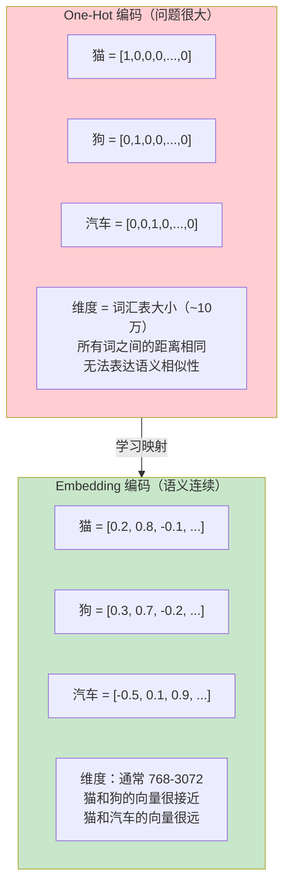
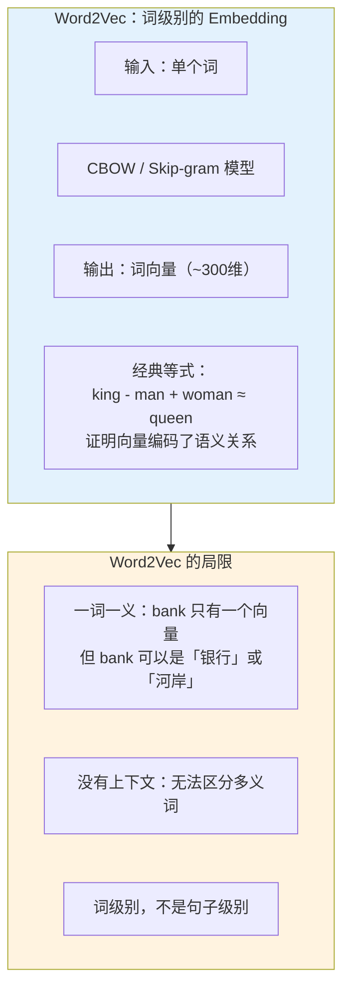
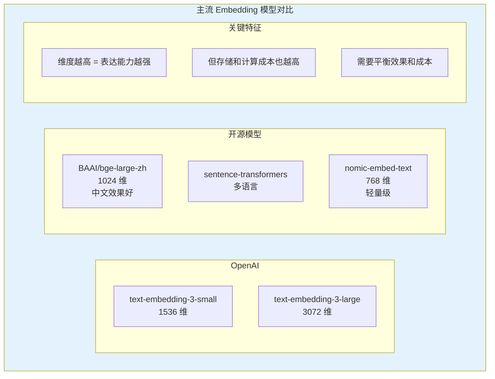
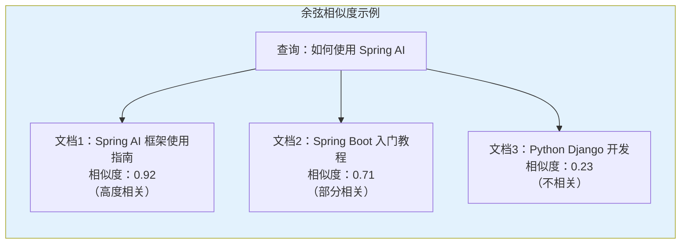
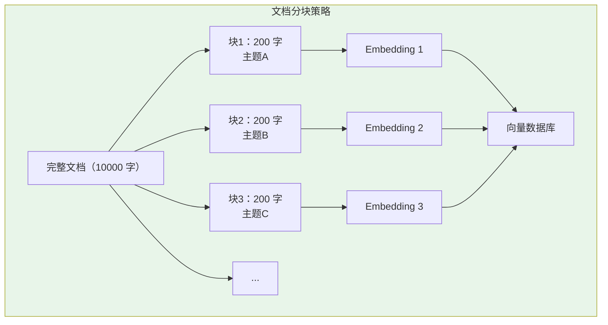
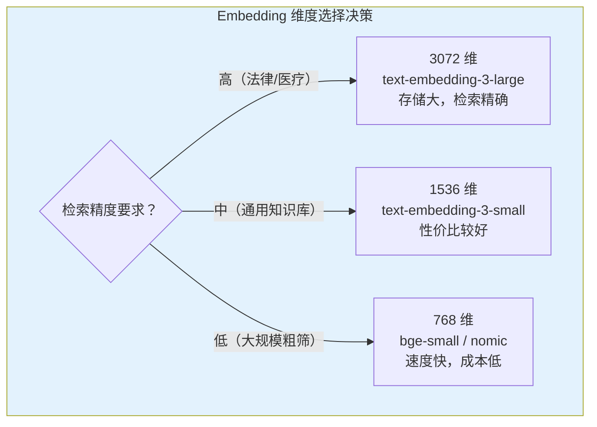
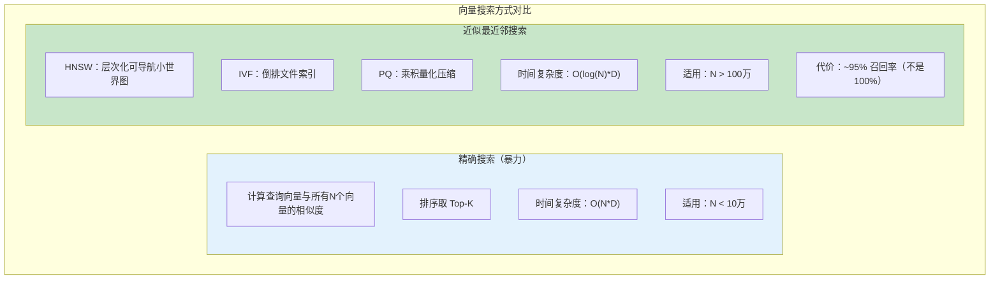

# Embedding 原理：向量表示与语义相似度

> 「本文是对 [教程 05-RAG §2-§3] 的深入展开」

> **定位**：系统讲解 Embedding（词嵌入/句嵌入）的数学原理——从 Word2Vec 到 Transformer Embedding、向量空间模型、余弦相似度、Spring AI 2.0 的 EmbeddingModel API，以及 RAG 场景中 Embedding 的工程实践。
>
> **读者画像**：有基本数学基础，想理解 RAG 检索"为什么能找到相关文档"背后原理的开发者。

---

## 1. Embedding 是什么

### 1.1 从离散到连续

计算机处理文本的第一步是将文字变成数字。最简单的方式是 One-Hot 编码：



### 1.2 Embedding 的核心思想

Embedding 的目标：**把离散的文本映射到连续的向量空间，使得语义相似的文本在向量空间中距离相近**。

```java
// 在 Spring AI 中，Embedding 就是一组浮点数
float[] embedding = embeddingModel.embed("Spring AI 是一个 AI 框架");
// embedding = [0.0234, -0.0871, 0.1543, ..., 0.0421]  // 通常 768 或 1536 维

// 语义相似的文本，向量也相似
float[] similar = embeddingModel.embed("Spring AI 是 Spring 官方的 AI 开发框架");
// similar 的值会非常接近 embedding

// 语义不相关的文本，向量差异大
float[] different = embeddingModel.embed("今天天气真好");
// different 的值与 embedding 差异很大
```

---

## 2. Embedding 的演化

### 2.1 Word2Vec（2013）



### 2.2 上下文 Embedding（BERT/GPT 时代）

Transformer 架构的革命性在于：**同一个词在不同上下文中产生不同的 Embedding**。

```java
// "bank" 在不同上下文中，Embedding 不同
float[] bankFinancial = embeddingModel.embed("I went to the bank to deposit money");
float[] bankRiver = embeddingModel.embed("I sat by the river bank");
// bankFinancial 和 bankRiver 是不同的向量
// 因为 Embedding 模型考虑了整个句子的上下文
```

### 2.3 现代 Embedding 模型



---

## 3. 向量空间与相似度

### 3.1 余弦相似度（Cosine Similarity）

Embedding 最常用的距离度量是余弦相似度——衡量两个向量方向的接近程度：

```java
public class CosineSimilarity {

    /**
     * 余弦相似度 = dot(a, b) / (|a| * |b|)
     * 范围：[-1, 1]
     * 1 = 方向完全一致（语义相同）
     * 0 = 正交（语义无关）
     * -1 = 方向相反（语义对立）
     */
    public static double cosine(float[] a, float[] b) {
        double dotProduct = 0;
        double normA = 0;
        double normB = 0;

        for (int i = 0; i < a.length; i++) {
            dotProduct += a[i] * b[i];
            normA += a[i] * a[i];
            normB += b[i] * b[i];
        }

        return dotProduct / (Math.sqrt(normA) * Math.sqrt(normB));
    }
}
```



### 3.2 其他距离度量

| 度量 | 公式 | 特点 | 适用场景 |
|------|------|------|---------|
| **余弦相似度** | dot/(|a|*|b|) | 只看方向 | 文本语义（最常用） |
| **欧几里得距离** | sqrt(Σ(ai-bi)^2) | 看绝对距离 | 图像、数值 |
| **点积** | Σ(ai*bi) | 简单快速 | 向量已归一化时等价于余弦 |
| **曼哈顿距离** | Σ|ai-bi| | 网格距离 | 稀疏向量 |

```java
// 不同距离度量的实现
public class VectorDistances {

    public static double euclidean(float[] a, float[] b) {
        double sum = 0;
        for (int i = 0; i < a.length; i++) {
            double diff = a[i] - b[i];
            sum += diff * diff;
        }
        return Math.sqrt(sum);
    }

    public static double dotProduct(float[] a, float[] b) {
        double sum = 0;
        for (int i = 0; i < a.length; i++) {
            sum += a[i] * b[i];
        }
        return sum;
    }

    // 如果向量已归一化（|v|=1），点积 = 余弦相似度
    // 大多数 Embedding 模型输出的向量已归一化
}
```

---

## 4. Spring AI 的 EmbeddingModel

### 4.1 基本用法

```java
@Service
public class EmbeddingService {

    private final EmbeddingModel embeddingModel;

    // 单文本嵌入
    public float[] embed(String text) {
        return embeddingModel.embed(text);
    }

    // 批量嵌入（更高效）
    public List<float[]> embedBatch(List<String> texts) {
        return embeddingModel.embed(texts, EmbeddingOptionsBuilder.builder().build());
    }
}
```

### 4.2 与向量数据库结合

```java
@Service
public class DocumentIndexService {

    private final EmbeddingModel embeddingModel;
    private final VectorStore vectorStore;

    // 索引文档
    public void indexDocuments(List<Document> documents) {
        // Spring AI 自动完成：Embedding + 存储
        vectorStore.add(documents);
    }

    // 语义搜索
    public List<Document> semanticSearch(String query, int topK) {
        return vectorStore.similaritySearch(
            SearchRequest.builder()
                .query(query)
                .topK(topK)
                .similarityThreshold(0.7)  // 相似度阈值
                .build()
        );
    }
}
```

### 4.3 Embedding 模型配置

```yaml
spring:
  ai:
    openai:
      embedding:
        options:
          model: text-embedding-3-small    # 模型名
          dimensions: 1536                  # 维度（3-small 支持降维）
```

```java
// 使用不同的 Embedding 模型
@Bean
public EmbeddingModel embeddingModel(OpenAiConnectionProperties props) {
    // 可以配置多个 EmbeddingModel，根据场景选择
    return new OpenAiEmbeddingModel(
        openAiApi,
        MetadataMode.EMBED,
        OpenAiEmbeddingOptions.builder()
            .model("text-embedding-3-large")
            .dimensions(3072)  // 高维度 = 更精确
            .build()
    );
}
```

---

## 5. RAG 中的 Embedding 工程

### 5.1 分块（Chunking）策略

Embedding 是对"一段文本"的向量化。太长的文档需要先分块：



```java
@Service
public class DocumentChunkingService {

    private final EmbeddingModel embeddingModel;
    private final VectorStore vectorStore;

    public void indexDocument(Document document) {
        // Spring AI 内置的 TokenTextSplitter
        TokenTextSplitter splitter = new TokenTextSplitter(
            500,   // 每块最大 token 数
            100,   // 重叠区（保留上下文连贯性）
            10,    // 最小块大小
            5000,  // 最大块大小
            true
        );

        List<Document> chunks = splitter.split(document);

        // 为每个块添加元数据
        chunks.forEach(chunk -> {
            chunk.getMetadata().put("source", document.getMetadata().get("file_name"));
            chunk.getMetadata().put("chunk_index", chunks.indexOf(chunk));
            chunk.getMetadata().put("total_chunks", chunks.size());
        });

        // 批量嵌入并存储
        vectorStore.add(chunks);
    }
}
```

### 5.2 查询优化

```java
@Service
public class QueryOptimizationService {

    private final ChatClient chatClient;
    private final EmbeddingModel embeddingModel;
    private final VectorStore vectorStore;

    public List<Document> optimizedSearch(String userQuery) {
        // 1. 查询改写（Query Rewriting）
        String expandedQuery = chatClient.prompt()
            .system("""
                将用户问题改写为更适合检索的关键词形式。
                保持语义不变，使用更精确的术语。
                只输出改写后的问题。
                """)
            .user(userQuery)
            .call()
            .content();

        // 2. 用改写后的查询做向量搜索
        return vectorStore.similaritySearch(
            SearchRequest.builder()
                .query(expandedQuery)
                .topK(5)
                .similarityThreshold(0.75)
                .build()
        );
    }
}
```

---

## 6. Embedding 的维度与成本

### 6.1 维度选择



### 6.2 成本计算

```java
// OpenAI Embedding 定价参考（2026年）
// text-embedding-3-small: $0.02 / 1M tokens
// text-embedding-3-large: $0.13 / 1M tokens

// 索引 100 万篇文档（每篇 ~500 tokens）的成本估算：
// small: 1,000,000 * 500 / 1,000,000 * $0.02 = $10
// large: 1,000,000 * 500 / 1,000,000 * $0.13 = $65
```

### 6.3 向量降维

OpenAI 的 text-embedding-3 系列支持原生降维——高维模型输出低维向量：

```java
@Bean
public EmbeddingModel embeddingModel() {
    return new OpenAiEmbeddingModel(
        openAiApi,
        MetadataMode.EMBED,
        OpenAiEmbeddingOptions.builder()
            .model("text-embedding-3-large")
            .dimensions(1024)  // 从 3072 降到 1024，减少存储
            .build()
    );
}
```

---

## 7. 向量索引与近似最近邻搜索

### 7.1 精确搜索 vs 近似搜索

当向量数据库中有百万级向量时，计算每个向量的余弦相似度太慢。实际系统使用**近似最近邻（ANN）搜索**：



### 7.2 Spring AI 向量数据库的选择

```java
// 不同向量数据库的 ANN 支持
// Pinecone: HNSW + PQ
// Milvus: HNSW / IVF / DiskANN
// Weaviate: HNSW
// pgvector: HNSW / IVFFlat
// Chroma: HNSW

// pgvector 示例：创建 HNSW 索引
// CREATE INDEX ON documents USING hnsw (embedding vector_cosine_ops)
// WITH (m = 16, ef_construction = 64);
```

---

## 8. Embedding 质量评估

### 8.1 检索质量指标

```java
public class RetrievalQualityEvaluator {

    record EvalSet(
        List<QueryDocPair> pairs  // 查询-相关文档对
    ) {}

    record QueryDocPair(
        String query,
        String relevantDocId,      // 已知相关的文档ID
        List<String> irrelevantDocIds  // 已知不相关的文档ID
    ) {}

    // 计算 Recall@K：前K个结果中包含正确文档的比例
    public double recallAtK(VectorStore store, EvalSet evalSet, int k) {
        int hits = 0;

        for (QueryDocPair pair : evalSet.pairs()) {
            List<Document> results = store.similaritySearch(
                SearchRequest.builder()
                    .query(pair.query())
                    .topK(k)
                    .build()
            );

            boolean found = results.stream()
                .anyMatch(doc -> doc.getId().equals(pair.relevantDocId()));

            if (found) hits++;
        }

        return (double) hits / evalSet.pairs().size();
    }

    // 计算 MRR（Mean Reciprocal Rank）：正确文档的排名倒数的均值
    public double mrr(VectorStore store, EvalSet evalSet) {
        double sum = 0;

        for (QueryDocPair pair : evalSet.pairs()) {
            List<Document> results = store.similaritySearch(
                SearchRequest.builder()
                    .query(pair.query())
                    .topK(10)
                    .build()
            );

            for (int i = 0; i < results.size(); i++) {
                if (results.get(i).getId().equals(pair.relevantDocId())) {
                    sum += 1.0 / (i + 1);
                    break;
                }
            }
        }

        return sum / evalSet.pairs().size();
    }
}
```

---

## 9. 常见问题与最佳实践

### 9.1 跨语言 Embedding

```java
// 多语言 Embedding 模型：不同语言的相同含义文本，向量应该相似
float[] zh = embeddingModel.embed("人工智能");
float[] en = embeddingModel.embed("artificial intelligence");
// 好的多语言模型：cosine(zh, en) > 0.85

// 推荐模型：text-embedding-3-large（多语言）、BAAI/bge-m3
```

### 9.2 长文本处理

```java
// Embedding 模型有输入长度限制（通常 512-8192 tokens）
// 超长文本需要分块后分别 Embedding

// 方法1：平均池化（简单但不精确）
float[] embedLongDocument(String longText) {
    List<Document> chunks = splitter.split(Document.builder().text(longText).build());
    List<float[]> embeddings = chunks.stream()
        .map(doc -> embeddingModel.embed(doc.getText()))
        .toList();

    // 对所有块的向量取平均
    return averageVectors(embeddings);
}

// 方法2：max pooling
// 方法3：使用支持长文本的 Embedding 模型（如 Voyage AI）
```

### 9.3 向量归一化

```java
// 确保 Embedding 向量归一化（|v| = 1）
// 大多数现代 Embedding 模型已自动归一化
// 如果不确定，可以手动归一化
float[] normalize(float[] vector) {
    double norm = 0;
    for (float v : vector) norm += v * v;
    norm = Math.sqrt(norm);

    float[] normalized = new float[vector.length];
    for (int i = 0; i < vector.length; i++) {
        normalized[i] = (float) (vector[i] / norm);
    }
    return normalized;
}
```

---

## 10. 总结

Embedding 是 RAG 和语义搜索的数学基础。理解它的工作原理，才能在工程实践中做出正确的决策：

1. **本质**：把文本映射到连续向量空间，语义相似的文本向量距离近
2. **上下文感知**：现代 Embedding 模型（基于 Transformer）根据上下文生成不同的向量
3. **余弦相似度** 是最常用的语义相似度度量——衡量向量方向的接近程度
4. **分块策略**：长文档需要分块后分别 Embedding，块大小影响检索精度
5. **维度选择**：768（轻量）→ 1536（标准）→ 3072（高精度），权衡效果与成本
6. **近似搜索**：百万级向量需要 ANN 算法（HNSW/IVF），牺牲少量精度换取巨大速度提升
7. **质量评估**：用 Recall@K 和 MRR 量化检索质量

在教程 05（RAG 检索增强生成）中，`VectorStore.similaritySearch()` 底层就是 Embedding + ANN 搜索。理解 Embedding 原理，才能优化分块策略、选择合适维度、调试检索质量问题。
