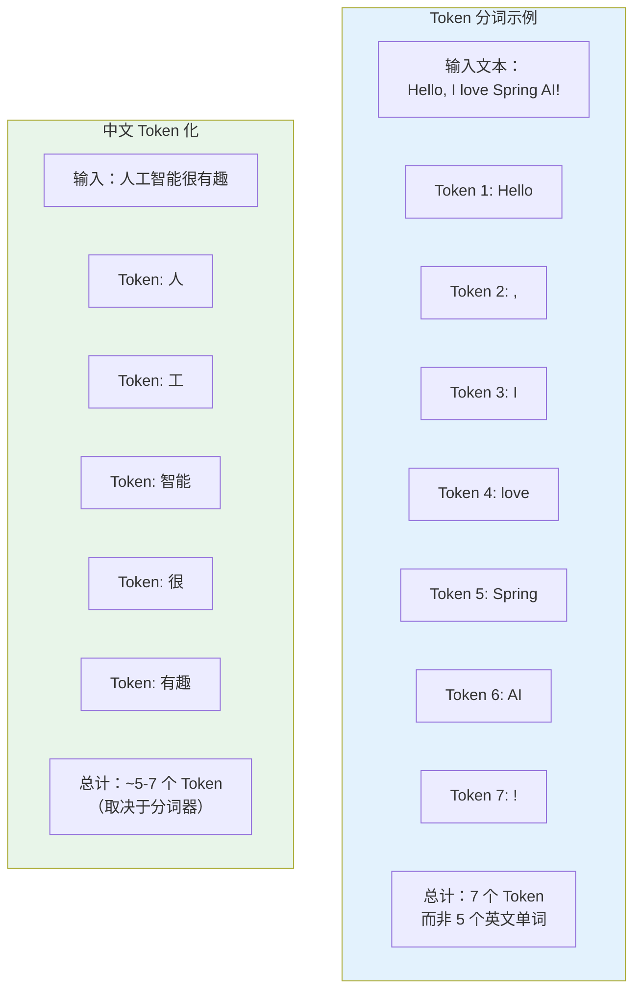
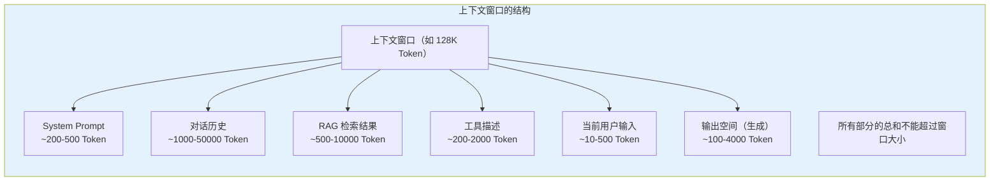
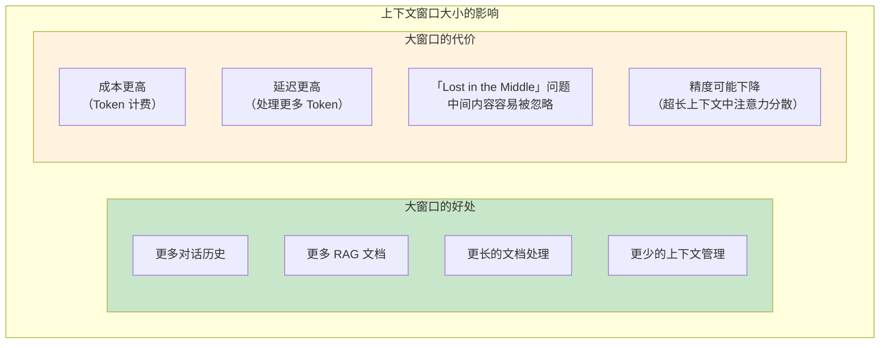
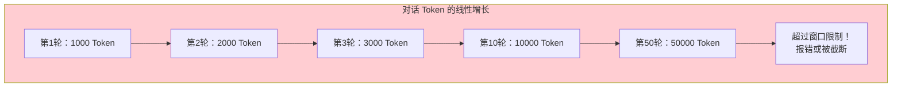
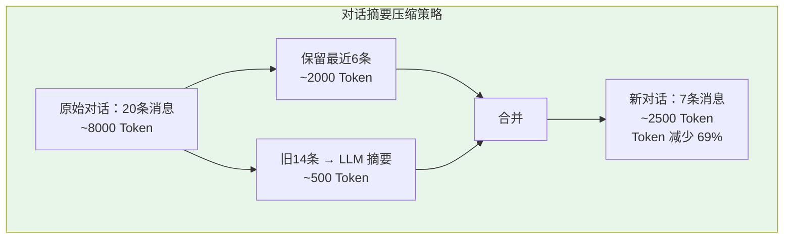
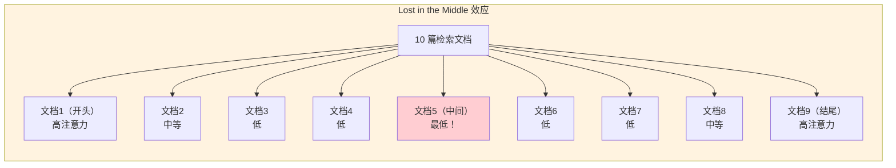
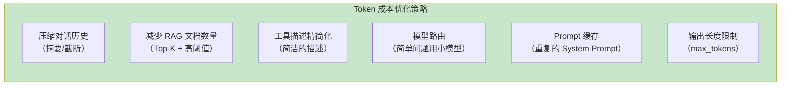

# 上下文窗口与 Token 计数

> 「本文是对 [教程 34-上下文工程 §2-§5] 的深入展开」

> **定位**：深入讲解 LLM 的上下文窗口（Context Window）机制、Token 的定义与计算方式、上下文管理策略（截断、摘要、选择性保留），以及 Spring AI 2.0 中的 Token 计数和上下文工程实践。
>
> **读者画像**：已经能运行 Agent，但遇到"上下文超限"、"Token 消耗过高"、"长对话记忆丢失"等问题的开发者。

---

## 1. 什么是 Token

### 1.1 Token 不是"词"

LLM 处理文本的基本单位不是"词"（word），也不是"字符"（character），而是 **Token**。Token 是 LLM 分词器（Tokenizer）定义的文本片段：



### 1.2 Token 的粗略估算规则

| 语言 | 大约规则 | 示例 |
|------|---------|------|
| **英文** | 1 Token ≈ 0.75 个单词 | 100 词 ≈ 130 Token |
| **中文** | 1 Token ≈ 0.5-1.5 个汉字 | 100 字 ≈ 70-200 Token |
| **代码** | 1 Token ≈ 3-4 个字符 | JSON 格式开销大 |
| **特殊符号** | 每个标点 1 Token | `.,!?:` 各 1 Token |

```java
// Spring AI 2.0 中的 Token 计数
// 利用模型返回的 Usage 信息
ChatResponse response = chatClient.prompt()
    .user("解释量子计算的基本原理")
    .call()
    .chatResponse();

Usage usage = response.getMetadata().getUsage();
int inputTokens = usage.getPromptTokens();    // 输入 Token 数
int outputTokens = usage.getCompletionTokens(); // 输出 Token 数
int totalTokens = usage.getTotalTokens();      // 总 Token 数

System.out.printf("Input: %d, Output: %d, Total: %d%n",
    inputTokens, outputTokens, totalTokens);
// 可能输出：Input: 15, Output: 350, Total: 365
```

---

## 2. 上下文窗口

### 2.1 什么是上下文窗口

上下文窗口是 LLM 单次推理能处理的**最大 Token 数**——包括输入（Prompt + 对话历史 + 检索结果）和输出（生成内容）：



### 2.2 主流模型的上下文窗口大小

| 模型 | 上下文窗口 | 输出上限 | 说明 |
|------|-----------|---------|------|
| GPT-4o | 128K | 16K | 通用 |
| GPT-4o-mini | 128K | 16K | 轻量级 |
| Claude 3.5 Sonnet | 200K | 8K | 超长上下文 |
| Claude 3 Opus | 200K | 4K | |
| Gemini 1.5 Pro | 2M | 8K | 超大窗口 |
| Gemini 1.5 Flash | 1M | 8K | |
| DeepSeek-V3 | 64K | 8K | 开源 |

```java
// 配置模型时指定上下文相关参数
spring:
  ai:
    openai:
      chat:
        options:
          model: gpt-4o
          max-tokens: 4096        # 输出最大 Token
          temperature: 0.7
```

### 2.3 上下文窗口的影响



---

## 3. Token 计数的实现

### 3.1 精确 Token 计数

```java
@Service
public class TokenCountingService {

    private final ChatClient chatClient;
    private final JTokkitTokenCounter tokenCounter;  // 使用 jtokkit 库

    // 方式一：使用专门的 Token 计数器（不需要调用 LLM）
    public int countTokens(String text, String model) {
        return tokenCounter.count(text, model);
    }

    // 方式二：通过 LLM 调用获取（精确但消耗 API 调用）
    public TokenUsage countWithModel(String prompt) {
        ChatResponse response = chatClient.prompt()
            .user(prompt)
            .call()
            .chatResponse();
        return response.getMetadata().getUsage();
    }
}

// jtokkit 是 OpenAI Tokenizer 的 Java 实现
// dependency: com.knuddels:jtokkit
```

### 3.2 对话历史 Token 估算

```java
@Service
public class ConversationTokenEstimator {

    private static final int SYSTEM_PROMPT_TOKENS = 300;  // 估算
    private static final int PER_MESSAGE_OVERHEAD = 4;    // 每条消息的固定开销
    private static final double CHINESE_TOKEN_RATIO = 1.5; // 中文：1字 ≈ 1.5 Token

    public int estimateConversationTokens(
        String systemPrompt,
        List<ChatMessage> history,
        String currentUserInput
    ) {
        int total = 0;

        // System Prompt
        total += estimateTokens(systemPrompt);

        // 对话历史
        for (ChatMessage msg : history) {
            total += PER_MESSAGE_OVERHEAD;  // 角色标记开销
            total += estimateTokens(msg.content());
        }

        // 当前用户输入
        total += PER_MESSAGE_OVERHEAD;
        total += estimateTokens(currentUserInput);

        // 预留输出空间
        total += 4096;

        return total;
    }

    private int estimateTokens(String text) {
        if (text == null || text.isEmpty()) return 0;
        // 粗略估算：英文 1 word ≈ 1.3 token，中文 1 char ≈ 1.5 token
        int chineseChars = countChineseChars(text);
        int englishWords = countEnglishWords(text);
        return (int) (chineseChars * CHINESE_TOKEN_RATIO + englishWords * 1.3);
    }

    private int countChineseChars(String text) {
        return (int) text.chars()
            .filter(c -> Character.UnicodeScript.of(c) == Character.UnicodeScript.HAN)
            .count();
    }
}
```

---

## 4. 上下文管理策略

### 4.1 问题：对话越来越长



### 4.2 策略一：滑动窗口（保留最近 N 轮）

```java
public class SlidingWindowMemory implements ChatMemory {

    private final int maxMessages;
    private final Map<String, List<Message>> store = new ConcurrentHashMap<>();  // 示意存储

    public SlidingWindowMemory(int maxMessages) {
        this.maxMessages = maxMessages;
    }

    // ChatMemory 真实签名（javap 实证）：add(String,List<Message>) 抽象、add(String,Message) 默认、get(String) 单参、clear(String)
    @Override
    public void add(String conversationId, List<Message> messages) {
        List<Message> all = new ArrayList<>(get(conversationId));
        all.addAll(messages);

        // 只保留最近 N 条消息
        while (all.size() > maxMessages) {
            all.remove(0);  // 移除最旧的消息
        }

        store.put(conversationId, all);
    }

    @Override
    public List<Message> get(String conversationId) {
        return new ArrayList<>(store.getOrDefault(conversationId, List.of()));
    }

    @Override
    public void clear(String conversationId) {
        store.remove(conversationId);
    }
}

// Spring AI 内置的 MessageWindowChatMemory 就是这种策略
@Bean
public ChatMemory chatMemory() {
    return MessageWindowChatMemory.builder()
        .maxMessages(20)  // 保留最近 20 条消息
        .build();
}
```

### 4.3 策略二：Token 级别的窗口管理

```java
public class TokenAwareMemory implements ChatMemory {

    private final int maxTokens;
    private final TokenCounter tokenCounter;
    private final Map<String, List<Message>> store = new ConcurrentHashMap<>();  // 示意存储

    @Override
    public void add(String conversationId, List<Message> messages) {
        List<Message> all = new ArrayList<>(get(conversationId));
        all.addAll(messages);

        // 按 Token 数量裁剪
        while (estimateTotalTokens(all) > maxTokens && all.size() > 2) {
            // 保留 System Message（第一条）和最近的消息
            all.remove(1);  // 移除第二条（最旧的对话消息）
        }

        store.put(conversationId, all);
    }

    @Override
    public List<Message> get(String conversationId) {
        return new ArrayList<>(store.getOrDefault(conversationId, List.of()));
    }

    @Override
    public void clear(String conversationId) {
        store.remove(conversationId);
    }

    private int estimateTotalTokens(List<Message> messages) {
        return messages.stream()
            .mapToInt(m -> tokenCounter.count(m.getText()))
            .sum();
    }
}
```

### 4.4 策略三：摘要压缩

```java
@Service
public class SummarizingMemoryManager {

    private final ChatClient chatClient;
    private final ChatMemory chatMemory;
    private final TokenCounter tokenCounter;

    private static final int SUMMARIZE_THRESHOLD = 4000;  // 超过 4000 Token 触发摘要

    public void manageContext(String conversationId) {
        // javap 实证：ChatMemory.get(String) 单参（无 lastN 参数；窗口裁剪靠 MessageWindowChatMemory 的 maxMessages）
        List<Message> messages = chatMemory.get(conversationId);

        int totalTokens = messages.stream()
            .mapToInt(m -> tokenCounter.count(m.getText()))
            .sum();

        if (totalTokens > SUMMARIZE_THRESHOLD) {
            // 将旧消息摘要化
            summarizeOldMessages(conversationId, messages);
        }
    }

    private void summarizeOldMessages(String conversationId, List<Message> messages) {
        // 保留最近 6 条消息不摘要
        int keepRecent = 6;
        List<Message> toSummarize = messages.subList(0, messages.size() - keepRecent);
        List<Message> toKeep = messages.subList(messages.size() - keepRecent, messages.size());

        // 调用 LLM 生成摘要
        String conversationText = toSummarize.stream()
            .map(m -> m.getMessageType() + ": " + m.getText())
            .collect(joining("\n"));

        String summary = chatClient.prompt()
            .system("""
                将以下对话历史总结为简洁的摘要。
                保留关键信息：用户意图、已提供的答案、重要决策。
                摘要应少于 500 字。
                """)
            .user(conversationText)
            .call()
            .content();

        // 用摘要替换旧消息
        List<Message> newMessages = new ArrayList<>();
        newMessages.add(new SystemMessage("之前的对话摘要：\n" + summary));
        newMessages.addAll(toKeep);

        chatMemory.clear(conversationId);
        newMessages.forEach(m -> chatMemory.add(conversationId, m));
    }
}
```



### 4.5 策略四：选择性保留

```java
@Service
public class SelectiveMemoryManager {

    // 根据重要性评分选择性保留消息
    public List<Message> selectImportant(List<Message> messages, int maxTokens) {
        // 为每条消息评分
        List<ScoredMessage> scored = messages.stream()
            .map(m -> new ScoredMessage(m, scoreImportance(m)))
            .sorted(Comparator.comparingDouble(ScoredMessage::score).reversed())
            .toList();

        // 按分数从高到低选择，直到达到 Token 上限
        List<Message> selected = new ArrayList<>();
        int tokens = 0;
        for (ScoredMessage sm : scored) {
            int msgTokens = estimateTokens(sm.message().getText());
            if (tokens + msgTokens > maxTokens) break;
            selected.add(sm.message());
            tokens += msgTokens;
        }

        // 按时间顺序排列
        return selected.stream()
            .sorted(Comparator.comparingInt(messages::indexOf))
            .toList();
    }

    private double scoreImportance(Message message) {
        double score = 0;
        String text = message.getText();

        // 包含决策/结论的加分
        if (text.contains("决定") || text.contains("结论") || text.contains("最终")) score += 3;
        // 包含数据的加分
        if (text.matches(".*\\d+.*")) score += 1;
        // 较长的消息通常更重要
        score += Math.min(text.length() / 100.0, 2);
        // 工具调用结果重要
        if (message.getMessageType() == MessageType.TOOL) score += 2;
        // 用户消息比 AI 回复更重要
        if (message.getMessageType() == MessageType.USER) score += 1.5;

        return score;
    }
}
```

---

## 5. "Lost in the Middle" 问题

### 5.1 现象

研究表明，LLM 在处理长上下文时，对**中间部分**的注意力较弱——开头和结尾的信息更容易被"记住"：



### 5.2 缓解策略

```java
@Service
public class LostInMiddleMitigator {

    // 策略：重新排列检索结果，把最相关的放在开头和结尾
    public List<Document> reorderForContext(List<Document> ranked) {
        int n = ranked.size();
        List<Document> reordered = new ArrayList<>(n);

        // 交错排列：最相关的放头尾，次相关的放中间两端
        int left = 0, right = n - 1;
        boolean putLeft = true;
        for (int i = 0; i < n; i++) {
            if (putLeft) {
                reordered.add(ranked.get(left++));
            } else {
                reordered.add(right, ranked.get(right--));
            }
            putLeft = !putLeft;
        }

        return reordered;
    }

    // 或者：只保留最相关的 Top-K，减少中间噪音
    public List<Document> truncateToTopK(List<Document> ranked, int k) {
        return ranked.subList(0, Math.min(k, ranked.size()));
    }
}
```

---

## 6. 成本优化

### 6.1 Token 成本模型

```java
// LLM API 的计费模型
// 输入 Token 和输出 Token 价格不同（输出通常贵 3-5 倍）

// GPT-4o 定价（2026年参考）
// 输入：$2.50 / 1M Token
// 输出：$10.00 / 1M Token

// 一个有 1000 用户、每人每天 10 次对话的 Agent
// 每次对话平均：输入 2000 Token，输出 500 Token
// 日输入：1000 * 10 * 2000 = 20M Token → $50
// 日输出：1000 * 10 * 500 = 5M Token → $50
// 日成本：$100 → 月成本：$3000
```

### 6.2 降低成本的策略



```java
// 模型路由：简单问题用便宜的模型
@Service
public class CostAwareRouter {

    private final ChatClient expensiveModel;  // GPT-4o
    private final ChatClient cheapModel;      // GPT-4o-mini

    public String chat(String query) {
        // 简单问题用小模型
        if (isSimple(query)) {
            return cheapModel.prompt()
                .user(query)
                .call()
                .content();
        }
        // 复杂问题用大模型
        return expensiveModel.prompt()
            .user(query)
            .call()
            .content();
    }

    private boolean isSimple(String query) {
        // 启发式判断
        return query.length() < 50
            && !query.contains("分析")
            && !query.contains("推理")
            && !query.contains("比较");
    }
}
```

---

## 7. Spring AI 2.0 的上下文工程支持

### 7.1 Token 计数 Advisor

```java
// 自定义 Token 计数 Advisor
public class TokenCountingAdvisor implements CallAdvisor {

    private final MeterRegistry meters;
    private final AtomicInteger totalInputTokens = new AtomicInteger(0);
    private final AtomicInteger totalOutputTokens = new AtomicInteger(0);

    // javap 实证：CallAdvisor 只有 adviseCall（无单参 after）；ChatClientResponse.chatResponse() 取 ChatResponse
    // Usage 真实方法 getPromptTokens()/getCompletionTokens()（org.springframework.ai.chat.metadata.Usage）
    @Override
    public ChatClientResponse adviseCall(ChatClientRequest request, CallAdvisorChain chain) {
        ChatClientResponse advisedResponse = chain.nextCall(request);

        Usage usage = advisedResponse.chatResponse().getMetadata().getUsage();
        if (usage != null) {
            int input = usage.getPromptTokens();
            int output = usage.getCompletionTokens();

            totalInputTokens.addAndGet(input);
            totalOutputTokens.addAndGet(output);

            // 记录到 Micrometer
            meters.counter("agent.tokens", "direction", "input").increment(input);
            meters.counter("agent.tokens", "direction", "output").increment(output);
        }

        return advisedResponse;
    }

    @Override
    public String getName() { return "TokenCountingAdvisor"; }
}

// 注册
@Bean
public ChatClient chatClient(ChatClient.Builder builder) {
    return builder
        .defaultAdvisors(new TokenCountingAdvisor(meters))
        .build();
}
```

### 7.2 Memory Advisor 的上下文管理

```java
// Spring AI 的 MessageWindowChatMemory + Advisor 自动管理上下文
@Bean
public ChatClient chatClient(ChatClient.Builder builder, ChatMemory memory) {
    return builder
        .defaultAdvisors(
            MessageChatMemoryAdvisor.builder(memory)
                .build()
        )
        .build();
}

// Memory Advisor 自动在每次对话时注入历史消息
// 并在超过窗口时自动裁剪
```

---

## 8. 监控与告警

### 8.1 Token 消耗监控

```java
@RestController
@RequestMapping("/admin")
public class TokenMonitorController {

    @GetMapping("/token-usage")
    public TokenUsageReport getTokenUsage(
        @RequestParam(required = false) String sessionId,
        @RequestParam(required = false, defaultValue = "24h") String period
    ) {
        // 从 Micrometer 查询 Token 使用统计
        return TokenUsageReport.builder()
            .inputTokens(meters.counter("agent.tokens", "direction", "input").count())
            .outputTokens(meters.counter("agent.tokens", "direction", "output").count())
            .estimatedCost(calculateCost())
            .build();
    }

    // Token 预算告警
    @Scheduled(fixedRate = 60_000)  // 每分钟检查
    public void checkTokenBudget() {
        double dailyCost = getDailyTokenCost();
        if (dailyCost > DAILY_BUDGET * 0.8) {
            alertService.notify("Token 消耗已达日预算的 80%: $" + dailyCost);
        }
    }
}
```

---

## 9. 总结

上下文窗口和 Token 计数是 Agent 工程的基础约束。理解它们，才能有效管理成本、避免超限、保证对话连贯性：

1. **Token 是 LLM 的基本计费单位**——不是词也不是字符，需要专门的 Tokenizer 精确计数
2. **上下文窗口** 是单次推理的上限——System Prompt + 对话历史 + RAG + 工具 + 用户输入 + 输出
3. **上下文管理四策略**：滑动窗口（简单）、Token 级裁剪（精确）、摘要压缩（高效）、选择性保留（智能）
4. **"Lost in the Middle"** ——LLM 对长上下文中间部分的注意力弱，需要重新排列文档顺序
5. **成本优化**：模型路由、历史压缩、RAG 精简、输出长度限制
6. **监控**：Token 消耗需要实时监控和预算告警

在教程 29（上下文工程）中，这些概念是 Agent 系统设计的核心约束。Agent 的记忆管理、RAG 检索量、工具数量、Prompt 设计，都需要在上下文窗口的边界内做出权衡。
