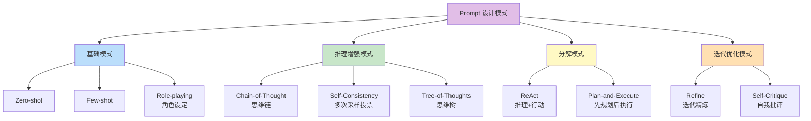
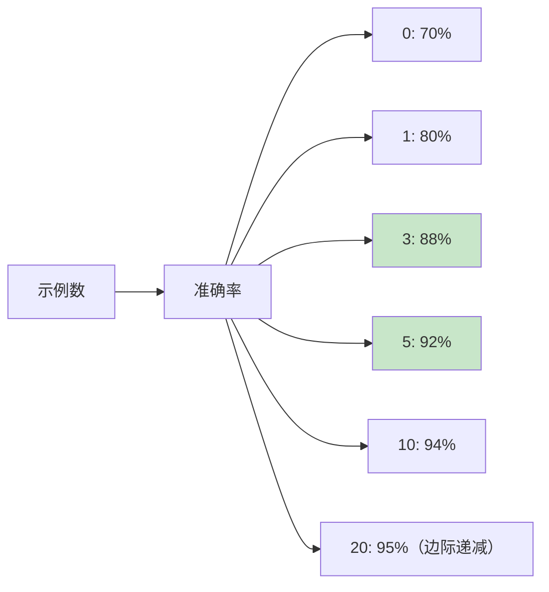
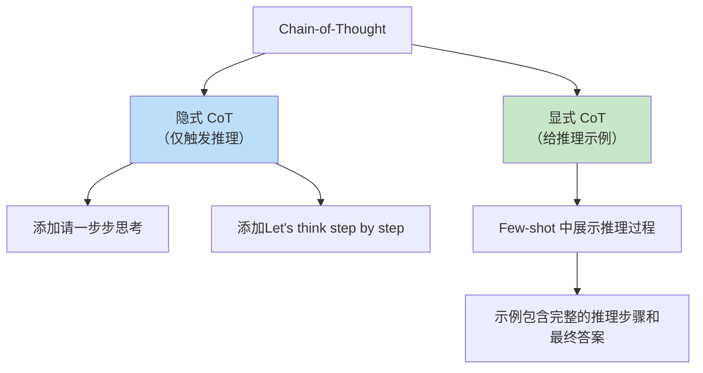
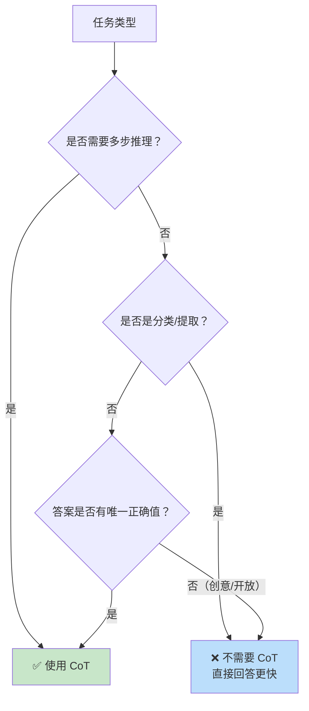
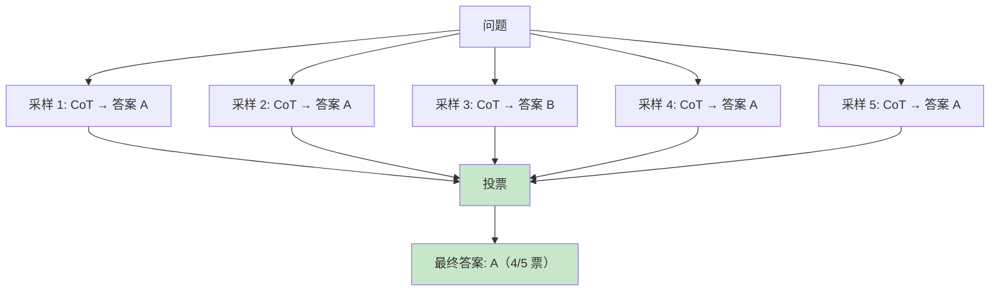
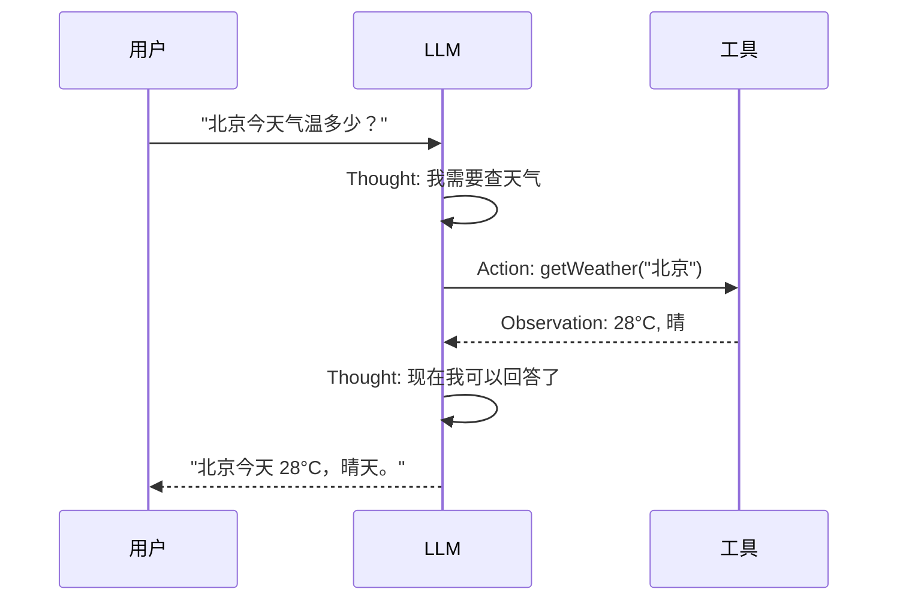
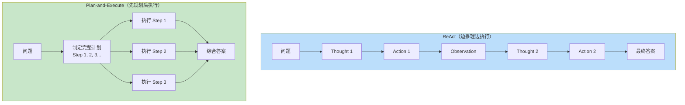
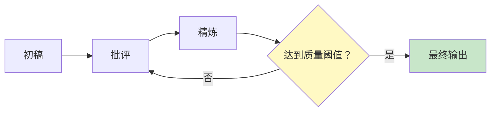
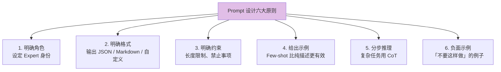

# Prompt 设计模式：Few-shot、Chain-of-Thought 与高级技巧

> 「本文是对 [教程 00-基础与核心/02-ChatClient与对话模型 §2-§4] 的深入展开」

> **定位**：系统讲解 Prompt Engineering 的核心设计模式——Zero-shot、Few-shot、Chain-of-Thought、Self-Consistency、ReAct、Tree-of-Thoughts——并给出在 Spring AI `ChatClient` 中的 Java 实现与调优经验。
>
> **读者画像**：已经能用 `ChatClient` 写出基本的 Prompt，但希望系统掌握 Prompt 设计方法论、提升输出质量与稳定性的开发者。

---

## 1. Prompt 设计模式的分类体系



---

## 2. Zero-shot 与 Few-shot

### 2.1 Zero-shot

不给示例，直接描述任务。适合简单、明确的任务：

```java
String prompt = """
    将以下用户评论分类为「正面」「负面」「中性」：
    评论：{review}
    分类：
    """.replace("{review}", review);

String result = chatClient.prompt().user(prompt).call().content();
```

**优点**：Token 少、响应快。
**缺点**：格式不可控、边界 case 容易出错。

### 2.2 Few-shot：给模型看几个例子

```java
String fewShotPrompt = """
    任务：将用户评论分类为「正面」「负面」「中性」。

    示例 1：
    输入：这个产品太棒了，强烈推荐！
    输出：正面

    示例 2：
    输入：质量一般，用了一周就坏了。
    输出：负面

    示例 3：
    输入：包装不错，但功能还需要验证。
    输出：中性

    现在请分类：
    输入：{input}
    输出：
    """;
```

### 2.3 Few-shot 示例数选择

| 示例数 | Token 消耗 | 准确率提升 | 适用场景 |
|--------|-----------|------------|----------|
| 0 (Zero-shot) | 最低 | 基线 | 简单任务 |
| 1 (One-shot) | +50 tokens | +5-10% | 格式示范 |
| 3-5 (Few-shot) | +150-250 | +15-25% | 推荐范围 |
| 10+ | +500+ | +25-30% | 复杂/边缘 case 多 |



**经验法则**：3-5 个 Few-shot 示例是性价比最高的区间。

### 2.4 示例选择的三个原则

1. **多样性**：覆盖不同类别和边界 case，不要全是简单例子。
2. **均衡性**：每个类别的示例数量大致相同，避免模型偏向多数类。
3. **顺序敏感性**：GPT/Claude 对最后几个示例更敏感，把最典型的放最后。

---

## 3. Chain-of-Thought（CoT）

### 3.1 核心思想

让模型"展示推理过程"，而不是直接给答案。这对多步推理任务（数学、逻辑、规划）至关重要。

```java
// 不加 CoT
String directPrompt = "小明有 5 个苹果，给了小红 2 个，又买了 3 个，现在有几个？";

// 加 CoT
String cotPrompt = """
    小明有 5 个苹果，给了小红 2 个，又买了 3 个，现在有几个？
    请一步步推理：
    """;
```

### 3.2 CoT 的两种触发方式



### 3.3 显式 CoT 示例

```java
String cotFewShot = """
    Q: 一个商店有 23 个苹果。上午卖了 8 个，下午又进了 15 个。现在有几个？
    A: 让我一步步推理。
       初始：23 个
       上午卖了 8 个：23 - 8 = 15 个
       下午进了 15 个：15 + 15 = 30 个
       答案：30 个

    Q: 一个班级有 40 个学生。男生比女生多 4 个。男生有几个？
    A: 让我一步步推理。
       设女生 x 人，男生 x + 4 人
       x + x + 4 = 40
       2x = 36
       x = 18（女生）
       男生 = 18 + 4 = 22
       答案：22 个

    Q: {question}
    A:
    """;
```

### 3.4 CoT 的适用场景



---

## 4. Self-Consistency（多路投票）

### 4.1 核心思想

CoT 的单次推理可能有误。**多次采样 + 投票**可以显著提升准确率。



### 4.2 Java 实现

```java
public Mono<String> selfConsistentAnswer(String question, int samples) {
    // 设置较高的 temperature 增加推理路径多样性
    List<Mono<String>> paths = IntStream.range(0, samples)
        .mapToObj(i -> chatClient.prompt()
            .user(question + "\n请一步步推理。")
            .call()
            .content())
        .toList();

    return Flux.merge(paths)
        .collectList()
        .map(this::extractAndVote);
}

private String extractAndVote(List<String> answers) {
    // 提取每个回答的最终答案
    Map<String, Long> voteCount = answers.stream()
        .map(this::extractFinalAnswer)
        .collect(Collectors.groupingBy(Function.identity(), Collectors.counting()));

    return voteCount.entrySet().stream()
        .max(Map.Entry.comparingByValue())
        .map(Map.Entry::getKey)
        .orElseThrow();
}
```

### 4.3 成本-收益分析

| 采样数 | 准确率 | Token 成本 | 延迟 | 推荐场景 |
|--------|--------|-----------|------|----------|
| 1（单次 CoT） | ~85% | 1x | 1x | 一般任务 |
| 3 | ~92% | 3x | ~1x（可并行） | 推荐默认 |
| 5 | ~95% | 5x | ~1x | 关键决策 |
| 10 | ~97% | 10x | ~1x | 高价值、低频率 |

**关键洞察**：如果可以并行调用，延迟不会线性增加——只有成本增加。

---

## 5. ReAct 模式（Reasoning + Acting）

### 5.1 核心思想

让模型交替进行**推理**和**行动**（工具调用），根据工具返回的结果继续推理。



### 5.2 Spring AI 中的 ReAct

Spring AI 2.0 的 `ChatClient` + Tool Calling 天然支持 ReAct 模式：

```java
@Bean
public ToolCallback weatherTool(WeatherService service) {
    // 真实 API（javap 实证）：ToolCallback 是接口、无 builder()；函数式构建走 FunctionToolCallback.builder(name, fn)
    return FunctionToolCallback.builder("getWeather",
            (Map<String, Object> args) -> service.getWeather(args.get("city").toString()))
        .description("查询指定城市的当前天气")
        .inputSchema("""
            {
              "type": "object",
              "properties": {
                "city": {"type": "string", "description": "城市名"}
              },
              "required": ["city"]
            }
            """)
        .build();
}

// 使用时，模型会自动进行 ReAct 推理
String answer = chatClient.prompt()
    .user("北京今天气温多少？应该穿什么？")
    .tools(weatherTool, clothingAdviceTool)
    .call()
    .content();
```

### 5.3 ReAct 的 Prompt 设计

在 System Prompt 中明确 ReAct 的推理格式：

```java
String reactSystemPrompt = """
    你是一个智能助手。面对问题，请按以下格式推理：

    Thought: 分析当前情况，决定下一步
    Action: 调用工具的名称
    Action Input: 工具的输入参数（JSON 格式）
    Observation: 工具返回的结果

    （可以重复多次 Thought-Action-Observation）

    Final Answer: 最终给用户的回答

    规则：
    - 每次只执行一个 Action
    - 必须基于 Observation 推理
    - 不确定时优先调用工具验证
    """;
```

---

## 6. Plan-and-Execute（先规划后执行）

### 6.1 与 ReAct 的区别



**适用场景**：
- **ReAct**：任务不确定、需要根据中间结果调整策略。
- **Plan-and-Execute**：任务结构清晰、步骤可并行、需要全局视角。

### 6.2 Java 实现

```java
public Mono<String> planAndExecute(String task) {
    // 阶段 1：Planner 生成计划
    return chatClient.prompt()
        .user("将以下任务分解为 3-7 个具体步骤：\n" + task)
        .call()
        .content()
        .flatMap(plan -> {
            List<String> steps = parseSteps(plan);

            // 阶段 2：并行执行所有步骤
            List<Mono<String>> executions = steps.stream()
                .map(step -> chatClient.prompt()
                    .user("执行步骤：" + step)
                    .tools(toolCallbacks)
                    .call()
                    .content())
                .toList();

            // 阶段 3：综合
            return Flux.merge(executions)
                .collectList()
                .flatMap(results -> chatClient.prompt()
                    .user("基于以下步骤结果，给出最终答案：\n"
                        + formatResults(steps, results)
                        + "\n原任务：" + task)
                    .call()
                    .content());
        });
}
```

---

## 7. Self-Critique（自我批评与精炼）

### 7.1 单轮精炼

```java
// 初稿
String draft = chatClient.prompt()
    .user("写一段关于" + topic + "的技术总结")
    .call()
    .content();

// 自我批评 + 精炼
String refined = chatClient.prompt()
    .user("""
        以下是关于 %s 的技术总结初稿。请：
        1. 指出其中的不准确之处
        2. 补充遗漏的关键点
        3. 输出改进后的版本

        初稿：%s
        """.formatted(topic, draft))
    .call()
    .content();
```

### 7.2 多轮精炼循环



```java
public Mono<String> iterativeRefine(String task, int maxRounds) {
    return Flux.range(0, maxRounds)
        .reduce(
            chatClient.prompt().user(task).call().content(),  // 初稿
            (current, round) -> current.flatMap(text ->
                chatClient.prompt()
                    .user("批评并改进（第 " + (round + 1) + " 轮）：\n" + text)
                    .call()
                    .content()
            )
        );
}
```

---

## 8. Prompt 设计的通用原则



### 8.1 完整的高质量 Prompt 模板

```java
String highQualityPrompt = """
    ## 角色
    你是一位资深的 Java 架构师，精通 Spring Boot 和微服务架构。

    ## 任务
    为以下需求设计技术方案。

    ## 需求
    {requirement}

    ## 输出格式
    请严格按照以下结构输出：
    ```json
    {
      "summary": "一句话方案概述",
      "components": [
        {"name": "组件名", "responsibility": "职责", "tech": "技术选型"}
      ],
      "dataFlow": "数据流向描述",
      "risks": ["风险1", "风险2"],
      "alternatives": "其他可选方案"
    }
    ```

    ## 约束
    - 技术栈限定：Spring Boot 4.1 + Java 21
    - 方案需可落地，不要空中楼阁
    - 风险至少列 2 个
    - 不要使用 XML 配置

    ## 示例
    需求：实现一个简单的用户注册接口
    ```json
    {
      "summary": "基于 Spring MVC 的 RESTful 注册 API",
      "components": [
        {"name": "RegistrationController", "responsibility": "接收请求", "tech": "Spring MVC"},
        {"name": "UserService", "responsibility": "业务逻辑", "tech": "Spring Service"},
        {"name": "UserRepository", "responsibility": "持久化", "tech": "Spring Data JPA"}
      ],
      ...
    }
    ```

    ## 开始
    """;
```

---

## 9. 总结

Prompt 设计模式不是"记住哪个公式"，而是**理解每种模式解决的问题，然后组合使用**：

1. **Few-shot 是基础**——3-5 个高质量示例比 500 字描述更有效。
2. **CoT 用于推理**——涉及多步计算、逻辑推断时必加 CoT。
3. **Self-Consistency 用于关键决策**——多次采样投票，用成本换准确率。
4. **ReAct 用于工具调用**——Spring AI 的 Tool Calling 天然支持。
5. **Plan-and-Execute 用于复杂编排**——先全局规划，再并行执行。
6. **Self-Critique 用于质量提升**——让模型自己批评自己，多轮精炼。

下一篇我们将讨论**Prompt 模板管理**——如何版本化、A/B 测试、动态组装 Prompt。
