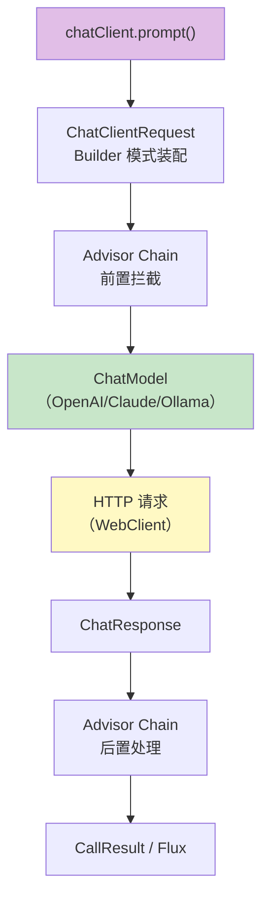
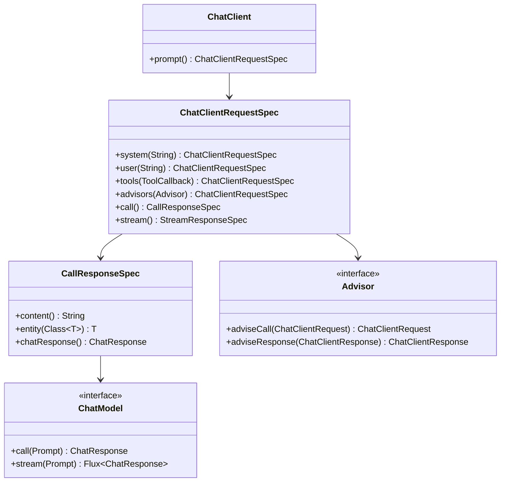
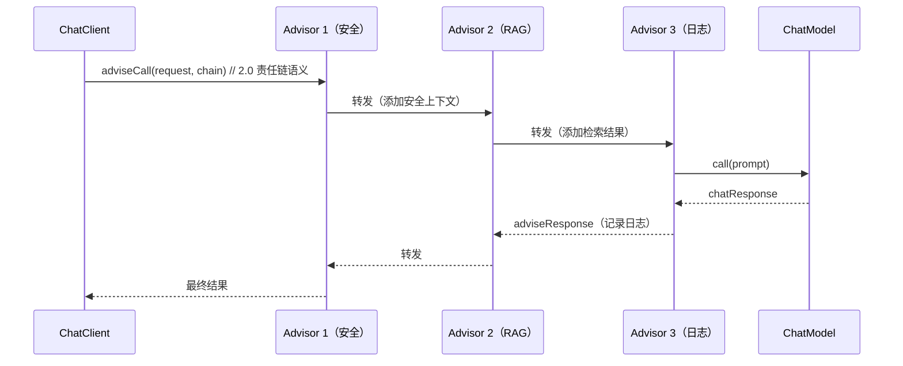
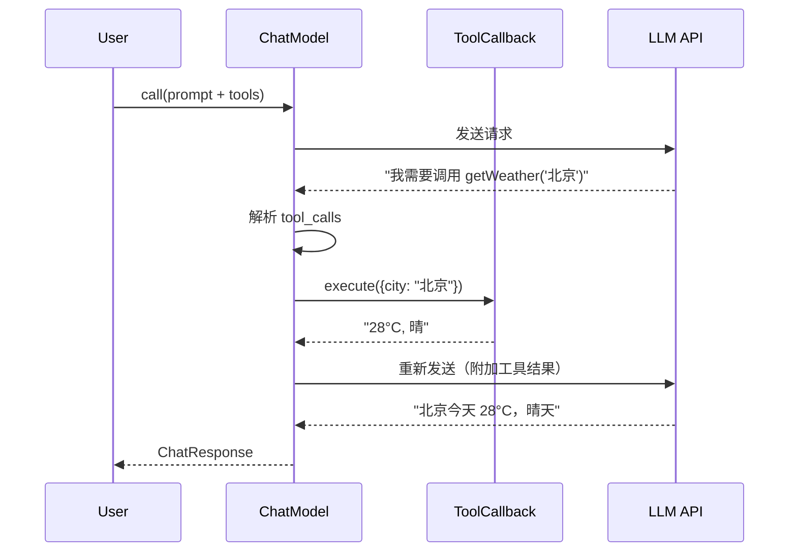
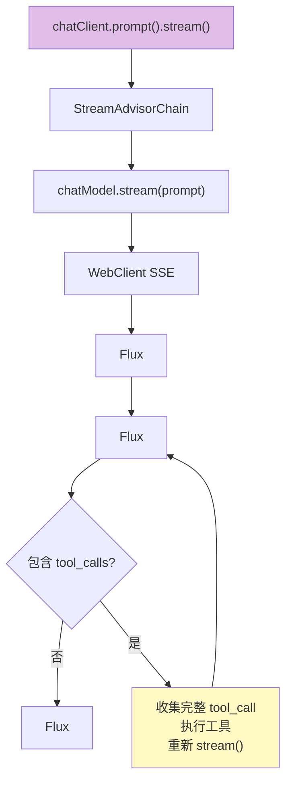
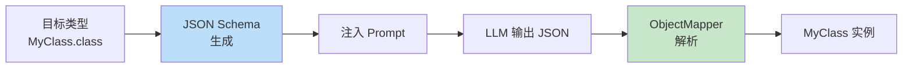

# ChatClient 源码解析：从调用到响应的完整执行链

> 「本文是对 [教程 00-基础与核心/02-ChatClient与对话模型 §1-§5] 的深入展开」

> **定位**：逐层拆解 Spring AI 2.0 `ChatClient` 的内部架构——从 `.prompt().user().call()` 到最终 HTTP 请求的全过程，覆盖 Prompt 装配、Advisor 链、Model 调用、响应处理四个阶段。
>
> **读者画像**：想知道 `chatClient.prompt().user("hi").call().content()` 到底发生了什么的开发者，以及需要扩展 ChatClient 行为的高级用户。

---

## 1. ChatClient 的顶层架构

### 1.1 从一行代码说起

> **声明**：本文中的接口与源码为**简化示意模型**，用于讲解执行链机制；真实签名以 [附录 05-SpringAI2-API基准] 与引入版本文档为准。

```java
String answer = chatClient.prompt()
    .system("你是助手")
    .user("你好")
    .tools(myTool)
    .advisors(securityAdvisor)
    .call()
    .content();
```

这行代码背后是一个**多层管道**：



### 1.2 核心类关系



---

## 2. 第一阶段：Prompt 装配

### 2.1 Builder 链的实现

```java
// 简化的 ChatClientRequest.Builder 内部逻辑
public class DefaultChatClientRequestSpec implements ChatClientRequestSpec {

    private String systemText;
    private String userText;
    private Map<String, Object> variables;
    private List<ToolCallback> toolCallbacks;
    private List<Advisor> advisors;
    private ChatModel chatModel;

    @Override
    public ChatClientRequestSpec user(String text) {
        this.userText = text;
        return this;
    }

    @Override
    public ChatClientRequestSpec tools(ToolCallback... callbacks) {
        this.toolCallbacks = Arrays.asList(callbacks);
        return this;
    }

    @Override
    public CallResponseSpec call() {
        // 装配最终的 Prompt 对象
        Prompt prompt = buildPrompt();
        // 进入 Advisor 链
        return new DefaultCallResponseSpec(prompt, advisors, chatModel);
    }

    private Prompt buildPrompt() {
        List<Message> messages = new ArrayList<>();
        if (systemText != null) {
            messages.add(new SystemMessage(renderTemplate(systemText, variables)));
        }
        if (userText != null) {
            messages.add(new UserMessage(renderTemplate(userText, variables)));
        }
        return new Prompt(messages);
    }
}
```

### 2.2 模板渲染

```java
private String renderTemplate(String template, Map<String, Object> variables) {
    // Spring AI 2.0 使用 StTemplateRenderer（StringTemplate）
    StTemplateRenderer renderer = StTemplateRenderer.builder()
        .groupDelimiterChar('$')
        .build();
    return renderer.apply(template, variables);
}
```

**关键点**：`{variable}` 在 Spring AI 2.0 中实际上是通过 StringTemplate 4 渲染的，支持条件判断、循环等高级语法。

---

## 3. 第二阶段：Advisor 链

### 3.1 Advisor 的执行模型



### 3.2 Advisor 接口

```java
public interface BaseAdvisor extends CallAdvisor, StreamAdvisor {   // 简化示意模型——真实 2.0.0 中 BaseAdvisor 存在（before/after 带 AdvisorChain 参数），也可直接实现 CallAdvisor/StreamAdvisor（javap 实证；真实签名见 [附录 05-SpringAI2-API基准 §3]）

    default String getName() {
        return this.getClass().getSimpleName();
    }

    default int getOrder() {
        return Ordered.LOWEST_PRECEDENCE;
    }

    @Override
    default ChatClientResponse adviseCall(ChatClientRequest request,
                                           CallAdvisorChain chain) {
        // 前置处理
        ChatClientRequest processedRequest = before(request);
        // 调用下一个 Advisor
        ChatClientResponse response = chain.nextCall(processedRequest);
        // 后置处理
        return after(response);
    }

    protected ChatClientRequest before(ChatClientRequest request) {
        return request; // 默认不做处理
    }

    protected ChatClientResponse after(ChatClientResponse response) {
        return response; // 默认不做处理
    }
}
```

### 3.3 Advisor 链的装配

```java
// AdvisorChain 的核心逻辑
public class DefaultCallAdvisorChain implements CallAdvisorChain {

    private final List<Advisor> advisors;
    private int currentIndex = 0;

    @Override
    public ChatClientResponse nextCall(ChatClientRequest request) {
        if (currentIndex < advisors.size()) {
            Advisor advisor = advisors.get(currentIndex++);
            if (advisor instanceof CallAdvisor callAdvisor) {
                return callAdvisor.adviseCall(request, this);
            }
        }
        // 所有 Advisor 执行完毕，调用 ChatModel
        return callModel(request);
    }

    private ChatClientResponse callModel(ChatClientRequest request) {
        ChatResponse response = chatModel.call(request.prompt());
        return ChatClientResponse.builder()
            .chatResponse(response)
            .context(request.context())
            .build();
    }
}
```

---

## 4. 第三阶段：ChatModel 调用

### 4.1 ChatModel 接口

```java
public interface ChatModel extends Model {

    // 同步调用
    ChatResponse call(Prompt prompt);

    // 流式调用
    default Flux<ChatResponse> stream(Prompt prompt) {
        throw new UnsupportedOperationException("Streaming not supported");
    }

    // 工具调用循环
    default ChatResponse internalCall(Prompt prompt,
            ToolContext toolContext) {
        ChatResponse response = call(prompt);
        // 如果模型要求调用工具，自动执行工具并重新调用
        while (hasToolCalls(response)) {
            response = executeToolCalls(response, toolContext);
            response = call(buildFollowUpPrompt(prompt, response));
        }
        return response;
    }
}
```

### 4.2 OpenAI ChatModel 的实现

```java
public class OpenAiChatModel implements ChatModel {

    private final OpenAiChatApi api;  // 封装 WebClient 的 HTTP 客户端

    @Override
    public ChatResponse call(Prompt prompt) {
        // 1. 将 Prompt 转换为 API 请求体
        OpenAiChatRequest request = buildRequest(prompt);

        // 2. 发送 HTTP 请求
        OpenAiChatResponse apiResponse = api.chatCompletionEntity(request);

        // 3. 将 API 响应转换为 ChatResponse
        return buildChatResponse(apiResponse);
    }

    @Override
    public Flux<ChatResponse> stream(Prompt prompt) {
        OpenAiChatRequest request = buildRequest(prompt);
        request.setStream(true); // 开启 SSE

        return api.chatCompletionStream(request)  // 返回 Flux
            .map(this::buildChatResponse);
    }

    private OpenAiChatRequest buildRequest(Prompt prompt) {
        return OpenAiChatRequest.builder()
            .model(this.options.getModel())
            .messages(prompt.getInstructions().stream()
                .map(this::toApiMessage)
                .toList())
            .tools(buildToolSpecs(prompt))      // 工具定义
            .temperature(this.options.getTemperature())
            .build();
    }
}
```

### 4.3 HTTP 层

```java
// OpenAiChatApi 的核心
public class OpenAiChatApi {

    private final WebClient webClient;

    public Flux<OpenAiChatResponse> chatCompletionStream(OpenAiChatRequest request) {
        return this.webClient.post()
            .uri("/chat/completions")
            .header("Authorization", "Bearer " + apiKey)
            .body(Mono.just(request), OpenAiChatRequest.class)
            .accept(MediaType.TEXT_EVENT_STREAM)   // SSE
            .retrieve()
            .bodyToFlux(String.class)               // 逐 SSE 事件
            .takeUntil("[DONE]"::equals)            // 直到 [DONE]
            .filter(s -> !"[DONE]".equals(s))
            .map(this::parseSSEChunk);
    }
}
```

---

## 5. 第四阶段：Tool Calling 循环

### 5.1 工具调用流程



### 5.2 工具调用循环的实现

```java
public ChatResponse call(Prompt prompt) {
    int maxIterations = 10; // 防止无限循环
    ChatResponse response = doCall(prompt);

    for (int i = 0; i < maxIterations; i++) {
        if (!hasToolCalls(response)) {
            return response; // 无工具调用，返回最终结果
        }

        // 执行工具调用
        List<ToolResult> toolResults = executeToolCalls(response);

        // 构建后续 Prompt（原始消息 + 工具结果）
        Prompt followUpPrompt = buildFollowUpPrompt(prompt, response, toolResults);

        // 再次调用 LLM
        response = doCall(followUpPrompt);
    }

    throw new IllegalStateException("工具调用超过最大循环次数");
}

private List<ToolResult> executeToolCalls(ChatResponse response) {
    return response.getResult().getOutput().getToolCalls().stream()
        .map(toolCall -> {
            ToolCallback callback = findTool(toolCall.name());
            String toolInput = toolCall.arguments(); // JSON 字符串
            return callback.call(toolInput);
        })
        .toList();
}
```

---

## 6. 流式调用的源码路径

### 6.1 stream() 的完整链路



### 6.2 流式工具调用的挑战

流式模式下，`tool_calls` 是**分散在多个 SSE chunk** 中的。Spring AI 需要先聚合完整的 `tool_call` JSON，再执行工具，再重新发起流式请求：

```java
public Flux<ChatResponse> stream(Prompt prompt) {
    return doStream(prompt)
        .bufferUntil(this::isCompleteToolCall)  // 聚合到工具调用完整
        .flatMap(chunk -> {
            if (containsCompleteToolCall(chunk)) {
                return executeToolsAndRestream(prompt, chunk);
            }
            return Flux.fromIterable(chunk);
        });
}
```

---

## 7. 结构化输出的实现

### 7.1 entity() 的工作原理

```java
// chatClient.prompt().user("...").call().entity(MyClass.class)
public <T> T entity(Class<T> type) {
    // 1. 在 Prompt 中添加格式化指令
    String schema = JsonSchemaGenerator.generateForInput(type);
    String formatInstruction = "请输出符合以下 JSON Schema 的结果：\n" + schema;

    // 2. 调用 LLM
    String rawOutput = call(addFormatInstruction(prompt, formatInstruction))
        .content();

    // 3. 解析 JSON
    return objectMapper.readValue(rawOutput, type);
}
```



---

## 8. 自定义扩展点

### 8.1 自定义 ChatModel

```java
@Component
public class MyCustomChatModel implements ChatModel {

    @Override
    public ChatResponse call(Prompt prompt) {
        // 自定义调用逻辑
        // 可以是本地模型、自定义协议、缓存优先等
        String result = myCustomCallLogic(prompt);
        return ChatResponse.builder()
            .generations(List.of(
                new Generation(new AssistantMessage(result))
            ))
            .build();
    }
}
```

### 8.2 自定义 Advisor

```java
@Component
public class CachingAdvisor implements CallAdvisor {

    @Override
    public int getOrder() {
        return Ordered.HIGHEST_PRECEDENCE; // 最先执行
    }

    @Override
    public ChatClientRequest before(ChatClientRequest request) {
        String cacheKey = generateKey(request);
        String cached = cache.get(cacheKey);
        if (cached != null) {
            request.context().put("cache.hit", cached);
        }
        return request;
    }

    @Override
    public ChatClientResponse after(ChatClientResponse response) {
        if (!response.context().containsKey("cache.hit")) {
            cache.put(generateKey(response), response.chatResponse().getResult().getOutput().getText());
        }
        return response;
    }
}
```

---

## 9. 调试技巧

### 9.1 开启调试日志

```yaml
# application.yml
logging:
  level:
    org.springframework.ai: DEBUG
    org.springframework.ai.chat.client: TRACE
    org.springframework.ai.openai: TRACE
```

### 9.2 请求/响应拦截

```java
@Component
public class ChatModelLoggingAdvisor implements CallAdvisor {

    @Override
    public ChatClientResponse adviseCall(ChatClientRequest request,
                                           CallAdvisorChain chain) {
        log.info("→ 请求：{}", request.prompt());
        long start = System.nanoTime();
        ChatClientResponse response = chain.nextCall(request);
        log.info("← 响应（{}ms）：{}",
            (System.nanoTime() - start) / 1_000_000,
            response.chatResponse());
        return response;
    }
}
```

---

## 10. 总结

ChatClient 的源码揭示了 Spring AI 的设计哲学——**分层、管道、可插拔**：

1. **Builder 模式装配 Prompt**——流畅 API 背后是 Prompt 对象的逐步构建。
2. **Advisor 链是核心扩展点**——安全、日志、缓存、RAG 都通过 Advisor 注入。
3. **ChatModel 是可替换的**——OpenAI/Claude/Ollama/自定义实现同一接口。
4. **Tool Calling 是自动循环**——模型返回 `tool_calls` 时自动执行并重新调用。
5. **流式模式有额外的聚合逻辑**——分散在多个 chunk 中的 `tool_call` 需要先聚合。

理解这些内部机制，才能在需要时正确扩展 ChatClient——例如添加自定义缓存、多模型路由、或特殊的工具调用策略。

下一篇我们将更深入地分析 Advisor 执行链的拦截原理。
