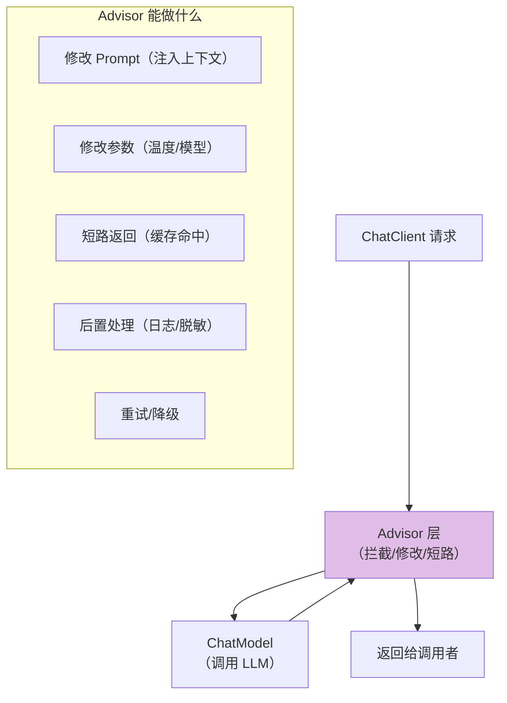
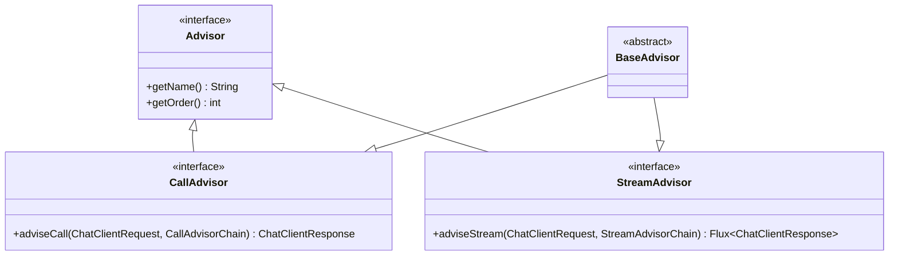
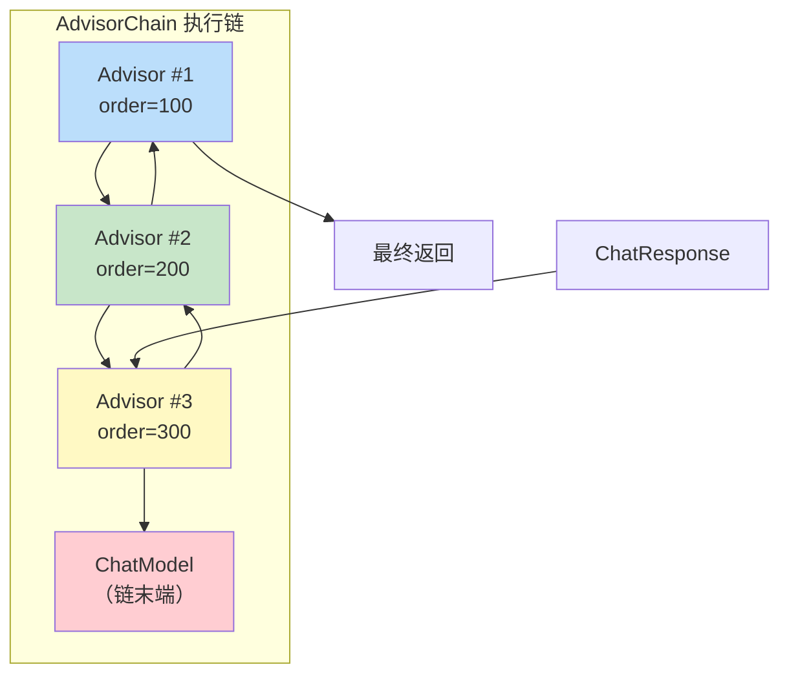
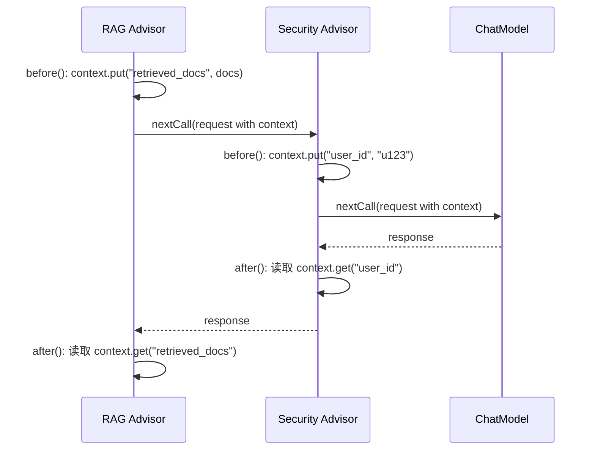
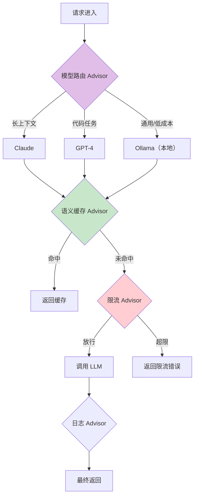
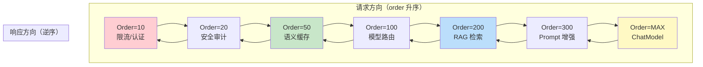

# Advisor 执行链源码解析：拦截链原理与自定义

> 「本文是对 [教程 13-Advisor §1-§5] 的深入展开」

> **定位**：深入分析 Spring AI 2.0 Advisor 机制的设计原理、责任链模式实现、同步与流式链的差异，以及如何编写生产级 Advisor（安全审计、语义缓存、多模型路由）。
>
> **读者画像**：理解 ChatClient 基本用法，想要利用 Advisor 机制实现横切关注点（日志、安全、缓存、限流）的开发者。

---

## 1. Advisor 机制的设计哲学

### 1.1 什么是 Advisor

Advisor 是 Spring AI 的**拦截器抽象**——类似于 Servlet Filter 或 Spring AOP Around Advice，但专门为 LLM 调用链设计。



### 1.2 为什么不用 AOP

| 维度 | Spring AOP | Spring AI Advisor |
|------|-----------|-------------------|
| 拦截粒度 | 方法级 | LLM 请求/响应级 |
| 流式支持 | 不支持 | 原生支持 Flux |
| 上下文传递 | 通过参数 | 通过 `context` Map |
| 链式调用 | 不直观 | 显式 Chain |
| 可短路 | 需要抛异常 | 直接返回响应 |

---

## 2. 核心接口体系

### 2.1 接口层次



### 2.2 关键接口定义

```java
// 顶层标记接口
public interface Advisor {
    default String getName() {
        return this.getClass().getSimpleName();
    }
    default int getOrder() {
        return Ordered.LOWEST_PRECEDENCE;
    }
}

// 同步调用拦截器
public interface CallAdvisor extends Advisor {
    ChatClientResponse adviseCall(ChatClientRequest request,
                                   CallAdvisorChain chain);
}

// 流式调用拦截器
public interface StreamAdvisor extends Advisor {
    Flux<ChatClientResponse> adviseStream(ChatClientRequest request,
                                           StreamAdvisorChain chain);
}

// 双模式基类（推荐继承）
public abstract class BaseAdvisor implements CallAdvisor, StreamAdvisor {

    @Override
    public ChatClientResponse adviseCall(ChatClientRequest request,
                                           CallAdvisorChain chain) {
        ChatClientRequest processed = before(request);
        ChatClientResponse response = chain.nextCall(processed);
        return after(response);
    }

    @Override
    public Flux<ChatClientResponse> adviseStream(ChatClientRequest request,
                                                   StreamAdvisorChain chain) {
        ChatClientRequest processed = before(request);
        return chain.nextStream(processed).map(this::after);
    }

    // 子类覆盖这两个方法即可
    protected ChatClientRequest before(ChatClientRequest request) {
        return request;
    }

    protected ChatClientResponse after(ChatClientResponse response) {
        return response;
    }
}
```

---

## 3. AdvisorChain 的责任链实现

### 3.1 数据结构



### 3.2 CallAdvisorChain 实现

```java
public class DefaultCallAdvisorChain implements CallAdvisorChain {

    private final List<CallAdvisor> advisors;
    private final ChatModel chatModel;
    private int currentIndex = 0;

    public DefaultCallAdvisorChain(List<Advisor> allAdvisors, ChatModel chatModel) {
        // 过滤 + 排序
        this.advisors = allAdvisors.stream()
            .filter(a -> a instanceof CallAdvisor)
            .map(a -> (CallAdvisor) a)
            .sorted(Comparator.comparingInt(Advisor::getOrder))
            .toList();
        this.chatModel = chatModel;
    }

    @Override
    public ChatClientResponse nextCall(ChatClientRequest request) {
        if (currentIndex < advisors.size()) {
            CallAdvisor advisor = advisors.get(currentIndex++);
            return advisor.adviseCall(request, this);
        }
        // 所有 Advisor 执行完毕 → 调用 ChatModel
        return invokeModel(request);
    }

    private ChatClientResponse invokeModel(ChatClientRequest request) {
        ChatResponse response = chatModel.call(request.prompt());
        return ChatClientResponse.builder()
            .chatResponse(response)
            .context(request.context())
            .build();
    }
}
```

**关键设计点**：
- **链不可重用**——每次请求创建新的 Chain 实例（`currentIndex` 是有状态的）。
- **排序在构造时完成**——按 `getOrder()` 升序排列。
- **链末端是 ChatModel**——当所有 Advisor 都调用 `nextCall` 后，实际调用 Model。

### 3.3 StreamAdvisorChain 实现

```java
public class DefaultStreamAdvisorChain implements StreamAdvisorChain {

    private final List<StreamAdvisor> advisors;
    private final ChatModel chatModel;
    private int currentIndex = 0;

    @Override
    public Flux<ChatClientResponse> nextStream(ChatClientRequest request) {
        if (currentIndex < advisors.size()) {
            StreamAdvisor advisor = advisors.get(currentIndex++);
            return advisor.adviseStream(request, this);
        }
        // 链末端：调用 ChatModel.stream()
        return chatModel.stream(request.prompt())
            .map(chatResponse -> ChatClientResponse.builder()
                .chatResponse(chatResponse)
                .context(request.context())
                .build());
    }
}
```

---

## 4. 上下文传递机制

### 4.1 ChatClientRequest 的 context

```java
public class ChatClientRequest {
    private Prompt prompt;
    private Map<String, Object> context;   // 贯穿整个链的上下文

    public ChatClientRequest mutate() {
        // 不可变模式：每次修改返回新实例
        return new ChatClientRequest(this.prompt, new HashMap<>(this.context));
    }
}
```

### 4.2 Advisor 间通过 context 通信



```java
// Advisor 1: 注入上下文
public class RAGAdvisor extends BaseAdvisor {
    @Override
    protected ChatClientRequest before(ChatClientRequest request) {
        List<Document> docs = vectorStore.search(request.prompt());
        // 向 context 写入
        request.context().put("retrieved_docs", docs);

        // 修改 Prompt 注入检索结果
        String enrichedPrompt = request.prompt() + "\n参考信息：" + docs;
        return request.mutate().prompt(new Prompt(enrichedPrompt));
    }
}

// Advisor 2: 读取上下文
public class LoggingAdvisor extends BaseAdvisor {
    @Override
    protected ChatClientResponse after(ChatClientResponse response) {
        List<Document> docs = (List<Document>) response.context().get("retrieved_docs");
        log.info("RAG 使用了 {} 个文档", docs != null ? docs.size() : 0);
        return response;
    }
}
```

---

## 5. 实战：生产级 Advisor 示例

### 5.1 语义缓存 Advisor

```java
@Component
@Order(50)  // 最先执行，缓存命中时短路
public class SemanticCacheAdvisor extends BaseAdvisor {

    private final VectorStore vectorStore;
    private final ChatModel embeddingModel;

    @Override
    protected ChatClientRequest before(ChatClientRequest request) {
        // 1. 计算查询的 embedding
        float[] queryEmbedding = embedding(request.prompt());

        // 2. 在缓存中搜索相似查询
        List<CacheEntry> similar = vectorStore.similaritySearch(
            SearchRequest.query(queryEmbedding)
                .withTopK(1)
                .withSimilarityThreshold(0.95)
        );

        if (!similar.isEmpty()) {
            // 3. 缓存命中 → 标记短路
            request.context().put("cache.hit", similar.get(0).answer());
        }

        return request;
    }

    @Override
    public ChatClientResponse adviseCall(ChatClientRequest request,
                                           CallAdvisorChain chain) {
        // 检查缓存命中
        if (request.context().containsKey("cache.hit")) {
            String cached = (String) request.context().get("cache.hit");
            metrics.increment("cache.hit");
            return ChatClientResponse.builder()
                .chatResponse(buildResponse(cached))
                .context(request.context())
                .build();
            // 不调用 chain.nextCall → 短路！
        }

        metrics.increment("cache.miss");
        ChatClientResponse response = chain.nextCall(request);

        // 缓存新结果
        vectorStore.add(List.of(
            new Document(request.prompt().getContents(),
                Map.of("answer", response.chatResponse().getResult().getOutput().getText()))
        ));

        return response;
    }

    @Override
    public Flux<ChatClientResponse> adviseStream(ChatClientRequest request,
                                                   StreamAdvisorChain chain) {
        if (request.context().containsKey("cache.hit")) {
            String cached = (String) request.context().get("cache.hit");
            return Flux.just(buildResponse(cached));
        }
        return chain.nextStream(request);
    }
}
```

### 5.2 限流 Advisor

```java
@Component
@Order(10)  // 安全检查最先执行
public class RateLimitAdvisor extends BaseAdvisor {

    private final RateLimiter rateLimiter;  // Redis + 令牌桶

    @Override
    public ChatClientResponse adviseCall(ChatClientRequest request,
                                           CallAdvisorChain chain) {
        String userId = (String) request.context().get("user_id");

        if (!rateLimiter.tryAcquire(userId, 10, Duration.ofMinutes(1))) {
            // 限流 → 直接返回错误，不调用 LLM
            metrics.increment("rate_limit.exceeded");
            return ChatClientResponse.builder()
                .chatResponse(buildErrorResponse("请求过于频繁，请稍后再试"))
                .context(request.context())
                .build();
        }

        return chain.nextCall(request);
    }
}
```

### 5.3 多模型路由 Advisor

```java
@Component
@Order(100)
public class ModelRoutingAdvisor implements CallAdvisor, StreamAdvisor {

    private final ChatModel gptModel;
    private final ChatModel claudeModel;
    private final ChatModel ollamaModel;

    @Override
    public ChatClientResponse adviseCall(ChatClientRequest request,
                                           CallAdvisorChain chain) {
        // 根据请求特征选择模型
        ChatModel selected = selectModel(request);

        // 替换链末端的 ChatModel
        // 注意：需要自定义 Chain 或通过 context 传递模型选择
        request.context().put("selected_model", selected);
        return chain.nextCall(request);
    }

    private ChatModel selectModel(ChatClientRequest request) {
        String prompt = request.prompt().getContents();

        if (prompt.length() > 50000) {
            return claudeModel;  // 长上下文用 Claude
        }
        if (isCodeTask(prompt)) {
            return gptModel;     // 代码任务用 GPT
        }
        return ollamaModel;      // 其他用本地 Ollama（成本最低）
    }
}
```



---

## 6. Advisor 的 Order 规则

### 6.1 推荐的 Order 分配



### 6.2 Order 约定

| Order 范围 | 用途 | 示例 |
|-----------|------|------|
| 1-50 | 安全/认证（最先执行） | 限流、Token 验证 |
| 50-100 | 缓存（可能短路） | 语义缓存 |
| 100-200 | 路由/选择 | 模型路由、A/B 测试 |
| 200-500 | 内容增强 | RAG 检索、上下文注入 |
| 500+ | 后置处理（可观测性） | 日志、指标、脱敏 |

---

## 7. 流式 Advisor 的特殊考量

### 7.1 流式中的 before/after 不对称

在同步模式下，`before` 和 `after` 是配对的。但在流式模式下：

```java
// 流式：before 在订阅前执行，after 对每个 chunk 执行
@Override
public Flux<ChatClientResponse> adviseStream(ChatClientRequest request,
                                               StreamAdvisorChain chain) {
    // before 阶段：装配时执行
    ChatClientRequest processed = before(request);

    // after 阶段：对每个流式 chunk 执行
    return chain.nextStream(processed)
        .map(this::after)
        .doOnComplete(() -> {
            // 流结束后的清理逻辑
            log.info("流式完成");
        })
        .doOnCancel(() -> {
            log.info("流式被取消");
        });
}
```

### 7.2 流式聚合 Advisor

有些 Advisor 需要看到完整的流式输出才能做决策（如内容审查）：

```java
@Component
public class StreamingContentFilter extends BaseAdvisor {

    @Override
    public Flux<ChatClientResponse> adviseStream(ChatClientRequest request,
                                                   StreamAdvisorChain chain) {
        StringBuilder buffer = new StringBuilder();

        return chain.nextStream(request)
            .doOnNext(response -> {
                buffer.append(response.chatResponse().getResult().getOutput().getText());
            })
            .filter(response -> {
                // 累积检查
                String soFar = buffer.toString();
                return !containsForbidden(soFar);
            });
    }
}
```

---

## 8. 常见陷阱

### 8.1 忘记调用 chain.nextCall()

```java
// 错误：不调用 nextCall，链断裂
@Override
public ChatClientResponse adviseCall(ChatClientRequest request,
                                       CallAdvisorChain chain) {
    log.info("处理请求");
    // 没有 chain.nextCall() → LLM 永远不会被调用！
    return ChatClientResponse.builder().build();
}
```

### 8.2 在 before 中做阻塞操作

```java
// 错误：阻塞 Event Loop
@Override
protected ChatClientRequest before(ChatClientRequest request) {
    Thread.sleep(5000); // ← 在 Event Loop 上阻塞
    return request;
}
```

### 8.3 Order 冲突

```java
// 两个 Advisor 都用默认 Order
@Component
public class AdvisorA extends BaseAdvisor {} // order = LOWEST_PRECEDENCE
@Component
public class AdvisorB extends BaseAdvisor {} // order = LOWEST_PRECEDENCE
// 执行顺序不确定！
```

---

## 9. 测试 Advisor

```java
@SpringBootTest
class AdvisorTest {

    @Test
    void testCacheAdvisor_shouldShortcut() {
        ChatClientRequest request = ChatClientRequest.builder()
            .prompt(new Prompt("hello"))
            .context(new HashMap<>())
            .build();

        cacheAdvisor.before(request);

        // 模拟缓存命中
        request.context().put("cache.hit", "cached answer");

        CallAdvisorChain mockChain = mock(CallAdvisorChain.class);
        ChatClientResponse response = cacheAdvisor.adviseCall(request, mockChain);

        // 验证 chain 没有被调用（短路）
        verify(mockChain, never()).nextCall(any());
        assertThat(response.chatResponse().getResult().getOutput().getText())
            .isEqualTo("cached answer");
    }
}
```

---

## 10. 总结

Advisor 是 Spring AI 最强大的扩展机制，掌握它等于掌握了 Agent 的横切关注点：

1. **责任链模式**——`chain.nextCall()` 是核心，不调用就短路。
2. **Order 决定顺序**——安全 > 缓存 > 路由 > 增强 > 日志。
3. **context Map 是通信管道**——Advisor 间通过 `context` 传递数据。
4. **同步与流式需要分别实现**——`adviseCall` 和 `adviseStream` 逻辑不同。
5. **BaseAdvisor 是推荐基类**——覆盖 `before`/`after` 即可，不需要处理链逻辑。
6. **生产级 Advisor 必须考虑**——短路、错误处理、流式聚合、上下文清理。

下一篇我们转向测试策略——如何在不需要真实 LLM 的情况下测试 Agent。
