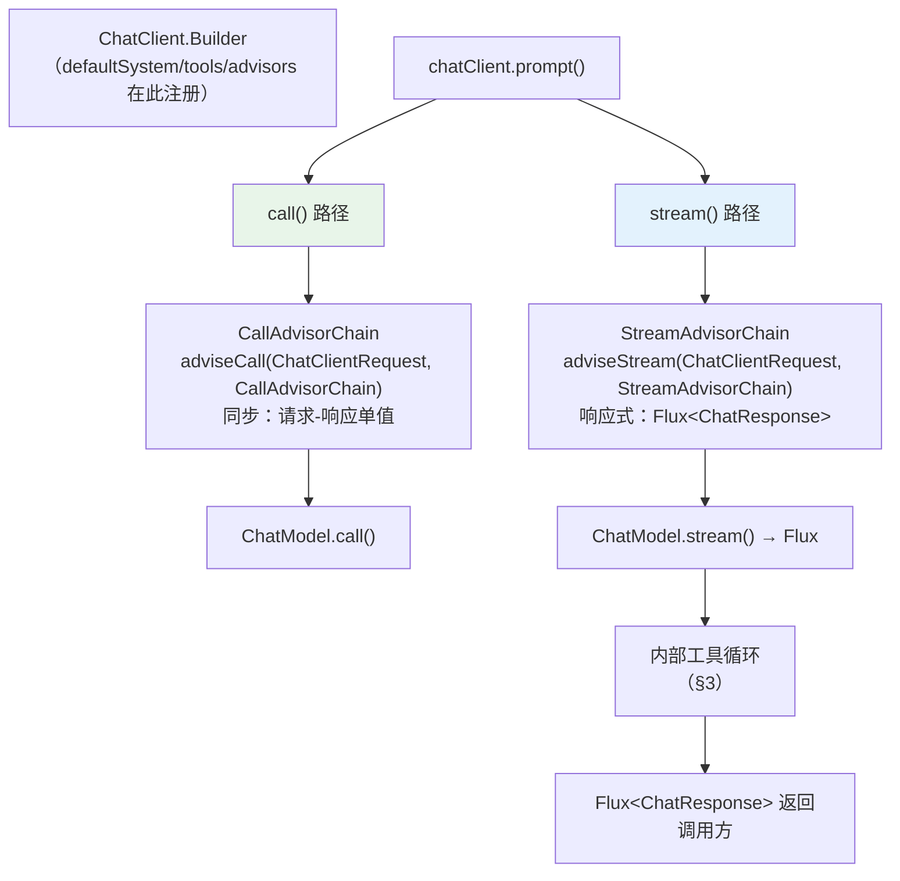
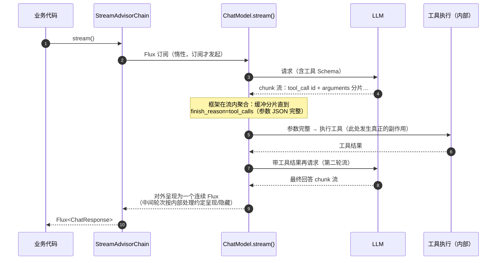

# 流式执行链源码解析

> **定位**：补齐源码解析的流式半边——`chatClient.prompt().stream()` 从 Builder 到 `Flux<ChatResponse>` 的执行链：StreamAdvisor 的链式调用形态、流式路径下工具调用如何被聚合与续流、记忆/审计类扩展为什么在流式下写法完全不同。与 [附录 03-Spring-AI源码解析/01-Advisor执行链源码]（同步侧）配对阅读。**API 真实性口径**：接口签名以 [附录 05-SpringAI2-API基准] 为准；内部类名与调用顺序为**机制解析**（基于 2.0 公开接口与行为推断，逐处标注「以仓库源码为准」）——本文目标是让你读官方源码时有地图，不是替代源码。
>
> **读者画像**：要写 StreamAdvisor（[教程 02-SpringAI核心机制/04-Advisor链与拦截器] 审计发现全体系零示例）或排查"流式下工具调用/记忆不生效"的工程师。
>
> **前置阅读**：[教程 02-SpringAI核心机制/04-Advisor链与拦截器]；[教程 03-React前端与AgenticUI/04-流式工具调用与事件协议]（应用层视角）；[附录 05-SpringAI2-API基准/00-Advisor与ChatMemory]。
>
> **版本基准**：Spring AI 2.0.0。

---

## 1. 全景：同步链与流式链的分叉点



**关键事实**：两条链是**分开执行**的——同一个 Advisor 类如果只实现了 `adviseCall`，在 `stream()` 路径上根本不会被调用（反之亦然）。这就是 [教程 02-SpringAI核心机制/04-Advisor链与拦截器] "StreamAdvisor 名存实亡"审计发现的机制根源：写了一个 CallAdvisor 就以为全覆盖，流式调用悄悄裸奔。**生产纪律：凡在流式产品上生效的 Advisor，必须实现 StreamAdvisor（或两栖实现）**。

## 2. StreamAdvisor 的正确形态

```java
// Spring AI 2.0.0 —— 接口骨架（以附录 05 基准为准）
public interface StreamAdvisor extends Advisor {
    Flux<ChatClientResponse> adviseStream(ChatClientRequest request,
                                          StreamAdvisorChain chain);
}

// 两栖 Advisor 的标准写法：同一份逻辑，两种返回类型
public class DurationLoggingAdvisor implements CallAdvisor, StreamAdvisor {

    @Override
    public String getName() { return "DurationLoggingAdvisor"; }

    @Override
    public ChatClientResponse adviseCall(ChatClientRequest request,
                                          CallAdvisorChain chain) {
        long start = System.nanoTime();
        ChatClientResponse response = chain.nextCall(request);   // 同步：等结果
        // javap 实证：ChatClientRequest 无 chatOptions()——取 options 走 request.prompt().getOptions()
        log(start, request.prompt().getOptions() != null);
        return response;
    }

    @Override
    public Flux<ChatClientResponse> adviseStream(ChatClientRequest request,
                                                 StreamAdvisorChain chain) {
        long start = System.nanoTime();
        return chain.nextStream(request)                          // 响应式：拿的是 Flux
                .doFinally(signal ->                              // 在流的终止信号上计时
                        logElapsed(start, signal));
    }
}
```

四个必须刻进肌肉的差异：

1. **计时要挂信号不挂方法**：`adviseStream` 方法返回时流还没开始（Flux 惰性）——在方法体里 stop 计时得到的是"组装时间"（微秒级），不是生成时长。`doFinally`/`doOnComplete`/`doOnError` 才是流的生命周期挂点。
2. **短路要返回 Flux**：鉴权失败等短路场景返回 `Flux.error(...)` 或带错误的 `ChatClientResponse` 单值流，而不是同步路径的构造返回值。
3. **修改请求用 mutate**：给下游加参数/header 与同步侧相同（`request.mutate()` 前缀），但作用的是**流开始前**的快照——流已经发出后再 mutate 无效。
4. **顺序语义**：链的 Order 对流同样生效（先注册者在外层）；"在最外层聚合、在最内层修改请求"的安排与同步侧一致。

## 3. 流式路径下的工具调用：框架内部发生了什么

[教程 02-SpringAI核心机制/00-SSE流式通信 §2.2] 应用层讲过"arguments 分片到达"；这里从框架视角补齐（内部实现细节**以仓库源码为准**，此处为机制模型）：



三个推论（排障时直接可用）：

1. **观测上中间轮次可见**：gen_ai.chat.model 的 Observation 每轮一个 Span（[教程 02-SpringAI核心机制/03-结构化输出 §3] 的两轮 Span 树就是它）——**外部 Flux 是一个，内部轮次是多个模型调用**。
2. **取消传播有边界**：调用方 cancel Flux → 上游 HTTP 取消；但**已进入工具执行的部分不可中断**（除非工具自身协作式取消，[教程 02-SpringAI核心机制/00-SSE流式通信 §5]）——HITL 挂起点设计（[教程 04-企业级架构主干/08-Human-in-the-Loop与审批流]）因此必须放在工具执行层而不是 Advisor 层。
3. **记忆写入要挂流的终点**：doOnComplete 拿到的是"流完成"信号，完整聚合后写入 ChatMemory；用户中途取消（doOnCancel）时部分回复是否入库是产品决策，但**实现位置就在这两个信号回调里**（[教程 00-基础与核心/04-记忆与会话管理] 深化点"流式+记忆"的机制落点）。

## 4. 从机制到实现：写一个流式记忆 Advisor

把 §2/§3 的机制组合成 [教程 02-SpringAI核心机制/04-Advisor链与拦截器] 缺失的完整示例：

```java
public class StreamingMemoryAdvisor implements StreamAdvisor {

    private final ChatMemoryRepository repository;   // 真实签名（附录 05 基准）

    @Override
    public String getName() { return "StreamingMemoryAdvisor"; }

    @Override
    public Flux<ChatClientResponse> adviseStream(ChatClientRequest request,
                                                 StreamAdvisorChain chain) {
        String conversationId = extractConversationId(request);
        // ① 进：历史注入（流开始前的请求修改，合法窗口）
        ChatClientRequest enriched = request.mutate()
                .messages(withHistory(request, conversationId))
                .build();
        StringBuilder buffered = new StringBuilder();
        return chain.nextStream(enriched)
                // ② 中：聚合助手输出（取消时丢弃部分内容——产品决策点）
                .doOnNext(resp -> appendAssistantContent(buffered, resp))
                // ③ 出：流终止写入记忆（完整/部分/错误三分支显式处理）
                .doOnComplete(() -> repository.saveAll(conversationId,
                        List.of(assistantMessage(buffered.toString()))))
                .doOnError(e -> repository.saveAll(conversationId,
                        List.of(assistantMessage("[interrupted] " + buffered))))
                .doOnCancel(() -> { /* 取消策略：丢弃/入库，二选一并注释理由 */ });
    }
}
```

> **标注**：`request.mutate().messages(...)` 等链式细节以所引 Spring AI 2.0 版本源码为准（附录 05 纪律）；结构（进-中-出三窗口）是稳定的。

## 5. 源码阅读地图

按此顺序读 spring-ai 仓库（模块/类名以实际为准）：

| # | 读什么 | 找什么 |
|---|--------|--------|
| 1 | ChatClient 的 stream 入口（DefaultChatClient 一族） | prompt() → spec 对象 → 链构建的分叉点 |
| 2 | Advisor 链的执行器 | nextStream/nextCall 的链游标实现（对比两栖差异） |
| 3 | ChatModel.stream 的 OpenAI 实现 | SSE 解析、tool_call 聚合缓冲、finish_reason 分支 |
| 4 | 内部工具循环 | 聚合完成 → ToolCallingManager 执行 → 二轮请求的拼接 |
| 5 | Observation 织入点 | 每轮 Span 的创建位置（对应 [教程 02-SpringAI核心机制/03-结构化输出 §2.2] 时序） |

## 6. 适用场景与不适用场景

### 适用场景

- 为流式产品写 Advisor（两栖实现 + 信号挂点）
- 排障"流式下工具/记忆/审计不生效"（先查链：实现了哪个接口？）
- 读懂 gen_ai Span 树为什么是"外层一个流、内层多轮调用"

### 不适用场景

- 同步 `call()` 场景的扩展（读 [01-Advisor执行链源码] 即可）
- 把本文机制模型当源码逐行事实——内部实现随版本演进，签名以附录 05 与仓库为准

## 7. 常见误区与反模式

1. **只实现 adviseCall**——流式路径静默绕过；两栖或按产品形态显式声明。
2. **在 adviseStream 方法体里计时/落账**——拿到的是组装时间；挂 doFinally。
3. **短路返回同步构造的假 Flux**——类型对但语义错（没有错误信号，前端等不到终止事件）。
4. **doOnNext 里做重活**——每个 chunk 一次回调，IO 会拖慢整个流的消费速率（背压传导，[教程 00-基础与核心/01-Spring-AI框架入门]）。
5. **记忆写入只写 doOnComplete**——错误/取消路径丢失写入或重复写入（§4 的三分支）。

## 8. 总结

流式执行链的三把钥匙：**两条链分开执行（两栖 Advisor 纪律）、流的生命周期挂在信号而非方法（doFinally/doOnComplete/doOnCancel 三窗口）、工具调用在流内聚合续流（外层一个 Flux、内层多轮 Span）**。拿着这张地图去读 spring-ai 源码，[教程 02-SpringAI核心机制/04-Advisor链与拦截器]/[教程 03-React前端与AgenticUI/04-流式工具调用与事件协议] 的所有"流式下为什么这样"都有了机制答案。

**外部来源**：[Spring AI 参考文档 – Advisors](https://docs.spring.io/spring-ai/reference/api/advisors-api.html) · [spring-ai 仓库](https://github.com/spring-projects/spring-ai) · [附录 05-SpringAI2-API基准/00-Advisor与ChatMemory]（签名基准）
