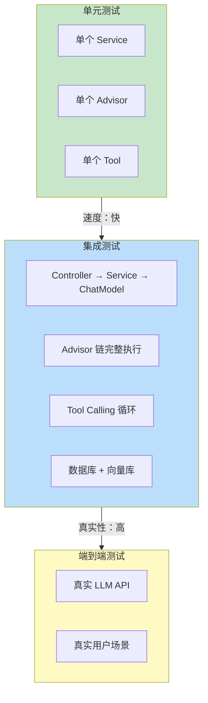
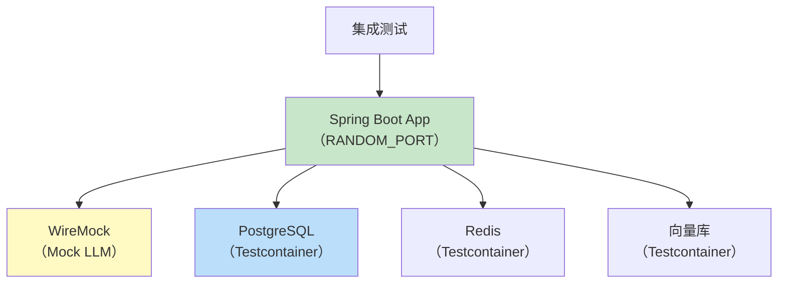
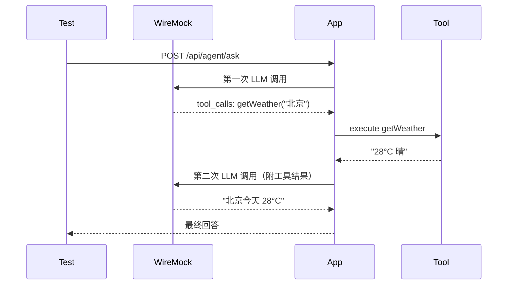
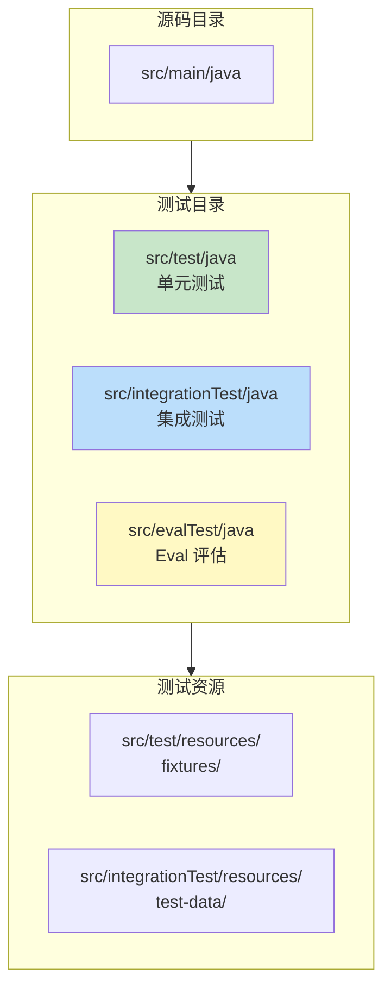

# Agent 集成测试：Spring Boot Test 全链路验证

> 「本文是对 [教程 30-容错 §3-§5] 的深入展开」

> **定位**：系统讲解 Agent 系统的集成测试策略——使用 Spring Boot Test + Testcontainers + WireMock 搭建完整测试环境，验证从 HTTP 入口到 LLM 调用的全链路，以及容错机制的端到端验证。
>
> **读者画像**：已经掌握单元测试，需要验证多个组件协作正确性的中高级开发者。

---

## 1. 集成测试的范围与边界

### 1.1 单元测试 vs 集成测试 vs E2E



### 1.2 集成测试的核心目标

| 目标 | 验证内容 | 工具 |
|------|---------|------|
| 组件协作 | Spring DI 正确装配 | `@SpringBootTest` |
| HTTP 链路 | SSE 推流正确 | `WebTestClient` |
| LLM Mock | 不依赖真实 API | `WireMock` |
| 数据持久化 | 向量库/关系库 | `Testcontainers` |
| 容错机制 | 重试、降级、超时 | `@SpringBootTest` + 故障注入 |

---

## 2. 测试环境搭建

### 2.1 完整的测试配置

```java
@SpringBootTest(webEnvironment = SpringBootTest.WebEnvironment.RANDOM_PORT)
@Testcontainers
class AgentIntegrationTest {

    @LocalServerPort
    private int port;

    @Autowired
    private WebTestClient webTestClient;

    // 1. PostgreSQL 容器（对话历史存储）
    @Container
    static PostgreSQLContainer<?> postgres = new PostgreSQLContainer<>("postgres:16");

    // 2. Redis 容器（缓存/会话）
    @Container
    static GenericContainer<?> redis = new GenericContainer<>("redis:7")
        .withExposedPorts(6379);

    // 3. WireMock（Mock LLM API）
    @RegisterExtension
    static WireMockExtension wireMock = WireMockExtension.newInstance()
        .options(wireMockConfig().dynamicPort())
        .build();

    @DynamicPropertySource
    static void configureProperties(DynamicPropertyRegistry registry) {
        registry.add("spring.datasource.url", postgres::getJdbcUrl);
        registry.add("spring.data.redis.host", redis::getHost);
        registry.add("spring.data.redis.port", () -> redis.getMappedPort(6379));
        // 指向 WireMock 而非真实 OpenAI
        registry.add("spring.ai.openai.base-url",
            () -> wireMock.getRuntimeInfo().getHttpBaseUrl());
        registry.add("spring.ai.openai.api-key", () -> "test-key");
    }
}
```



### 2.2 WireMock 配置 LLM 响应

```java
private void stubLlmResponse(String expectedPrompt, String responseText) {
    wireMock.stubFor(post(urlPathEqualTo("/v1/chat/completions"))
        .withHeader("Authorization", equalTo("Bearer test-key"))
        .willReturn(aResponse()
            .withHeader("Content-Type", "application/json")
            .withBody("""
                {
                  "id": "chatcmpl-test",
                  "choices": [{
                    "message": {
                      "role": "assistant",
                      "content": "%s"
                    },
                    "finish_reason": "stop"
                  }]
                }
                """.formatted(responseText))));
}

private void stubLlmStream(List<String> chunks) {
    String sseBody = chunks.stream()
        .map(chunk -> """
            data: {"choices":[{"delta":{"content":"%s"}}]}
            """.formatted(chunk))
        .collect(Collectors.joining("\n\n")) + "\n\ndata: [DONE]\n";

    wireMock.stubFor(post(urlPathEqualTo("/v1/chat/completions"))
        .willReturn(aResponse()
            .withHeader("Content-Type", "text/event-stream")
            .withBody(sseBody)));
}
```

---

## 3. SSE 流式端点测试

### 3.1 基本流式测试

```java
@Test
void chatStream_shouldReturnTokenStream() {
    stubLlmStream(List.of("你好", "，", "今天", "天气", "很好"));

    webTestClient.get()
        .uri(uriBuilder -> uriBuilder
            .path("/api/agent/chat")
            .queryParam("message", "你好")
            .build())
        .accept(MediaType.TEXT_EVENT_STREAM)
        .exchange()
        .expectStatus().isOk()
        .expectHeader().contentType(MediaType.TEXT_EVENT_STREAM)
        .returnResult(String.class)
        .getResponseBody()
        .as(StepVerifier::create)
        .expectNext("你好")
        .expectNext("，")
        .expectNext("今天")
        .expectNext("天气")
        .expectNext("很好")
        .verifyComplete();
}
```

### 3.2 测试 SSE 错误处理

```java
@Test
void chatStream_shouldFallback_onLlmTimeout() {
    // WireMock 模拟超时
    wireMock.stubFor(post(urlPathEqualTo("/v1/chat/completions"))
        .willReturn(aResponse()
            .withFixedDelay(65000)  // 超过 60s 超时
            .withBody("{}")));

    webTestClient.get()
        .uri(uriBuilder -> uriBuilder
            .path("/api/agent/chat")
            .queryParam("message", "test")
            .build())
        .accept(MediaType.TEXT_EVENT_STREAM)
        .exchange()
        .expectStatus().isOk()
        .returnResult(String.class)
        .getResponseBody()
        .as(StepVerifier::create)
        .expectNextMatches(s -> s.contains("[ERROR]") || s.contains("超时"))
        .verifyComplete();
}
```

### 3.3 测试客户端断连

```java
@Test
void chatStream_shouldCancelUpstream_onClientDisconnect() {
    stubLlmStream(List.of("hello", "world", "and", "more"));

    // 建立连接，消费 1 个 token 后断开
    webTestClient.get()
        .uri("/api/agent/chat?message=test")
        .accept(MediaType.TEXT_EVENT_STREAM)
        .exchange()
        .expectStatus().isOk()
        .returnResult(String.class)
        .getResponseBody()
        .take(1)  // 只取第一个
        .as(StepVerifier::create)
        .expectNext("hello")
        .thenCancel()  // 模拟客户端断连
        .verify();

    // 等待传播
    await().atMost(2, SECONDS).untilAsserted(() -> {
        // 验证上游被取消（WireMock 请求被中断）
        // 或验证指标
    });
}
```

---

## 4. Tool Calling 集成测试

### 4.1 完整工具调用循环

```java
@Test
void shouldExecuteToolAndReturnAnswer() {
    // 第一次 LLM 响应：请求调用工具
    wireMock.stubFor(post(urlPathEqualTo("/v1/chat/completions"))
        .inScenario("ToolCalling")
        .whenScenarioStateIs("Started")
        .willReturn(aResponse()
            .withBody("""
                {
                  "choices": [{
                    "message": {
                      "role": "assistant",
                      "tool_calls": [{
                        "id": "call_1",
                        "function": {
                          "name": "getWeather",
                          "arguments": "{\\"city\\": \\"北京\\"}"
                        }
                      }]
                    },
                    "finish_reason": "tool_calls"
                  }]
                }
                """))
        .willSetStateTo("ToolExecuted"));

    // 第二次 LLM 响应：基于工具结果生成回答
    wireMock.stubFor(post(urlPathEqualTo("/v1/chat/completions"))
        .inScenario("ToolCalling")
        .whenScenarioStateIs("ToolExecuted")
        .willReturn(aResponse()
            .withBody("""
                {
                  "choices": [{
                    "message": {
                      "role": "assistant",
                      "content": "北京今天 28°C，晴天。"
                    },
                    "finish_reason": "stop"
                  }]
                }
                """)));

    // 执行
    webTestClient.post()
        .uri("/api/agent/ask")
        .bodyValue(Map.of("message", "北京天气怎么样？"))
        .exchange()
        .expectStatus().isOk()
        .expectBody()
        .jsonPath("$.answer").isEqualTo("北京今天 28°C，晴天。");

    // 验证 LLM 被调用了两次
    wireMock.verify(2, postRequestedFor(urlPathEqualTo("/v1/chat/completions")));
}
```



---

## 5. 数据持久化集成测试

### 5.1 对话历史存储

```java
@Test
void shouldPersistConversationHistory() {
    stubLlmResponse("你好", "你好！有什么可以帮你的？");

    // 第一次对话
    webTestClient.post()
        .uri("/api/agent/ask")
        .header("X-User-Id", "user-123")
        .bodyValue(Map.of("message", "你好"))
        .exchange()
        .expectStatus().isOk();

    // 验证数据库中有记录
    assertThat(jdbcTemplate.queryForList(
        "SELECT * FROM conversation_history WHERE user_id = ?",
        "user-123"
    )).hasSize(1);

    // 第二次对话应该携带历史
    stubLlmResponse("根据上一次对话...", "你还说过你好");

    webTestClient.post()
        .uri("/api/agent/ask")
        .header("X-User-Id", "user-123")
        .bodyValue(Map.of("message", "我之前说了什么？"))
        .exchange()
        .expectStatus().isOk()
        .expectBody()
        .jsonPath("$.answer").value(containsString("你好"));

    // 验证 WireMock 收到的第二次请求包含历史
    String secondRequest = wireMock.findAll(postRequestedFor(urlPathEqualTo("/v1/chat/completions")))
        .get(1)
        .getBodyAsString();
    assertThat(secondRequest).contains("你好");
}
```

### 5.2 向量库集成测试

```java
@Testcontainers
class VectorStoreIntegrationTest {

    @Container
    static GenericContainer<?> weaviate = new GenericContainer<>("semitechnologies/weaviate:1.25")
        .withExposedPorts(8080)
        .withEnv("AUTHENTICATION_ANONYMOUS_ACCESS_ENABLED", "true");

    @Autowired
    private VectorStore vectorStore;

    @Test
    void shouldRetrieveRelevantDocuments() {
        // 存入测试文档
        vectorStore.add(List.of(
            Document.builder().text("Java 21 引入了虚拟线程").metadata(Map.of("category", "java")).build(),
            Document.builder().text("Spring Boot 4.1 支持自动配置").metadata(Map.of("category", "spring")).build(),
            Document.builder().text("Python 是数据科学的首选语言").metadata(Map.of("category", "python")).build()
        ));

        // 等待索引
        await().atMost(5, SECONDS).untilAsserted(() ->
            assertThat(vectorStore.similaritySearch(SearchRequest.builder().query("Java").topK(3).build()))
                .hasSize(3)
        );

        // 验证检索相关性
        List<Document> results = vectorStore.similaritySearch(
            SearchRequest.builder().query("虚拟线程是什么").topK(1).build()
        );
        assertThat(results).hasSize(1);
        assertThat(results.get(0).getText()).contains("虚拟线程");
    }
}
```

---

## 6. 容错机制测试

### 6.1 重试机制

```java
@Test
void shouldRetry_onTransientFailure() {
    // 前两次返回 500，第三次成功
    wireMock.stubFor(post(urlPathEqualTo("/v1/chat/completions"))
        .inScenario("Retry")
        .whenScenarioStateIs("Started")
        .willReturn(aResponse().withStatus(500))
        .willSetStateTo("FirstRetry"));

    wireMock.stubFor(post(urlPathEqualTo("/v1/chat/completions"))
        .inScenario("Retry")
        .whenScenarioStateIs("FirstRetry")
        .willReturn(aResponse().withStatus(500))
        .willSetStateTo("SecondRetry"));

    wireMock.stubFor(post(urlPathEqualTo("/v1/chat/completions"))
        .inScenario("Retry")
        .whenScenarioStateIs("SecondRetry")
        .willReturn(aResponse()
            .withBody("""
                {"choices":[{"message":{"content":"成功了"}}]}
                """)));

    webTestClient.post()
        .uri("/api/agent/ask")
        .bodyValue(Map.of("message", "test"))
        .exchange()
        .expectStatus().isOk()
        .expectBody()
        .jsonPath("$.answer").isEqualTo("成功了");

    // 验证总共调用了 3 次
    wireMock.verify(3, postRequestedFor(urlPathEqualTo("/v1/chat/completions")));
}
```

### 6.2 降级机制

```java
@Test
void shouldFallback_whenAllRetriesExhausted() {
    // 所有请求都超时
    wireMock.stubFor(post(urlPathEqualTo("/v1/chat/completions"))
        .willReturn(aResponse()
            .withFixedDelay(35000)
            .withBody("{}")));

    webTestClient.post()
        .uri("/api/agent/ask")
        .bodyValue(Map.of("message", "test"))
        .exchange()
        .expectStatus().isOk()  // 不返回 500
        .expectBody()
        .jsonPath("$.answer").value(containsString("降级"))
        .jsonPath("$.fallback").isEqualTo(true);
}
```

### 6.3 熔断器

```java
@Test
void shouldOpenCircuit_afterConsecutiveFailures() {
    // 所有请求失败
    wireMock.stubFor(post(urlPathEqualTo("/v1/chat/completions"))
        .willReturn(aResponse().withStatus(500)));

    // 发送足够多的失败请求以触发熔断
    for (int i = 0; i < 5; i++) {
        webTestClient.post()
            .uri("/api/agent/ask")
            .bodyValue(Map.of("message", "test"))
            .exchange()
            .expectStatus().isOk();
    }

    // 第 6 次应该被熔断，不调用 LLM
    wireMock.verify(5, postRequestedFor(urlPathEqualTo("/v1/chat/completions")));

    webTestClient.post()
        .uri("/api/agent/ask")
        .bodyValue(Map.of("message", "test"))
        .exchange()
        .expectStatus().isOk()
        .expectBody()
        .jsonPath("$.answer").value(containsString("熔断"));

    // 仍然是 5 次（第 6 次被熔断器拦截）
    wireMock.verify(5, postRequestedFor(urlPathEqualTo("/v1/chat/completions")));
}
```

---

## 7. 并发与压力测试

### 7.1 并发正确性

```java
@Test
void shouldHandleConcurrentRequests_withoutStateLeakage() {
    stubLlmResponse("回复");

    int concurrency = 50;
    List<Mono<String>> requests = IntStream.range(0, concurrency)
        .mapToObj(i -> webTestClient.post()
            .uri("/api/agent/ask")
            .header("X-User-Id", "user-" + i)
            .bodyValue(Map.of("message", "msg-" + i))
            .exchange()
            .expectStatus().isOk()
            .returnResult(String.class)
            .getResponseBody()
            .next())
        .toList();

    // 并行执行
    List<String> results = Flux.merge(requests).collectList().block();

    assertThat(results).hasSize(concurrency);
    // 验证每个用户收到了各自的回复
    // 验证没有上下文泄露（user-A 的内容不会出现在 user-B 的回复中）
}
```

### 7.2 SSE 背压测试

```java
@Test
void shouldHandleBackpressure_whenConsumerIsSlow() {
    stubLlmStream(IntStream.range(0, 1000)
        .mapToObj(i -> "token-" + i)
        .toList());

    webTestClient.get()
        .uri("/api/agent/chat?message=test")
        .accept(MediaType.TEXT_EVENT_STREAM)
        .exchange()
        .expectStatus().isOk()
        .returnResult(String.class)
        .getResponseBody()
        .delayElements(Duration.ofMillis(100))  // 模拟慢消费者
        .as(StepVerifier::create)
        .thenConsumeWhile(s -> true)  // 消费所有
        .verifyComplete();
}
```

---

## 8. 测试数据管理

### 8.1 测试数据重置

```java
@AfterEach
void cleanup() {
    // 清理数据库
    jdbcTemplate.execute("TRUNCATE TABLE conversation_history");
    jdbcTemplate.execute("TRUNCATE TABLE prompt_audit_log");

    // 清理向量库
    vectorStore.delete(List.of()); // 或按条件删除

    // 重置 WireMock
    wireMock.resetAll();
}
```

### 8.2 使用 `@Sql` 注入测试数据

```java
@Test
@Sql(scripts = "/test-data/conversations.sql")
void shouldIncludeHistoryInPrompt() {
    // conversations.sql 预置了对话历史
    // 测试时直接验证历史是否被正确注入
}
```

---

## 9. 测试组织与分层



### 9.1 Gradle 配置

```groovy
sourceSets {
    integrationTest {
        java.srcDir 'src/integrationTest/java'
        resources.srcDir 'src/integrationTest/resources'
        compileClasspath += main.output + test.output
        runtimeClasspath += main.output + test.output
    }
}

task integrationTest(type: Test) {
    description = 'Runs integration tests.'
    group = 'verification'
    testClassesDirs = sourceSets.integrationTest.output.classesDirs
    classpath = sourceSets.integrationTest.runtimeClasspath
    useJUnitPlatform()
}

check.dependsOn integrationTest
```

---

## 10. 总结

集成测试是验证 Agent 系统可靠性的关键层：

1. **用 WireMock 替代真实 LLM**——可控、快速、免费。
2. **Testcontainers 搭建依赖**——PostgreSQL、Redis、向量库，一键启动。
3. **SSE 测试用 WebTestClient + StepVerifier**——流式测试的标准组合。
4. **Tool Calling 用 Scenario 状态机**——模拟多轮工具调用循环。
5. **容错测试必须覆盖**——重试、降级、熔断、超时。
6. **并发测试验证状态隔离**——确保多用户不互相干扰。

下一篇讨论 Eval 评估——如何评估 Agent 在真实 LLM 下的输出质量。
