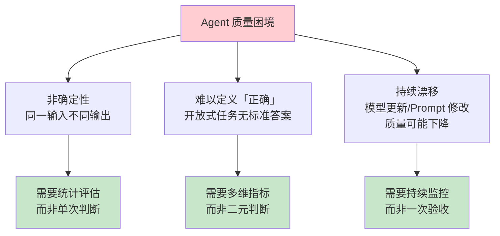
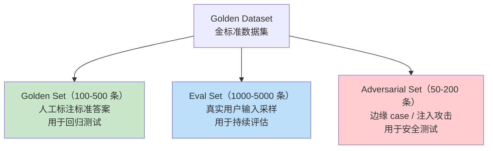
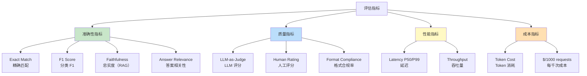
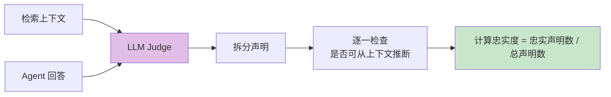
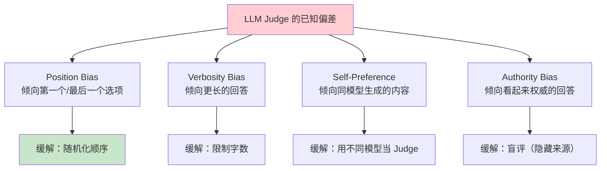
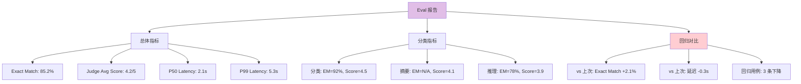
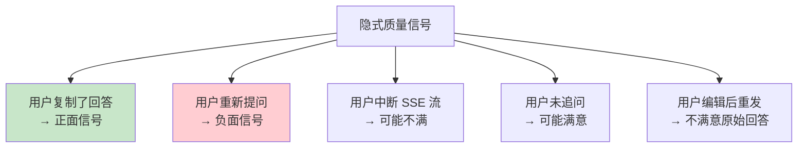

# Agent Eval 评估：从准确率到综合质量度量

> 「本文是对 [教程 80-自我反思与Agent评估 §3-§5] 的深入展开」

> **定位**：系统讲解 AI Agent 输出质量的评估方法论——数据集构建、评估指标（准确率/忠实度/相关性/延迟/成本）、LLM-as-Judge 模式、A/B 测试框架，以及如何建立持续评估的 CI 流程。
>
> **读者画像**：Agent 已经上线或即将上线，需要一套系统化的质量评估体系来持续监控和改进输出质量。

---

## 1. 为什么需要 Eval

### 1.1 Agent 输出质量的三重困境



### 1.2 Eval 的目标

| 目标 | 描述 | 频率 |
|------|------|------|
| 回归检测 | Prompt/模型变更后，质量是否下降？ | 每次变更 |
| 版本对比 | 新版本是否优于旧版本？ | A/B 测试时 |
| 质量监控 | 线上输出质量是否稳定？ | 每日/实时 |
| 成本优化 | 更便宜的模型是否足够？ | 迁移评估 |

---

## 2. 评估数据集构建

### 2.1 数据集的三个层次



### 2.2 Golden Set 构建

```java
@Entity
public class GoldenCase {

    @Id @GeneratedValue
    private Long id;

    private String category;        // 分类（分类/摘要/翻译/推理...）
    private String userInput;       // 用户输入
    private String expectedOutput;  // 标准答案
    private String evaluationCriteria; // 评估标准（自然语言）
    private Integer difficulty;     // 1-5 难度等级
    private String tags;            // 标签（json_array）

    @CreatedDate
    private LocalDateTime createdAt;
}
```

```java
@Component
public class GoldenDatasetLoader {

    public List<GoldenCase> loadFromResource(String path) {
        try {
            String json = Files.readString(Path.of(path));
            return objectMapper.readValue(json,
                new TypeReference<List<GoldenCase>>() {});
        } catch (IOException e) {
            throw new RuntimeException("加载金标准数据集失败", e);
        }
    }
}
```

### 2.3 数据集示例

```json
[
  {
    "category": "classification",
    "userInput": "产品质量太差了，一周就坏了",
    "expectedOutput": "负面",
    "evaluationCriteria": "输出必须是 正面/负面/中性 之一",
    "difficulty": 1,
    "tags": ["sentiment", "negative"]
  },
  {
    "category": "summarization",
    "userInput": "（长文本）",
    "expectedOutput": "一段 100 字以内的摘要，包含三个要点：1. 2. 3.",
    "evaluationCriteria": "摘要应在 100 字以内，覆盖主要观点",
    "difficulty": 3,
    "tags": ["summary", "length"]
  },
  {
    "category": "reasoning",
    "userInput": "如果 A>B, B>C, C>D, 则 A 和 D 的关系？",
    "expectedOutput": "A > D",
    "evaluationCriteria": "必须通过传递推理得出正确结论",
    "difficulty": 2,
    "tags": ["transitive", "logic"]
  }
]
```

---

## 3. 评估指标体系

### 3.1 指标全景



### 3.2 精确匹配与 F1

```java
@Component
public class AccuracyEvaluator {

    // 精确匹配
    public double exactMatch(List<EvalResult> results) {
        long correct = results.stream()
            .filter(r -> normalize(r.predicted()).equals(normalize(r.expected())))
            .count();
        return (double) correct / results.size();
    }

    // 分类 F1 Score
    public Map<String, Double> f1Score(List<EvalResult> results) {
        Map<String, List<EvalResult>> byCategory = results.stream()
            .collect(Collectors.groupingBy(EvalResult::expected));

        Map<String, Double> f1Scores = new HashMap<>();
        for (String category : byCategory.keySet()) {
            List<EvalResult> categoryResults = byCategory.get(category);
            long tp = categoryResults.stream()
                .filter(r -> r.predicted().equals(r.expected()))
                .count();
            long fp = results.stream()
                .filter(r -> r.predicted().equals(category) && !r.expected().equals(category))
                .count();
            long fn = categoryResults.stream()
                .filter(r -> !r.predicted().equals(r.expected()))
                .count();

            double precision = (double) tp / (tp + fp + 1);
            double recall = (double) tp / (tp + fn + 1);
            double f1 = 2 * precision * recall / (precision + recall + 0.001);
            f1Scores.put(category, f1);
        }
        return f1Scores;
    }

    private String normalize(String s) {
        return s.trim().toLowerCase().replaceAll("[。.!！?？]", "");
    }
}
```

### 3.3 RAG 忠实度（Faithfulness）

```java
@Component
public class RAGFaithfulnessEvaluator {

    private final ChatClient judgeClient;

    /**
     * 评估回答是否忠实于检索到的上下文（不幻觉）
     * 返回 0.0-1.0 的分数
     */
    public Mono<Double> evaluate(String answer, List<String> retrievedDocs) {
        String context = String.join("\n", retrievedDocs);
        String judgePrompt = """
            你是一个忠实度评估器。

            上下文：
            %s

            回答：
            %s

            请判断回答中的每个声明是否都可以从上下文中找到支持。
            不能从上下文推断出的声明即为"不忠实"。

            输出 JSON：
            {
              "claims": [
                {"statement": "声明内容", "faithful": true/false}
              ],
              "score": 0.0-1.0
            }
            """.formatted(context, answer);

        return Mono.fromCallable(() -> judgeClient.prompt()
                .user(judgePrompt)
                .call()
                .entity(FaithfulnessResult.class))
            .subscribeOn(Schedulers.boundedElastic())
            .map(FaithfulnessResult::score);
    }
}

public record FaithfulnessResult(
    List<Claim> claims,
    double score
) {}
public record Claim(String statement, boolean faithful) {}
```



---

## 4. LLM-as-Judge

> **框架内置评估器**（javap 实证 2026-08-16）：Spring AI 2.0.0 官方存在 Evaluator 体系——`org.springframework.ai.evaluation.Evaluator`/`EvaluationRequest`/`EvaluationResponse`（spring-ai-commons）+ `org.springframework.ai.chat.evaluation.RelevancyEvaluator`/`FactCheckingEvaluator`（spring-ai-client-chat，基于 `ChatClient.Builder`，内部即 LLM-as-Judge）。下方自研 Judge 是可定制写法；标准场景可直接用官方 Evaluator。

### 4.1 LLM 评分模式

```java
@Component
public class LlmAsJudgeEvaluator {

    private final ChatClient judgeModel;  // 最好用更强的模型当裁判

    public Mono<EvalScore> evaluate(EvalCase testCase, String agentOutput) {
        String judgePrompt = """
            你是一个专业的评估员。请根据以下标准评估 Agent 的回答。

            ## 评估标准
            %s

            ## 用户问题
            %s

            ## 参考答案
            %s

            ## Agent 回答
            %s

            ## 请从以下维度评分（1-5 分）：
            1. 准确性：回答是否正确
            2. 完整性：是否覆盖了所有要点
            3. 相关性：是否紧扣问题
            4. 简洁性：是否简洁不冗余
            5. 格式：是否符合要求格式

            输出 JSON：
            {
              "accuracy": 1-5,
              "completeness": 1-5,
              "relevance": 1-5,
              "conciseness": 1-5,
              "format": 1-5,
              "overall": 1-5,
              "reasoning": "评分理由"
            }
            """.formatted(
                testCase.evaluationCriteria(),
                testCase.userInput(),
                testCase.expectedOutput(),
                agentOutput
            );

        return Mono.fromCallable(() -> judgeModel.prompt()
                .user(judgePrompt)
                .call()
                .entity(EvalScore.class))
            .subscribeOn(Schedulers.boundedElastic());
    }
}

public record EvalScore(
    int accuracy,
    int completeness,
    int relevance,
    int conciseness,
    int format,
    int overall,
    String reasoning
) {}
```

### 4.2 LLM-as-Judge 的偏差与缓解



### 4.3 Pairwise Comparison（对比评估）

```java
public Mono<PairwiseResult> compare(
        String question, String answerA, String answerB) {
    // 随机化 A/B 顺序，消除 position bias
    boolean swapped = ThreadLocalRandom.current().nextBoolean();
    String first = swapped ? answerB : answerA;
    String second = swapped ? answerA : answerB;

    String prompt = """
        你是评估员。以下是对同一问题的两个回答。

        问题：%s

        回答 1：%s

        回答 2：%s

        哪个回答更好？只输出 "1"、"2" 或 "tie"。
        """.formatted(question, first, second);

    return Mono.fromCallable(() -> judgeModel.prompt()
            .user(prompt)
            .call()
            .content())
        .subscribeOn(Schedulers.boundedElastic())
        .map(result -> {
            String winner = result.trim();
            if (swapped) {
                winner = winner.equals("1") ? "B" : winner.equals("2") ? "A" : "tie";
            } else {
                winner = winner.equals("1") ? "A" : winner.equals("2") ? "B" : "tie";
            }
            return new PairwiseResult(winner);
        });
}
```

---

## 5. 评估流水线

### 5.1 完整的 Eval Runner

```java
@Component
public class EvalRunner {

    private final ChatClient agentClient;
    private final LlmAsJudgeEvaluator judgeEvaluator;
    private final AccuracyEvaluator accuracyEvaluator;

    public EvalReport runEvaluation(List<GoldenCase> dataset) {
        List<EvalResult> results = new ArrayList<>();

        for (GoldenCase testCase : dataset) {
            // 1. Agent 生成回答
            long startTime = System.nanoTime();
            String agentOutput = agentClient.prompt()
                .user(testCase.userInput())
                .call()
                .content();
            long latencyMs = (System.nanoTime() - startTime) / 1_000_000;

            // 2. Judge 评分
            EvalScore score = judgeEvaluator.evaluate(testCase, agentOutput)
                .block(Duration.ofMinutes(1));

            results.add(new EvalResult(
                testCase.category(),
                testCase.userInput(),
                testCase.expectedOutput(),
                agentOutput,
                score,
                latencyMs
            ));
        }

        return generateReport(results);
    }

    private EvalReport generateReport(List<EvalResult> results) {
        return EvalReport.builder()
            .totalCases(results.size())
            .exactMatch(accuracyEvaluator.exactMatch(results))
            .avgJudgeScore(results.stream()
                .mapToInt(r -> r.score().overall())
                .average().orElse(0))
            .avgLatencyMs(results.stream()
                .mapToLong(EvalResult::latencyMs)
                .average().orElse(0))
            .p99LatencyMs(percentile(results.stream()
                .mapToLong(EvalResult::latencyMs)
                .sorted().toArray(), 99))
            .byCategory(results.stream()
                .collect(Collectors.groupingBy(EvalResult::category)))
            .build();
    }
}
```

### 5.2 报告格式



---

## 6. 持续评估 CI 流程

### 6.1 GitHub Actions 集成

```yaml
name: Agent Eval
on:
  push:
    branches: [main]
    paths:
      - 'src/main/resources/prompts/**'  # Prompt 变更时触发
      - 'src/evalTest/**'
  schedule:
    - cron: "0 2 * * *"  # 每日 2 点定时

jobs:
  eval:
    runs-on: ubuntu-latest
    steps:
      - uses: actions/checkout@v4
      - name: Run Eval
        run: ./gradlew evalTest
        env:
          OPENAI_API_KEY: ${{ secrets.OPENAI_API_KEY }}
      - name: Upload Report
        uses: actions/upload-artifact@v4
        with:
          name: eval-report
          path: build/eval-report.json
      - name: Check Regression
        run: ./gradlew evalRegressionCheck
        # 如果回归超过阈值，CI 失败
```

### 6.2 回归检测逻辑

```java
@Component
public class RegressionDetector {

    private static final double EM_THRESHOLD = 0.02;   // Exact Match 下降不超过 2%
    private static final double SCORE_THRESHOLD = 0.3;  // Judge Score 下降不超过 0.3

    public RegressionReport compare(EvalReport current, EvalReport baseline) {
        List<Regression> regressions = new ArrayList<>();

        double emDelta = current.exactMatch() - baseline.exactMatch();
        if (emDelta < -EM_THRESHOLD) {
            regressions.add(new Regression(
                "exact_match", baseline.exactMatch(), current.exactMatch(),
                Severity.HIGH
            ));
        }

        double scoreDelta = current.avgJudgeScore() - baseline.avgJudgeScore();
        if (scoreDelta < -SCORE_THRESHOLD) {
            regressions.add(new Regression(
                "judge_score", baseline.avgJudgeScore(), current.avgJudgeScore(),
                Severity.MEDIUM
            ));
        }

        return new RegressionReport(regressions,
            regressions.isEmpty() ? Status.PASS : Status.FAIL);
    }
}
```

---

## 7. 在线评估

### 7.1 用户反馈收集

```java
@RestController
public class FeedbackController {

    @PostMapping("/api/feedback")
    public Mono<Void> feedback(@RequestBody FeedbackRequest req) {
        // 存储到反馈表，供后续分析
        return feedbackRepository.save(req)
            .doOnNext(saved -> metrics.recordFeedback(saved.rating()))
            .then();
    }
}

public record FeedbackRequest(
    String conversationId,
    String messageId,
    int rating,           // 1-5
    String feedbackType,  // good/bad
    String comment        // 可选
) {}
```

### 7.2 隐式信号采集



```java
@Aspect
@Component
public class ImplicitFeedbackAspect {

    @AfterReturning("execution(* AgentController.*(..)) && args(request, ..)")
    public void trackUserFollowUp(JoinPoint jp, Object request) {
        String conversationId = extractConversationId(request);
        // 如果短时间内同一 conversation 有新请求，可能是不满意
        if (recentQueryExists(conversationId, Duration.ofSeconds(30))) {
            metrics.increment("implicit.negative.refine");
        }
    }
}
```

---

## 8. 总结

Agent 评估是一个多维度、持续性的工程：

1. **Golden Set 是基础**——100-500 条人工标注数据，用于回归测试。
2. **多维指标**——精确匹配 + LLM Judge + 忠实度 + 性能 + 成本。
3. **LLM-as-Judge 是核心**——但要注意偏差（position、verbosity、self-preference）。
4. **持续评估**——CI 流水线 + 每日定时 + 回归检测。
5. **在线评估**——用户反馈（显式）+ 行为信号（隐式）。
6. **评估驱动的迭代**——每次 Prompt/模型变更都跑 Eval，用数据说话。

评估不是一次性的验收，而是 Agent 系统的**持续健康检查机制**。
