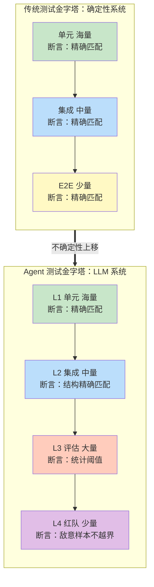
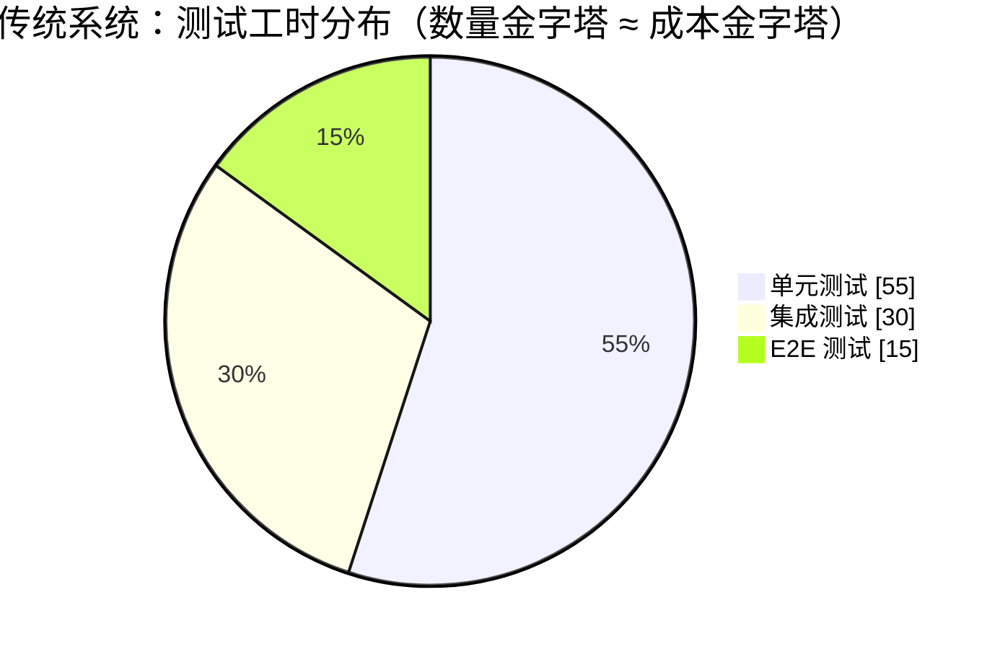
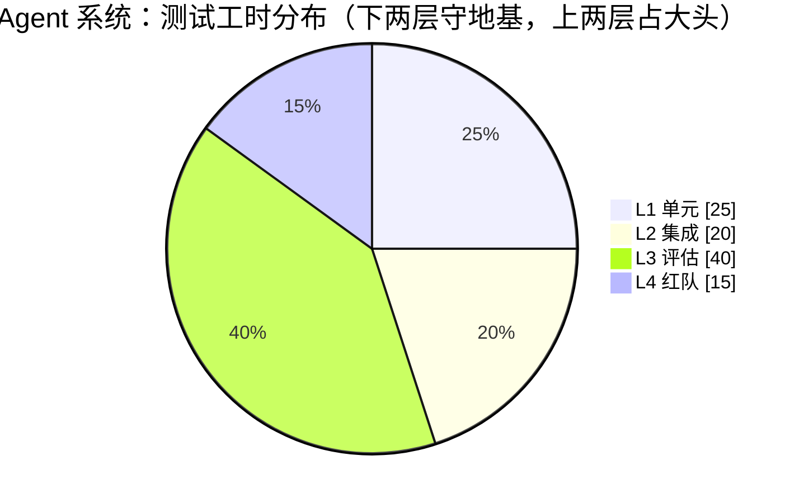
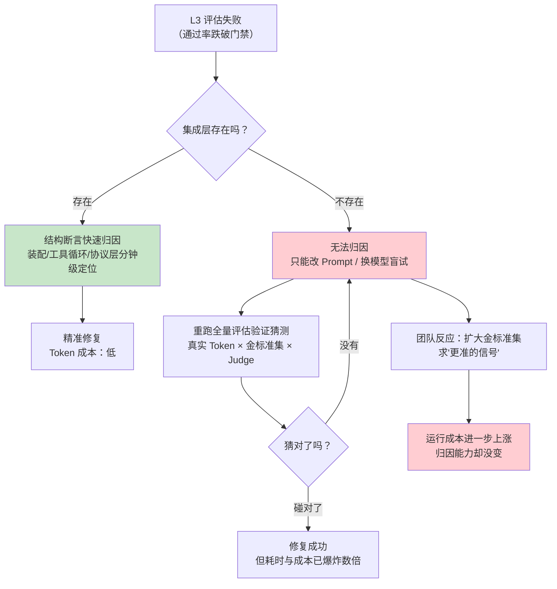
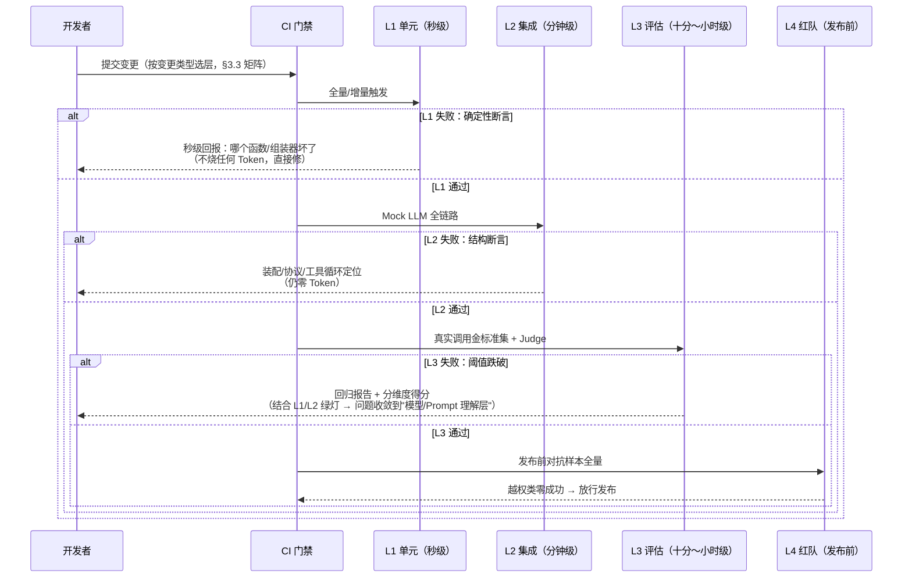

# Agent 测试金字塔与分层投入

> 「本文统帅 [附录 04-测试策略/00-单元测试]、[附录 04-测试策略/01-集成测试]、[附录 04-测试策略/02-Eval评估] 三篇——它们各讲一层"怎么测"，本文讲四层之间的关系：谁给谁兜底、投入怎么分、形态什么时候允许偏离、失败如何跨层归因」

> **定位**：给出 Agent 系统的完整测试金字塔——单元（工具函数/Prompt 组装/状态机）→ 集成（ChatClient + Mock LLM/工具替身）→ 评估（金标准集 + LLM Judge）→ 红队（注入/越权对抗）四层的职责边界、投入比例与预算模型；论证传统金字塔"越下层越多"在 Agent 系统为何失效、失效到什么程度、哪一半必须守住。
>
> **读者画像**：已经（或即将）为 Agent 系统建立测试体系的技术负责人与中高级开发者——单篇会写某一层的用例，但不知道总预算怎么切、为什么评估团队越来越大、单元测试还值不值得投入。
>
> **前置阅读**：[附录 04-测试策略/00-单元测试]（L1 怎么做）、[附录 04-测试策略/01-集成测试]（L2 怎么做）、[附录 04-测试策略/02-Eval评估]（L3 怎么做）。本文不重复三篇的具体做法，只做统帅。

---

## 1. 经典测试金字塔，以及它在 Agent 系统上的失效

### 1.1 经典金字塔回顾

Mike Cohn 提出的测试金字塔有一个简洁的纪律：**测试数量越往下层越多，越上层越少**。单元测试又快又稳又便宜，所以铺满；端到端测试又慢又脆又贵，所以只留几条关键路径。金字塔的形状不是审美偏好，是一个经济结论——**把确定性尽量锁在下层，让昂贵且脆弱的验证只发生在最顶层**。



把两座塔并排放，差异一眼可见：传统塔越往上**越窄**，Agent 塔在评估层**反而鼓了出去**——它比下面的集成层拥有更多的用例、更长的运行时间、更大的维护投入。这个"鼓包"不是团队偷懒，是系统性质变化的结果。

### 1.2 失效的根源：不确定性上移

传统系统里，"系统对不对"这个问题可以在单元层回答——输入确定、逻辑确定、输出确定，一个 `assertEquals` 就完成了裁决。Agent 系统里，这条确定性链条在最核心的一环断了：

| 层 | 测的对象 | 输出性质 | 能用的断言 |
|----|---------|---------|-----------|
| L1 单元 | 工具函数、Prompt 组装器、状态机、resultFormatter | **确定** | 精确匹配 |
| L2 集成 | ChatClient 装配、Advisor 链、工具循环、SSE 通道 | **结构确定**（Mock 掉 LLM 后） | 精确匹配（对结构而非内容） |
| L3 评估 | LLM 真实输出质量 | **统计确定**（单次不定，分布可测） | 阈值断言、通过率、评分回归 |
| L4 红队 | 对抗样本下的安全边界 | **敌意确定**（攻击成功即失败） | 注入成功率、越权零容忍 |

规律是：**确定性每上移一层，断言就从"精确"退化一格**。LLM 把"内容对不对"这个原本属于单元层的问题整个搬到了评估层——单元测试能证明 Prompt 组装器把五层上下文按正确顺序和预算拼好了（[附录 04-测试策略/00-单元测试 §5]），但永远不能证明"拼出来的 Prompt 会让模型答对"。于是评估层必须接住这批新增的、数量庞大的验证需求，这就是鼓包的来历。

这不是 Agent 独有的现象——传统系统的"探索性测试"与"生产监控"也有类似职能——但 Agent 把它从边缘补充变成了**主干层**：没有 L3，你对系统质量几乎无言可对；传统系统没有 E2E 尚能靠海量单测撑住基本盘，Agent 系统没有评估层则连"这次改动是变好还是变坏"都答不出来。

### 1.3 失效不等于推倒：哪一半塌了，哪一半必须守住

"金字塔失效"常被误读为"可以不守下两层、直接堆评估"。恰恰相反——**失效的只是数量分布，不变的是经济纪律**：便宜的验证尽量多做、昂贵的验证尽量少做。Agent 系统的真实结论是：

1. **下两层（L1+L2）的全部逻辑照旧成立**——工具函数、Prompt 组装、状态机、Advisor 装配、工具循环都是确定性代码，精确断言依然适用，而且它们是整个系统里唯一"测一次管很久"的部分；
2. **变化的是上两层从"少量"变"大量"**——评估层从"发布前跑一遍"变成与每次变更绑定的常设基础设施，红队从"上线前安全审查"变成对抗样本集的持续回归；
3. **下两层是上两层的地基**——没有 L1/L2 兜底的评估层，会在 §4.3 展示的机制下成本爆炸。

一句话：**Agent 测试金字塔 = 传统金字塔的下半座（原样保留）+ 传统系统的"探索性验证"升格为正式的上半座（评估+红队）**。

## 2. 四层定义与职责边界

统帅三篇之前，先把每层"管什么、不管什么"钉死——层间扯皮（"这个 bug 归谁测"）是测试体系腐烂的第一诱因。

| 维度 | L1 单元 | L2 集成 | L3 评估 | L4 红队 |
|------|---------|---------|---------|---------|
| **测什么** | 工具函数、Prompt 组装、状态机、参数校验、resultFormatter | ChatClient 装配、Advisor 链、工具循环、SSE 流式、持久化 | 端到端输出质量：正确性/忠实度/相关性 | 安全边界：提示注入、越权工具调用、数据泄露 |
| **LLM 角色** | 完全 Mock | Mock/替身（结构真实、内容固定） | **真实调用**（被测主体） | 真实调用（被攻击主体） |
| **断言方式** | 精确匹配 | 结构精确（事件序列/参数 JSON/状态迁移） | 统计阈值（通过率/评分/回归幅度） | 敌意样本零成功（越权类）或阈值（注入类） |
| **反馈时长** | 秒级 | 分钟级 | 十分钟～小时级 | 小时～天级 |
| **单次成本** | ≈0 | 低（无真实 Token） | 高（真实 Token × 金标准集 × Judge 调用） | 最高（专家编写样本 + 人工复核） |
| **失败信号** | 代码 bug | 装配/协议 bug | 质量/回归问题 | 安全漏洞 |
| **唯一入口** | [附录 04-测试策略/00-单元测试] | [附录 04-测试策略/01-集成测试] | [附录 04-测试策略/02-Eval评估] | 本文 §2.1 + 落地见 [项目 19-企业级Agent信任与评测平台/05-红队对抗与安全评估] |
| **教程锚点** | [教程 10-调优实战与方法论/04-工具调优下：执行与治理 §5.1]（工具契约测试） | [教程 04-企业级架构主干/01-微服务拆分与Agent部署] | [教程 08-架构师进阶/03-自我反思与Agent评估] | [教程 04-企业级架构主干/11-安全与权限控制]、[教程 04-企业级架构主干/14-输入输出护栏与内容审核] |

### 2.1 L4 红队：前三篇的盲区补位

00/01/02 三篇覆盖了功能正确性，但都没有回答"**恶意输入下系统会怎样**"。红队层补的就是这一块，且它有两个与评估层不同的纪律：

- **评估层问"平均质量够不够高"，红队层问"最坏行为可不可以被接受"**——评估用通过率阈值容忍少量失败，红队对"越权工具调用""密钥泄露"这类后果是**零容忍**：一条样本成功即阻断发布，不参与平均；
- **红队样本集与金标准集必须物理分离**——把注入样本混进金标准集会让 LLM Judge 的评分体系同时承担"质量度量"和"安全度量"两个职责，阈值互相污染（安全通过率下降会拉低质量分、质量回归会掩盖安全退化）。

工程上红队层的最小可行形态是：**固定对抗样本集（直接注入/间接注入/工具投毒/越权指令四类）+ 每次发布前全量跑 + 任何越权类成功即门禁失败**。样本的持续扩充则依赖安全团队与生产护栏拦截记录的回流（护栏侧见 [教程 04-企业级架构主干/14-输入输出护栏与内容审核]）。

### 2.2 L3 的官方落点：Evaluator API 是金字塔的"承重墙"而非全部

评估层的工程载体分两半：**跑分基础设施**（数据集、流水线、CI 门禁）是自建的，但**单条评估的判定器**有官方 API 可依——`org.springframework.ai.evaluation.Evaluator`（Spring AI 2.0.0，javap 实证：`EvaluationResponse evaluate(EvaluationRequest)` 抽象、`doGetSupportingData(EvaluationRequest)` default）。内置的 `RelevancyEvaluator`/`FactCheckingEvaluator` 已覆盖相关性/事实性两类 Judge，自研质量维度只需实现同一接口。测试金字塔之所以能把 L3 做成"常设层"而不只是"发布仪式"，正因为它可以像 L1 的断言库一样被代码化、被 CI 复用——完整的 Judge 实现与流水线见 [附录 04-测试策略/02-Eval评估 §4-§6]。

## 3. 分层投入：预算怎么分

### 3.1 三个投入维度，别只数用例数

"投入比例"如果只数用例数量，会系统性低估上两层。真实的投入是三个维度之和：

| 维度 | L1/L2 的特征 | L3 的特征 | L4 的特征 |
|------|-------------|-----------|-----------|
| **编写成本** | 低：一个断言函数可复用几百次 | 中：每条金标准需设计+标注+评审 | 高：对抗样本需专业知识设计 |
| **运行成本** | ≈0（毫秒级、无 Token） | **高**：金标准集 × (被测调用 + Judge 调用) 双份 Token，每次变更都跑 | 中高：真实调用 + 人工复核 |
| **维护成本** | 低：确定性代码稳定，用例极少腐化 | **最高**：评测集会腐烂（见下），阈值需随版本重校准 | 中：攻击手法演进，样本需换血 |

评估层的维护成本尤其容易被低估：金标准集本身是资产也是负债——生产分布漂移后它还在测三个月前的用户、badcase 散落工单没人入集、标注互相矛盾没人仲裁。**评测集治理（入集流程、版本管理、回归门禁绑定数据集版本号）因此是 L3 投入的必备组成**，方法论见 [教程 08-架构师进阶/03-自我反思与Agent评估 §7]。

### 3.2 投入比例：从"数量金字塔"到"成本沙漏"

把三个维度折算成工程工时，传统团队与 Agent 团队的分布大致如下：





两张饼图对比的结论不是精确的 25/20/40/15（各团队会浮动），而是三个结构性判断：

1. **L1 从绝对主力降到相对次要，但不降为零**——工具函数、Prompt 组装器、会话状态机这些确定性代码的量没有变少，只是它们在总工时里的份额被评估层摊薄了。L1 用例数通常仍是四层之最（秒级反馈、近乎零成本），"多"依然成立，只是不再占据多数工时；
2. **L3 吃掉最大的单一份额（约 1/3 ～ 1/2）**——这是 Agent 团队与传统团队预算表上最大的差异，也是最容易在立项时被低估的项：很多团队按"写点测试"的预算启动，按"养一个评估平台"的实际结账；
3. **L2 份额相对下降但绝对值不降**——Mock 基础设施（替身 ChatModel、工具替身、SSE 测试端点）是一次性资产，建成后维护便宜，它恰恰是让 L3 失败时能快速归因（§5）的关键投资。

### 3.3 变更类型 → 分层投入矩阵

预算分配还要随变更类型动态调整——不同改动冲击的层不同，全量四层是浪费，只跑一层是裸奔：

| 变更类型 | L1 单元 | L2 集成 | L3 评估 | L4 红队 | 说明 |
|---------|---------|---------|---------|---------|------|
| 改 System Prompt / few-shot 示例 | 全量（组装器输出变化） | 抽样 | **全量 + 回归门禁** | 抽样 | Prompt 是质量的最大杠杆，评估层必跑 |
| 改工具 schema / 描述 / 返回格式 | **全量**（契约测试） | 全量（工具循环） | 全量（模型读 schema 的行为变了） | 抽样 | 双层必跑：实现层 + 模型理解层 |
| 换模型 / 模型供应商 | 免跑（不触及） | 抽样 | **全量 + 扩大样本** | 全量 | 新模型的失败分布完全未知 |
| 改 Advisor 链 / 编排 / 记忆策略 | 全量（状态机） | **全量** | 全量 | 抽样 | 装配层是 L2 主场 |
| 改安全护栏 / 权限配置 | 全量（校验逻辑） | 全量 | 抽样 | **全量** | 安全面变更红队必回归 |

这张矩阵的用法：CI 按变更触达的文件路径自动选择层组合（Prompt 目录变更触发 L3 全量、工具目录变更触发 L1 契约测试全量），而不是每次提交都烧全部四层。

## 4. 什么时候打破金字塔（以及什么时候是自欺）

### 4.1 合法打破：评估层偏重的三个时期

金字塔是稳态，不是教条。三个时期允许——甚至要求——评估层进一步膨胀：

1. **冷启动期**：系统首个版本上线前，L1/L2 资产尚未积累，只能靠评估层兜底。此时评估层占比 60%+ 是正常的，但要明确这是**过渡形态**，随 L1/L2 资产沉淀逐步回落；
2. **模型/供应商迁移期**：换基座模型后，原有 L1/L2 资产依然有效（它们 Mock 掉了模型），但评估层必须全量重跑并扩样本——旧模型的失败模式对新模型毫无参考价值；
3. **质量攻坚期**：某条产品线的通过率长期在门禁阈值下挣扎时，短期的"评估驱动开发"（先写金标准、再改 Prompt）会把 L3 推到绝对主力位置。这本质上是 TDD 在不确定性系统上的翻版，健康且值得鼓励。

三个时期的共同点：**偏离是暂时的、有明确退出条件的**。冷启动期结束、迁移完成、质量达标，投入分布就应回落到 §3.2 的稳态。

### 4.2 反模式：三种病态形状

真正危险的是无明确退出条件的病态形状：

| 形状 | 特征 | 病因 | 后果 |
|------|------|------|------|
| **冰淇淋筒** | E2E/真实调用海量，单元稀薄 | "Mock 太麻烦，直接调真模型最真实" | 测试慢、脆、贵，反馈以小时计，团队开始跳过测试 |
| **沙漏** | 评估层巨大 + 单元层存在，**集成层塌陷** | "反正有评估兜底，Mock 基础设施先不建" | 评估失败无法归因到装配层，每次回归都靠烧 Token 试错 |
| **无地基评估** | 只有评估层，L1/L2 近乎为零 | "Agent 的质量就是模型质量，代码层没什么可测的" | 确定性 bug（状态机、参数校验）也要烧 Token 才能发现 |

三种形状的收敛路径不同：冰淇淋筒靠"从最慢最脆的用例开始向下补 L1/L2"自愈；无地基评估靠"把确定性逻辑从 Prompt 里拆回 Java 代码"再补测；**沙漏最隐蔽也最致命**——它看似符合"评估层偏重"的 Agent 形态，实际缺的恰是归因链的关键一环，值得单独画出它的成本爆炸机理：



这张图是本文最想让人记住的一条因果链：**沙漏形态不是省钱，是把"确定性代码层的 bug"变成了"用真实 Token 反复做对照实验"**。

### 4.3 守住下两层的经济论证

把 4.2 的机理折成账：假设金标准集 200 条、每条被测调用 + Judge 调用合计 4K Token。归因链完整时（L1/L2 在位），装配类 bug 在 L2 被结构断言抓住，修复验证零 Token。归因链断裂时（沙漏），同一 bug 平均要盲试 3 轮 Prompt，每轮全量评估 = 200 × 2 次 LLM 调用——**修复一个确定性 bug 的验证成本从 0 涨到上千次 LLM 调用**，且这还只算了一轮回归。

所以 §1.3 的结论在这里有了经济表达：**下两层不是"测试债的最低还款额"，而是评估层的成本放大器/衰减器**。L1/L2 覆盖率每提高一分，L3 的失败就多一分概率在零 Token 层被归因。守下两层，就是守上两层的预算。

## 5. 四层联动：一次变更的验证流水与失败归因

最后把四层放进同一条 CI 流水线，看它们如何协作——以及各层失败后问题流向哪里：


```

这条流水线的价值在**失败信号的去向**上：L1/L2 失败永远不进 L3（省 Token 且信号更精确）；L3 失败时，"L1/L2 已绿"本身就是关键诊断信息——它把问题空间收窄到模型理解层（Prompt 表达、工具 schema 的模型侧可读性、上下文拼接对模型的实际效果），归因方法论与 [教程 10-调优实战与方法论/00-Agent病理总论] 的"症状→环节"推理完全同构。归因决策表：

| 挂掉的层 | 已绿的层 | 最可能的病灶 | 第一步动作 |
|---------|---------|-------------|-----------|
| L1 | — | 实现 bug | 读断言输出，直接修 |
| L2 | L1 | 装配/协议/集成配置 | 看 Mock 交互记录（请求结构、事件序列） |
| L3 | L1+L2 | 模型理解层：Prompt/schema/上下文 | 分维度得分定位（忠实度 vs 相关性），对照金标准差异样本 |
| L4 | L1+L2+L3 | 安全边界 | 定位攻击类别，回护栏层（[教程 04-企业级架构主干/14-输入输出护栏与内容审核]） |
| L3 | 只有 L1（L2 塌陷） | **未知，可能任何层** | 先补 L2 结构断言再谈归因——这是 §4.2 沙漏形态的现场 |

## 6. 适用场景

- **为 Agent 系统从零建立测试体系**：先按 §2 划层、按 §3.2 切预算，再进各层的具体篇章，避免"想到哪测到哪"；
- **评估层预算膨胀、团队质疑"为什么测试这么贵"**：用 §1.2 的不确定性上移与 §3.1 的三维度成本解释结构性原因，用 §4.3 说明钱该省在哪（不是砍评估，是补下两层让评估失败可归因）；
- **测试体系已腐烂、层间职责混乱**：用 §2 的职责边界表重新钉死"这个 bug 归谁测"，用 §5 的归因表梳理失败流向；
- **模型迁移/重大架构变更前评估测试策略**：§3.3 的变更矩阵直接可用。

## 7. 不适用场景

- **传统确定性系统（无 LLM 环节）**：不确定性上移不成立，经典金字塔"数量金字塔 ≈ 成本金字塔"的结论照旧有效，无需引入评估层；强行套用会把预算错切给一个测不出东西的 L3；
- **纯 Prompt 玩具/一次性 Demo**：没有持续迭代就没有回归问题，四层基础设施的固定成本远超收益，一个手测清单即可；
- **把本文当各层操作手册**：本文刻意不展开"怎么 Mock ChatModel""怎么搭评估流水线"——那是 00/01/02 三篇的地盘，本文只负责层间关系与总账；
- **用分层比例代替工程判断**：25/20/40/15 是参考量级不是 SLA，团队若处在 §4.1 的三个过渡期，偏离稳态比例是正确行为——判断依据是"偏离是否有明确退出条件"，不是数字本身。

## 8. 总结

传统金字塔的核心纪律是"便宜的验证多做、昂贵的验证少做"；LLM 把"内容对不对"从单元层整体搬到了评估层，于是 Agent 测试金字塔的形状变了——**下半座（单元+集成）原样保留，上半座从少量 E2E 膨胀为常设的评估层+红队层**，投入分布从数量金字塔变成成本沙漏（评估层占最大单一份额）。但经济纪律没有变，反而更尖锐：**评估层是唯一烧真实 Token 的常设层，它的成本由下两层的覆盖质量决定**——L1/L2 在位时，确定性 bug 在零 Token 层被抓住、L3 失败可分钟级归因；L1/L2 缺位（沙漏形态）时，同样的 bug 要用上千次 LLM 调用盲试归因。四层不是四个孤立的测试活动，而是一条失败信号逐层收窄的流水线：每层的绿灯都是上一层失败时的诊断信息。从下一篇开始建立这条流水线时，顺序也藏在金字塔里——**先把下两层的地基按 [附录 04-测试策略/00-单元测试] 与 [附录 04-测试策略/01-集成测试] 打牢，再上 [附录 04-测试策略/02-Eval评估] 的评估层，最后用红队样本集守住安全边界**；当系统上线进入运行期，对"故障下系统不塌"的验证需求会让位于 [附录 04-测试策略/04-混沌工程与故障注入]——那是测试金字塔之外的另一条腿：不看输出对不对，看系统在故障下还站不站得住。
