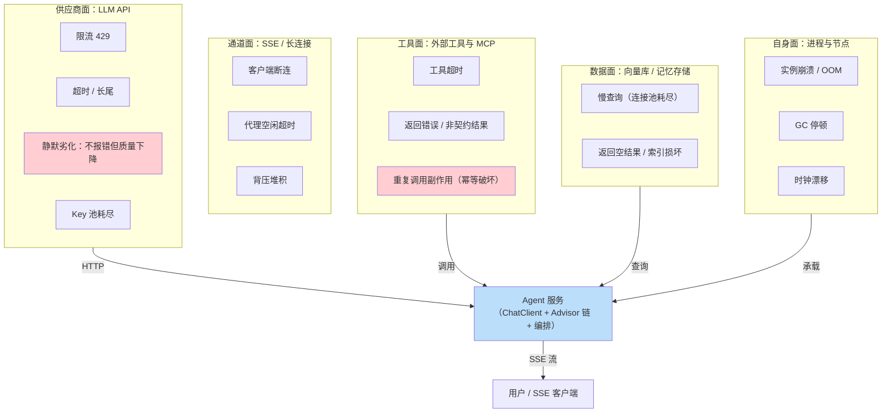
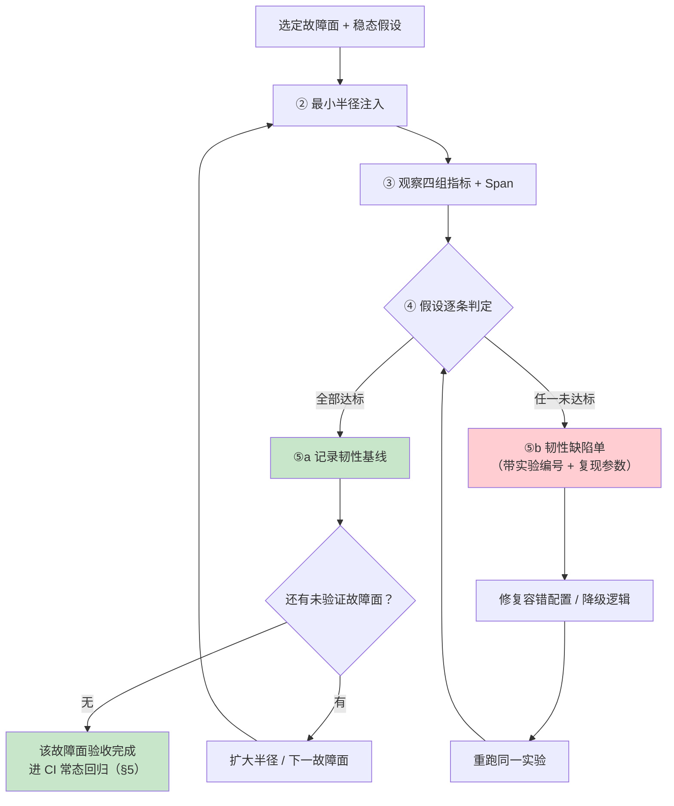
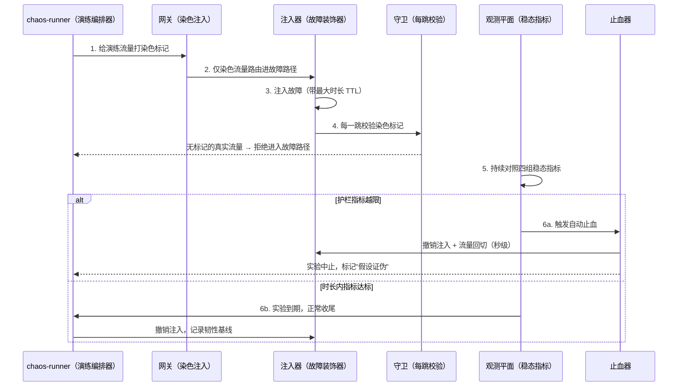
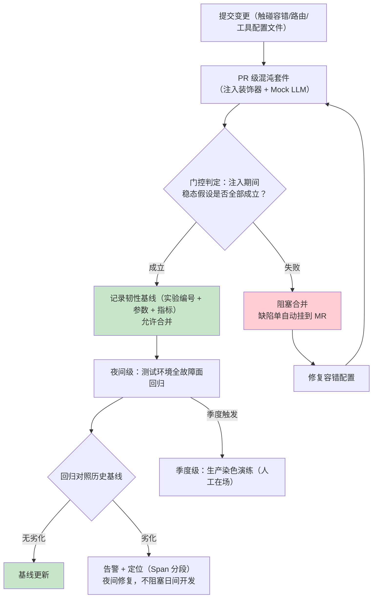

# Agent 混沌工程与故障注入

> 「本文是对 [教程 04-企业级架构主干/10-容错与弹性设计] 的深入展开（那一篇讲"容错怎么设计"，本文讲"怎么证明容错真的生效"）；高可用侧的全局设计见 [教程 04-企业级架构主干/17-高可用与灾备设计]；工程化落地（演练场景库/染色守卫/容量预算门的完整实现）见 [项目 05-企业级Agent中台/12-混沌工程与容量治理]」

> **定位**：系统讲解 Agent 系统的混沌工程方法论——稳态假设的定义方式、故障注入实验的五步设计法（假设→注入→观察→度量→结论）、Agent 特有的四大故障面（LLM 供应商限流/超时/劣化、工具超时、向量库慢查询、SSE 断连）、爆炸半径控制，以及混沌演练进 CI 的三级门控与常态化机制。
>
> **读者画像**：已经为 Agent 系统写好超时/重试/熔断/降级配置，但从未在故障条件下验证过它们是否真的生效的中高级开发者与 SRE——以及所有经历过"降级配置写了、真出事时没触发"事故的人。
>
> **前置阅读**：[教程 04-企业级架构主干/10-容错与弹性设计]（被验证对象）、[附录 04-测试策略/03-测试金字塔与分层投入]（本文与测试金字塔的关系：混沌不测"输出对不对"，测"故障下还站不站得住"）。

---

## 1. 稳态假设：混沌工程的第一性原理

### 1.1 混沌工程不是"搞破坏"，是"做实验"

混沌工程（Chaos Engineering）的定义可以压缩成一句话：**在受控条件下向系统注入真实故障，验证稳态假设是否依然成立**。它和测试的区别在于提问方式——测试问"功能在正常输入下对不对"，混沌问"**系统在依赖受损时，对外承诺还守不守得住**"。

一切实验的起点是**稳态假设（Steady State Hypothesis）**：一条可度量的、描述"系统健康时应该是什么样"的命题。假设必须是可度量+可证伪的，否则实验结束后你无法回答"系统稳不稳"。反例与正例对比：

| 稳态假设写法 | 问题 |
|-------------|------|
| "系统是高可用的" | 不可度量——高可用定义是什么？在哪测？ |
| "用户请求应该成功" | 不可证伪——什么算成功？多少成功率算稳？ |
| **"供应商 A 限流（429 率 100%）注入 60s 期间及解除后 5min 内：网关侧可观测成功率 ≥ 99%，P99 首字延迟增幅 ≤ 2×，路由到供应商 B 的流量占比 ≥ 95%，零会话丢失"** | 可注入、可观测、可判定 |

### 1.2 Agent 系统的稳态指标：比传统服务多一层"质量稳态"

传统分布式系统的稳态指标是可用性/延迟/吞吐三类。Agent 系统多出一类——**质量类稳态**：故障注入期间，系统不仅要"活着"，退化路径上的输出质量还不能塌。一个把流量切到降级小模型后答非所问的系统，可用性指标全绿、用户视角却是事故。完整的稳态指标分四组：

| 指标组 | 典型指标 | 度量来源 |
|--------|---------|---------|
| 可用性 | 请求成功率、会话存活率 | 网关/接入层指标 |
| 性能 | 首字延迟 P99、整响应 P99、工具执行 P95 | [教程 05-Observation可观测] 系列 Span 指标 |
| 成本 | `gen_ai.client.token.usage`、重试放大倍数（重试烧的 Token 是故障的隐性代价） | Token 计量（[教程 04-企业级架构主干/07-成本治理与Token计量]） |
| **质量（Agent 特有）** | 降级路径评估通过率、拒答率、工具调用成功率、幻觉率 | 在线评估哨兵（[附录 04-测试策略/02-Eval评估 §7]） |

质量类指标的存在，使 Agent 混沌实验的"观察"环节必须把评估流水线拉进演练回路——只看延迟曲线会漏掉最危险的退化。

### 1.3 Agent 系统的故障面全景

Agent 的调用链比传统微服务更长、外部依赖更异构。五个故障面构成注入实验的候选空间：



五个面里，标红的两个是 Agent 特有且最容易被传统演练漏掉的：**B3 静默劣化**（模型不报错、延迟正常，但输出质量悄悄变差——没有质量类稳态指标就永远发现不了）和 **C3 幂等破坏**（重试机制本身放大了工具的副作用：下单工具超时后重试 → 用户被扣两次款）。故障的完整分类学与各容错组件的针对性设计见 [教程 04-企业级架构主干/10-容错与弹性设计 §2]。

## 2. 实验设计五步：假设→注入→观察→度量→结论

混沌实验的科学性全在流程里。跳过任何一步，实验就退化成"制造事故"。

| 步骤 | 动作 | Agent 系统特有要点 |
|------|------|-------------------|
| **① 假设** | 写下可证伪的稳态命题（§1.1 格式）+ 明确实验时间窗 + 明确中止条件（"手动中止"与"自动中止"两套） | 假设要覆盖质量稳态，不只是可用性；中止条件绑定护栏指标（如降级路径评估分 < 阈值立即中止） |
| **② 注入** | 选故障面（§1.3）与注入位置（§3.5），从最小爆炸半径开始 | 优先应用层注入（可编程、可精确控制故障形状），网络层注入留给协议级故障 |
| **③ 观察** | 实时盯四组稳态指标 + 全链路 Span | 用 [教程 05-Observation可观测] 的 Span 区分"哪一段在痛"：是模型调用慢还是工具慢 |
| **④ 度量** | 对照假设逐条判定：达标/未达标 | 重试放大 Token 成本必须单独算——它是容错设计的隐性账单 |
| **⑤ 结论** | 两种出口：假设成立 → 记录基线、扩大故障面；假设证伪 → 出韧性缺陷单、修复后重跑 | 缺陷单要带实验编号，修复的验证方式就是"重跑同一实验" |



流程中的两个纪律值得强调：**"重跑同一实验"是缺陷闭环的唯一验收方式**（修复者自述"应该修好了"不算数）；**每场实验的结论必须落档**（假设原文、注入参数、观测曲线、判定结果）——档案既是回归基线，也是下一次实验的设计输入。落地系统中这套档案对应演练场景库的每条场景记录，见 [项目 05-企业级Agent中台/12-混沌工程与容量治理]。

## 3. Agent 系统特有故障面与注入手法

### 3.1 供应商面：限流、超时、劣化、Key 耗尽

LLM 供应商是 Agent 最重的单点外部依赖，其故障形态比普通 HTTP 服务多一种"静默劣化"：

| 故障 | 注入手法 | 期望的韧性响应 | 验证的容错配置 |
|------|---------|---------------|---------------|
| 限流 429 | 网络层改写响应码，或应用层模拟抛限流异常 | 退避重试 → 超阈值路由备用供应商 → 用户侧无感 | 重试参数、多供应商路由（[教程 04-企业级架构主干/12-模型路由与降级]） |
| 超时/长尾 | 注入延迟（不返回错误，拖到客户端超时） | 客户端超时先行 → 降级/路由；**绝不无限等** | 超时预算分配 |
| **静默劣化** | 注入"正常返回但内容低质"的伪响应（应用层最易做） | 质量哨兵检出 → 告警/自动切流 | 在线评估哨兵的灵敏度 |
| Key 池耗尽 | 应用层让 Key 池全量失效 | 池内轮转 → 降级供应商 → 明确报错而非挂起 | Key 池管理与降级链 |

静默劣化的注入值得单独说明：它在网络层做不了（响应完全合法），必须做在**应用层**——让 Mock/代理的 ChatModel 返回一份"看起来正常但答非所问"的固定文本，然后看质量哨兵多久报警。这是验证"质量类稳态指标"是否真的接进了告警回路的唯一方法。

### 3.2 工具面：超时、错误、幂等破坏

工具故障的特殊性在于**副作用**：查询类工具挂了顶多答不出来，写入类工具挂了可能造成不可逆业务后果。注入设计必须区分三类：

- **超时注入**：工具执行拖过配置的超时预算——验证的是"超时后框架的清理逻辑"（线程/响应式订阅是否泄漏、状态机是否卡在中间态）；
- **错误注入**：返回可行动错误（业务拒绝）与不可行动错误（NPE）两种——验证 Agent 对工具错误的提示策略（[教程 10-调优实战与方法论/04-工具调优下：执行与治理 §3.4]）；
- **幂等破坏注入**：记录工具被调用的次数与参数——超时+重试场景下，同一 `order_id` 是否被写了两次？这一项验证的不是容错配置，而是**工具自身的幂等键设计**（重试正确的前提是操作幂等，[教程 04-企业级架构主干/10-容错与弹性设计 §9]）。

### 3.3 数据面：向量库慢查询与空结果

向量库故障的表现形式常是"慢"而不是"死"：连接池耗尽后查询从 50ms 劣化到 5s，RAG 链路的检索环节吃掉全部延迟预算。注入两个形状：**慢查询**（验证检索超时 + "检索降级为直答"的策略是否配置）与**空结果**（`similaritySearch` 返回空列表时，链路是静默无上下文直答、还是明确告知用户"知识库暂时不可用"——前者是幻觉温床，必须验证 Prompt 对空上下文的处理分支）。

### 3.4 通道面：SSE 断连与背压

流式通道的故障注入验证的是恢复语义：客户端中途断连后，服务端是否停止无主的生成（Token 在烧给谁？）、会话恢复后能否从断点续传或优雅重开（[教程 04-企业级架构主干/04-多页面流式响应与会话管理]）；代理空闲超时切断长思考间隔的流后，前端的重连逻辑是否产生重复消息。背压注入则是让消费者故意变慢，验证 `onBackpressureBuffer/Drop` 策略与缓冲上限（策略全景见 [教程 08-架构师进阶/08-响应式错误处理]）。

### 3.5 注入位置三层：网络层、应用层、SDK 层

| 位置 | 手段 | 能注入 | 适合 |
|------|------|--------|------|
| **网络层** | toxiproxy / Chaos Mesh（代理改包、延迟、断连） | 协议级故障：连接重置、慢网络、乱序 | 验证连接池/HTTP 客户端层韧性 |
| **应用层** | 故障注入装饰器（包装 ChatModel/ToolCallback 接口） | 任意应用语义故障：限流、超时、劣化、错误 | **CI 与测试环境首选**：可编程、可精确控制、零侵入 |
| **SDK 层** | Mock ChatModel 直接抛异常（[附录 04-测试策略/00-单元测试 §2]） | 单点异常 | L1/L2 用例，不算完整混沌但常当注入原语 |

应用层注入的落点就是 Spring AI 的两个核心接口——它们是天然的能力缝。一个最小可用的故障注入 `ChatModel`（全部签名 javap 实证，Spring AI 2.0.0）：

```java
// Spring AI 2.0.0 —— ChatModel: call(Prompt) 抽象；stream(Prompt) 默认抛 UnsupportedOperationException
// （javap -c 实证：默认实现 new UnsupportedOperationException("streaming is not supported")，
//  故流式注入必须覆写 stream，否则注入的"流式故障"会变成"不支持流式"——注入了错误的故障）
public class FaultInjectionChatModel implements ChatModel {

    public enum Fault { NONE, RATE_LIMITED, TIMEOUT, DEGRADED }

    private final ChatModel delegate;          // 真实模型或 Mock
    private final AtomicReference<Fault> fault = new AtomicReference<>(Fault.NONE);

    public FaultInjectionChatModel(ChatModel delegate) {
        this.delegate = delegate;
    }

    /** 演练编排器在运行时切换故障形态 */
    public void inject(Fault f) { this.fault.set(f); }

    @Override
    public ChatResponse call(Prompt prompt) {
        return switch (fault.get()) {
            case RATE_LIMITED -> throw new IllegalStateException(
                    "simulated: 429 rate limited by provider");
            case TIMEOUT -> {                       // 拖到调用方超时先行
                try { Thread.sleep(Duration.ofMinutes(5).toMillis()); }
                catch (InterruptedException e) { Thread.currentThread().interrupt(); }
                yield delegate.call(prompt);
            }
            case DEGRADED -> new ChatResponse(List.of(          // 静默劣化：合法但低质
                    new Generation(new AssistantMessage(
                            "（注入的劣化响应：内容看似通顺，实则答非所问）"))));
            case NONE -> delegate.call(prompt);
        };
    }

    @Override
    public Flux<ChatResponse> stream(Prompt prompt) {
        if (fault.get() == Fault.TIMEOUT) {
            return Flux.never();                    // 流式超时：永不吐字，逼调用方 timeout 生效
        }
        return delegate.stream(prompt);
    }
}
```

被测侧的韧性配置则用真实 API 组装（reactor-core，javap 实证：`timeout(Duration)`、`onErrorResume(Class, Function)`、`retryWhen(Retry)`、`Retry.backoff(long, Duration)`）：

```java
// 响应式侧的超时+退避重试+降级 —— 混沌实验要验证的就是这三段真的按序生效
public Mono<String> askWithResilience(ChatModel model, Prompt prompt) {
    return Mono.fromCallable(() -> model.call(prompt))
            .subscribeOn(Schedulers.boundedElastic())
            .timeout(Duration.ofSeconds(30),                       // 超时先行
                     Mono.error(new TimeoutException("llm call timeout")))
            .retryWhen(Retry.backoff(2, Duration.ofMillis(500)))   // 退避重试
            .onErrorResume(TimeoutException.class,                 // 最终降级
                    e -> Mono.just("（降级响应）当前咨询高峰，请稍后重试"));
}
```

注意一个注入设计细节：`TIMEOUT` 形态用 `Thread.sleep` 拖住阻塞式 `call`——这段代码只允许出现在**测试工件的 boundedElastic 调度上下文**里；若你的被测链路是纯流式（`stream`），注入用 `Flux.never()`，绝不在 EventLoop 上阻塞（WebFlux 铁律）。`DEGRADED` 形态构造 `ChatResponse` 用的是实证签名：`new ChatResponse(List.of(new Generation(new AssistantMessage(text))))`。

## 4. 爆炸半径控制

混沌实验的第一安全纪律：**实验造成的损失必须有界且可止损**。爆炸半径控制是四道闸门的叠加：

1. **环境闸门**：演练优先在独立测试环境做；生产演练必须单独评审（故障类型 × 业务敏感度的矩阵过审才放行）；
2. **流量闸门（染色）**：生产演练只允许打到染色流量——演练标记在网关注入、贯穿全链路传播，守卫在每一跳校验：无染色标记的真实流量绝不允许进入故障路径；
3. **时间闸门**：每次注入有最大时长，到期自动撤销故障、恢复路由；
4. **指标闸门（自动止血）**：护栏指标越限（真实用户成功率跌破阈值、降级路径评估分塌方）触发自动中止——撤销注入 + 流量回切，全程无人在场也能完成。

四道闸门在一场演练中的协作时序：



染色守卫与自动止血的完整工程实现（守卫代码、止血器状态机、演练场景库）见 [项目 05-企业级Agent中台/12-混沌工程与容量治理]，本文不重复其实现，只强调方法论：**闸门数量与实验环境的"生产程度"成正比**——测试环境一道环境闸门即可，生产环境四道缺一不可。

## 5. 混沌进 CI：门控与常态化

### 5.1 三级演练梯度

一次性演练会腐化：故障面变了、容错配置改了，去年的演练结论今年不再成立。常态化=把实验按成本与风险分层，让最便宜的那层进 CI 每次都跑：

| 级别 | 触发时机 | 环境 | 注入位置 | 典型实验 | 耗时 |
|------|---------|------|---------|---------|------|
| **PR 级** | 每次提交 | CI | SDK/应用层（Mock 抛异常、注入装饰器） | 限流→重试生效；超时→降级触发；工具错误→Agent 不死循环 | 秒～分钟 |
| **夜间级** | 每夜 | 测试环境（Testcontainers + toxiproxy） | 应用层 + 网络层 | 慢查询→检索超时降级；SSE 断连→资源回收；Key 池耗尽→降级链 | 十分钟级 |
| **季度级** | 定期 + 大版本前 | 生产（染色） | 应用层，最小半径 | 供应商切换全链路、实例崩溃、区域级故障 | 小时级，人工在场 |

分层的经济学与测试金字塔同构（[附录 04-测试策略/03-测试金字塔与分层投入]）：PR 级近似零成本高频跑，把确定性故障的韧性回归锁在合并前；越往上层环境越真实、成本越高、频率越低——三层验证的是同一套容错配置在不同真实度下的表现。

### 5.2 CI 门控判定

PR 级演练进入流水线后，它就是一道普通的质量门——判定逻辑必须自动化，"人工看报告"必然退化为"无人看报告"：



门控红线指标的最小集：注入期间重试后最终成功率、降级路径触发时延、降级路径的评估通过率、重试 Token 放大倍数上限。四个值写进稳态假设原文，CI 按原文自动判定——**稳态假设是机器可执行的门禁规则，不是给人看的文档**。

## 6. 容错设计 ↔ 混沌实验映射

本文开头的那句"怎么证明容错真的生效"，最后收敛成一张映射表——**每一项容错配置，都应当存在至少一个对应的故障注入实验**；映射表空白处就是从未被验证过的韧性：

| 容错配置（[教程 04-企业级架构主干/10-容错与弹性设计]） | 对应注入实验 | 验证点 |
|------|------|------|
| 超时控制（§4） | 注入 `Flux.never()` / 长睡眠 | 调用方按时超时，无线程/订阅泄漏 |
| 重试机制（§5） | 注入瞬时异常（前 N 次失败第 N+1 次成功） | 退避参数生效、重试次数有上限、Token 放大可接受 |
| 熔断器（§6） | 注入持续故障 | 达阈值后熔断打开、直通降级、半开探测恢复 |
| 降级策略（§8） | 注入供应商全断 / 静默劣化 | 降级路径触发、**降级输出质量过评估线** |
| 限流（§11） | 注入突发流量 | 过载拒绝优先于过载崩溃、排队有界 |
| 工具容错（§9） | 工具超时 + 幂等破坏记录 | 超时不重试副作用工具、幂等键生效 |

维护这张表的正确姿势：容错配置的每次变更，映射表对应的实验必须在 PR 级 CI 里回归——这正是把混沌做成"容错配置的契约测试"的含义。

## 7. 适用场景

- **容错配置已写好但从未被真实故障检验**——本文最核心的适用人群；映射表（§6）可以直接当自查清单用；
- **上生产前的韧性验收**：按 §2 五步法为关键故障面各设计一场实验，形成首版韧性基线；
- **故障复盘后的加固验证**：生产事故的故障形态，理应沉淀为一条可重放的注入实验（"事故→场景库"回流）；
- **多供应商/多模型路由架构**的切换正确性验证（供应商面实验）。

## 8. 不适用场景

- **没有稳态指标体系的系统**：先建 [教程 05-Observation可观测] 的观测地基再谈混沌——没有观察的注入只是盲目的破坏；
- **没有降级/容错设计的系统**：实验只会得出"系统会挂"这个已知结论，先按 [教程 04-企业级架构主干/10-容错与弹性设计] 设计韧性，再回来验证；
- **无爆炸半径控制的裸生产环境**：四道闸门（§4）缺任何一道，生产演练的风险都大于收益；
- **把混沌当测试金字塔的替代品**：混沌验证"故障下不塌"，不验证"输出正确"——质量仍靠 [附录 04-测试策略/02-Eval评估] 的评估体系；两套验证正交且都需要；
- **单进程本地 Demo**：故障面（§1.3）基本不存在，收益撑不起实验设计成本。

## 9. 总结

混沌工程的完整闭环可以压成五句话：**一切从可证伪的稳态假设出发**（Agent 系统的稳态比传统服务多一层"质量稳态"——降级路径的输出也必须过评估线）；**注入优先做在应用层的能力缝上**——`ChatModel` 与 `ToolCallback` 两个接口就是 Spring AI 系统天然的故障注入口，一个装饰器即可注入限流/超时/静默劣化，且比网络层注入更可编程、更适合 CI；**爆炸半径用四道闸门约束**——环境、染色流量、注入 TTL、护栏指标自动止血，闸门数量与环境的"生产程度"成正比；**常态化靠三级梯度**——PR 级近似零成本进 CI 当门禁、夜间级全故障面回归、季度级生产染色演练，分层经济学与测试金字塔同构；**最终收敛到一张映射表**——每一项容错配置都对应至少一个注入实验，映射表的空白处就是从未被验证过的韧性。当某天供应商真的限流、向量库真的变慢时，你希望那一刻是"第 N 次重放已验证的场景"，而不是"第一次遇见"。从测试体系走向运行体系的那一步，就是从 [附录 04-测试策略/02-Eval评估] 的质量门，走进本文的故障门。
