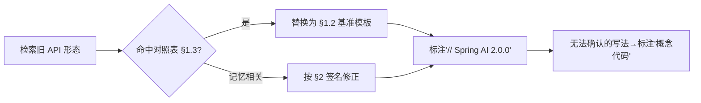

# 附录 05-00：Spring AI 2.0 Advisor 与 ChatMemory 真实 API 基准

> **定位**：本文是对 [教程 23-Advisor链与拦截器 §API] 与 [教程 04-记忆与会话管理 §API] 的深入展开，也是**全文档体系的 API 真实性基准**——所有教程/项目中的 Advisor 与 ChatMemory 代码以本文为准。读者画像：任何要照抄本体系代码写实现的读者。前置阅读：[教程 23-Advisor链与拦截器]、[教程 04-记忆与会话管理]。
>
> **为什么需要这篇**：2026-08 全量审计发现体系中存在三代 Advisor API 混用（1.0 式 `adviseRequest`/`chain.next()`/`AdvisedRequest` / 2.0 式 `adviseCall` 的正确与错误签名并存，且此前误以为 `BaseAdvisor.before/after` 为虚构——2026-08-16 本地 jar javap 实证其真实存在）。本篇以 Spring AI 2.0.0 本地 jar 为准统一口径，并给出错误写法对照表。

---

## 1. Advisor：2.0 的真实接口形态

### 1.1 两个接口，按调用模式区分

Spring AI 2.0 把 Advisor 按同步/流式拆为两个接口（不再是 1.0 式的统一 `Advisor` + `adviseRequest`）。**注意：`BaseAdvisor.before/after` 钩子在 2.0.0 是真实存在的**（见 §1.2 的第二模板）——它由 `CallAdvisor` + `StreamAdvisor` 组合并给出默认实现：

```java
// Spring AI 2.0.0 —— 同步调用走 CallAdvisor（javap 实证：org.springframework.ai.chat.client.advisor.api）
public interface CallAdvisor extends Advisor {
    ChatClientResponse adviseCall(ChatClientRequest request, CallAdvisorChain chain);
}

// 流式调用走 StreamAdvisor
public interface StreamAdvisor extends Advisor {
    Flux<ChatClientResponse> adviseStream(ChatClientRequest request, StreamAdvisorChain chain);
}

// 需要同时兼顾 call/stream 且只关心 before/after 时，可继承 BaseAdvisor（真实存在）：
public interface BaseAdvisor extends CallAdvisor, StreamAdvisor {
    ChatClientRequest before(ChatClientRequest request, AdvisorChain chain);   // 抽象，改写请求
    ChatClientResponse after(ChatClientResponse response, AdvisorChain chain); // 抽象，改写响应
    // 并提供默认的 adviseCall/adviseStream（内部执行 before → chain → after）
}
```

`Advisor` 接口本身只有 `String getName()`（**抽象方法**，无默认实现）。`ChatClientRequest`/`ChatClientResponse` 是 2.0 的请求/响应类型（均为 record），不是 1.0 的 `AdvisedRequest`/`AdvisedResponse`。

### 1.2 正确的自定义 Advisor 写法（基准模板）

```java
// Spring AI 2.0.0 —— 洋葱模型：链式传递，短路=不调用 chain
public class TenantTaggingAdvisor implements CallAdvisor, StreamAdvisor {

    @Override
    public ChatClientResponse adviseCall(ChatClientRequest request, CallAdvisorChain chain) {
        ChatClientRequest modified = request.mutate()
                .context("tenant_id", resolveTenant())   // 上下文注入（record 的 mutate() 返回 Builder）
                .build();
        return chain.nextCall(modified);                 // 放行；短路就是 return 而不调 chain
    }

    @Override
    public Flux<ChatClientResponse> adviseStream(ChatClientRequest request, StreamAdvisorChain chain) {
        return chain.nextStream(request)
                .contextWrite(ctx -> ctx.put("tenant_id", resolveTenant()));  // 流式下用 Reactor Context
    }

    @Override
    public String getName() { return "TenantTaggingAdvisor"; }
}
```

**三要点**：① 短路的实现是**不调用 `chain.nextCall()`** 直接返回（没有"标记跳过"这种 API）；② 同时实现两接口才能兼顾 `call()` 与 `stream()`；③ 顺序由 `Order`（Spring 的 `@Order`/`getOrder()`）控制，`SecurityAdvisor → PromptAdvisor → MemoryAdvisor → ...` 的通用顺序原则见 [教程 23-Advisor链与拦截器 §执行顺序]。

> **javap 实证**（`spring-ai-client-chat-2.0.0.jar`）：`ChatClientRequest.Builder` 的真实方法只有 `prompt(Prompt)`、`context(Map)`、`context(String, Object)`、`build()`——**没有 `from()` / `contextEntry()`**；正确的复制改写是 `request.mutate().context(k, v).build()`。流式下 Reactor Context 写法是 `contextWrite(ctx -> ctx.put(...))`，**没有 `ReactorContext.of(...)`** 这种 API。

### 1.3 错误写法对照表（审计发现的全部形态）

| 错误形态 | 出现位置（审计） | 为什么错 | 正确写法 |
|---------|----------------|---------|---------|
| `implements CallAdvisor` + 单参 `before(ChatClientRequest)` / `after(ChatClientResponse)` | 教程 06/11/13/25/29/34 旧稿 | **`CallAdvisor` 接口上没有 `before/after`**（这是 `BaseAdvisor` 的方法，且必须带 `AdvisorChain` 参数） | 继承 `BaseAdvisor` 实现 `before(ChatClientRequest, AdvisorChain)` / `after(ChatClientResponse, AdvisorChain)`；或实现 `CallAdvisor.adviseCall`（见 §1.2 两个模板） |
| `adviseRequest(ChatClientRequest, Map)` | 教程 23/17 旧稿 | 1.0 之前也未有此签名 | `adviseCall(ChatClientRequest, CallAdvisorChain)` |
| `chain.next()` / `chain.nextAroundCall()` | 教程 28-32 部分示例 | 链方法 1.0 式混写 | `chain.nextCall(request)`（Call）/ `chain.nextStream(request)`（Stream） |
| `new ChatClientResponse(response, context)` | 教程 31/23 旧稿 | 类型不存在且响应不可这样构造 | 由 chain 返回 `ChatClientResponse` |
| `SafeGuardAdvisor.builder().sensitiveWords(...)` | 教程 13 旧稿 | 该 builder 不存在 | `new SafeGuardAdvisor(List<String>)`（javap 实证构造函数：`(List<String>)`、`(List, String, int)`，或 `builder()`） |

### 1.4 内置 Advisor 清单（2.0 真实存在的）

| Advisor | 用途 | 常见误传 |
|---------|------|---------|
| `MessageChatMemoryAdvisor` | 记忆写入（call/stream 皆可） | 旧名 `MessageChatMemoryAdvisor` 在 1.0 曾叫 ChatMemoryAdvisor——2.0 以 builder 用法为准（见 §2） |
| `QuestionAnswerAdvisor` | RAG 检索问答 | 包路径是 `org.springframework.ai.chat.client.advisor.vectorstore`（教程 05 旧稿曾写错） |
| `SimpleLoggerAdvisor` | 请求/响应日志 | - |

`TokenBudgetAdvisor` **不是内置组件**（审计发现教程 20/13 与教程 01 的内置表口径不一）——上下文预算需自行实现（正确姿势：实现 CallAdvisor + StreamAdvisor，在 adviseCall 里压缩 messages）。本项目体系中的 `TokenMeteringAdvisor`、`TenantTaggingAdvisor` 等均为**自定义示例类**，不是框架 API。

> **QAA 模块坐标（javap 实证 `spring-ai-vector-store-advisor-2.0.0.jar`）**：`QuestionAnswerAdvisor` 与 `VectorStoreChatMemoryAdvisor` 在独立模块 `spring-ai-vector-store-advisor`（2.0.0 起**改名**，老坐标 `spring-ai-advisors-vector-store` 已不存在；该模块依赖 `spring-ai-client-chat` + `spring-ai-vector-store`，**pgvector starter 不会传递引入**——需显式声明）。构造器为包私有，唯一创建方式 `QuestionAnswerAdvisor.builder(VectorStore)`；Builder 方法：`searchRequest` / `promptTemplate` / `protectFromBlocking` / `scheduler` / `order` / `build()`（无 `queryTransformers`）。

---

## 2. ChatMemory：真实签名

### 2.1 核心接口与组合（2.0）

```java
// Spring AI 2.0.0 —— ChatMemory 门面 + ChatMemoryRepository 存储，两层组合（javap 实证）
public interface ChatMemory {
    void add(String conversationId, Message message);            // 单条
    void add(String conversationId, List<Message> messages);
    List<Message> get(String conversationId);                   // 单参，取全量窗口内消息
    void clear(String conversationId);
}

// 标准组合: 仓库（存哪里）+ 窗口策略（留多少）
ChatMemory memory = MessageWindowChatMemory.builder()
        .chatMemoryRepository(new InMemoryChatMemoryRepository())
        .maxMessages(20)
        .build();
```

> **javap 实证**：`ChatMemory.get` 是**单参** `get(String)`，**没有 `lastN` 第二参数**（窗口裁剪由 `MessageWindowChatMemory` 的 `maxMessages` 负责）。`MessageWindowChatMemory.Builder` 真实方法：`chatMemoryRepository(ChatMemoryRepository)`、`maxMessages(int)`、`build()`。

### 2.2 官方仓库实现（本地 2.0.0 只有 InMemory）

| 实现 | 依赖 | 说明 |
|------|------|------|
| `InMemoryChatMemoryRepository` | 无（spring-ai-model 核心包） | 唯一官方实现；`ChatMemoryAutoConfiguration` 自动装配为 `ChatMemoryRepository` Bean（反编译实证：默认 `new InMemoryChatMemoryRepository()`） |

**本地仓库未发现** `JdbcChatMemoryRepository` / `spring-ai-model-chat-memory-jdbc` / `MongoChatMemoryRepository` / `RedisChatMemoryRepository`——**这些都不是本地 2.0.0 依赖中存在的类**。持久化（JDBC/Redis/对象存储）需自行实现 `ChatMemoryRepository` 接口（`findConversationIds` / `findByConversationId` / `saveAll` / `deleteByConversationId`）。`InMemoryChatMemory`（教程 09 旧稿）也不是类名——正确组合是 `InMemoryChatMemoryRepository` + `MessageWindowChatMemory`。

### 2.3 自研持久化仓库的正确序列化范式（实锤：`Message` 不能 Jackson 直存）

> **2026-08-22 实证补遗（本地 jar 反编译 + 独立 round-trip 实验 + 官方 2.1 源码比对）**。这是自研 `ChatMemoryRepository` 时**最容易踩、且踩了必在第二次请求报错**的坑，本体系此前因少这一条导致 `.md` 里出现错误写法，特此立为基准。

**结论一句话：`Spring AI` 的 `Message` 对象绝不能用 `GenericJacksonJsonRedisSerializer`（或任何 Jackson JSON）直接序列化/反序列化持久化。必须"拆字段存 + 按类型 `.builder()` 重建"。**

**实证链条**：

1. **`Message` 及其子类没有反序列化构造器**（源码确认）：`UserMessage` 只有构造器 `UserMessage(@Nullable String textContent)` 与 `UserMessage(Resource)`，字段 `private final`，**无 `@JsonCreator`/`@JsonProperty`**。Jackson 3 找不到 "property-based Creator"。
2. **round-trip 实验**（用 2.0.0 真实 jar 编译运行）：
   - `new GenericJacksonJsonRedisSerializer(new ObjectMapper())`（裸 mapper 不开类型信息）→ serialize 成功，但 **deserialize 返回 `LinkedHashMap`**；
   - `.builder().enableDefaultTyping(ptv)`（开了 `@class` 类型信息）→ 抛 `SerializationException: cannot construct instance of UserMessage (no property-based Creator)`。
   - 两种看似"配置正确"的写法**都无法把 Redis 里的数据还原回 `Message`**。存入无代价，读取必炸。
3. **第二次请求才报错**：`MessageWindowChatMemory.add()` 读回 `findByConversationId` 的列表后，`process()` 里 `new HashSet<>(memoryMessages)`（官方源码 `.filter(Message::...).forEach(...)`）把 `LinkedHashMap` 当 `Message` 强转 → `ClassCastException: LinkedHashMap cannot be cast to Message`。首次请求无历史读空列表不触发，故"第一次成功、第二次 500"。
4. **官方自己的做法**（`main` 分支 `RedisChatMemoryRepository.java` 源码实证）：把每条 Message 转成 `Map<String,Object>`（含 `type`/`content`/`metadata`/`timestamp`），用 Gson 序列化存 RedisJSON；读取时 `gson.fromJson` 回 Map，再**按 `type` 字段手动用 `UserMessage.builder()`/`AssistantMessage.builder()`/`SystemMessage.builder()` 重建对象**，并还原 `toolCalls`/`media`。**官方从不把 `Message` 对象直接 JSON 化。**

**正确范式（自研仓库实现，round-trip 全绿验证）**：

```java
// Spring AI 2.0.0 —— 存：Message → Map → JSON 字符串（StringRedisTemplate 存）
private String toJson(Message m) {
    Map<String, Object> doc = new HashMap<>();
    doc.put("type", m.getMessageType().toString());  // 类型必须存，重建时靠它
    doc.put("content", m.getText());
    doc.put("metadata", Map.of());                    // 如需元数据自行填充
    return objectMapper.writeValueAsString(doc);      // Map 可被 Jackson 正常序列化
}

// 读：JSON 字符串 → Map → 按 type 用 builder 重建（官方同款）
private Message fromJson(String json) throws IOException {
    Map<String, Object> doc = objectMapper.readValue(json, new TypeReference<>() {});
    String type = (String) doc.get("type");
    String content = (String) doc.get("content");
    @SuppressWarnings("unchecked")
    Map<String, Object> metadata = (Map<String, Object>) doc.getOrDefault("metadata", Map.of());
    switch (MessageType.valueOf(type)) {
        case USER:      return UserMessage.builder().text(content).metadata(metadata).build();
        case ASSISTANT: return AssistantMessage.builder().content(content).properties(metadata).build();
        case SYSTEM:    return SystemMessage.builder().text(content).metadata(metadata).build();
        default:        throw new IllegalStateException("未知消息类型: " + type);
    }
}
```

要点：① **消息类型必须显式写入**（`getMessageType()`），否则无法决定重建哪个子类；② 存的是可被 Jackson 序列化的 `Map`；③ 重建用 `builder()`（非构造器）；④ `AssistantMessage` 若需工具调用，序列化侧要另存 `toolCalls` 并重建 `AssistantMessage.ToolCall`（参照官方 §3 完整实现）。

> **为何不能用 `RedisTemplate<String, Message>` + `GenericJacksonJsonRedisSerializer`**：运行期 500 的完整机制见上。你的 `ChatMemoryRepository` 应改用自动装配的 `StringRedisTemplate`（Boot 的 `DataRedisAutoConfiguration.stringRedisTemplate`，`@ConditionalOnMissingBean`），存 JSON 字符串而非对象。

### 2.4 会话 ID 的标准传递

```java
// 标准姿势: 通过 Advisor 参数传递（不是魔法字符串）
chatClient.prompt()
    .advisors(a -> a.param(ChatMemory.CONVERSATION_ID, sessionId))   // 常量，非字面量
    .user(message)
    .call();

// 错误形态（审计发现教程 08 旧稿）: 字面量 "chat_memory_conversation_id" 硬编码
// 常量名以所引入版本的 ChatMemory 定义为准，禁止抄字面量
```

### 2.5 流式调用与记忆写入

`MessageChatMemoryAdvisor` 对 `stream()` 同样生效（框架在流完成后写入完整响应）——教程 09 旧稿"流式不写记忆"与"自动写入"的矛盾表述以此为准：**用 MessageChatMemoryAdvisor 时流式会自动写入；自己手写 Flux 消费时不会**。

---

## 3. 全体系修正指令（给后续清洗的执行依据）



| 全局替换规则 | 从 | 到 |
|-------------|-----|-----|
| Advisor 接口（纯 call） | `implements CallAdvisor` + 单参 `before/after` | `implements CallAdvisor` + `adviseCall(ChatClientRequest, CallAdvisorChain)` |
| Advisor 接口（需 before/after 语义） | 手工拼 `adviseCall` 里做 before/after | 继承 `BaseAdvisor` 实现 `before(ChatClientRequest, AdvisorChain)` / `after(ChatClientResponse, AdvisorChain)`（真实存在） |
| 虚构方法 | `adviseRequest` / `chain.next()` / `chain.nextAroundCall()` | `adviseCall/adviseStream` + `chain.nextCall/nextStream` |
| 请求类型 | `AdvisedRequest` | `ChatClientRequest`（record: prompt + context） |
| 响应类型 | `AdvisedResponse` | `ChatClientResponse`（record: chatResponse + context） |
| 会话参数 | 字面量字符串 | `ChatMemory.CONVERSATION_ID` 常量 |
| 持久化记忆 | `RedisChatMemoryRepository` / `JdbcChatMemoryRepository` | 本地 2.0.0 无此类，自研 `implements ChatMemoryRepository`（标注示例实现） |
| 序列化消息对象 | `GenericJacksonJsonRedisSerializer` 直存 `Message` | 禁止！读回 `LinkedHashMap`/`no property-based Creator`；正确=存 `Map` + 按 `type` 用 `builder()` 重建（见 §2.3） |
| ChatMemory.get | `get(id, lastN)` 两参 | `get(id)` 单参（窗口裁剪靠 `maxMessages`） |

## 4. 总结

| 概念 | 一句话 |
|------|--------|
| Advisor 2.0 | CallAdvisor/StreamAdvisor 双接口 + ChatClientRequest/ChatClientResponse + chain.nextCall/nextStream；before/after 语义用 BaseAdvisor（真实存在） |
| 短路 | 不调用 chain 直接返回 |
| 记忆组合 | MessageWindowChatMemory + Repository（本地 2.0.0 官方仅 InMemory；持久化需自研 ChatMemoryRepository） |
| 会话 ID | `ChatMemory.CONVERSATION_ID` 常量 |
| 流式+记忆 | MessageChatMemoryAdvisor 自动写入；手写 Flux 消费不写入 |
| Message 持久化 | 禁止 Jackson 直存 Message（无 property-based Creator）；存 Map + 按 type 用 builder 重建（§2.3） |
| 自研仓库存储载体 | 用 StringRedisTemplate 存 JSON 字符串（勿自定义 GenericJacksonJsonRedisSerializer 存对象） |
| 存疑写法 | 标注"概念代码"并指向本基准 |
