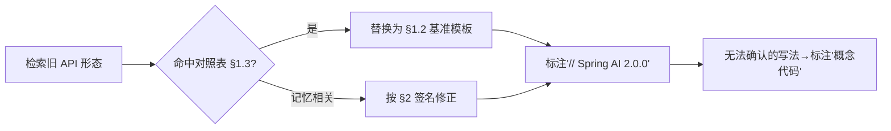

# 附录 12-00：Spring AI 2.0 Advisor 与 ChatMemory 真实 API 基准

> **定位**：本文是对 [教程 14-Advisor链与拦截器 §API] 与 [教程 04-记忆与会话管理 §API] 的深入展开，也是**全文档体系的 API 真实性基准**——所有教程/项目中的 Advisor 与 ChatMemory 代码以本文为准。读者画像：任何要照抄本体系代码写实现的读者。前置阅读：[教程 13]、[教程 04]。
>
> **为什么需要这篇**：2026-08 全量审计发现体系中存在三代 Advisor API 混用（虚构的 `BaseAdvisor.before/after` / 1.0 式 `adviseRequest` / 2.0 式 `adviseCall`）。本篇以 Spring AI 2.0.0 为准统一口径，并给出错误写法对照表。

---

## 1. Advisor：2.0 的真实接口形态

### 1.1 两个接口，按调用模式区分

Spring AI 2.0 把 Advisor 按同步/流式拆为两个接口（不再是统一的 `Advisor` + `adviseRequest`，更不存在 `before/after` 钩子）：

```java
// Spring AI 2.0.0 —— 同步调用走 CallAdvisor
public interface CallAdvisor extends Advisor {

    ChatClientResponse adviseCall(ChatClientRequest request, CallAdvisorChain chain);

    default String getName() { return this.getClass().getSimpleName(); }
}

// 流式调用走 StreamAdvisor
public interface StreamAdvisor extends Advisor {

    Flux<ChatClientResponse> adviseStream(ChatClientRequest request, StreamAdvisorChain chain);

    default String getName() { return this.getClass().getSimpleName(); }
}
```

**请求/响应类型是 `ChatClientRequest` / `ChatClientResponse`**（2.0 的命名），不是 1.0 的 `AdvisedRequest` / `AdvisedResponse`。

### 1.2 正确的自定义 Advisor 写法（基准模板）

```java
// Spring AI 2.0.0 —— 洋葱模型：链式传递，短路=不调用 chain
public class TenantTaggingAdvisor implements CallAdvisor, StreamAdvisor {

    @Override
    public ChatClientResponse adviseCall(ChatClientRequest request, CallAdvisorChain chain) {
        ChatClientRequest modified = ChatClientRequest.builder()
                .from(request)
                .contextEntry("tenant_id", resolveTenant())   // 上下文注入
                .build();
        return chain.nextCall(modified);                       // 放行；短路就是 return 而不调 chain
    }

    @Override
    public Flux<ChatClientResponse> adviseStream(ChatClientRequest request, StreamAdvisorChain chain) {
        return chain.nextStream(request)
                .contextWrite(ReactorContext.of("tenant_id", resolveTenant()));  // 流式下用 Reactor Context
    }

    @Override
    public String getName() { return "TenantTaggingAdvisor"; }
}
```

**三要点**：① 短路的实现是**不调用 `chain.nextCall()`** 直接返回（没有"标记跳过"这种 API）；② 同时实现两接口才能兼顾 `call()` 与 `stream()`；③ 顺序由 `Order`（Spring 的 `@Order`/`getOrder()`）控制，`SecurityAdvisor → PromptAdvisor → MemoryAdvisor → ...` 的通用顺序原则见 [教程 13 §执行顺序]。

### 1.3 错误写法对照表（审计发现的全部形态）

| 错误形态 | 出现位置（审计） | 为什么错 | 正确写法 |
|---------|----------------|---------|---------|
| `implements CallAdvisor` + `before(ChatClientRequest)` / `after(ChatClientResponse)` | 教程 06/11/13/25/29/34 旧稿 | 接口不存在（虚构） | 上文 §1.2 模板 |
| `adviseRequest(ChatClientRequest, Map)` | 教程 14/17 旧稿 | 1.0 之前也未有此签名 | `adviseCall(ChatClientRequest, CallAdvisorChain)` |
| `adviseCall(ChatClientRequest, chain)` + `chain.nextAroundCall()` | 教程 19-23 部分示例 | 类型名是 1.0 式混写 | 参数与链方法统一 2.0 命名 |
| `new ChatClientResponse(response, context)` | 教程 22/23 旧稿 | 类型不存在且响应不可这样构造 | 由 chain 返回 `ChatClientResponse` |
| `SafeGuardAdvisor.builder().sensitiveWords(...)` | 教程 13 旧稿 | 该 builder 不存在 | 自写类 + 构造函数（框架无此内置） |

### 1.4 内置 Advisor 清单（2.0 真实存在的）

| Advisor | 用途 | 常见误传 |
|---------|------|---------|
| `MessageChatMemoryAdvisor` | 记忆写入（call/stream 皆可） | 旧名 `MessageChatMemoryAdvisor` 在 1.0 曾叫 ChatMemoryAdvisor——2.0 以 builder 用法为准（见 §2） |
| `QuestionAnswerAdvisor` | RAG 检索问答 | 包路径是 `...advisor.vectorstore`（教程 05 旧稿曾写错） |
| `SimpleLoggerAdvisor` | 请求/响应日志 | - |

`TokenBudgetAdvisor` **不是内置组件**（审计发现教程 11/13 与教程 01 的内置表口径不一）——上下文预算需自行实现（正确姿势：实现 CallAdvisor + StreamAdvisor，在 adviseCall 里压缩 messages）。本项目体系中的 `TokenMeteringAdvisor`、`TenantTaggingAdvisor` 等均为**自定义示例类**，不是框架 API。

---

## 2. ChatMemory：真实签名

### 2.1 核心接口与组合（2.0）

```java
// Spring AI 2.0.0 —— ChatMemory 门面 + ChatMemoryRepository 存储，两层组合
public interface ChatMemory {
    void add(String conversationId, List<Message> messages);
    List<Message> get(String conversationId, int lastN);     // 注意: 必带 lastN 参数
    void clear(String conversationId);
    // 2.0 另有读写器分离的扩展形态（chat memory reader/writer），用于 Advisor 组合
}

// 标准组合: 仓库（存哪里）+ 窗口策略（留多少）
ChatMemory memory = MessageWindowChatMemory.builder()
        .chatMemoryRepository(new InMemoryChatMemoryRepository())   // 或 JdbcChatMemoryRepository
        .maxMessages(20)
        .build();
```

### 2.2 官方仓库实现（只有这两个）

| 实现 | 依赖 |
|------|------|
| `InMemoryChatMemoryRepository` | 无（核心包） |
| `JdbcChatMemoryRepository` | `spring-ai-model-chat-memory-jdbc`（需在 pom.xml 中添加依赖） |

**审计发现的虚构项**：`RedisChatMemoryRepository`（教程 19 旧稿）与 `MongoChatMemoryRepository`、`spring-ai-model-chat-memory-redis` 坐标**均不存在**——Redis 持久化需自行实现 `ChatMemoryRepository` 接口（用 `ReactiveRedisTemplate`，参考 [教程 19 §自研仓库] 的正确姿势）。`InMemoryChatMemory`（教程 09 旧稿）也不是类名——正确组合是 `InMemoryChatMemoryRepository` + `MessageWindowChatMemory`。

### 2.3 会话 ID 的标准传递

```java
// 标准姿势: 通过 Advisor 参数传递（不是魔法字符串）
chatClient.prompt()
    .advisors(a -> a.param(ChatMemory.CONVERSATION_ID, sessionId))   // 常量，非字面量
    .user(message)
    .call();

// 错误形态（审计发现教程 08 旧稿）: 字面量 "chat_memory_conversation_id" 硬编码
// 常量名以所引入版本的 ChatMemory 定义为准，禁止抄字面量
```

### 2.4 流式调用与记忆写入

`MessageChatMemoryAdvisor` 对 `stream()` 同样生效（框架在流完成后写入完整响应）——教程 09 旧稿"流式不写记忆"与"自动写入"的矛盾表述以此为准：**用 MessageChatMemoryAdvisor 时流式会自动写入；自己手写 Flux 消费时不会**。

---

## 3. 全体系修正指令（给后续清洗的执行依据）



| 全局替换规则 | 从 | 到 |
|-------------|-----|-----|
| Advisor 接口 | `BaseAdvisor`/`before`/`after`/`adviseRequest` | `CallAdvisor/StreamAdvisor` + `adviseCall/adviseStream` |
| 请求类型 | `AdvisedRequest` | `ChatClientRequest` |
| 响应类型 | `AdvisedResponse` | `ChatClientResponse` |
| 链方法 | `nextAroundCall` | `nextCall`（Call）/ `nextStream`（Stream） |
| 会话参数 | 字面量字符串 | `ChatMemory.CONVERSATION_ID` |
| Redis 记忆 | `RedisChatMemoryRepository` | 自研 `implements ChatMemoryRepository`（标注示例实现） |
| ChatMemory.get | `get(id)` 单参 | `get(id, lastN)` |

## 4. 总结

| 概念 | 一句话 |
|------|--------|
| Advisor 2.0 | CallAdvisor/StreamAdvisor 双接口 + ChatClientRequest/ChatClientResponse + chain.nextCall/nextStream |
| 短路 | 不调用 chain 直接返回 |
| 记忆组合 | MessageWindowChatMemory + Repository（官方仅 InMemory/JDBC） |
| 会话 ID | `ChatMemory.CONVERSATION_ID` 常量 |
| 流式+记忆 | MessageChatMemoryAdvisor 自动写入；手写 Flux 消费不写入 |
| 存疑写法 | 标注"概念代码"并指向本基准 |
