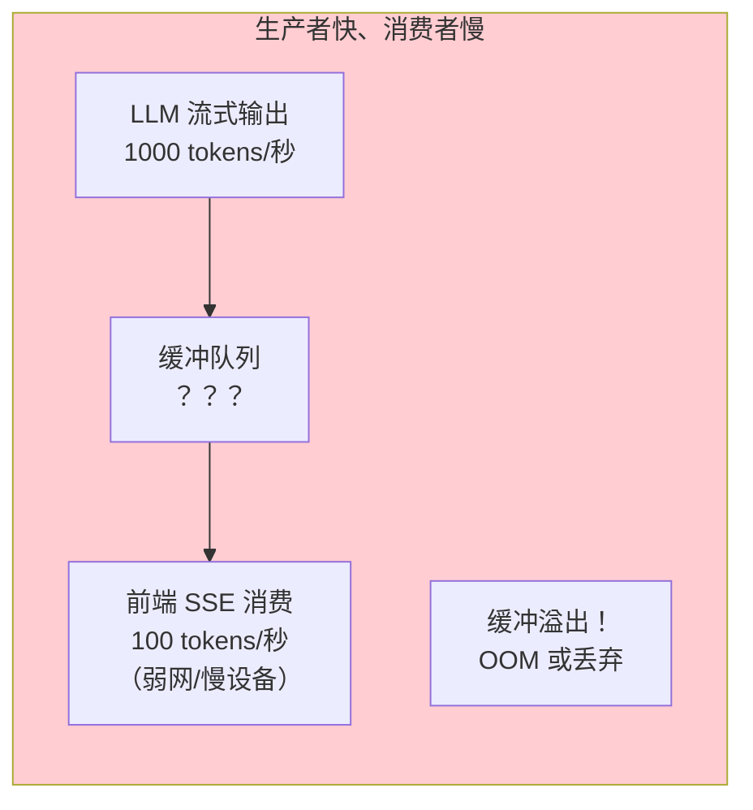
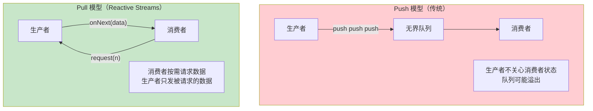
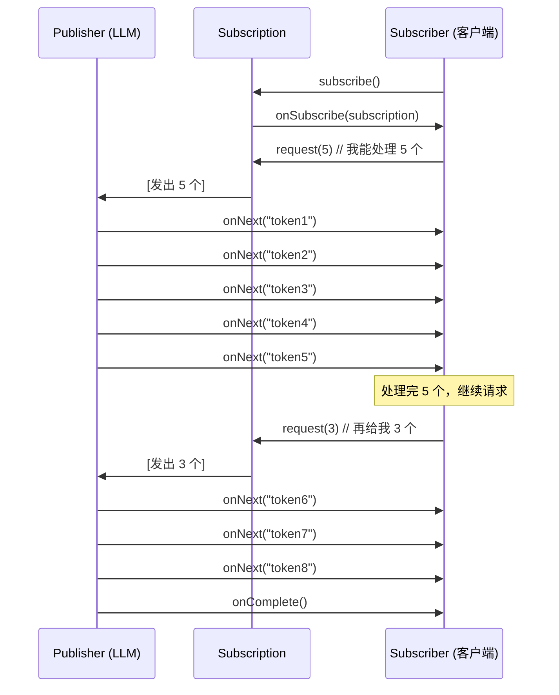
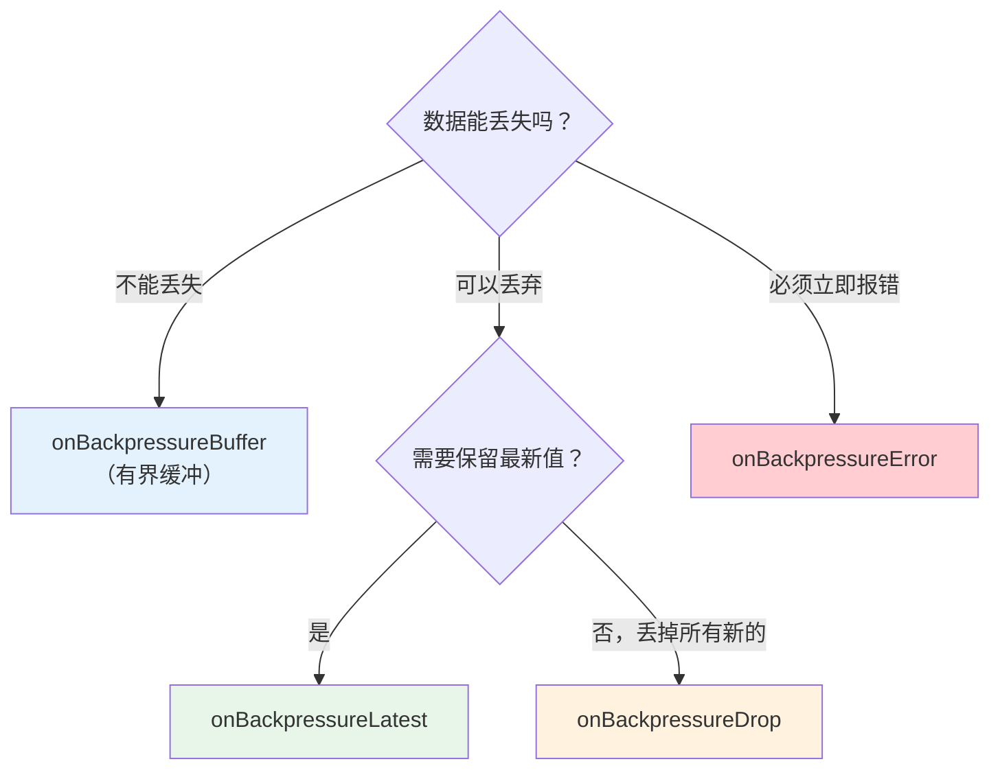
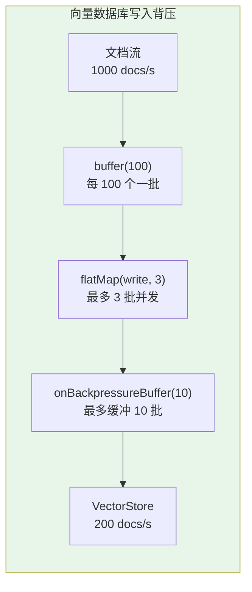
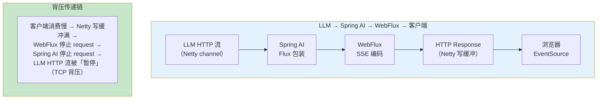

# 背压与流量控制

> 「本文是对 [教程 42-响应式错误处理 §2-§4] 的深入展开」

> **定位**：深入讲解 Reactive Streams 的背压（Backpressure）机制、Reactor 的流量控制策略（Buffer/Drop/Latest/Error）、Spring AI 流式输出中的背压管理实践，以及与 LLM 速率限制相关的流量控制策略。
>
> **读者画像**：已经理解 Reactor 基本操作符，需要在 Agent 应用中处理"生产者快、消费者慢"问题的开发者。

---

## 1. 什么是背压

### 1.1 生产者-消费者速率不匹配

在响应式系统中，一个核心挑战是**生产者生产数据的速率可能远超消费者处理的速率**：



在 Agent 应用中，这个场景非常常见：

- **LLM 输出端**：LLM 生成速度可能高达 100-200 tokens/秒
- **网络传输端**：客户端网络差，SSE 消息堆积
- **工具调用端**：Agent 并行调用 10 个工具，结果瞬间涌入
- **数据库写入端**：批量 Embedding 写入跟不上检索速度

如果没有流量控制，高速生产者会迅速耗尽消费者资源——这就是**背压问题**。

### 1.2 传统方案 vs 背压

| 方案 | 原理 | 问题 |
|------|------|------|
| **无界队列** | 所有数据都缓冲 | OOM 风险 |
| **有界队列 + 拒绝策略** | 队列满后丢弃或报错 | 数据丢失或不可控 |
| **背压（Backpressure）** | 消费者按需 request(n)，主动拉取 | 需要响应式编程支持 |

背压的核心思想：**消费者根据自己的处理能力，主动告诉生产者"给我多少数据"**。

---

## 2. Reactive Streams 的拉取模型

### 2.1 Push vs Pull



### 2.2 Subscription 接口

Reactive Streams 规范定义了 `Subscription` 接口，它是背压的核心：

```java
public interface Subscription {
    // 消费者调用：请求 n 个元素
    void request(long n);

    // 消费者调用：取消订阅
    void cancel();
}
```

工作流程：



### 2.3 响应式契约（Reactive Streams 契约）

Reactive Streams 规范定义了严格规则：

1. `request(n)` 的调用次数和 `onNext` 的调用次数一一对应
2. `onNext` 不会超过 `request` 的累积总量
3. 所有信号方法调用都是**串行的**（不需要同步）
4. `onError` 或 `onComplete` 之后不再有任何信号

---

## 3. Reactor 的背压策略

Reactor 提供了四种背压策略，当生产者有数据但消费者尚未 request 时，决定如何处理这些"积压"数据：

### 3.1 onBackpressureBuffer（缓冲）

```java
// 无限缓冲：所有未消费的数据都缓冲（有 OOM 风险）
Flux<Integer> buffered = Flux.range(1, Integer.MAX_VALUE)
    .onBackpressureBuffer();

// 有界缓冲：超过容量后的行为可定制
Flux<Integer> bounded = Flux.range(1, Integer.MAX_VALUE)
    .onBackpressureBuffer(
        1000,                                    // 缓冲容量
        overflowed -> log.warn("丢弃数据: {}", overflowed),  // 溢出回调
        BufferOverflowStrategy.DROP_LATEST       // 溢出策略
    );

// 有界缓冲 + TTL
// Reactor 的真实签名是 onBackpressureBuffer(Duration ttl, int capacity, Consumer onOverflow)
Flux<Event> ttlBuffer = eventSource
    .onBackpressureBuffer(
        Duration.ofSeconds(30),  // 缓冲 TTL：超过 30 秒的数据会被清除
        500,                     // 缓冲容量
        overflowed -> metrics.overflow()
    );
```

### 3.2 onBackpressureDrop（丢弃）

```java
// 消费者处理不过来时，直接丢弃新数据
Flux<String> dropping = llmTokenStream
    .onBackpressureDrop(dropped -> {
        log.warn("客户端消费过慢，丢弃 token chunk: {}", dropped);
        metrics.counter("agent.tokens.dropped").increment();
    });
```

### 3.3 onBackpressureLatest（只保留最新）

```java
// 消费者处理不过来时，只保留最新的一个元素
Flux<String> latest = llmTokenStream
    .onBackpressureLatest();  // 旧的被新的覆盖
```

### 3.4 onBackpressureError（报错）

```java
// 消费者处理不过来时，直接抛出异常
Flux<String> errorOnOverflow = llmTokenStream
    .onBackpressureError();  // 抛出 OverflowException
```

### 3.5 策略选择



---

## 4. Agent 场景中的背压实战

### 4.1 SSE 流式输出的背压

WebFlux 中，HTTP 响应写入有一个底层缓冲区。如果客户端消费慢，写入会阻塞，Reactor 的背压机制自动生效：

```java
@RestController
public class StreamingController {

    private final ChatClient chatClient;

    @GetMapping(value = "/chat/stream", produces = MediaType.TEXT_EVENT_STREAM_VALUE)
    public Flux<ServerSentEvent<String>> stream(@RequestParam String query) {
        return chatClient.prompt()
            .user(query)
            .stream()
            .content()
            .map(chunk -> ServerSentEvent.<String>builder()
                .data(chunk)
                .build())
            // 背压策略：客户端消费过慢时丢弃旧 chunk
            // LLM 输出实时性 > 历史完整性
            .onBackpressureLatest()
            .onErrorResume(e -> Flux.just(
                ServerSentEvent.<String>builder()
                    .event("error")
                    .data("流式输出中断")
                    .build()
            ));
    }
}
```

### 4.2 多 Agent 并行调用的背压

多个 Agent 并行产出结果时，合并后的数据量可能很大。使用 `flatMap` 的并发度限制：

```java
public Flux<AgentResult> parallelAgents(List<String> queries) {
    return Flux.fromIterable(queries)
        // flatMap 的第二个参数 = 并发度上限
        // 同时最多 5 个 Agent 在运行，控制对 LLM API 的并发压力
        .flatMap(query -> callAgent(query), 5)
        // 如果下游处理不过来，缓冲最多 100 个结果
        .onBackpressureBuffer(
            100,
            dropped -> log.warn("Agent 结果被丢弃"),
            BufferOverflowStrategy.DROP_OLDEST
        );
}
```

### 4.3 向量数据库写入的背压

批量写入 Embedding 到向量数据库时，写入速度可能跟不上 Embedding 生成速度：

```java
public Mono<Void> batchInsertEmbeddings(List<Document> documents) {
    return Flux.fromIterable(documents)
        // 批量处理：每 100 个文档一批
        .buffer(100)
        // 并发写入：同时最多 3 批在写入
        .flatMap(batch -> vectorStore.add(batch), 3)
        // 背压：如果向量数据库写入慢，最多缓冲 10 批
        .onBackpressureBuffer(
            10,
            overflow -> {
                log.error("向量数据库写入积压，丢弃批次");
                metrics.counter("vectorstore.overflow").increment();
            },
            BufferOverflowStrategy.DROP_OLDEST
        )
        .then();
}
```



---

## 5. 限流（Rate Limiting）

### 5.1 LLM API 速率限制

LLM 提供商（OpenAI、Anthropic 等）都有 API 调用频率限制（RPM/TPM）。需要在 Agent 侧做限流，避免 429 Too Many Requests：

> **需在 pom.xml 中添加依赖**：Resilience4j 非 Spring AI 自带，示例使用 `io.github.resilience4j:resilience4j-ratelimiter`（Spring Boot 管理其 BOM 版本）。

```java
@Component
public class RateLimitedChatClient {

    private final ChatClient chatClient;
    // 令牌桶：限制 RPM
    private final RateLimiter rateLimiter;

    // 使用 Resilience4j RateLimiter
    @Autowired
    public RateLimitedChatClient(ChatClient.Builder builder, RateLimiterRegistry registry) {
        this.chatClient = builder.build();
        this.rateLimiter = registry.rateLimiter("llmApi",
            RateLimiterConfig.custom()
                .limitForPeriod(50)          // 每周期 50 次
                .limitRefreshPeriod(Duration.ofMinutes(1))  // 每分钟
                .timeoutDuration(Duration.ofSeconds(10))    // 获取许可最多等 10 秒
                .build()
        );
    }

    public Mono<String> call(String query) {
        return Mono.defer(() -> {
                // 尝试获取许可
                if (!rateLimiter.acquirePermission()) {
                    // 真实 Resilience4j 集成中此处抛 io.github.resilience4j.ratelimiter.RequestNotPermitted
                    return Mono.error(new IllegalStateException("超过 LLM API 频率限制"));
                }
                // .call().content() 是同步阻塞调用，须包进 fromCallable 在 boundedElastic 执行
                return Mono.fromCallable(() -> chatClient.prompt()
                        .user(query)
                        .call()
                        .content());
            })
            .subscribeOn(Schedulers.boundedElastic());  // 限流等待与阻塞调用都在专用线程
    }
}
```

### 5.2 用 Reactor 实现令牌桶

```java
// 用 Flux.interval + 共享许可实现简单的令牌桶
public class TokenBucket {

    private final AtomicInteger permits;
    private final int maxPermits;
    private final Duration refillInterval;

    public TokenBucket(int maxPermits, Duration refillInterval) {
        this.permits = new AtomicInteger(maxPermits);
        this.maxPermits = maxPermits;
        this.refillInterval = refillInterval;

        // 定期补充许可
        Flux.interval(refillInterval)
            .doOnNext(i -> permits.updateAndGet(p -> Math.min(maxPermits, p + 1)))
            .subscribe();
    }

    public boolean tryAcquire() {
        while (true) {
            int current = permits.get();
            if (current <= 0) return false;
            if (permits.compareAndSet(current, current - 1)) {
                return true;
            }
        }
    }
}

// 在 Flux 管线中使用
public Flux<String> rateLimitedStream(String query) {
    TokenBucket bucket = new TokenBucket(10, Duration.ofSeconds(1));  // 10 req/s
    return chatClient.prompt()
        .user(query)
        .stream()
        .content()
        .filter(chunk -> bucket.tryAcquire());  // 只在有许可时通过
}
```

### 5.3 并发限流（Semaphore）

```java
// 使用 Reactor 的 Semaphore 控制并发数
public Flux<String> limitedConcurrency(List<String> queries, int maxConcurrent) {
    Semaphore semaphore = new Semaphore(maxConcurrent);

    return Flux.fromIterable(queries)
        .flatMap(query ->
            Mono.fromCallable(() -> {
                    semaphore.acquire();  // 阻塞获取许可
                    try {
                        return chatClient.prompt()
                            .user(query)
                            .call()
                            .content();
                    } finally {
                        semaphore.release();
                    }
                })
                .subscribeOn(Schedulers.boundedElastic())  // 在 I/O 线程等待
        );
}

// 更简洁的方式：直接用 flatMap 的并发度参数
public Flux<String> simplerApproach(List<String> queries, int maxConcurrent) {
    return Flux.fromIterable(queries)
        .flatMap(query -> Mono.fromCallable(() ->
            chatClient.prompt().user(query).call().content()
        ).subscribeOn(Schedulers.boundedElastic()), maxConcurrent);  // 第二个参数就是并发限制
}
```

---

## 6. 背压与 Spring AI 的交互

### 6.1 ChatClient.stream() 的背压行为

Spring AI 的 `ChatClient.stream()` 底层是对 LLM HTTP 流式响应的封装。背压的行为取决于：



Spring AI 2.0 的流式输出原生支持背压传递——当客户端消费不过来时，TCP 层面的背压最终传递到 LLM 的 HTTP 流，自然实现"生产者减速"。

### 6.2 控制预取量

```java
// Reactor 的 prefetch 参数：预取元素数量
// 默认 prefetch = 256（Flux.flatMap 等操作符的内部预取）
Flux.fromIterable(documents)
    .flatMap(doc -> embedAndStore(doc), 4)  // 并发度 4
    // 上游每次预取 256 个（默认），可以调整
    .publishOn(Schedulers.parallel(), 64);  // 预取 64

// 对于 LLM 流式输出，通常不需要调整 prefetch——默认值足够
```

---

## 7. 监控背压

### 7.1 监控缓冲区大小

```java
// 通过 doOnRequest 和 doOnNext 监控供需差异
AtomicLong requested = new AtomicLong(0);
AtomicLong produced = new AtomicLong(0);

Flux<String> monitored = llmStream
    .doOnRequest(n -> {
        requested.addAndGet(n);
        log.debug("Requested: {}, Produced: {}, Diff: {}",
            requested.get(), produced.get(), requested.get() - produced.get());
    })
    .doOnNext(s -> produced.incrementAndGet());

// Micrometer 指标
Gauge.builder("agent.backpressure.requested", requested, AtomicLong::get)
    .register(meters);
Gauge.builder("agent.backpressure.produced", produced, AtomicLong::get)
    .register(meters);
```

### 7.2 监控丢弃数量

```java
Counter dropCounter = meters.counter("agent.stream.dropped");

Flux<String> monitored = llmStream
    .onBackpressureDrop(dropped -> {
        dropCounter.increment();
        log.warn("Dropped chunk: {}", dropped);
    });
```

---

## 8. 错误处理与背压的结合

### 8.1 背压超时

```java
// 如果消费者长时间不 request，可能意味着它已经挂了
Flux<String> withTimeout = llmStream
    .onBackpressureBuffer(100)
    .timeout(Duration.ofSeconds(30), Flux.empty());  // 30 秒无消费就结束
```

### 8.2 背压降级

```java
// 当背压溢出时，切换到降级策略
Flux<String> withFallback = llmStream
    .onBackpressureBuffer(
        50,
        overflow -> log.warn("Overflow: {}", overflow),
        BufferOverflowStrategy.DROP_LATEST
    )
    .onErrorResume(e -> {
        // 如果用的是 onBackpressureError / ERROR 策略，溢出异常是
        // reactor.core.Exceptions.failWithOverflow() 的产物（OverflowException 为包私有类）
        if (reactor.core.Exceptions.isOverflow(e)) {
            return Flux.just("系统繁忙，请稍后重试");
        }
        return Flux.error(e);
    });
```

---

## 9. 完整实战：带背压管理的 Agent 推理管线

```java
@Service
public class BackpressureAwareAgent {

    private final ChatClient chatClient;
    private final MeterRegistry meters;
    private final TokenBucket apiLimiter;

    public Flux<ServerSentEvent<String>> stream(String sessionId, String query) {
        Counter droppedCounter = meters.counter("agent.tokens.dropped",
            "session", sessionId);

        return chatClient.prompt()
            .user(query)
            .stream()
            .content()
            // 1. 限流：控制从 LLM 接收的速率
            .filter(chunk -> apiLimiter.tryAcquire())
            // 2. 背压：客户端消费慢时缓冲有限数据
            .onBackpressureBuffer(
                200,
                dropped -> {
                    droppedCounter.increment();
                    log.warn("[{}] 背压溢出，丢弃: {}", sessionId, dropped);
                },
                BufferOverflowStrategy.DROP_OLDEST
            )
            // 3. 超时保护
            .timeout(Duration.ofSeconds(60))
            // 4. 错误恢复
            .onErrorResume(e -> {
                log.error("[{}] 流式输出错误", sessionId, e);
                return Flux.just("[ERROR] " + e.getMessage());
            })
            // 5. SSE 编码
            .map(chunk -> ServerSentEvent.<String>builder()
                .event("data")
                .data(chunk)
                .build())
            // 6. 完成信号
            .concatWith(Mono.just(ServerSentEvent.<String>builder()
                .event("done")
                .data("[DONE]")
                .build()))
            // 7. 最终清理
            .doFinally(signal ->
                log.info("[{}] 流结束: {}", sessionId, signal));

    }
}
```

---

## 10. 总结

背压是响应式系统区别于传统异步框架的核心能力。在 Agent 应用中，背压和流量控制贯穿每一层数据流：

1. **背压本质**：消费者按需 `request(n)`，生产者只发被请求的数据——拉取模型
2. **四种策略**：Buffer（缓冲）、Drop（丢弃）、Latest（保新）、Error（报错）——根据数据重要性选择
3. **限流策略**：令牌桶、并发限制（flatMap 并发度）、API 频率限制——保护下游不被压垮
4. **Spring AI 的背压**：`ChatClient.stream()` 原生支持背压传递，客户端消费慢时自动减速
5. **监控**：通过 Micrometer 监控 requested/produced/dropped 指标，实时掌握系统健康度

在教程 42（响应式错误处理）中，背压溢出是错误处理的重要场景之一。理解背压机制，才能在 Agent 高并发场景中做出正确的流量控制决策。
