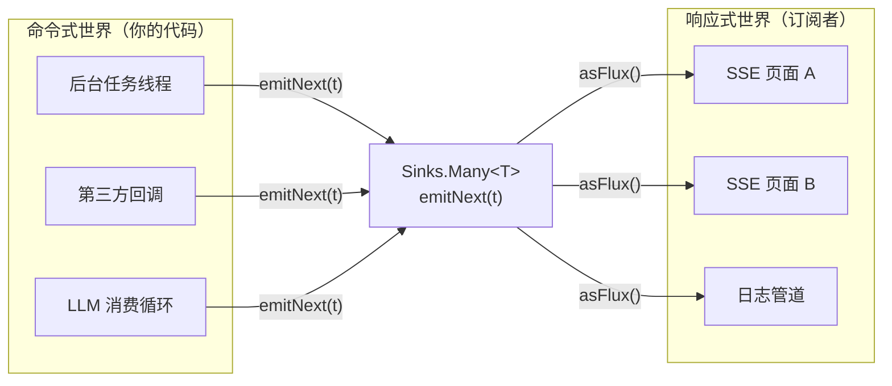
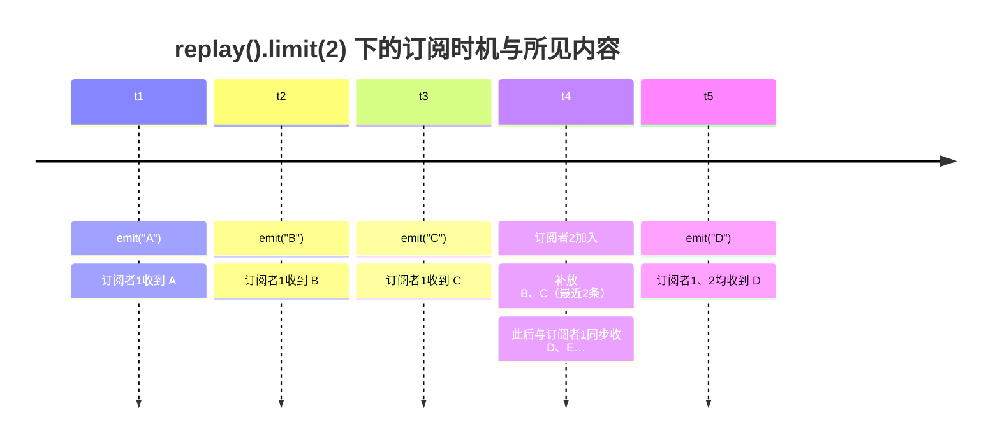
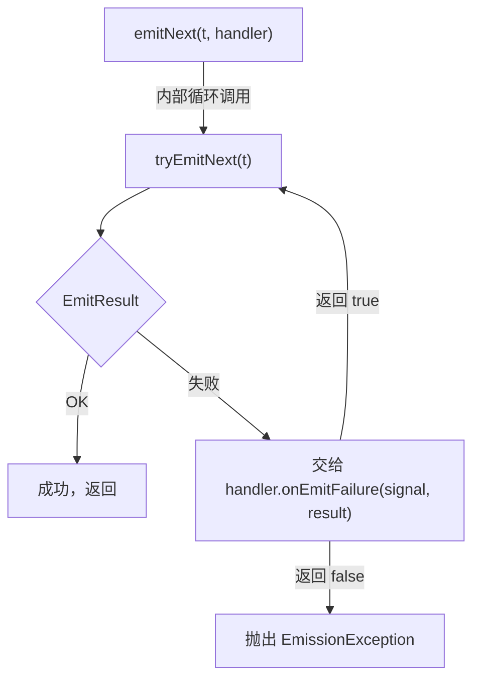
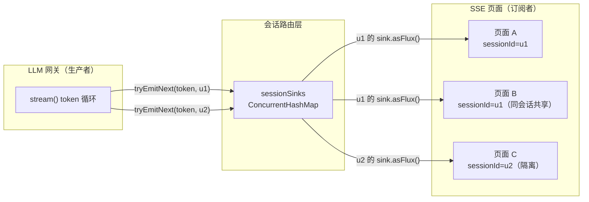
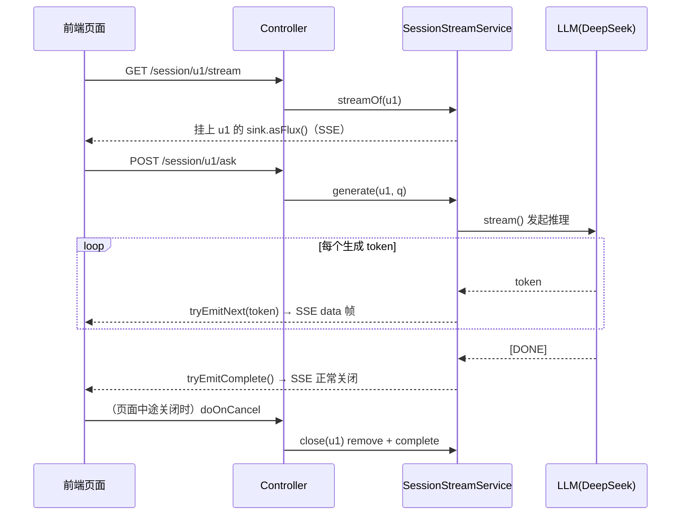

# Sinks 详解：命令式世界与响应式世界的桥梁

> **定位**：本文面向已理解 Mono/Flux 基础（前置：[附录 06-WebFlux与响应式编程/00-WebFlux从零入门]、[附录 06-WebFlux与响应式编程/01-Reactor核心]）但从未用过 Sinks 的开发者。讲透 Sinks 是什么、四种形态怎么选、emit/tryEmit/EmitResult 的完整语义、多线程发射的坑，以及 Agent 场景（进度推送、多页面共享 LLM 流）的实战。API 版本：reactor-core **3.8.6**（Boot 4.1.0 → reactor-bom 2025.0.6），全部签名经本地 jar `javap` 实证。

---

## 1. 为什么需要 Sinks：一个真实的困境

学完 Reactor 操作符你会发现一个盲区——**所有创建型 API 都是"框架在推数据"**：

```java
Flux.just(1, 2, 3);                          // 数据写死
Flux.fromIterable(list);                      // 集合已存在
Flux.create(sink -> ...);                     // 一次性把发射逻辑交给框架
webClient.get()...bodyToFlux(String.class);   // 数据来自 I/O
```

但企业场景经常是反过来的：**你的普通 Java 代码（回调、监听器、后台任务）拿到了数据，想把它"塞进"一条响应式管道**。典型例子：

- Agent 执行一个 10 步任务，每完成一步想在 SSE 上推送一条进度——但任务代码是普通命令式的，跑在别的线程上
- LLM 流式输出到达一个页面，同一会话的另一个页面（用户切换了浏览器标签）也要看到同样的流
- 第三方 SDK 只提供阻塞回调式接口 `onMessage(String s)`，你要把它包装成 `Flux<String>`

`Flux.create` 其实能做到第一件事，但它**每个订阅者都会触发一次 create lambda 重放**（冷流语义），且多订阅者会收到多份重复发射。Sinks 就是为"**外部主动推送 + 热流语义 + 独立于订阅**"而生的正式 API：

> **Sinks = 一个你可以随时调方法塞数据的"入口"，同时它把塞进来的数据以 Flux/Mono 形式暴露给任意订阅者。**



`★ 核心心智模型`：Sinks 是**热源**——数据不存储、不重放（replay 系列除外），塞进来的瞬间就流向当时的订阅者；订阅之前的发射，后来者拿不到。

---

## 2. Sinks 家族全景（全部 javap 实证）

reactor-core 3.8.6 中 `reactor.core.publisher.Sinks` 的工厂方法只有 4 个：

```java
public final class Sinks {
    public static <T> Sinks.Empty<T> empty();   // 只能终止，不发射数据
    public static <T> Sinks.One<T>   one();     // 单值
    public static Sinks.ManySpec     many();    // 多值（默认线程安全/串行化）
    public static Sinks.RootSpec     unsafe();  // 多值（跳过串行化，性能优先）
}
```

| 形态 | 输出类型 | 能发几个数据 | 语义 |
|---|---|---|---|
| `Sinks.Empty<T>` | `Mono<T>` | 0 个（只能 complete/error） | "任务结束了"信号 |
| `Sinks.One<T>` | `Mono<T>` | 恰好 1 个 | 异步单值（CompletableFuture 的响应式版） |
| `Sinks.Many<T>`（线程安全版） | `Flux<T>` | 0..N 个 | 主力，多线程可安全调用 |
| `Sinks.Many<T>`（unsafe 版） | `Flux<T>` | 0..N 个 | 性能更高，要求调用方自己保证串行 |

注意：**没有 `Sinks.Many<T>` 的直接工厂**，必须通过 `many()` 返回的 `ManySpec` 二次选择策略（见 §4）。这一点和很多旧教程写的 `Sinks.many().multicast().onBackpressureBuffer()` 一致——该调用链在 3.8.6 实证存在。

---

## 3. 先从最简单的两个：Empty 与 One

### 3.1 Sinks.One：异步单值

`Sinks.One<T>` 实证签名：

```java
public interface Sinks.One<T> extends Sinks.Empty<T> {
    public Sinks.EmitResult tryEmitValue(T value);                       // 非抛出版
    public void emitValue(T value, Sinks.EmitFailureHandler handler);   // 可重试版
}
// 继承自 Empty：tryEmitEmpty()/tryEmitError()/emitEmpty()/emitError()/currentSubscriberCount()/asMono()
```

最小示例——把一个阻塞计算的结果交给响应式世界：

```java
// reactor-core 3.8.6
Sinks.One<String> sink = Sinks.one();
Mono<String> mono = sink.asMono();

mono.subscribe(v -> System.out.println("收到: " + v));

// 别的线程、别的地方，命令式地完成它
sink.emitValue("结果", Sinks.EmitFailureHandler.FAIL_FAST);
// 输出：收到: 结果
```

`Sinks.One` 语义上是"一次性"的：第二次 `emitValue` 会返回/抛出 `FAIL_TERMINATED`（tryEmitValue 版返回 `EmitResult.FAIL_TERMINATED`，emitValue 版在 FAIL_FAST 下抛 `EmitException`）。它是 `CompletableFuture` 的响应式等价物，但没有内置线程池——**何时算完成完全由你控制**。

### 3.2 Sinks.Empty：只要"结束"信号

不能发数据，只能 `emitEmpty()`（正常结束）或 `emitError(t)`。适合"取消信号""关闭信号"这类只需要到达与否、不携带负载的场景。

```java
Sinks.Empty<Void> shutdown = Sinks.empty();
Mono<Void> shutdownSignal = shutdown.asMono();

shutdownSignal.subscribe(v -> System.out.println("优雅关闭流程启动"));

// 某处触发关闭
shutdown.emitEmpty(Sinks.EmitFailureHandler.FAIL_FAST);
```

---

## 4. Sinks.Many：主力形态与四种策略

`Sinks.many()` 返回 `ManySpec`，实证签名分三条路线：

```java
public interface ManySpec {
    UnicastSpec        unicast();    // 单订阅者
    MulticastSpec      multicast();  // 多订阅者
    MulticastReplaySpec replay();    // 多订阅者 + 重放历史
}
```

### 4.1 Unicast：只允许一个订阅者

实证签名（`UnicastSpec`）：

```java
Sinks.Many<T> onBackpressureBuffer();                                  // 无界缓冲
Sinks.Many<T> onBackpressureBuffer(Queue<T> queue);                    // 自定义队列
Sinks.Many<T> onBackpressureBuffer(Queue<T> queue, Disposable onCancel);
Sinks.Many<T> onBackpressureError();                                   // 不缓冲，订阅者跟不上直接报错
```

第二个订阅者订阅 `asFlux()` 会立刻收到 `ErrorCallbackNotImplemented` 式的 `IllegalStateException`（"Unicast Sinks allow only a single Subscriber"）。**用途**：把一个回调式 SDK 包装成 Flux 且明确只有一个消费者。

```java
Sinks.Many<String> sdkBridge = Sinks.many().unicast().onBackpressureBuffer();

// 第三方 SDK 的阻塞回调，命令式塞入
someSdk.setMessageListener(msg -> sdkBridge.emitNext(msg,
        Sinks.EmitFailureHandler.FAIL_FAST));

// 唯一消费者
Flux<String> messages = sdkBridge.asFlux();
```

### 4.2 Multicast：多订阅者，三种背压口味

实证签名（`MulticastSpec`）：

```java
Sinks.Many<T> onBackpressureBuffer();                       // 慢订阅者：无限缓冲
Sinks.Many<T> onBackpressureBuffer(int bufferSize);         // 慢订阅者：有界缓冲
Sinks.Many<T> onBackpressureBuffer(int bufferSize, boolean autoCancel);
Sinks.Many<T> directAllOrNothing();   // 只要有任一订阅者跟不上 → 全体收不到该元素
Sinks.Many<T> directBestEffort();     // 跟得上的收，跟不上者静默丢（最多收到一个 terminal error? 否——不报错，仅丢弃）
```

三者的决策要点（这是 Sinks 最重要的选型表）：

| 策略 | 慢订阅者的数据 | 是否可能 OOM | 典型场景 |
|---|---|---|---|
| `onBackpressureBuffer()` | 全部缓存，之后加速追 | **会**（无界） | 不可丢的关键事件（订单、审计） |
| `onBackpressureBuffer(n)` | 缓存 n 条，溢出即收到 `FAIL_OVERFLOW` 终止 | 不会 | 有界的内存保护 |
| `directAllOrNothing()` | 一人跟不上 → **所有人**丢这条 | 不会 | "全体一致才算成功"（分布式提示词分片） |
| `directBestEffort()` | 跟得上的收，跟不上的丢 | 不会 | token 流、日志推送——丢了就丢了 |

**Agent 流式输出的标准答案**：`Sinks.many().multicast().directBestEffort()`——LLM token 流本身允许丢帧（丢了重问），绝不能为一个慢页面无限堆内存。

### 4.3 Replay：迟到者也能看回放

实证签名（`MulticastReplaySpec`）：

```java
Sinks.Many<T> all();                    // 重放全部历史
Sinks.Many<T> all(int maxSize);         // 全部历史，但最多 maxSize 条
Sinks.Many<T> latest();                 // 只重放最后一条
Sinks.Many<T> latestOrDefault(T value); // 没有历史时重放默认值
Sinks.Many<T> limit(int n);                          // 重放最近 n 条
Sinks.Many<T> limit(Duration ttl);                   // 重放 TTL 内的历史
Sinks.Many<T> limit(Duration ttl, Scheduler clock);
Sinks.Many<T> limit(int n, Duration ttl);            // 数量 + 时间双限
Sinks.Many<T> limit(int n, Duration ttl, Scheduler clock);
```

用途：**用户刷新页面后要看到本会话之前的输出**。`replay().limit(100)` 让新订阅者补最近 100 条，之后进入实时流——"历史回放 + 实时追加"一条 API 搞定。



---

## 5. 发射 API 的完整语义：emit vs tryEmit vs EmitResult

`Sinks.Many<T>` 实证签名：

```java
public interface Sinks.Many<T> extends Scannable {
    Sinks.EmitResult tryEmitNext(T t);
    Sinks.EmitResult tryEmitComplete();
    Sinks.EmitResult tryEmitError(Throwable e);
    void emitNext(T t, Sinks.EmitFailureHandler handler);
    void emitComplete(Sinks.EmitFailureHandler handler);
    void emitError(Throwable e, Sinks.EmitFailureHandler handler);
    int  currentSubscriberCount();
    Flux<T> asFlux();
}
```

两套发射方式的关系：



### 5.1 EmitResult 六种取值（实证枚举）

| EmitResult | 含义 | 常见诱因 | 处理建议 |
|---|---|---|---|
| `OK` | 发射成功 | — | — |
| `FAIL_OVERFLOW` | 缓冲满/背压拒绝 | `onBackpressureBuffer(n)` 撑爆；direct 系列订阅者跟不上 | 降级、丢弃或告警，**不要无限重试** |
| `FAIL_TERMINATED` | 流已 complete/error | 完成后又 emit；One 重复 emitValue | 多为 bug，检查生命周期 |
| `FAIL_CANCELLED` | 所有订阅者已取消 | SSE 客户端断开后继续 emit | 正常现象，可安全忽略（页面关了就别推了） |
| `FAIL_NON_SERIALIZED` | 并发调用未串行化 | 两个线程同时 emit 到"安全版" sink | 用 `unsafe()` + 自己加锁，或回环重试（见 §6） |
| `FAIL_ZERO_SUBSCRIBER` | direct 系列且当前无订阅者 | 无人监听时 emit | 视业务：可忽略或先缓存 |

**为什么 FAIL_NON_SERIALIZED 会出现在"线程安全版"上？** `Sinks.many()` 的"安全"指的是**多线程 emit 时用 CAS 忙等保证串行**，忙等失败即返回 `FAIL_NON_SERIALIZED`——官方期望你配合 `busyLooping` 处理器重试。`EmitFailureHandler` 实证签名：

```java
public interface Sinks.EmitFailureHandler {
    public static final Sinks.EmitFailureHandler FAIL_FAST;      // 失败立刻抛 EmissionException
    public static Sinks.EmitFailureHandler busyLooping(Duration timeout); // 忙等重试直至超时
    public boolean onEmitFailure(SignalType signal, EmitResult result);   // 自定义：返回 true 继续重试
}
```

推荐的自定义 handler（重试可恢复错误、放弃永久错误）：

```java
// reactor-core 3.8.6
Sinks.EmitFailureHandler handler = (signal, result) ->
        result == Sinks.EmitResult.FAIL_NON_SERIALIZED;  // 仅对并发冲突重试
// FAIL_TERMINATED / FAIL_OVERFLOW / FAIL_CANCELLED 直接放弃 → 抛 EmissionException
```

### 5.2 emit 三件套的选择口诀

- **tryEmitXxx**：想要返回值自己分支处理（函数式风格，无异常控制流）
- **emitXxx + FAIL_FAST**：确定不会失败，失败即 bug（快速失败最干净）
- **emitXxx + busyLooping / 自定义 handler**：高并发 emit 场景（多线程回调源）

---

## 6. 多线程发射：安全版 vs unsafe()

`Sinks.unsafe()` 返回的 spec 与 `many()` 相同，但**跳过并发防护**。选择依据：

| 场景 | 选择 |
|---|---|
| 多线程回调源（SDK 回调来自线程池、多个生产者） | `Sinks.many()`（安全版）+ `busyLooping` 或自定义重试 handler |
| 单线程或已有外部串行保证（如自己加锁、单 EventLoop 内） | `Sinks.unsafe()`（省去 CAS 开销，吞吐更高） |
| 并发调用 unsafe 版 | **未定义行为**：数据交错、`IllegalStateException`，绝对禁止 |

一个常见误区：`Flux.create` 也可以多线程发射且从不报 `FAIL_NON_SERIALIZED`——因为它是冷流，每个订阅者对应独立发射上下文；代价是你无法把"同一份数据"广播给多个订阅者。**广播需求一旦出现，就该从 create 迁移到 Sinks。**

---

## 7. 实战：Agent 进度推送 + 多页面共享 LLM 流

把前面全部知识串成一个企业级最小实现：**后台 Agent 任务逐步上报进度，任意数量的 SSE 页面实时观看**。

```java
// Spring Boot 4.1.0 + Spring AI 2.0.0 + reactor-core 3.8.6
package demo.demo01.controller;

import org.springframework.http.MediaType;
import org.springframework.web.bind.annotation.*;
import reactor.core.publisher.Flux;
import reactor.core.publisher.Sinks;
import reactor.core.scheduler.Schedulers;
import java.time.Duration;

@RestController
class AgentProgressController {

    // 多订阅者 + 慢页面丢帧不堆内存（directBestEffort）
    private final Sinks.Many<String> progress =
            Sinks.many().multicast().directBestEffort();

    // 重试策略：只重试并发冲突，其余失败快速抛出
    private final Sinks.EmitFailureHandler retryOnRace =
            (signal, result) -> result == Sinks.EmitResult.FAIL_NON_SERIALIZED;

    // 页面 A、页面 B、第 N 个页面都订阅这条流
    @GetMapping(value = "/agent/progress", produces = MediaType.TEXT_EVENT_STREAM_VALUE)
    Flux<String> watch() {
        return progress.asFlux();
    }

    // 触发一次任务（演示用；生产中由任务调度器触发）
    @PostMapping("/agent/run")
    Flux<String> run() {
        return Flux.range(1, 5)
                .delayElements(Duration.ofSeconds(1))               // 模拟每步耗时
                // 阻塞/耗时逻辑隔离到 boundedElastic，不占 EventLoop
                .publishOn(Schedulers.boundedElastic())
                .doOnNext(step -> {
                    Sinks.EmitResult r = progress.tryEmitNext(
                            "step " + step + "/5 done");
                    if (r.isFailure() && r != Sinks.EmitResult.FAIL_ZERO_SUBSCRIBER
                                      && r != Sinks.EmitResult.FAIL_CANCELLED) {
                        r.orThrow();   // EmitResult 实证方法：失败即抛 EmissionException
                    }
                    // ZERO_SUBSCRIBER / CANCELLED：没人看就没人看，不算错误
                })
                .doOnComplete(() -> progress.tryEmitComplete())
                .map(i -> "task step " + i + " executed");
    }
}
```

验证（开两个终端模拟两个页面）：

```bash
# 终端1、终端2 都先挂上 SSE
curl -N http://localhost:8080/agent/progress
# 终端3：触发任务
curl -X POST http://localhost:8080/agent/run
# 终端1、2 同时看到 step 1/5 done ... step 5/5 done
```

若把需求改成"**中途打开页面也要看到之前进度**"，只改一行：

```java
private final Sinks.Many<String> progress =
        Sinks.many().replay().limit(10);   // 实证 API：MulticastReplaySpec.limit(int)
```

（`replay()` 系列返回的 spec 实证只有 `all()/latest()/limit()` 等方法——replay 系列本身就是"订阅者走光也不自动终止"的语义，无需也无 `autoCancel` 参数。）

若改成"**LLM token 流共享**"：把 `tryEmitNext("step...")` 换成消费 `chatClient.prompt().stream()` 的每个 token 即可——生产者是 Flux 消费循环（天然串行），可以用 `Sinks.unsafe().multicast().directBestEffort()` 拿更高吞吐。

### 7.1 每请求一个 sink vs 全局单 sink

上例是**全局单 sink**（广播给所有人，适合演示/公告类）。企业级更常见的是**每会话一个 sink，用 Map 管理**：

```java
// 会话 -> 该会话的 token 流；读多写少，ConcurrentHashMap 足够
java.util.Map<String, Sinks.Many<String>> sessionSinks = new java.util.concurrent.ConcurrentHashMap<>();

Sinks.Many<String> sinkFor(String sessionId) {
    return sessionSinks.computeIfAbsent(sessionId,
            id -> Sinks.many().multicast().directBestEffort());
}
// 会话结束清理（SSE onDispose 回调里 remove）：
// subscription dispose 时 sessionSinks.remove(sessionId)
```



这正是"多页面流式响应"企业级要求的最小内核。「跨页面/断线重连的完整方案？→ [教程 SSE 与会话管理相关章节]」

---

## 8. 常见陷阱（按翻车频率排序）

1. **先 emit 后订阅（非 replay），数据凭空消失。** multicast 的 sink 是热的，没有订阅者时 emit 的数据（directBestEffort 下）直接丢弃且返回 `FAIL_ZERO_SUBSCRIBER`。需要"后到者补看"就必须用 `replay()`。
2. **把 `Sinks.One` 当 `Many` 反复 emit。** 第二次必然 `FAIL_TERMINATED`。单值语义用 One，多值用 Many，别混。
3. **无界 `onBackpressureBuffer()` 打爆内存。** 生产慢、消费更慢时无界缓冲线性增长，最终 OOM。token/日志类一律 directBestEffort；关键事件用有界缓冲并处理 `FAIL_OVERFLOW`。
4. **忽略 `FAIL_CANCELLED` 导致刷异常日志。** 页面一关，订阅取消，之后每个 emit 都失败——这是正常生命周期，应在 handler 中静默放过。
5. **高并发 emit 用 FAIL_FAST。** 多线程生产者场景下偶发 `FAIL_NON_SERIALIZED` 直接抛 `EmissionException`。改用 `busyLooping(Duration.ofSeconds(1))` 或自定义只重试 NON_SERIALIZED 的 handler。
6. **在 EventLoop 里 emit 触发昂贵下游。** emit 本身极轻，但它同步触发订阅者管道；若订阅管道里有重逻辑，用 `publishOn(boundedElastic)` 隔离，避免拖慢 emit 线程。
7. **用 `Flux.create` 想做广播。** create 是冷流：N 个订阅者 = lambda 执行 N 次 = 生产 N 份。广播需求请直接上 Sinks。

---

## 9. 总结

- Sinks 解决的是**命令式 → 响应式的数据入口**问题：任何线程、任何回调，一行 `emitNext` 就能进入响应式世界
- 四形态速记：`Empty`=只要结束信号，`One`=单值一次性，`Many`=多值主力，`unsafe()`=去掉并发防护的性能版
- Many 三策略速记：`unicast` 单订阅者桥接 SDK；`multicast` 多订阅者（背压口味四选一，Agent token 流选 `directBestEffort`）；`replay` 给迟到者补历史
- 发射 API 速记：`tryEmit` 拿 `EmitResult` 自己处理；`emit` + `FAIL_FAST` 快速失败；并发生产者配 `busyLooping` 或只重试 `FAIL_NON_SERIALIZED`
- 六种 EmitResult 中，`ZERO_SUBSCRIBER` 与 `CANCELLED` 是正常生命周期，`OVERFLOW`/`TERMINATED` 是设计问题，`NON_SERIALIZED` 是并发提示
- 企业级落点：每会话一个 `multicast().directBestEffort()` sink + `ConcurrentHashMap` 路由 = 多页面共享 LLM 流的最小内核

## 10. 进阶篇

### 10.1 Sinks vs Flux.create vs Flux.push：一次说清

三者都能"命令式塞数据"，但语义截然不同：

| 维度 | `Flux.create` | `Flux.push` | `Sinks.Many` |
|---|---|---|---|
| 冷/热 | **冷**：每个订阅者重新执行 lambda | 冷 | **热**：数据与订阅解耦 |
| 多订阅者 | N 订阅 = N 次生产（重复副作用） | 同左 | N 订阅共享同一数据流 |
| 多线程 emit | 允许（内部有串行化保护） | **不允许**（单线程假设） | 安全版允许 / unsafe 需自证串行 |
| 订阅后才 emit | lambda 只在订阅时执行 | 同左 | 随时 emit，无订阅者时按策略处理 |
| 广播能力 | 无（除非算子转热） | 无 | multicast/replay 原生支持 |

**决策口诀**：副作用只能发生一次（如真正调 LLM）→ `create/push` + `share()/cache()`；多个生产入口、多个消费者、生命周期跨请求 → Sinks。

### 10.2 桥接 Spring AI stream：每会话 sink 的完整形态

把 §7 的会话路由升级为"LLM 网关侧生产、SSE 侧消费"的完整双向闭环：

```java
// Spring Boot 4.1.0 + Spring AI 2.0.0 + reactor-core 3.8.6
package demo.demo01.service;

import org.springframework.ai.chat.client.ChatClient;
import org.springframework.stereotype.Service;
import reactor.core.publisher.Flux;
import reactor.core.publisher.Sinks;
import java.util.Map;
import java.util.concurrent.ConcurrentHashMap;

@Service
public class SessionStreamService {

    private final ChatClient chatClient;

    // 会话 -> token 流出口
    private final Map<String, Sinks.Many<String>> sinks = new ConcurrentHashMap<>();

    public SessionStreamService(ChatClient.Builder builder) {
        this.chatClient = builder.build();
    }

    /** SSE 消费端：页面挂上就拿到该会话的流（订阅与生产完全解耦） */
    public Flux<String> streamOf(String sessionId) {
        return sink(sessionId).asFlux();
    }

    /** LLM 生产端：把模型输出逐 token 灌进会话 sink */
    public void generate(String sessionId, String question) {
        chatClient.prompt().user(question)
                .stream()
                .chatResponse()
                .map(r -> r.getResult().getOutput().getText())
                // token 可能为 null（如结束帧），过滤掉
                .flatMap(t -> t == null ? Flux.empty() : Flux.just(t))
                .subscribe(
                        token -> sink(sessionId).tryEmitNext(token),
                        err   -> sink(sessionId).tryEmitError(err),
                        ()    -> sink(sessionId).tryEmitComplete());
    }

    /** 会话结束（SSE onDispose 回调触发）：complete + 摘除，防止 Map 泄漏 */
    public void close(String sessionId) {
        Sinks.Many<String> s = sinks.remove(sessionId);
        if (s != null) s.tryEmitComplete();
    }

    private Sinks.Many<String> sink(String sessionId) {
        return sinks.computeIfAbsent(sessionId,
                id -> Sinks.many().multicast().directBestEffort());
    }
}
```

```java
@RestController
class SessionSseController {

    private final SessionStreamService service;

    SessionSseController(SessionStreamService service) { this.service = service; }

    @GetMapping(value = "/session/{id}/stream", produces = "text/event-stream")
    Flux<String> watch(@PathVariable String id) {
        return service.streamOf(id)
                // 页面断开时清理会话 sink——防止 ConcurrentHashMap 无限增长
                .doOnCancel(() -> service.close(id));
    }

    @PostMapping("/session/{id}/ask")
    Mono<Void> ask(@PathVariable String id, @RequestBody String q) {
        return Mono.fromRunnable(() -> service.generate(id, q));
    }
}
```

要点逐条对应前文知识点：`directBestEffort`（§4.2）应对慢页面；`tryEmitNext`（§5.1）零异常控制流；`doOnCancel + remove`（§8 陷阱 4/内存泄漏）处理页面关闭。这就是"多页面流式响应"企业级要求的可运行最小内核——**生产在 POST 触发，消费在 GET 挂载，两条时间线通过 Sinks 解耦**：



### 10.3 用 StepVerifier 给 Sinks 写单测

Sinks 的行为最适合单测验证（emit 时序、EmitResult 分支）。需在 pom.xml 添加依赖（本地仓库暂无 reactor-test jar，坐标经 reactor-bom 2025.0.6 管理，scope 用 test）：

```xml
<dependency>
    <groupId>io.projectreactor</groupId>
    <artifactId>reactor-test</artifactId>
    <scope>test</scope>
</dependency>
```

```java
// reactor-test（scope: test）
StepVerifier.create(sink.asFlux())
        .then(() -> sink.emitValue("a", Sinks.EmitFailureHandler.FAIL_FAST))
        .expectNext("a")
        .then(() -> sink.tryEmitComplete())
        .verifyComplete();

// EmitResult 分支也可直接断言（无需订阅）
Sinks.EmitResult second = one.tryEmitValue("b");
assert second == Sinks.EmitResult.FAIL_TERMINATED;   // One 只能发一次（§3.1）
```

### 10.4 内存泄漏排查清单

Sinks 相关 OOM/泄漏，按顺序检查四项：

1. **会话 Map 只增不减**：每个 `computeIfAbsent` 必须有对应的 `remove`（SSE `doOnCancel`/超时兜底双保险）
2. **`onBackpressureBuffer()` 无界 + 慢消费者**：改有界或 direct 系（§4.2 选型表）
3. **replay().all() 长会话**：历史无限增长，改 `limit(n)` 或 `limit(Duration)`
4. **忘记 complete**：流不终止，下游 `doFinally` 清理逻辑永远不执行——生产端务必在成功/失败两条路径都终止流

---

## 11. 总结（进阶增补）

- `create/push` 是冷流、Sinks 是热流：副作用唯一性选前者，广播与解耦选后者
- 每会话 sink + `ConcurrentHashMap` + `doOnCancel` 清理 = Spring AI stream 桥接 SSE 的标准三件套
- StepVerifier 验证时序与 EmitResult 分支；内存泄漏四查：Map 无 remove、无界缓冲、无界 replay、漏 complete

「Sinks 排队的元素如何被下游按需拉取？→ [附录 06-WebFlux与响应式编程/02-背压与流量控制]」
