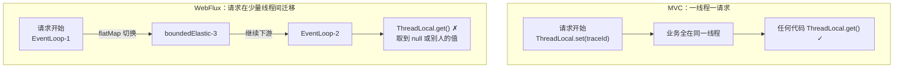
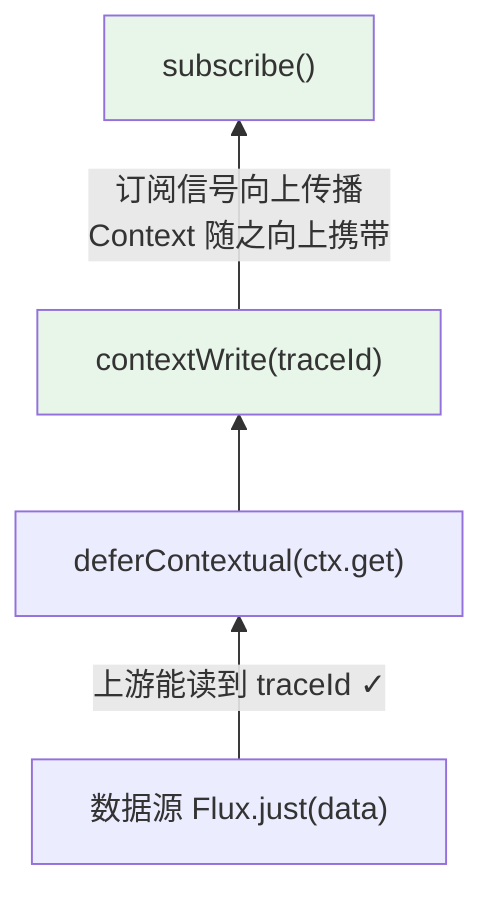
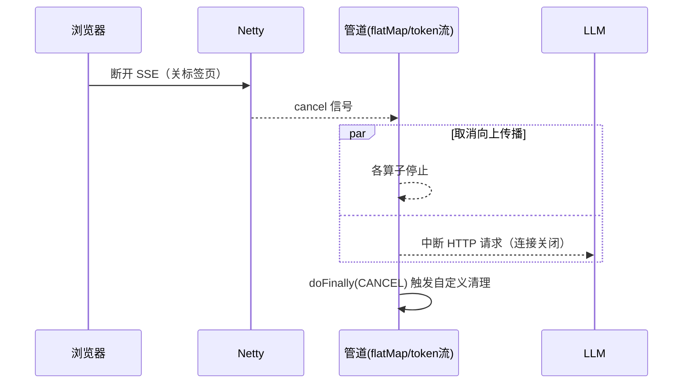

# WebFlux 进阶实战：Context 传递、WebSocket 与弹性模式

> **定位**：本文是 [附录 06-WebFlux与响应式编程/00-WebFlux从零入门] 的进阶续篇，面向已能独立写注解式 Controller + SSE 流的读者。覆盖四个企业级硬骨头：**Reactor Context**（响应式世界替代 ThreadLocal 的唯一正解）、**WebSocket**（双向实时通道）、**消费侧背压策略**（`onBackpressureXxx` 家族）、**弹性模式**（retry/timeout/取消传播）。技术栈：Spring Boot 4.1.0（Spring Framework 7.0.8）+ reactor-core 3.8.6，关键 API 均经本地 jar `javap` 实证。

---

## 1. Reactor Context：为什么 ThreadLocal 在 WebFlux 里会失灵

### 1.1 问题现场

MVC 里你一定写过这种代码：拦截器把 traceId 塞进 `ThreadLocal`，后续任意层直接取。WebFlux 里这套**必然失效**：



根因：**一条响应式管道的各段可能在不同线程执行，而 ThreadLocal 绑定线程**。CLAUDE.md 的 WebFlux 铁律"禁止 ThreadLocal 传递请求上下文（用 Reactor Context）"说的就是这件事。

### 1.2 Context 是什么：随流传播的不可变背包

Reactor Context 是**随订阅沿管道向上游传播的只读键值对**（实现 `ContextView`），随流的执行自动带到每一站，与线程无关。实证签名（reactor-core 3.8.6，`Flux` 上）：

```java
public final Flux<T> contextWrite(ContextView);                              // 写入/合并
public final Flux<T> contextWrite(Function<Context, Context>);              // 基于现有改造
public static Flux<T> deferContextual(Function<ContextView, ? extends Publisher<T>>);  // 读取
```

最小可运行示例（可直接放主方法验证）：

```java
// reactor-core 3.8.6
Flux.just("data")
        // 1. 写：沿管道声明键值（不可变，每次返回新 Context）
        .contextWrite(reactor.util.context.Context.of("traceId", "t-abc-123"))
        // 2. 读：deferContextual 拿到上游传来的 ContextView
        .flatMap(d -> reactor.core.publisher.Flux.deferContextual(ctx -> {
            System.out.println(ctx.get("traceId"));   // t-abc-123
            return Flux.just(d);
        }))
        .subscribe(System.out::println);
```

**关键反直觉点：Context 是从下游往上游传播的**（订阅信号从下往上走，Context 搭便车），所以 `contextWrite` 写在代码"下面"（靠近订阅端），代码"上面"（靠近数据源）的 `deferContextual` 反而读得到：



### 1.3 企业级落点：全链路 traceId（Agent 服务）

把 WebFilter → Service → Tool 全链路的 traceId 打通：

```java
// Spring Boot 4.1.0 + reactor-core 3.8.6
package demo.demo01.config;

import org.springframework.core.annotation.Order;
import org.springframework.stereotype.Component;
import org.springframework.web.server.ServerWebExchange;
import org.springframework.web.server.WebFilter;
import org.springframework.web.server.WebFilterChain;
import reactor.core.publisher.Mono;

@Component
@Order(-100)
class TraceIdFilter implements WebFilter {

    @Override
    public Mono<Void> filter(ServerWebExchange exchange, WebFilterChain chain) {
        String traceId = exchange.getRequest().getHeaders()
                .getFirst("X-Trace-Id");
        if (traceId == null) traceId = java.util.UUID.randomUUID().toString();
        return chain.filter(exchange)
                // 在最靠近订阅端写入，全管道（含下游.flatMap 内）都能读到
                .contextWrite(reactor.util.context.Context.of("traceId", traceId));
    }
}
```

任意深层 Service 读取（无需层层传参）：

```java
Mono<String> answer(String q) {
    return chatCall(q)
            .doOnNext(resp -> log.info("[{}] answer len={}",
                    reactor.core.publisher.Mono.deferContextual(ctx ->
                            Mono.just(ctx.getOrDefault("traceId", "-")))
                            .block(),          // 仅示意：请勿在管道内 block！
                    resp.length()))
            ...
}
```

**注意**：上面 `.block()` 是刻意的反例标注——管道内读取 Context 的正确姿势是 `deferContextual` 接进管道本身：

```java
Mono<String> answer(String q) {
    return Mono.deferContextual(ctx -> {
        String traceId = ctx.getOrDefault("traceId", "-");
        return chatCall(q).doOnNext(r -> log.info("[{}] len={}", traceId, r.length()));
    });
}
```

「TraceId 与 Observation 的关系？→ [附录 18-Observation]（Micrometer 的 Tracing 本身就是用类似机制桥接的）」

---

## 2. WebSocket：双向实时通道

SSE 是单向的（服务器→客户端）；Agent 场景若要**客户端随时插话、打断当前生成**（双向），就要 WebSocket。核心三个类（已 jar tf 实证位于 spring-webflux 7.0.8）：

- `org.springframework.web.reactive.socket.WebSocketHandler`
- `org.springframework.web.reactive.socket.WebSocketSession`
- `org.springframework.web.reactive.socket.server.support.WebSocketHandlerAdapter`

最小实现——Echo 服务 + 打断语义（`stop` 消息终止连接）。**两个关键点**：`WebSocketMessage` 必须由持有连接的 `session` 创建（`session.textMessage(...)`）；入站消息通过**每连接一个**的 unicast sink 桥入响应式世界（Sinks 的第 1 定位，见 [附录 06-WebFlux与响应式编程/03-Sinks详解 §1]）：

```java
// Spring Boot 4.1.0
package demo.demo01.config;

import org.springframework.context.annotation.Bean;
import org.springframework.context.annotation.Configuration;
import org.springframework.web.reactive.HandlerMapping;
import org.springframework.web.reactive.handler.SimpleUrlHandlerMapping;
import org.springframework.web.reactive.socket.WebSocketHandler;
import org.springframework.web.reactive.socket.WebSocketSession;
import org.springframework.web.reactive.socket.server.support.WebSocketHandlerAdapter;
import reactor.core.publisher.Flux;
import reactor.core.publisher.Mono;
import reactor.core.publisher.Sinks;
import java.util.Map;

@Configuration
class WebSocketConfig {

    @Bean
    WebSocketHandlerAdapter webSocketHandlerAdapter() {
        return new WebSocketHandlerAdapter();
    }

    @Bean
    HandlerMapping chatWebSocketMapping() {
        return new SimpleUrlHandlerMapping(
                Map.of("/ws/chat", (WebSocketHandler) WebSocketConfig::handle), 1);
    }

    /** WebSocketHandler 函数式接口：入参 session，返回 Mono<Void>（会话生命周期） */
    private static Mono<Void> handle(WebSocketSession session) {
        // 每连接一个 sink：客户端→服务端消息桥（多连接共用会串台，见 §6 陷阱表）
        Sinks.Many<String> inbound = Sinks.many().unicast().onBackpressureBuffer();

        Flux<org.springframework.web.reactive.socket.WebSocketMessage> outbound =
                inbound.asFlux()
                        // 打断语义：收到 "stop" 时终止出站流 → WebSocket 关闭
                        .takeUntil("stop"::equals)
                        .map(t -> session.textMessage("echo: " + t))
                        .doFinally(sig -> inbound.tryEmitComplete());

        return session.send(outbound)
                .and(session.receive()
                    .map(msg -> msg.getPayloadAsText())
                    .doOnNext(t -> inbound.tryEmitNext(t))
                    .then());
}
```

测试：`wscat -c ws://localhost:8080/ws/chat`，输入任意文本收到 `echo: ...`，输入 `stop` 连接关闭。

**SSE vs WebSocket 选型**：

| 维度 | SSE | WebSocket |
|---|---|---|
| 方向 | 单向（服务器→客户端） | 双向 |
| 协议 | 纯 HTTP | 升级协议 |
| 断线重连 | 浏览器 EventSource 原生自动重连 | 需自实现 |
| 代理/防火墙友好度 | 高（就是 HTTP） | 中（部分代理不支持 Upgrade） |
| Agent 场景 | **默认选它**：token 推送 | 需要客户端打断/协作编辑时 |

---

## 3. 消费侧背压策略：onBackpressureXxx 家族

[01-背压与流量控制] 讲了"什么是背压"；这里补齐**当消费侧来不及、又没有 Sinks 帮你兜底时**的 Flux 算子层策略（全部 javap 实证，reactor-core 3.8.6）：

```java
// 无界缓冲（慢消费者：无限排队，OOM 风险）
Flux<T> onBackpressureBuffer();
Flux<T> onBackpressureBuffer(int maxSize);                       // 有界：满即 error
Flux<T> onBackpressureBuffer(int, Consumer<? super T>);          // 满时回调（记录丢弃物）
Flux<T> onBackpressureBuffer(int, Consumer<? super T>, BufferOverflowStrategy);
// BufferOverflowStrategy 枚举：DROP_OLDEST / DROP_LATEST / ERROR
Flux<T> onBackpressureDrop();                                    // 直接丢
Flux<T> onBackpressureDrop(Consumer<? super T>);                 // 丢时回调
Flux<T> onBackpressureLatest();                                  // 只留最新，中间全丢
```

四策略对比：

| 算子 | 行为 | Agent 场景 |
|---|---|---|
| `buffer()`（无界） | 全部排队 | 审计流（一条不能丢），必须配监控 |
| `buffer(n, strategy)` | 有界，满后按策略 | 带保护的日志管道 |
| `drop(cb)` | 丢新到者 | 监控指标上报：丢点无所谓 |
| `latest()` | 只保最新 | **进度条/状态刷新**：中间状态无意义，只关心最新 |

进度推送的典型选择——`onBackpressureLatest()`：用户页面卡了 3 秒，恢复时直接看 78%，而不是补播 5%、23%、57%：

```java
progressSink.asFlux()
        .onBackpressureLatest()      // 慢消费者只收最新进度
        .map(p -> sse("progress: " + p));
```

「背压请求语义 request(n)/Subscription 细节？→ [附录 06-WebFlux与响应式编程/02-背压与流量控制]」

---

## 4. 弹性模式：timeout / retry / 取消传播

### 4.1 timeout：给每段 I/O 上闹钟

```java
chatClient.prompt().user(q).stream()
        .chatResponse()
        .timeout(Duration.ofSeconds(30))                       // 总超时
        .onErrorMap(java.util.concurrent.TimeoutException.class,
                    e -> new AgentException("LLM 响应超时", e));
```

流式场景的一个细节：`timeout` 作用于**两个信号之间的间隔**，不是总时长。要"总时长上限"需 `take(Duration)`：

```java
Flux<String> capped = tokenFlux.take(Duration.ofMinutes(2));   // 2 分钟后自动 complete
```

### 4.2 retryWhen：指数退避 + 谨慎重试

```java
tokenFlux
        .retryWhen(reactor.util.retry.Retry
                .backoff(3, Duration.ofMillis(500))            // 0.5s, 1s, 2s 指数退避
                .maxBackoff(Duration.ofSeconds(10))            // 退避上限
                .jitter(0.5)                                    // 抖动防雪崩
                .filter(e -> e instanceof java.io.IOException)) // 只重试可恢复错误
```

**铁律：带副作用的流不要盲目重试。** 若上游已消费了 500 个 token，retry 会**重新订阅整条流**（LLM 重新计费）。LLM 调用重试只适合：请求尚未发出、或幂等且业务允许。

### 4.3 取消传播：WebFlux 的隐式资源回收

客户端断开 SSE 时，Netty 感知连接关闭 → Spring 取消订阅 → **取消信号沿管道向上游传播**，`flatMap` 内正在飞行的每个内部流都会被取消，上游 WebClient 连接也会中断。这条链路的保障让你不必手写"客户端断开清理"——但自定义资源要自己挂 `doOnCancel/doFinally`：

```java
Flux.using(
        resourceSupplier,      // 创建资源（如临时文件句柄）
        r -> streamFrom(r),
        r -> r.close())        // 正常、错误、取消三种结束都执行
// 等价的手写版：
stream.doFinally(sig -> System.out.println("结束原因: " + sig)); // SignalType: ON_COMPLETE/ON_ERROR/CANCEL
```



**这是 WebFlux 最被低估的红利**：MVC 里客户端断开，服务器往往还在傻算；WebFlux 的取消传播让"用户已走、立即止损"成为默认行为——对按 token 计费的 LLM 调用直接省钱。

---

## 5. 组装：一个进阶 Agent 推理端点

把本文四个知识点（Context/弹性/取消/背压）组装成一个"像样"的流式端点：

```java
// Spring Boot 4.1.0 + Spring AI 2.0.0 + reactor-core 3.8.6
@GetMapping(value = "/chat/advanced", produces = MediaType.TEXT_EVENT_STREAM_VALUE)
Flux<String> advancedChat(@RequestParam String q) {
    return chatClient.prompt().user(q)
            .stream()
            .chatResponse()
            .map(r -> r.getResult().getOutput().getText())
            .flatMap(t -> t == null ? Flux.<String>empty() : Flux.just(t))
            .take(Duration.ofMinutes(2))                        // §4.1 总时长上限
            .onBackpressureLatest()                             // §3 慢客户端只要最新
            .onErrorMap(java.util.concurrent.TimeoutException.class,
                        e -> new AgentException("推理超时", e))
            .doFinally(sig -> log.info("会话结束: {}", sig))     // §4.3 资源回收钩子
            .transform(f -> Mono.deferContextual(ctx -> {        // §1 Context 读取
                String traceId = ctx.getOrDefault("traceId", "-");
                return f.doOnNext(t -> log.debug("[{}] {}", traceId, t));
            }).flatMapMany(x -> x))
            .onErrorResume(e -> Flux.just("[降级] " + e.getMessage()));
}
```

（`transform + deferContextual + flatMapMany` 的组合是"在管道中段读取 Context"的标准惯用法：deferContextual 产出 Mono 再展开回流。）

---

## 6. 常见进阶陷阱

| 陷阱 | 后果 | 修复 |
|---|---|---|
| `contextWrite` 写在管道末端之上，以为"上游代码顺序在前先执行所以读不到" | 误删正确代码 | 记住传播方向：**从订阅端向上**，代码顺序与读写无关 |
| 在 `map`/`doOnNext` 里调 `deferContextual(...).block()` | EventLoop 死锁/报错 | 用 `deferContextual`/`transform` 编入管道 |
| WebSocket 里给所有连接共用一个 multicast sink | 用户 A 的打断信号发给了用户 B | 每连接一个 `unicast` sink（§2 示例） |
| 对 LLM 流无脑 `retryWhen(3)` | 重复计费、重复回答 | 加 `filter` 只重试发送前失败；或改幂等设计 |
| 以为客户端断开后流自动结束"什么也不用做" | 自定义资源（文件/锁/会话条目）泄漏 | 取消传播只管流本身，自定义资源必须 `doFinally/doOnCancel` |
| `take(Duration)` 与 `timeout(Duration)` 混用 | 总时长超时变成了"间隔超时" | 总上限用 `take`，间隔上限用 `timeout` |

---

## 7. 总结

- **Context 是 ThreadLocal 的响应式替代**：不可变、随订阅向上游传播；`contextWrite` 写、`deferContextual` 读；管道内禁止 block 式读取
- **WebSocket 用于双向**（打断/协作），SSE 用于服务器单向推送——Agent 默认 SSE，需要打断才升级 WS；每连接一个 unicast sink
- **消费侧背压四策略**：无界 buffer（审计）、有界 buffer+丢弃策略（受保护队列）、drop（指标）、latest（进度条）
- **弹性三件套**：`timeout`（间隔）/`take(Duration)`（总时长）/`retryWhen(backoff+jitter+filter)`（谨慎重试副作用流）
- **取消传播是免费红利**：客户端断开 → 全链路取消 → LLM 请求中断止损；自定义清理挂 `doFinally`

至此本篇四个硬骨头（Context/WebSocket/背压策略/弹性）讲完，但"这条管道到底跑在哪个线程、怎么测、怎么调优"还没打开——继续 [附录 06-WebFlux与响应式编程/06-线程模型与调度器] 与 [附录 06-WebFlux与响应式编程/07-WebFlux测试与性能调优]。
