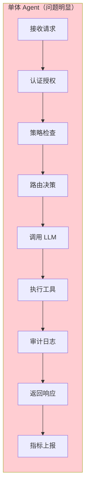
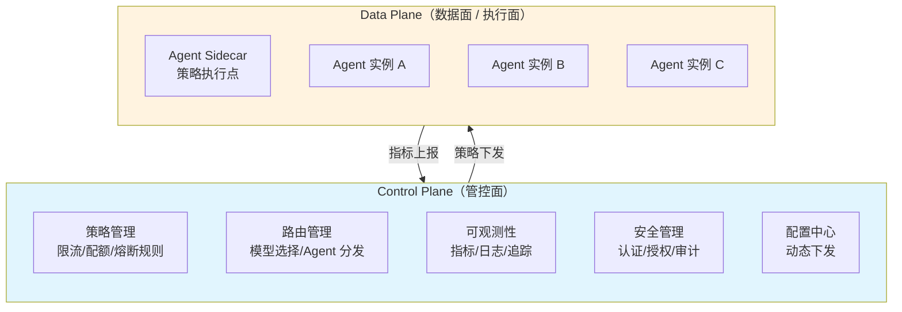
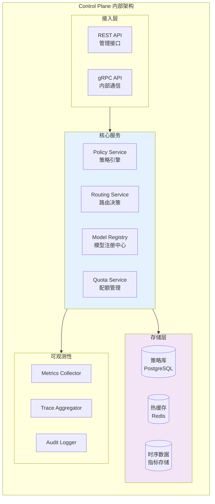
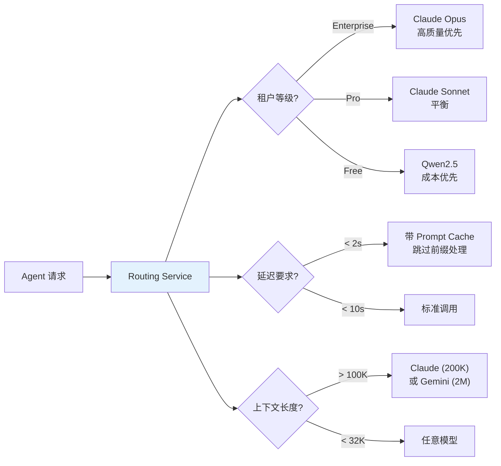
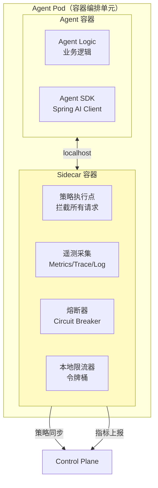
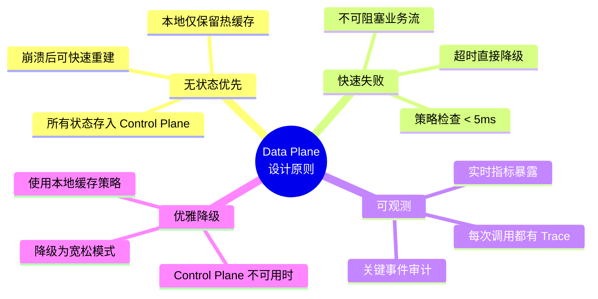
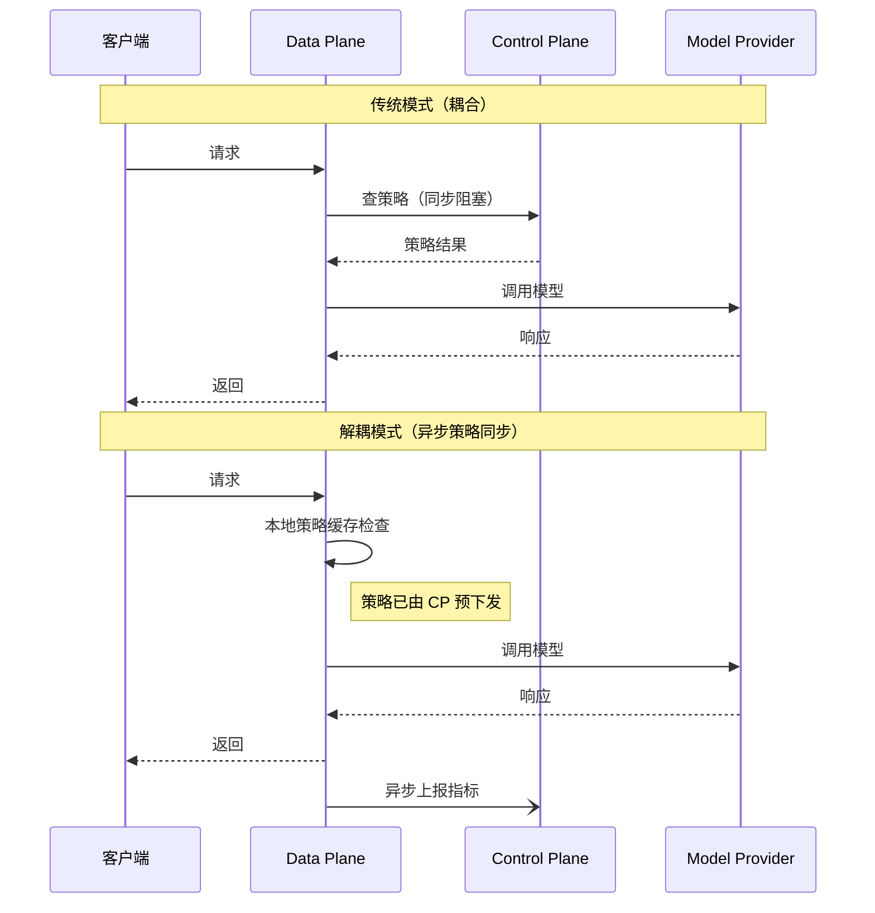
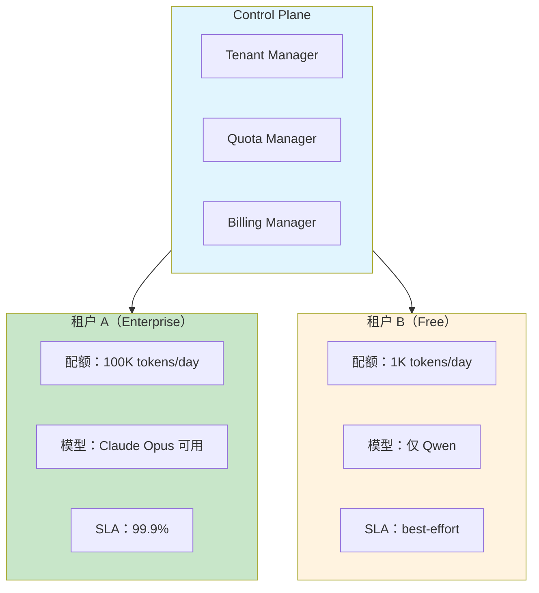
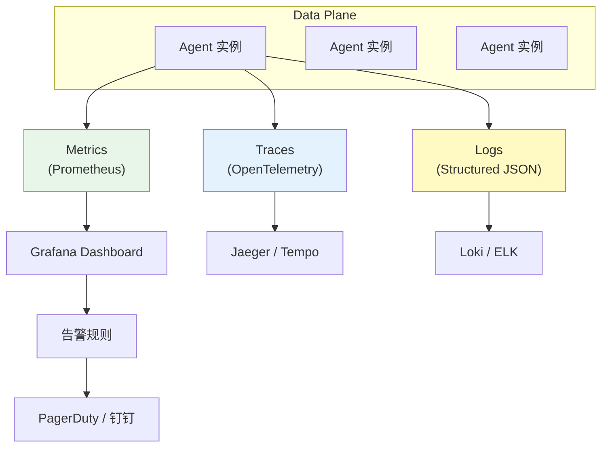
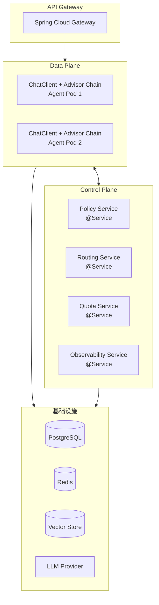

# Control Plane 设计模式：Agent 系统的管控分离架构

> 「本文是对 [教程 20-管控分离] 的深入展开」

> **定位**：系统讲解 Agent 系统中 Control Plane（管控面）与 Data Plane（数据面/执行面）的分离设计——架构职责划分、控制流与数据流的解耦、策略下发机制、以及 Spring AI 2.0 中的实现模式。
>
> **读者画像**：正在设计多 Agent 编排系统或需要为 Agent 系统添加治理层（限流、审计、策略执行）的架构师。

---

## 1. 为什么 Agent 系统需要管控分离

### 1.1 单体 Agent 的问题

初学者构建的 Agent 系统通常是一个"大泥球"——所有逻辑混在一起：



问题清单：

- **无法独立扩缩容**：LLM 调用瓶颈和审计日志瓶颈绑在一起
- **策略变更需要重新部署**：修改限流规则需要修改业务代码
- **测试困难**：无法单独测试策略执行逻辑
- **多团队协作冲突**：安全团队、业务团队、平台团队修改同一个代码库

### 1.2 管控分离的核心思想

借鉴网络设备（SDN）和服务网格（Istio）的成熟经验，将 Agent 系统拆分为两个平面：



| 维度 | Control Plane | Data Plane |
|------|--------------|------------|
| 职责 | 决策"应该做什么" | 执行"具体怎么做" |
| 变更频率 | 高（策略经常调整） | 低（执行逻辑稳定） |
| 状态 | 有状态（存储策略、指标） | 尽量无状态 |
| 部署密度 | 少量实例（1-3 个） | 大量实例（按负载扩缩） |
| 延迟要求 | 秒级可接受 | 毫秒级关键路径 |

---

## 2. Control Plane 的核心组件

### 2.1 组件全景



### 2.2 Policy Service：策略引擎

策略引擎是 Control Plane 的核心——它定义"什么操作在什么条件下被允许"：

```java
@Service
public class PolicyService {

    private final PolicyRepository policyRepo;
    private final RedisTemplate<String, Policy> policyCache;

    /**
     * 评估请求是否满足策略。
     * @return Allow / Deny / RateLimit / RequireApproval
     */
    public PolicyDecision evaluate(AgentRequest request) {
        List<Policy> policies = policyRepo.findByAgentAndAction(
            request.getAgentId(), request.getAction());

        for (Policy policy : policies) {
            PolicyResult result = policy.evaluate(request);
            switch (result.getDecision()) {
                case DENY -> {
                    auditLog.recordDenial(request, policy);
                    return PolicyDecision.deny(result.getReason());
                }
                case RATE_LIMIT -> {
                    if (rateLimiter.tryAcquire(request.getTenantId(), policy.getLimit())) {
                        continue;
                    }
                    return PolicyDecision.rateLimited(policy.getLimit());
                }
                case REQUIRE_APPROVAL -> {
                    return PolicyDecision.requireApproval(policy.getApprover());
                }
            }
        }
        return PolicyDecision.allow();
    }
}
```

### 2.3 Routing Service：智能路由

根据请求特征（成本预算、延迟要求、租户等级）选择最优模型或 Agent：



---

## 3. Data Plane 设计

### 3.1 Agent Sidecar 模式

借鉴 Service Mesh 的 Sidecar 模式，每个 Agent 实例旁部署一个轻量级策略执行代理：



```java
// Agent SDK 中集成的 Sidecar 客户端
@Component
public class ControlPlaneInterceptor implements Advisor {

    private final ControlPlaneClient cpClient;
    private final CircuitBreaker circuitBreaker;

    @Override
    public ChatClientResponse adviseCall(ChatClientRequest request,
                                          CallAdvisorChain chain) {
        // 1. 向 Control Plane 请求策略评估
        PolicyDecision decision = cpClient.evaluate(
            request.agentId(), request.action(), request.tenantId());

        // 2. 执行策略
        switch (decision.getType()) {
            case DENY -> throw new PolicyDeniedException(decision.getReason());
            case RATE_LIMITED -> throw new RateLimitedException(decision.getLimit());
            case REDIRECT -> request = request.mutate()
                // javap 实证：Builder 无 .model()——改模型需重建 Prompt 的 ChatOptions
                .prompt(new Prompt(request.prompt().getInstructions(),
                        OpenAiChatOptions.builder().model(decision.getTargetModel()).build()))
                .build();
        }

        // 3. 通过熔断器执行（javap 实证：链方法是 nextCall/nextStream，无 nextAround）
        return circuitBreaker.executeSupplier(() -> chain.nextCall(request));
    }
}
```

### 3.2 Data Plane 的关键设计原则



---

## 4. 控制流与数据流的解耦

### 4.1 解耦前后的对比



### 4.2 策略同步机制

Control Plane 的策略变更需要高效同步到所有 Data Plane 实例：

```java
@Service
public class PolicySyncService {

    private final PolicyRepository policyRepo;
    private final SimpMessagingTemplate websocket;

    /**
     * 策略变更时推送到所有 Data Plane 实例。
     */
    @EventListener
    public void onPolicyChanged(PolicyChangedEvent event) {
        Policy policy = policyRepo.findById(event.getPolicyId());

        // 方式一：WebSocket 实时推送（低延迟）
        websocket.convertAndSend("/topic/policies", policy);

        // 方式二：写入共享缓存（最终一致）
        redisTemplate.opsForValue().set(
            "policy:" + policy.getId(), policy, Duration.ofMinutes(5));

        // 方式三：记录变更日志（审计追溯）
        auditLog.recordPolicyChange(event);
    }
}
```

---

## 5. 多租户治理

### 5.1 租户隔离模型



### 5.2 配额执行链

```java
@Component
public class QuotaEnforcementAdvisor implements CallAdvisor {

    private final QuotaService quotaService;

    @Override
    public ChatClientResponse adviseCall(ChatClientRequest request,
                                          CallAdvisorChain chain) {
        String tenantId = (String) request.context().get("tenantId");
        // javap 实证：ChatClientRequest 无 estimatedTokens()/metadata()/nextAround()——
        // 估算需自行实现（基于 request.prompt().getContents()）
        int estimatedTokens = estimateTokens(request);

        // 1. 检查配额
        if (!quotaService.tryConsume(tenantId, estimatedTokens)) {
            // 短路：直接返回 ChatClientResponse（不调用 chain）
            ChatResponse error = ChatResponse.builder()
                    .generations(List.of(new Generation(
                            new AssistantMessage("配额不足，请升级套餐或等待配额刷新"))))
                    .build();
            return ChatClientResponse.builder()
                    .chatResponse(error)
                    .context(request.context())
                    .build();
        }

        // 2. 执行请求
        ChatClientResponse response = chain.nextCall(request);

        // 3. 回补实际消耗（估算 vs 实际）——Usage.getTotalTokens()（javap 实证）
        Usage usage = response.chatResponse().getMetadata().getUsage();
        if (usage != null) {
            quotaService.adjust(tenantId, estimatedTokens, usage.getTotalTokens());
        }

        return response;
    }

    private int estimateTokens(ChatClientRequest request) {
        return estimate(request.prompt().getContents());  // 业务自实现
    }

    @Override
    public String getName() { return "QuotaEnforcementAdvisor"; }
}
}
```

---

## 6. 可观测性架构

### 6.1 三支柱统一



### 6.2 关键指标

| 指标 | 类型 | 说明 |
|------|------|------|
| `agent.request.total` | Counter | 请求总数 |
| `agent.request.duration` | Histogram | 请求延迟分布 |
| `agent.token.consumed` | Counter | Token 消耗总量 |
| `agent.policy.denied` | Counter | 策略拒绝次数 |
| `agent.model.error_rate` | Gauge | 模型调用错误率 |
| `agent.circuit.state` | Gauge | 熔断器状态（0=关闭, 1=打开） |

---

## 7. 参考架构：Spring AI 2.0 实现



---

## 8. 总结

Control Plane 设计模式是 Agent 系统从"能跑"走向"企业级可治理"的关键架构升级。本文核心要点：

1. **管控分离的本质**——将"决策"（策略、路由、配额）与"执行"（LLM 调用、工具执行）解耦，各自独立演进和扩缩容。
2. **Control Plane 四大核心服务**——策略引擎（Policy Service）、路由服务（Routing Service）、模型注册中心（Model Registry）、配额服务（Quota Service）。
3. **Data Plane 设计原则**——无状态优先、快速失败（< 5ms 策略检查）、优雅降级（CP 不可用时用本地缓存）。
4. **策略同步机制**——WebSocket 实时推送 + Redis 缓存 + 审计日志，保证最终一致性。
5. **多租户隔离**——通过配额管理和模型路由，实现不同租户等级的资源隔离和差异化服务。
6. **可观测性三支柱**——Metrics（指标监控）、Traces（分布式追踪）、Logs（结构化日志）统一采集，支持全链路审计。

在 [教程 20-管控分离] 中，这些架构模式被应用于具体的 Agent 编排场景，本文提供了设计原则和组件级实现的完整蓝图。
