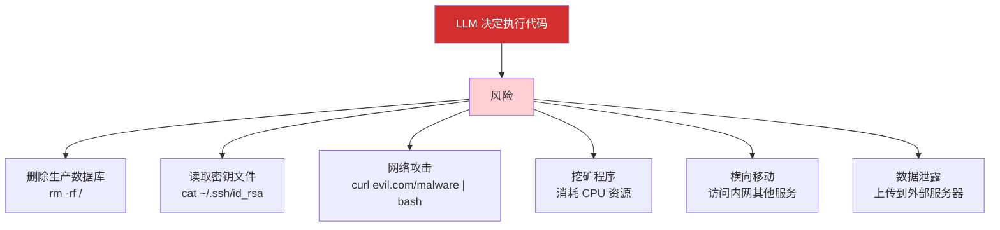
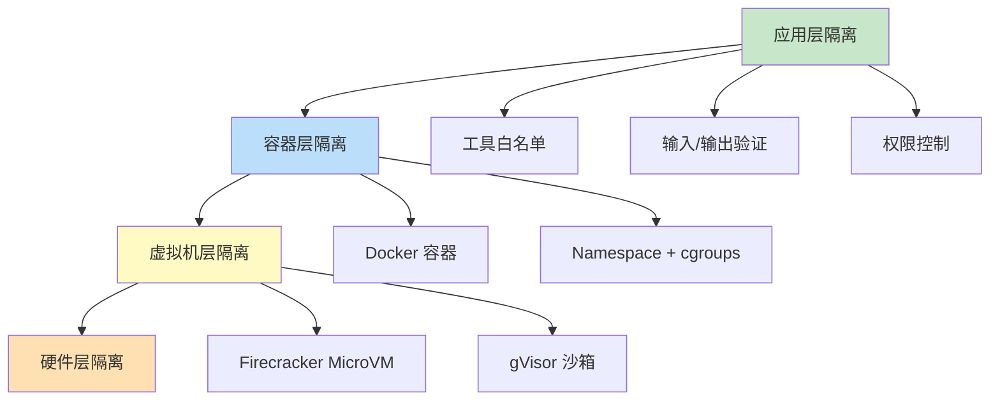
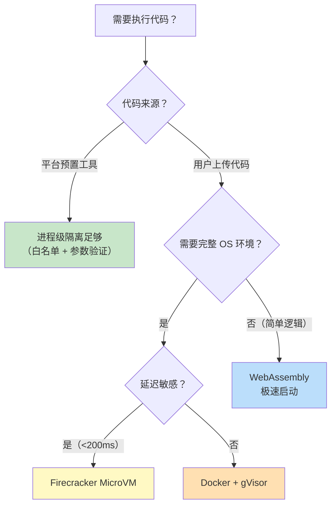
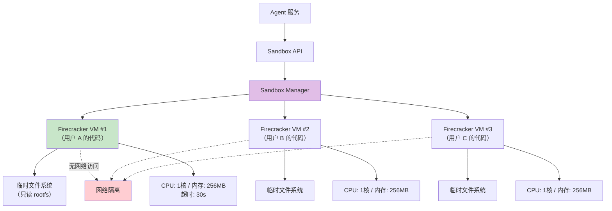
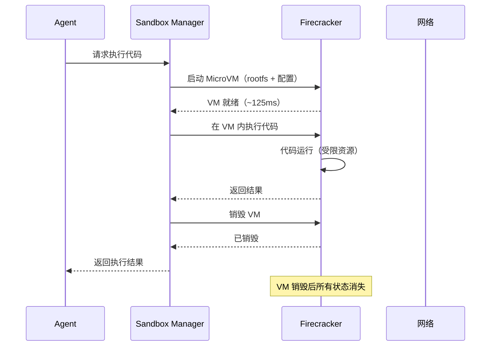
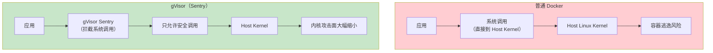
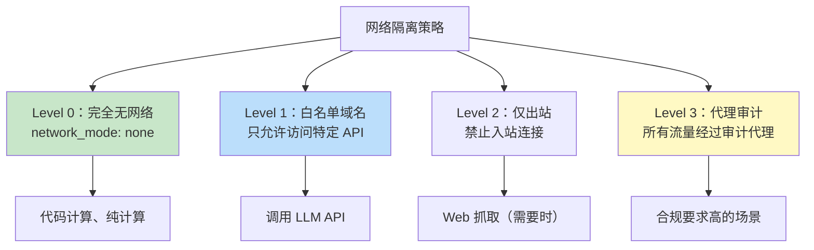
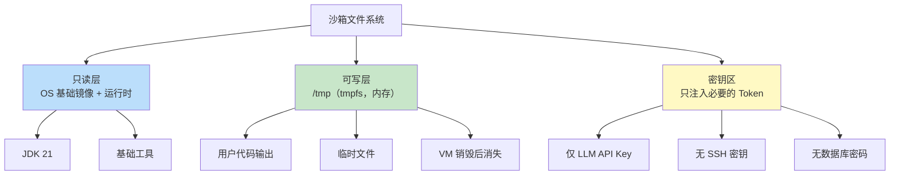
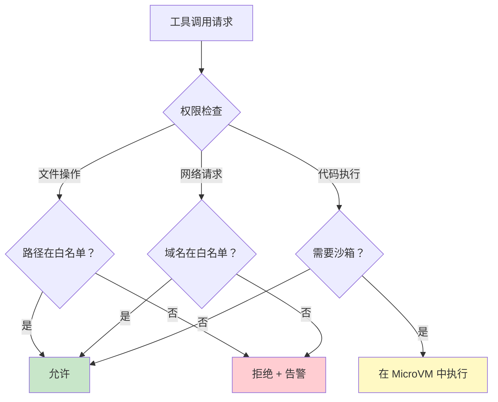

# Agent 沙箱与隔离机制

> 「本文是对 [教程 03-React前端与AgenticUI/02-React与SSE流式UI §2-§5] 的深入展开」

> **定位**：系统讲解 Agent 执行环境的隔离架构——容器沙箱、gVisor/Firecracker 轻量级虚拟化、工具执行隔离、网络隔离、文件系统隔离，以及在多租户 Agent 平台中如何安全地让 LLM 执行任意代码。
>
> **读者画像**：需要让 Agent 执行用户代码（代码执行、数据分析、脚本运行）的平台架构师和安全工程师。

---

## 1. 为什么 Agent 需要沙箱

### 1.1 危险场景



### 1.2 隔离层次模型



---

## 2. 隔离技术对比

### 2.1 技术选型矩阵

| 技术 | 隔离强度 | 启动时间 | 资源开销 | 适用场景 |
|------|---------|---------|---------|---------|
| 进程级隔离 | 弱 | ~ms | 极低 | 可信代码 |
| Docker 容器 | 中 | ~100ms | 低 | 已知工具 |
| gVisor | 强 | ~200ms | 中 | 不信任代码 |
| Firecracker MicroVM | 极强 | ~125ms | 中低 | 用户代码执行 |
| 独立 VM | 最强 | ~10s | 高 | 最高安全要求 |
| WebAssembly | 强 | ~ms | 极低 | 轻量级沙箱 |

### 2.2 决策树



---

## 3. Firecracker MicroVM 方案

### 3.1 架构



### 3.2 沙箱生命周期



### 3.3 Java 实现

```java
@Service
public class FirecrackerSandboxService implements CodeExecutionSandbox {

    private final FirecrackerClient fcClient;
    private final SandboxConfig config;

    @Override
    public Mono<ExecutionResult> execute(ExecutionRequest request) {
        return Mono.fromCallable(() -> {
            // 1. 创建 VM 配置
            VmConfig vmConfig = VmConfig.builder()
                .kernelImage(config.getKernelPath())
                .rootfsImage(createEphemeralRootfs(request))
                .vcpuCount(1)
                .memSizeMib(256)
                .networkInterface(null) // 无网络
                .build();

            // 2. 启动 VM
            String vmId = fcClient.createVm(vmConfig);

            // 3. 执行代码
            try {
                ExecutionResult result = fcClient.executeInVm(vmId,
                    request.code(), request.language(),
                    Duration.ofSeconds(30)); // 超时

                return result;
            } finally {
                // 4. 无论成功/失败，销毁 VM
                fcClient.destroyVm(vmId);
            }
        }).subscribeOn(Schedulers.boundedElastic());
    }

    private Path createEphemeralRootfs(ExecutionRequest request) throws IOException {
        // 基于 base rootfs 复制，加入用户代码
        Path ephemeral = Files.createTempFile("sandbox-", ".ext4");
        Files.copy(config.getBaseRootfsPath(), ephemeral,
            StandardCopyOption.REPLACE_EXISTING);

        // 将用户代码注入 rootfs
        injectCode(ephemeral, request.code(), request.language());

        return ephemeral;
    }
}
```

---

## 4. Docker + gVisor 方案

### 4.1 gVisor 的优势



### 4.2 Docker Compose 配置

```yaml
# docker-compose.yml
services:
  code-sandbox:
    image: openjdk:21-slim
    runtime: runsc  # gVisor 运行时
    security_opt:
      - no-new-privileges:true
    cap_drop:
      - ALL
    cap_add:
      - NET_BIND_SERVICE
    read_only: true
    tmpfs:
      - /tmp:size=64M
    mem_limit: 256m
    cpus: 1.0
    network_mode: none  # 无网络
    environment:
      - TIMEOUT=30
```

### 4.3 Java 沙箱执行器

```java
@Service
public class DockerSandboxService implements CodeExecutionSandbox {

    private final DockerClient dockerClient;

    @Override
    public Mono<ExecutionResult> execute(ExecutionRequest request) {
        return Mono.fromCallable(() -> {
            // 1. 创建容器
            String containerId = dockerClient.createContainer(
                ContainerConfig.builder()
                    .image("sandbox-java-21:latest")
                    .runtime("runsc")           // gVisor
                    .networkDisabled(true)       // 无网络
                    .memory(256L * 1024 * 1024)  // 256MB
                    .cpuQuota(100000L)           // 1 CPU
                    .readOnlyRootFs(true)        // 只读文件系统
                    .tmpFs(Map.of("/tmp", "size=64m"))
                    .command("java", "-jar", "/app/runner.jar")
                    .build()
            );

            // 2. 复制代码到容器
            dockerClient.copyToContainer(containerId,
                request.code().getBytes(), "/app/UserCode.java");

            // 3. 启动并等待
            dockerClient.startContainer(containerId);

            // 4. 等待完成（带超时）
            int exitCode = dockerClient.waitContainer(containerId,
                Duration.ofSeconds(30));

            // 5. 获取输出
            String stdout = dockerClient.getContainerLogs(containerId, true);
            String stderr = dockerClient.getContainerLogs(containerId, false);

            // 6. 清理
            dockerClient.removeContainer(containerId);

            return new ExecutionResult(exitCode, stdout, stderr);
        }).subscribeOn(Schedulers.boundedElastic());
    }
}
```

---

## 5. 网络隔离

### 5.1 网络策略层级



### 5.2 白名单代理

```java
@Component
public class EgressProxy {

    private static final Set<String> ALLOWED_DOMAINS = Set.of(
        "api.openai.com",
        "api.anthropic.com",
        "internal-llm-gateway.company.com"
    );

    public HttpResponse forward(HttpRequest request) {
        String host = request.uri().getHost();

        if (!ALLOWED_DOMAINS.contains(host)) {
            log.warn("网络访问被拒绝：{}", host);
            throw new SecurityException("域名不在白名单：" + host);
        }

        // 审计日志
        auditLog.record("egress", host, request.uri().getPath());

        return httpClient.send(request);
    }
}
```

---

## 6. 文件系统隔离

### 6.1 只读 RootFS + 临时写入区



---

## 7. 工具执行隔离

### 7.1 工具权限矩阵

```java
public class ToolPermissionMatrix {

    // 每个工具的权限定义
    public static final Map<String, ToolPermission> PERMISSIONS = Map.of(
        "readFile", new ToolPermission(
            FileSystemAccess.readOnly("/data/public/"),
            NetworkAccess.none(),
            ExecutionAccess.none()
        ),
        "writeFile", new ToolPermission(
            FileSystemAccess.readWrite("/data/output/"),
            NetworkAccess.none(),
            ExecutionAccess.none()
        ),
        "executeCode", new ToolPermission(
            FileSystemAccess.readWrite("/sandbox/"),
            NetworkAccess.whitelist(Set.of("api.openai.com")),
            ExecutionAccess.sandboxed()  // 在 MicroVM 中执行
        ),
        "httpGet", new ToolPermission(
            FileSystemAccess.none(),
            NetworkAccess.whitelist(Set.of("api.openai.com")),
            ExecutionAccess.none()
        )
    );
}
```



---

## 8. 资源限制

### 8.1 cgroups 限制

```java
public class ResourceLimits {
    public static final ResourceLimits DEFAULT = new ResourceLimits(
        cpuShares: 1024,        // 相当于 1 CPU
        memoryLimitBytes: 256L * 1024 * 1024, // 256MB
        pidLimit: 50,           // 最大进程数
        fileDescriptorLimit: 100,
        executionTimeout: Duration.ofSeconds(30),
        diskWriteLimit: 50L * 1024 * 1024   // 50MB 写入上限
    );
}

// 在容器创建时应用
ContainerConfig config = ContainerConfig.builder()
    .cpuShares(limits.cpuShares())
    .memory(limits.memoryLimitBytes())
    .pidsLimit(limits.pidLimit())
    .build();
```

### 8.2 超时与熔断

```java
@Component
public class SandboxExecutor {

    public Mono<ExecutionResult> executeWithTimeout(
            ExecutionRequest request, Duration timeout) {

        return sandboxService.execute(request)
            .timeout(timeout)
            .onErrorResume(TimeoutException.class, e ->
                Mono.just(ExecutionResult.timeout("执行超时（" + timeout.toSeconds() + "s）")))
            .onErrorResume(ResourceExhaustedException.class, e ->
                Mono.just(ExecutionResult.resourceExhausted("内存/CPU 超限")));
    }
}
```

---

## 9. 审计与追踪

### 9.1 全链路审计

```java
@Entity
@Table(name = "sandbox_audit_log")
public class SandboxAuditLog {

    @Id @GeneratedValue
    private Long id;

    private String sandboxId;       // 沙箱实例 ID
    private String userId;
    private String tenantId;
    private String agentId;

    private String action;          // execute_code / read_file / network_request
    private String input;           // 输入摘要
    private String output;          // 输出摘要
    private String result;          // success / denied / error / timeout

    private Duration executionTime;
    private Long tokensUsed;
    private Instant timestamp;
}
```

### 9.2 异常行为检测

```java
@Component
public class AnomalyDetector {

    public void check(SandboxAuditLog log) {
        // 检测异常模式
        if (isHighFrequencyAction(log.userId(), log.action(), Duration.ofSeconds(10), 20)) {
            alert("异常高频操作: " + log.action());
        }

        if (isAccessingSensitivePath(log.input())) {
            alert("敏感路径访问: " + log.input());
        }

        if (isLargeOutput(log.output())) {
            alert("大量数据输出，可能数据泄露");
        }
    }
}
```

---

## 10. 总结

Agent 沙箱是"让 LLM 执行代码"这一需求的**安全底线**：

1. **Firecracker MicroVM 是最优选择**——125ms 启动、强隔离、AWS 生产验证。
2. **Docker + gVisor 是次优选择**——适合延迟不敏感的场景。
3. **网络隔离是重中之重**——默认无网络，白名单按需开放。
4. **文件系统只读 + 临时区**——防止持久化恶意代码。
5. **资源限制防止挖矿/DoS**——CPU、内存、PID、超时全面限制。
6. **全链路审计**——所有操作可追溯、可告警。

隔离的哲学是**默认拒绝一切，按需最小授权**——宁可牺牲一些灵活性，也不给安全留下死角。
