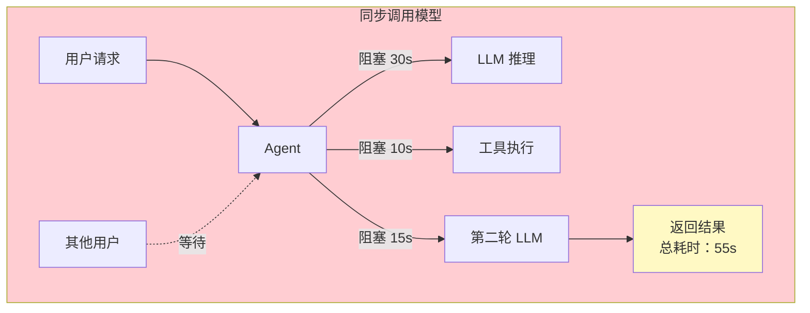
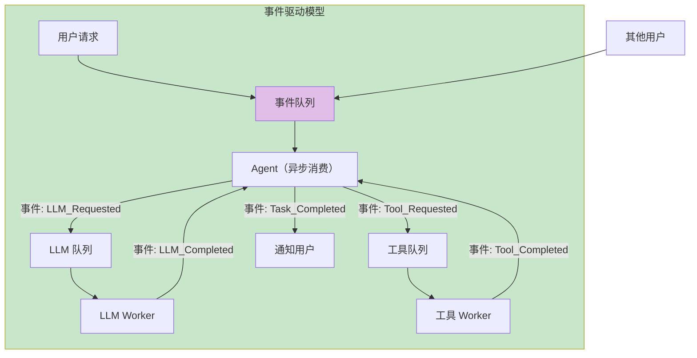
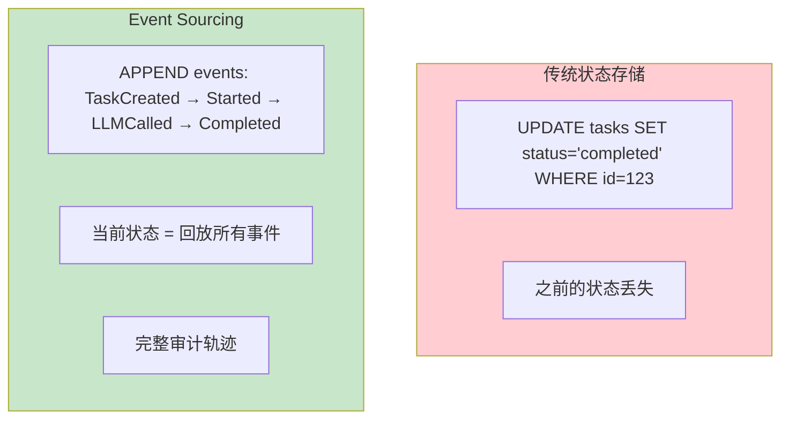
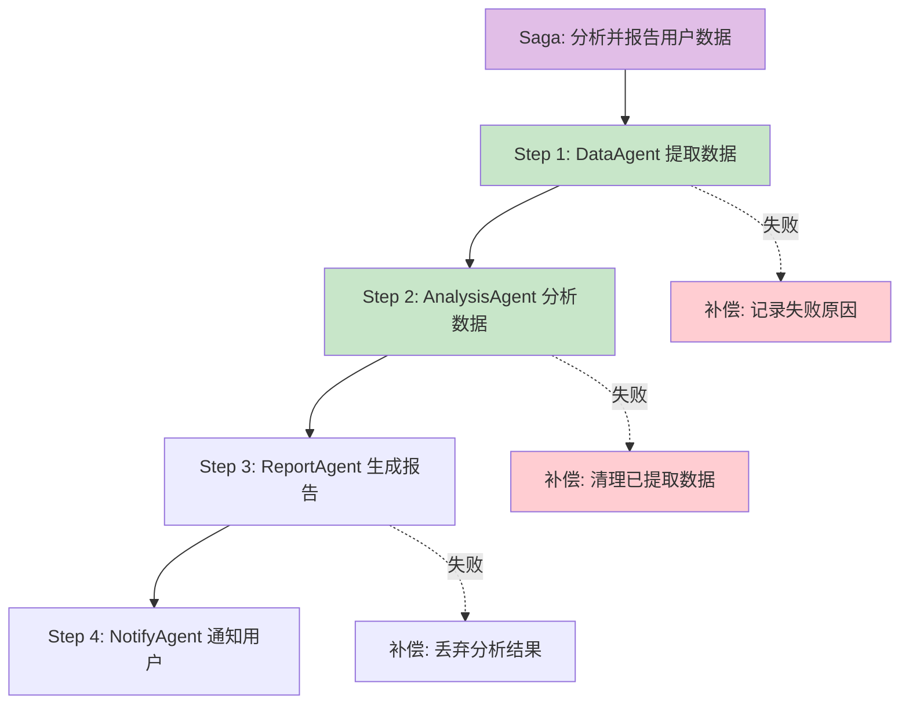
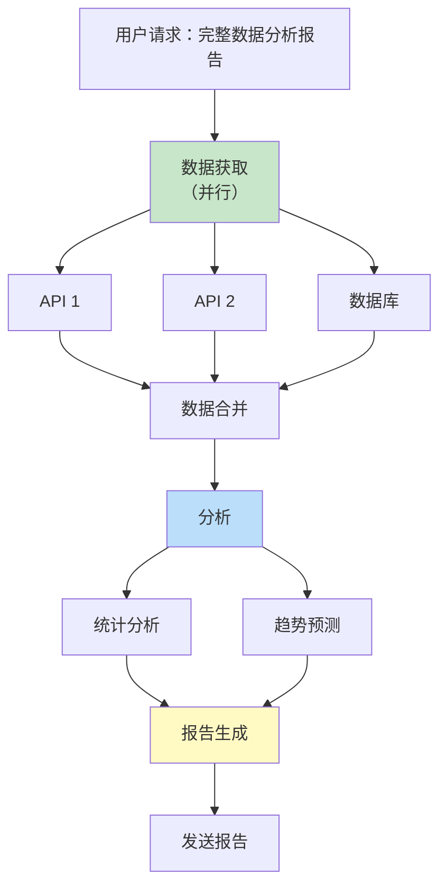
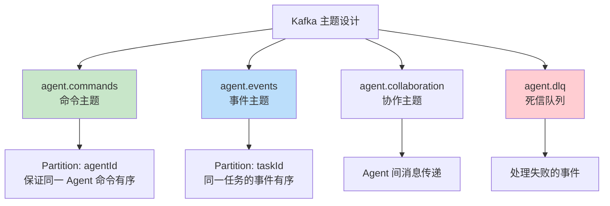
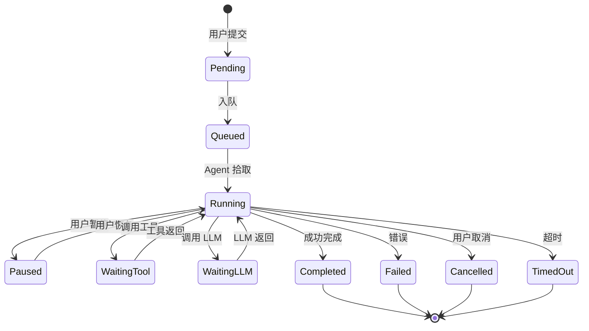
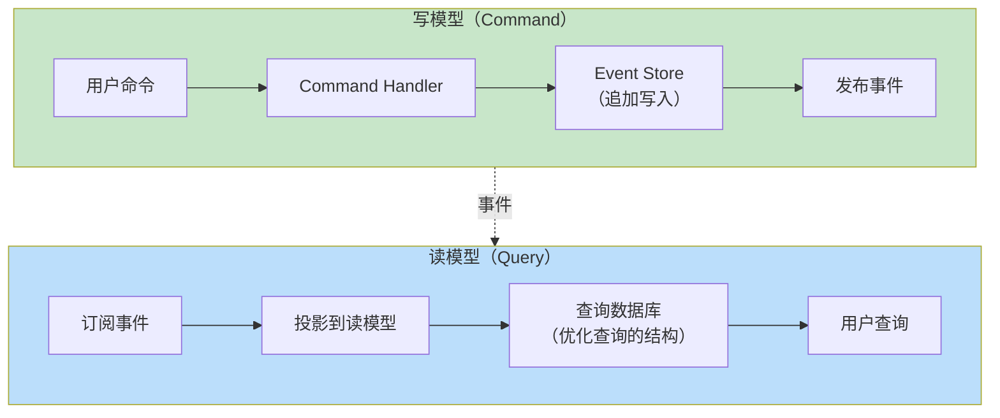

# 事件驱动 Agent 架构

> 「本文是对 [教程 30-微服务拆分与Agent部署 §2-§5] 的深入展开；Kafka 中间件层机制（生产者/消费者/事务/存储/运维）全面下钻见 [教程 67-Kafka全景与核心概念]」

> **定位**：系统讲解事件驱动架构（EDA）在 Agent 系统中的应用——Event Sourcing、Saga 模式、异步任务编排、多 Agent 通信，以及 Spring Boot + Kafka/RabbitMQ 的实现方案。
>
> **读者画像**：正在设计多 Agent 协作系统或长耗时 Agent 任务的架构师，需要理解事件驱动模型如何解决同步调用的瓶颈。

---

## 1. 为什么 Agent 需要事件驱动

### 1.1 同步调用的瓶颈



**问题**：
- 单个请求耗时 30s-5min
- 线程/连接被长时间占用
- 无法取消、无法重试、无法并行
- 多 Agent 协作时延迟叠加

### 1.2 事件驱动的优势



---

## 2. 核心模式

### 2.1 Agent 事件分类

```mermaid
graph TB
    EVENTS["Agent 事件类型"]

    EVENTS --> LIFECYCLE["生命周期事件"]
    LIFECYCLE --> L1["TaskCreated"]
    LIFECYCLE --> L2["TaskStarted"]
    LIFECYCLE --> L3["TaskCompleted"]
    LIFECYCLE --> L4["TaskFailed"]
    LIFECYCLE --> L5["TaskCancelled"]

    EVENTS --> EXECUTION["执行事件"]
    EXECUTION --> E1["LLMCallRequested"]
    EXECUTION --> E2["LLMCallCompleted"]
    EXECUTION --> E3["ToolCallRequested"]
    EXECUTION --> E4["ToolCallCompleted"]

    EVENTS --> COLLAB["协作事件"]
    COLLAB --> C1["AgentMessageSent"]
    COLLAB --> C2["AgentMessageReceived"]
    COLLAB --> C3["TaskDelegated"]
    COLLAB --> C4["TaskDelegationAccepted"]

    EVENTS --> OBSERVABILITY["可观测性事件"]
    OBSERVABILITY --> O1["TokenUsageRecorded"]
    OBSERVABILITY --> O2["LatencyMeasured"]
    OBSERVABILITY --> O3["ErrorOccurred"]

    style LIFECYCLE fill:#c8e6c9
    style EXECUTION fill:#bbdefb
    style COLLAB fill:#fff9c4
    style OBSERVABILITY fill:#ffe0b2
```



### 2.2 事件结构

```java
public abstract class AgentEvent {
    private String eventId;          // UUID
    private String taskId;           // 任务 ID
    private String agentId;          // Agent ID
    private String tenantId;         // 租户 ID
    private Instant timestamp;       // 时间戳
    private int version;             // 事件版本（兼容性）
    private Map<String, String> metadata; // 追踪信息
}

public record TaskCreatedEvent(
    String eventId, String taskId, String agentId,
    String tenantId, Instant timestamp,
    String userId, String userInput,
    TaskPriority priority,
    Map<String, String> metadata
) extends AgentEvent {}

public record LLMCallCompletedEvent(
    String eventId, String taskId, String agentId,
    String tenantId, Instant timestamp,
    String responseId,
    int promptTokens, int completionTokens,
    long latencyMs,
    String modelUsed,
    Map<String, String> metadata
) extends AgentEvent {}
```

---

## 3. Event Sourcing

### 3.1 核心思想

不存储当前状态，而是存储**所有状态变更事件**。当前状态通过回放事件得到。



### 3.2 任务状态重建

```java
@Entity
@Table(name = "agent_events")
public class AgentEventEntity {
    @Id @GeneratedValue
    private Long id;
    private String taskId;
    private String eventType;
    private String eventData;     // JSON
    private Instant timestamp;
    private Long sequenceNumber;  // 顺序号
}

@Service
public class TaskStateReconstructor {

    public TaskState reconstruct(String taskId) {
        List<AgentEventEntity> events = eventRepository
            .findByTaskIdOrderBySequenceNumberAsc(taskId);

        TaskState state = TaskState.initial();
        for (AgentEventEntity event : events) {
            state = apply(state, deserialize(event));
        }
        return state;
    }

    private TaskState apply(TaskState state, AgentEvent event) {
        return switch (event) {
            case TaskCreatedEvent e -> state.withStatus(Status.CREATED)
                                            .withInput(e.userInput());
            case TaskStartedEvent e -> state.withStatus(Status.RUNNING)
                                            .withStartedAt(e.timestamp());
            case LLMCallCompletedEvent e -> state.addTokenUsage(
                                            e.promptTokens() + e.completionTokens());
            case TaskCompletedEvent e -> state.withStatus(Status.COMPLETED)
                                            .withResult(e.result());
            case TaskFailedEvent e -> state.withStatus(Status.FAILED)
                                          .withError(e.errorMessage());
            default -> state;
        };
    }
}
```

### 3.3 Snapshot 优化

```java
// 每 100 个事件存一个快照，避免全量回放
@Entity
@Table(name = "task_snapshots")
public class TaskSnapshot {
    @Id
    private String taskId;
    private Long atSequenceNumber;
    private String stateJson;  // 序列化的 TaskState
    private Instant createdAt;
}

public TaskState reconstruct(String taskId) {
    // 1. 找到最近的快照
    Optional<TaskSnapshot> snapshot = snapshotRepository
        .findLatestByTaskId(taskId);

    TaskState state;
    long fromSequence;
    if (snapshot.isPresent()) {
        state = deserialize(snapshot.get().getStateJson());
        fromSequence = snapshot.get().getAtSequenceNumber();
    } else {
        state = TaskState.initial();
        fromSequence = 0;
    }

    // 2. 只回放快照之后的事件
    List<AgentEventEntity> events = eventRepository
        .findByTaskIdAndSequenceNumberAfter(taskId, fromSequence);

    for (AgentEventEntity event : events) {
        state = apply(state, deserialize(event));
    }

    return state;
}
```

---

## 4. Saga 模式

### 4.1 多 Agent 协作的分布式事务



### 4.2 编排式 Saga

```java
@Service
public class DataAnalysisSaga {

    private final EventPublisher eventPublisher;

    public Mono<Void> execute(SagaRequest request) {
        String sagaId = UUID.randomUUID().toString();

        // 启动 Saga
        eventPublisher.publish(new SagaStartedEvent(sagaId, request));

        return Flux.just(
            new SagaStep("extract-data", "data-agent",
                new ExtractDataCommand(request.dataSource())),
            new SagaStep("analyze", "analysis-agent",
                new AnalyzeCommand()),
            new SagaStep("report", "report-agent",
                new GenerateReportCommand()),
            new SagaStep("notify", "notify-agent",
                new NotifyCommand(request.userId()))
        )
        .concatMap(step -> executeStep(sagaId, step))
        .then()
        .doOnSuccess(v -> eventPublisher.publish(new SagaCompletedEvent(sagaId)))
        .doOnError(e -> eventPublisher.publish(new SagaFailedEvent(sagaId, e.getMessage())));
    }

    private Mono<Void> executeStep(String sagaId, SagaStep step) {
        return agentClient.sendCommand(step.agentId(), step.command())
            .timeout(Duration.ofMinutes(5))
            .flatMap(response -> {
                if (response.success()) {
                    eventPublisher.publish(new SagaStepCompletedEvent(sagaId, step.name()));
                    return Mono.empty();
                } else {
                    eventPublisher.publish(new SagaStepFailedEvent(sagaId, step.name()));
                    return Mono.error(new SagaStepException(step.name(), response.error()));
                }
            });
    }
}
```

### 4.3 补偿事务

```java
@Service
public class SagaCompensator {

    public void compensate(String sagaId, String failedStep) {
        // 获取已完成的步骤（逆序）
        List<SagaStep> completedSteps = getSagaSteps(sagaId).stream()
            .takeWhile(step -> !step.name().equals(failedStep))
            .sorted(Comparator.reverseOrder())
            .toList();

        // 逆序执行补偿
        for (SagaStep step : completedSteps) {
            CompensationCommand comp = getCompensation(step);
            try {
                agentClient.sendCommand(step.agentId(), comp)
                    .block(Duration.ofMinutes(2));
                log.info("补偿成功: {}", step.name());
            } catch (Exception e) {
                log.error("补偿失败: {}", step.name(), e);
                // 补偿失败需要人工介入
                alertService.send("Saga 补偿失败: " + sagaId);
            }
        }
    }
}
```

---

## 5. 异步任务编排

### 5.1 DAG 任务图



### 5.2 实现

```java
@Service
public class DAGTaskOrchestrator {

    public Mono<TaskResult> execute(TaskGraph graph) {
        return Mono.create(sink -> {
            Map<String, TaskNodeState> states = new ConcurrentHashMap<>();
            AtomicInteger remainingTasks = new AtomicInteger(graph.totalNodes());

            // 拓扑排序 + 并行执行
            for (TaskNode node : graph.getRoots()) {
                executeNode(node, graph, states, remainingTasks, sink);
            }
        });
    }

    private void executeNode(TaskNode node, TaskGraph graph,
            Map<String, TaskNodeState> states,
            AtomicInteger remaining, MonoSink<TaskResult> sink) {

        // 等待所有依赖完成
        List<Mono<NodeResult>> deps = node.getDependencies().stream()
            .map(depId -> waitForCompletion(depId, states))
            .toList();

        Mono.zip(deps)
            .flatMap(results -> {
                // 执行当前节点
                states.put(node.getId(), TaskNodeState.running());
                return agentClient.execute(node.getAgentId(),
                    node.getCommand(), results.stream().toList());
            })
            .subscribe(result -> {
                states.put(node.getId(), TaskNodeState.completed(result));

                if (remaining.decrementAndGet() == 0) {
                    // 所有节点完成
                    sink.success(aggregateResults(states));
                }

                // 触发后继节点
                for (TaskNode successor : graph.getSuccessors(node)) {
                    if (allDependenciesMet(successor, states)) {
                        executeNode(successor, graph, states, remaining, sink);
                    }
                }
            }, error -> {
                sink.error(error);
            });
    }
}
```

---

## 6. Kafka 集成

### 6.1 主题设计



### 6.2 Spring Boot 配置

```java
@Configuration
public class KafkaConfig {

    @Bean
    public ProducerFactory<String, AgentEvent> producerFactory() {
        Map<String, Object> config = new HashMap<>();
        config.put(BOOTSTRAP_SERVERS_CONFIG, kafkaServers);
        config.put(KEY_SERIALIZER_CLASS_CONFIG, StringSerializer.class);
        config.put(VALUE_SERIALIZER_CLASS_CONFIG, JsonSerializer.class);
        return new DefaultKafkaProducerFactory<>(config);
    }

    @Bean
    public KafkaTemplate<String, AgentEvent> kafkaTemplate() {
        return new KafkaTemplate<>(producerFactory());
    }
}

@Service
public class KafkaEventPublisher implements EventPublisher {

    private final KafkaTemplate<String, AgentEvent> kafka;

    @Override
    public void publish(AgentEvent event) {
        kafka.send("agent.events", event.taskId(), event);
    }
}

@Component
public class AgentEventConsumer {

    @KafkaListener(topics = "agent.commands", groupId = "${agent.id}")
    public void handleCommand(AgentCommand command) {
        // 处理命令
        commandHandler.handle(command)
            .subscribe(
                result -> eventPublisher.publish(result),
                error -> eventPublisher.publish(new ErrorEvent(error))
            );
    }
}
```

---

## 7. 长耗时任务管理

### 7.1 任务状态机



### 7.2 任务恢复

```java
@Service
public class TaskRecoveryService {

    /**
     * 系统重启后，恢复所有中断的任务
     */
    @PostConstruct
    public void recoverInterruptedTasks() {
        List<TaskState> interrupted = taskStore.findByStatusIn(
            Status.RUNNING, Status.WAITING_TOOL, Status.WAITING_LLM
        );

        for (TaskState task : interrupted) {
            // 检查是否真的中断（超时）
            if (task.updatedAt().isBefore(Instant.now().minus(Duration.ofMinutes(5)))) {
                log.info("恢复中断的任务: {}", task.taskId());
                resumeTask(task);
            }
        }
    }

    private void resumeTask(TaskState task) {
        // 通过 Event Sourcing 重建状态
        TaskState current = stateReconstructor.reconstruct(task.taskId());

        // 从中断点继续
        if (current.status() == Status.WAITING_LLM) {
            // 重新发起 LLM 调用
            eventPublisher.publish(new LLMCallRequestedEvent(
                current.taskId(), current.lastPrompt()
            ));
        }
    }
}
```

---

## 8. CQRS 模式

### 8.1 读写分离



```java
// 写模型：命令处理
@Service
public class TaskCommandHandler {

    public Mono<Void> handle(StartTaskCommand cmd) {
        // 1. 验证
        // 2. 生成事件
        TaskStartedEvent event = new TaskStartedEvent(
            UUID.randomUUID().toString(),
            cmd.taskId(), cmd.agentId(), cmd.tenantId(),
            Instant.now(), cmd.input()
        );
        // 3. 持久化事件
        return eventStore.append(event)
            .then(eventPublisher.publish(event).then());
    }
}

// 读模型：投影
@Service
public class TaskProjection {

    @KafkaListener(topics = "agent.events")
    public void project(AgentEvent event) {
        switch (event) {
            case TaskStartedEvent e ->
                queryRepository.save(new TaskView(
                    e.taskId(), e.agentId(), "RUNNING",
                    e.timestamp(), null, null
                ));
            case TaskCompletedEvent e -> {
                TaskView view = queryRepository.findById(e.taskId()).orElseThrow();
                view.setStatus("COMPLETED");
                view.setCompletedAt(e.timestamp());
                queryRepository.save(view);
            }
            // ...
        }
    }
}
```

---

## 9. 总结

事件驱动架构是复杂 Agent 系统的**核心架构选择**：

1. **事件驱动解耦**——Agent 之间通过事件通信，无直接依赖。
2. **Event Sourcing 提供完整审计**——所有状态变更可追溯。
3. **Saga 管理多 Agent 协作**——分布式事务 + 补偿机制。
4. **DAG 编排并行任务**——拓扑排序 + 并行执行 + 依赖等待。
5. **Kafka 是生产级选择**——高吞吐、持久化、分区有序。
6. **CQRS 优化读写**——写用 Event Store，读用投影视图。
7. **长耗时任务需要恢复机制**——重启后从中断点继续。

事件驱动架构的代价是**复杂度增加**——调试困难、最终一致性、需要幂等处理。但对于多 Agent 协作、长耗时任务、高吞吐场景，这是值得的权衡。
