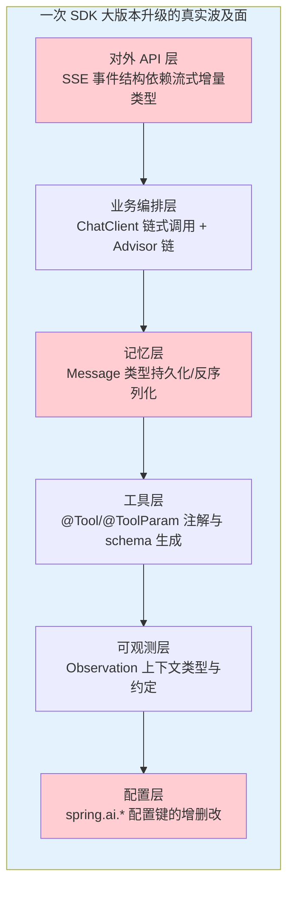
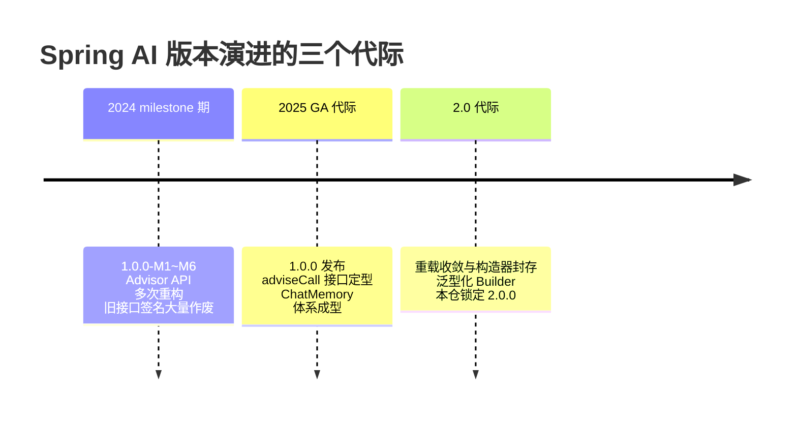
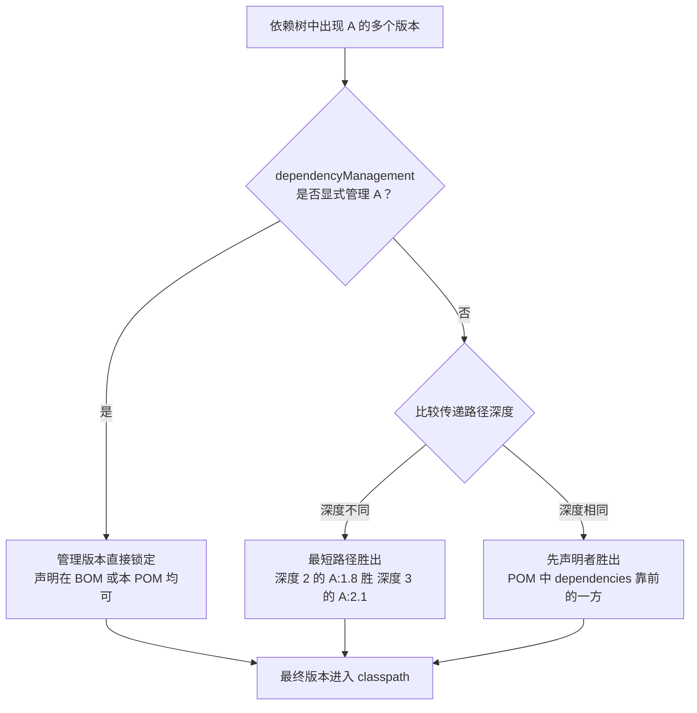
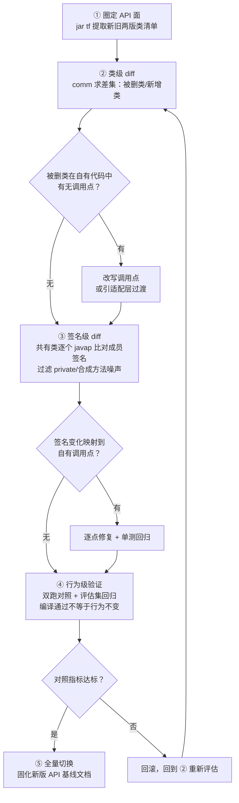
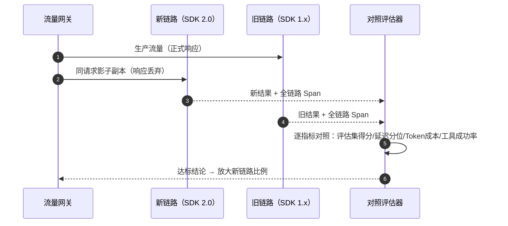
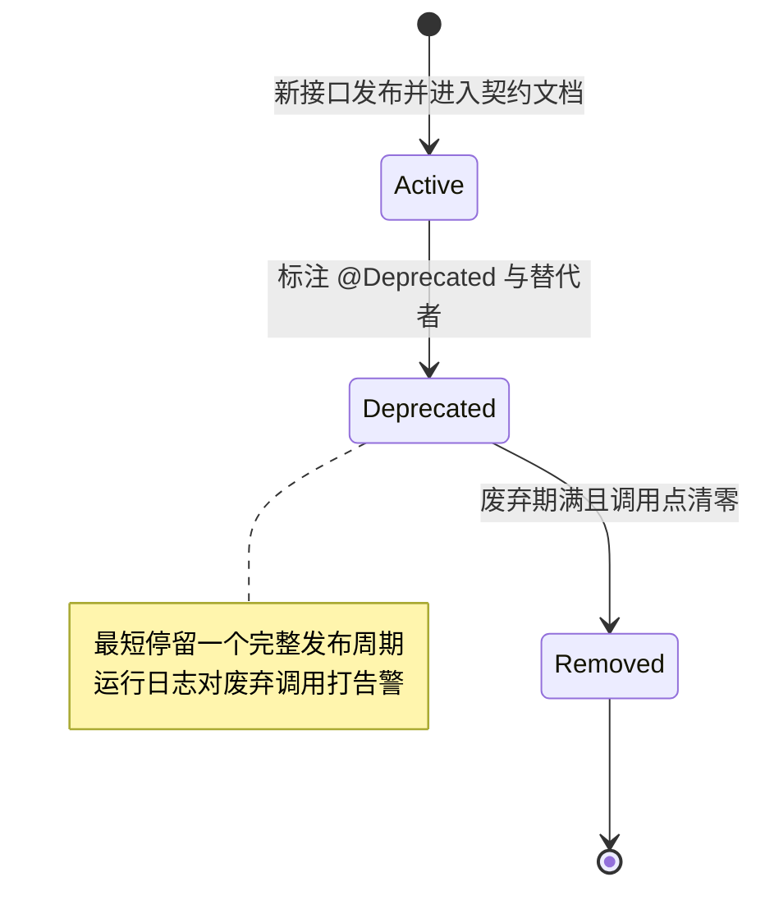

# 03-依赖与版本升级治理

> **定位**：补齐教材层的一个真空白——**依赖治理与大版本升级的工程方法论**。Agent 平台对 AI SDK 的耦合深度远超传统 Web 应用（ChatClient 链式调用、Advisor 链、Message 类型体系、`@Tool` 注解渗透业务代码），SDK 大版本升级因此从"例行维护"变成"架构级手术"。本文讲四件事：依赖树审计与 BOM 对齐（以本仓 Spring AI BOM 2.0.0 + Boot 4.1.0 为实例）、**javap 实证法产品化**（升级前对两个版本的 jar 做 API 面 diff，找出被删/改签名的方法并映射到自有调用点——本仓文档体系的全量 API 审计用的正是这套方法）、防腐层隔离 SDK 代际、双跑对照与灰度升级。最后落到自家对外 API 的 SemVer 纪律与 deprecation 生命周期。
>
> **读者画像**：负责平台长期演进的架构师与构建负责人——团队代码库已经积累了大量 Spring AI 调用点，而 `spring-ai.version` 从 1.x 升到 2.0（或未来 3.0）的那一天迟早要来。
>
> **前置阅读**：[教程 04-企业级架构主干/09-灰度发布与版本管理]（灰度发布机制）、[教程 08-架构师进阶/10-多模型协作与供应策略 §6]（模型准入闸门——模型侧的"升级门禁"，与本文 SDK 侧互为姊妹）、[附录 06-企业级架构模式/00-ControlPlane设计模式]（管控分离——本文的升级门禁就是管控面能力）。
>
> **实证声明**：文中出现的全部 Spring AI API 均已对本地 Maven 仓库 jar 反编译实证（`javap`/`jar tf`，Spring AI 1.0.0 与 2.0.0 双版本对照），实测数据见 §3.3。文中所有 1.x 签名结论均来自本地 1.0.0 jar 实测，非凭记忆转述。

---

## 1. 为什么依赖与版本升级是 Agent 平台的架构级问题

### 1.1 Agent 系统的 SDK 耦合深度

一个传统 Spring Boot Web 应用升级一个第三方 SDK，通常影响面是"某个客户端工具类被重命名"。但 Agent 平台不同——AI SDK 的类型体系渗透到了架构的每一层：



红色三层是升级中最容易漏估的：**记忆层**的 `Message` 类型若被持久化过（Redis/数据库），SDK 升级可能让旧数据反序列化失败——这是"第一次成功、第二次才炸"的经典陷阱（本仓在 2026-08 的序列化审计中实锤过：Spring AI 的 `Message` 子类字段 `private final`、无 Jackson property-based Creator，任何直接持久化 `Message` 的方案在读取侧都会失败，升级期则更容易踩中）；**配置层**的配置键会被静默改名（如 `include-prompt-content` 在 2.0 中并不存在，正确键是 `log-prompt`），升级后应用照常启动但行为悄悄变化——编译器帮不了你。

### 1.2 AI SDK 的迭代速度决定了这不是"如果"而是"何时"

以 Spring AI 为例，从 2024 年的 milestone 快速迭代期，到 2025 年 5 月 1.0.0 GA，再到 2.0.0，核心抽象在两代之内发生了实质重构。对锁定在本仓技术栈（Spring AI 2.0.0 / Boot 4.1.0）上的项目而言，下一次大版本升级的风险敞口，与 1.x→2.0 那一次同构。



### 1.3 升级的真实成本构成

大版本升级的成本不是"改几行编译错误"，而是四段之和：**风险识别成本**（哪些 API 变了、哪些调用点受影响）＋ **代码迁移成本**（逐点修复）＋ **行为验证成本**（编译通过 ≠ 行为不变，默认值变化、观察语义变化都要回归）＋ **回滚成本**（升级失败时能不能 10 分钟内退回）。本文 §3-§5 分别压降这四段成本。

---

## 2. 依赖治理基础：把版本变成可审计的资产

### 2.1 先回答一个问题：谁在管版本？

依赖治理的第一步不是看依赖列表，而是回答"每个依赖的版本是谁决定的"。Maven 中版本的决定链是：BOM（dependencyManagement import）＞ 本 POM 的 dependencyManagement 声明 ＞ 依赖调解。本仓 pom.xml 的真实结构是双层对齐：

```xml
<!-- 本仓 pom.xml 真实结构（节选） -->
<parent>
    <groupId>org.springframework.boot</groupId>
    <artifactId>spring-boot-starter-parent</artifactId>
    <version>4.1.0</version>                     <!-- 第一层：Boot BOM 管住 Spring 生态 -->
</parent>

<properties>
    <spring-ai.version>2.0.0</spring-ai.version>
</properties>

<dependencyManagement>
    <dependencies>
        <dependency>
            <groupId>org.springframework.ai</groupId>
            <artifactId>spring-ai-bom</artifactId>
            <version>${spring-ai.version}</version>
            <type>pom</type>
            <scope>import</scope>                <!-- 第二层：AI BOM 管住全部 spring-ai-* -->
        </dependency>
    </dependencies>
</dependencyManagement>
```

这套结构的价值在于**版本声明只有两处**：升级 Spring AI 时只改 `spring-ai.version` 一个属性，全部 `spring-ai-*` 模块随之联动——因为 AI BOM 在内部统一管理了生态内全部构件。对本地仓库 `spring-ai-bom-2.0.0.pom` 的实测：其 dependencyManagement 中登记了 **163 个 artifact**（从 `spring-ai-model`、`spring-ai-client-chat` 到各 vector store / document reader / autoconfigure 模块），任何一个以 `spring-ai-starter-*` 引入的 starter 拉起的传递依赖，版本都收敛在这份清单里。

**BOM 的纪律红线**：不要对 BOM 已管理的构件再手写 `<version>`。手写版本 = 在 BOM 之外开了一个"影子版本源"，BOM 升级时它不会跟着走，冲突由此而生。

### 2.2 dependency:tree 审计：版本问题的唯一真相源

任何"我觉得版本没问题"都要让位于一条命令的输出：

```bash
# 全量依赖树
mvn dependency:tree

# 只看某一家生态的分支（排查 Spring AI 冲突时）
mvn dependency:tree -Dincludes=org.springframework.ai

# 排查某个疑似重复引入的第三方库
mvn dependency:tree -Dincludes=com.fasterxml.jackson.core
```

审计要盯三件事：**同一 artifact 是否出现多个版本**（冲突）、**某依赖是谁带进来的**（传递路径，决定 §2.3 仲裁结果）、**是否有本不该出现的依赖**（比如 test 范围的库泄漏进了 compile）。对 Agent 平台再加一条：关注 Jackson、Reactor、Micrometer 这三个"共享地基"库的版本——Spring AI 的 JSON schema 生成、流式编排、Observation 全建在这三者上，它们与 Boot BOM 管理版本的任何偏离都是隐患。

### 2.3 版本冲突仲裁：Maven 的裁决规则

当依赖树中同一 artifact 出现多个版本，Maven 按固定顺序裁决。理解这个顺序，才能解释"为什么我声明的版本没生效"：



这就是"**近者胜**"的完整含义：dependencyManagement 的显式管理比一切调解优先；没有管理时，离树根更"近"（路径更短）的声明获胜；同样近时，先声明的获胜。实战含义有两条：**想让某版本稳定生效，把它放进 dependencyManagement，不要靠声明顺序赌博**；**排查"版本没生效"时，先看目标 artifact 是否真在管理范围内**——比如依赖了某个野生的 `spring-ai-xxx` 构件却不在 BOM 清单里，它自带的老版本就会一路透传进来。

### 2.4 依赖收敛门禁：用 enforcer 把审计自动化

人工审计会懈怠，冲突要靠构建门禁拦截。**以下配置需在 pom.xml 中添加依赖（`<build><plugins>` 内），本文不实际修改本仓 pom.xml**：

```xml
<!-- 需在 pom.xml 添加依赖：maven-enforcer-plugin（示例版本 3.5.0） -->
<plugin>
    <groupId>org.apache.maven.plugins</groupId>
    <artifactId>maven-enforcer-plugin</artifactId>
    <version>3.5.0</version>
    <executions>
        <execution>
            <id>enforce-dependency-convergence</id>
            <goals><goal>enforce</goal></goals>
            <phase>validate</phase>
            <configuration>
                <rules>
                    <!-- 规则一：同一 artifact 多版本共存 → 构建失败 -->
                    <dependencyConvergence/>
                    <!-- 规则二：禁止用低版本声明覆盖仲裁上界（防"降级覆盖"） -->
                    <requireUpperBoundDeps/>
                    <!-- 规则三：禁止同 artifact 在本 POM 重复声明 -->
                    <banDuplicatePomDependencyVersions/>
                </rules>
            </configuration>
        </execution>
    </executions>
</plugin>
```

三条规则各管一类事故：`dependencyConvergence` 强制所有冲突在引入时就被解决（而不是在生产 classpath 上随机仲裁）；`requireUpperBoundDeps` 禁止有人为"绕开报错"而在直接依赖里写一个更低版本——那是把冲突往后传；`banDuplicatePomDependencyVersions` 防重复声明。接入后第一次构建大概率报一批存量冲突，正确的收敛方式是**逐个在 dependencyManagement 中显式钉住期望版本**（让规则一通过），而不是加 exclusion 到处打补丁。

---

## 3. SDK 大版本升级方法论：javap 实证法

### 3.1 为什么不能只读 changelog

SDK 大版本升级的标准动作是读 release notes——但这有三个系统性盲区：**changelog 由升级方视角书写**，写的是"我们改进了 X"，不是"你调用的 `Y(...)` 签名没了"；**changelog 覆盖不到隐式契约**（构造器可见性收敛、泛型签名变化、默认值调整，这类变更常常只在一行"内部重构"里带过）；**changelog 有遗漏**，大版本的 breaking change 清单几乎从不完整。

唯一可靠的真相源是**二进制本身**。Java 的 jar 是自描述的：`jar tf` 列出全部类，`javap` 反汇编出全部成员的真实签名。对两个版本的 jar 做机械化 diff，得到的 API 面变化清单**完备且无视角偏差**——这就是本仓文档体系在 2026-08 全量 API 审计中执行并固化的方法（铁律 0："一切以本地 jar 反编译实证为准"，结论沉淀在仓库内 `scripts/api-baseline-spring-ai-2.0.0.md` 作为全体系基准）。本节把它产品化为可复用的五步闸门。

### 3.2 五步闸门



三处判定是这个闸门的灵魂。**判定一（被删类 × 调用点）**：被删类不一定伤到你——`spring-ai-model` 从 1.0.0 到 2.0.0 删了 `FunctionPromptTemplate`、`ToolExecutionEligibilityPredicate`、`SpringBeanToolCallbackResolver` 等 5 个类，如果你的代码从未 import 过它们，这类删除零成本。diff 的价值在于把"全部变化"收缩为"影响我的变化"。**判定二（签名变化 × 调用点）**：同样的收缩逻辑作用于方法级。**判定三（行为达标）**：编译通过只是门票，③ 修复后的代码跑在新版默认值、新观察语义上是否等价，必须靠行为验证兜底（§5）。

### 3.3 实测案例：Spring AI 1.0.0 → 2.0.0 的 API 面 diff

以下全部数据来自对本地 Maven 仓库三个核心构件（`spring-ai-client-chat`、`spring-ai-model`、`spring-ai-commons`）的双版本实测，执行的就是 §3.2 的 ①②③ 步。

**类级 diff（第 ①② 步产出）**：

| 构件 | 共有类 | 被删类 | 新增类 |
|------|-------|--------|--------|
| spring-ai-client-chat | 44 | 2 | 9 |
| spring-ai-model | 197 | 5 | 40 |

client-chat 侧最扎眼的删除是 `advisor/PromptChatMemoryAdvisor`（1.0.0 存在、2.0.0 整类消失，记忆注入只剩 `MessageChatMemoryAdvisor` 一条路）；新增侧则是职责进一步拆分（`advisor/api/ToolAdvisor`、`api/MemoryAdvisor`、`StructuredOutputValidationAdvisor` 等）。

**签名级 diff（第 ③ 步产出）**：241 个共有类中，**73 个（30%）的成员签名有变化**。按破坏形态分三类：

| 形态 | 实测案例（javap 实证） | 破坏性 | 修复方式 |
|------|----------------------|--------|---------|
| 成员删除 | `ChatMemory` 接口的 `DEFAULT_CONVERSATION_ID` 常量在 2.0.0 被删（`CONVERSATION_ID` 保留）；`ChatOptions.copy()` 抽象方法被删 | 编译期报错 | 逐点替换；`copy()` 的语义继任者是 `mutate()` |
| 签名/重载变化 | `ChatClient.create(ChatModel, ObservationRegistry, ChatClientObservationConvention)` 三参重载在 2.0.0 **不存在**，被四参版（追加 `AdvisorObservationConvention`）取代；`ChatOptions.builder()` 返回类型变为泛型 `ChatOptions.Builder<?>` | 编译期报错（重载消失类错误信息有迷惑性："找不到符号"但类明明存在） | 换用新重载或降级到更短的安全重载 |
| 构造器封存 | `AssistantMessage` 的全部 public 构造器（`(String,Map)`、`(String,Map,List)`、`(String,Map,List,List)`）在 2.0.0 **全部删除**，只保留 protected 全参构造器 + 静态 `builder()` | 编译期报错 | 一律改走 `AssistantMessage.builder()` |
| 非破坏演化 | `ChatModel` 新增 default `getOptions()`；`Usage` 新增 default `getCacheReadInputTokens()`/`getCacheWriteInputTokens()` | 不破坏（接口 default 演化） | 无需修复，但值得关注（Cache Token 计量入口） |

这个表格里藏着三个比数据本身更重要的方法论结论：

**结论一：实证高于印象。** 网上大量资料声称"Spring AI 1.x 的 Advisor 用 `adviseRequest`/`chain.next()` 旧接口，2.0 才换 `adviseCall`"。但本地 1.0.0 GA jar 的 javap 显示 `CallAdvisor.adviseCall(ChatClientRequest, CallAdvisorChain)`、`BaseAdvisor.before(request, chain)` 双参签名在 1.0.0 **已然定型**——旧 API 属于更早的 milestone 代际。如果升级评估建立在二手印象上，你会为不存在的破坏做无谓的迁移预案；反之也可能漏掉真实存在的破坏。**一切以两版 jar 的 diff 为准，不以任何人的记忆（包括专家的记忆）为准。**

**结论二：diff 必须过滤噪声。** 73 个"签名变化"里有相当比例是 private 方法重排（如 `MethodToolCallbackProvider` 的 lambda 合成方法编号变化）——它们不构成公共 API 破坏。扫描脚本要排除 private 与合成成员（`javap -p` 后过滤 `private`、`lambda$`、`access$`），否则 30% 的变化率会制造恐慌、淹没真正的 12 个高危类。

**结论三：API 面变化会波及隐式契约。** `AssistantMessage` 构造器封存不只是"换个写法"——它意味着任何依赖 public 构造器做**反射实例化或 JSON 反序列化**的外围设施（自定义的 `ChatMemoryRepository` 持久化层、测试夹具的消息工厂）都受牵连，且这类调用点不出现在 `import` 语句里，编译器扫不出来。这正是本仓序列化审计教训（`Message` 对象 round-trip 必须实测）在升级场景下的重演：**升级前把"经反射/Jackson 触达 SDK 类型"的清单单独拉出来核对。**

### 3.4 把扫描产品化

五步闸门的 ①②③ 步可以固化成一个几十行的脚本（核心逻辑即本节实测所用命令）：

```bash
#!/usr/bin/env bash
# api-diff.sh OLD.jar NEW.jar —— 两版 jar 的 API 面 diff（示意骨架）
# ① 类清单
jar tf "$1" | grep '\.class$' | grep -v '\$' | sed 's/\.class$//' | sort > /tmp/old-classes.txt
jar tf "$2" | grep '\.class$' | grep -v '\$' | sed 's/\.class$//' | sort > /tmp/new-classes.txt
# ② 类级 diff
echo "== 被删类："; comm -23 /tmp/old-classes.txt /tmp/new-classes.txt
echo "== 新增类："; comm -13 /tmp/old-classes.txt /tmp/new-classes.txt
# ③ 签名级 diff（共有类逐个 javap，排除 private 与合成方法）
comm -12 /tmp/old-classes.txt /tmp/new-classes.txt | while read f; do
  cls=$(echo "$f" | tr '/' '.')
  a=$(javap -p -classpath "$1" "$cls" 2>/dev/null | grep -v 'private\|lambda\$\|access\$\|Compiled from' | sort)
  b=$(javap -p -classpath "$2" "$cls" 2>/dev/null | grep -v 'private\|lambda\$\|access\$\|Compiled from' | sort)
  [ "$a" != "$b" ] && { echo "### $cls"; diff <(echo "$a") <(echo "$b"); }
done
```

产出的 diff 报告应当像代码一样入库管理：每次升级评估生成一份，作为升级 PR 的附件与回滚时的依据。本仓的做法是维护 `scripts/api-baseline-spring-ai-2.0.0.md`——一份"当前锁定版本的已实证 API 基线"，文档体系中任何 API 表述先对基线核验。**基线文档是升级评估的输入**：下次评估升 3.0 时，拿 2.0.0 基线对 3.0.0 jar 再跑一遍 ①②③，影响面直接可比。

---

## 4. 兼容层：用防腐层隔离 SDK 代际

### 4.1 门面：让业务代码不知道 SDK 的存在

五步闸门回答"怎么评估"，防腐层回答"怎么让每次评估的影响面更小"。核心手法是**门面（Facade）**：业务代码只 import 自己平台的类型，SDK 类型被封闭在门面实现内部。

```java
// 概念代码（体现设计边界；真实 Spring AI 2.0.0 API 见文中 javap 实证）
// 平台自己的对话门面——业务层只认识这三个类型
public interface AgentChatPort {
    Flux<AgentEvent> stream(String conversationId, String userText);
}

// 实现类是唯一允许 import org.springframework.ai.* 的地方
@Component
public class SpringAiChatAdapter implements AgentChatPort {

    private final ChatClient chatClient;   // Spring AI 2.0.0 类型，封闭在此

    public SpringAiChatAdapter(ChatModel chatModel, ChatMemory chatMemory) {
        this.chatClient = ChatClient.builder(chatModel)          // 2.0.0 实证存在
            .build();
    }

    @Override
    public Flux<AgentEvent> stream(String conversationId, String userText) {
        return chatClient.prompt()
            .user(userText)
            .advisors(a -> a.param(ChatMemory.CONVERSATION_ID, conversationId))
            .stream()
            .content()                                            // Flux<String>
            .map(delta -> (AgentEvent) new AgentEvent.Delta(conversationId, delta));
    }
}
```

`ChatMemory.CONVERSATION_ID` 常量是 2.0.0 jar 实测存在（注意其兄弟 `DEFAULT_CONVERSATION_ID` 已被删，勿引用）。这个模式的最大收益在升级日兑现：§3.3 表格里全部四类破坏，**业务代码的调用点数为零**，所有修复收敛在 Adapter 一个文件里。反过来它也有代价——门面不可避免地"压平"了 SDK 能力（门面上没有暴露的选项就用不到），所以门面接口要按"平台需要什么"设计，而不是按"SDK 有什么"镜像，并定期审计门面的透传缺口。

### 4.2 双版本共存期的适配器

大公司常见的现实约束是：平台 A 团队已升 2.0，平台 B 因某个中间件依赖还锁在 1.x，两条链路要在同一个运行时里共存过渡。此时不要试图让两个版本的 SDK 同 jar 共存（同名类双版本在单一 classpath 上无解，shading 会引入更深的序列化与 SPI 兼容问题），**正确单元是进程级隔离 + 适配器**：新旧 SDK 各自独立部署为一个服务，中间用内部协议（REST/事件）衔接，调用方面对统一的门面接口。这本质上是把 §5 的双跑从"评估手段"升级为"共存架构"，代价是多一跳网络与一套部署单元——只用于过渡期，要带退出时间表。

### 4.3 与工具防腐层的边界

本文的防腐层与 [教程 04-企业级架构主干/15-工具集成与防腐层] 讲的不是同一件事，读者容易混淆，明确划界：**教程 04-15 的防腐层保护的是"你的领域模型 vs 存量系统的脏模型"**——ERP 的扁平表结构、混乱的编码，经 `@Tool` 工具层翻译成 Agent 世界的干净 DTO，防的是**空间上**的模型污染；**本文的防腐层保护的是"你的领域模型 vs SDK 的代际模型"**——SDK 类型（`Message`、`ChatResponse`、`ChatOptions`）不得渗透业务层，防的是**时间上**的版本漂移。两者共用同一个设计直觉（在边界处翻译，核心领域保持纯净），可以叠加使用：工具层的 DTO 既是存量系统的防腐产物，也应该是 SDK 无关的——于是 `@Tool` 方法签名里的类型可以横跨两次 SDK 升级而不动。

---

## 5. 双跑对照与灰度升级

### 5.1 双跑对照：让行为差异自己现形

§3.2 第 ④ 步的"行为级验证"在生产上的标准形态是**双跑（parallel run）**：同一请求副本同时发给新旧两条链路，对结果做逐指标对照。这与 [教程 04-企业级架构主干/09-灰度发布与版本管理] 的灰度放量共用同一套流量设施，但目的不同——灰度是"少量真实用户承担风险"，双跑是"影子流量零风险地暴露差异"：



对照维度照抄 §3.1 的波及面：**质量指标**（评估集得分回归——离线评估集与在线抽样双轨）、**性能指标**（P95 延迟，新版流式聚合行为可能变化）、**成本指标**（Token 计量口径变化会让 usage 数字不可比，对照时要先对齐口径——2.0 新增的 `getCacheReadInputTokens()` 恰好说明 usage 结构本身在演化）、**可观测指标**（Observation 命名/标签变化会让既有看板失明，双跑期两套看板并存）。达标后按灰度曲线逐步放大新链路比例，每一步的晋级条件与回滚触发线复用教程 04-09 的机制。

### 5.2 回滚预案：先写退出条件，再按按钮

升级不是"成功或失败"的单次赌博，而是带决策点的渐进过程。回滚预案要在升级**开始前**写清三件事：**回滚动作**（把 `spring-ai.version` 改回并重新部署是最小回滚；若已做数据写入——记忆持久化、审计日志——还要有数据格式回退方案，否则回滚后旧代码读不懂新格式的存量数据）、**回滚触发线**（哪条指标越线立即回滚：评估分降幅、错误率、成本增幅，数字化，不留"感觉不对"）、**回滚演练**（在预发环境真演一遍，验证回滚时间在承诺内）。触发线应取双跑对照期观测到的波动带上界，而不是拍脑袋的整数。

另一个常被忽略的姊妹场景是**模型侧升级**：换模型版本（如供应商静默更新端点）与换 SDK 是同构的风险，但门禁不同——模型准入走供应商尽调、评测基线、安全红队四闸门（[教程 08-架构师进阶/10-多模型协作与供应策略 §6]）。工程上建议把两条线统一：SDK 升级门禁与模型准入门禁共用同一套评估集与对照基础设施，评估集跑一次服务两类决策。

---

## 6. 破坏性变更管理：自己也是别人的"SDK"

平台对外暴露 API 之后，角色就反转了——你成了别人依赖树里的那个"SDK"，§3 里你怨过的那些破坏性变更，现在轮到你负责不制造。内部平台 API 没有公开的 SemVer 承诺约束，但纪律应该一样：**对外契约按语义化版本演进**——MAJOR 只在破坏性变更时递增且必须伴随迁移指南，MINOR 加能力不破坏，PATCH 只修错。

### 6.1 deprecation 生命周期

破坏性变更的正确姿势不是"删了发公告"，而是一条有最短停留时间的状态通道：



三个不可省略的环节：`@Deprecated` 的 Javadoc 必须写明**替代者与废弃原因**（"用 X 替代"一句话，让调用方能机械迁移）；废弃期内**运行时打点**（对走到废弃路径的请求记告警日志/指标，让沉默的调用方自己浮出水面——静态扫描抓不到反射与动态调用）；移除前**调用点清零验证**（用 §3.3 同款 API 面扫描反向执行：对自家发布的 jar 跑 diff，确认宣告废弃的成员真的没有外部调用后，才允许进入下一个 MAJOR 的移除清单）。流程的工程化落地（版本化策略、功能开关掩护下的灰度下线）见 [项目 14-企业级多微服务管控Agent平台/34-API生命周期功能开关与资源公平性]，该篇把本文的 deprecation 通道与 Feature Flags、资源公平性拼成了完整的平台演进治理。

### 6.2 给 SDK 消费方的对称纪律

最后把镜头转回来：作为 Spring AI 的消费方，你也在被 Spring 团队同样地对待——`@Deprecated` 的成员在下一个 MAJOR 就会消失（1.0.0→2.0.0 的实测已经证明了这一点）。所以把 CI 里加上一条低成本门禁：`-Werror` 叠加 deprecation 告警（或至少让 deprecation 告警在构建日志中可见并纳入代码评审检查项）。**零废弃调用点的代码库，永远处在"随时可升级"的状态**——这是依赖治理能给一个平台的最深层的自由。

---

## 7. 适用场景与不适用场景

**适用场景**：

- 团队计划把 Spring AI（或其他核心 AI SDK）从一个大版本升到下一个大版本，需要评估影响面与制定迁移计划
- 平台处于快速迭代期，传递依赖冲突频发，需要建立 BOM 对齐与 enforcer 门禁
- 团队维护的内部平台 API 已有多个消费方，需要建立 deprecation 与破坏性变更纪律
- 采购/选型评估时需要判断某个 SDK 的"升级风险敞口"（API 面大小与代际稳定性）

**不适用场景**：

- 小版本/PATCH 升级（1.0.0→1.0.1）通常按 bugfix 对待，跑回归即可，不值得启动五步闸门
- 全新项目首次选型（尚无存量调用点，无需 API 面 diff，选型对比是另一个话题）
- 容器镜像/操作系统层的升级治理（属 SRE 与基础设施域，本文只覆盖 Maven 依赖与 SDK 代际）
- 前端 npm 依赖治理（生态工具链完全不同——`npm ls`/lockfile 机制与 Maven 仲裁规则不可套用）

## 8. 总结

依赖与版本升级治理的本质，是把"版本"从口头约定变成**可审计、可门禁、可实证的资产**。三件武器对应三层风险：

| 层 | 问题 | 武器 | 本章实证锚点 |
|----|------|------|-------------|
| 日常 | 版本从哪来、冲突谁说了算 | BOM 对齐 + dependency:tree + enforcer 门禁 | 本仓 pom 双层 BOM 结构；AI BOM 管理 163 个 artifact |
| 升级 | 大版本会破坏什么 | javap 实证法五步闸门 | 1.0.0→2.0.0 双 jar diff：241 共有类 73 个签名变化，四类破坏形态全数实测 |
| 治理 | 谁保证下次升级更便宜 | 防腐层门面 + 双跑灰度 + SemVer/deprecation 纪律 | `ChatClient.builder()`/`ChatMemory.CONVERSATION_ID` 等门面用 API 均经 2.0.0 jar 实证 |

一条主线贯穿全文：**一切以二进制实证为准**——冲突仲裁看依赖树输出，API 破坏看 jar diff，自家 API 是否可安全移除也用同一套 diff 反向验证。本仓文档体系的全量 API 审计（基线沉淀于 `scripts/api-baseline-spring-ai-2.0.0.md`）证明这套方法在日常写作与升级评估中同样有效。下次升级日来临时，你要做的不是翻 changelog 猜影响，而是跑一遍闸门，让影响面自己浮出来。

---

**返回阅读路径**：想深入灰度放量与晋级机制 → [教程 04-企业级架构主干/09-灰度发布与版本管理]；模型侧升级门禁 → [教程 08-架构师进阶/10-多模型协作与供应策略 §6]；存量系统接入的防腐层 → [教程 04-企业级架构主干/15-工具集成与防腐层]；自家 API 治理的工程化落地 → [项目 14-企业级多微服务管控Agent平台/34-API生命周期功能开关与资源公平性]。
