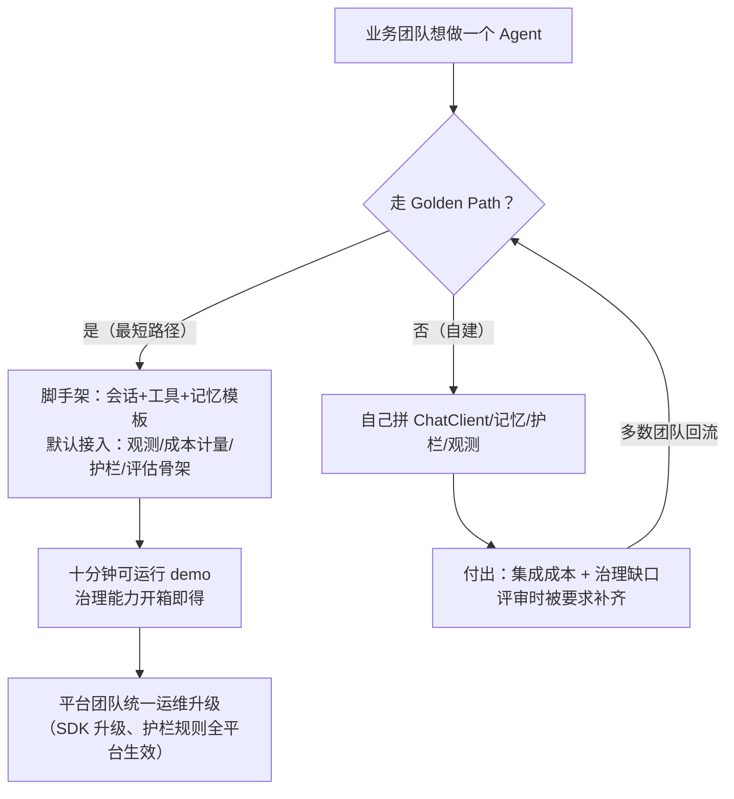
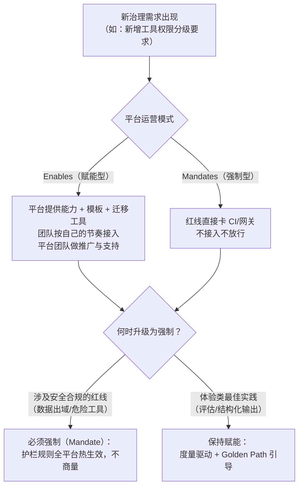

# 01-平台工程与组织采纳

> **定位**：本篇讲 Agent 中台建成之后的"最后一公里"——怎么让企业里的团队**真的用它**。技术体系（管控分离、多租户、灰度、评估闭环）在本体系其他篇章已全覆盖，但企业级落地有一个技术文档常回避的事实：**平台没人用等于零**。本篇把"内部平台当产品做"的平台工程（Platform Engineering）方法论落到 Agent 平台场景：Golden Path、开发者体验度量、采纳指标、平台团队运营模式。读者画像：正在或即将主导 Agent 平台内部推广的架构师、平台团队 Tech Lead。前置阅读：[附录 07-架构决策方法论/00-ADR架构决策记录]（决策记录方法）、[教程 04-企业级架构主干/00-管控分离架构]（平台的管控边界从哪来）。

## 一、为什么 Agent 平台比普通内部平台更难推广

普通内部平台（CI/CD、日志服务）推广失败还能退回老路；Agent 平台推广失败有一个**双面陷阱**：不用平台的团队各自裸调 LLM API——既产生失控的影子成本，又埋下数据泄露和合规的雷（Prompt 里带客户数据直发第三方 API）。所以 Agent 平台的采纳不是"锦上添花"，而是治理的前提：**采纳率就是安全边界**——没接入平台的每一次 LLM 调用都在管控之外。

这决定了 Agent 平台团队的一个关键认知：你的竞争对手不是"其他平台"，而是 **`curl https://api.xxx.com` 一行命令**。裸调永远比接平台省事，所以平台的接入体验必须好到"比裸调更省心"（密钥托管、计量计费、护栏、审计开箱即得），而不是"公司规定必须用"。行政命令能换来接入率，换不来正确使用——被强制接入的团队会绕过护栏、伪造评估、把平台当透明代理，治理目的全部落空。

## 二、Golden Path：让正确的路成为最短的路

平台工程的核心交付物不是功能清单，是 **Golden Path（黄金路径）**——预置好的、默认就带着护栏与观测的最佳实践模板。团队拿着模板十分钟跑通第一个带评估的 Agent，而不是对着 40 篇文档从零拼装。

设计 Golden Path 的三条经验：

1. **默认值即治理**：模板里 Observation 默认开、成本计量默认接租户、工具注册默认走权限分级声明（[教程 10-调优实战与方法论/04-工具调优下：执行与治理]）——团队"什么都没做"就已经合规。治理能力做成默认值而不是开关，是平台团队最强的治理杠杆
2. **逃生舱要有，但要留痕**：允许团队声明"我要偏离模板"（如自研记忆存储），但偏离项进平台团队的知识库并纳入支持范围——堵死逃生舱只会催生绕过
3. **版本化模板**：Golden Path 模板本身随 Spring AI 版本演进（本体系锁 2.0.0），升级公告 + 兼容性说明 + 迁移脚手架，让"跟随平台升级"比"赖在旧版"更省事

## 三、采纳度量：平台团队自己的指标体系

平台团队要用自己的指标闭环证明价值——这和 Agent 评估（[教程 08-架构师进阶/03-自我反思与Agent评估]）是同构的：采集 → 归因 → 改进。四层指标：

| 层 | 指标 | 说明 | 反模式信号 |
|----|------|------|-----------|
| 接入 | 接入团队数 / 应用数 | 广度 | 数字大但都是空壳应用 → 看下一层 |
| 活跃 | 周活会话数 / 周活开发者 | 真实使用 | 接入后两周静默 → 接入体验有问题 |
| 深度 | 治理能力启用率（评估/护栏/成本看板使用占比） | 用对而非只用 | 只用推理不用评估 → 飞轮没转起来 |
| 价值 | 节省工时估算 / 拦截的高危操作数 / badcase 修复周期 | 向上汇报的硬通货 | —— |

深度指标最容易被忽略但最能说明问题：一个只把平台当"LLM 代理"用的团队，平台对它的价值≈转发；启用评估闭环（[教程 08-架构师进阶/07-数据飞轮与持续改进]）和 HITL 审批（[教程 04-企业级架构主干/08-Human-in-the-Loop与审批流]）的团队才真正在平台上沉淀资产。

## 四、平台团队的运营模式：enables 还是 mandates

成熟企业的答案是**分层的混合模式**：安全合规红线（DLP、危险工具、数据出域）走强制——在网关层热生效，不依赖团队自觉（呼应 [教程 04-企业级架构主干/14-输入输出护栏与内容审核]）；体验类最佳实践走赋能——靠 Golden Path 的路径优势和指标度量驱动采纳。全部强制会把平台变成官僚机构（团队开始要求豁免），全部赋能会让红线失效（影子调用回归）。

平台团队的人员结构也不同于普通中间件团队：除了工程师，通常需要一名面向业务团队的 **DevX/布道角色**——做接入评审、收集痛点、运营内部案例分享。采纳是持续运营出来的，不是发布出来的。

## 五、转译到 Java / Spring AI 生态

| 平台工程机制 | Java 落地形态 |
|-------------|--------------|
| Golden Path 脚手架 | Maven Archetype / Spring Initializr 私有模板：预配 Observation、ChatClient 工厂、护栏 Bean、评估测试骨架 |
| 默认值即治理 | 平台提供 `spring-boot-autoconfigure` 级别的 starter：引入即自动装配计量/观测/护栏（对齐本体系「工具权限分级声明」规范） |
| 逃生舱留痕 | 偏离项走 ADR（[附录 07-架构决策方法论/00-ADR架构决策记录]）+ 平台团队评审记录 |
| 红线强制 | LLM 网关层统一鉴权 + 护栏热更新（管控分离：Control Plane 下发规则，Data Plane 无条件执行） |
| 采纳度量 | 平台自身接 Micrometer：`platform.adoption.active_teams`、`platform.governance.evaluation_enabled` 等自定义指标 |

## 六、适用场景与不适用场景

### ✅ 适用场景

- 企业级 Agent 平台/中台已建成（或 3 个以上团队要接 LLM 能力）
- 存在影子 LLM 调用、成本失控或合规审计压力
- 平台团队需要向管理层证明价值

### ❌ 不适用场景

- 单团队自用（3 人以下直接写代码，不需要平台化）
- 探索期原型（先验证业务价值，再谈平台与采纳）
- 公司已强制定额购买某商业 Agent 产品（度量与推广的前提是"有选择权"）

## 七、总结

Agent 平台落地的完整链条是：**架构能力（管控分离/多租户/灰度）→ 治理能力（评估/护栏/成本）→ 组织能力（采纳）**——前两环本体系已全覆盖，本篇补上第三环。三条核心结论：①采纳率就是安全边界，平台的真正竞争对手是裸调 API 的一行命令；②Golden Path 的本质是把治理做成默认值，让正确的路成为最短的路；③运营模式用分层混合——安全红线强制、体验实践赋能，度量闭环驱动持续采纳。架构师向上证明平台价值时，用第三节的四层指标说话，不用形容词。

## 设计哲学要点（本篇内嵌）

**哲学根源**：平台工程的底层假设是"组织的默认行为决定系统的实际安全水位"——技术护栏再完善，绕过它的路径存在就等于不存在。因此平台团队的产品不是 API，是**组织行为**：把期望的行为（接入、评估、审批）设计成阻力最小的行为。**一句话总纲**：治理的终点不是规则，是习惯；平台的成功指标不是功能数，是被遗忘度——好平台被接入后没人再想起它的存在。
