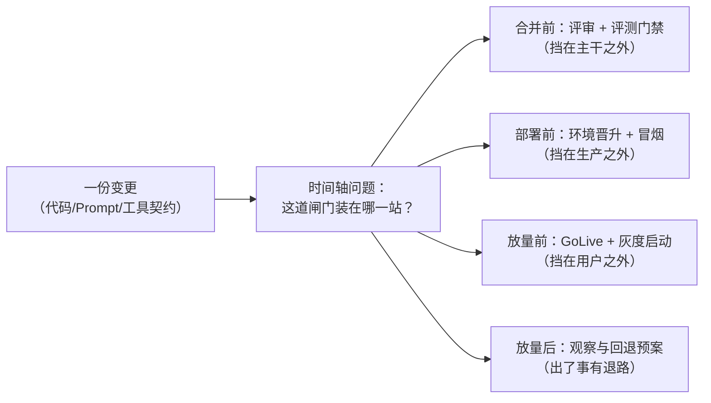
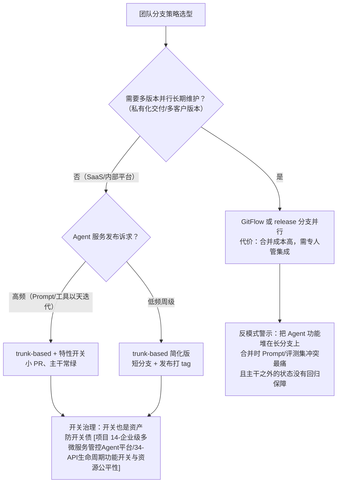
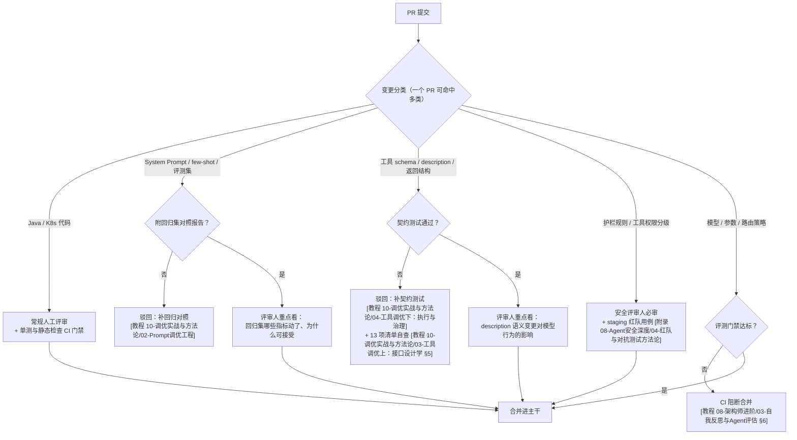
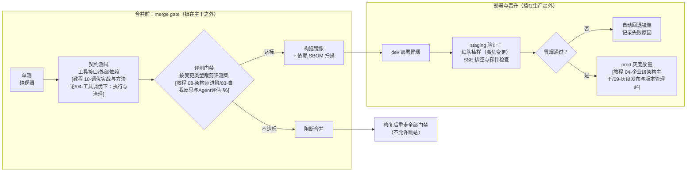
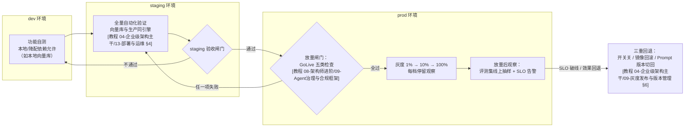

# 02-工程协作流程：分支、评审、流水线与发布检查单

> **定位**：本篇是 Agent 平台交付链路的**流程统帅篇**——把散落在体系各专篇里的交付实践（分支怎么切、PR 怎么审、流水线怎么排、上线前过哪些清单）拧成一条有顺序、有闸门、有责任人的完整时间轴。既有专篇讲单点深钻（评测怎么做、契约测试怎么写、红队怎么打），本篇回答的是它们都回答不了的问题：**这些闸门按什么顺序排、每次变更该过哪几道、谁在哪一步签字**。读者画像：正在为 Agent 团队搭建工程流程的 Tech Lead、平台工程团队、从传统 Java 服务转做 Agent 平台后发现"老流程不够用"的架构师。前置阅读：[附录 07-架构决策方法论/00-ADR架构决策记录]（决策怎么记录）、[教程 04-企业级架构主干/13-部署与运维]（环境隔离与发布策略）。

## 一、为什么 Agent 平台需要一张交付流程总纲

### 1.1 交付物的三重性：代码只是三分之一

传统 Java 服务的交付物是代码，交付流程围绕"代码变更"设计就够了。Agent 平台的交付物是**三重**的：

| 交付物 | 变更频率 | 出事的形态 | 传统流程覆盖吗 |
|--------|---------|-----------|---------------|
| Java 代码（编排/工具实现/网关） | 周~天级 | 编译错、逻辑错、性能回退 | 覆盖 |
| Prompt 资产（System Prompt / few-shot / 评测集） | 天级，有时小时级 | 效果静默劣化——不报错、不抛异常，指标慢慢掉 | **不覆盖** |
| 工具契约（schema / description / 返回结构） | 月~周级，但牵一发动全身 | 模型选错工具、传错参数、编造答案 | **不覆盖** |

三重交付物导致一个结构性结论：**同一个"发布"动作，回退的维度有三个**——代码回退（镜像回滚）、Prompt 回退（版本指针切回）、开关回退（运行时关闭）。传统流程只准备了第一个。流程设计如果只盯代码，剩下的三分之二就在流程之外裸奔。

### 1.2 散点问题：五张清单没有时间轴

本体系各专篇沉淀了大量高质量的检查清单，但它们散在各处，执行时团队不知道"什么时候该过哪张"：

| 清单 | 所在专篇 | 原本设计的使用时机 |
|------|---------|------------------|
| 工具接口调优清单（13 项） | [教程 10-调优实战与方法论/03-工具调优上：接口设计学 §5] | 工具上线前 |
| Prompt 版本回归门禁 | [教程 10-调优实战与方法论/02-Prompt调优工程]、[教程 04-企业级架构主干/09-灰度发布与版本管理 §2] | Prompt 变更合并前 |
| 评测集资产与回归测试 | [教程 08-架构师进阶/03-自我反思与Agent评估 §6、§7] | 模型/Prompt/编排变更前 |
| trace 服务接入"最小一致集" | [教程 06-TraceId全链路追踪/07-管控分离微服务落地：traceId架构 §7.2]、收拢为接入 checklist 见 [教程 06-TraceId全链路追踪/10-综合实战：工业巡检Agent的traceId闭环] | 新微服务接入时 |
| GoLive 上线检查单（合规/安全/透明/审计/运营五类） | [教程 08-架构师进阶/09-Agent治理与合规框架] | 首次生产上线前 |
| 红队对抗用例 | [附录 08-Agent安全深度/04-红队与对抗测试方法论] | 高危变更的 staging 阶段 |

散点的代价是真实发生的：新服务上线没人提醒过 trace 接入清单（盲区正是 06-10 说的"以为体系建完就一劳永逸"）；工具改了 description 没人要求跑契约测试，两周后线上模型开始传错参数。**本篇的任务不是重写这些清单，而是给它们一条时间轴**——第五节的四阶段总表把上面每一项挂到"合并前 / 部署前 / 放量前 / 放量后"的正确位置上。



---

## 二、分支策略：让主干随时可发布

### 2.1 三种策略的本来面目

| 维度 | trunk-based（主干开发） | GitFlow | release 分支 |
|------|------------------------|---------|--------------|
| 分支寿命 | 小时~天级短分支 | 长期 develop/release/hotfix 多线 | 发布期才拉出，修复用 |
| 主干状态 | 始终可发布（靠开关隐藏半成品） | develop 分支"接近可发布" | 主干即发布线 |
| 合并冲突 | 少（小步快合） | 严重（长分支互相堆积） | 中等 |
| 对自动化要求 | 高（主干常绿靠 CI 强制） | 中 | 中 |
| 适合团队 | 平台化、高频发布的团队 | 多版本并行交付的交付型团队 | 周级发布节奏的 SaaS |

### 2.2 Agent 平台语境的三个裁决因素

**因素一：多服务同仓还是多仓。** 管控分离拆出的 agent 服务、LLM 网关、工具注册中心、检索服务（[教程 04-企业级架构主干/00-管控分离架构]）放在一个 monorepo 还是各建仓库？裁决依据是**变更的耦合度**：跨服务协议（工具契约、trace 传播格式、灰度标签）一改就要多仓联动 PR 的，同仓能保证"一次提交跨服务一致"；各服务独立演进、团队边界清晰的，多仓 + 版本化依赖更干净。Agent 平台的实践倾向是：**管控面与数据面分仓（治理规则演进节奏与推理服务完全不同），数据面内部同仓**——工具契约和 Agent 编排常常同变更。

**因素二：SSE 长连接服务的发布成本高，反而不敢发、更要小步发。** Agent 服务持有着大量长连接，滚动更新要排空（draining），一次发布的运维动静远大于无状态 CRUD 服务（[教程 04-企业级架构主干/13-部署与运维] 有 SSE 排空的完整处理）。这里有个反直觉的推理链：发布成本高 → 团队倾向攒大批变更一次发 → 单次发布风险更大、排障更难 → 更不敢发。打破这个循环的唯一方法是把**每次变更做小**（trunk-based 的小 PR），让高发布成本被摊到高频低风险的小发布上，而不是堆成低频高风险的大发布。

**因素三：Prompt 和评测集是合并冲突重灾区。** 代码冲突好解决（结构化、可重构），Prompt 冲突是散文——两个人同时改同一段 System Prompt 的不同措辞，git 能自动合并文本，但合并后的**语义**没人审过。这是 Agent 仓库特有的问题：文本可自动合并 ≠ 效果可组合。trunk-based 的小步提交让 Prompt 变更之间的时间窗变短、互踩概率降低，且每次都有回归集对照（[教程 10-调优实战与方法论/02-Prompt调优工程]）兜底。

### 2.3 选型决策与特性开关的关系



**特性开关与分支是同一问题的两种解法**：都在回答"没做完/没验证的功能怎么和已验证的主干共存"。分支的解法是"把未完成隔离在分支上"，开关的解法是"把未完成合并进来但运行时隐藏"。Agent 平台倾向开关，因为 Prompt 类变更的"完成"往往要靠线上真实流量验证（离线评测只能证伪不能证实），半成品必须能进主干、能在生产对 1% 流量可见——这正是灰度发布（[教程 04-企业级架构主干/09-灰度发布与版本管理 §4] 流量切分）的地基。开关的纪律成本也要认：每个开关都要有移除计划，否则开关债堆积后没人说得清线上到底开着什么（开关治理见 [项目 14-企业级多微服务管控Agent平台/34-API生命周期功能开关与资源公平性]）。

---

## 三、PR 与评审工程

### 3.1 PR 的最小纪律

三条底线，无论团队大小：

1. **小**：一个 PR 一个意图。Agent 仓库的"意图"要按三重交付物分——改工具契约的 PR 不要顺手改 Prompt，两者的评审人和评审闸门完全不同，混在一起会让评审人漏掉其中一重。
2. **自述**：PR 描述里写清楚"改了什么交付物、为什么、风险在哪、回退方式是什么"。回退方式尤其重要——它强迫作者在合并前就想好"出事了怎么退"。
3. **可追溯**：涉及架构决策的 PR 附 ADR 编号（门禁实现见 [附录 07-架构决策方法论/00-ADR架构决策记录 §7.4]，那里有一个 CI 自动校验 ADR 关联的 Java 门禁类）。

### 3.2 Agent 特有评审项：按变更类型路由闸门

传统评审清单（命名、测试覆盖、边界处理）照用，Agent 仓库要**追加**一层"变更分类 → 必过闸门"的路由。这层的存在理由：Agent 的三类交付物里有两类（Prompt、工具契约）的缺陷**不进编译器、不进单测**，只能靠各自的专项闸门拦截。



其中"可观测埋点齐不齐"是横切项：任何新增工具、新增编排环节、新增外部调用的 PR，评审时要问一句"这条链路在 Trace 里能不能看到"。判据用现成的——观测测试怎么写、跨服务 trace 怎么透传，见 [教程 05-Observation可观测/10-观测测试与跨服务传播：TestObservationRegistry与trace透传]；新微服务接入还要过 trace"最小一致集"（[教程 06-TraceId全链路追踪/07-管控分离微服务落地：traceId架构 §7.2]，两坐标依赖 + Hooks + 统一采样策略，CI 用依赖检查守护）。

### 3.3 评审 SLA 与评审轮次

评审工程里最被低估的是**时间维度的约定**。没有 SLA 的评审是排队问题：PR 平均等待 3 天，作者就学会了一次攒 5 个特性一起提——分支策略那一节的所有努力全部作废。

| 约定 | 建议值 | 说明 |
|------|--------|------|
| 首次响应 SLA | 工作日 4 小时内（哪怕只回复"看到了，明天细审"） | 作者等的是确定性，不是速度 |
| 小 PR 评审完成 | 当日 | ≤ 400 行变更 |
| 评审轮次上限 | 2 轮后升级到三方会审（作者 + 评审人 + Tech Lead 十分钟对齐） | 无限轮次的拉锯消耗的是双方对流程的尊重 |
| 安全类变更 | 不受 SLA 限制，**必须**指定安全评审人 | 快不能以放行为代价 |
| 争议处理 | 评审意见分歧写入 ADR 而不是在 PR 里吵 | PR 评语义理，ADR 沉淀决策 |

轮次纪律的另一半是**评审意见分级**：`blocker`（必须改才能合并）/ `suggestion`（建议，作者自决）/ `nit`（纯风格，不构成第二轮的理由）。多数"评审拖三天"的团队，病根是所有意见都被当成了 blocker。

### 3.4 AI 生成代码的评审标准：以本体系的实证纪律为案例

AI 生成代码进入 PR 后，"代码能跑"不足以合并——生成代码的风险形态变了：**它看起来对**。变量名规范、结构清晰、注释齐全，但调用的 API 可能根本不存在（幻觉），或存在于另一个版本（如把 Spring AI 1.x 的签名写进 2.0 项目）。

本体系自身的写作纪律就是一个可移植的案例。CLAUDE.md 的"铁律 0"规定：文档中出现的**所有** SDK 元素必须先对本地 Maven 仓库的 jar 做 `javap` 反编译实证，确认真实存在且签名一致才允许写入——禁止凭记忆、禁止用旧版知识、禁止从网上文档推断。同样的纪律映射到 AI 生成代码的评审标准上，就是三条：

1. **实证锚点**：AI 生成的代码里，每个外部 SDK 调用都要能指出实证来源（本地 jar 的真实签名 / 仓库里既有用法）。评审人抽查的方式和本文档体系一样——`javap -classpath <jar> <全限定类名>`，或者 `jar tf` 确认类在不在那个包里。
2. **版本锁定声明**：生成代码引用的 API 要注明来自哪个版本；同名 API 在 1.x 与 2.0 之间签名可能完全不同，评审按项目锁定的版本判。
3. **可运行证伪**：对"序列化/反序列化"这类读写两端的行为型代码，编译通过不算数，要求作者附最小 round-trip 验证（写入再读回，打印读回的真实类型）——因为"能写"和"能读回"是两件事，第一次成功第二次失败是持久化 bug 的经典形态。

这三条的共同哲学是：**对生成内容，信任的默认值是零，证据的默认值是实证**。这个标准不因"代码是 AI 写的"而加强、也不因"人写的"而豁免——本体系对人类作者和 AI 作者执行同一条铁律 0。

---

## 四、CI/CD 流水线全景

### 4.1 阶段编排与闸门顺序

Agent 服务的流水线在传统"单测→构建→部署"之间插入了两个 Agent 特有阶段：**契约测试**和**评测门禁**。全景如下：



### 4.2 阶段与既有专篇的挂接

本篇只给**顺序**和**闸门归属**；每个阶段内部怎么做，看对应专篇：

| 流水线阶段 | 闸门性质 | 内容专篇（本篇不重复） |
|-----------|---------|----------------------|
| 单元测试 | 硬失败 | [附录 04-测试策略]（测试金字塔与 Agent 测试分层） |
| 契约测试 | 硬失败 | [教程 10-调优实战与方法论/04-工具调优下：执行与治理] |
| 评测门禁 | 阈值判断 | [教程 08-架构师进阶/03-自我反思与Agent评估 §6 回归测试、§7 评测集资产治理] |
| 镜像构建 + SBOM | 硬失败（高危漏洞） | 供应链扫描细节见 [教程 04-企业级架构主干/13-部署与运维] 与 [附录 08-Agent安全深度/04-红队与对抗测试方法论] 的配套防线 |
| dev/staging 冒烟 | 硬失败 | 环境差异铁律见 [教程 04-企业级架构主干/13-部署与运维 §4] |
| 红队抽样（高危变更） | 阈值判断 | [附录 08-Agent安全深度/04-红队与对抗测试方法论] |
| 灰度放量 | 分阶段人工+自动 | [教程 04-企业级架构主干/09-灰度发布与版本管理] |

**闸门性质**这一列值得单独解释：硬失败（单测红、契约破）是确定性判据，CI 全自动拦截；阈值判断（评测分掉没掉、红队发现数）需要人先定"多少算掉"，门禁自动化程度取决于评测集的稳定性——这也是为什么评测集要当代码治理（版本化、badcase 入集、漂移监控，[教程 08-架构师进阶/03-自我反思与Agent评估 §7]）：**评测门禁的可信度上限就是评测集的质量上限**。

### 4.3 为什么评测门禁排在镜像之前

传统流水线的直觉是"测试完了才构建镜像"，评测看起来也是测试。把它排在合并前、构建前，有两个硬理由：

1. **评测烧真金白银**。评测门禁的每一轮都在调真实模型（这是它和 mock 单测的本质区别），token 成本随评测集规模线性增长。放在最前面配合**按变更类型裁剪**：纯代码重构不触发评测、Prompt 变更只跑 Prompt 回归集、模型/路由变更跑全量集——不做裁剪的团队会在第三个月开始跳过评测门禁，然后门禁名存实亡。
2. **评测结果决定要不要花构建的钱**。效果不达标的变更，构建镜像和后续所有部署动作都是浪费。门禁越靠前，废动作越少——这是流水线设计的通用法则"最贵的闸门放最前面"，Agent 流水线里最贵的就是评测。

配套的工程手段是**评测结果缓存**：以"变更内容指纹 + 评测集版本 + 模型版本"为 key，同指纹的 PR 更新不重跑全量集。这个三元组缺一不可——只按内容缓存会在评测集升级后复用过期结论。

### 4.4 环境晋升管道：dev → staging → prod



晋升管道里最容易省掉的是"staging 不通过退回 dev"这条**回边**——很多团队的 staging 只是 prod 的自动通道，发现问题也硬着头皮往前走。回边的存在让"staging 发现问题"的成本停在 staging；省掉回边，成本就转移给生产。staging 环境自身怎么建（同引擎铁律、容量差异、配置差异表），[教程 04-企业级架构主干/13-部署与运维 §4] 已有完整展开，本篇不再重复。

---

## 五、发布检查单总篇

### 5.1 四阶段总表

这是本篇的收拢性交付物：把散在各专篇的检查项挂到时间轴上。**用法**：每次发布按四个阶段顺序执行；每项都有来源锚点，执行细节点进去看专篇，本表不重复判据。

**阶段一：合并前（merge gate，挡在主干之外）**

| # | 检查项 | 责任人 | 来源 |
|---|--------|--------|------|
| 1 | 变更分类完成（代码/Prompt/工具契约/安全/模型），PR 路由到对应评审人 | 作者 | 本篇 §3.2 |
| 2 | 架构级变更附 ADR 编号 | 作者 | [附录 07-架构决策方法论/00-ADR架构决策记录 §7] |
| 3 | Prompt 变更附回归集对照报告 | 作者+AI 门禁 | [教程 10-调优实战与方法论/02-Prompt调优工程] |
| 4 | 工具 schema/description 变更过契约测试 + 13 项清单自查 | 作者 | [教程 10-调优实战与方法论/03-工具调优上：接口设计学 §5]、[教程 10-调优实战与方法论/04-工具调优下：执行与治理] |
| 5 | 模型/路由变更评测门禁达标 | CI | [教程 08-架构师进阶/03-自我反思与Agent评估 §6] |
| 6 | 新增环节有观测埋点与观测测试 | 评审人 | [教程 05-Observation可观测/10-观测测试与跨服务传播：TestObservationRegistry与trace透传] |
| 7 | AI 生成代码有实证锚点与 round-trip 证据 | 评审人 | 本篇 §3.4 |

**阶段二：部署前（挡在生产之外）**

| # | 检查项 | 责任人 | 来源 |
|---|--------|--------|------|
| 8 | 镜像 SBOM 扫描无高危漏洞 | CI | [教程 04-企业级架构主干/13-部署与运维] |
| 9 | staging 与 prod 环境一致性核对（向量库同引擎、模型同家族） | 平台工程 | [教程 04-企业级架构主干/13-部署与运维 §4] |
| 10 | 高危变更（护栏/权限/危险工具）staging 红队抽样通过 | 安全评审人 | [附录 08-Agent安全深度/04-红队与对抗测试方法论] |
| 11 | 新微服务过 trace 接入"最小一致集" | 平台工程 | [教程 06-TraceId全链路追踪/07-管控分离微服务落地：traceId架构 §7.2]、checklist 化见 [教程 06-TraceId全链路追踪/10-综合实战：工业巡检Agent的traceId闭环] |
| 12 | SSE 排空与探针配置验证（长连接服务滚动更新不硬切） | 平台工程 | [教程 04-企业级架构主干/13-部署与运维] |
| 13 | staging 冒烟通过，回退方案在 PR 描述中确认可用 | 值班工程师 | 本篇 §3.1 |

**阶段三：放量前（挡在用户之外）**

| # | 检查项 | 责任人 | 来源 |
|---|--------|--------|------|
| 14 | GoLive 五类检查单（合规/安全/透明/审计/运营）全过 | 发布负责人 | [教程 08-架构师进阶/09-Agent治理与合规框架] |
| 15 | 灰度计划确认（切分比例、每档停留时长、观测指标、暂停阈值） | 发布负责人 | [教程 04-企业级架构主干/09-灰度发布与版本管理 §4] |
| 16 | 三重回退路径（开关/镜像/Prompt 版本）预演可用 | 值班工程师 | [教程 04-企业级架构主干/09-灰度发布与版本管理 §6]、开关治理 [项目 14-企业级多微服务管控Agent平台/34-API生命周期功能开关与资源公平性] |
| 17 | 效果回归监控面板就位（线上评测抽样 + SLO 告警） | 平台工程 | [教程 08-架构师进阶/03-自我反思与Agent评估 §5] |

**阶段四：放量后（出了事有退路、有记录）**

| # | 检查项 | 责任人 | 来源 |
|---|--------|--------|------|
| 18 | 灰度每档结束核对暂停阈值，达标才进下一档 | 发布负责人 | [教程 04-企业级架构主干/09-灰度发布与版本管理 §4] |
| 19 | 全量后 24–72 小时效果观察，badcase 入评测集 | 业务+平台 | [教程 08-架构师进阶/03-自我反思与Agent评估 §7.2]（badcase 入集）、[教程 08-架构师进阶/07-数据飞轮与持续改进] |
| 20 | 本次发布用的临时开关排上移除计划 | 作者 | [项目 14-企业级多微服务管控Agent平台/34-API生命周期功能开关与资源公平性]（开关债治理） |
| 21 | 发布复盘：本次检查单哪几项形同虚设/哪几项救了场，回写本表 | 团队 | 本篇 §5.2 |

### 5.2 清单的维护机制：清单也是代码

总表本身要有维护纪律，否则半年后就会退化成没人信的形式：

- **进仓库、走 PR**：总表放在代码仓（不是 Confluence），改清单和改代码一样走评审——清单项的增删本身就是流程变更，凭什么不走流程？
- **能自动勾选的不留给人工**：上表 17 项里，#3–#5、#8、#11 的依赖检查都能由 CI 机器人自动核验并回填勾选状态（下一节的门禁类就是干这个的）。**人工只审机器审不了的东西**——语义变更的影响判断、回退方案的合理性。清单里留给人工的项越少，清单越被执行。
- **随专篇演进同步**：专篇里的清单升级了（比如 13 项清单将来变 15 项），总表引用同步更新——引用锚点让这种同步是"改一行"而不是"全文重审"。
- **复盘回写**：每次发布复盘的第 21 项专门审清单自身。救过场的项标注案例，连续三次形同虚设的项要么自动化、要么删除——清单的膨胀和开关债一样需要治理。

### 5.3 Java 落地：检查单自动核验的门禁骨架

以下为自研门禁的示意骨架（纯 JDK 类型，不依赖 Spring AI SDK），演示"机器能核验的项自动核验"的形态，与 [附录 07-架构决策方法论/00-ADR架构决策记录 §7.4] 的 ADR 门禁同构：

```java
/**
 * 发布检查单自动核验器（概念骨架）：机器可判的项在 CI 自动核验，
 * 人工项生成待办指派给责任人。四阶段即四个 check 方法。
 */
public class ReleaseChecklistGate {

    /** 阶段一：合并前——机器可核验项。 */
    public GateReport checkMerge(PullRequest pr) {
        List<CheckItem> items = new ArrayList<>();
        // #4 工具契约变更 → 契约测试报告必须存在且为本次变更版本
        if (touchesToolContract(pr)) {
            items.add(CheckItem.of("契约测试", pr.hasContractTestReport()));
            items.add(CheckItem.of("13项清单自查表", pr.hasChecklistAck()));
        }
        // #3 Prompt 变更 → 回归集对照报告
        if (touchesPromptAssets(pr)) {
            items.add(CheckItem.of("回归集对照报告", pr.hasRegressionReport()));
        }
        // #5 模型/路由变更 → 评测门禁结果（从评测平台拉取，不信任 PR 自述）
        if (touchesModelRouting(pr)) {
            items.add(CheckItem.of("评测门禁达标",
                evalPlatform.isPass(pr.changeFingerprint(), evalSetVersion())));
        }
        // #2 架构级变更 → ADR 关联
        if (touchesArchitecture(pr)) {
            items.add(CheckItem.of("ADR 关联", pr.mentionsAdr()));
        }
        return GateReport.of(MERGE_STAGE, items);
    }

    /** 阶段二：部署前——环境一致性的机器核验部分（#9、#11）。 */
    public GateReport checkDeploy(DeployRequest req) {
        List<CheckItem> items = new ArrayList<>();
        // 向量库同引擎铁律：staging 与 prod 的引擎类型必须一致（容量可降，引擎不可换）
        items.add(CheckItem.of("staging 向量库同引擎",
            req.stagingVectorEngine().equals(req.prodVectorEngine())));
        // 新服务 trace 接入最小一致集：两坐标依赖存在性（依赖检查可自动化）
        items.add(CheckItem.of("trace 两坐标依赖",
            req.newServices().stream().allMatch(this::hasTracingDeps)));
        return GateReport.of(DEPLOY_STAGE, items);
    }

    private boolean touchesToolContract(PullRequest pr)   { return pr.touches("tools/"); }
    private boolean touchesPromptAssets(PullRequest pr)   { return pr.touches("prompts/"); }
    private boolean touchesModelRouting(PullRequest pr)   { return pr.touches("routing/"); }
    private boolean touchesArchitecture(PullRequest pr)   { return pr.touches("architecture/"); }
    private boolean hasTracingDeps(String service)        { return dependencyScan.has(service, TRACING_COORDS); }

    // 实证：本地 Maven 仓库存在 io/micrometer/micrometer-tracing 与 micrometer-tracing-bridge-brave（与体系 06-TraceId 系列实证基线一致）
    private static final List<String> TRACING_COORDS =
        List.of("micrometer-tracing", "micrometer-tracing-bridge-brave");

    private String evalSetVersion() { return evalPlatform.currentEvalSetVersion(); }

    private static final String MERGE_STAGE  = "merge-gate";
    private static final String DEPLOY_STAGE = "deploy-gate";
}
```

骨架里体现的三条设计判断：**机器项从系统拉真值**（评测结果从评测平台拉，不信 PR 自述"我过了"）；**人工项不消失而是转为指派**（GoLive 五类里的合规判断机器做不了，门禁把它们生成待办而不是假装核验过）；**门禁代码与清单同评审**（改检查项的 PR 必须同步改门禁，两者不同步是清单失效的第一原因）。

---

## 六、适用场景与不适用场景

### 适用场景

- 团队 5 人以上的 Agent 平台/中台，多角色（业务、平台、安全）协作，变更来源多元
- 存在三重交付物（代码 + Prompt + 工具契约）且发布频率 ≥ 周级
- 已有灰度、评测、契约测试等"零件"，但缺一条把零件串起来的流水线主线
- 正在引入 AI 编码工具，需要为生成代码建立实证评审标准

### 不适用场景

- 1–3 人原型期团队：本篇的全套闸门会把迭代速度拖死——先活下来，评测门禁和四阶段表在效果第一次静默劣化后再上
- 一次性 POC / 演示项目：流程成本无法在项目生命周期内回收
- 已有成熟发布体系、只是想加一个 Agent 服务的团队：不要推倒重来，把 §4.2 挂接表里的 Agent 特有阶段（契约、评测、红队）插进你们现有流水线即可——本篇的阶段顺序是参考系，不是强制模板

---

## 七、总结

本篇把 Agent 平台的交付流程收拢为一条时间轴、三类路由、四个阶段：

1. **分支策略**：Agent 平台默认 trunk-based + 特性开关——三重交付物里 Prompt 和工具契约的变更要靠线上流量验证，半成品必须能进主干；分支策略与开关治理（[项目 14-企业级多微服务管控Agent平台/34-API生命周期功能开关与资源公平性]）、灰度（[教程 04-企业级架构主干/09-灰度发布与版本管理]）是一套组合拳。
2. **评审工程**：在常规清单之上追加"变更分类 → 必过闸门"的路由层，因为 Prompt 和工具契约的缺陷不进编译器；SLA 与轮次纪律保住的是作者对流程的信任；AI 生成代码的评审标准可以复用本体系铁律 0 的实证方法——对生成内容，信任的默认值是零。
3. **流水线**：Agent 特有的两站——契约测试与评测门禁——排在镜像之前；评测最贵，所以最靠前、且必须按变更类型裁剪 + 结果缓存，否则门禁会被自己烧掉的 token 预算杀死。
4. **发布检查单**：21 项、四阶段、逐项有锚点——本篇的角色是统帅不是士兵，每项的执行细节都在被引用的专篇里；清单进仓库、机器项自动核验、复盘回写，让总表活得比第一次发布更久。

流程的终极检验标准不是"我们有没有这些文档"，而是**一次 Prompt 变更从提交到全量，中间的每一道闸门是不是都被真的执行了、执行的成本是不是真的比它拦住的事故便宜**。这两个问题的答案在复盘记录里，不在流程图上。

## 设计哲学要点（本篇内嵌）

**哲学根源**：流程工程的底层假设是"闸门的位置决定缺陷的成本"——同一个缺陷，合并前发现是一行修改，放量后发现是一次回退加一次信任损耗。因此流程设计的核心动作不是"增加检查"，是**把既有检查装到正确的时间轴位置上**（本体系不缺清单，缺的是时间轴）。**一句话总纲**：好的交付流程让正确的事成为惯性动作，让危险的事必须穿过显式的闸门；流程的成熟度不体现在文档厚度，体现在凌晨两点值班工程师发布时，照着检查单走完就敢点确认。

---

> 想深入？→ 决策为什么这么定、如何记录与推翻，见姊妹篇 [附录 07-架构决策方法论/00-ADR架构决策记录]；平台建成后人怎么真的用起来，见 [附录 07-架构决策方法论/01-平台工程与组织采纳]；本篇引用的各专项闸门的内部实现，按 §4.2 挂接表与 §5.1 总表的锚点进入对应专篇。
