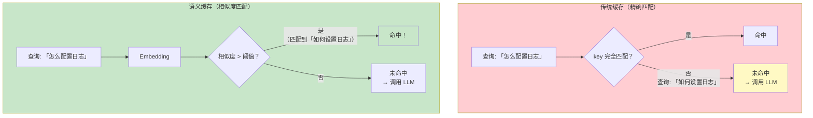
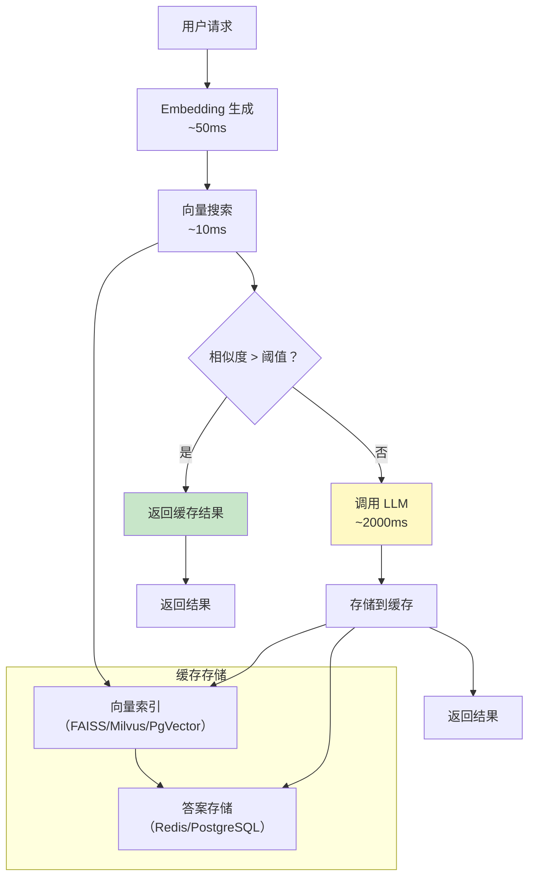
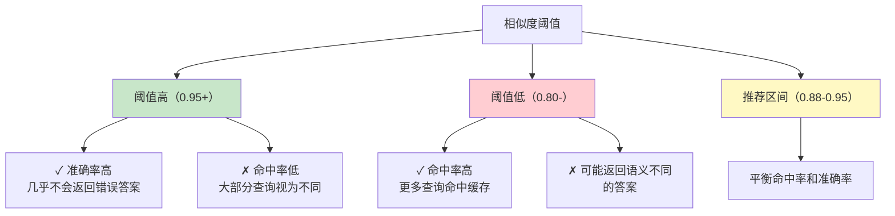
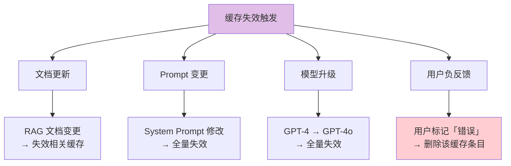
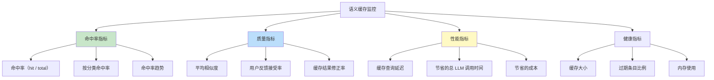
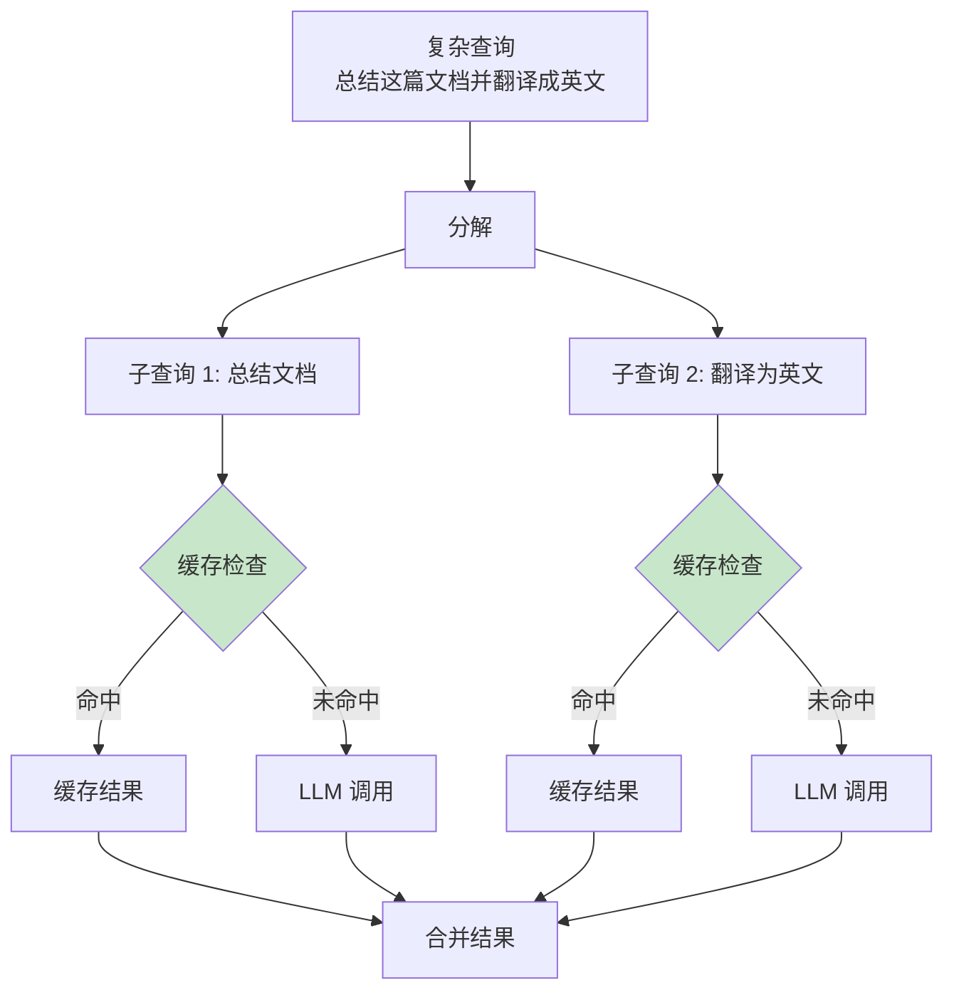

# 语义缓存实现：从原理到生产落地

> 「本文是对 [教程 29-上下文工程 §5-§6] 的深入展开」

> **定位**：系统讲解语义缓存的原理——基于 Embedding 相似度而非精确匹配的缓存策略，包括缓存构建、相似度阈值、TTL 策略、缓存失效、以及 Spring AI + 向量数据库的实现方案。
>
> **读者画像**：Agent 已经上线但 LLM 调用成本高昂、延迟高，希望通过缓存减少重复调用的开发者。

---

## 1. 什么是语义缓存

### 1.1 传统缓存 vs 语义缓存



### 1.2 收益评估

| 场景 | 缓存命中率 | 节省成本 | 延迟降低 |
|------|-----------|---------|---------|
| FAQ 客服 | 60-80% | ~70% | 2000ms → 50ms |
| 代码助手 | 20-30% | ~25% | 3000ms → 100ms |
| 开放对话 | 5-10% | ~8% | 不明显 |
| 模板化任务 | 80-95% | ~90% | 显著 |

---

## 2. 架构设计

### 2.1 整体架构



### 2.2 缓存数据模型

```java
@Entity
@Table(name = "semantic_cache")
public class SemanticCacheEntry {

    @Id
    private String id;

    private float[] queryEmbedding;   // 查询的向量
    private String queryText;         // 原始查询文本
    private String responseText;      // LLM 回答
    private String modelUsed;         // 使用的模型
    private int promptTokens;         // 输入 Token 数
    private int completionTokens;     // 输出 Token 数
    private double similarity;        // 命中时的相似度
    private Instant createdAt;        // 创建时间
    private Instant expiresAt;        // 过期时间
    private String tenantId;          // 租户隔离
    private int hitCount;             // 命中次数
}
```

---

## 3. Spring AI 实现

### 3.1 核心 Advisor

```java
@Component
@Order(50)
public class SemanticCacheAdvisor implements CallAdvisor {

    private final EmbeddingModel embeddingModel;
    private final VectorStore cacheVectorStore;
    private final CacheRepository cacheRepository;
    private final CacheConfig config;

    private static final double DEFAULT_THRESHOLD = 0.92; // 相似度阈值

    @Override
    public ChatClientResponse adviseCall(ChatClientRequest request,
                                           CallAdvisorChain chain) {

        // 1. 检查缓存
        Optional<CacheHit> cached = checkCache(request);

        if (cached.isPresent()) {
            metrics.increment("cache.hit");
            log.info("缓存命中，相似度: {}", cached.get().similarity());

            return ChatClientResponse.builder()
                .chatResponse(buildResponseFromCache(cached.get()))
                .context(request.context())
                .build();
            // 短路：不调用 chain.nextCall
        }

        // 2. 缓存未命中 → 调用 LLM
        metrics.increment("cache.miss");
        ChatClientResponse response = chain.nextCall(request);

        // 3. 存入缓存
        if (shouldCache(request, response)) {
            storeInCache(request, response);
        }

        return response;
    }

    private Optional<CacheHit> checkCache(ChatClientRequest request) {
        String query = extractQueryText(request);

        // 生成 Embedding
        float[] embedding = embeddingModel.embed(query);

        // 向量搜索
        List<SemanticCacheEntry> candidates = cacheVectorStore
            .similaritySearch(
                SearchRequest.query(query)
                    .topK(1)
                    .similarityThreshold(config.getThreshold())
            )
            .stream()
            .map(doc -> cacheRepository.findById(doc.getId()).orElse(null))
            .filter(Objects::nonNull)
            .filter(entry -> !isExpired(entry))
            .filter(entry -> isSameTenant(entry, request))
            .toList();

        if (candidates.isEmpty()) {
            return Optional.empty();
        }

        SemanticCacheEntry best = candidates.get(0);
        return Optional.of(new CacheHit(best.responseText(), best.similarity()));
    }
}
```

### 3.2 流式缓存

```java
@Override
public Flux<ChatClientResponse> adviseStream(ChatClientRequest request,
                                               StreamAdvisorChain chain) {
    Optional<CacheHit> cached = checkCache(request);

    if (cached.isPresent()) {
        // 缓存命中：将缓存结果作为流式返回
        String text = cached.get().response();
        List<String> chunks = splitIntoChunks(text, 5); // 模拟流式

        return Flux.fromIterable(chunks)
            .delayElements(Duration.ofMillis(20))  // 模拟流式延迟
            .map(chunk -> buildStreamResponse(chunk));
    }

    Flux<ChatClientResponse> stream = chain.nextStream(request);

    // 收集流式结果用于缓存
    StringBuilder collector = new StringBuilder();
    return stream
        .doOnNext(response -> {
            collector.append(response.chatResponse()
                .getResult().getOutput().getText());
        })
        .doOnComplete(() -> {
            storeInCache(request, collector.toString());
        });
}
```

---

## 4. 相似度阈值调优

### 4.1 阈值与准确率的权衡



### 4.2 动态阈值

```java
@Component
public class DynamicThresholdCalculator {

    public double getThreshold(String query) {
        // 根据查询类型动态调整阈值
        QueryType type = classifyQuery(query);

        return switch (type) {
            case FACTUAL -> 0.95;    // 事实类查询：高阈值
            case CREATIVE -> 0.85;   // 创意类查询：低阈值可接受
            case TECHNICAL -> 0.93;  // 技术类查询：较高阈值
            case CASUAL -> 0.88;     // 日常聊天：中阈值
        };
    }

    // 根据 A/B 测试数据自动调优
    public double autoOptimize() {
        // 从历史缓存命中数据中学习最优阈值
        List<CacheHitFeedback> feedback = feedbackRepository.getRecent(1000);

        double bestThreshold = 0.90;
        double bestScore = 0;

        for (double threshold = 0.80; threshold <= 0.99; threshold += 0.01) {
            double hitRate = calculateHitRate(feedback, threshold);
            double accuracy = calculateAccuracy(feedback, threshold);
            double score = hitRate * accuracy; // 综合 F1

            if (score > bestScore) {
                bestScore = score;
                bestThreshold = threshold;
            }
        }

        return bestThreshold;
    }
}
```

---

## 5. 缓存失效策略

### 5.1 TTL 策略

```java
@Component
public class CacheTTLManager {

    public Duration getTTL(String query, String response) {
        // 根据 RAG 上下文新鲜度设置 TTL
        boolean hasRagContext = /* ... */;
        boolean isTimeSensitive = isTimeSensitiveQuery(query);

        if (isTimeSensitive) {
            // 时间敏感查询（"今天的新闻"）：短 TTL
            return Duration.ofMinutes(5);
        }

        if (hasRagContext) {
            // 基于 RAG 的回答：跟随文档更新频率
            return Duration.ofHours(1);
        }

        // 通用知识：长 TTL
        return Duration.ofDays(7);
    }
}
```

### 5.2 主动失效



```java
@Service
public class CacheInvalidationService {

    // Prompt 变更时全量失效
    @EventListener
    public void onPromptChanged(PromptChangedEvent event) {
        cacheRepository.deleteByPromptVersion(event.oldVersion());
        log.info("Prompt 变更，清除了 {} 条缓存",
            cacheRepository.count());
    }

    // 文档变更时精准失效
    @EventListener
    public void onDocumentUpdated(DocumentUpdatedEvent event) {
        // 找到所有依赖此文档的缓存条目
        List<String> cacheIds = cacheRepository
            .findBySourceDocumentId(event.documentId());

        cacheRepository.deleteAllById(cacheIds);
        log.info("文档 {} 更新，清除 {} 条相关缓存",
            event.documentId(), cacheIds.size());
    }

    // 用户负反馈时删除
    public void handleNegativeFeedback(String cacheEntryId) {
        cacheRepository.deleteById(cacheEntryId);
        metrics.increment("cache.invalidated.feedback");
    }
}
```

---

## 6. 缓存预热

```java
@Service
public class CacheWarmupService {

    /**
     * 定时从高频查询中预热缓存
     */
    @Scheduled(cron = "0 0 3 * * *")  // 每天凌晨 3 点
    public void warmupFromPopularQueries() {
        // 1. 获取高频但未缓存的查询
        List<String> popularQueries = queryLogRepository
            .findTopUnseenQueries(100);

        // 2. 批量调用 LLM 预填充缓存
        for (String query : popularQueries) {
            try {
                ChatClientRequest warmupRequest = ChatClientRequest.builder()
                    .prompt(new Prompt(query))
                    .context(new HashMap<>())
                    .build();

                chatClient.prompt()
                    .user(query)
                    .call()
                    .content(); // 结果会自动存入缓存

                metrics.increment("cache.warmup");
            } catch (Exception e) {
                log.warn("预热失败: {}", query, e);
            }
        }
    }
}
```

---

## 7. 监控与调优

### 7.1 关键指标



### 7.2 A/B 测试

```java
@Component
public class CacheABTest {

    public Mono<String> handleQuery(String query, String userId) {
        String variant = assignVariant(userId); // "cache" 或 "no-cache"

        if (variant.equals("no-cache")) {
            // 对照组：直接调用 LLM
            return callLlmDirectly(query);
        }

        // 实验组：走语义缓存
        return semanticCacheService.query(query);
    }

    // 对比两组的用户满意度
    public void analyzeResults() {
        double cacheSatisfaction = feedbackRepository
            .getAverageRating("cache");
        double noCacheSatisfaction = feedbackRepository
            .getAverageRating("no-cache");

        log.info("缓存组满意度: {}, 对照组: {}",
            cacheSatisfaction, noCacheSatisfaction);
    }
}
```

---

## 8. 高级优化

### 8.1 查询归一化

```java
@Component
public class QueryNormalizer {

    public String normalize(String query) {
        // 1. 去除多余空白
        String normalized = query.trim().replaceAll("\\s+", " ");

        // 2. 统一标点
        normalized = normalized.replaceAll("[。.]", ".");

        // 3. 同义词替换
        normalized = synonymReplacer.replace(normalized);

        // 4. 去除无意义的修饰词
        normalized = normalized.replaceAll("(?i)^(请问|麻烦|帮我)", "");

        return normalized;
    }
}
```

### 8.2 分段缓存



---

## 9. 向量数据库选型

| 向量库 | 缓存规模 | 查询延迟 | 特点 |
|--------|---------|---------|------|
| Redis (RediSearch) | < 100万 | ~1ms | 最快，适合小规模 |
| PgVector | < 500万 | ~5ms | PostgreSQL 集成 |
| Milvus | > 1亿 | ~10ms | 分布式、大规模 |
| Qdrant | < 1亿 | ~5ms | Rust 实现、高效 |
| FAISS（嵌入式） | < 1000万 | ~1ms | 内存级、无服务端 |

```java
// Spring AI 统一接口，切换向量库只需改配置
@Bean
@ConditionalOnProperty(name = "cache.vector-store", havingValue = "redis")
public VectorStore redisVectorStore() {
    return RedisVectorStore.builder(jedisConnectionFactory)
        .indexName("semantic-cache")
        .vector(1536)
        .build();
}

@Bean
@ConditionalOnProperty(name = "cache.vector-store", havingValue = "milvus")
public VectorStore milvusVectorStore() {
    return MilvusVectorStore.builder(milvusClient)
        .databaseName("cache")
        .collectionName("semantic_cache")
        .build();
}
```

---

## 10. 总结

语义缓存是 Agent 系统性价比最高的优化之一：

1. **语义匹配优于精确匹配**——用户换个说法就能命中缓存。
2. **0.88-0.95 是推荐阈值**——平衡命中率和准确率。
3. **Advisor 实现是最优雅的**——对业务代码零侵入。
4. **TTL 分层策略**——事实类长 TTL、时间敏感类短 TTL。
5. **主动失效很重要**——Prompt/文档/模型变更时及时清理。
6. **监控命中率**——这是语义缓存价值的直接度量。

下一篇讨论 Prompt 缓存与 KV Cache——LLM 服务端的缓存机制。
