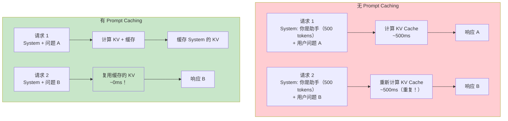
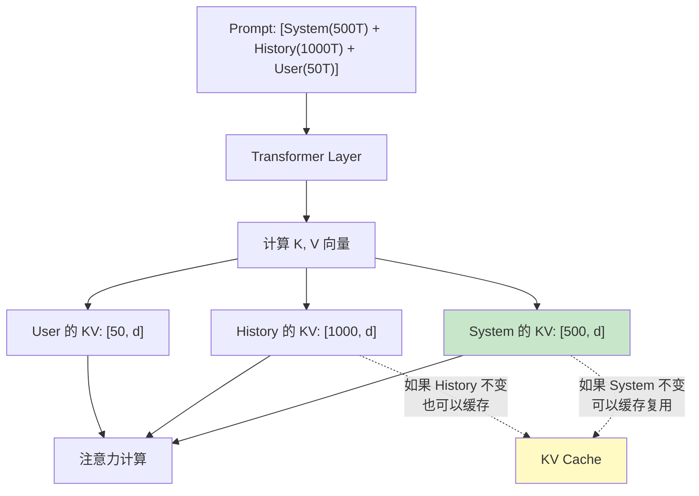
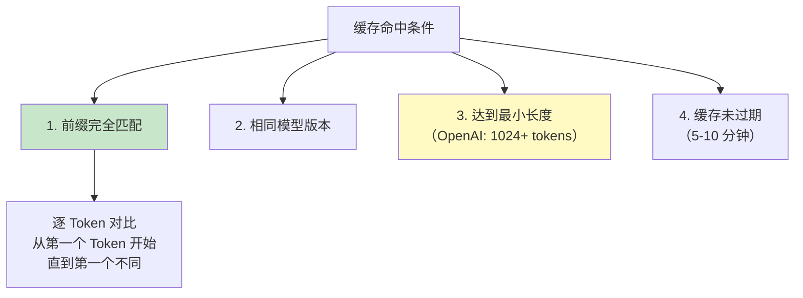
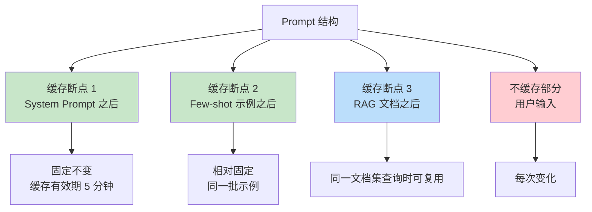
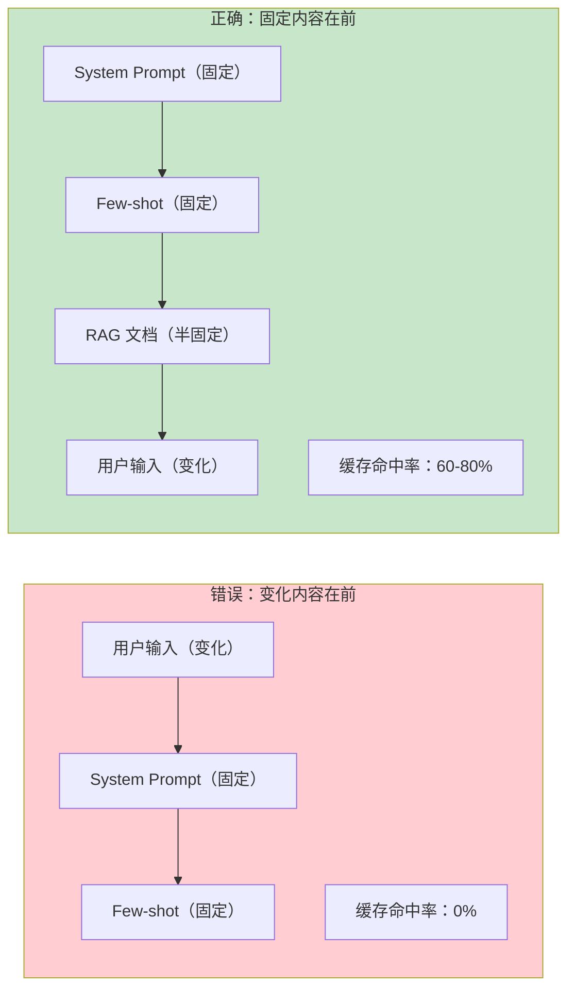
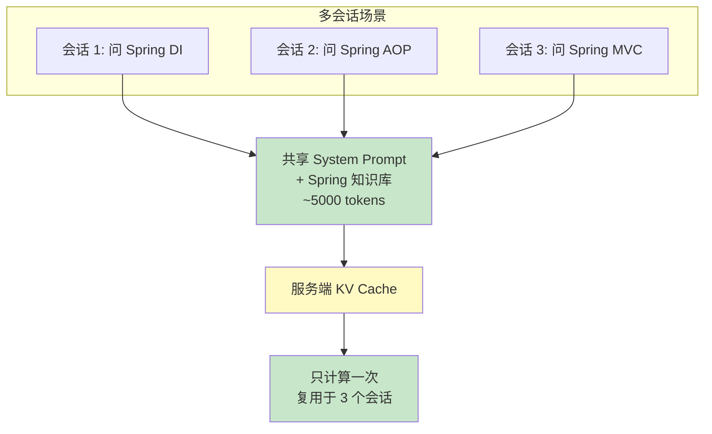
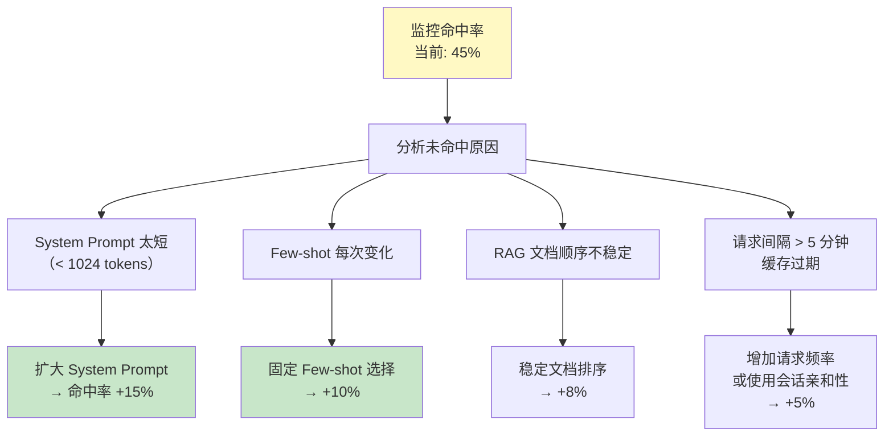
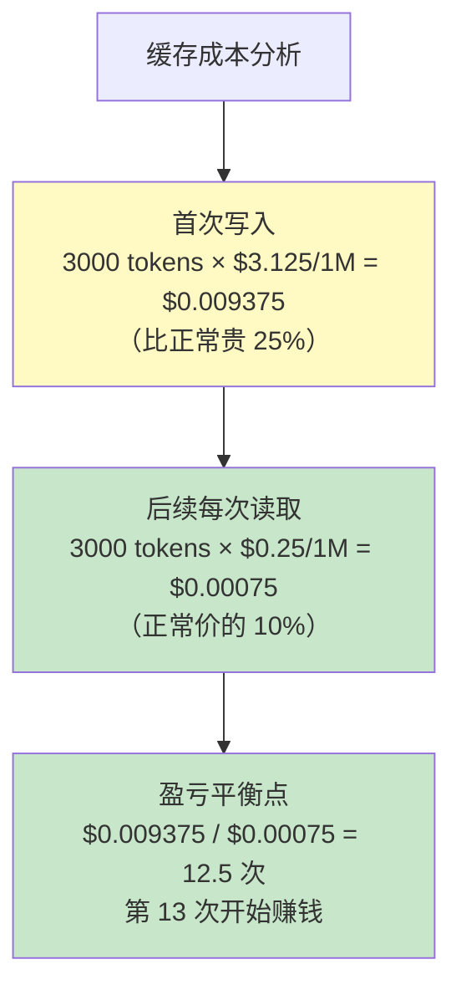
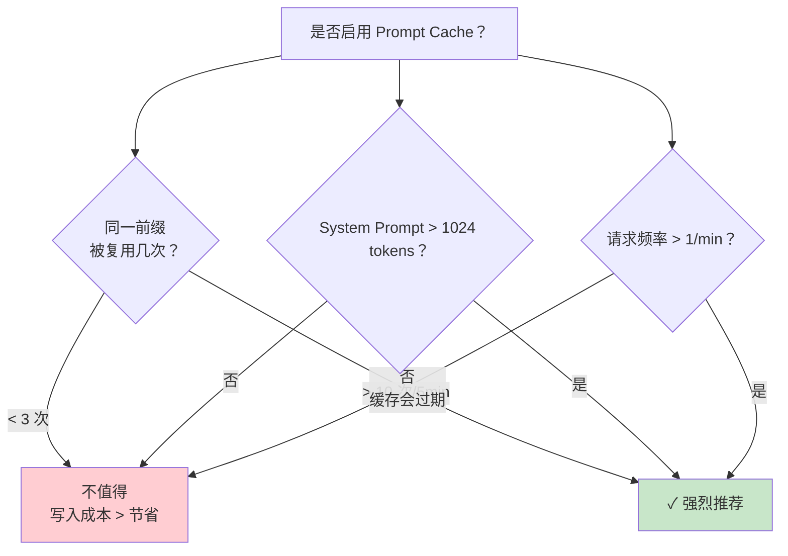

# Prompt 缓存与 KV Cache 深度解析

> 「本文是对 [教程 33-性能优化 §2-§5] 的深入展开」

> **定位**：系统讲解 LLM 推理引擎的 Prompt Caching 机制——服务端 KV Cache 复用、OpenAI/Anthropic 的缓存 API、缓存命中条件，以及如何在 Agent 系统中设计 Prompt 结构最大化缓存命中率。
>
> **读者画像**：Agent 已经处理大量长上下文请求，Prompt 中有大量重复内容（System Prompt、Few-shot 示例、长文档），希望降低延迟和成本的资深开发者。

---

## 1. 什么是 Prompt Caching

### 1.1 问题：重复计算的开销



### 1.2 收益

| 指标 | 无缓存 | 有缓存 | 改善 |
|------|--------|--------|------|
| 首 Token 延迟 (TTFT) | 500ms | 50ms | 10x |
| 输入 Token 成本 | $2.5/1M | $0.30/1M（缓存命中） | 8x |
| 吞吐量 | 基线 | +300% | 4x |

---

## 2. 工作原理

### 2.1 KV Cache 回顾



### 2.2 缓存命中条件



**关键点**：缓存是**前缀匹配**——只要 Prompt 的开头部分完全相同，该部分就能命中缓存。一旦出现不同的 Token，从该点开始全部失效。

---

## 3. OpenAI Prompt Caching

### 3.1 自动缓存

OpenAI 的 GPT-4o 会**自动**对超过 1024 tokens 的前缀进行缓存，无需额外 API 参数。

```java
@Service
public class OptimizedAgentService {

    // 固定的 System Prompt（会被自动缓存）
    private static final String CACHED_SYSTEM_PROMPT = """
        你是一个专业的 Java 技术助手。

        你的职责：
        1. 回答 Spring Boot、Spring AI 相关问题
        2. 提供代码示例和最佳实践
        3. 审查代码质量

        你必须遵循的规则：
        （此处放置大量固定规则，约 2000 tokens）
        ...
        """;

    public String ask(String userQuestion) {
        return chatClient.prompt()
            .system(CACHED_SYSTEM_PROMPT)       // 前缀固定 → 缓存
            .user(userQuestion)                  // 变化部分
            .call()
            .content();
    }
}
```

### 3.2 从 API 响应中查看缓存命中

```java
ChatResponse response = chatClient.prompt()
    .system(CACHED_SYSTEM_PROMPT)
    .user(question)
    .call()
    .chatResponse();

Usage usage = response.getMetadata().getUsage();

// 查看缓存命中的 Token 数
int promptTokens = usage.getPromptTokens();     // 总输入
int cachedTokens = usage.getCachedTokens();     // 缓存命中的部分

log.info("总输入: {}, 缓存命中: {}, 实际计费输入: {}",
    promptTokens, cachedTokens, promptTokens - cachedTokens);

// 成本计算
double inputCost = (promptTokens - cachedTokens) * 0.0000025;  // 正常价
double cachedCost = cachedTokens * 0.00000125;                   // 半价
double totalCost = inputCost + cachedCost;
```

---

## 4. Anthropic Prompt Caching

### 4.1 显式缓存标记

Anthropic 的 Claude 需要显式标记要缓存的段落：

```java
@Service
public class ClaudeCacheService {

    public Mono<String> askWithCache(String userQuestion,
                                      List<Document> ragDocuments) {

        // 构建消息，标记缓存断点
        String prompt = MessageCreator.create(
            // System Prompt → 缓存
            SystemMessage.withCache("""
                你是专业助手。
                （大量固定内容，~3000 tokens）
                """, "system-cache"),

            // RAG 文档 → 缓存（如果同一文档集被多次查询）
            UserMessage.withCache(
                "参考文档：\n" + formatDocuments(ragDocuments),
                "rag-cache"
            ),

            // 用户问题 → 不缓存（每次不同）
            UserMessage.of(userQuestion)
        );

        return Mono.fromCallable(() ->
            claudeClient.prompt(prompt).call().content()
        );
    }
}
```

### 4.2 缓存断点策略



---

## 5. Prompt 结构优化策略

### 5.1 原则：固定内容放前面



### 5.2 分层 Prompt 装配器

```java
@Service
public class CacheAwarePromptBuilder {

    /**
     * 构建 Prompt 时，将内容按缓存友好性排序
     */
    public Prompt buildForCache(
            String systemPrompt,
            List<String> fewShotExamples,
            List<Document> ragDocuments,
            String userInput,
            List<ToolCallback> tools) {

        List<Message> messages = new ArrayList<>();

        // Layer 1: System Prompt（几乎不变 → 缓存友好）
        messages.add(new SystemMessage(systemPrompt));

        // Layer 2: Few-shot 示例（相对不变 → 缓存友好）
        if (!fewShotExamples.isEmpty()) {
            StringBuilder examples = new StringBuilder("示例：\n");
            for (String example : fewShotExamples) {
                examples.append(example).append("\n\n");
            }
            messages.add(new UserMessage(examples.toString()));
        }

        // Layer 3: 工具定义（半固定 → 缓存友好）
        // Spring AI 自动将工具定义放在 System 之后

        // Layer 4: RAG 文档（同一会话内可能复用）
        if (!ragDocuments.isEmpty()) {
            String docText = ragDocuments.stream()
                .map(Document::getText)
                .collect(Collectors.joining("\n---\n"));
            messages.add(new UserMessage("参考信息：\n" + docText));
        }

        // Layer 5: 对话历史（渐进增长）

        // Layer 6: 用户输入（每次变化 → 放最后）
        messages.add(new UserMessage(userInput));

        return new Prompt(messages);
    }
}
```

### 5.3 Few-shot 示例的缓存策略

```java
// 错误：每次随机选择示例
public List<String> getRandomExamples(int n) {
    return allExamples.stream()
        .shuffle()
        .limit(n)
        .toList();
    // → 每次不同，缓存失效
}

// 正确：按主题哈希选择，同一主题的查询用同样的示例
public List<String> getStableExamples(String queryTopic, int n) {
    int hash = queryTopic.hashCode();
    // 基于哈希确定性选择
    return selectDeterministic(allExamples, hash, n);
    // → 同主题查询用相同示例 → 缓存命中
}
```

---

## 6. 多会话缓存复用

### 6.1 共享 KV Cache



### 6.2 实现

```java
@Service
public class SharedKnowledgeService {

    // 领域知识库：跨所有用户共享
    private static final String SHARED_KNOWLEDGE = """
        ## Spring Boot 4.1 核心知识
        （~3000 tokens 的固定知识库）
        ...
        """;

    public Mono<String> ask(String userSpecificContext, String question) {
        return Mono.fromCallable(() ->
            chatClient.prompt()
                .system(SHARED_KNOWLEDGE)    // 跨用户缓存
                .user(userSpecificContext)   // 用户上下文
                .user(question)              // 当前问题
                .call()
                .content()
        );
    }
}
```

---

## 7. 缓存监控

### 7.1 关键指标

```java
@Component
public class CacheMetricsTracker {

    public void record(Usage usage) {
        int total = usage.getPromptTokens();
        int cached = usage.getCachedTokens();
        int billable = total - cached;

        // 缓存命中率
        double hitRate = total > 0 ? (double) cached / total : 0;
        metrics.gauge("prompt_cache.hit_rate", hitRate);

        // 节省成本
        double savedCost = cached * (0.0000025 - 0.00000125); // 正常价 - 缓存价
        metrics.counter("prompt_cache.cost_saved").increment(savedCost);

        // 节省延迟
        long savedLatencyMs = (long) (cached * 0.5); // 约每 token 节省 0.5ms
        metrics.counter("prompt_cache.latency_saved_ms").increment(savedLatencyMs);
    }
}
```

### 7.2 命中率优化迭代



---

## 8. 常见陷阱

### 8.1 差一个字就全部失效

```java
// 错误：日期放在 System Prompt 中
String systemPrompt = """
    今天是 2024-01-15。  // ← 这个每天变，导致整个 System Prompt 缓存失效
    你是助手。
    """;

// 正确：日期放在 User Message 中
String systemPrompt = """
    你是助手。
    （固定内容，~2000 tokens）
    """;

String userMessage = "今天是 2024-01-15。" + userQuestion;
```

### 8.2 工具定义顺序影响缓存

```java
// 错误：工具列表顺序随机
List<ToolCallback> tools = allTools.stream()
    .filter(t -> isRelevant(t, query))
    .toList(); // 顺序可能不同 → 缓存失效

// 正确：固定顺序
List<ToolCallback> tools = allTools.stream()
    .filter(t -> isRelevant(t, query))
    .sorted(Comparator.comparing(ToolCallback::getName))
    .toList();
```

### 8.3 JSON 格式的微差异

```java
// 错误：Map 的遍历顺序不确定
String ragSection = ragDocs.stream()
    .collect(Collectors.toMap(Document::getId, Document::getText))
    .toString(); // HashMap 无序 → 每次序列化结果可能不同

// 正确：使用有序结构
String ragSection = ragDocs.stream()
    .sorted(Comparator.comparing(Document::getId))
    .map(d -> d.getId() + ": " + d.getText())
    .collect(Collectors.joining("\n"));
```

---

## 9. 成本-收益分析

### 9.1 缓存写入成本

Anthropic 的缓存写入比正常输入贵 25%（1.25x），但后续读取只需 10%（0.1x）。



### 9.2 何时启用缓存



---

## 10. 总结

Prompt Caching 是降低 Agent 成本和延迟的高效手段：

1. **固定内容放前面**——System → Few-shot → Tools → RAG → History → User Input。
2. **OpenAI 自动缓存，Anthropic 需显式标记**——注意 API 差异。
3. **前缀匹配是核心**——任何一个 Token 不同，从该点全部失效。
4. **注意微差异**——日期、JSON 顺序、工具顺序都会破坏缓存。
5. **监控缓存命中率**——目标 60%+，低于 40% 需要优化。
6. **盈亏平衡**——同一前缀被复用 13 次以上才值得缓存写入。

下一篇讨论批量推理与请求合并——进一步降低成本的策略。
