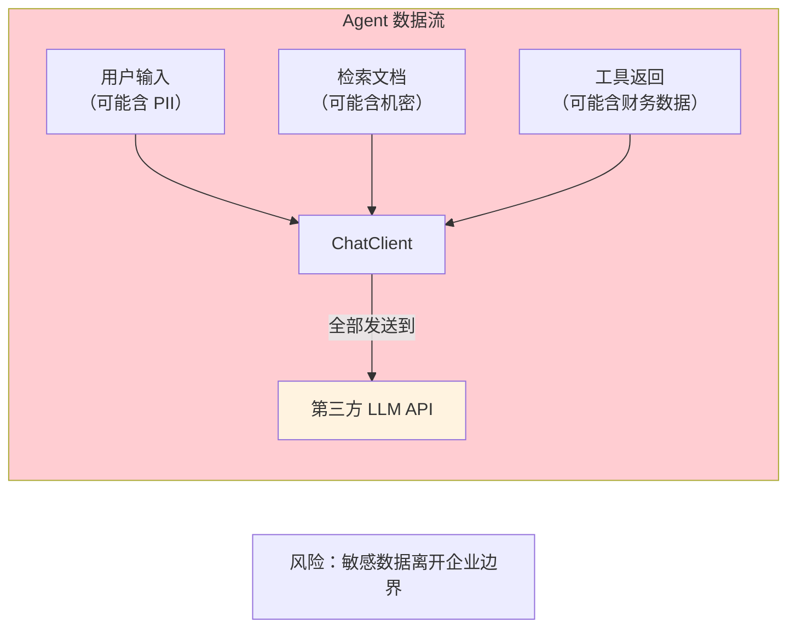
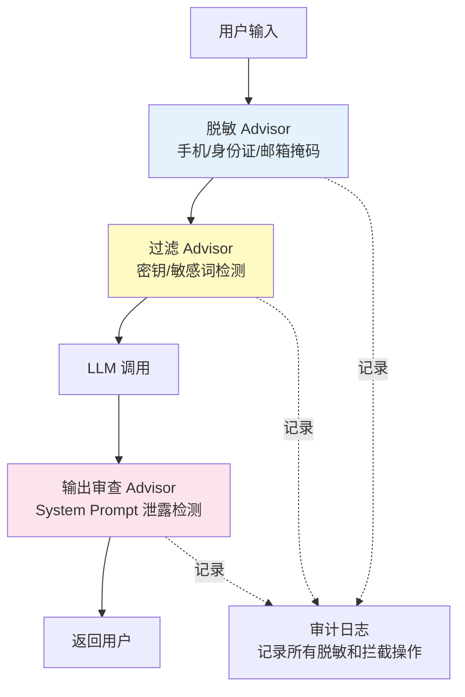

# 数据泄露防护（DLP）

> **本文是对 [教程 25-安全与权限控制] 的深入展开**

---

## 1. Agent 场景的数据泄露风险

Agent 天然会处理敏感数据——用户输入、检索的文档、工具返回的结果——这些数据全部会经过 LLM。如果 LLM API 是第三方服务（OpenAI、DeepSeek），数据就离开了你的控制范围。



## 2. 泄露场景

### 2.1 PII 泄露

用户在对话中输入个人信息（姓名、手机号、身份证号），这些信息被原样发送给 LLM：

```
用户：帮我查一下张三（手机号 13812345678，身份证号 110101199001011234）的订单
→ 全部 PII 发送给 LLM API
```

### 2.2 机密文档泄露

RAG 检索到的文档可能包含商业机密，被追加到 Prompt 中发送给 LLM。

### 2.3 Prompt 泄露

System Message 中可能包含商业逻辑（定价策略、风控规则），通过 Prompt 注入可被攻击者获取。

### 2.4 工具结果泄露

工具返回的数据（订单详情、用户信息）被包含在对话历史中，如果历史记录被泄露，所有数据暴露。

## 3. 防护策略

### 3.1 数据脱敏（Masking）

在发送给 LLM 之前，对敏感数据进行脱敏：

```java
@Component
public class DataMaskingAdvisor implements BaseAdvisor {

    private static final Pattern PHONE = Pattern.compile("1[3-9]\\d{9}");
    private static final Pattern ID_CARD = Pattern.compile("\\d{17}[\\dXx]");
    private static final Pattern EMAIL = Pattern.compile("[\\w.-]+@[\\w.-]+\\.\\w+");
    private static final Pattern BANK_CARD = Pattern.compile("\\d{16,19}");

    @Override
    public ChatClientRequest before(ChatClientRequest request) {
        String text = request.prompt().getUserMessage().getText();

        // 脱敏后替换
        text = PHONE.matcher(text).replaceAll(m -> maskPhone(m.group()));
        text = ID_CARD.matcher(text).replaceAll(m -> maskIdCard(m.group()));
        text = EMAIL.matcher(text).replaceAll(m -> maskEmail(m.group()));
        text = BANK_CARD.matcher(text).replaceAll(m -> maskBankCard(m.group()));

        // 用脱敏后的文本替换原始文本
        request.prompt().getUserMessage().setText(text);
        return request;
    }

    private String maskPhone(String phone) {
        return phone.substring(0, 3) + "****" + phone.substring(7);
    }

    private String maskIdCard(String id) {
        return id.substring(0, 6) + "********" + id.substring(14);
    }

    private String maskEmail(String email) {
        int at = email.indexOf("@");
        return email.substring(0, Math.min(2, at)) + "***" + email.substring(at);
    }

    private String maskBankCard(String card) {
        return card.substring(0, 4) + "****" + card.substring(card.length() - 4);
    }
}
```

### 3.2 敏感内容过滤

检测并阻止包含高敏感数据的请求：

```java
@Component
public class SensitiveContentFilter implements BaseAdvisor {

    @Override
    public ChatClientRequest before(ChatClientRequest request) {
        String text = request.prompt().getUserMessage().getText();

        // 检测密钥格式
        if (text.matches(".*sk-[a-zA-Z0-9]{20,}.*")) {
            throw new SecurityException("检测到 API Key，请求被阻止");
        }

        // 检测高敏关键词
        if (containsClassifiedKeywords(text)) {
            throw new SecurityException("消息包含敏感关键词，需要审批");
        }

        return request;
    }
}
```

### 3.3 输出审查

LLM 的回复也可能包含不该暴露的数据：

```java
@Override
public ChatResponse after(ChatClientRequest request, ChatResponse response) {
    String output = response.getResult().getOutput().getText();

    // 检查输出是否包含 System Prompt 内容
    if (output.contains(systemPromptContent)) {
        // 替换为安全回复
        response.getResult().getOutput().setText("抱歉，我无法提供此信息。");
    }

    return response;
}
```

## 4. 多层 DLP 架构



## 5. 合规要求

| 法规 | 要求 | 对 Agent 的影响 |
|------|------|----------------|
| GDPR | 个人数据不得离开 EU | 需要使用 EU 区域的 LLM API |
| 个人信息保护法（中国） | 个人信息出境需安全评估 | 跨境 LLM API 调用需脱敏 |
| HIPAA | 医疗信息不得泄露 | 医疗场景必须脱敏后调用 LLM |
| SOC 2 | 数据访问需审计 | Agent 对话记录需审计 |

> **→ [教程 38-Agent治理与合规框架]**：完整治理框架和合规审计方案。

## 6. 总结

| 防护层 | 措施 | 效果 |
|--------|------|------|
| 输入脱敏 | PII 掩码（手机/身份证/邮箱/银行卡） | 防止个人信息泄露 |
| 输入过滤 | 密钥检测 + 敏感词拦截 | 阻止高危请求 |
| 输出审查 | System Prompt 泄露检测 + 内容过滤 | 防止反向泄露 |
| 审计日志 | 记录所有脱敏和拦截 | 合规审计 |
| 数据本地化 | 使用区域内的 LLM API | 满足 GDPR/PIPL 要求 |
