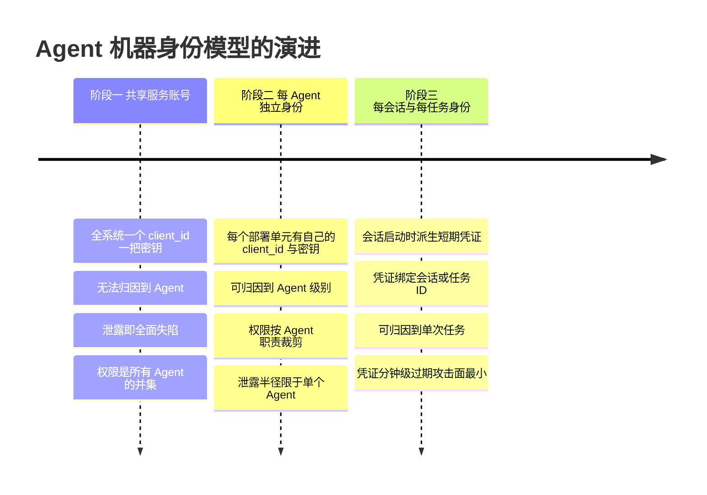
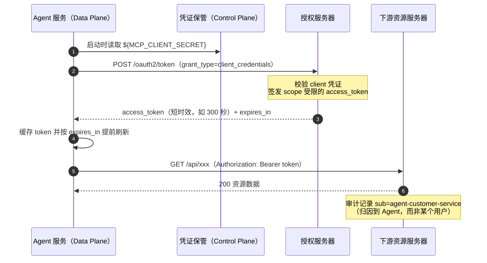
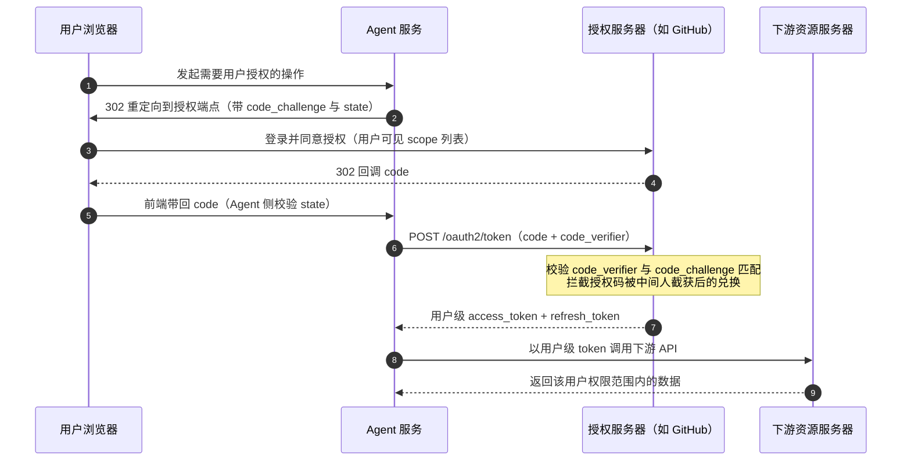
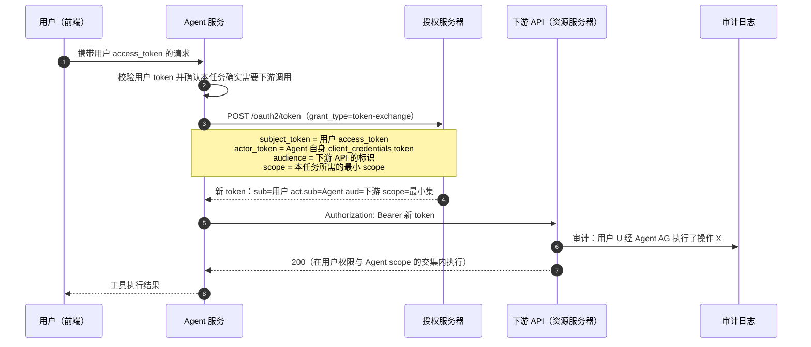

# Agent 机器身份与 OAuth：Agent 作为调用方的身份、凭证与授权

> **定位**：本文是对 [教程 04-企业级架构主干/11-安全与权限控制] 的安全深度下钻。教程 04/11 讲的是"用户侧"的权限控制（哪个用户能访问哪个 Agent 功能），本文补上全体系此前零覆盖的另一半：**Agent 自己作为调用方**去访问下游 API、MCP 服务器、数据库时的机器身份——它以谁的身份调用、凭证放在哪里、如何授权、如何审计、如何被攻击。读者画像是需要在生产环境落地 Agent 与下游系统调用链的中高级 Java 工程师与架构师。前置阅读：[教程 04-企业级架构主干/00-管控分离架构]（理解 Control Plane / Data Plane 分离）、[教程 01-WebFlux与响应式编程/06-线程模型与调度器]（理解 EventLoop 禁 block）、[教程 04-企业级架构主干/03-工具执行可观测与审计]（理解工具调用链路追踪）。
>
> 技术栈：Spring Boot 4.1 + Spring AI 2.0.0 + WebFlux + Java 21。文中所有 Spring AI / MCP SDK / Redis / WebClient 元素均经本地 jar `javap` 实证（详见正文标注）；Spring Security 相关类本地仓库未下载，一律标注「需引入依赖后 javap 实证」。

---

## 1. 为什么 Agent 需要独立的机器身份

### 1.1 一个必须先纠正的直觉：Agent 不是"用户的一部分"

传统三层 Web 应用里，"谁在调用"这个问题只有一个答案：用户。浏览器带着用户的 session 或 JWT 打到后端，后端以用户身份访问数据库——调用链上只有一个人类身份，一次登录贯穿全链。

Agent 系统把这个模型击碎了。一次用户请求在 Agent 内部会引爆一串**非人类调用方**：

```text
用户 → Agent 服务 → LLM API
                  → 检索服务（VectorStore）
                  → MCP 服务器（GitHub、Jira、数据库……）
                  → 业务工具（下单、转账、发邮件……）
```

这条链上的每一次出站调用都需要回答三个身份问题：**我（调用方）是谁？我替谁（如果有）行事？我被允许做什么？** 如果这三个问题没有显式的答案，系统会退化成两种失败模式之一：要么所有下游调用共享一个万能凭证（安全灾难），要么凭证被塞进 Agent 的运行时数据里随请求漂移（泄露灾难）。

需要特别强调：**用户身份和 Agent 身份是两个不同的安全主体**。用户身份回答"这个请求是谁发起的"，Agent 身份回答"这个请求是被哪个程序以什么权限执行的"。把两者混为一谈，是 Agent 身份设计中最常见也最昂贵的错误。

### 1.2 三个不可妥协的理由

**理由一：责任归因（Attribution）。** 出了事必须能回答"是谁干的"。一个 Agent 用共享服务账号把生产数据库删了，事后只能查到"服务账号 X 执行了 DROP TABLE"，查不到是哪个 Agent、哪个会话、替哪个用户执行。归因粒度决定了事故响应的速度，也决定了追责和法律意义上的可问责性（呼应 [附录 12-AI治理与合规/02-数据隐私与偏见检测] 中"处理活动的可问责"要求）。

**理由二：最小权限（Least Privilege）。** 不同 Agent 的职责不同，权限就该不同。客服 Agent 只该有工单读权限，运维 Agent 才该有重启服务权限。如果全部 Agent 共享一个服务账号，权限并集就是每个 Agent 的实际权限——任何一个 Agent 被注入（见 [附录 08-Agent安全深度/00-Prompt注入分类与案例]），攻击者立刻拿到全量权限。独立机器身份是"按 Agent 收缩权限面"的前提。

**理由三：审计（Audit）。** 合规审计（SOX、等保、EU AI Act 的高风险系统要求）要求的不是"系统做过什么"，而是"哪个自动化主体、在什么授权链条下、做了什么"。这要求每一次下游调用都携带可验证的身份声明，并且声明中的字段（subject / actor / audience）能拼出完整的委托链。没有独立机器身份，审计日志只是操作日志，不是授权证据。

### 1.3 身份模型演进：共享服务账号 → 每 Agent 身份 → 每会话/每任务身份

机器身份的粒度演进分三步，每一步都对应一次归因粒度和权限面收敛的跃迁：



| 维度 | 共享服务账号 | 每 Agent 身份 | 每会话/每任务身份 |
|------|-------------|--------------|------------------|
| 归因粒度 | 仅到"系统" | 到 Agent | 到会话/任务 |
| 权限面 | 所有 Agent 的并集 | 单 Agent 职责集 | 单任务所需最小集 |
| 泄露半径 | 全系统 | 单 Agent | 单会话/单任务 |
| 凭证管理成本 | 最低 | 中（N 个 client） | 高（需要派发与回收机制） |
| 适用阶段 | 原型 demo | 生产第一迭代 | 高合规/高权限场景 |

三个阶段的取舍很清晰：**粒度越细，凭证生命周期越短，管理成本越高**。架构上的推荐路径是"每 Agent 身份作为生产底线，每会话/每任务身份作为高危操作的增强"，而不是一步登天。这与 [附录 06-企业级架构模式/00-ControlPlane设计模式] 的结论一致：凭证的签发与回收属于 Control Plane 职责，Agent 的 Data Plane 只消费短期凭证，不保管长期密钥。

---

## 2. OAuth 2.0 核心授权流落进 Agent 场景

OAuth 2.0 的 grant type 不是"选一个用"，而是按调用场景对号入座。Agent 场景主要用到两种：机器对机器用 `client_credentials`，代理用户用 `authorization_code` + PKCE。on-behalf-of 委托链（第 3 节）建立在这两者之上。

### 2.1 client_credentials：Agent 以自己的身份调用

当 Agent 调用下游时**不需要携带用户语境**（比如拉取公共配置、调用与具体用户无关的内部服务、Agent 自身的健康上报），就用 client_credentials：Agent 用自己的 `client_id` + `client_secret`（或私钥 JWT / mTLS 证书）直接向授权服务器换 token。这对应"阶段二：每 Agent 身份"的模型。



三个工程要点：

1. **scope 在签发时就收窄**。给客服 Agent 签的 token 里只该有 `tickets:read tickets:write`，而不是全量 API scope。授权服务器上每个 client 注册一套 scope 白名单，这比运行时拦截更可靠。
2. **token 必须缓存复用**。每次工具调用都去换新 token 会把授权服务器打成瓶颈；正确做法是按 `expires_in` 减去安全余量做缓存与预刷新。
3. **client_secret 永不出 Control Plane**。密钥来自环境变量或密钥管理系统（`${ENV_VAR}` 占位注入），绝不写进配置文件仓库，更不能进 Prompt 或对话上下文（第 5.1 节展开）。

### 2.2 authorization_code + PKCE：Agent 代理用户调用

当 Agent 需要以**用户的数据权限**操作下游（读用户的 GitHub 仓库、以用户身份发日历邀请），机器自己的身份不够了——下游需要确认"用户本人同意过 Agent 代表自己"。这就是授权码流程 + PKCE：用户在浏览器里完成登录与同意，Agent 拿到的是"用户对 Agent 的授权"，而非用户的密码。



PKCE（`code_challenge` / `code_verifier`）最初为无后端的公共客户端设计，如今**机密客户端也建议启用**：Agent 的后端持有 code 只是必要条件，还需持有 verifier 才能兑换，授权码被日志或浏览器历史泄露后无法单独使用。对 Agent 的特殊意义在于：Agent 经常要在**异步、长时延**的场景下完成授权（用户发消息 → Agent 返回授权链接 → 用户点完同意 → 几分钟后对话恢复），授权码的有效期极短（通常 30 秒~10 分钟），所以"授权链接的下发、回调的接住、与原会话的重新关联"需要 Agent 侧有显式的状态机管理（state 参数绑定会话 ID），这与 [教程 04-企业级架构主干/04-多页面流式响应与会话管理] 讲的跨页面会话恢复是同一类问题。

### 2.3 Token 生命周期治理：短时效、刷新、轮换

| 机制 | 做法 | 架构意义 |
|------|------|---------|
| 短时效 access_token | 5~15 分钟过期，Resource Server 端无状态校验 | 泄露后攻击窗口以分钟计 |
| refresh_token 刷新 | 过期前用 refresh_token 静默换新，refresh_token 一次一换（rotation） | 用户体验无感，同时刷新被重放可被检测 |
| 密钥轮换 | client_secret / 签名密钥定期轮换，新旧并存窗口期平滑切换 | 密钥不再是"永久资产"，泄露影响有界 |
| 撤销（Revocation） | 用户撤销授权 / 运维强制吊销时，立即失效 refresh_token | 高危 Agent 必须有"一键断权"能力 |

生命周期治理的底层逻辑是**把凭证从"资产"降格为"耗材"**：资产怕丢（丢了要换锁），耗材无所谓（过期即弃）。Agent 系统凭证越多、分发越广，越要靠短时效+自动轮转让单点泄露的期望损失趋近于零——这与 [附录 08-Agent安全深度/02-数据泄露防护] 中"假设会泄露，收缩泄露后果"的威胁建模一致。

---

## 3. 委托链：on-behalf-of 与 Token Exchange（RFC 8693 概念层）

### 3.1 问题：三种调用身份模型

第 2 节的两种授权流各自只回答了一半问题。真实的 Agent 调用往往是"**用户发起、Agent 执行、下游落地**"的三元结构，下游需要同时知道两个主体。三种可选模型：

| 模型 | 下游看到的身份 | 归因能力 | 典型问题 |
|------|--------------|---------|---------|
| 纯机器身份 | 只有 Agent | 知道哪个 Agent，不知道替谁 | 用户级数据权限无法表达 |
| 纯用户身份（token 直接透传） | 只有用户 | 知道哪个用户，不知道哪个 Agent 执行 | Agent 权限不受控，等于用户全权代理 |
| 委托链（on-behalf-of） | 用户 + Agent 双主体 | 完整：谁、经谁、做了什么 | 需要授权服务器与下游配合 |

纯用户身份透传还有更隐蔽的危害：Agent 拿着原封不动的用户 token 去调用下游，等于 Agent 获得了**与用户完全等价的权限**，任何一次注入成功的工具调用都能以用户全权身份行事——这直接违反最小权限。正确解法是 Token Exchange。

### 3.2 Token Exchange 的授权流

RFC 8693 定义了 `urn:ietf:params:oauth:grant-type:token-exchange` 这一扩展 grant type：Agent 把"用户的 token + 自己的 token"交给授权服务器，换回一张**面向特定下游、声明了委托关系**的新 token。



### 3.3 act 声明与审计意义

换回的 token 里有两类关键声明（claims）：

- **`sub`（subject）**：数据主体，即被代理的用户。下游据此执行用户级的数据权限（他能看哪些订单、哪些表）。
- **`act`（actor）**：执行主体。`act.sub` 是 Agent 的 client_id；如果是多级委托（Agent A 调 Agent B 再调下游），`act` 会形成链式嵌套，每一级执行者都在场。

这就是"on-behalf-of"的精确含义：**用户是行为主体，Agent 是执行主体，两者都在凭证里显式在场**。下游的审计日志因此从"用户 X 做了操作"升级为"用户 X **通过 Agent AG**（携带授权服务器签发的委托凭证）做了操作"——这是 Agent 系统能给出的最强审计证据链，也是 [教程 08-架构师进阶/09-Agent治理与合规框架] 中"行为可归因"要求的协议层落点。同时，因为 scope 是按任务收窄后重新签发的，即使 Agent 被注入，攻击者拿到的也只是"本任务最小 scope + 短时效"的凭证，泄露后果被双重压缩。

**落地注意**：Token Exchange 需要授权服务器（Keycloak、Entra ID、Okta 等均支持）和下游资源服务器**双侧配合**——下游必须理解并校验 `act` 声明。若下游是改造不了的老系统，退而求其次的方案是"Agent 用自己的机器身份调用 + 在业务层头部/参数中携带用户 ID"，但必须清楚这弱化到了应用层约定，不再是密码学可验证的委托。

---

## 4. MCP 的 OAuth 授权层与 Spring AI 2.0 侧落地

### 4.1 MCP 规范的授权模型（概念层）

MCP 规范把授权建立在 OAuth 2.1 之上，其核心设定是：**MCP 服务器是 OAuth 的资源服务器（Resource Server）**。当客户端连上一个未携带凭证的 MCP 服务器时，服务器返回 `401` 与资源服务器元数据（`WWW-Authenticate` 头指向受保护资源元数据文档），客户端从中得知该去哪个授权服务器、怎么注册、申请什么 scope。规范还描述了**动态客户端注册（RFC 7591）**：通用 MCP 客户端事先不知道自己会连到哪些 MCP 服务器，可以运行时向授权服务器注册自己拿到 client_id——这正是"每会话身份"模型在 MCP 生态里的协议支撑。本节内容属于 MCP 规范层描述；工程上落地时以所用授权服务器对规范的支持程度为准。

### 4.2 实证：Spring AI 2.0.0 的 MCP 客户端没有现成 OAuth 配置键

对本项目锁定的版本做了本地 jar 实证（这是全体系铁律 0 的要求）：

- `spring-ai-autoconfigure-mcp-client-common-2.0.0.jar` 中的 `McpSseClientProperties`（前缀 `spring.ai.mcp.client.sse`，连接项 `connections.<name>.url` / `connections.<name>.sse-endpoint`）与 `McpStreamableHttpClientProperties`（前缀 `spring.ai.mcp.client.streamable-http`）的字节码常量池中**不存在任何 auth / token / oauth 相关配置键**；
- `McpClientCommonProperties`（`spring.ai.mcp.client`）只有 `enabled` / `name` / `version` / `initialized` / `request-timeout`。

结论：**Spring AI 2.0.0 的 MCP 客户端自动装配不内置 OAuth 流程**。给 MCP 服务器携带凭证，要走 MCP SDK 的传输层扩展点，在代码里显式挂接。

### 4.3 真实注入点：传输层请求定制器与授权错误处理器

MCP Java SDK 2.0.0（`io.modelcontextprotocol.sdk:mcp-core`）提供了两类经 javap 实证的扩展点：

```text
// javap 实证签名（mcp-core-2.0.0）
interface McpSyncHttpClientRequestCustomizer {
    void customize(java.net.http.HttpRequest.Builder builder, String method,
                   java.net.URI uri, String body, McpTransportContext context);
}
interface McpHttpClientAuthorizationErrorHandler {
    Publisher<Boolean> handle(java.net.http.HttpResponse.ResponseInfo responseInfo,
                              McpTransportContext context);   // 返回 true 表示"重试本次请求"
    default int maxRetries();
    static McpHttpClientAuthorizationErrorHandler fromSync(Sync sync);
    static final McpHttpClientAuthorizationErrorHandler NOOP;
}
// HttpClientStreamableHttpTransport.Builder 上的挂接方法（javap 实证）
Builder httpRequestCustomizer(McpSyncHttpClientRequestCustomizer)
Builder asyncHttpRequestCustomizer(McpAsyncHttpClientRequestCustomizer)
Builder authorizationErrorHandler(McpHttpClientAuthorizationErrorHandler)
```

`httpRequestCustomizer` 给每个 MCP 请求一个注入 `Authorization` 头的机会；`authorizationErrorHandler` 在收到 401 时被调用——返回 `true` 表示"我刷新了凭证，请重试"，配合 `maxRetries()` 实现"token 过期自动换新重发"。下面是一个组合两者的骨架（token 供给部分为概念代码，接口与挂接方法为实证 API）：

```java
// 需在 pom.xml 中添加（spring-ai-starter-mcp-client 已传递引入 mcp-core，此处显式列出仅为说明来源）：
// <dependency>
//     <groupId>org.springframework.ai</groupId>
//     <artifactId>spring-ai-starter-mcp-client</artifactId>
// </dependency>

import io.modelcontextprotocol.client.McpSyncClient;
import io.modelcontextprotocol.client.transport.customizer.McpHttpClientAuthorizationErrorHandler;
import io.modelcontextprotocol.client.transport.customizer.McpSyncHttpClientRequestCustomizer;
import java.net.http.HttpRequest;
import java.net.http.HttpResponse;
import java.time.Duration;
import org.springframework.ai.mcp.SyncMcpToolCallbackProvider;
import org.springframework.context.annotation.Bean;
import org.springframework.context.annotation.Configuration;
import reactor.core.publisher.Mono;

/**
 * MCP 客户端凭证注入。
 * 传输定制器与错误处理器为 MCP SDK 2.0.0 实证 API；
 * TokenHolder 的实现见下文 5.2（令牌预先驻留内存，此处只读）。
 * token 供给逻辑（授权服务器交互）为概念代码。
 */
@Configuration
public class McpAuthConfig {

    /** 为每个 MCP 请求注入 Bearer 头（实证接口：customize 为同步 void） */
    @Bean
    public McpSyncHttpClientRequestCustomizer mcpBearerCustomizer(McpTokenHolder tokenHolder) {
        return (HttpRequest.Builder builder, String method, java.net.URI uri,
                String body, io.modelcontextprotocol.common.McpTransportContext context) -> {
            String token = tokenHolder.currentToken(); // 内存中已就绪的短期 token，绝不 block
            if (token != null) {
                builder.header("Authorization", "Bearer " + token);
            }
        };
    }

    /** 收到 401 时：刷新凭证并允许重试（实证接口：handle 返回 Publisher<Boolean>） */
    @Bean
    public McpHttpClientAuthorizationErrorHandler mcp401Handler(McpTokenHolder tokenHolder) {
        final McpHttpClientAuthorizationErrorHandler.Sync sync =
                (HttpResponse.ResponseInfo responseInfo,
                 io.modelcontextprotocol.common.McpTransportContext context) -> {
            if (responseInfo.statusCode() == 401) {
                tokenHolder.forceRefresh(); // 触发后台刷新，本轮返回 true 让 SDK 重试
                return true;
            }
            return false;
        };
        return McpHttpClientAuthorizationErrorHandler.fromSync(sync);
        // 生产环境可链式包装 maxRetries 语义，防止 401 风暴下的无限重试
    }

    /** MCP 工具暴露为 Spring AI ToolCallback（实证构造器：SyncMcpToolCallbackProvider(List)） */
    @Bean
    public SyncMcpToolCallbackProvider mcpTools(java.util.List<McpSyncClient> mcpSyncClients) {
        return new SyncMcpToolCallbackProvider(mcpSyncClients);
    }
}
```

### 4.4 同步定制器的一个关键坑：customize() 是同步 void

`McpSyncHttpClientRequestCustomizer.customize(...)` 的签名是**同步 void**（javap 实证），它跑在请求线程上，里面不能发起响应式的 token 获取，更不能 block 等 Redis/授权服务器（WebFlux 铁律，见 [教程 01-WebFlux与响应式编程/06-线程模型与调度器]）。正确姿势是**凭证预先驻留内存**：由独立的响应式任务（定时预刷新 + 401 触发刷新）维护一个 `volatile` 的当前 token，定制器只做一次无锁读取。这也是下一节工程四件套中"令牌存储与读取分离"的原因。

---

## 5. 工程实现四件套

### 5.1 凭证与上下文组装隔离：凭证永不进 Prompt

Agent 与传统服务在凭证安全上的本质区别：Agent 有一个**会把任意字节发给第三方 LLM 的运行时**。凭证一旦出现在 Prompt、对话历史、检索文档或工具返回值里，就等于已经泄露（Prompt 注入诱导复述、日志落盘、LLM 提供商留存，见 [附录 08-Agent安全深度/02-数据泄露防护]）。

因此在架构上划定一条硬边界：**凭证只走"结构化旁路"，永远不进"模型可见通道"**。Spring AI 2.0 为此提供了现成的机制——`ToolContext`（`org.springframework.ai.chat.model.ToolContext`，javap 实证）：通过 `ChatClientRequestSpec.toolContext(Map)`（基线实证）传入的数据，只会到达 `ToolCallback.call(String, ToolContext)`（基线实证），**不会进入 messages / Prompt**。

```java
// Spring AI 2.0.0（toolContext 为基线实证 API；凭证来源为 ${ENV_VAR} 注入）
import java.util.Map;
import org.springframework.ai.chat.client.ChatClient;
import org.springframework.ai.chat.model.ToolContext;
import org.springframework.ai.tool.annotation.Tool;
import org.springframework.ai.tool.annotation.ToolParam;
import org.springframework.stereotype.Service;
import reactor.core.publisher.Mono;

@Service
public class TicketAgentService {

    private final ChatClient chatClient;

    public TicketAgentService(ChatClient.Builder builder) {
        this.chatClient = builder
                .defaultTools(new TicketTools())
                .build();
    }

    public Mono<String> handle(String conversationId, String userMessage, String downstreamToken) {
        return Mono.just(chatClient.prompt()
                .user(userMessage)
                // 凭证走 toolContext 旁路：只进工具执行线程，不进 LLM 上下文
                .toolContext(Map.of(
                        "downstreamToken", downstreamToken,
                        "conversationId", conversationId))
                .call()
                .content());
    }

    static class TicketTools {

        @Tool(name = "query_tickets", description = "按工单号查询工单详情")
        public String queryTickets(@ToolParam(description = "工单号") String ticketId,
                                   ToolContext context) {
            // context.getContext() 返回 toolContext 传入的 Map（基线实证）
            String token = (String) context.getContext().get("downstreamToken");
            // 用 token 调下游；返回值里也绝不能回显 token 本身
            return callDownstream(ticketId, token);
        }

        private String callDownstream(String ticketId, String token) {
            // WebClient 调用见 5.3，此处省略网络细节
            return "工单 " + ticketId + " 状态：处理中";
        }
    }
}
```

配套的两条纪律：其一，工具返回值、异常消息、Observation 标签（如 `spring.ai.tool.call.arguments` / `spring.ai.tool.call.result`，高基数标签会记录内容）都要过脱敏过滤器，防止凭证经可观测链路落盘（见 [教程 05-Observation可观测/04-自定义Convention与Filter：工业标签与脱敏]）；其二，对话记忆持久化层同样按 [附录 08-Agent安全深度/02-数据泄露防护] 的 DLP 策略做出口扫描，双保险。

### 5.2 令牌存储：ReactiveStringRedisTemplate

多实例部署下，token 缓存必须放在共享存储（否则每个实例各自向授权服务器要 token，刷新风暴且配额翻倍）。WebFlux 栈用响应式 Redis 客户端。以下签名全部经 `spring-data-redis-4.1.0.jar` javap 实证：

```java
// 需在 pom.xml 中添加依赖（Boot 4.1.0 管理版本）：
// <dependency>
//     <groupId>org.springframework.boot</groupId>
//     <artifactId>spring-boot-starter-data-redis-reactive</artifactId>
// </dependency>

import java.time.Duration;
import java.time.Instant;
import org.springframework.data.redis.core.ReactiveStringRedisTemplate;
import org.springframework.stereotype.Component;
import reactor.core.publisher.Mono;

/**
 * 令牌存储：Redis 侧只做"存/取/删"，签发与刷新由 TokenRefresher 负责。
 * 全部方法为响应式（EventLoop 安全）；get/set/delete/expire 为 javap 实证签名。
 */
@Component
public class ReactiveTokenStore {

    /** 过期前安全余量：留出网络与时钟偏差，避免拿到"临界过期"的 token */
    private static final Duration SAFETY_MARGIN = Duration.ofSeconds(60);

    private final ReactiveStringRedisTemplate redis;

    public ReactiveTokenStore(ReactiveStringRedisTemplate redis) {
        this.redis = redis; // Boot 自动装配的字符串序列化模板（构造器 javap 实证）
    }

    /** 写入 token，TTL 取 expires_in 减安全余量 */
    public Mono<Void> save(String key, String token, Duration expiresInSeconds) {
        Duration ttl = expiresInSeconds.compareTo(SAFETY_MARGIN) > 0
                ? expiresInSeconds.minus(SAFETY_MARGIN)
                : expiresInSeconds.dividedBy(2);
        return redis.opsForValue()                 // 实证：opsForValue() -> ReactiveValueOperations
                .set(key, token, ttl)              // 实证：set(K, V, Duration) -> Mono<Boolean>
                .then();
    }

    public Mono<String> load(String key) {
        return redis.opsForValue().get(key);       // 实证：get(Object) -> Mono<V>
    }

    /** 强制失效（撤销/轮换时调用） */
    public Mono<Boolean> evict(String key) {
        return redis.delete(key);                  // 实证：delete(K...) -> Mono<Long>
    }

    /** 刷新互斥锁：防止多实例同时刷新（实证：setIfAbsent(K, V, Duration)） */
    public Mono<Boolean> tryLock(String lockKey, Duration lease) {
        return redis.opsForValue().setIfAbsent(lockKey, Instant.now().toString(), lease);
    }
}
```

`TokenRefresher` 的职责闭环：定时扫描"即将过期"的 key → 用 `tryLock` 抢刷新互斥锁 → 响应式调用授权服务器（`WebClient`，非阻塞）→ `save` 写回。而 4.4 节的 `McpTokenHolder` 在内存里再垫一层：启动时与 401 时从本 Store 拉取，供同步定制器无锁读取。

### 5.3 WebClient 传播：ExchangeFilterFunction

先说一个实证结论：**Spring Framework 7.0.8 的 `WebClient` 请求规格上不存在 `bearerAuth(String)` 方法**（对 `WebClient$RequestHeadersSpec` 全量方法 javap 检索为 0 命中；那是 `RestClient` 的 API）。WebClient 里传播 Bearer 凭证的标准做法是 `ExchangeFilterFunction`（以下全部签名经 javap 实证）：

```java
// Spring Framework 7.0.8（Boot 4.1.0 传递管理），签名全部 javap 实证
import org.springframework.web.reactive.function.client.ClientRequest;
import org.springframework.web.reactive.function.client.ExchangeFilterFunction;
import org.springframework.web.reactive.function.client.WebClient;
import reactor.core.publisher.Mono;

public final class BearerAuthFilter {

    /** 从响应式来源（Redis / 内存 Holder）取 token 并注入请求头 */
    public static ExchangeFilterFunction bearer(Mono<String> tokenSource) {
        return ExchangeFilterFunction.ofRequestProcessor(request ->     // 实证工厂方法
                tokenSource.flatMap(token ->
                        Mono.just(ClientRequest.from(request)            // 实证：from(ClientRequest)
                                .header("Authorization", "Bearer " + token) // 实证：header(String, String...)
                                .build())));
    }

    public static WebClient downstreamWebClient(ExchangeFilterFunction authFilter) {
        return WebClient.builder()               // 实证：WebClient.builder()
                .baseUrl("https://downstream.example.com")
                .filter(authFilter)              // 实证：Builder.filter(ExchangeFilterFunction)
                .build();
    }
}
```

如果接入 Spring Security 的 OAuth2 客户端栈，还有另一条路：`ServerOAuth2AuthorizedClientExchangeFilterFunction` 挂到 WebClient 上，由框架自动完成"取授权记录→按需刷新→注入请求头"。该类属 spring-security-oauth2-client，**本地仓库未下载（仅有 BOM），属缺失依赖类——需引入依赖后 javap 实证再用**，此处不展开其签名。

### 5.4 Spring Security Reactive 栈接入（依赖标注 + 概念代码）

生产环境让授权校验、token 刷新、资源服务器语义由安全框架托管，通常引入两个 starter（**需在 pom.xml 中添加依赖；以下 Security 类均为标准生态类但本地未下载，须引入依赖后 javap 实证**）：

```xml
<!-- 需在 pom.xml 中添加依赖（版本由 Spring Boot 4.1.0 parent 管理） -->
<dependency>
    <groupId>org.springframework.boot</groupId>
    <artifactId>spring-boot-starter-security</artifactId>
</dependency>
<dependency>
    <groupId>org.springframework.boot</groupId>
    <artifactId>spring-boot-starter-oauth2-resource-server</artifactId>
</dependency>
<!-- Agent 作为 OAuth2 客户端（client_credentials / authorization_code）时追加 -->
<dependency>
    <groupId>org.springframework.boot</groupId>
    <artifactId>spring-boot-starter-oauth2-client</artifactId>
</dependency>
```

```yaml
# 概念配置（键名以引入依赖后的 Boot 官方文档为准）：
spring:
  security:
    oauth2:
      client:
        registration:
          ticket-service:
            client-id: ${OAUTH_CLIENT_ID}
            client-secret: ${OAUTH_CLIENT_SECRET}
            authorization-grant-type: client_credentials
            scope: tickets:read,tickets:write
        provider:
          ticket-service:
            token-uri: ${OAUTH_TOKEN_URI}
```

接入后的分工：**Spring Security 管"凭证从哪来、何时刷新、放进哪个安全上下文"；本文 5.1~5.3 的旁路设计管"凭证如何到达工具执行点且不污染模型上下文"**。两者是互补而非替代关系。特别提醒响应式栈的两个易错点：其一，响应式环境里的安全上下文不是 ThreadLocal，而是随 Reactor 管道传播的 Context（`SecurityContext` 的读取要与 [教程 01-WebFlux与响应式编程/01-Reactor核心] 的 Reactor Context 用法对齐）——这正是 CLAUDE.md WebFlux 铁律"禁止 ThreadLocal 传上下文"在安全场景的具体化；其二，`SecurityContextHolder` 及响应式变体类的确切 API 以引入依赖后的本地 jar 实证为准，不得凭记忆书写。

---

## 6. 失效模式与威胁模型

身份与授权机制自身也是攻击面。Agent 场景下三类高频威胁及对策：

| 威胁 | 场景描述 | 危害 | 检测信号 | 缓解措施 |
|------|---------|------|---------|---------|
| 令牌泄露 | token 进入 Prompt/日志/Observation 标签/记忆持久化，或被注入诱导经工具外传 | 以 token 主体的权限失陷 | token 值出现在日志/工具参数中；同 token 异地调用；401 后旧 token 仍被使用 | 5.1 旁路隔离；存储加密+短 TTL；泄露即 `evict` 撤销；DLP 出口扫描（[附录 08-Agent安全深度/02-数据泄露防护]） |
| 混淆代理问题（Confused Deputy） | 高权限 Agent 被低权限用户的注入内容驱动，用**自己的**（而非用户的）高权限凭证执行了用户本无权做的操作 | 权限越级，审计只见 Agent 不见真凶 | act 链缺失的调用；Agent 身份调用频率异常；任务 scope 与用户历史行为不匹配 | 强制 Token Exchange 让 sub/act 双主体在场；下游校验 `act` 与 `sub` 的授权关系；任务级 scope 收窄；危险操作挂 HITL 审批（[教程 04-企业级架构主干/08-Human-in-the-Loop与审批流]） |
| 权限蔓延 | Agent 职责扩张（新工具、新下游）时 scope 只增不减；多 Agent 共享 client 图省事 | 最小权限名存实亡，泄露半径持续变大 | scope 清单随版本单调增长；同一 client_id 出现在多个部署单元 | scope 定期审计与回收；每 Agent 独立 client（1.3 阶段二）；权限申请走 Control Plane 审批（[附录 06-企业级架构模式/00-ControlPlane设计模式]） |

三个威胁共享同一条根因主线：**"Agent 的权限"脱离了"任务的授权"独立存在**。检测与缓解的公分母是把委托链做成一等公民——每一次下游调用都能回答"sub 是谁、act 是谁、scope 为什么是这么多、哪次用户同意授权的"。有了这条链，令牌泄露可以被撤销止血，混淆代理可以被 act 校验拦截，权限蔓延可以被 scope 审计发现。跨服务的 traceId 打通（[教程 05-Observation可观测/06-Trace链路：traceId贯穿HTTP、LLM、工具与日志]）再把这些信号串成可调查的证据链。

---

## 7. 适用场景与不适用场景

**适用场景**：

- Agent 需要以自身或用户身份调用下游 API / MCP 服务器，且下游支持 OAuth 2.0 / OIDC；
- 企业级多 Agent 系统需要按 Agent / 按任务归因与审计（合规、事故调查）；
- 多实例部署需要共享 token 缓存与刷新协调；
- 高权限操作（数据删除、资金变动、生产变更）需要用户级委托凭证 + 最小 scope。

**不适用场景**：

- 授权服务器或下游 API 不支持 Token Exchange / `act` 声明校验时，强上委托链会退化为应用层约定（此时应显式声明弱化，另配业务层审批兜底）；
- 纯本地、单用户、无网络的实验型 Agent（如本地 Ollama demo），引入完整 OAuth 是过度设计，环境变量密钥 + 本地文件权限即可；
- MCP 服务器以 stdio 运行在同一信任边界内（本机子进程），传输层注入 Authorization 头不适用，凭证管控应转为进程级沙箱与文件权限问题（[附录 16-Agent沙箱与执行环境] 方向）。

---

## 总结

本文补上了 Agent 安全拼图中"调用方身份"这一块，核心结论可以压成五条：

1. **用户身份 ≠ Agent 身份**：责任归因、最小权限、审计三个理由决定了 Agent 必须有独立机器身份；粒度按"共享账号 → 每 Agent → 每会话/每任务"演进，生产底线是每 Agent 身份。
2. **授权流按场景对号入座**：机器对机器用 client_credentials，代理用户用 authorization_code + PKCE，"用户发起、Agent 执行"用 Token Exchange（RFC 8693）把 sub/act 双主体写进凭证。
3. **Spring AI 2.0.0 的 MCP 客户端不内置 OAuth**（本地 jar 实证无任何 auth 配置键），凭证注入走 MCP SDK 传输层实证扩展点：`httpRequestCustomizer`（同步 void，凭证须预先驻留内存）+ `authorizationErrorHandler`（401 触发刷新重试）。
4. **工程四件套**：凭证只走 `ToolContext` 结构化旁路、永不进 Prompt；token 用 `ReactiveStringRedisTemplate` 共享缓存并留安全余量；WebClient 用 `ExchangeFilterFunction` 注入（`bearerAuth` 在 WebClient 上不存在，实证）；Spring Security Reactive 托管凭证生命周期，安全上下文走 Reactor Context 而非 ThreadLocal。
5. **威胁模型的公分母是委托链**：令牌泄露靠撤销止血、混淆代理靠 act 校验拦截、权限蔓延靠 scope 审计发现——三者都要求"每次调用可回答 sub/act/scope/同意来源"。

## 延伸阅读

- [教程 04-企业级架构主干/11-安全与权限控制]——用户侧权限控制的教材主线
- [教程 04-企业级架构主干/08-Human-in-the-Loop与审批流]——高危操作的人工闸门，与混淆代理缓解配套
- [教程 08-架构师进阶/09-Agent治理与合规框架]——NIST AI RMF / EU AI Act 视角的治理框架
- [附录 08-Agent安全深度/00-Prompt注入分类与案例]、[附录 08-Agent安全深度/01-ToolPoisoning攻击]、[附录 08-Agent安全深度/02-数据泄露防护]——本文威胁模型的攻击侧教材
- [附录 06-企业级架构模式/00-ControlPlane设计模式]——凭证签发与策略管控的 Control Plane 归属
- RFC 8693（OAuth 2.0 Token Exchange）、RFC 7591（OAuth 2.0 Dynamic Client Registration）、MCP 规范 Authorization 章节（https://modelcontextprotocol.io/specification）——本文协议层内容的规范来源
