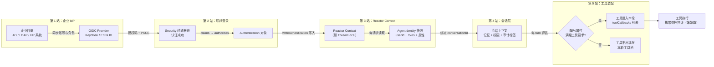
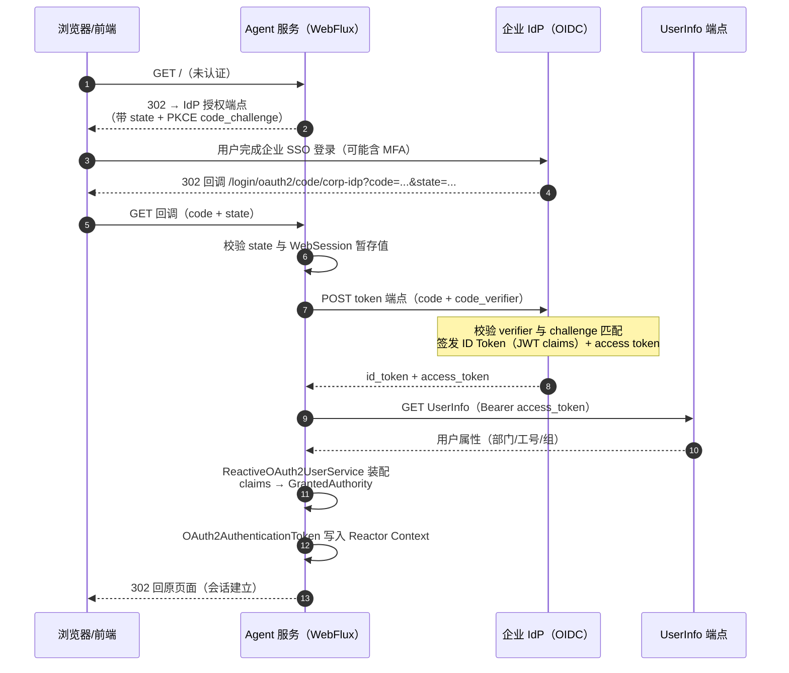
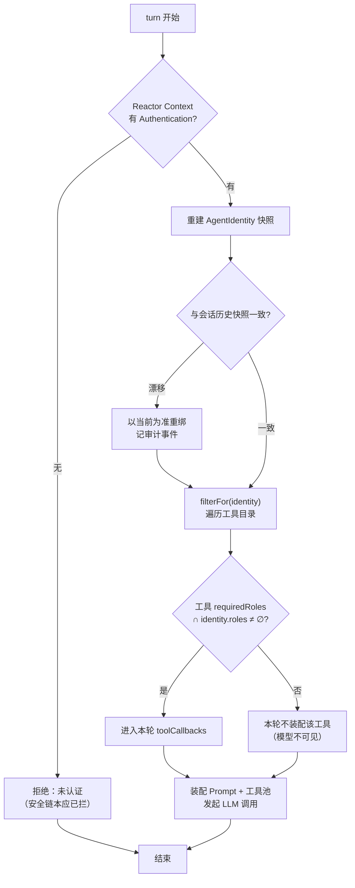
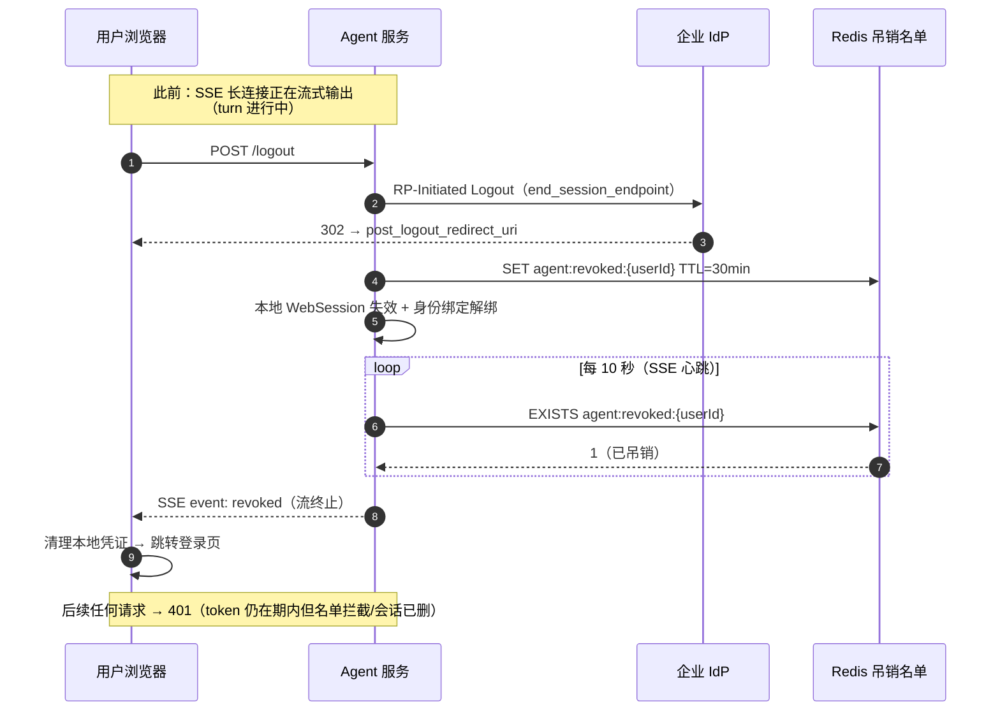

# 用户身份联邦与企业权限传导：从企业 IdP 到工具调用点

> **定位**：本文是 [附录 08-Agent安全深度/03-Agent机器身份与OAuth] 的姊妹篇。该篇讲清楚了"Agent 自己作为调用方"的机器身份（client_credentials、Token Exchange、MCP 传输层凭证注入）；本文补上另一半——**用户侧**：企业的员工身份如何经 OIDC 联邦登录进入 Agent 服务、身份声明（claims）如何沿 Reactor 管道传导为会话上下文、企业目录里的角色与属性如何变成每一轮对话的工具权限，以及用户注销/令牌吊销如何"追上"还活着的 SSE 长连接。读者画像：需要在企业内网把 Agent 接入公司统一登录（Keycloak / Entra ID / Okta 等）、并让 Agent 的工具权限跟随员工职权走的中高级 Java 工程师与架构师。前置阅读：[教程 04-企业级架构主干/11-安全与权限控制]（权限分级主线）、[教程 01-WebFlux与响应式编程/01-Reactor核心]（Reactor Context 机制）、[教程 02-SpringAI核心机制/05-工具调用进阶与ToolCallingManager]（工具装配管线）。
>
> 技术栈：Spring Boot 4.1.0 + Spring Security 7.1.0（Boot 4.1.0 管理）+ Spring AI 2.0.0 + WebFlux + Java 21。**本文所有 Spring Security 7.1.0 / Spring Boot 4.1.0 / Spring Framework 7.0.8 / Spring AI 2.0.0 类与方法均经本地 Maven 仓库 jar `javap` 实证**（Security 7.1.0 各模块 jar 为写作本篇时经 `mvn dependency:get` 拉取后实证），文中以 `// 实证` 注释标注；极少量无法实证的逻辑片段显式标注「概念代码」。

---

## 1. 全景：一条用户身份的完整旅程

### 1.1 与姊妹篇的分工：两个安全主体，两条证据链

[附录 08-Agent安全深度/03-Agent机器身份与OAuth] 的第 1 节给出了本体系的身份模型基石：**用户身份和 Agent 身份是两个不同的安全主体**。那篇解决的是"Agent 以谁的身份调用下游"——机器身份、委托链、MCP 凭证注入。但用户主体自身的生命周期在那篇里是一个黑盒：用户是谁、登录过程走什么协议、企业的组织角色怎么变成 Agent 里的权限、员工离职或注销后系统如何收敛——这些就是本篇的内容。两篇合起来才是完整授权链：**本篇回答"用户有资格让 Agent 做什么"（入口侧授权），姊妹篇回答"Agent 有资格以谁的名义做什么"（出口侧委托）**。

两条证据链的交汇点是每一次工具调用：审计日志里既要有"哪个用户在哪个会话里发起了这次调用"（本篇的职责），也要有"哪个 Agent 主体携带什么凭证执行了它"（姊妹篇的职责）。缺了前者，你无法回答业务方"为什么张三能导出这批数据"；缺了后者，你无法回答安全团队"这次导出是哪个服务主体干的"。

### 1.2 五站传导全景

用户身份从企业 IdP 出发到工具执行点，要经过五站"翻译"，每一站都有丢失或放大的风险：



这张图里最容易出问题的是"站间语义漂移"：IdP 里的 `roles` claim、Security 的 `GrantedAuthority`、会话快照里的 `roles` 集合、工具目录里的权限要求，是**四个同名但可能含义错位的集合**。第 4 节会专门讲如何在每一站钉死语义。

### 1.3 为什么"传导"是 Agent 场景的专属难题

传统 CRUD 应用里，用户身份的用途收敛在 HTTP 请求边界内：查一次 `SecurityContextHolder`、做一次方法级鉴权，故事就结束了。Agent 场景把身份的"消费点"从请求边界推进到了三个更深的层次：

1. **每 turn 的工具装配点**。Spring AI 2.0 的工具池是按请求装配的——`ChatClient.prompt().toolCallbacks(...)` 每一轮都可以不同。这意味着权限不再是一次登录时的静态快照，而是**每一轮对话都要重新评估的动态决策**。这既是风险（评估点变多）也是机会（权限变更可以秒级生效，不必等令牌过期）。
2. **跨请求的长会话**。一个 Agent 会话（conversation）跨越多次 HTTP 请求、多条 SSE 连接、可能持续数小时。第一次请求认证过的身份，如何让第十次请求、第 N 条 SSE 流依然可信？身份与 conversationId 的绑定关系本身就是需要保护的资产（第 6 节的注销难题正源于此）。
3. **模型可见与不可见的边界**。身份属性（用户 ID、部门、级别）既需要传给工具（ABAC 判定），又绝不能进 Prompt（Prompt 注入可以诱导模型复述或滥用它们，见 [附录 08-Agent安全深度/00-Prompt注入分类与案例]）。这个"同一份数据、两种可达性"的矛盾在传统 Web 应用里不存在。

---

## 2. 企业 IdP 对接：OIDC 授权码流（Authorization Code + PKCE）

### 2.1 为什么必须接企业 IdP，而不是自建账号体系

企业内落地 Agent，账号体系没有第二个选项：**员工的身份资产在 IdP（Keycloak、Entra ID、Okta、钉钉/飞书企业版等）里，Agent 必须做联邦客户端（Relying Party）**。自建账号体系看起来"省了对接成本"，实际上丢掉的是 IdP 免费送给你的三样东西：

| IdP 免费提供 | 自建账号体系的代价 |
|------|------|
| MFA、条件访问（异地/设备合规策略） | 自建 MFA 是安全工程，不是登录表单 |
| 账号生命周期（入职开通/离职即禁用） | 离职后 Agent 权限残留是高危合规问题 |
| 统一审计（每次登录 IdP 都有记录） | Agent 私有账号脱离企业审计视野 |

协议上，OIDC（OpenID Connect）= OAuth 2.0 + 身份层：授权码流程走完后多拿一个 **ID Token**（JWT，承载 `sub`、邮箱、组等 claims），加上标准化的 **UserInfo 端点**。Agent 服务作为机密客户端（confidential client）在 IdP 注册，走 Authorization Code + PKCE——姊妹篇 2.2 节讲过这个流程的"下游 API 授权"视角（Agent 拿用户 token 调下游），本节的视角不同：**这里是"用户登录 Agent"本身**，ID Token 是主角，access token 只是副产品。

### 2.2 依赖与配置键：Boot 4.1 的模块化落点（实证）

Boot 4.x 完成了 autoconfigure 的模块化拆分，OAuth2 客户端配置不再住在 `spring-boot-autoconfigure` 里。实证结论：

```text
// 实证（jar tf + javap，spring-boot-security-oauth2-client-4.1.0.jar）
// 自动配置类：org.springframework.boot.security.oauth2.client.autoconfigure.OAuth2ClientAutoConfiguration
// 响应式侧：  ...autoconfigure.reactive.ReactiveOAuth2ClientAutoConfiguration
//            ...autoconfigure.reactive.ReactiveOAuth2ClientWebSecurityAutoConfiguration
// 配置属性：  OAuth2ClientProperties —— getRegistration(): Map<String, Registration>
//                                      getProvider(): Map<String, Provider>
// Registration 字段（javap）：clientId / clientSecret / clientAuthenticationMethod
//                            / authorizationGrantType / redirectUri / scope / provider / clientName
```

依赖与配置（需在 pom.xml 中添加依赖，版本由 Boot 4.1.0 parent 管理）：

```xml
<!-- 需在 pom.xml 中添加依赖 -->
<dependency>
    <groupId>org.springframework.boot</groupId>
    <artifactId>spring-boot-starter-oauth2-client</artifactId>
</dependency>
```

```yaml
spring:
  security:
    oauth2:
      client:
        registration:
          corp-idp:                      # registrationId，客户可自定
            client-id: ${OAUTH_CLIENT_ID}
            client-secret: ${OAUTH_CLIENT_SECRET}
            authorization-grant-type: authorization_code
            redirect-uri: "{baseUrl}/login/oauth2/code/{registrationId}"
            scope: openid,profile
            client-name: Agent Platform
        provider:
          corp-idp:
            issuer-uri: ${OIDC_ISSUER_URI}   # IdP 的 issuer，启动时拉取发现文档
            # 也可显式指定：
            # authorization-uri / token-uri / jwk-set-uri / user-info-uri / user-name-attribute
```

配置键结构与上面 `OAuth2ClientProperties` 的 `getRegistration()/getProvider()` 两条 Map 一一对应（实证）。`issuer-uri` 方式下，Boot 启动时请求 IdP 的 `/.well-known/openid-configuration` 自动补全各端点——企业 IdP 换地址、换端口都不用改 Agent 配置，这是联邦的本意。

### 2.3 ServerHttpSecurity 的 DSL：实证后的最小配置

响应式安全链的入口是 `ServerHttpSecurity`（包 `org.springframework.security.config.web.server`，spring-security-config 7.1.0）。以下签名全部经 javap 实证：

```text
// 实证（javap spring-security-config-7.1.0.jar）
static ServerHttpSecurity http()                          // 静态工厂
ServerHttpSecurity authorizeExchange(Customizer<AuthorizeExchangeSpec>)
ServerHttpSecurity oauth2Login(Customizer<OAuth2LoginSpec>)      // 注意：reactive 侧也有 oauth2Login
ServerHttpSecurity oauth2Client(Customizer<OAuth2ClientSpec>)
ServerHttpSecurity oauth2ResourceServer(Customizer<OAuth2ResourceServerSpec>)
ServerHttpSecurity oidcLogout(Customizer<OidcLogoutSpec>)
ServerHttpSecurity logout(Customizer<LogoutSpec>)
ServerHttpSecurity csrf(Customizer<CsrfSpec>)
ServerHttpSecurity addFilterAt(WebFilter, SecurityWebFiltersOrder)
SecurityWebFilterChain build()
// AuthorizeExchangeSpec.Access（javap 实证）：
//   permitAll() / denyAll() / hasRole(String) / hasAuthority(String)
//   / authenticated() / access(ReactiveAuthorizationManager<AuthorizationContext>)
// SecurityWebFiltersOrder 常量（javap 实证）：AUTHENTICATION / AUTHORIZATION
//                                            / OAUTH2_AUTHORIZATION_CODE / EXCEPTION_TRANSLATION
```

一个值得单独点名的实证纠错：**`oauth2Login(...)` 在响应式的 `ServerHttpSecurity` 上真实存在**（7.1.0 javap 实证），不少旧资料声称"reactive 只能用 `oauth2Client`"，对 7.1.0 已不成立。OIDC 登录用 `oauth2Login`，它装配的过滤器链会处理授权码回调、建立 `OAuth2AuthenticationToken` 并写入安全上下文。

```java
// Spring Security 7.1.0（Boot 4.1.0 管理），全部 API javap 实证
import org.springframework.context.annotation.Bean;
import org.springframework.context.annotation.Configuration;
import org.springframework.security.config.annotation.web.reactive.EnableWebFluxSecurity;
import org.springframework.security.config.web.server.ServerHttpSecurity;
import org.springframework.security.web.server.SecurityWebFilterChain;

@Configuration
@EnableWebFluxSecurity
public class AgentSecurityConfig {

    @Bean
    public SecurityWebFilterChain springSecurityFilterChain(ServerHttpSecurity http) {
        return http
                // 实证：csrf(Customizer)；SSE/前端为 token 化客户端时可关闭，
                // 浏览器表单场景必须保留
                .csrf(ServerHttpSecurity.CsrfSpec::disable)
                // 实证：authorizeExchange + Access 链
                .authorizeExchange(exchanges -> exchanges
                        .pathMatchers("/login/**", "/oauth2/**", "/actuator/health").permitAll()
                        .pathMatchers("/api/admin/**").hasRole("PLATFORM_ADMIN")   // 实证：hasRole(String)
                        .anyExchange().authenticated())                             // 实证：anyExchange().authenticated()
                // 实证：oauth2Login(Customizer)——授权码 + PKCE 的完整过滤器链
                .oauth2Login(org.springframework.security.config.Customizer.withDefaults())
                .build();   // 实证：build() -> SecurityWebFilterChain
    }
}
```

`Customizer.withDefaults()` 是开箱链；`oauth2Login` 的 `OAuth2LoginSpec` 内可挂自定义 `ReactiveOAuth2UserService`（下一小节）。`pathMatchers` 继承自 `AbstractServerWebExchangeMatcherRegistry`（实证），支持 Ant 风格路径。

### 2.4 PKCE：机密客户端也要开

姊妹篇 2.2 节讲过 PKCE 对 Agent 异步授权场景的意义。在"用户登录 Agent"这条流里，PKCE 的角色是：授权码即便经浏览器历史、日志、Referer 泄露，没有 `code_verifier` 也无法兑换。Spring Security 7 的客户端链对 `authorization_code` grant **默认启用 PKCE**（7.x 行为，官方迁移文档同口径），工程上需要确认的只有两点：其一，授权请求的暂存位置——默认实现是 `WebSessionOAuth2ServerAuthorizationRequestRepository`（javap 实证，位于 oauth2-client 的 `web.server` 包，接口 `ServerAuthorizationRequestRepository` 亦实证），把 `state` 与 verifier 存进 WebSession，分布式部署时 WebSession 要落到共享存储（Spring Session Reactive 或自研，否则负载均衡会把授权流打散）；其二，verifier 在 `OAuth2AuthorizationRequest.getAttributes()` 里以 `PkceParameterNames.CODE_VERIFIER` 为键——实证（javap）：

```text
// 实证（javap spring-security-oauth2-core-7.1.0.jar）
final class PkceParameterNames {
    String CODE_CHALLENGE;          // 发给 IdP 的挑战值
    String CODE_CHALLENGE_METHOD;   // 通常 "S256"
    String CODE_VERIFIER;           // 仅服务端持有的验证值，存在 OAuth2AuthorizationRequest.getAttributes()
}
// OAuth2AuthorizationRequest（javap 实证）：
//   getAuthorizationUri() / getGrantType() / getRedirectUri()
//   / getScopes() / getState() / getAttributes(): Map<String,Object>
```

需要自研"授权请求跨设备恢复"（比如用户在手机上点同意、回到工位继续对话）时，就要把含 verifier 的 `OAuth2AuthorizationRequest` 迁出 WebSession 自己管理——这是少数必须碰 `CODE_VERIFIER` 的场景。

### 2.5 联邦登录全程时序



注意第 12~13 步是 Agent 侧可以**完全接管**的一环——这就是下一小节。

### 2.6 ReactiveOAuth2UserService：把 IdP 响应变成"企业身份"

IdP 返回的 claims 是"裸数据"（`department`、`employeeNumber`、`groups`……）；Security 的 `GrantedAuthority` 是"决策依据"。两者的翻译器就是 `ReactiveOAuth2UserService`。实证签名：

```text
// 实证（javap spring-security-oauth2-client-7.1.0.jar）
interface ReactiveOAuth2UserService<R extends OAuth2UserRequest, U extends OAuth2User> {
    Mono<U> loadUser(R userRequest) throws OAuth2AuthenticationException;
}
class DefaultReactiveOAuth2UserService implements ReactiveOAuth2UserService<OAuth2UserRequest, OAuth2User> {
    Mono<OAuth2User> loadUser(OAuth2UserRequest userRequest)
    void setWebClient(WebClient webClient)          // 换成你自己的 WebClient（超时/代理可控）
    void setAttributesConverter(Converter<OAuth2UserRequest, Converter<Map<String,Object>, Map<String,Object>>>)
}
// OAuth2UserRequest（javap 实证）：getClientRegistration() / getAccessToken() / getAdditionalParameters()
// OAuth2User 经 OAuth2AuthenticatedPrincipal（javap 实证）：
//   Map<String,Object> getAttributes() / Collection<? extends GrantedAuthority> getAuthorities()
//   <A> A getAttribute(String)
```

定制点的设计原则：**装饰 `DefaultReactiveOAuth2UserService`，而不是替换它**——让它继续完成 IdP 通信、token 校验、UserInfo 拉取这些标准动作，你只在结果上追加"企业语义"：

```java
// Spring Security 7.1.0，全部 API javap 实证
import java.util.HashSet;
import java.util.Map;
import java.util.Set;

import org.springframework.security.core.GrantedAuthority;
import org.springframework.security.core.authority.SimpleGrantedAuthority;   // 实证：SimpleGrantedAuthority(String)
import org.springframework.security.oauth2.client.userinfo.DefaultReactiveOAuth2UserService;
import org.springframework.security.oauth2.client.userinfo.OAuth2UserRequest;
import org.springframework.security.oauth2.client.userinfo.ReactiveOAuth2UserService;
import org.springframework.security.oauth2.core.user.OAuth2User;
import org.springframework.stereotype.Component;

import reactor.core.publisher.Mono;

/**
 * 把 IdP 的 claims 翻译成企业权限语义。
 * 装饰 DefaultReactiveOAuth2UserService：标准流程不重写，只追加角色映射。
 */
@Component
public class EnterpriseOAuth2UserService
        implements ReactiveOAuth2UserService<OAuth2UserRequest, OAuth2User> {   // 实证：接口签名

    private final DefaultReactiveOAuth2UserService delegate = new DefaultReactiveOAuth2UserService();

    @Override
    public Mono<OAuth2User> loadUser(OAuth2UserRequest userRequest) {           // 实证：Mono<U> loadUser(R)
        return delegate.loadUser(userRequest).map(user -> {
            Map<String, Object> claims = user.getAttributes();                  // 实证：getAttributes()
            Set<GrantedAuthority> mapped = new HashSet<>(user.getAuthorities()); // 实证：getAuthorities()

            // 企业 RBAC：IdP 的 groups claim → ROLE_ 前缀 authority
            Object groups = claims.get("groups");
            if (groups instanceof java.util.Collection<?> list) {
                list.forEach(g -> mapped.add(new SimpleGrantedAuthority("ROLE_" + g)));
            }
            // ABAC 原始属性保留在 attributes 中（部门、数据级别），不做扁平化
            return new org.springframework.security.oauth2.core.user.DefaultOAuth2User(
                    mapped, claims, "sub");
        });
    }
}
```

（`DefaultOAuth2User` 位于 `org.springframework.security.oauth2.core.user`，javap 实证存在于 spring-security-oauth2-core。）

两个铁的纪律：其一，**映射规则要版本化**——`groups → ROLE_` 的翻译写死在代码里，IdP 侧加组、改组名时会静默失效；把映射表做成配置（Control Plane 下发），并在第 7 节的失效模式里盯住"claim 漂移"。其二，**只做"收敛"不做"放大"**——这一步是把 IdP 语义翻译成应用语义，绝不能在这里凭空加角色（比如"没有 groups claim 就默认 ROLE_USER"要显式审慎：这正是权限放大的入口之一）。

---

## 3. 用户身份 → Agent 会话的传导：JWT claims → Reactor Context → 会话绑定

### 3.1 Reactor Context 是唯一合法通道——Security 自己也是这么做的

CLAUDE.md 的 WebFlux 铁律禁止 ThreadLocal 传请求上下文。Spring Security 响应式栈对此的回应是：**它的安全上下文本身就住在 Reactor Context 里**。实证：

```text
// 实证（javap spring-security-core-7.1.0.jar）
final class ReactiveSecurityContextHolder {
    static Mono<SecurityContext> getContext()
    static Function<reactor.util.context.Context, reactor.util.context.Context> withSecurityContext(
            Mono<? extends SecurityContext>)
    static Function<reactor.util.context.Context, reactor.util.context.Context> withAuthentication(
            Authentication authentication)
    static Function<reactor.util.context.Context, reactor.util.context.Context> clearContext()
}
// SecurityContext（javap 实证）：getAuthentication() / setAuthentication(Authentication)
```

注意 `withAuthentication(Authentication)` 的返回类型：`Function<Context, Context>`——它就是一个 Reactor Context 装饰器，语义与你自己 `contextWrite(ctx -> ctx.put(...))` 完全同构。所谓"Spring Security 的上下文黑盒"，底层就是你已经在 [教程 01-WebFlux与响应式编程/01-Reactor核心] 学过的那套键值传播。这个实证结论给架构师的意义是：**认证过滤器写入、业务代码读取、Agent 的身份快照写入，三者共享同一条管道、同一套心智模型**，不需要为 Security 单独学一套"上下文魔法"。

`Authentication` 对象顺着 Reactor Context 向下游传播，任何一环 `.flatMap` 里 `ReactiveSecurityContextHolder.getContext()` 都能取到——前提是中间没有 `subscribeOn` 切到丢失 Context 的执行路径（Context 沿订阅关系传播，不沿线程传播；`publishOn` 不丢 Context，但手动 `ThreadLocal` 复制必然出错，这正是禁令的技术根源）。

### 3.2 两种接入模式与它们的取用面

| 维度 | oauth2Login（会话型） | oauth2ResourceServer（JWT 直入型） |
|------|----------------------|-----------------------------------|
| 客户 | 浏览器/React 前端 | 前端 BFF 或内部服务直调 |
| 凭证存放 | WebSession（服务端） | 请求头 `Authorization: Bearer`（客户端持有） |
| 身份对象 | `OAuth2AuthenticationToken`（实证：构造器 `(OAuth2User, Collection<GrantedAuthority>, String registrationId)`） | `JwtAuthenticationToken`（实证：构造器 `(Jwt, Collection<GrantedAuthority>, String)`） |
| 取 claims | `principal.getAttributes()` / `getAuthorities()` | `token.getToken().getClaims()` |
| 会话连续性 | WebSession 承载，天然跨请求 | 每请求独立验证，无服务端会话 |
| 吊销响应 | 注销即失效（服务端会话删除） | 依赖 token 短时效 + 吊销名单（第 6 节） |

Agent 平台的常见形态是**两者并存**：人机界面走会话型，自动化调用方（CI 任务、上游服务）走 JWT 直入型。两种模式的最终归宿一致——都汇入 Reactor Context 里的一个 `Authentication`，下游的 Agent 会话层不感知来源差异。这就是"传导"架构的收口点：**把异构的认证方式在安全过滤器链处归一，Agent 业务代码只见一种身份形态**。

### 3.3 归一层：AgentIdentity 快照与会话绑定

业务代码不该到处 `getAuthorities()` 然后字符串比对。在安全链与 Agent 会话之间垫一层"身份归一"：把 `Authentication` 翻译成一个领域内的不可变快照，并把快照与会话（conversationId）绑定。

```java
// 领域层身份快照——与 Security 类型解耦，Agent 会话层只认它
import java.time.Instant;
import java.util.Map;
import java.util.Set;

/**
 * 每轮对话装配时从安全上下文重建/校验的身份快照。
 * record 不可变：防止会话中途被篡改权限。
 */
public record AgentIdentity(
        String userId,                  // 企业目录稳定 ID：IdP claim "sub" 或工号
        String displayName,
        Set<String> roles,              // 已映射的企业 RBAC 角色（无 ROLE_ 前缀）
        Map<String, Object> attributes, // ABAC 属性：department / dataLevel / costCenter ...
        Instant authenticatedAt         // 认证时刻，用于过期判断
) {
    public boolean hasRole(String role) {
        return roles.contains(role);
    }
}
```

会话绑定服务（响应式 Redis；`ReactiveStringRedisTemplate` 的 set/get/delete 签名沿用 [附录 08-Agent安全深度/03-Agent机器身份与OAuth] §5.2 的实证结论）：

```java
// 需在 pom.xml 中添加依赖（Boot 4.1.0 管理版本）：
// <dependency>
//     <groupId>org.springframework.boot</groupId>
//     <artifactId>spring-boot-starter-data-redis-reactive</artifactId>
// </dependency>

import java.time.Duration;
import java.util.Map;

import com.fasterxml.jackson.databind.ObjectMapper;

import org.springframework.data.redis.core.ReactiveStringRedisTemplate;   // 实证见 03 篇 §5.2
import org.springframework.stereotype.Service;

import reactor.core.publisher.Mono;

/**
 * 会话 ↔ 身份绑定：conversationId → AgentIdentity 快照（JSON）。
 * 用途：会话恢复时比对"当前请求身份"与"建会话身份"，漂移即告警；
 *      审计回放时回答"这个会话当时是谁的"。
 */
@Service
public class ConversationIdentityBinder {

    private static final Duration BINDING_TTL = Duration.ofHours(8);
    private static final String KEY_PREFIX = "agent:conv-identity:";

    private final ReactiveStringRedisTemplate redis;
    private final ObjectMapper objectMapper;

    public ConversationIdentityBinder(ReactiveStringRedisTemplate redis, ObjectMapper objectMapper) {
        this.redis = redis;
        this.objectMapper = objectMapper;
    }

    public Mono<Void> bind(String conversationId, AgentIdentity identity) {
        return Mono.fromCallable(() -> objectMapper.writeValueAsString(identity))
                .flatMap(json -> redis.opsForValue()
                        .set(KEY_PREFIX + conversationId, json, BINDING_TTL))   // 实证：set(K,V,Duration)
                .then();
    }

    public Mono<AgentIdentity> load(String conversationId) {
        return redis.opsForValue().get(KEY_PREFIX + conversationId)            // 实证：get(Object)
                .map(json -> {
                    try {
                        return objectMapper.readValue(json, AgentIdentity.class);
                    } catch (Exception e) {
                        throw new IllegalStateException("身份快照损坏: " + conversationId, e);
                    }
                });
    }
}
```

绑定的**正确用法是比对而非信任**：第十次请求进来时，先从 Reactor Context 取当前请求的 `Authentication`，重建 `AgentIdentity`，再与 `load(conversationId)` 的历史快照比对；不一致（用户被改组、账号被禁用后用旧会话继续）时以当前请求为准重绑并记审计事件。如果反过来信任历史快照，权限变更就永远不会生效——这违背了联邦的前提（身份的权威源在 IdP，不在会话）。

### 3.4 JWT 直入模式的实证落点

资源服务器模式把"验证 ID Token/Access Token"交给过滤器链自动完成。实证（含一个重要纠错）：

```text
// 实证（javap spring-security-oauth2-jose-7.1.0.jar）
class NimbusReactiveJwtDecoder {
    Mono<Jwt> decode(String token)
    static JwkSetUriReactiveJwtDecoderBuilder withJwkSetUri(String)   // jwks 端点直连
    static PublicKeyReactiveJwtDecoderBuilder withPublicKey(RSAPublicKey)
    static JwkSetUriReactiveJwtDecoderBuilder withIssuerLocation(String)  // ★ issuer 发现
    // ★ 纠错：7.1.0 上是 withIssuerLocation，不存在 withIssuerUri（6.x 记忆写法，javap 0 命中）
}
interface ReactiveJwtDecoder { Mono<Jwt> decode(String token); }   // 实证
class Jwt implements JwtClaimAccessor {                            // 实证（oauth2-jose）
    Map<String,Object> getClaims() / Map<String,Object> getHeaders()
}
// ClaimAccessor（javap 实证，oauth2-core）：getClaimAsString(String) / getClaimAsMap(String)
// JwtClaimAccessor（javap 实证）：getSubject() / getAudience() / getIssuedAt()
```

```yaml
# JWT 直入型只需在 §2.2 的 client 配置旁追加资源服务器配置（Boot 4.1 同样住在独立模块）
spring:
  security:
    oauth2:
      resourceserver:
        jwt:
          issuer-uri: ${OIDC_ISSUER_URI}   # 实证：OAuth2ResourceServerProperties$Jwt.getIssuerUri()
          # audiences: [agent-platform]    # 实证：getAudiences()——校验 aud claim
          # principal-claim-name: employeeNumber   # 实证：getPrincipalClaimName()
```

依赖为 `spring-boot-starter-oauth2-resource-server`（需在 pom.xml 中添加；Boot 4.1 的属性类实证位于独立模块 `spring-boot-security-oauth2-resource-server`，包 `org.springframework.boot.security.oauth2.server.resource.autoconfigure`——注意包名里是 `server.resource` 两段，与 client 侧的 `oauth2.client.autoconfigure` 命名不对称，javap 实证）。

```java
// Spring Security 7.1.0，API javap 实证（resource-server + oauth2-jose）
import java.util.List;

import org.springframework.beans.factory.annotation.Value;
import org.springframework.context.annotation.Bean;
import org.springframework.context.annotation.Configuration;
import org.springframework.security.core.GrantedAuthority;
import org.springframework.security.core.authority.SimpleGrantedAuthority;   // 实证
import org.springframework.security.oauth2.jwt.Jwt;                          // 实证（oauth2-jose 包）
import org.springframework.security.oauth2.jwt.NimbusReactiveJwtDecoder;     // 实证
import org.springframework.security.oauth2.jwt.ReactiveJwtDecoder;           // 实证
import org.springframework.security.oauth2.server.resource.authentication.ReactiveJwtAuthenticationConverter;

import reactor.core.publisher.Flux;

@Configuration
public class ResourceServerJwtConfig {

    @Bean
    public ReactiveJwtDecoder jwtDecoder(
            @Value("${spring.security.oauth2.resourceserver.jwt.issuer-uri}") String issuerUri) {
        // 实证：withIssuerLocation(String)——7.1.0 真实方法名；勿写 6.x 记忆中的 withIssuerUri（javap 0 命中）
        // issuer-uri 属性存在时 Boot 也能自动装配同款 decoder，显式声明以便读者看清实证签名
        return NimbusReactiveJwtDecoder.withIssuerLocation(issuerUri)
                .build();
    }

    @Bean
    public ReactiveJwtAuthenticationConverter jwtAuthenticationConverter() {
        ReactiveJwtAuthenticationConverter converter = new ReactiveJwtAuthenticationConverter();
        // 实证：setJwtGrantedAuthoritiesConverter(Converter<Jwt, Flux<GrantedAuthority>>)
        converter.setJwtGrantedAuthoritiesConverter((Jwt jwt) -> {
            // 实证：ClaimAccessor.getClaimAsStringList(String) -> List<String>
            List<String> roles = jwt.getClaimAsStringList("roles");
            if (roles == null) {
                return Flux.empty();
            }
            return Flux.fromIterable(roles)
                    .map(r -> (GrantedAuthority) new SimpleGrantedAuthority("ROLE_" + r));
        });
        // 实证：把 principal 名从默认 sub 换成工号 claim（也可改用配置键 principal-claim-name）
        converter.setPrincipalClaimName("employeeNumber");
        return converter;
    }
}
```

`ReactiveJwtAuthenticationConverter.convert(Jwt)` 返回 `Mono<AbstractAuthenticationToken>`（实证），链路自动将其装配为 `JwtAuthenticationToken`（实证构造器 `(Jwt, Collection<GrantedAuthority>, String)`）并写入 Reactor Context——与会话型殊途同归。`${OIDC_ISSUER_URI}` 这类凭证经环境变量注入，**绝不硬编码**。

---

## 4. 企业 RBAC/ABAC → Agent 层：工具权限的动态过滤

### 4.1 分级与分级依据的分工

[教程 04-企业级架构主干/11-安全与权限控制] §4.2 已经定义了工具权限的三级分级（低风险自动执行 / 中风险需角色 / 高风险需审批 HITL）与注解拦截器——那篇回答"**怎么分**"。但"张三是不是 `ticket-admin`、李四的部门能不能碰财务工具"，答案不在 Agent 代码里，而在企业 IdP 与目录系统里。本篇回答"**分级依据从哪来、怎么到得了工具装配点**"。

两个世界的数据形状不同，需要一张映射契约：

| 企业目录 / IdP 侧 | Agent 侧语义 | 传导载体 |
|------|------|---------|
| 用户组 / 应用角色（`groups`、`roles` claim） | RBAC：工具风险等级准入 | claim → `GrantedAuthority` → `AgentIdentity.roles`（§2.6、§3.3） |
| 组织属性（`department`、`costCenter`、职级） | ABAC：按属性过滤（如"仅财务部可见导出工具"） | claim → `AgentIdentity.attributes` → `ToolContext` 旁路 |
| 数据分级授权（HR 系统里"张三可访问 P2 及以下数据"） | 数据级工具的动态准入 | 目录 API / 定制 claim → 每 turn 刷新 |
| 委托关系（经理 A 可代批下属工单） | 代操作场景的工具准入 | IdP 委托 claim 或目录关系查询 |

契约的第一原则：**Agent 不自造身份语义**。Agent 代码里出现"如果邮箱后缀是 `@finance.corp` 就给财务权限"之类的判断，等于在应用里复制了一份影子目录——它必然与真实目录漂移。正确姿势是 IdP 侧（或其同步的目录）负责"谁是财务"，Agent 只消费结论。

### 4.2 每 turn 装配点：工具过滤的真实机制

[教程 02-SpringAI核心机制/05-工具调用进阶与ToolCallingManager] 讲清了 2.0 的工具管线：`ToolCallback.getToolDefinition()` 返回工具定义（实证：`name()` / `description()` / `inputSchema()`，record 风格无 get 前缀），`ChatClient.prompt().toolCallbacks(List)` 按请求装配工具池（基线实证）。**权限过滤就落在"每 turn 组装工具池"这个动作上**：

```java
// Spring AI 2.0.0（基线实证 API）+ Security 7.1.0（javap 实证）
import java.util.List;
import java.util.Set;

import org.springframework.ai.tool.ToolCallback;               // 基线实证：getToolDefinition() / call(...)
import org.springframework.ai.tool.definition.ToolDefinition;  // 实证：name() / description() / inputSchema()
import org.springframework.security.core.context.ReactiveSecurityContextHolder;  // 实证
import org.springframework.stereotype.Component;

import reactor.core.publisher.Mono;

/**
 * 工具目录：全量工具的注册表 + 按身份过滤。
 * 工具的风险分级与所需角色，在注册时声明（衔接教程 04/11 §4.2 的分级）。
 */
@Component
public class PermissionToolCatalog {

    /** 工具准入要求：只有满足角色集之一的身份可见该工具 */
    private record CatalogEntry(ToolCallback callback, Set<String> requiredRoles) {}

    private final java.util.Map<String, CatalogEntry> catalog = new java.util.concurrent.ConcurrentHashMap<>();

    /** 启动/插件装配时注册全量工具（分级声明与教程 04/11 的三级对齐） */
    public void register(ToolCallback callback, Set<String> requiredRoles) {
        // 实证：ToolDefinition.name()——record 风格访问器，非 getName()
        catalog.put(callback.getToolDefinition().name(), new CatalogEntry(callback, requiredRoles));
    }

    /** 每 turn 调用：按当前身份过滤出本轮可用的工具池 */
    public List<ToolCallback> filterFor(AgentIdentity identity) {
        return catalog.values().stream()
                .filter(entry -> entry.requiredRoles().isEmpty()
                        || entry.requiredRoles().stream().anyMatch(identity::hasRole))
                .map(CatalogEntry::callback)
                .toList();
    }

    /** 响应式便捷入口：直接从 Reactor Context 取身份并过滤 */
    public Mono<List<ToolCallback>> filterForCurrentUser() {
        return ReactiveSecurityContextHolder.getContext()                     // 实证：Mono<SecurityContext>
                .map(ctx -> toIdentity(ctx.getAuthentication()))              // 实证：getAuthentication()
                .map(this::filterFor);
    }

    private AgentIdentity toIdentity(org.springframework.security.core.Authentication auth) {
        // 从 Authentication 重建快照——与 §3.3 的绑定层共用同一翻译逻辑（概念代码：映射细节略）
        Set<String> roles = new java.util.HashSet<>();
        auth.getAuthorities().forEach(a -> {
            String name = a.getAuthority();
            if (name.startsWith("ROLE_")) {
                roles.add(name.substring(5));
            }
        });
        return new AgentIdentity(auth.getName(), auth.getName(), roles, Map.of(), java.time.Instant.now());
    }
}
```

在 Agent 服务的每轮对话入口串起来：

```java
// Spring AI 2.0.0（基线实证）+ Security 7.1.0（实证）
import org.springframework.ai.chat.client.ChatClient;
import org.springframework.stereotype.Service;

import reactor.core.publisher.Mono;

@Service
public class AgentTurnService {

    private final ChatClient chatClient;
    private final PermissionToolCatalog toolCatalog;
    private final ConversationIdentityBinder binder;

    public AgentTurnService(ChatClient.Builder builder,
                            PermissionToolCatalog toolCatalog,
                            ConversationIdentityBinder binder) {
        this.chatClient = builder.build();
        this.toolCatalog = toolCatalog;
        this.binder = binder;
    }

    public Mono<String> handleTurn(String conversationId, String userMessage) {
        return toolCatalog.filterForCurrentUser()                    // 实证：从 Reactor Context 取身份
                .flatMap(callbacks -> binder.load(conversationId)    // 会话身份比对（见 §3.3）
                        .map(history -> callbacks))
                .flatMap(callbacks ->
                        // 基线实证：ChatClientRequestSpec.toolCallbacks(List<ToolCallback>)
                        chatClient.prompt()
                                .user(userMessage)
                                .toolCallbacks(callbacks)
                                .call()
                                .content());
    }
}
```

为什么过滤发生在装配点而不是工具执行点？三个理由：其一，**模型不可见即不可滥用**——没有进工具池的工具，LLM 连它的 schema 都看不到，注入攻击无从发起（对比执行点拦截：工具已在候选列表里，模型可能已被诱导发起调用，你只是拦下了它，攻防已经发生过一轮）；其二，省 Token——工具 schema 是系统提示的一部分，每轮只为该用户装配其可用的 schema，是 [教程 08-架构师进阶/00-上下文工程] 五层预算的天然优化；其三，审计语义干净——"某用户会话里出现过的工具调用"与"该用户当时被授权的工具集"天然对齐。执行点拦截仍然要有（纵深防御，防目录数据与装配时序竞争），但它是第二道闸门，不是第一道。



### 4.3 ABAC 属性的传导：ToolContext 旁路

RBAC（角色）在装配点已消费完毕；ABAC（属性）往往要进到工具执行体内——"导出工具"要按 `dataLevel` 决定能导出哪个级别的数据，"工单工具"要按 `department` 限定查询范围。属性到达工具的通道只有一条：`toolContext` 结构化旁路（[附录 08-Agent安全深度/03-Agent机器身份与OAuth] §5.1 已实证并立规：**只进工具执行上下文，不进 Prompt**）：

```java
// Spring AI 2.0.0（基线实证）+ Security 7.1.0（实证）
import java.util.HashMap;
import java.util.Map;

import org.springframework.ai.chat.client.ChatClient;
import org.springframework.ai.chat.model.ToolContext;          // 基线实证：getContext()
import org.springframework.ai.tool.annotation.Tool;
import org.springframework.ai.tool.annotation.ToolParam;
import org.springframework.stereotype.Service;

import reactor.core.publisher.Mono;

@Service
public class AbacToolService {

    private final ChatClient chatClient;

    public AbacToolService(ChatClient.Builder builder) {
        this.chatClient = builder.build();
    }

    public Mono<String> handleTurn(String userMessage, AgentIdentity identity) {
        // ABAC 属性走 toolContext 旁路：工具可达，模型与 Prompt 不可见
        Map<String, Object> abac = new HashMap<>();
        abac.put("userId", identity.userId());
        abac.put("department", identity.attributes().getOrDefault("department", ""));
        abac.put("dataLevel", identity.attributes().getOrDefault("dataLevel", "L1"));
        // 基线实证：toolContext(Map<String,Object>)
        return chatClient.prompt()
                .user(userMessage)
                .toolContext(abac)
                .call()
                .content();
    }

    static class ReportingTools {

        @Tool(name = "export_report", description = "导出指定数据级别以下的报表")
        public String exportReport(@ToolParam(description = "报表 ID") String reportId,
                                   ToolContext context) {
            int allowed = Integer.parseInt((String) context.getContext().get("dataLevel"));  // 基线实证
            int required = loadReportLevel(reportId);
            if (required > allowed) {
                // 可行动的错误信息：说明差在哪，而不是"无权限"
                return "导出被拒绝：报表级别 L" + required + " 高于你的授权级别 L" + allowed
                        + "。可在门户申请数据分级提升。";
            }
            return doExport(reportId);
        }

        private int loadReportLevel(String reportId) { return 2; }   // 概念代码：真实数据源查询
        private String doExport(String reportId) { return "已导出 " + reportId; }
    }
}
```

注意 ABAC 属性同样**不应**写进工具的 description 或参数默认值——那会让属性变成模型可推理的内容，被注入诱导后成为社工素材。

---

## 5. 服务账号 vs 用户委托：never elevate 原则

### 5.1 权限收缩原则

一次工具调用如果落到下游系统，下游要问的问题从来不是"Agent 是谁"，而是"**谁授权的、授权到哪**"。本篇与姊妹篇在这里合流成一条铁则：

> **never elevate：Agent 实际执行的权限 ⊆ 该用户当时的权限。任何"Agent 有而用户没有"的权限，都是混淆代理攻击面。**

这正是姊妹篇 §6 威胁表里"混淆代理（Confused Deputy）"的正面解法：高权限 Agent 被低权限用户的注入内容驱动，用自己的高权限凭证做事——防它的唯一根本手段是把 Agent 的权限口径钉在用户的授权范围内。第 4 节的工具过滤是这个原则在"入口侧"的落地（用户没有的角色，工具不装配）；委托凭证是它在"出口侧"的落地（下游收到的 token 里 scope 不超过用户被授权的范围）。

### 5.2 三条通路的选型判据

| 通路 | 下游看到的身份 | 适用 | 不适用 |
|------|--------------|------|--------|
| 服务账号（client_credentials） | 只有 Agent client | 与用户无关的操作：公共配置、系统巡检、匿名统计 | 一切用户级数据的读写——凭什么是 Agent 全权？ |
| 用户委托（本篇：Agent 持用户授权换得的用户级 token） | 用户（含授权范围） | 纯粹代表用户个人的低危读写 | Agent 自主决策的高危操作（归因只见用户不见 Agent） |
| Token Exchange（姊妹篇 §3，RFC 8693） | sub=用户 + act=Agent 双主体 | 高危、强审计要求的委托执行 | IdP/下游不支持 act 校验的老系统（显式降级并补业务层审批） |

选型的粗判据是**风险 × 归因需求**：与用户无关 → 服务账号；低危个人数据 → 用户委托即可；高危或要进合规审计报告 → Token Exchange，并叠加 HITL 审批（[教程 04-企业级架构主干/08-Human-in-the-Loop与审批流]）。三者可以并存在同一个 Agent 里——按工具声明通路，而不是全局一刀切。

### 5.3 决策点：执行前的委托断言

工具执行体的第一行代码应该是委托断言（纵深防御的第二道闸门，配合装配点过滤）：

```java
// 概念代码（断言逻辑本身；JWT/ToolContext 元素均为前文实证 API）
import java.util.Set;

/**
 * 委托断言：请求的权限必须同时满足
 *   1) 在用户权限快照内（never elevate 的用户侧）
 *   2) 在 Agent client 的注册 scope 内（never elevate 的 Agent 侧）
 * 两个集合的交集才是合法执行域。
 */
public final class DelegationGuard {

    private final Set<String> agentClientScopes;   // Control Plane 下发的本 Agent scope 白名单

    public DelegationGuard(Set<String> agentClientScopes) {
        this.agentClientScopes = Set.copyOf(agentClientScopes);
    }

    public void assertAllowed(AgentIdentity user, Set<String> requiredPermissions) {
        for (String perm : requiredPermissions) {
            if (!user.hasRole(perm) && !user.attributes().containsKey(perm)) {
                throw new SecurityException("用户无权限: " + perm);            // 用户侧收缩
            }
            if (!agentClientScopes.contains(perm)) {
                throw new SecurityException("Agent 未被授予: " + perm);        // Agent 侧收缩
            }
        }
    }
}
```

交集语义解释了为什么"超管 Agent"是反模式：给 Agent 配一个权限并集极大的服务账号，再指望每处调用点记得校验用户权限——只要一个调用点遗忘，并集就成了实际权限。正确做法是每工具声明最小权限、每执行点断言交集。

---

## 6. 会话注销、令牌吊销与 SSE 长连接的联动

### 6.1 难题：三个"还活着"

WebFlux + Agent 的注销比传统应用难在**三个东西不会自动死**：

1. **无状态 JWT 还活着**：resource-server 模式下 token 在客户端手里，服务端没有会话可删，token 合法期（通常 5~15 分钟）内依然可用；
2. **Agent 会话还活着**：conversationId 绑定的记忆、身份快照在 Redis 里，TTL 未到前"死用户"的会话依然可被同 token 访问；
3. **SSE 连接还活着**：WebFlux 的 SSE 是长驻响应式流（[教程 02-SpringAI核心机制/06-SSE流式通信]），`Flux` 没有收到终止信号就一直挂着——用户在 IdP 注销了，浏览器里那条正在流式输出的连接可能还在继续吐 token、继续触发工具调用。

三层要分别设计死亡机制，且死亡信号要能"追上"已经建立的连接。

### 6.2 OIDC 注销的实证挂点

OIDC 有标准的 RP-Initiated Logout：RP 让浏览器访问 IdP 的 `end_session_endpoint`，IdP 清掉自身会话后按 `post_logout_redirect_uri` 跳回。Spring Security 7 响应式侧的挂点（javap 实证）：

```text
// 实证（javap spring-security-config-7.1.0.jar）
ServerHttpSecurity oidcLogout(Customizer<OidcLogoutSpec>)   // 7.x 推荐 DSL：同时处理 IdP 侧与本地会话
// 实证（javap spring-security-oauth2-client-7.1.0.jar）
class OidcClientInitiatedServerLogoutSuccessHandler
        implements ServerLogoutSuccessHandler {
    OidcClientInitiatedServerLogoutSuccessHandler(ReactiveClientRegistrationRepository)
    Mono<Void> onLogoutSuccess(WebFilterExchange, Authentication)
    void setPostLogoutRedirectUri(String)
}
// 实证（javap spring-security-web-7.1.0.jar）
interface ServerLogoutHandler {
    Mono<Void> logout(WebFilterExchange, Authentication)   // 本地清理挂点：删会话、清 Redis、记审计
}
// ReactiveClientRegistrationRepository（javap 实证）：findByRegistrationId(String) -> Mono<ClientRegistration>
```

配置上优先用 `oidcLogout(...)` DSL（它内部即驱动 `OidcClientInitiatedServerLogoutSuccessHandler` 一族逻辑）；需要手工拼装（如自管登出端点）时，直接把 `OidcClientInitiatedServerLogoutSuccessHandler` 挂到 `logout` 的 success handler 位置。

### 6.3 吊销登记 + SSE 心跳检查：让死亡信号追上活连接

无状态 JWT 的吊销靠**吊销名单**（revocation list）：注销/管理员强制踢出时写一条 Redis 标记（TTL = token 最大合法期），SSE 流用低频心跳检查自己的 `userId` 是否进了名单，进了就 `takeUntil` 切断。实证（`ServerSentEvent` 位于 **spring-web** jar，包 `org.springframework.http.codec`——实证纠错：不在 spring-webflux）：

```text
// 实证（javap spring-web-7.0.8.jar）
class ServerSentEvent<T> {
    static <T> Builder<T> builder()
    static <T> Builder<T> builder(T data)
    T data() / String event()
}
```

```java
// 需在 pom.xml 中添加依赖：spring-boot-starter-data-redis-reactive（见 §3.3）
import java.time.Duration;

import org.springframework.data.redis.core.ReactiveStringRedisTemplate;   // 实证见 03 篇 §5.2
import org.springframework.http.codec.ServerSentEvent;                    // 实证（spring-web 包）
import org.springframework.stereotype.Component;

import reactor.core.publisher.Flux;
import reactor.core.publisher.Mono;

/**
 * 吊销登记 + SSE 流的自检信号源。
 * TTL 与 token 最大合法期对齐：名单过期即无需再看（token 反正已自然过期）。
 */
@Component
public class RevocationRegistry {

    private static final Duration RETENTION = Duration.ofMinutes(30);

    private final ReactiveStringRedisTemplate redis;

    public RevocationRegistry(ReactiveStringRedisTemplate redis) {
        this.redis = redis;
    }

    /** 注销/强制踢出时登记 */
    public Mono<Boolean> revoke(String userId) {
        return redis.opsForValue()
                .set("agent:revoked:" + userId, "1", RETENTION);   // 实证：set(K,V,Duration)
    }

    /** 单次检查（SSE 心跳调用，非阻塞） */
    public Mono<Boolean> isRevoked(String userId) {
        return redis.hasKey("agent:revoked:" + userId);            // 实证：hasKey(K) -> Mono<Boolean>
    }

    /**
     * SSE 流保护：每 10 秒自检一次，吊销即发终止事件并掐断流。
     * 全程响应式：定时用 Flux.interval（EventLoop 安全），绝无 Thread.sleep/block。
     */
    public <T> Flux<ServerSentEvent<T>> protect(Flux<ServerSentEvent<T>> body, String userId) {
        Flux<ServerSentEvent<T>> heartbeat = Flux.interval(Duration.ofSeconds(10))
                .concatMap(tick -> isRevoked(userId).map(revoked ->
                        revoked
                                ? ServerSentEvent.<T>builder().event("revoked").build()   // 实证：builder()
                                : ServerSentEvent.<T>builder().event("ping").build()));
        return body.mergeWith(heartbeat)
                .takeUntil(evt -> "revoked".equals(evt.event()));   // 吊销事件后流自然终止
    }
}
```

前端收到 `revoked` 事件的语义是明确的：本地清理凭证、跳转登录页，不要自动重连（自动重连只会撞上 401 循环）。流被掐断后，下一次任何请求都会被安全链拒绝——注销完成收敛。



**"踢出"的三层语义要分开回答**：会话层（WebSession 删除 + 会话绑定解绑）立即生效；令牌层（吊销名单）在下一个检查点生效——对 SSE 是秒级心跳、对普通请求是下一次请求；连接层（SSE 流终止）由心跳保证在 TTL 内必达。给运维的口径：注销不是瞬时原子操作，而是**有界延迟的收敛过程**，界 = 心跳间隔 + 网络时延；对高危操作的最后一道闸门永远是工具执行点的实时校验（§5.3），不能指望吊销传播。

---

## 7. 失效模式清单

| 失效模式 | 症状 | 根因 | 缓解 |
|------|------|------|------|
| claim 漂移 | IdP 改了组名/属性名，权限静默变化（扩大或收缩） | §2.6 映射与 IdP 语义无契约 | 映射表配置化 + 版本化；启动时与 IdP 发现文档校验关键 claim 存在性；映射失败显式拒绝而非默认放行 |
| 会话信任漂移 | 被改组的用户用旧会话继续拿旧权限 | 信任历史快照而非当前请求 | §3.3 每请求以当前 Authentication 重建并比对，漂移重绑+审计 |
| 工具目录与权限目录脱节 | 新工具上线没声明 requiredRoles，全员可见 | 注册时分级声明可缺省 | register 强制非空分级；未分级工具默认进"需审批"桶（fail closed） |
| 注销半程 | IdP 会话没了但 SSE 还在吐 token；或反之 | 只做了三层踢出中的一层 | §6.3 三层各自有死亡机制 + 心跳收敛 |
| 权限放大缓存 | 把目录查询结果缓存过长，离职/调岗后权限残留 | 缓存 TTL 覆盖了人员变动周期 | 身份快照短 TTL（分钟级）；高危权限实时查目录；离职联动走 IdP 会话强制下线 |
| Reactor Context 断链 | 偶发"取不到当前用户"，多见于切换调度器/手动线程的代码 | Context 沿订阅传播，被 `subscribeOn` 到别处或被 ThreadLocal 思维破坏 | 传导只用 `contextWrite`/`ReactiveSecurityContextHolder`；代码评审盯 `subscribeOn(boundedElastic)` 前后的取用顺序 |

---

## 8. 适用场景与不适用场景

**适用场景**：

- 企业内部署的多用户 Agent 平台，员工经公司 SSO 登录，工具权限需跟随企业组织结构（部门、角色、数据分级）；
- 工具/数据有明确风险分级，需要"谁能看到哪个工具"按人动态裁剪的多租户或中台形态；
- 强审计场景（金融、医疗、政企）：要回答"哪个员工在哪个会话里让 Agent 做了什么"；
- 有长会话 + SSE 流式交互，需要注销/踢出能可靠收敛的实时 Agent。

**不适用场景**：

- 单用户、本地、无企业目录的实验型 Agent——完整联邦是过度设计，本地账号或环境变量足够（同姊妹篇口径）；
- IdP 不可控且无法添加 claims 的外部用户体系——RBAC 依据拿不到，本篇的传导链退化为"登录即全权"，此时应改走应用内授权模型并显式声明弱化；
- 纯机器对机器的服务（无人发起）：本篇是用户侧教程，该场景直接读姊妹篇（client_credentials / Token Exchange）；
- 离线/边缘部署（无 IdP 可达）：授权降级为本地签发的短时效凭证，需另行设计信任锚，超出本文范围。

---

## 总结

本文把用户侧身份联邦从 IdP 一路铺到工具执行点，核心结论五条：

1. **两个主体、两条链**：本篇管"用户有资格让 Agent 做什么"（IdP → 登录 → Reactor Context → 会话 → 工具装配），姊妹篇管"Agent 以谁的名义做什么"（机器身份、委托链）；审计要求两者都在场。
2. **OIDC 联邦登录的实证落点**：Boot 4.1 的 OAuth2 客户端配置在独立模块 `spring-boot-security-oauth2-client`（配置键 `spring.security.oauth2.client.registration|provider.*`）；响应式 `ServerHttpSecurity` 的 `oauth2Login(...)` 真实存在（7.1.0 实证）；PKCE 默认启用、verifier 存于 `OAuth2AuthorizationRequest.getAttributes()`（`PkceParameterNames.CODE_VERIFIER`）。定制 IdP 语义的正规挂点是装饰 `DefaultReactiveOAuth2UserService`。
3. **Reactor Context 是身份的唯一合法通道**：`ReactiveSecurityContextHolder.withAuthentication` 返回 `Function<Context,Context>` 的实证说明 Security 上下文就是 Reactor Context 的特例。身份归一为不可变 `AgentIdentity` 快照，会话绑定用于"比对漂移"而非"信任历史"。JWT 直入模式注意 7.1.0 的 `withIssuerLocation`（无 `withIssuerUri`，实证纠错）。
4. **权限过滤落在每 turn 的工具装配点**：企业角色/属性经映射契约进入 `AgentIdentity`，`filterFor(identity)` 决定本轮 `toolCallbacks` 列表——模型不可见即不可滥用；ABAC 属性走 `toolContext` 旁路进工具、永不进 Prompt。执行点断言（`Agent 权限 ∩ 用户权限`）是第二道闸门，never elevate 是两道闸门共同的公理。
5. **注销是三层有界收敛**：会话层立即、令牌层靠吊销名单（Redis TTL = token 最大期）、SSE 连接层靠 `takeUntil` 心跳自检；高危操作的兜底永远是执行点实时校验，不是吊销传播速度。

## 延伸阅读

- [附录 08-Agent安全深度/03-Agent机器身份与OAuth]——姊妹篇：Agent 机器身份、Token Exchange 委托链、MCP 传输层凭证注入
- [教程 04-企业级架构主干/11-安全与权限控制]——工具权限分级与拦截器主线（本篇 §4 的"怎么分"）
- [教程 02-SpringAI核心机制/05-工具调用进阶与ToolCallingManager]——工具装配管线与 `ToolCallingManager`（本篇 §4 过滤点的管线依据）
- [教程 01-WebFlux与响应式编程/01-Reactor核心]、[教程 01-WebFlux与响应式编程/06-线程模型与调度器]——Reactor Context 机制与 EventLoop 禁 block
- [教程 04-企业级架构主干/04-多页面流式响应与会话管理]、[教程 02-SpringAI核心机制/06-SSE流式通信]——会话恢复与 SSE 流式基础设施
- [教程 04-企业级架构主干/08-Human-in-the-Loop与审批流]——高危操作的人工闸门（§5 选型判据的第三要素）
- [附录 08-Agent安全深度/00-Prompt注入分类与案例]、[附录 08-Agent安全深度/02-数据泄露防护]——身份属性进 Prompt 的攻击面与 DLP 兜底
- [附录 06-企业级架构模式/00-ControlPlane设计模式]——映射表、scope 白名单等策略资产的管控面归属
- [教程 08-架构师进阶/09-Agent治理与合规框架]、[附录 12-AI治理与合规/02-数据隐私与偏见检测]——行为可归因与个人数据处理的治理框架
- OIDC Core 1.0 / OIDC RP-Initiated Logout 1.0（https://openid.net/specs/）、RFC 7636（PKCE）、Spring Security Authorization（https://docs.spring.io/spring-security/reference/）——本文协议层内容的规范来源
