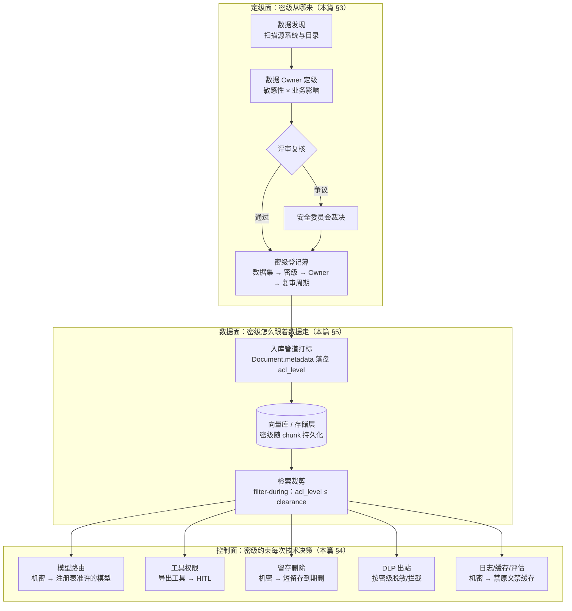
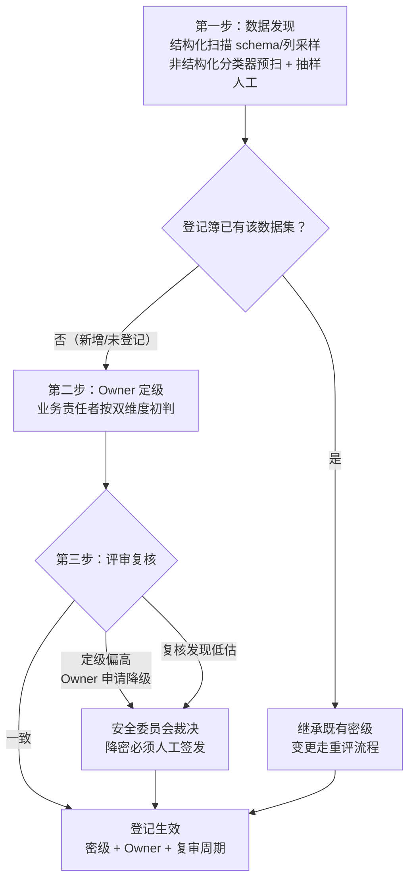
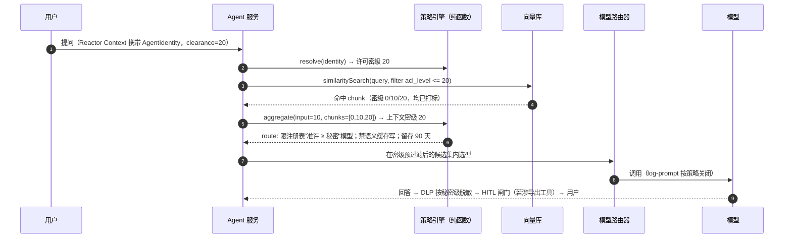
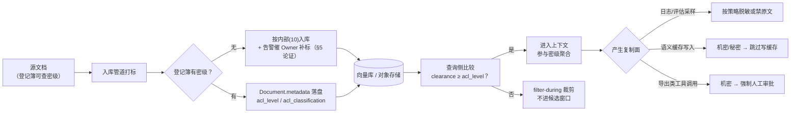

# 数据分类分级与密级传导：企业安全体系的脊柱

> **定位**：本文补上本体系安全篇的最后一块断层——**数据的"密级"本身从哪里来、怎么定、又如何传导为每一次技术决策**。体系此前已有多篇机制各自消费"密级"：[附录 19-向量数据库与检索工程/02-检索权限与文档级裁剪] 用 `acl_level` 过滤、[教程 08-架构师进阶/10-多模型协作与供应策略 §6.2] 的模型注册表带"准许的数据密级"字段、[附录 08-Agent安全深度/02-数据泄露防护] 按敏感度匹配出站规则——但这些机制消费的密级值**在生产中从来不是凭空出现的**：没有一套分类分级方法论与传导管线，前面的所有闸门都在读一个没人写入的字段。本文讲清四密级参考模型、双维度定级方法、数据 Owner 制度，以及最核心的一张"密级→控制矩阵"总表，把体系既有安全内容串成一张网，并给出 Java 21 / Reactor Context 下的标签传递与策略引擎实现。读者画像：需要为企业 Agent 平台建立数据安全底座的中高级 Java 工程师与架构师。前置阅读：[附录 08-Agent安全深度/05-用户身份联邦与企业权限传导]（身份与许可密级从哪来）、[附录 19-向量数据库与检索工程/02-检索权限与文档级裁剪]（检索侧怎么消费密级）。
>
> 技术栈：Spring Boot 4.1.0 + Spring AI 2.0.0 + WebFlux + Java 21。本文涉及的 Spring AI / Reactor API（`Document`、`SearchRequest`、`FilterExpressionTextParser`、`VectorStore.similaritySearch`、`ToolCallback`、`ToolContext`、`Mono.deferContextual`、`reactor.util.context.Context`）**均经本地 Maven 仓库 jar `javap` 实证**，文中以 `// 实证` 注释标注；自研类型（密级登记簿、策略引擎、HITL 闸门）标注「概念代码」。

---

## 1. 断层定位：已有机制都在消费密级，密级本身却无人生产

### 1.1 体系安全内容的"密级依赖图"

先盘点本体系已有的安全机制，以及它们各自依赖的密级字段：

| 既有机制 | 消费的密级语义 | 出处 |
|----------|----------------|------|
| 检索过滤（filter-during 裁剪） | `acl_level <= clearance` 的数值比较 | [附录 19-向量数据库与检索工程/02-检索权限与文档级裁剪 §3] |
| 模型准入与路由 | 注册表"准许的数据密级"字段 | [教程 08-架构师进阶/10-多模型协作与供应策略 §6.2] |
| 工具权限分级 | 危险/导出工具按数据敏感度要求 HITL | [教程 04-企业级架构主干/08-Human-in-the-Loop与审批流] |
| 留存与删除 | 不同敏感度的会话记录留存期不同 | [教程 04-企业级架构主干/05-历史记录持久化与合规] |
| DLP 出站防护 | 出站内容按敏感度匹配脱敏/拦截规则 | [附录 08-Agent安全深度/02-数据泄露防护] |
| 语义缓存 | 高敏数据是否可写入共享缓存 | [附录 09-语义缓存与性能/00-语义缓存实现] |

这张表暴露了一个结构性问题：**六个机制，六处各自的"敏感度判断"，却没有一个共同的密级来源**。如果检索侧的 `acl_level` 是入库脚本随手写的 0，模型注册表写的是"仅限低敏"，DLP 规则按正则猜——三个闸门各自"看起来在工作"，但它们守护的不是同一套标准。数据分类分级（Data Classification & Tiering）就是补上这个共同来源的**脊柱**：一次定级，处处传导。



### 1.2 为什么 Agent 场景让分类分级从"合规文书"变成"安全边界"

传统企业应用里，数据分类分级常常只是一份躺在合规部门抽屉里的文档：定级是给审计看的，真正的访问控制靠每个应用自己的接口权限——数据分散在 CRM、ERP、HR 系统里，**应用边界就是数据边界**，一个系统被攻破泄露的是那个系统里的数据。分类分级在这个模型里是"锦上添花"。

Agent + RAG 把这个模型拆了。入库管道把各源系统的文档解析、切分、嵌入，全部拉进**同一个可被自然语言查询的池子**——这正是 [附录 19-向量数据库与检索工程/02-检索权限与文档级裁剪 §1] 威胁模型的根源：检索是语义匹配而非主键查询，没有密级闸门时，**任何能提问的人都能命中任何入库的数据**。董事会纪要、薪酬表、并购底稿与公开产品手册躺在同一个向量空间里，而且如该篇所析，高密级文档因专业术语密集、实体精确，与"内行"查询的相似度**天然偏高**——越权内容不是偶尔漏出，是主动挤进 top-k。传统应用里一次越权是"看到一个没权限的页面"；Agent 池子里一次越权是"任意对话式探测全库"，攻击成本从"找到并利用某系统漏洞"降到"会打字"。

### 1.3 第二重紧迫性：LLM 让数据 Copies 失控

传统应用的数据流是"取一次、用一次"：渲染一个页面、返回一个接口响应，数据本身没有产生新的持久化副本。Agent 的一次调用链路却在**持续制造数据副本**：

- **Prompt 日志**：`spring.ai.chat.observations.log-prompt=true` 时，用户输入与检索内容全文进日志——日志系统往往有独立的访问控制和远超业务的留存期；
- **Observation / 链路追踪**：`spring.ai.tools.observations.include-content` 会把工具参数与结果写进 span；
- **语义缓存**：问答对写进共享向量缓存，命中率优化与数据隔离在此直接冲突；
- **评估集**：线上 badcase 采样进评估集，通常复制到离线环境；
- **微调数据集**：数据飞轮的"训练侧"把生产对话变成训练语料；
- **导出类工具**：把检索结果写进下游系统（报表、工单、邮件），复制链继续延伸。

每一份副本都有**独立的生命周期、独立的访问控制、独立的合规义务**。原始数据定级是"秘密"，但它的日志副本可能躺在配置为"保留一年、全员可查"的日志平台里；它的评估集副本可能被外包标注团队访问。没有密级传导，DLP 只守住了"出站接口"这一个点，副本在体系内部已经四散。**这就是为什么 Agent 场景的分类分级不能只做"定级文档"，必须做"传导管线"**——密级必须跟着每一次复制走，直到副本销毁。

---

## 2. 分类分级方法论：四密级 × 双维度

### 2.1 四密级参考模型

本体系统一使用四密级参考模型，数值映射与 [附录 19-向量数据库与检索工程/02-检索权限与文档级裁剪 §3.1] 的 `acl_level` 契约完全一致（0 公开 / 10 内部 / 20 秘密 / 30 机密）：

| 密级 | `acl_level` | 判定核心 | 典型内容 | 泄露后果量级 |
|------|-------------|----------|----------|--------------|
| 公开 | 0 | 已主动公开或无保密要求 | 产品手册、公开文档、官网内容 | 无 |
| 内部 | 10 | 仅限企业内部使用，泄露不致实质损害 | 内部流程、团队 Wiki、一般项目资料 | 声誉摩擦 |
| 秘密 | 20 | 泄露造成明确业务损害 | 合同条款、财务明细、客户名单、源码 | 商业损失、合同违约 |
| 机密 | 30 | 泄露造成严重/不可逆损害或触发法律后果 | 个人敏感信息（GDPR 特别类别）、并购底稿、密钥凭据、董事会纪要 | 法律责任、股价冲击、监管处罚 |

> 密级**名称**可以按企业既有标准替换（不少企业有公开/内部/秘密/机密之外的五级制），但**单调数值化**是硬要求——四级的 0/10/20/30 间隔是刻意留白：未来在"内部"与"秘密"之间插入一级时，取 15，存量数据与既有比较逻辑零改动。间隔 1 的连续编号没有这个演进能力。

### 2.2 双维度：敏感性 × 业务影响

定级不能靠"感觉重要就定高"。参考模型用两个独立维度交叉判定：

- **敏感性（Confidentiality Impact）**：数据**泄露**后的伤害——对个人（隐私）、对组织（商业）、对合规（法律责任）。它回答"被看见会怎样"。
- **业务影响（Integrity/Availability Impact）**：数据**被篡改或不可用**时对业务连续性的打击。它回答"被改掉/丢了会怎样"。

两维交叉取**高者**。一个典型的不对称案例：客服通话录音的文字稿——泄露敏感性中等（含客户个人信息则直接升秘密甚至机密），但篡改影响极高（被改写的通话记录会让纠纷裁决失去依据），所以完整定级不是"中"，而是按敏感性与完整性两者的最高档。再如缓存密钥配置：敏感性极高（等同密码），业务影响取决于它是只读还是可写凭据——定级时必须两问都问。

### 2.3 定级三步法



**第一步：数据发现。** 定级的对象是**数据集/数据域**（如"HR 薪酬库"、"合同附件存储桶"、"客服通话转写"），不是每条记录——记录级定级的运营成本会让制度在三个月内死亡。结构化数据靠 schema 扫描加列采样（身份证号、薪资金额、账号等模式匹配已有成熟工具）；非结构化数据（Agent 最主要的数据面）靠分类器预扫（正则 + 小模型分类）加人工抽样，重点扫文件服务器、对象存储桶、Wiki 空间——这些正是 RAG 入库管道的取数源头。发现阶段的产出物是**未登记数据集清单**，这是后续所有工作的输入。

**第二步：责任者定级。** 由**数据 Owner**（业务侧责任者，如 HR 负责人对薪酬库定级）按 §2.2 双维度初判。铁律：**IT 团队不能替业务定级**。工程师能判断"这个字段是什么类型"，但判断不了"泄露这个报价底表会让下次投标损失多少"——定级错误里最常见的就是技术团队系统性低估业务敏感度。Agent 团队在这个环节的正确角色是**提供工具**（发现报告、同行业定级参照、历史泄露案例），不是提供结论。

**第三步：评审复核。** 安全/合规团队复核全部"秘密"以上定级与随机抽样的内部级，不一致的升级安全委员会裁决。复核还负担另一个职责：**横向一致性**——同样的客户名单，销售域定了秘密、客服域定了内部，两处必有一错，这种不一致正是传导体系被击穿的首选路径（攻击者/使用者会自然流向定得松的那个域）。

### 2.4 数据 Owner 制度：定级的"活人负责"原则

分类分级制度最容易死于"人人有责=无人负责"。每个登记在册的数据集必须有唯一的、**在职的具体人**作为 Owner，职责四条：

1. **定级与复审**：初次定级签字；按复审周期（秘密以上半年、内部一年）重评；
2. **例外审批**：临时放行（如某机密数据集允许某评估项目采样）必须 Owner 书面批准并带到期时间；
3. **升密触发**：合规新规、泄露事件、项目冻结等事件发生时发起存量升密（§6.3）；
4. **降密签发**：降密永远是 Owner 申请 + 评审通过 + 留痕签发，**任何自动化流程不得自动降密**——机器可以保守地升，永远不可以自作主张地降。

Owner 制度与 [附录 08-Agent安全深度/05-用户身份联邦与企业权限传导] 的身份体系是两回事：身份篇回答"**谁在问**"（用户及其许可密级 clearance），Owner 制度回答"**数据凭什么定这个级**"（数据侧的密级）。检索裁剪比较的就是这两个值——数据密级 ≤ 用户许可密级。

---

## 3. 密级→控制矩阵：把体系串成一张网（本篇核心）

### 3.1 总表

下表是本篇的交付物核心：行是四密级，列是六个控制域。每个格子是一个**该密级数据在对应控制域上的最低要求**，出处列链回体系既有篇目——它们是这张表的执行机制。

| 控制域 | 公开(0) | 内部(10) | 秘密(20) | 机密(30) | 执行机制出处 |
|--------|---------|----------|----------|----------|--------------|
| **模型路由** | 全部注册模型可用 | 商用注册模型 | 商用模型，限"承诺不用输入再训练"的供应商 | 本地/边缘模型，或专属合同+数据协议的私有端点 | [教程 08-架构师进阶/10-多模型协作与供应策略 §6.2, §8] |
| **检索过滤** | `acl_public=true` 免认证可检 | 登录即可检（`acl_level ≤ 10`） | `acl_level ≤ 20` 且组交集 | `acl_level ≤ 30` 且组交集，默认拒绝 | [附录 19-向量数据库与检索工程/02-检索权限与文档级裁剪 §3, §4] |
| **工具权限** | 全部工具 | 常规工具免审批 | 危险工具（写/删/支付类）触发 HITL | 导出/外发类工具**一律** HITL，高价值操作双人复核 | [教程 04-企业级架构主干/08-Human-in-the-Loop与审批流] |
| **留存与删除** | 随平台默认 | 默认留存策略 | 会话记录留存 ≤ 90 天，到期自动删除 | 会话级留存（≤ 7 天）或零留存，删除须物理删除且同步所有副本 | [教程 04-企业级架构主干/05-历史记录持久化与合规] |
| **DLP 出站** | 放行 | 出站审计（记录不拦截） | 敏感字段强制脱敏后放行 | 默认拦截；白名单通道脱敏+水印放行 | [附录 08-Agent安全深度/02-数据泄露防护] |
| **日志/评估/缓存** | `log-prompt` 可开启 | 日志截断记录，禁全文原文 | 禁原文，仅指标与脱敏样本入评估集 | 禁原文日志 + 禁写语义缓存 + 评估集采样前强制脱敏 | [附录 09-语义缓存与性能/00-语义缓存实现] |

三个使用要点：

1. **这张表是配置，不是文档**。§5 的策略引擎会把每一列变成纯函数决策表，六个控制域都来查同一张表——改一次表格（代码里是一处 `switch`），六个闸门同时生效，且有 git diff 可审计。
2. **上下文聚合取最高**。一次请求的最终密级 = max(用户输入密级, 检索命中 chunk 的密级集, 工具返回密级)。检索命中一份秘密文档，本轮后续的模型路由、缓存、留存就全部按秘密对待——污染只向上传播，永不向下。
3. **表里的每个格子都要有测试**。策略引擎是纯函数，意味着总表可以被单元测试逐格锁定：`assertThat(ClassificationPolicy.of(CONFIDENTIAL).semanticCacheWrite()).isFalse()`。总表从"文档里的承诺"变成"CI 里的断言"。

### 3.2 六个控制点逐条展开

**密级 → 模型路由。** [教程 08-架构师进阶/10-多模型协作与供应策略 §6.2] 的模型注册表为每个准入模型登记"准许的数据密级"——这是密级与模型域的第一处交汇。路由器在选型时先做一次**密级预过滤**：候选集 = 注册表中"准许密级 ≥ 当前上下文密级"的模型，再在候选集内做任务匹配与成本排序。机密上下文（30）若注册表内无任何商用模型被准许（供应商尽调 §6.1 的六问未通过），路由器落到本地/边缘模型档（§8 的边缘部署）。这里最常见的落地错误是**顺序颠倒**：先按成本选好模型、再"检查"密级——检查失败时降级模型会导致回答质量断崖，业务方就会要求"特例放行"，特例一开，整个密级体系名存实亡。正确顺序是密级过滤在前，业务优化在剩余候选集内进行。

**密级 → 检索过滤。** 这是体系里已经最完整的一环。[附录 19-向量数据库与检索工程/02-检索权限与文档级裁剪] 确立了 filter-during 架构：`acl_level <= clearance` 与语义查询**同构下发**到向量库，在窗口分配前裁剪；该篇 §3.4 也指出了纯 DSL 的边界（动态属性依赖外部状态表时走后置校验兜底）。本篇的贡献是把 `acl_level` 的**写入侧**补全——它的每个值都必须能回溯到密级登记簿里 Owner 签发的定级，而不是入库脚本里的魔法数字。

**密级 → 工具权限。** [教程 04-企业级架构主干/08-Human-in-the-Loop与审批流] 的 HITL 触发条件按"工具危险度"定义；密级传导给它第二个维度：**同样的工具，上下文密级不同，审批策略不同**。搜索类工具在公开上下文免审批，导出类工具（把数据写到工单、邮件、报表）在机密上下文一律 HITL——因为工具调用的参数里裹着机密内容，执行即外发。§5.5 会给出在 `ToolCallback` 包装层实现该判断的代码。

**密级 → 留存与删除。** [教程 04-企业级架构主干/05-历史记录持久化与合规] 的 GDPR 留存策略需要按密级差异化：机密级会话记录短留存或零留存（只留审计元数据不留内容），到期物理删除。§1.3 的副本失控问题在这里收口：**留存策略必须覆盖所有副本**——主存储到期删除时，语义缓存里对应条目、评估集里的采样、日志里的原文都要同步清理。这也是机密级禁写语义缓存（总表最后一行）的原因之一：少一份副本，少一份删除义务。

**密级 → DLP 规则。** [附录 08-Agent安全深度/02-数据泄露防护] 的出站检查（正则/NER/分类器）是**内容驱动**的——从文本内容猜测敏感度。密级传导给它一个**元数据驱动**的前置通道：出站内容已知的密级直接查总表得到动作（放行/审计/脱敏/拦截），内容检测只在密级未知或两者不一致时兜底（已知机密却被内容检测判为"无敏感"——以密级为准，内容检测的假阴性永远存在）。两个信号取严不取松。

**密级 → 评估与日志。** `spring.ai.chat.observations.log-prompt` 是全局开关，密级传导把它变成**按请求生效**：策略引擎按上下文密级决定本轮是否允许原文入日志/入缓存/入评估采样。特别强调语义缓存：[附录 09-语义缓存与性能/00-语义缓存实现] 的缓存键是查询向量的相似度命中，这意味着**写入条目会成为其他用户相似查询的命中源**——一份机密问答进了缓存，之后任何密级不足但问题相近的查询都会"合法地"读出机密内容。这是缓存与安全的结构性冲突，机密级禁写是唯一稳妥解。

### 3.3 一次请求的密级校验全旅程



注意第 5 步：**上下文密级由聚合决定而非用户输入决定**——用户输入只是公开的内部资料，检索拉进了秘密文档，本轮即按秘密对待。这是"污染只向上"原则在请求内的体现。

---

## 4. 标签随数据流动的完整生命周期



---

## 5. 工程落地：Java 21 / Reactor 下的标签与策略

### 5.1 `DataClassification` 枚举：体系的密级单一来源

```java
// 概念代码（自研类型，无 SDK 依赖）——acl_level 数值契约对齐
// [附录 19-向量数据库与检索工程/02-检索权限与文档级裁剪] §3.1
package com.example.agent.security.classification;

public enum DataClassification {
    PUBLIC(0, "公开"),
    INTERNAL(10, "内部"),
    SECRET(20, "秘密"),
    CONFIDENTIAL(30, "机密");

    private final int aclLevel;
    private final String label;

    DataClassification(int aclLevel, String label) {
        this.aclLevel = aclLevel;
        this.label = label;
    }

    public int aclLevel() { return aclLevel; }
    public String label() { return label; }

    /** 聚合取最高：污染只向上传播，永不向下（§3.1 使用要点 2）。 */
    public static DataClassification highest(DataClassification a, DataClassification b) {
        return a.aclLevel >= b.aclLevel ? a : b;
    }

    /** 从标签数值还原；未知数值按 CONFIDENTIAL 兜底（枚举层 fail-closed）。 */
    public static DataClassification fromLevel(int level) {
        for (DataClassification c : values()) {
            if (c.aclLevel == level) {
                return c;
            }
        }
        return CONFIDENTIAL;
    }
}
```

两个设计细节：`fromLevel` 对未知数值（如库里残留的 25）按机密兜底，保证历史脏数据 fail-closed；而**枚举自身不提供"默认值"静态常量**——默认密级是一个策略问题（§6.1），不该藏在枚举里被随手引用。

### 5.2 入库打标：密级随 chunk 落盘

```java
// Spring AI 2.0.0 —— Document / Document.Builder / metadata 均经 javap 实证
package com.example.agent.rag.ingest;

import java.util.List;

import com.example.agent.security.classification.DataClassification;

import org.springframework.ai.document.Document;
import org.springframework.stereotype.Service;

@Service
public class ClassifiedIngestionService {

    public static final String META_ACL_LEVEL = "acl_level";           // 复用 [附录 19/02] §3.1 契约
    public static final String META_CLASSIFICATION = "acl_classification";

    private final ClassificationRegistry registry;  // 概念代码：密级登记簿只读视图
    private final ClassificationAlerts alerts;      // 概念代码：补标告警

    public ClassifiedIngestionService(ClassificationRegistry registry, ClassificationAlerts alerts) {
        this.registry = registry;
        this.alerts = alerts;
    }

    /** 打标：登记簿有密级用登记密级；没有 → 按 INTERNAL 入库并告警（默认密级论证见 §6.1）。 */
    public List<Document> tagAndPrepare(String datasetKey, List<Document> chunks) {
        DataClassification classification = registry.find(datasetKey)
                .orElseGet(() -> {
                    alerts.unclassifiedDataset(datasetKey);   // 告警：催 Owner 补定级，闭环到登记簿
                    return DataClassification.INTERNAL;        // 默认中间档，绝默认公开
                });
        return chunks.stream()
                .map(chunk -> Document.builder()                            // 实证：builder()
                        .id(chunk.getId())                                   // 实证：getId()
                        .text(chunk.getText())                               // 实证：getText()
                        .metadata(chunk.getMetadata())                       // 实证：getMetadata()——先继承既有元数据
                        .metadata(META_ACL_LEVEL, classification.aclLevel()) // 实证：metadata(String, Object)
                        .metadata(META_CLASSIFICATION, classification.name())
                        .build())                                            // 实证：build()
                .toList();
    }
}
```

注意 metadata 的写入顺序：先 `metadata(Map)` 继承切分上游已带的元数据（owner、来源系统等），再以键值形式覆盖密级两键——保证 `acl_level` 永远以登记簿为准，不被上游脏数据覆盖掉。

### 5.3 查询侧：从 Reactor Context 取许可密级

```java
// Spring AI 2.0.0 + reactor-core —— similaritySearch / SearchRequest.Builder /
// FilterExpressionTextParser.parse / Mono.deferContextual 均经 javap 实证
package com.example.agent.rag.retrieval;

import java.util.List;

import com.example.agent.security.AgentIdentity;
import com.example.agent.security.classification.DataClassification;

import org.springframework.ai.document.Document;
import org.springframework.ai.vectorstore.SearchRequest;
import org.springframework.ai.vectorstore.VectorStore;
import org.springframework.ai.vectorstore.filter.FilterExpressionTextParser;
import org.springframework.stereotype.Service;

import reactor.core.publisher.Mono;

@Service
public class ClearanceFilteredRetriever {

    private final VectorStore vectorStore;
    private final FilterExpressionTextParser filterParser = new FilterExpressionTextParser(); // 实证：parse(String) → Filter.Expression

    public ClearanceFilteredRetriever(VectorStore vectorStore) {
        this.vectorStore = vectorStore;
    }

    /** 许可密级（身份侧）与数据密级（本篇）在 filter-during 处交汇。 */
    public Mono<List<Document>> retrieve(String query) {
        return Mono.deferContextual(ctx -> {                          // 实证：deferContextual(ContextView → Mono)
            // Context key 契约与 [附录 19/02] §4.1 的 PermissionAwareRetriever 一致：
            // 以 AgentIdentity.class 类型为键（类型安全，避免字符串撞名）
            AgentIdentity identity = ctx.getOrDefault(AgentIdentity.class, null); // AgentIdentity 快照，见 [附录 08/05] §3
            int clearance = resolveClearance(identity);
            List<Document> hits = vectorStore.similaritySearch(       // 实证：similaritySearch(SearchRequest)
                    SearchRequest.builder()                            // 实证：builder()
                            .query(query)                              // 实证：query(String)
                            .topK(8)                                   // 实证：topK(int)
                            .filterExpression(filterParser.parse(      // 实证：filterExpression(Filter.Expression)
                                    "acl_level <= " + clearance))
                            .build());                                 // 实证：build()
            return Mono.just(hits);
        });
    }

    /**
     * 查询侧 fail-closed 方向与入库侧相反（§6.1 的不对称论证）：
     * 无身份/无 clearance 声明 → 只放公开层。
     */
    private int resolveClearance(AgentIdentity identity) {
        if (identity == null) {
            return DataClassification.PUBLIC.aclLevel();
        }
        Object claim = identity.attributes().get("clearance");   // IdP 下发，见 [附录 19/02] §3.5
        if (claim instanceof Integer i) return i;
        if (claim instanceof Number n) return n.intValue();
        return DataClassification.PUBLIC.aclLevel();
    }
}
```

检索裁剪的完整展开（组交集、owner 特例、ABAC 出路、合法空结果语义）在 [附录 19-向量数据库与检索工程/02-检索权限与文档级裁剪 §3-§4]，本篇只保留密级这一维的最小骨架。一处装配口径以 19/02 为准：其唯一入口 `PermissionAwareRetriever` 对**无身份**请求在身份层即整体拒绝（匿名公开语料走 `acl_public=true` 免认证通道，不经权限检索入口），对**有身份但无 `clearance` 声明**的请求同样 fail-closed 拒绝（翻译器返回 null → 空结果）；本骨架把两种缺失都简化为「落到公开层」，只是密级单维视角的演示——真实装配中两类 fail-closed 不应与全拒行为并存于同一入口。

### 5.4 策略引擎：总表变纯函数决策表

```java
// 概念代码（自研策略类型）——§3.1 总表的代码化：六控制域都查这一张表
package com.example.agent.security.classification;

import java.time.Duration;
import java.util.Set;

/**
 * 密级 → 控制决策表（record 不可变，纯函数，无 IO）。
 * 改密级策略 = 改这一个 switch，六个闸门同步生效，git diff 可审计。
 */
public record ClassificationPolicy(
        boolean cloudModelAllowed,      // 模型路由：可否出云（否则落本地/边缘模型）
        boolean semanticCacheWrite,     // 语义缓存：可否写入共享缓存
        boolean promptContentLogging,   // 日志：可否记录 prompt 原文
        boolean exportToolNeedsHitl,    // 导出/外发工具是否强制 HITL
        Duration retention,             // 会话留存期；null = 随平台默认
        DlpAction dlpAction             // DLP 出站动作
) {

    public enum DlpAction { ALLOW, AUDIT, MASK, BLOCK }

    public static ClassificationPolicy of(DataClassification c) {
        return switch (c) {   // Java 21 穷举 switch：新增密级级别时编译期强制补表
            case PUBLIC       -> new ClassificationPolicy(true,  true,  true,  false, null,                DlpAction.ALLOW);
            case INTERNAL     -> new ClassificationPolicy(true,  true,  false, false, null,                DlpAction.AUDIT);
            case SECRET       -> new ClassificationPolicy(true,  false, false, true,  Duration.ofDays(90), DlpAction.MASK);
            case CONFIDENTIAL -> new ClassificationPolicy(false, false, false, true,  Duration.ofDays(7),  DlpAction.BLOCK);
        };
    }

    /** 请求上下文密级 = 各来源密级（用户输入 / 检索命中 / 工具返回）的最高档。 */
    public static DataClassification contextLevel(Set<DataClassification> parts) {
        DataClassification max = DataClassification.PUBLIC;
        for (DataClassification p : parts) {
            max = DataClassification.highest(max, p);
        }
        return max;
    }
}
```

`switch` 的穷举性是这张表的安全属性：未来插入 `RESTRICTED(15)` 时，所有没补表的代码**编译失败**而不是静默用错档位。策略引擎无状态无 IO，意味着可以对本篇 §3.1 总表做逐格单元测试，也可以在 CI 里对"策略表 vs 文档总表"做一致性快照测试。

### 5.5 工具守门：`ToolCallback` 包装层按密级强制 HITL

```java
// Spring AI 2.0.0 —— ToolCallback / ToolContext 均经 javap 实证
package com.example.agent.security.classification;

import com.example.agent.security.classification.ClassificationPolicy.DlpAction;

import org.springframework.ai.chat.model.ToolContext;
import org.springframework.ai.tool.ToolCallback;
import org.springframework.ai.tool.definition.ToolDefinition;

/**
 * 密级守门包装器：装饰任意 ToolCallback，机密上下文调用导出/外发类工具时强制走 HITL。
 * 落点符合体系铁律：HITL 在 ToolCallback 包装层，不在 Advisor。
 */
public final class ClassificationGuardedTool implements ToolCallback {   // 实证：implements ToolCallback

    private final ToolCallback delegate;
    private final HitlGate hitlGate;   // 概念代码：HITL 闸门，见 [教程 04/08] 的审批流

    public ClassificationGuardedTool(ToolCallback delegate, HitlGate hitlGate) {
        this.delegate = delegate;
        this.hitlGate = hitlGate;
    }

    @Override
    public ToolDefinition getToolDefinition() {                 // 实证：getToolDefinition()
        return delegate.getToolDefinition();
    }

    @Override
    public String call(String toolInput, ToolContext toolContext) {   // 实证：call(String, ToolContext)
        int ctxLevel = (int) toolContext.getContext()                 // 实证：getContext() → Map<String, Object>
                .getOrDefault("ctx_acl_level", DataClassification.CONFIDENTIAL.aclLevel());
        ClassificationPolicy policy = ClassificationPolicy.of(DataClassification.fromLevel(ctxLevel));
        if (policy.exportToolNeedsHitl() && policy.dlpAction() == DlpAction.BLOCK) {
            return hitlGate.awaitApproval(delegate.getToolDefinition(), toolInput, ctxLevel);
        }
        return delegate.call(toolInput, toolContext);                 // 实证：委托原 call
    }
}
```

`ctx_acl_level` 由请求编排层在调用工具前从 `ClassificationPolicy.contextLevel(...)` 算出并放入 `ToolContext`——工具包装层自身不追溯 Reactor Context（工具执行点可能已脱离原订阅链），由编排层显式传入。这与 [附录 08-Agent安全深度/05-用户身份联邦与企业权限传导] 的"身份的通道与执行的通道必须分开"是同一设计纪律。`getOrDefault` 的缺省值取机密而非公开：工具执行点的密级信息缺失时，宁可多审批，不可漏审批。

---

## 6. 失效模式：默认密级的论证与三类标签故障

### 6.1 未打标数据的默认密级：一个必须论证的选择

新数据集入库时登记簿还没有 Owner 定级——默认按什么密级处理？三个候选答案的推演：

- **默认公开（fail-open）**：灾难选项。§1.2 的池化效应下，"未定级"数据在向量库里与公开数据同权可检，等于"入库即公开"。而且 fail-open 有个阴险的激励效应：默认公开意味着不打标毫无成本，Owner 定级这件事会永远排不上优先级。
- **默认机密（fail-closed 最严档）**：安全上无可指摘，但工程上会**把整个体系杀死**。未定级数据全部按机密对待 → 不可用云模型、禁缓存、强制 HITL、短留存——业务方发现"新接一个数据源产品就不可用"，然后出现**影子管道**：业务绕开 Agent 平台，自己搭一套不带任何管控的检索服务。安全体系最大的失败不是某个闸门漏了，而是**被人绕过去**。影子管道一旦存在，我们连"数据在管控内"这个前提都失去了。
- **默认内部（中间档）+ 强制告警补标**：工程均衡解，本体系采用。论证分三步：
  1. **危害上限有界**："内部"档的含义是"仅限企业内部可见"——而未定级数据本来就存放在企业内网某系统中，对内部可见，默认内部**没有让它比现状更暴露**，只是没有让它变得更安全。泄露增量近似为零。
  2. **可用性可接受**：内部档策略下云模型可用、常规工具可用，业务方感知不到降级，不会去搭影子管道。
  3. **收敛有强制力**：每次未打标入库都触发告警，未定级数据集清单在安全例会上有专门的"补标 burndown"，Owner 制度（§2.4）给补标一个具体的责任人。默认值买来可用性，告警机制保证它只是暂时的。

同时有一条不对称铁律：**入库侧缺标签往中间档靠（内部）保可用，查询侧缺身份往最严档靠（公开层）保安全**。§5.3 的 `resolveClearance` 对无身份请求只放公开层——查询侧的未知主体是潜在的攻击者，宁可错杀；入库侧的未知标签只是流程滞后，不是攻击信号。两个方向相反的 fail-closed，是同一原则（"保守方向取决于未知的性质"）在两侧的不同投影。另外"公开"永远是**显式判定**的结果：降密必须 Owner 申请、评审通过、留痕签发，任何自动管道不得把数据降为公开。

### 6.2 标签丢失：ETL 中间环节的传播契约

密级标签在入库管道（解析 → 清洗 → 切分 → 嵌入 → 落盘）的任何一环都可能被"重建对象"的代码丢掉——用三个参数重新 `new Document(text)` 而不带 metadata，是最常见的写法事故。防线三条：

1. **传播契约写进代码规范**：管道中任何 `Function<Document, Document>` 式转换必须保留 metadata map，只允许增改不允许清空；
2. **单元测试断言到每一环**：每个转换器的测试都要断言输出 chunk 的 `acl_level` 等于输入值——不是断言"有这个键"，是断言"值没变"；
3. **落盘抽检对账**：定期比对向量库内 `acl_classification` 与登记簿定级，不一致即告警。这是最后一道网，兜住前两条之外的一切（包括手工改库）。

### 6.3 密级漂移：升密后的存量重标

密级不是终身制。三类事件会触发**升密**：合规新规（如某类数据被新纳入个人信息保护范围）、安全事件（泄露后重新评估）、业务状态变化（项目进入冻结期）。升密的工程动作是**存量重标**：按 [附录 19-向量数据库与检索工程/02-检索权限与文档级裁剪 §5.2] 的 read-mutate-add 路径重写存量 chunk 的 `acl_level`——不能只改登记簿不改存量，否则库内标签与登记簿分叉，检索过滤读的是库内标签，新定级形同虚设。降密则永远走 §2.4 的 Owner 申请 + 评审 + 留痕，且重标完成后登记簿要记录降密依据（谁、何时、为什么）。漂移扫描（登记簿 vs 库内标签的全量对账）应作为例行任务与 §6.2 的抽检合并执行。

### 6.4 失效模式总表

| 失效模式 | 后果 | 防线 |
|----------|------|------|
| 未打标默认公开 | 入库即公开，池化下全库可探 | 默认内部 + 告警补标（§6.1） |
| 未打标默认机密 | 可用性塌方 → 影子管道绕过管控 | 默认内部（fail-closed 只用于查询侧身份缺失） |
| 查询侧无 clearance 放行 | 匿名/未联邦用户探测内网语料 | fail-closed 到公开层（§5.3） |
| ETL 环节丢 metadata | 标签断链，filter 条件落空 | 传播契约 + 逐环节测试 + 落盘对账（§6.2） |
| 升密只改登记簿 | 库内旧标签继续放行越权检索 | read-mutate-add 存量重标（§6.3） |
| 自动降密/降密无痕 | 密级体系失去可信度 | 降密必须 Owner + 评审 + 留痕 |
| 各闸门各自判断密级 | 标准漂移，最松闸门成为事实标准 | 策略引擎单一来源（§5.4） |
| 多源聚合取最低 | 秘密内容经公开上下文外发 | `highest()` 聚合，污染只向上（§5.1） |

---

## 7. 适用场景与不适用场景

**适用场景**：

- 企业 Agent / RAG 平台接入**多个不同敏感度的数据源**——只要入库数据源超过一个且敏感度不同，分类分级就是前置必需品；
- 有独立安全/合规团队的企业环境，能落实数据 Owner 制度与评审流程；
- 受 GDPR / 个人信息保护法 / 行业监管约束的场景——机密级与个人敏感信息的重合区（总表"机密"行）直接对应法定义务；
- 多模型编排架构（商用 + 本地混合）：密级是模型路由预过滤的第一排序键；
- 需要向审计方证明"数据流转受控"的场合：策略引擎 + 登记簿 + 对账记录构成完整证据链。

**不适用场景**：

- 数据源单一且全部公开的 demo / 内部玩具项目——全套 Owner 制度与评审流程的运营成本远超收益，一个"所有数据都是公开档"的常量即可；
- 没有业务方配合意愿的团队——Owner 定级和复审需要业务侧持续投入，技术侧单方面推行的定级必然是没人维护的死表格，不如不做；
- 记录级动态密级场景（如按行级权限实时判定的数据平台）——本文的**数据集级**定级是静态契约，行级动态权限需要 [附录 19-向量数据库与检索工程/02-检索权限与文档级裁剪 §3.4] 的后置校验路线，两者是互补而非替代；
- 数据不入模型上下文、仅做传统 CRUD 的应用——传统应用边界模型下，接口权限已覆盖主要暴露面（§1.2 之前的世界）。

---

## 8. 总结

数据分类分级在传统应用里是一份合规文档，在 Agent 场景里是**安全边界本身**——RAG 的池化效应把"能问的人能问到什么"的答案从"接口权限裁剪后的视图"变成了"全库"，LLM 的复制面把一份数据的泄露面从"一个系统"扩大到"日志、缓存、评估集、微调集的 N 份副本"。本篇补上了体系安全内容的最后断层：

1. **方法论**：四密级 × 双维度（敏感性 × 业务影响）参考模型，0/10/20/30 数值留白以备插入；定级三步法（数据发现 → Owner 定级 → 评审复核）与"活人负责"的 Owner 制度。
2. **传导矩阵**：密级 → 模型路由 / 检索过滤 / 工具权限 / 留存删除 / DLP / 日志缓存评估六个控制域的总表，把 [附录 08-Agent安全深度/02-数据泄露防护]、[附录 08-Agent安全深度/05-用户身份联邦与企业权限传导]、[附录 19-向量数据库与检索工程/02-检索权限与文档级裁剪]、[教程 08-架构师进阶/10-多模型协作与供应策略 §6.2]、[教程 04-企业级架构主干/05-历史记录持久化与合规]、[附录 09-语义缓存与性能/00-语义缓存实现] 串成一张网——一次定级，处处生效。
3. **工程闭环**：`DataClassification` 枚举（聚合取最高、未知数值 fail-closed）、入库打标（`Document.metadata` 落盘、复用 `acl_` 契约）、查询侧 `Mono.deferContextual` 取许可密级、纯函数策略引擎（穷举 switch 让总表可测试）、`ToolCallback` 守门包装（机密上下文导出工具强制 HITL）。
4. **失效防线**：默认密级的方向论证（入库缺标签 → 内部档保可用，查询缺身份 → 公开层保安全）、标签传播契约、升密存量重标与降密人工签发。

一条收束的记忆线：**定级是业务的决定，传导是工程的责任，聚合取最高是铁律，降密永远是人的签字**。分类分级做得好不好，不看文档写得全不全，看下一次新数据源接入时——它是先被登记簿接住，还是先被向量库吞掉。

---

> 上一篇：[附录 08-Agent安全深度/05-用户身份联邦与企业权限传导] ｜ 体系锚点：[教程 08-架构师进阶/09-Agent治理与合规框架]（治理框架全景）、[教程 04-企业级架构主干/11-安全与权限控制]（权限主线）
