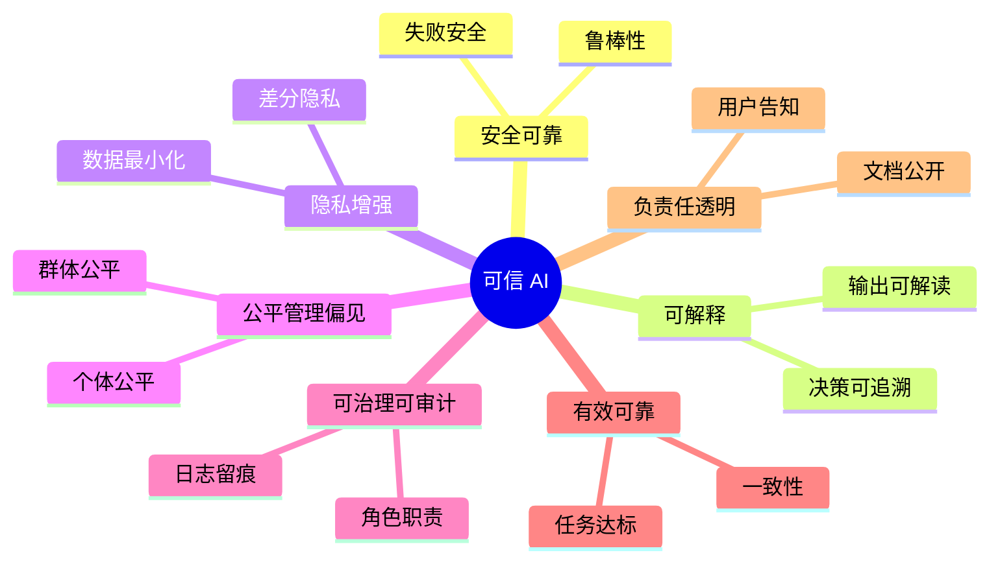
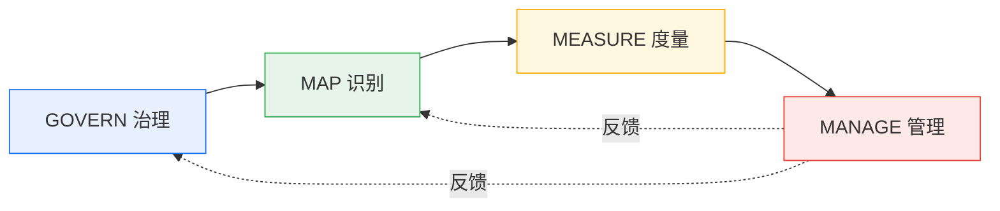
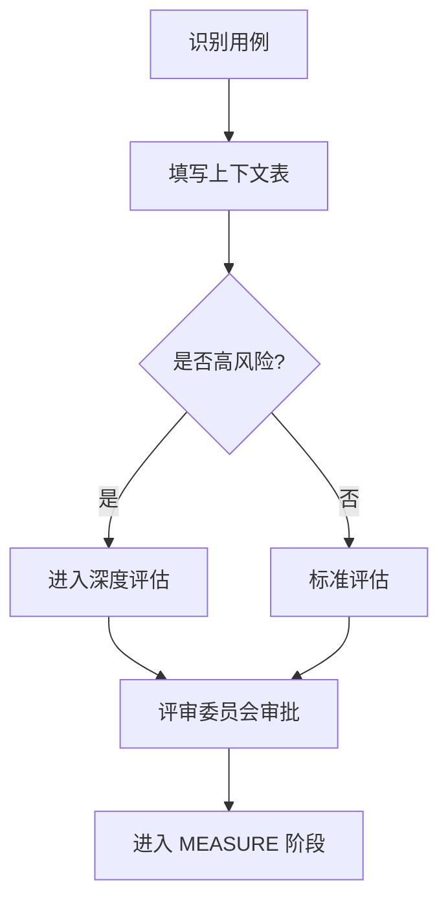
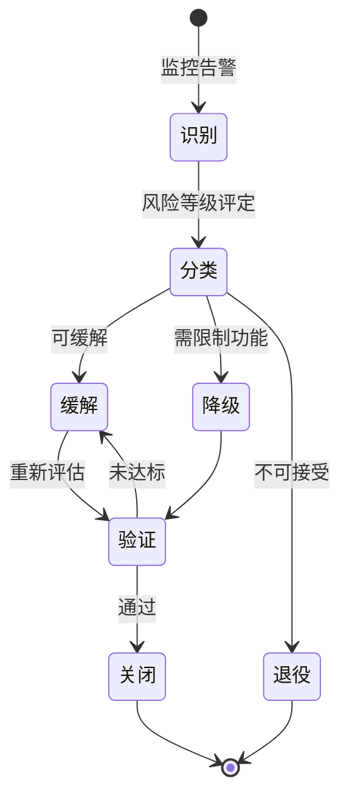
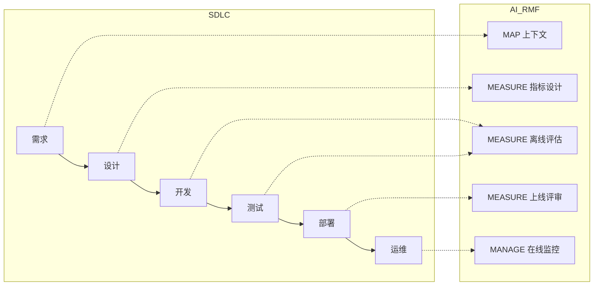
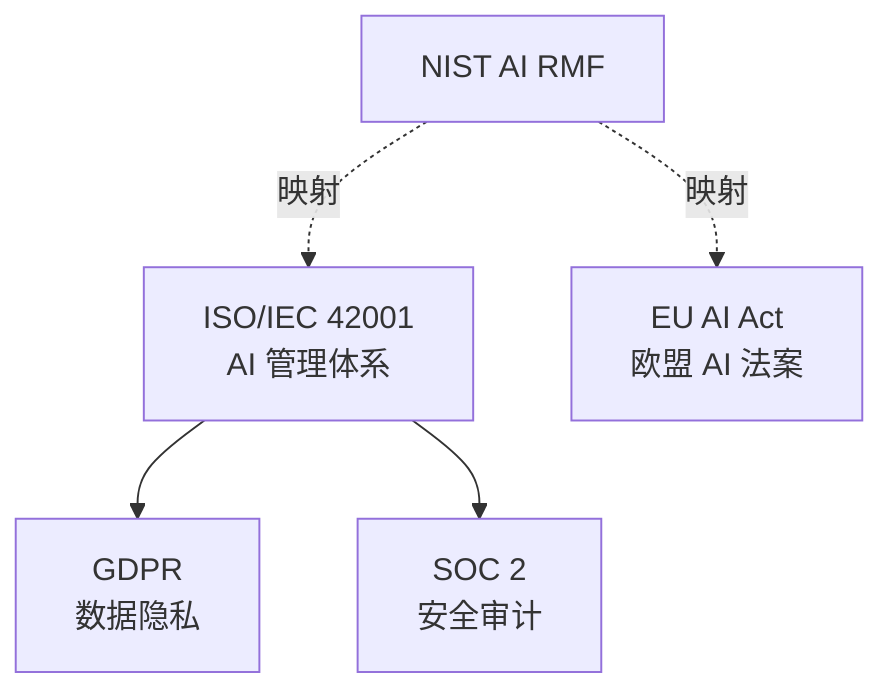

# NIST AI RMF 框架企业落地指南

「本文是对 [教程 38-治理合规 §1-§4] 的深入展开」

> [教程 38-治理合规] 本文是治理合规系列的开篇，系统讲解美国国家标准与技术研究院（NIST）发布的 AI 风险管理框架（AI Risk Management Framework，AI RMF 1.0）如何在企业 Java Agent 项目中落地。

> 技术栈：Spring Boot 4.1 + Spring AI 2.0.0 + WebFlux + Java 21

---

## 一、为什么选择 NIST AI RMF

### 1.1 框架定位

NIST AI RMF 1.0 于 2023 年 1 月正式发布，是一份**自愿性、非强制性**的 AI 风险管理参考框架。它在国际层面被广泛引用，原因有三：

- **技术中立**：不绑定具体模型或算法，对规则引擎、传统 ML、大语言模型（LLM）Agent 同样适用。
- **治理导向**：它谈的不是"怎么训练模型"，而是"怎么让组织对 AI 系统负责"。
- **可映射**：欧盟《AI 法案》、ISO/IEC 42001、新加坡 Model AI Governance Framework 都能与 AI RMF 做交叉映射，对企业做多地区合规极有价值。

对于 Java Agent 项目而言，AI RMF 给出了一组通用词汇，让架构师、安全团队、法务、产品经理在同一个语义层面上沟通风险——这比每场会议重新发明术语要高效得多。

### 1.2 与本系列其他文档的关系

本文聚焦框架总览与落地流程；具体的透明度工具（Model Card / Data Card）见 `01-模型卡片与数据卡片.md`；隐私合规与偏见检测见 `02-数据隐私与偏见检测.md`。三篇构成治理合规的"骨架—证件—体检"三件套。

---

## 二、AI RMF 核心结构

AI RMF 由两部分组成：**基础（Foundations）**解释风险概念与可信特征；**框架（Framework）**给出四个执行职能（Functions）。

### 2.1 可信 AI 的七大特征



这七个特征不是互相独立的列别，而是会相互拉扯：增加可解释性可能降低预测精度；强化隐私可能限制训练数据规模。架构师的工作不是"全部拉满"，而是在业务约束下做**显式的权衡记录**。

### 2.2 四大核心职能（GOVERN, MAP, MEASURE, MANAGE）



| 职能 | 一句话定位 | 典型产出 |
|------|-----------|----------|
| **GOVERN** | 谁对什么负责，规则怎么定 | AI 治理章程、角色矩阵、策略文档 |
| **MAP** | 这个 AI 系统在什么场景、给谁用、可能出什么问题 | 上下文清单、风险登记册 |
| **MEASURE** | 风险到底有多大，用数据说话 | 评估报告、指标基线、红队测试结果 |
| **MANAGE** | 风险不可接受时怎么处理 | 缓解措施、应急响应、退役计划 |

GOVERN 是一个"横切"职能——它贯穿 MAP/MEASURE/MANAGE，确保这三步是有组织、有授权、有审计的，而不是工程师个人临时决定。

---

## 三、在 Java Agent 项目中的落地路径

下面给出一套可复用的四阶段落地流程，适合中型团队（5–20 人）的 Agent 项目。

### 3.1 阶段一：GOVERN——建立治理基座

**关键动作：**

1. **指定 AI 责任人**（AI Risk Owner）：在 RACI 矩阵里写清楚，通常是首席架构师或 CTO 办公室成员，对 AI 系统的总体风险负最终责任。
2. **成立 AI 评审委员会**（AI Review Board）：法务、安全、产品、工程各一名代表，每月例会评审新增 AI 用例。
3. **制定策略基线**：包括"高风险用例清单""模型上线门槛""数据使用规范"三份文档，存放在 Confluence 或内部 Wiki。

**代码侧体现：** 在项目根目录新增 `governance/` 目录，存放治理文档版本化的快照，并在 CI 中校验文档是否在有效期内（例如每 12 个月必须复审一次）。

### 3.2 阶段二：MAP——绘制风险地图

对每个 Agent 用例，填写一份**上下文表（Context Sheet）**：

```yaml
use_case_id: AGENT-RECOMMEND-001
description: 客服 Agent 根据用户问题推荐知识库文章
intended_users: 内部客服坐席
ai_component: LLM (GPT-4o) + 向量检索
deployment_mode: 内网 API
third_party_deps:
  - OpenAI API
  - Pinecone 向量库
potential_harms:
  - type: 误导性建议
    severity: 中
    likelihood: 中
  - type: 敏感数据外泄
    severity: 高
    likelihood: 低
```

这份表不是写在 Word 里吃灰的，它要成为评审会的输入和后续度量阶段的基线。



### 3.3 阶段三：MEASURE——量化风险

MEASURE 不是一次性测试，而是一组持续运行的评估。建议建立三层评估体系：

- **离线评估**：在固定的测试集上跑准确率、召回率、公平性指标。对于 Agent，还要测工具调用成功率、任务完成率。
- **在线监控**：在生产环境埋点，追踪用户反馈（点赞/点踩）、投诉率、回退到人工的比例。
- **红队测试**：定期由安全团队或第三方对 Agent 进行对抗性测试，包括 Prompt 注入、越狱、数据投毒场景。

**推荐工具链：**

| 用途 | 工具 |
|------|------|
| LLM 评估 | LangSmith、Promptfoo、DeepEval |
| 公平性指标 | AIF360（IBM）、Fairlearn |
| 日志审计 | ELK + 自定义 AI 事件 schema |
| 红队自动化 | Garak、PyRIT |

### 3.4 阶段四：MANAGE——风险响应

MEASURE 出来的问题，要进入一个**风险响应闭环**：



关键原则：**每一项已识别风险都要有明确的处理决策**，不允许"知道但不管"。决策和理由要记录在风险登记册中。

---

## 四、与 SDLC（软件开发生命周期）的集成

AI RMF 不应该是一套独立的流程，它必须嵌入到现有的研发流程中才能持续运转。



在 Java 项目中的具体落地点：

- **需求阶段**：产品经理在 Jira 模板中必填"AI 用例上下文表"字段。
- **设计阶段**：架构师在 ADR（架构决策记录）中新增"AI 风险评估"章节。
- **开发阶段**：在 CI 流水线中接入 Prompt 回归测试。
- **测试阶段**：QA 团队执行公平性测试和对抗性测试用例。
- **部署阶段**：发布前由 AI 评审委员会签字（高风险用例）。
- **运维阶段**：在线监控仪表盘，异常自动告警到值班群。

---

## 五、常见落地陷阱与对策

| 陷阱 | 表现 | 对策 |
|------|------|------|
| **文档两层皮** | 治理文档写得漂亮，但没人执行 | 把治理检查点嵌入 CI 和发布流程，强制卡口 |
| **一次性运动** | 上线前做了一次评估，之后再没做过 | 把评估自动化、定期化，建立指标基线和漂移告警 |
| **风险登记册没人看** | 填完就归档 | 在每周工程例会上 review 高风险项，未关闭项必须有 owner 和 due date |
| **红队测试流于形式** | 只测了 happy path | 引入第三方或跨团队红队，使用自动化工具（Garak）覆盖已知攻击模式 |
| **第三方依赖盲区** | 忽略 LLM API 供应商自身的风险 | 在供应商合同中加入 SLA、数据使用条款、审计权条款 |

---

## 六、与其他框架的协同

AI RMF 不排斥其他框架，实际落地中通常是多框架协同：



实务建议：**以 AI RMF 为内部操作骨架，以 ISO 42001 为管理体系认证，以 GDPR/EU AI Act 为合规底线**。这样既能对外证明合规，又能在内部形成可操作的工作流。

---

## 六（补充）、在 Spring AI 中落地 AI RMF 检查点

以下 Java 代码展示如何把 AI RMF 的 MAP / MEASURE / MANAGE 三步嵌入 Spring AI 的 Advisor 链，实现"上线前评估 + 运行时监控 + 风险响应"的自动化骨架。

```java
/**
 * MEASURE 阶段：运行时持续度量 Agent 的风险指标。
 * 把这些指标接入 Prometheus + Grafana 即可形成 AI RMF 的可观测面板。
 */
@Component
@Order(200)
public class AIRmfMeasureAdvisor implements CallAdvisor {

    private final MeterRegistry meters;
    private final RiskRegisterClient register;   // 对接风险登记册

    @Override
    public ChatClientResponse adviseCall(ChatClientRequest req, CallAdvisorChain chain) {
        String tenantId = req.context().get("tenantId");
        String useCaseId = req.context().get("useCaseId");   // AI RMF 上下文表 ID

        ChatClientResponse resp;
        try {
            resp = chain.nextCall(req);
        } catch (Exception e) {
            // MANAGE：记录安全/可靠性事件
            register.logEvent(RiskEvent.builder()
                .useCaseId(useCaseId)
                .tenantId(tenantId)
                .category(RiskCategory.RELIABILITY)
                .severity(Severity.HIGH)
                .description("Agent 调用失败: " + e.getMessage())
                .build());
            meters.counter("agent.risk.event",
                "useCase", useCaseId,
                "category", "reliability").increment();
            throw e;
        }

        // MEASURE：采集偏差与性能指标
        Usage usage = resp.response().metadata().usage();
        meters.counter("agent.rmf.tokens",
                "useCase", useCaseId,
                "type", "prompt")
              .increment(usage.getPromptTokens());

        return resp;
    }
}

/**
 * MANAGE 阶段：对高风险用例强制走人工审批（HITL）。
 */
@Component
@Order(300)
public class AIRmfManageAdvisor implements CallAdvisor {

    private final AIRiskPolicyStore policies;

    @Override
    public ChatClientResponse aroundTool(ChatClientRequest req, ToolAroundAdvisorChain chain) {
        String useCaseId = req.context().get("useCaseId");
        AIRmfContext ctx = policies.getContext(useCaseId);

        // 高风险用例 + 敏感工具 → 强制审批
        if (ctx.riskLevel() == RiskLevel.HIGH
                && ctx.sensitiveTools().contains(req.toolName())) {
            return hitlApprovalService.request(req.toolName(), req.toolArguments())
                .flatMap(approved -> approved
                    ? Mono.just(chain.nextAroundTool(req))
                    : Mono.just(rejected(req)))
                .block();
        }
        return chain.nextAroundTool(req);
    }
}
```

**落地要点**：

1. **`AIRmfContext`（上下文表）** 是 AI RMF MAP 阶段的产物，每个 AI 用例对应一条记录，存入数据库或配置中心。
2. **`RiskRegisterClient`** 对接风险登记册（可以是 Jira / 自研系统），所有 MEASURE/MANAGE 事件自动入册，形成审计链。
3. **`AIRmfManageAdvisor` 按 `riskLevel` 分级处理**：低风险自动放行、中风险限流、高风险人工确认。这与 [06-企业级架构模式/00-ControlPlane设计模式] 的管控分离模式一致。
4. **指标接入可观测**：把 `agent.risk.event`、`agent.rmf.tokens` 等指标接入 Grafana，形成 AI RMF 治理面板，供合规审计时直接呈现。

---

## 七、关键指标参考（KPI）

落地效果需要可度量。以下指标可以作为治理健康度的参考：

- **覆盖率**：已填写上下文表的 AI 用例占比（目标：100%）。
- **评估通过率**：上线前通过评估的用例比例（目标：>95%）。
- **风险关闭周期**：从风险识别到关闭的平均天数（目标：<30 天）。
- **红队发现数**：每季度红队测试发现的高危问题数（趋势应下降）。
- **事件响应时间**：线上 AI 事件从告警到介入的平均时间（目标：<15 分钟）。

---

## 八、总结

NIST AI RMF 的价值不在于它是一份"标准答案"，而在于它提供了一套**共同语言和可操作的四步流程**（GOVERN → MAP → MEASURE → MANAGE），让企业从"口头重视 AI 安全"走向"制度化地管理 AI 风险"。

对于 Java Agent 架构师来说，关键把握三点：

1. **治理先于技术**：在写第一行 Agent 代码之前，先明确谁负责、出问题怎么办。GOVERN 是其他三步的前提。
2. **嵌入而非叠加**：把 AI RMF 的检查点嵌入到现有的 SDLC、CI/CD、发布审批流程中，而不是另起炉灶做一套并行体系。
3. **闭环而非开环**：MANAGE 阶段的反馈要回流到 GOVERN 和 MAP，形成持续改进的循环。风险登记册不是档案，而是活文档。

下一篇 `01-模型卡片与数据卡片.md` 将进入"证件"层面，讲解如何用 Model Card 和 Data Card 把 Agent 的关键信息结构化地暴露给干系人。
