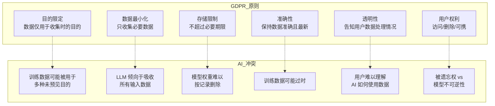
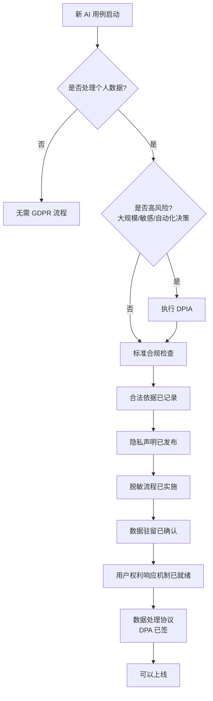
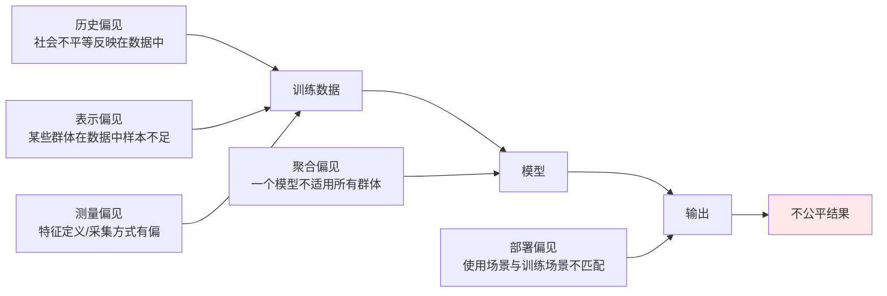
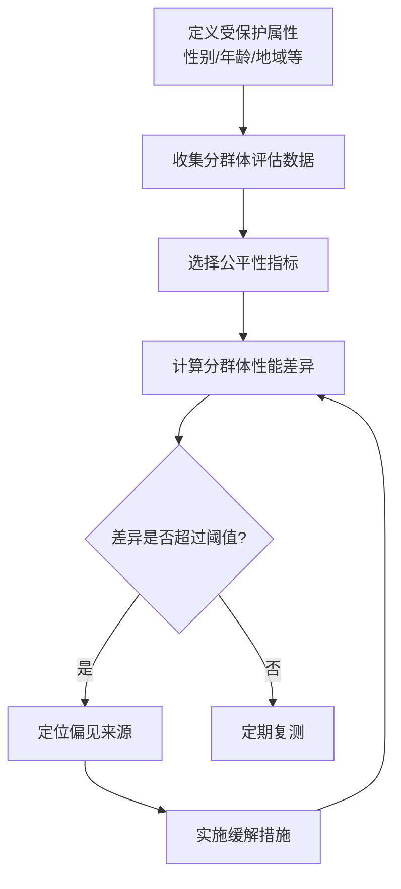
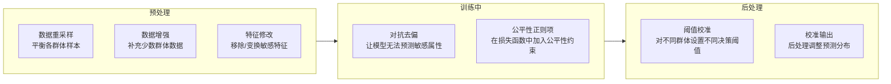
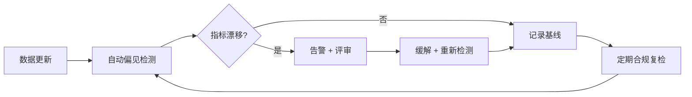

# 数据隐私合规与偏见检测实战

> [教程 38-治理合规] 本文是治理合规系列的第三篇，聚焦两个硬性合规领域——以 GDPR 为代表的数据隐私法规落地，以及 AI 系统中的偏见检测方法。两者都是 AI 系统上线前的"必检项"。

---

## 一、数据隐私：GDPR 视角下的 AI 数据处理

### 1.1 为什么 AI 项目是隐私高风险

AI 系统（尤其是 LLM Agent）在隐私方面有三重风险叠加：

- **数据密集**：训练和推理都需要大量数据，其中可能包含个人数据（PII）。
- **记忆风险**：大语言模型有可能在训练中"记住"敏感信息，并在推理时泄露。
- **流转复杂**：数据从用户 → API → 模型 → 向量库 → 日志，链路长，泄露面大。

GDPR 虽然是欧盟法规，但因其"长臂管辖"（任何处理欧盟居民个人数据的组织都受其约束）和示范效应，事实上已成为全球隐私合规的事实基准。

### 1.2 GDPR 核心原则与 AI 的冲突点



其中最棘手的是**被遗忘权（Right to Erasure, Art. 17）** vs 模型不可逆性：一旦个人数据进入模型权重，传统的"删除一条数据库记录"无法实现真正的遗忘。这需要在架构设计阶段就考虑。

### 1.3 落地框架：五层防护


#### 第一层：数据采集合规

- **合法依据**：每项个人数据的处理必须有合法依据（同意、合同、合法利益等）。AI 训练通常依赖"同意"或"合法利益"，后者需要进行合法利益评估（LIA）。
- **隐私声明**：在数据采集点（如注册页、表单）向用户说明数据将如何用于 AI 训练，并提供 opt-out 选项。
- **DPIA**：高风险数据处理前进行数据保护影响评估（Data Protection Impact Assessment），这是 GDPR 第 35 条的硬性要求。

#### 第二层：脱敏与匿名化

在数据进入训练管线之前，进行 PII 识别和脱敏。

| 技术 | 说明 | 工具 |
|------|------|------|
| 正则匹配 | 身份证号、手机号、邮箱等格式化 PII | Java Pattern / Presidio |
| NER 识别 | 姓名、地址、组织名等非结构化 PII | spaCy / presidio-analyzer |
| 假名化 | 用可逆映射替换 PII | 自研映射表 + 加密存储 |
| 差分隐私 | 在训练数据中注入噪声 | Opacus / TensorFlow Privacy |
| 匿名化 | 不可逆地移除标识信息 | k-anonymity / l-diversity |

**注意：假名化（Pseudonymization）不等于匿名化（Anonymization）。** GDPR 下，假名化数据仍然是个人数据，只有真正匿名化的数据才不受 GDPR 约束。

#### 第三层：处理过程防护

- **数据驻留**：确保个人数据不跨境传输到无"充分保护认定"的地区。使用 LLM API 时，确认供应商的数据处理地域。
- **访问控制**：训练数据和生产数据的访问权限分离，最小权限原则。
- **联邦学习**：在极端隐私要求场景下，考虑数据不出本地的联邦学习方案。

#### 第四层：输出过滤

LLM Agent 的输出可能无意中泄露训练数据中的 PII。需要：

- 在推理输出后增加 PII 过滤层（与第二层使用相同的检测逻辑）。
- 对工具调用的返回结果（如数据库查询结果）进行 PII 脱敏后再展示给用户。
- 建立"安全回退"机制：当检测到输出包含高置信度的 PII 时，替换为脱敏版本。

#### 第五层：用户权利响应

GDPR 赋予用户八项权利，其中与 AI 最相关的是：

- **访问权（Art. 15）**：用户可以请求查看其个人数据被如何处理。需要维护数据处理日志。
- **删除权/被遗忘权（Art. 17）**：用户要求删除其数据。对于数据库中的结构化数据可以直接删除；对于已进入模型权重的数据，需要实施"机器遗忘"（Machine Unlearning）或承诺在下次重训练时排除该用户的数据。
- **反对权（Art. 21）**：用户可以反对其数据被用于自动决策。Agent 系统应提供人工介入（HITL）的替代方案。

### 1.4 实操检查清单



---

## 二、偏见检测：让 AI 输出可问责

### 2.1 偏见的来源

AI 系统中的偏见不是单一来源，而是在数据生命周期的不同阶段被引入的：



### 2.2 公平性定义

"公平"没有统一定义，不同定义之间可能互相矛盾。常用的数学定义分为三类：

| 类别 | 定义 | 含义 |
|------|------|------|
| **群体公平** | Demographic Parity | 不同群体的正向预测率相同 |
| | Equal Opportunity | 不同群体的召回率（TPR）相同 |
| | Equalized Odds | 不同群体的 TPR 和 FPR 都相同 |
| **个体公平** | Individual Fairness | 相似的个体得到相似的预测 |
| **程序公平** | 无关特征不被使用 | 模型不使用受保护属性（如种族、性别） |

**选择哪种定义取决于业务场景。** 例如，贷款审批适合 Equal Opportunity（确保不同群体有同等的获批机会），而广告投放可能只需要 Demographic Parity（确保不同群体看到广告的比例相当）。

### 2.3 检测流程



### 2.4 具体检测方法

#### 方法一：分群体性能对比

将评估数据集按受保护属性分组，分别计算关键指标，比较组间差异。

```
# 伪代码示例
for group in [male, female]:
    subset = eval_data.filter(attribute == group)
    accuracy[group] = compute_accuracy(model, subset)
    tpr[group] = compute_tpr(model, subset)
    fpr[group] = compute_fpr(model, subset)

disparity = max(accuracy.values()) - min(accuracy.values())
if disparity > THRESHOLD:
    alert("检测到公平性差异: " + disparity)
```

对于 LLM Agent，"性能"的定义需要适配：
- 任务完成率按用户语言分组（英语 vs 非英语）。
- 工具调用准确率按用户地域分组。
- 推荐质量按用户资历分组（新手 vs 资深）。

#### 方法二：偏见词分析

对 LLM 的生成内容进行词频分析，检测是否对某些群体存在系统性负面关联。

- 构建一份"偏见测试集"：包含涉及不同群体的提示词。
- 对模型输出进行情感分析/关键词提取。
- 比较不同群体对应的输出情感倾向是否有显著差异。

#### 方法三：反事实测试

对同一条输入，仅修改受保护属性（如把"他"改成"她"），观察输出是否发生不应有的变化。

```
原始: "一位男性工程师申请项目经理职位..."
反事实: "一位女性工程师申请项目经理职位..."
→ 比较模型给出的推荐/评分是否一致
```

### 2.5 缓解策略

检测到偏见后，可以在三个阶段进行缓解：



**没有银弹**：每种缓解策略都有代价。预处理可能降低整体准确率；训练中方法增加训练复杂度；后处理可能引发"逆向歧视"争议。缓解策略的选择本身是一个需要记录的决策（建议写入 ADR）。

### 2.6 推荐工具

| 工具 | 来源 | 能力 |
|------|------|------|
| AIF360 | IBM | 全流程公平性检测和缓解（Python） |
| Fairlearn | Microsoft | 分群体指标计算 + 缓解算法 |
| What-If Tool | Google | 可视化分析模型公平性 |
| Responsibly | 开源 | 个体公平性和词嵌入偏见检测 |
| AI Verify | 新加坡 IMDA | 端到端 AI 测试框架 |

---

## 三、隐私与偏见的交汇点

隐私和偏见不是两个独立的问题，它们在某些场景下会交汇：

- **隐私脱敏可能加剧偏见**：如果脱敏过程不成比例地移除了某个群体的数据（例如某些地区的地址格式更容易被识别为 PII），会导致该群体在训练数据中更少出现。
- **差分隐私的公平性代价**：差分隐私通过添加噪声保护隐私，但噪声对小众群体的影响可能更大，因为它们的样本本来就少。
- **公平性审计需要群体信息**：检测偏见需要知道用户的受保护属性（如种族、性别），但这与数据最小化原则矛盾。解决方案：使用联邦统计或安全多方计算来在不收集原始属性的前提下计算分群体指标。

---

## 四、建立持续检测机制

一次性检测是不够的。偏见和隐私风险会随数据和模型的变化而演化。



建议在 CI/CD 流水线中加入偏见检测门禁：如果关键公平性指标相比基线恶化超过设定阈值（如 5 个百分点），自动阻断发布。

---

## 五、总结

数据隐私和偏见检测是 AI 合规的两根承重柱。本文的核心要点：

1. **隐私合规是系统工程**：GDPR 不是法务一个人的事，而是从数据采集到模型输出的五层防护体系。架构师在设计阶段就要考虑"被遗忘权如何实现"这种硬约束。
2. **偏见检测先定义后度量**：没有明确的公平性定义，指标计算就毫无意义。选择哪种公平性定义是一个业务决策，不是技术决策，需要干系人参与。
3. **持续而非一次性**：隐私风险和偏见会随数据和模型的演化而变化，必须建立自动化、定期化的检测机制，嵌入 CI/CD 流水线。

至此，治理合规系列三篇文档构成完整闭环：`00-NIST-AI-RMF框架.md` 给出整体治理骨架，`01-模型卡片与数据卡片.md` 提供透明度工具，本文聚焦隐私和偏见这两个最硬的合规检查项。三者结合，可以让企业 AI 项目从"能跑"走向"能负责地跑"。
