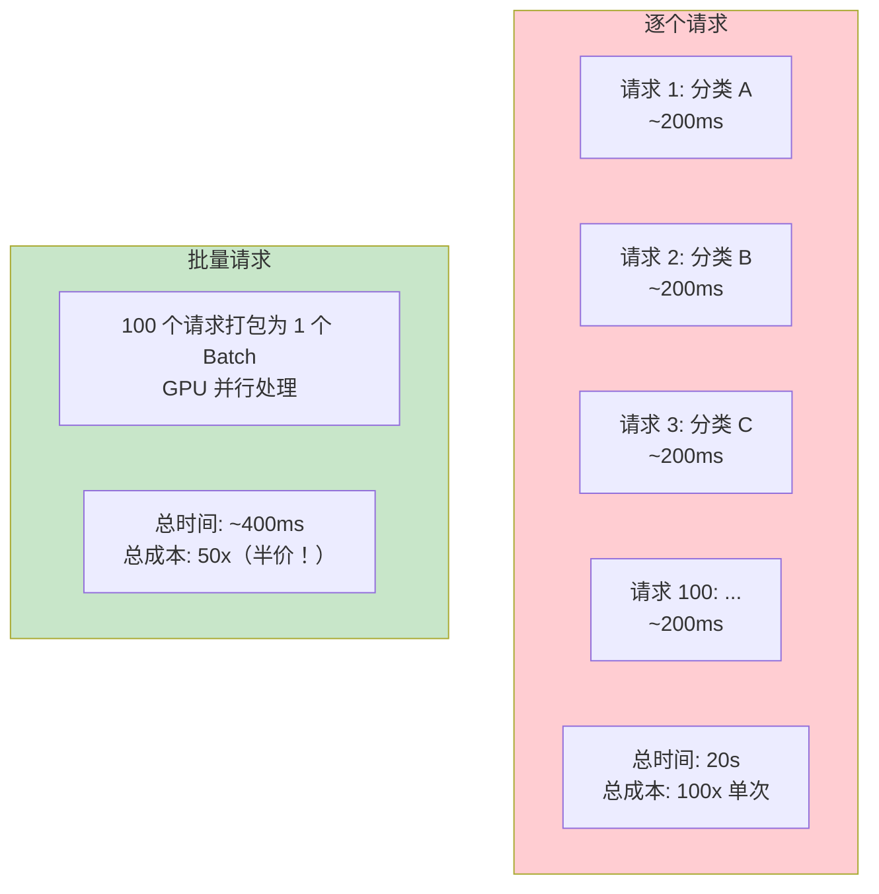
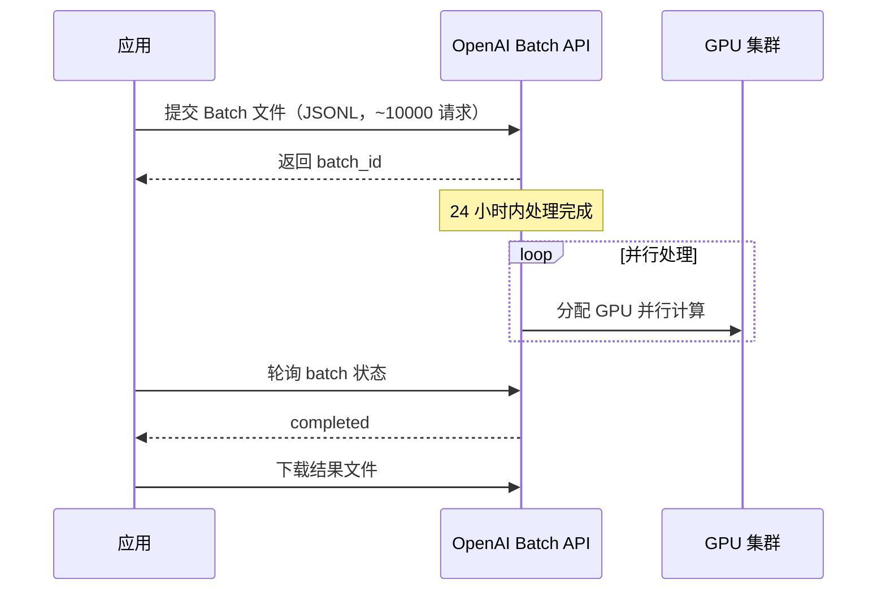
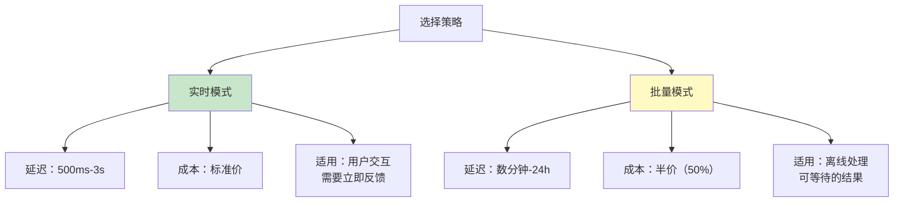
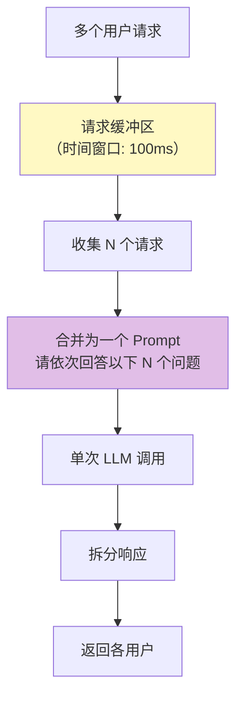
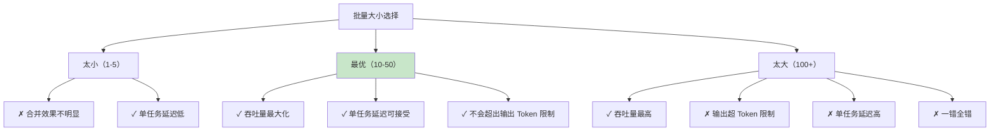
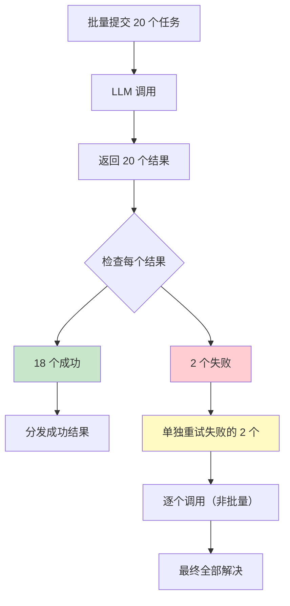
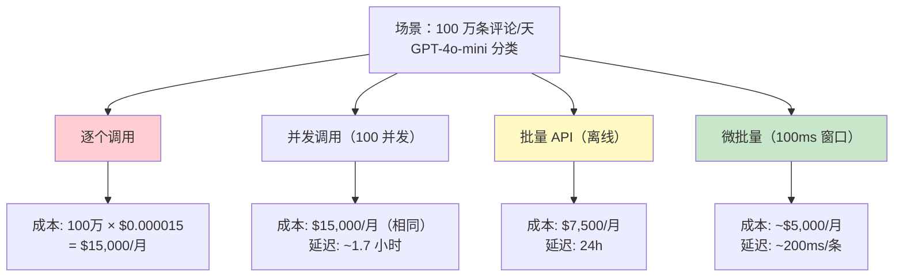
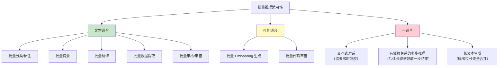

# 批量推理与请求合并

> 「本文是对 [教程 08-架构师进阶/04-Agent性能优化 §5-§7] 的深入展开」

> **定位**：系统讲解 LLM 批量推理（Batch Inference）的技术原理——将多个独立请求合并为一个批次提交，利用 GPU 并行计算能力大幅降低成本和提升吞吐量，以及 Spring AI 中的请求合并实践。
>
> **读者画像**：Agent 系统有大量独立的 LLM 调用（如批量分类、批量摘要、批量翻译），希望优化吞吐量和成本的资深开发者。

---

## 1. 为什么批量推理能省钱

### 1.1 GPU 并行的本质



### 1.2 成本对比

| 模式 | 100 次调用 | 延迟 | 成本 |
|------|-----------|------|------|
| 逐个调用 | 100 × 500ms | 50s | 100x |
| 并发调用 | 100 并行 × 500ms | 500ms | 100x |
| 批量推理 | 1 batch × 800ms | 800ms | **50x** |

**批量推理与并发调用的区别**：
- **并发调用**：100 个 HTTP 请求同时发出，服务端可能限流。
- **批量推理**：1 个 HTTP 请求包含 100 个子任务，服务端内部并行处理。

---

## 2. OpenAI Batch API

### 2.1 批量提交模式



### 2.2 批量请求构建

```java
// 概念代码：Spring AI 2.0 的 spring-ai-openai 未提供类型化 Batch API（无 OpenAiBatchApi 等类）。
// OpenAI Batch API 是 REST 接口（files/batches 端点，JSONL 格式）：上传文件 → 创建任务 → 轮询 → 下载结果。
// 下面用 WebClient 演示流程骨架，JSON 解析细节省略；真实 Spring AI API 见附录 05-SpringAI2-API基准。
@Service
public class BatchInferenceService {

    private final WebClient openAiBatchClient;

    public BatchInferenceService(WebClient.Builder webClientBuilder) {
        // base-url 指向 https://api.openai.com/v1，鉴权 Header 注入方式省略
        this.openAiBatchClient = webClientBuilder.baseUrl("https://api.openai.com/v1").build();
    }

    /**
     * 批量分类：将 10000 条评论构建为 JSONL，上传并创建 Batch 任务
     */
    public Mono<BatchResult> batchClassify(List<String> reviews) {
        // 1. 构建 JSONL：每行一个独立的 chat.completions 请求
        String jsonl = reviews.stream()
            .map(review -> """
                {"custom_id": "%s", "method": "POST", "url": "/v1/chat/completions",
                 "body": {"model": "gpt-4o-mini", "messages": [
                   {"role": "system", "content": "分类评论为正面/负面/中性。只返回分类结果。"},
                   {"role": "user", "content": "%s"}], "max_tokens": 10}}
                """.formatted(UUID.randomUUID(), escapeJson(review)))
            .collect(Collectors.joining("\n"));

        // 2. 上传文件 → 返回 file_id（概念实现：响应体解析为 file_id 的过程省略）
        Mono<String> fileId = openAiBatchClient.post()
            .uri("/files")
            .bodyValue(Map.of("purpose", "batch", "file", jsonl))
            .retrieve()
            .bodyToMono(String.class)
            .map(this::parseFileId);

        // 3. 创建 Batch 任务（POST /batches），随后轮询直到 completed
        return fileId
            .flatMap(fid -> openAiBatchClient.post()
                .uri("/batches")
                .bodyValue(Map.of(
                    "input_file_id", fid,
                    "endpoint", "/v1/chat/completions",
                    "completion_window", "24h"))
                .retrieve()
                .bodyToMono(String.class)
                .map(this::parseBatchId))
            .flatMap(this::pollUntilComplete)
            .map(this::downloadResults);
    }

    // 轮询 GET /batches/{id}，status=completed 则结束，否则 30 秒后重试
    private Mono<String> pollUntilComplete(String batchId) {
        return Mono.defer(() -> openAiBatchClient.get()
                .uri("/batches/{id}", batchId)
                .retrieve()
                .bodyToMono(String.class))
            .map(this::parseStatus)
            .flatMap(status -> "completed".equals(status)
                ? Mono.just(batchId)
                : Mono.delay(Duration.ofSeconds(30)).then(pollUntilComplete(batchId)));
    }
}
```

### 2.3 批量 vs 实时



---

## 3. 请求合并模式

### 3.1 微批量（Micro-batching）

对于不能等 24 小时的场景，可以自建**微批量**：在短时间窗口内收集多个请求，合并后并发提交。



### 3.2 Java 实现

```java
@Service
public class RequestBatcher<T, R> {

    private final Duration window;
    private final int maxBatchSize;
    private final BatchProcessor<T, R> processor;

    private final Sinks.Many<BatchEntry<T, R>> sink;

    public RequestBatcher(Duration window, int maxBatchSize,
                           BatchProcessor<T, R> processor) {
        this.window = window;
        this.maxBatchSize = maxBatchSize;
        this.processor = processor;

        this.sink = Sinks.many().multicast().onBackpressureBuffer();

        // 核心：缓冲 + 窗口 + 合并
        this.sink.asFlux()
            .bufferTimeout(maxBatchSize, window)  // 攒满 N 个或超时
            .flatMap(this::processBatch)
            .subscribe();
    }

    public Mono<R> submit(T request) {
        return Mono.<R>create(sink -> {
            BatchEntry<T, R> entry = new BatchEntry<>(request, sink);
            this.sink.tryEmitNext(entry);
        });
    }

    private Mono<Void> processBatch(List<BatchEntry<T, R>> batch) {
        List<T> inputs = batch.stream()
            .map(BatchEntry::request)
            .toList();

        return processor.process(inputs)
            .doOnNext(results -> {
                // 将结果分发回各请求
                for (int i = 0; i < batch.size() && i < results.size(); i++) {
                    batch.get(i).sink().success(results.get(i));
                }
            })
            .doOnError(e -> {
                batch.forEach(entry -> entry.sink().error(e));
            })
            .then();
    }
}

@FunctionalInterface
public interface BatchProcessor<T, R> {
    Mono<List<R>> process(List<T> batch);
}

record BatchEntry<T, R>(T request, MonoSink<R> sink) {}
```

### 3.3 使用示例

```java
@Service
public class ClassificationBatchService {

    private final RequestBatcher<String, String> batcher;

    public ClassificationBatchService(ChatClient chatClient) {
        this.batcher = new RequestBatcher<>(
            Duration.ofMillis(100),  // 100ms 窗口
            20,                       // 最大 20 个一批
            (List<String> reviews) -> {
                // 将 20 个评论合并为一个 Prompt
                String combinedPrompt = buildCombinedPrompt(reviews);

                return Mono.fromCallable(() ->
                    chatClient.prompt()
                        .user(combinedPrompt)
                        .call()
                        .entity(new ParameterizedTypeReference<List<String>>() {})  // 结构化输出
                ).subscribeOn(Schedulers.boundedElastic());
            }
        );
    }

    public Mono<String> classify(String review) {
        return batcher.submit(review);
    }

    private String buildCombinedPrompt(List<String> reviews) {
        StringBuilder sb = new StringBuilder("请依次对以下评论进行分类（正面/负面/中性）：\n\n");
        for (int i = 0; i < reviews.size(); i++) {
            sb.append(i + 1).append(". ").append(reviews.get(i)).append("\n");
        }
        sb.append("\n输出 JSON 数组，每个元素为分类结果。");
        return sb.toString();
    }
}
```

---

## 4. 合并 Prompt 的设计

### 4.1 多任务合并模板

```java
public class MultiTaskPromptBuilder {

    /**
     * 将多个独立任务合并为一个 Prompt
     */
    public String build(List<Task> tasks) {
        StringBuilder sb = new StringBuilder();
        sb.append("请依次完成以下任务，输出 JSON 数组：\n\n");

        for (int i = 0; i < tasks.size(); i++) {
            Task task = tasks.get(i);
            sb.append("""
                ### 任务 %d
                类型: %s
                输入: %s
                要求: %s
                """.formatted(
                    i + 1,
                    task.type(),
                    task.input(),
                    task.requirement()
                ));
        }

        sb.append("""

            输出格式：
            [
              {"task_id": 1, "result": "..."},
              {"task_id": 2, "result": "..."},
              ...
            ]
            """);

        return sb.toString();
    }
}
```

### 4.2 输出解析

```java
public class BatchResultParser {

    public <T> List<T> parse(String llmOutput, Class<T> type) {
        // 解析 JSON 数组
        List<RawResult> raw = objectMapper.readValue(
            llmOutput,
            new TypeReference<List<RawResult>>() {}
        );

        return raw.stream()
            .map(r -> objectMapper.convertValue(r.result(), type))
            .toList();
    }
}

public record RawResult(int task_id, Object result) {}
```

---

## 5. 吞吐量优化

### 5.1 批量大小调优



### 5.2 动态批量大小

```java
@Component
public class DynamicBatchSizer {

    private final TokenCounter tokenCounter;
    private static final int MAX_OUTPUT_TOKENS = 4096;
    private static final int MAX_INPUT_TOKENS = 120000;

    public int optimalBatchSize(List<String> pendingRequests) {
        if (pendingRequests.isEmpty()) return 0;

        // 估算每个请求的输出 Token 数
        int avgOutputTokens = estimateAvgOutput(pendingRequests);

        // 确保总输出不超过限制
        int maxByOutput = MAX_OUTPUT_TOKENS / avgOutputTokens;

        // 确保总输入不超过限制
        int totalInputTokens = pendingRequests.stream()
            .mapToInt(tokenCounter::countTokens)
            .sum();
        int maxByInput = MAX_INPUT_TOKENS /
            (totalInputTokens / pendingRequests.size());

        // 还要考虑响应时间约束
        int maxByLatency = 20; // 经验值

        return Math.min(Math.min(maxByOutput, maxByInput), maxByLatency);
    }
}
```

---

## 6. 错误处理

### 6.1 批量中的部分失败



### 6.2 实现

```java
public Mono<BatchProcessingResult> processWithRetry(
        List<BatchEntry<T, R>> batch) {
    return processor.process(inputs)
        .map(results -> {
            BatchProcessingResult result = new BatchProcessingResult();

            for (int i = 0; i < batch.size(); i++) {
                if (i < results.size() && isValid(results.get(i))) {
                    batch.get(i).sink().success(results.get(i));
                    result.addSuccess(i);
                } else {
                    result.addFailure(i);
                }
            }
            return result;
        })
        .flatMap(batchResult -> {
            // 对失败的条目逐个重试
            List<Mono<Void>> retries = batchResult.failedIndices().stream()
                .map(i -> retryIndividually(batch.get(i)))
                .toList();
            return Flux.merge(retries).then().thenReturn(batchResult);
        });
}
```

---

## 7. 成本优化案例

### 7.1 场景：每天 100 万条评论分类



### 7.2 年度成本节省

| 策略 | 月成本 | 年成本 | 年节省 |
|------|--------|--------|--------|
| 逐个调用 | $15,000 | $180,000 | — |
| 并发调用 | $15,000 | $180,000 | $0 |
| Batch API | $7,500 | $90,000 | $90,000 (50%) |
| 微批量 | $5,000 | $60,000 | $120,000 (67%) |
| 微批量 + 语义缓存 | $1,500 | $18,000 | $162,000 (90%) |

---

## 8. 适用场景矩阵



---

## 9. 完整的生产级实现

```java
@Service
public class ProductionBatchService {

    private final ChatClient chatClient;
    private final RequestBatcher<ClassifyRequest, ClassifyResult> batcher;

    @PostConstruct
    public void init() {
        this.batcher = new RequestBatcher<>(
            Duration.ofMillis(150),   // 150ms 窗口
            25,                        // 最大 25 个一批
            this::processBatch
        );
    }

    private Mono<List<ClassifyResult>> processBatch(
            List<ClassifyRequest> requests) {
        // 1. 构建合并 Prompt
        String prompt = buildBatchPrompt(requests);

        long start = System.nanoTime();
        return Mono.fromCallable(() ->
                chatClient.prompt()
                    .user(prompt)
                    .call()
                    .entity(new ParameterizedTypeReference<List<ClassifyResult>>() {})
            )
            .subscribeOn(Schedulers.boundedElastic())
            .timeout(Duration.ofSeconds(30))
            .doOnSuccess(results -> {
                long latency = (System.nanoTime() - start) / 1_000_000;
                metrics.record("batch.size", requests.size());
                metrics.record("batch.latency", latency);
                metrics.increment("batch.success");
            })
            .doOnError(e -> {
                metrics.increment("batch.error");
                log.error("批量处理失败", e);
            })
            .onErrorResume(e -> {
                // 降级：逐个处理
                return processIndividually(requests);
            });
    }

    private Mono<List<ClassifyResult>> processIndividually(
            List<ClassifyRequest> requests) {
        return Flux.fromIterable(requests)
            .flatMap(req -> Mono.fromCallable(() ->
                chatClient.prompt()
                    .user(buildSinglePrompt(req))
                    .call()
                    .entity(ClassifyResult.class)
            ).subscribeOn(Schedulers.boundedElastic()))
            .collectList();
    }
}
```

---

## 10. 总结

批量推理是大规模 Agent 系统的**成本杀手锏**：

1. **OpenAI Batch API 半价**——适合 24h 内可完成的离线任务。
2. **微批量是实时场景的方案**——100ms 窗口收集请求，合并提交。
3. **最优批量大小 10-50**——太小没效果，太大风险高。
4. **合并 Prompt 设计是关键**——结构化输出便于拆分。
5. **部分失败要优雅处理**——批量中个别失败要单独重试。
6. **批量 + 语义缓存 = 终极优化**——两者叠加可节省 90% 成本。

不是所有场景都适合批量——交互式对话和多步推理仍然是实时的领域。但对于"大量独立的简单任务"，批量推理的 ROI 极高。
