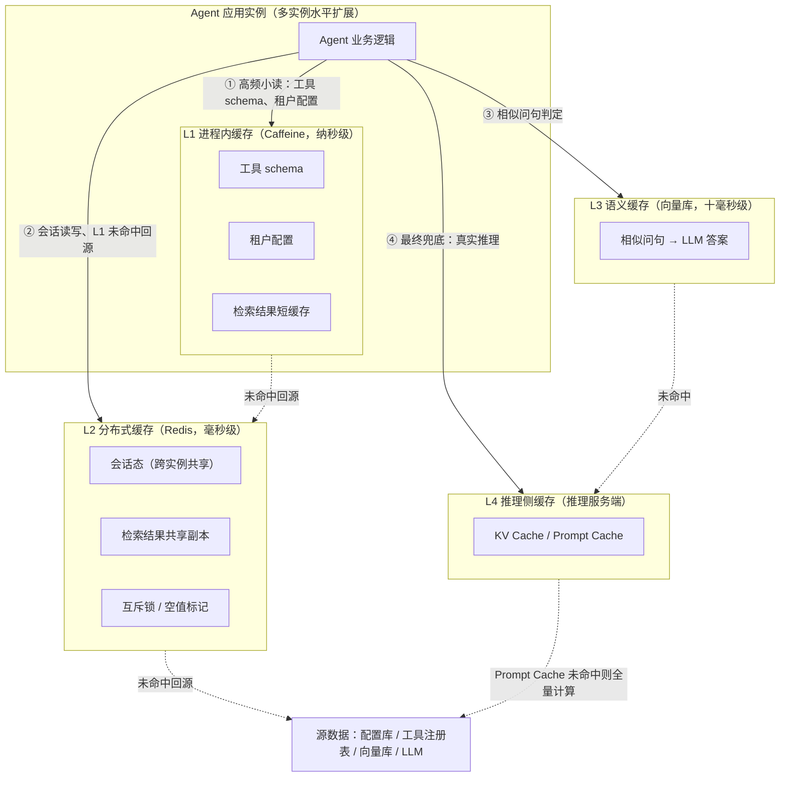
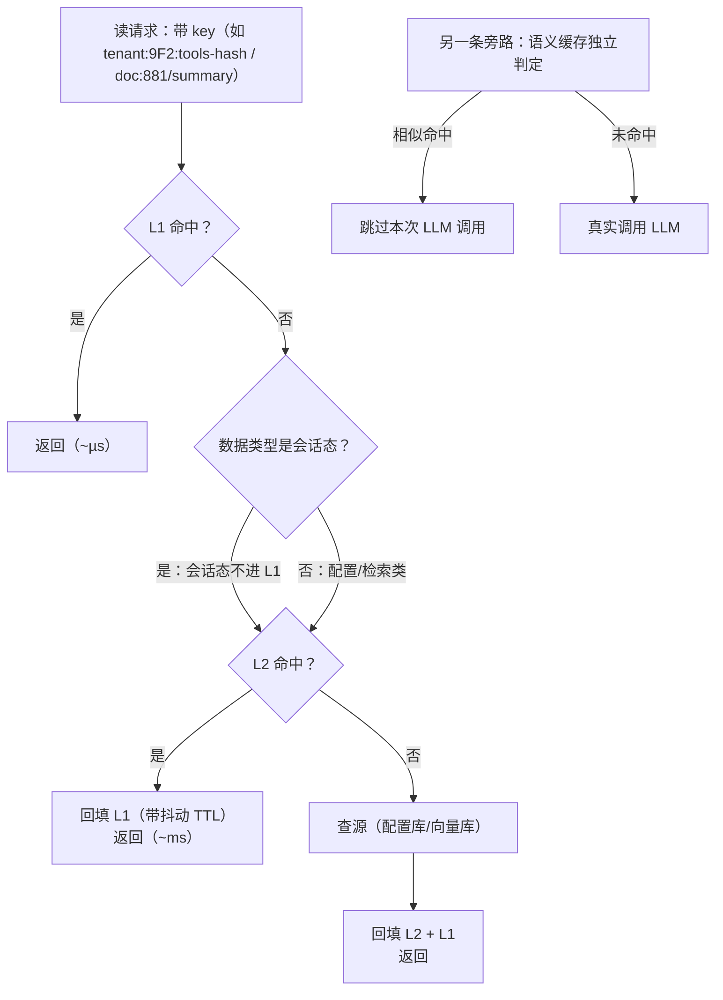
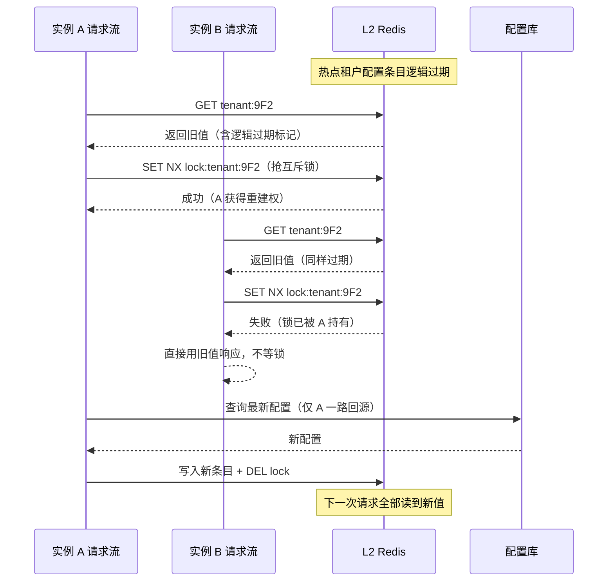
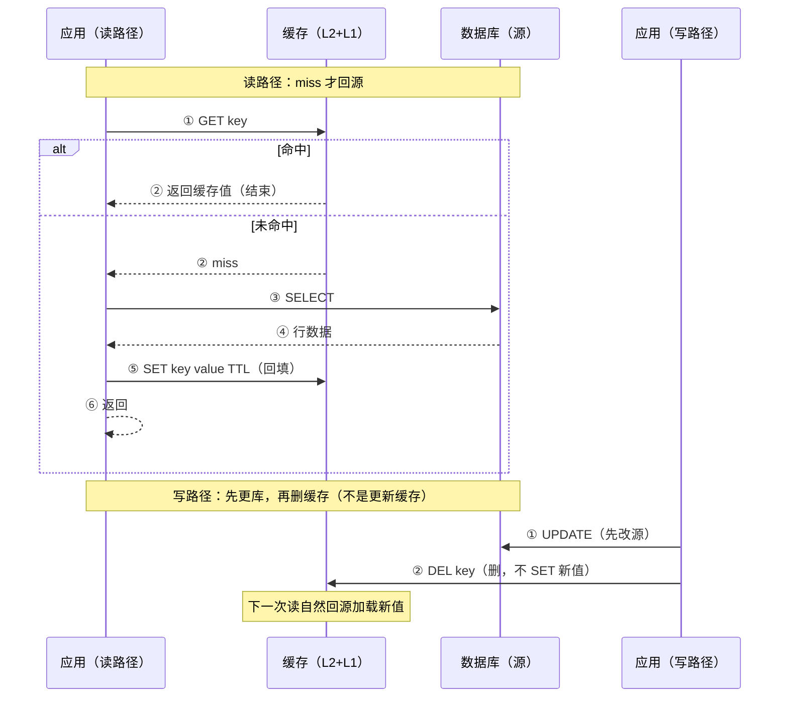
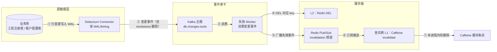

# 多级缓存架构：从进程内到推理侧的四层体系

> 「本文是附录 09 的**通用缓存架构母篇**：[附录 09-语义缓存与性能/00-语义缓存实现] 讲 L3 语义缓存内部、[附录 09-语义缓存与性能/01-Prompt缓存与KVCache] 讲 L4 推理侧缓存内部、[附录 09-语义缓存与性能/02-批量推理与请求合并] 讲请求合并——本文回答的是上一层的问题：**这些缓存技术在一个企业级 Agent 系统里如何组织成分层体系，层与层之间如何分工、失效与保持一致**。」

> **定位**：系统讲解 Agent 系统的多级缓存架构——L1 进程内（Caffeine）→ L2 分布式（Redis）→ L3 语义缓存 → L4 推理侧 KV/Prompt Cache 的四层分工；缓存穿透/击穿/雪崩三大经典问题在 Agent 场景的具体形态与对策；Cache-Aside 一致性与跨层失效传播；TTL 策略分层。读完你能为一个多实例部署的 Agent 平台画出完整的缓存分层图，并说清每一层的失效语义。
>
> **读者画像**：Agent 系统已完成多实例部署，或正在做管控分离/多租户改造，发现"加一个缓存"解决不了问题（命中率低、改一次配置各实例不一致、热点配置过期瞬间数据库被打挂）的架构师与资深开发者。
>
> **前置阅读**：[教程 08-架构师进阶/00-上下文工程 §5]（缓存位于上下文工程的位置）；[教程 04-企业级架构主干/06-多租户隔离与资源治理]（租户配置的来源）；本夹 00/01 两篇（L3/L4 内部机制，本文只引用不重复）。

---

## 1. 为什么 Agent 系统需要多级缓存

### 1.1 一条 Agent 请求里的全部读操作

单层缓存之所以在 Agent 系统里不够用，根源在于：**一条请求沿链路要读的数据，其"变化频率"和"共享范围"完全不同**。把不同变化频率的数据塞进同一层缓存，要么浪费内存（长寿命数据占着短 TTL 的坑），要么不一致（短寿命数据被长 TTL 拖着不更新）。

| 链路环节 | 读的是什么 | 典型变化频率 | 共享范围 | 不缓存的代价 |
|---|---|---|---|---|
| 请求进入 | 租户配置（模型路由、配额、护栏等级） | 天/小时级 | 全实例共享 | 每请求查一次配置库 |
| 工具调用前 | 工具 schema、工具描述、权限分级 | 周级 | 全实例共享 | 每次工具决策都序列化全量工具定义 |
| 检索前 | 向量检索结果（同问句短窗口内） | 分钟级 | 跨实例可共享 | 相同问题重复走一次向量库 |
| 生成前 | 相同/相似问句的 LLM 答案 | 天级 | 跨实例共享 | 相似问题重复付费调用 LLM |
| 生成中 | 推理引擎的 KV Cache | 单请求内+跨请求前缀复用 | 推理服务端 | 每次重算长前缀，延迟与费用双增 |
| 全程 | 会话态（消息历史、中间状态） | 实时写 | 跨实例必须共享（多轮对话可能落到不同实例） | 会话粘滞或状态丢失 |

这张表暴露了一个事实：**从"纳秒级进程内存读"到"500 毫秒的 LLM 推理"，Agent 一条请求横跨 6 个数量级的延迟谱**。没有任何单一缓存层能同时服务两端——进程内存放不下跨实例共享的会话态，Redis 的 1ms 网络往返又兜不住"每请求读一次工具 schema"这种高频小读。

### 1.2 各级存储的延迟量级

| 层级 | 典型延迟 | 容量边界 | 每次读的货币成本 |
|---|---|---|---|
| 进程内（Caffeine） | ~100ns–1µs | 受堆内存限制（百 MB 级） | 零 |
| Redis | ~0.5–2ms（同机房网络往返） | 百 GB 级（可扩） | 零 |
| 语义缓存（向量库） | ~10–50ms（Embedding + ANN 检索） | 十亿级向量 | 极低 |
| LLM 推理（未命中 Prompt Cache） | 数百 ms–数十 s | — | 按输入+输出 token 计费 |

结论很直白：**能用 L1 就不碰 L2，能用 L2 就不打 L3 之后的任何一环**。分层缓存的本质是把"读"尽量留在离 CPU 近的地方，把穿透到远端（数据库、LLM）的读压缩到必需的最小集。



这张图里有一条重要的隐性规则：**L1 与 L2 缓存的是"确定性数据"（同样的 key 拿回同样的值），L3 与 L4 缓存的是"概率性命中"（语义缓存按相似度命中、KV Cache 按前缀前奏命中）**。前两层的失效问题是一致性问题（值变了缓存没变），后两层的失效问题是正确率问题（命中了但不该命中）。本文 §5–§6 集中处理前两层；后两层的命中正确率分别在 00/01 两篇内部处理。

## 2. 四层体系总览

### 2.1 各层职责、失效语义与成本

| 维度 | L1 进程内（Caffeine） | L2 分布式（Redis） | L3 语义缓存 | L4 KV/Prompt Cache |
|---|---|---|---|---|
| **适用数据** | 工具 schema、租户配置、检索结果短缓存 | 会话态、跨实例共享读、互斥锁/空值标记 | 相似问句→答案 | System Prompt、Few-shot 前缀的推理侧复用 |
| **命中粒度** | 精确 key | 精确 key | Embedding 相似度 ≥ 阈值 | Prompt 前缀逐字节一致 |
| **失效语义** | TTL + 容量淘汰 + 显式 invalidate | TTL + DEL + 事件驱动失效 | 相似度阈值 + 语义 TTL + 主动失效（见 00 篇 §5） | 服务端按前缀管理，应用侧只能"影响"不能"控制"（见 01 篇 §2.2） |
| **一致性风险** | **最高**：各实例存活期彼此独立 | 中：单点真相，但读写竞态仍存 | 命中内容可能过时（语义级容忍） | 无应用侧风险（内容由请求本身决定） |
| **容量成本** | 堆内存，百 MB 级 | 内存，GB 级 | 向量库存储 | 推理服务显存（服务端计） |
| **故障爆炸半径** | 单实例 | 共享组件（宕机影响全部实例） | 向量库 | 推理服务内部 |
| **本篇覆盖** | §3 全讲 | §4 全讲 | 仅分层定位，内部见 00 篇 | 仅分层定位，内部见 01 篇 |

分工要点：**L1 扛频率，L2 扛共享，L3 扛语义重复，L4 扛前缀重复**。四者各挡一类重复，缺任何一层，那类重复就会原样漏到最贵的资源上。

### 2.2 查找路径：逐层回源与旁路

读路径的关键决策是"谁负责回源"。两种风格：

- **串联回源**（L1 miss → 查 L2 → L2 miss → 查源，逐层回填）：适合配置类、检索结果类**确定性数据**。
- **并行旁路**（会话态只放 L2；L3 语义缓存独立挡在 LLM 调用前，与 L1/L2 无串联关系）：会话态放 L1 反而危险（多实例下读到旧消息），语义缓存的"key"是问句的 Embedding，与 L1 的精确 key 是两个维度。



注意旁路的语义缓存命中后**跳过的是 LLM 调用**，而不是"返回缓存值结束请求"——工具调用、会话写入等后续流程照常，这是语义缓存与数据缓存容易混淆的地方（详见 00 篇 §2）。

### 2.3 写路径：数据归属决定写法

| 数据 | 写法 | 理由 |
|---|---|---|
| 租户/工具配置 | 写源库 → 事件驱动失效 L1/L2（§6.4） | 低频写，一致性优先于写延迟 |
| 检索结果 | 只读缓存（源是向量库，不可写缓存） | 缓存值是派生物，失效靠 TTL |
| 会话态 | **直接写 L2，L1 只做本实例读加速** | 会话态的真身在 L2，L1 是副本 |
| 语义缓存 | LLM 答案生成后异步写入 | 写失败可容忍（下次未命中重算） |

## 3. L1 进程内缓存：Caffeine

### 3.1 依赖与三个缓存实例

> **需在 pom.xml 添加依赖**（Caffeine 非本项目 pom 声明依赖）：
>
> ```xml
> <dependency>
>     <groupId>com.github.ben-manes.caffeine</groupId>
>     <artifactId>caffeine</artifactId>
>     <version>3.2.2</version>
> </dependency>
> ```
>
> **概念代码警示**：本节所有 Caffeine 代码均为**概念代码**——本地 Maven 仓库无 Caffeine jar，无法按铁律 0 做 javap 实证，签名以 Caffeine 3.x 官方文档为准。相比之下 §4 的全部 Redis 代码已对本地 spring-data-redis 4.1.0 jar 实证。

按 §1.1 的读画像，L1 建议拆成**三个独立缓存实例**，而不是一个大杂烩 Map——不同数据的 TTL、容量、淘汰策略完全不同，混在一起必然互相挤占：

```java
// 概念代码：Caffeine 非本仓 pom 依赖，未 javap 实证
@Configuration
public class CacheTierConfig {

    /** 工具 schema：容量小、条目大（一个工具的定义可能数 KB）、周级变化 */
    @Bean
    public AsyncCache<String, ToolSpec> toolSpecCache() {
        return Caffeine.newBuilder()
                .maximumWeight(8 * 1024 * 1024)          // 按字节估重
                .weigher((String k, ToolSpec v) -> v.estimatedBytes())
                .expireAfterWrite(Duration.ofHours(1))    // 见 §7：长 TTL + 事件失效兜底
                .recordStats()
                .buildAsync();
    }

    /** 租户配置：条目多（每租户一条）、单条小 */
    @Bean
    public AsyncCache<String, TenantConfig> tenantConfigCache() {
        return Caffeine.newBuilder()
                .maximumSize(10_000)                      // 活跃租户数上限
                .expireAfterWrite(Duration.ofMinutes(10)) // 短 TTL，事件失效加速（§6.5）
                .recordStats()
                .buildAsync();
    }

    /** 检索结果：闪变数据，只求挡住同一问句的短窗口重复 */
    @Bean
    public AsyncCache<String, List<RetrievedDoc>> retrievalCache() {
        return Caffeine.newBuilder()
                .maximumSize(5_000)
                .expireAfterWrite(Duration.ofSeconds(60)) // 短 TTL（§7）
                .recordStats()
                .buildAsync();
    }
}
```

`recordStats()` 不是可选项——没有命中率指标，§5 的三大问题、§6 的一致性问题都无法被发现（对接 Micrometer 的做法见 [附录 18-可观测平台实践]）。

### 3.2 WebFlux 铁律：禁止在 EventLoop 上同步回源

这是 L1 在响应式栈里最容易踩的坑。Caffeine 的同步 API（`Cache.get(key, loadingFunction)`）会在**调用线程上执行回源函数**——如果回源是查 Redis（网络 IO）、查库、甚至只是做一次 Embedding HTTP 调用，就等于在 Netty EventLoop 上发了阻塞调用，直接违反 [教程 01-WebFlux与响应式编程] 的铁律，症状是整个实例的所有连接周期性卡顿。

正确姿势是用 `AsyncCache`，回源交给 Reactor 链：

```java
// 概念代码：Caffeine 未实证；Mono/Flux 为 reactor-core 3.7 真实 API
@Component
@RequiredArgsConstructor
public class TenantConfigService {

    private final AsyncCache<String, TenantConfig> tenantConfigCache; // §3.1 的 Bean
    private final TenantConfigRepository repository; // 返回 Mono 的响应式仓库

    public Mono<TenantConfig> get(String tenantId) {
        // AsyncCache.get 的 loader 返回 CompletableFuture：
        // 回源 Mono 在 Reactor 调度器上执行，绝不触碰 EventLoop
        return Mono.fromFuture(
                tenantConfigCache.get(tenantId, (key, executor) ->
                        repository.findByTenantId(key)
                                  // .cache()：多个订阅者共享同一次回源，
                                  // 防止同一 key 并发 miss 时重复打库
                                  .cache()
                                  .toFuture()));
    }
}
```

`Mono.cache()` 在这里承担的角色常被忽略：**并发 miss 合并（singleflight 的进程内版）**。同一瞬间 50 个请求打到同一个冷 key，没有 `.cache()` 就是对源库的 50 次查询；有了它，第一次回源的结果被后续所有订阅者共享。跨实例层面的同一问题（50 个实例同时回源）才是 §5.2 击穿的完整形态。

### 3.3 L1 的固有弱点：各实例存活期彼此独立

L1 最大的架构代价不是容量而是**一致性**：8 个实例的 Caffeine 是 8 个独立的小世界。配置改了，只有"碰巧收到失效事件"或"碰巧 TTL 到期"的实例会更新——没有失效事件的情况下，用户的一次请求命中实例 A 拿到新配置、下一次被负载均衡到实例 B 拿到旧配置，表现为**幽灵抖动**（同一会话行为时对时错）。这就是为什么配置类数据必须"L1 短 TTL + L2 事件驱动失效"双保险（§6.5），也是管控分离架构里配置中心下发失效事件的根本原因（[教程 04-企业级架构主干/00-管控分离架构]）。

## 4. L2 分布式缓存：ReactiveRedisTemplate

### 4.1 依赖与自动装配

> **需在 pom.xml 添加依赖**（本仓 pom 未声明，坐标与版本已对本地仓库实证存在）：
>
> ```xml
> <dependency>
>     <groupId>org.springframework.boot</groupId>
>     <artifactId>spring-boot-starter-data-redis-reactive</artifactId>
> </dependency>
> ```

Boot 4.1 的自动装配（javap 实证）：`org.springframework.boot.data.redis.autoconfigure.DataRedisReactiveAutoConfiguration` 装配两个 Bean——`ReactiveRedisTemplate<Object, Object>` 与 `ReactiveStringRedisTemplate`。后者（key/value 都是 String）是最省心的默认选择：value 存 JSON 字符串，序列化行为完全可控，不踩 §4.2 的序列化坑。

```yaml
spring:
  data:
    redis:
      host: ${REDIS_HOST}
      port: 6379
      timeout: 2s        # 必须配：配合 §5.3 的熔断直查，Redis 不可用时快速失败
```

### 4.2 序列化铁律：只存 Map/DTO，不存多态 SDK 对象

CLAUDE.md 中的 2026-08-22 教训必须在此重申：**Spring AI 的 `Message` 及其子类字段 `private final`、无 property-based Creator，任何 GenericJackson 系序列化器直接持久化 `Message` 都会在读回时失败**（读回 `LinkedHashMap` 或抛 `no property-based Creator`）。写入成功 ≠ 能读回——读回只在已有数据时触发，所以"第一次请求正常、第二次读历史就炸"。会话态入 Redis 的正确范式是**存可序列化 Map（type/content/metadata），读回按 `MessageType` 用 builder 重建**，完整 round-trip 代码见 [附录 05-SpringAI2-API基准/00-Advisor与ChatMemory §2.3]，本篇不重复。

另一个实证发现的版本陷阱：本地 spring-data-redis 4.1.0 同时存在 `Jackson2JsonRedisSerializer`（Jackson 2 时代）与无 2 后缀的 `JacksonJsonRedisSerializer`/`GenericJacksonJsonRedisSerializer`（Jackson 3 时代新类，`jar tf` 实证）。**凭旧版本记忆写类名会踩空**——这也是"一切以本地 jar 实证为准"铁律的价值。

### 4.3 会话态与共享读：实证 API 实战

以下全部 API 已对本地 `spring-data-redis/4.1.0` jar 逐一 javap 实证：

```java
// Spring Data Redis 4.1.0（Boot 4.1.0 BOM）· 已 javap 实证
@Component
@RequiredArgsConstructor
public class SessionStateStore {

    // 自动装配的 ReactiveStringRedisTemplate（§4.1）
    private final ReactiveStringRedisTemplate redis;

    /** 会话中间状态写入：带 TTL 的 set（set(K,V,Duration) 为 default 方法，实证存在） */
    public Mono<Boolean> saveTurn(String sessionId, String turnJson, Duration idleTtl) {
        return redis.opsForValue()
                    .set("agent:session:" + sessionId, turnJson, idleTtl);
    }

    /** 读会话：多实例下任何实例都能读到同一真相 */
    public Mono<String> load(String sessionId) {
        return redis.opsForValue().get("agent:session:" + sessionId);
    }

    /** §5.2 击穿对策的互斥锁原语：setIfAbsent(K,V,Duration) 实证存在 */
    public Mono<Boolean> tryLock(String lockKey, Duration lease) {
        return redis.opsForValue().setIfAbsent(lockKey, "1", lease);
    }

    /** §6 失效传播的删除原语 */
    public Mono<Long> evict(String key) {
        return redis.delete(key);
    }
}
```

会话态的 TTL 语义要特别注意：这里 `set(k, v, idleTtl)` 的 TTL 是"空闲过期"（每次写刷新），它服务于**存储清理**，不等于会话的业务生命周期——两者的差别是 §7 的核心话题。

## 5. 经典三大问题在 Agent 场景的形态与对策

穿透、击穿、雪崩是缓存体系的标准三课，但教科书例子通常是"商品详情页"。Agent 系统里这三者的形态完全不同，而且**更容易发生**——因为 Agent 的读请求带有更强的长尾性（用户会拿不存在的文档 ID 反复追问）和更强的突发性（同一租户早高峰瞬间打满）。

### 5.1 穿透：不存在的 key 反复打穿到源

**Agent 场景形态**：

- 用户在对话里粘贴了一个**已被删除的文档 ID** 并追问"总结一下 881 号文档"——Agent 的检索环节拿着 `doc:881` 反复查向量库/元数据库，每次都 miss 到源。缓存对"不存在的数据"无记忆，于是**每一次都穿透**。
- **工具幻觉**：LLM 编造了一个不存在的工具名 `send_email_v2`，工具解析层拿它查工具注册表——miss；下一轮对话 LLM 可能再次编出同一个名字，继续穿透。不存在的工具 ID 被反复查询，是 Agent 特有而高频的穿透源。

**对策一：空值缓存（首选，实现零依赖）**——把"查过且不存在"也作为一条缓存记录，短 TTL：

```java
// Spring Data Redis 4.1.0 已实证 API；哨兵值约定："\0NULL"
public Mono<Optional<ToolSpec>> findTool(String toolId) {
    String key = "agent:tool:" + toolId;
    return redis.opsForValue().get(key).flatMap(raw -> {
        if (NULL_SENTINEL.equals(raw)) {
            return Mono.just(Optional.<ToolSpec>empty());   // 空值缓存命中：不再穿透
        }
        return Mono.just(Optional.of(deserialize(raw)));
    }).switchIfEmpty(
        toolRegistry.find(toolId)
            .flatMap(spec -> redis.opsForValue()
                    .set(key, serialize(spec), Duration.ofMinutes(30))
                    .thenReturn(Optional.of(spec)))
            // 源头也没有：写入短 TTL 空值标记（TTL 越短，"误判新上线工具"的窗口越小）
            .switchIfEmpty(redis.opsForValue()
                    .set(key, NULL_SENTINEL, Duration.ofSeconds(60))
                    .then(Mono.<Optional<ToolSpec>>empty()))
            .switchIfEmpty(Mono.just(Optional.<ToolSpec>empty()))
    );
}
```

空值 TTL 必须短（秒~分钟级）：它有个固有的误伤窗口——如果 30 秒后管理员真的上线了 `send_email_v2`，空值标记会让它"存在却查不到"最多 60 秒。这是用**短时不可见**换**免穿透**的显式交易，必须写进团队文档而不是口口相传。

**对策二：布隆过滤器（穿透量大时）**——在缓存前放一个"可能存在"过滤器：把所有合法工具 ID/文档 ID 预灌入布隆过滤器，查询先问过滤器，**过滤器说不存在就直接拒绝**（布隆过滤器说"不存在"是 100% 可靠的）。合法 ID 集合可枚举且有限（工具注册表、文档库）正是 Agent 场景的天然优势。实现可选 Guava `BloomFilter`（进程内，随 L1 生命周期）或 RedisBloom 模块（跨实例共享）——两者均非本仓依赖，此处仅作方案描述，不附未实证代码。

### 5.2 击穿：热点 key 过期瞬间的并发回源风暴

**Agent 场景形态**：某个**大租户的配置**（或一份被全员引用的工具 schema）TTL 到期的一瞬间，该租户的所有在途请求同时 miss。§3.2 的 `Mono.cache()` 挡住了**单实例内**的并发回源，但多实例部署下 8 个实例各自回源——如果回源是"查配置库 + 反序列化 + 校验"，瞬间 8 路并发打向源库；更糟的场景是回源本身就重（如重建一份聚合检索结果），源库直接被这一秒打挂。

**对策一：逻辑过期（不阻塞，牺牲短时脏读）**——缓存条目永不过期，但值里带着"逻辑过期时间"；读到逻辑过期的条目照常返回旧值（不阻塞请求），同时触发异步刷新。适合"旧值暂时可用"的数据：工具 schema、租户配置。代价是刷新完成前所有实例读的是旧值——对配置类数据通常完全可接受。

**对策二：互斥重建（不脏读，牺牲等待）**——用 Redis 分布式锁保证同一 key 全局只有一个回源在跑，其余请求等待或走旧值。`setIfAbsent(K, V, Duration)`（实证存在）是锁原语：

```java
// Spring Data Redis 4.1.0 已实证 API + 概念代码（逻辑过期字段设计）
public Mono<TenantConfig> getWithMutex(String tenantId) {
    String key = "agent:tenant:" + tenantId;
    String lockKey = "agent:lock:tenant:" + tenantId;
    return redis.opsForValue().get(key).flatMap(raw -> {
        CachedEnvelope env = CachedEnvelope.parse(raw);
        if (!env.isLogicallyExpired()) {
            return Mono.just(env.value());               // 逻辑未过期：直接返回
        }
        // 逻辑过期 + 尝试抢锁：抢到的实例异步重建，抢不到的返回旧值（不阻塞）
        return redis.opsForValue().setIfAbsent(lockKey, instanceId, Duration.ofSeconds(15))
                .flatMap(locked -> {
                    if (Boolean.TRUE.equals(locked)) {
                        return rebuildAndStore(key, tenantId, lockKey)
                                .onErrorResume(e -> redis.delete(lockKey).then(Mono.error(e)));
                    }
                    return Mono.just(env.value());       // 没抢到锁：旧值顶上，绝不等锁
                });
    }).switchIfEmpty(rebuildAndStore(key, tenantId, null)); // 完全冷启动：直接回源
}
```

两种对策的选型口诀：**"旧值能不能顶一阵"能，用逻辑过期；不能，用互斥重建。** 租户配置显然属于前者——旧配置多用 10 秒不会造成业务事故，而让高峰期请求排队等锁才是事故。



### 5.3 雪崩：大量 key 同时失效，或缓存层整体宕机

**Agent 场景形态**分两种：

1. **同时失效型**：系统启动预热（或批量导入配置）时给几百个租户配置写了相同时长的 TTL，它们会在同一秒集体到期，那一秒起所有请求穿透到配置库。
2. **缓存层宕机型**：Redis 整体不可用（网络分区、主从切换抖动）。此时不是个别 key miss，而是**全部 L2 读写失败**——若代码把 Redis 异常直接上抛，整个 Agent 实例瘫痪；一个缓存组件的故障传染成了全局故障。

**对策一：TTL 抖动（治同时失效）**——基础 TTL 加随机偏移：

```java
// TTL 抖动：把"同一秒集体到期"摊平成一段随机分布
// ThreadLocalRandom 此处仅生成随机数，与「禁 ThreadLocal 传上下文」铁律无关
Duration base = Duration.ofMinutes(30);
Duration jitter = Duration.ofMillis(ThreadLocalRandom.current().nextLong(0, 300_000));
Duration ttl = base.plus(jitter);   // 30 ~ 35 分钟随机
```

**对策二：本地兜底 + 熔断直查（治宕机）**——Redis 异常**永远不许上抛**到业务链路：读路径降级为"L1 残值（哪怕逻辑过期）→ 熔断后直查源库"；写路径（会话态）降级为排队重试或显式报错给用户。熔断器模式见 [教程 04-企业级架构主干/10-容错与弹性设计 §6]，这里给出缓存读路径的最小形态：

```java
// reactor-core 3.7 已实证 API；语义：Redis 故障时降级直查，绝不让缓存故障传染业务
public Mono<TenantConfig> getResilient(String tenantId) {
    return l1Get(tenantId)                                   // L1：有就用（含逻辑过期旧值）
        .switchIfEmpty(
            redis.opsForValue().get("agent:tenant:" + tenantId)
                .map(this::deserialize)
                .timeout(Duration.ofMillis(300))             // 快速失败：别吊死在慢 Redis 上
                .onErrorResume(e -> Mono.empty()))           // Redis 挂了 = 当作未命中
        .switchIfEmpty(
            sourceRepository.findByTenantId(tenantId));      // 熔断直查源库
        // 生产化：switchIfEmpty 之前接入 Resilience4j CircuitBreaker（教程 04-10 §6），
        // 避免源库也被瞬时洪峰压垮——直查必须有熔断保护
}
```

三问三答检验理解：为什么 timeout 只要 300ms？因为 Redis 正常往返 ~1ms，300ms 还没回来大概率是故障而非慢——快失败才能快降级。为什么直查要熔断？因为雪崩瞬间全实例都在直查，没有熔断的直查就是把缓存宕机翻译成源库宕机。为什么 L1 旧值可以顶上？因为 §5.2 已裁定配置类数据"旧值可短时容忍"。

## 6. 缓存一致性

前一章解决"缓存挡不住"，这一章解决"缓存挡错了"——**源数据已变，缓存还留着旧值**。Agent 系统里最典型的是工具 schema：管理员改了工具描述，期望下一次对话立即生效；若某实例缓存还留着旧 schema，LLM 会按旧描述决策，且这种错误几乎无法从单次日志里看出来。

### 6.1 Cache-Aside：读写路径的标准形态

Cache-Aside（旁路缓存）是应用侧最常用的模式：**缓存不参与写路径，应用自己维护缓存与库的同步**。



### 6.2 为什么是"先更库再删缓存"，而不是别的顺序

四个候选顺序的竞态分析（这是面试高频题，但这里从 Agent 系统的实际后果出发）：

| 顺序 | 竞态窗口 | 后果 | 裁定 |
|---|---|---|---|
| 更缓存 → 更库 | 缓存写成功、库写失败 | 缓存长期是新值、库是旧值——**缓存成了假源** | 禁止 |
| 更库 → 更缓存 | 两个并发写 A、B，B 先写库后写缓存，A 后写库先写缓存 | 缓存最终是 A 的旧值，库是 B 的新值，且**永不自愈**（缓存无 TTL 语义时） | 禁止 |
| 删缓存 → 更库 | 删后、库更前，一个读请求 miss 回源把**旧值**填回缓存 | 旧值驻留到 TTL 到期 | 仅配合延迟双删可用 |
| **更库 → 删缓存** | 库更新后、删缓存前，读请求读到旧缓存值 | 仅窗口期脏读；删动作使下一次读必然回源 | **采用** |

"更库 → 删缓存"并非完美：极小概率下（读请求 miss → 回源拿到旧值 → 此时并发写完成库更新并删缓存 → 回源结果才被写入缓存）旧值仍会驻留。但它把"必然不一致"压缩成"极小概率 + 有界时长（TTL 兜底）"，且实现最简单——**一致性靠"删"而不是靠"写"**，把缓存的最终一致交给下一次读。

### 6.3 延迟双删：堵住"删后旧值回填"的窗口

针对上表第三行"删缓存 → 更库"的回填窗口，以及"更库 → 删缓存"仍存的极小概率驻留，工程上加一道保险：**删除后延迟一小段时间再删一次**。

- 第一删（或先删）：清掉当前旧值。
- 延迟 Δ（几百 ms~1s，覆盖"在途回源请求"的最大时长）：把窗口期内被回源请求**误填回的旧值**再清一次。
- 第二删可以异步（延迟队列/定时任务），不阻塞写路径。

代价要说透：双删治的是"回填旧值"这个窄窗口，无法治"读请求在第一删之前已经拿到旧值"——那种脏读只能靠业务侧容忍或读路径自己带版本号。别把双删当万灵药。

### 6.4 CDC 驱动失效：从"一句提及"到完整落地

[教程 07-Kafka事件骨干/07-Connect与数据生态 §2] 在讲 Debezium CDC 时用一句话带过了这个模式：「工具注册表同理：MCP 工具元数据变更 → CDC → 网关缓存失效事件」。这句话值得展开，因为它正是**配置类缓存一致性的终极形态**——不依赖"谁改了数据谁记得删缓存"的自觉，而是让**源库的每一次变更自动产生失效事件**：



对比三种失效触发方式：

| 触发方式 | 时效 | 可靠性 | 侵入性 |
|---|---|---|---|
| 纯 TTL | 最差（等到期） | 无依赖，必然发生 | 零 |
| 写路径双删（§6.3） | 秒级 | 依赖"所有写方都记得删" | 中：每个写入口都要改 |
| **CDC 驱动** | 秒级 | **源库变更必然产生事件，绕不过去** | 低：写方无感知，失效逻辑集中在 Worker |

CDC 的核心优势是**把一致性责任从"人"移到"架构"**——新增一个写入口（比如管理员直接改库修复数据），TTL 和双删方案都会漏，CDC 不会。失效 Worker 消费端的骨架（Kafka 消费写法沿用 [教程 07-Kafka事件骨干/09-Spring集成与Agent事件驱动落地 §4] 的 reactor-kafka 模式；**需在 pom.xml 添加依赖：io.projectreactor.kafka:reactor-kafka**）：

```java
// reactor-kafka（随 Boot BOM 管理，需显式加依赖）+ Spring Data Redis 4.1.0 已实证 API
@Component
@RequiredArgsConstructor
public class CacheInvalidationWorker {

    private final ReactiveStringRedisTemplate redis;
    private final ReceiverOptions<String, String> receiverOptions; // 订阅 db.changes.tools

    public Flux<Disposable> start() {
        return Flux.just(KafkaReceiver.create(receiverOptions
                        .subscription(Collections.singleton("db.changes.tools")))
                    .receive()                                     // Flux<ReceiverRecord>
                    .concatMap(rec -> invalidateAll(rec.value())   // ④⑤ 删 L2 + 广播
                        .then(Mono.fromRunnable(rec.receiverOffset()::acknowledge))));
    }

    /** 删 L2 并向 invalidation 频道广播（listenToChannel/convertAndSend 均已实证） */
    private Mono<Void> invalidateAll(String entityKey) {
        return redis.delete("agent:tool:" + entityKey)
                    .then(redis.convertAndSend("agent:invalidation", entityKey))
                    .then();
    }
}
```

### 6.5 Caffeine 与 Redis 双层间的失效传播

§6.4 的第⑤–⑦步值得单独一节，因为**这是 L1/L2 双层架构特有的问题**：L2 被 DEL 了，但各实例的 L1 还留着副本——如果 L1 的 TTL 很长（比如工具 schema 的 1 小时），用户要等最长 1 小时才能看到新配置，事件驱动失效的秒级时效就全被 L1 吃掉了。

方案：用 Redis Pub/Sub 做失效广播，每个实例订阅同一频道，收到消息后删自己进程内的条目：

```java
// Spring Data Redis 4.1.0 已实证 API：listenToChannel(String...) 与 convertAndSend(String, V)
@Component
@RequiredArgsConstructor
public class L1InvalidationSubscriber {

    private final ReactiveStringRedisTemplate redis;        // 复用其连接订阅
    private final AsyncCache<String, ToolSpec> toolSpecCache;      // §3.1 的 L1 Bean
    private final AsyncCache<String, TenantConfig> tenantConfigCache;

    /** 应用启动时订阅，进程存活期常驻 */
    public Flux<ReactiveSubscription.Message<String, String>> subscribe() {
        return redis.listenToChannel("agent:invalidation")
                .doOnNext(msg -> {
                    String key = msg.getMessage();
                    // invalidate 是纯进程内内存操作，非阻塞，可在 EventLoop 安全调用
                    toolSpecCache.synchronous().invalidate(key);
                    tenantConfigCache.synchronous().invalidate(key);
                });
    }
}
```

Pub/Sub 的**可靠性边界必须写清楚**：Redis Pub/Sub 是即发即弃（fire-and-forget）——某实例恰好在广播瞬间重连/网络抖动，它就漏掉这次失效，L1 旧值要活到自己的 TTL 到期。所以工程定式是**"Pub/Sub 秒级时效 + L1 短 TTL 兜底上限"**：L1 的 TTL 不再承担一致性职责（它只限制漏失效的最长污染时长），TTL 因此可以放心取长（小时级）以减少 Redis 压力。这一对组合把"一致性靠事件、正确性上限靠 TTL"两个职责干净地分开了。

若业务要求不漏一条失效（例如安全策略变更），把 Pub/Sub 换成**可靠性通道**：失效事件改走 Kafka 每实例独立消费组（或 Redis Streams 消费组 + ACK），代价是每个实例多一个消费者端点。选型判据就一条：**漏一条失效的业务后果，值不值多养一条可靠通道**。

## 7. TTL 策略分层

TTL 不是"设多久"一个问题，而是"**哪类数据允许 TTL 这件事存在**"的问题。混着设的典型事故：给会话态设 30 分钟 TTL，用户开完一个长会回来发现上下文全丢——存储清理的 TTL 侵犯了业务生命周期。

### 7.1 分层矩阵

| 数据类别 | TTL 策略 | 失效的真正驱动者 | 理由 |
|---|---|---|---|
| 配置类（租户配置、工具 schema、模型路由表） | **长 TTL（小时级）+ 主动失效**（CDC/Pub/Sub） | 事件驱动，TTL 只是兜底上限 | 一致性靠事件（§6.4/6.5），TTL 若短则 Redis 压力大且无收益 |
| 检索结果 | **短 TTL（秒~分钟级）**，带抖动（§5.3） | 纯 TTL | 知识库随时更新，没有可靠的失效事件源（向量库的变更往往不经过业务库）；脏读窗口 = TTL |
| 空值标记（§5.1） | **最短 TTL（十秒~分钟级）** | 纯 TTL | 误伤窗口要小：新上线工具必须尽快可见 |
| 语义缓存条目 | 语义 TTL + 主动失效 | 见 00 篇 §5，本篇不重复 | 命中本身是概率性的，失效策略与阈值耦合 |
| L4 Prompt Cache | 应用侧不可控 | 推理服务端 | 只能通过 Prompt 结构设计"引导"命中（01 篇 §5） |
| **会话态** | **不用 TTL 表达业务生命周期** | **显式生命周期管理** | 见 §7.2 |

### 7.2 会话态：显式生命周期，而非 TTL

会话态的 TTL 陷阱在于：TTL 是"空闲过期"语义，但会话的业务生命周期是"合规留存"语义，两者不同轴。30 分钟空闲 TTL 会杀掉一个用户午饭后回来接着用的会话；反过来，7 天的 TTL 又会白白占住 Redis 内存 7 天——而合规要求可能是"活跃期 72 小时，随后转归档"。

正确做法是**双轨**：

1. **Redis 里的活跃副本**：用一个适中的空闲 TTL（每次写刷新）做存储层的自动清扫，防僵尸会话占内存——这是**运维属性**的 TTL。
2. **业务生命周期**：由持久化层显式管理——会话结束/超时事件触发归档（活跃 → 归档 → 擦除），留存期限按合规矩阵配置，而不是按 Redis 的秒数配置。留存期限矩阵（哪类数据活跃期/归档期/擦除期各多久）已体系化在 [教程 04-企业级架构主干/05-历史记录持久化与合规 §6.2]，会话态缓存的生命周期参数应当**直接引用那张矩阵**，而不是在缓存层另立一套数字。

一句话收束本节：**TTL 是"缓存 MISS 的调度器"，不是"数据的生命周期管理器"。凡是业务语义上有生命周期的数据（会话、审批单、审计记录），生命周期归持久化层管；缓存层的 TTL 只回答"这个副本多久没被用就该扔"。**

## 8. 适用场景

- **多实例部署的 Agent 服务**：只要 ≥2 个实例，L1 的一致性问题（§3.3）和会话态共享问题就同时出现，本文是必答题而非选修。
- **管控分离架构的数据面**：数据面实例的工具 schema/租户配置读频率极高，L1+L2+失效广播是控制面配置下发的标准接收端形态（[教程 04-企业级架构主干/00-管控分离架构]）。
- **多租户平台**：租户配置的击穿与空值穿透问题随租户数线性放大，§5 的对策是租户规模化的前置条件。
- **LLM 成本治理起步期**：L3 语义缓存（本夹 00 篇）落地之前，先把 L1/L2 的确定性数据缓存做对，是投入产出比最高的一段。

## 9. 不适用场景

- **单实例原型期**：只有一个实例时，Caffeine 足矣，Redis 层与失效广播是纯增复杂度——把 §3 学好，§4 起的全部内容推迟到真要水平扩容时再上。
- **强一致要求数据**：审批流状态、支付类操作等"读必须反映最新写"的数据，不要进缓存层——直接读源库，或用 [教程 07-Kafka事件骨干/03-投递语义与事务 §6] 的 Outbox 等强同步方案，缓存（哪怕带失效）在语义上就是错的。
- **低频管理后台**：一天几百次读的内部工具，缓存命中率撑不起失效复杂度，直连数据库更简单可靠。
- **语义重复但工具链路敏感的问答**：语义缓存命中会跳过 LLM 重新决策，若工具侧状态已变（库存、审批结果），"旧答案"本身就是错误——此类场景该用 00 篇 §5 的主动失效严格收紧，或干脆禁用 L3。

## 10. 总结

- **四层各挡一类重复**：L1 挡高频小读（纳秒级），L2 挡跨实例共享（毫秒级），L3 挡语义重复（引 00 篇），L4 挡前缀重复（引 01 篇）。缺哪层，那类重复就漏到最贵的资源上。
- **L1 的命门是一致性，L2 的命门是可用性**：L1 用"短 TTL + 事件失效广播"补一致性；L2 用"本地兜底 + 熔断直查"保可用性。
- **三大问题的 Agent 特化**：穿透最爱来自"不存在的工具 ID/文档 ID"（空值缓存 + 布隆过滤器）；击穿最爱来自"热点租户配置过期瞬间"（逻辑过期优先，互斥重建其次）；雪崩最爱来自"预热同 TTL + Redis 宕机传染"（TTL 抖动 + 快速失败降级）。
- **一致性三层纵深**：Cache-Aside"先更库再删缓存"打底（一致性靠删不靠写）；延迟双删堵回填窗口；CDC 驱动失效把责任从"人记得删"升级为"架构必然产生事件"，Pub/Sub 广播 + L1 短 TTL 兜底完成跨层传播。
- **TTL 分层的灵魂一问**：这份数据有业务生命周期吗？有——生命周期归持久化层（留存矩阵），缓存 TTL 只做存储清扫；没有——TTL 才是失效的主要手段。

## 11. 交叉引用

- L3 语义缓存内部机制（Advisor 实现/相似度阈值/语义失效）：[附录 09-语义缓存与性能/00-语义缓存实现]
- L4 推理侧 KV/Prompt Cache 与 Prompt 结构设计：[附录 09-语义缓存与性能/01-Prompt缓存与KVCache]
- 请求合并与批量推理（与缓存互补的成本手段）：[附录 09-语义缓存与性能/02-批量推理与请求合并]
- 会话态序列化 round-trip 范式（Message 不可直存）：[附录 05-SpringAI2-API基准/00-Advisor与ChatMemory §2.3]
- CDC/Debezium 全机制与 Outbox：[教程 07-Kafka事件骨干/07-Connect与数据生态 §2]、[教程 07-Kafka事件骨干/03-投递语义与事务 §6]
- reactor-kafka 响应式消费：[教程 07-Kafka事件骨干/09-Spring集成与Agent事件驱动落地 §4]
- 熔断器与降级体系：[教程 04-企业级架构主干/10-容错与弹性设计 §6]
- 留存期限矩阵与会话归档：[教程 04-企业级架构主干/05-历史记录持久化与合规 §6.2]
- 控制面配置下发与数据面缓存：[教程 04-企业级架构主干/00-管控分离架构]
- 缓存指标接入可观测体系：[附录 18-可观测平台实践]
