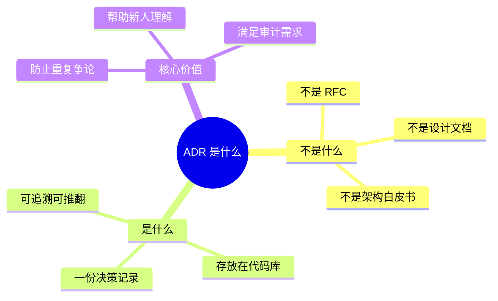
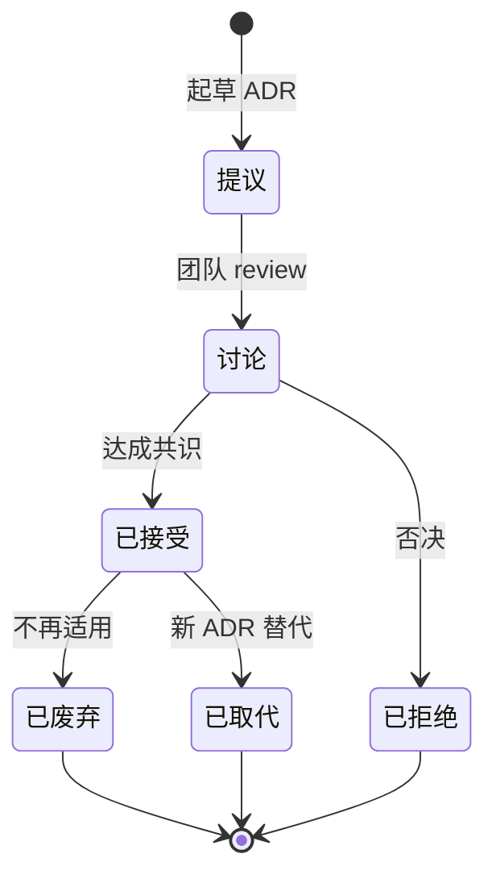
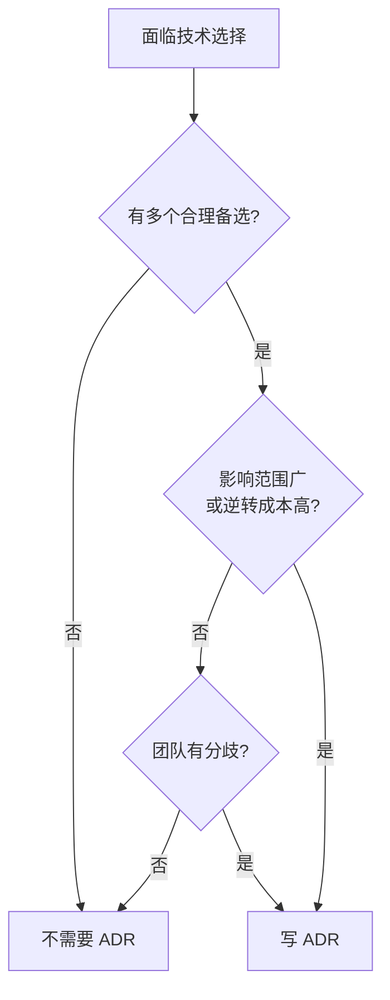
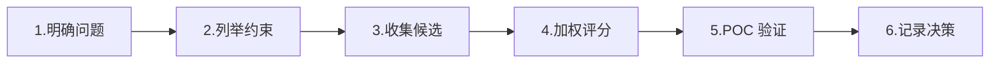
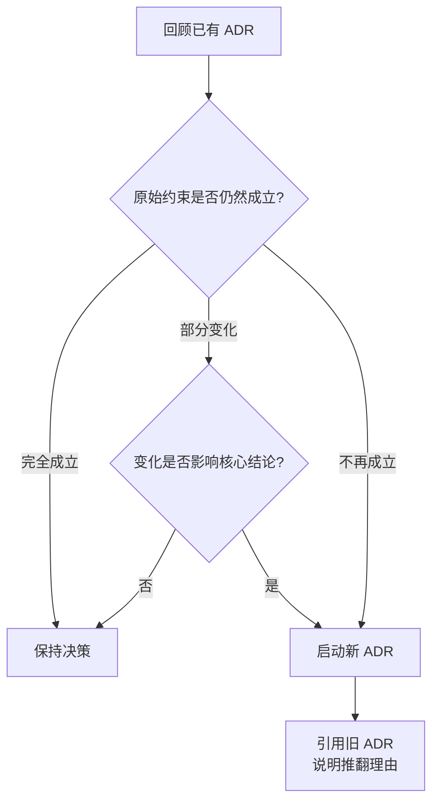
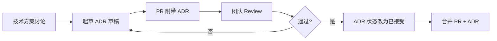

# ADR 架构决策记录：让每一个技术选择都有据可查

> 本文贯穿全部教程，是架构师的核心软技能。无论你用哪个框架、哪种模型、什么云平台，最终支撑团队协作的不是代码本身，而是"为什么这么选"的决策记录。ADR（Architecture Decision Record）就是承载这些记录的标准工具。

---

## 一、为什么需要 ADR

### 1.1 场景

以下场景在每个技术团队中反复发生：

- 新成员入职，看到代码里一个奇怪的设计选择，问"为什么这么做"，没人记得了。
- 两年前选了一个消息队列，当时的约束早已变化，但没人知道当初为什么选它，所以没人敢换。
- 技术选型会议上三个人吵了一个小时，最终"谁声音大谁赢"，决策理由没有记录。
- 审计或安全 review 时，被问"为什么用这个第三方 LLM API 而不是自部署"，找不到书面依据。

ADR 的本质就是解决这些问题：**为每一个有意义的架构决策建立一份可检索、可追溯、可推翻的记录。**

### 1.2 ADR 的起源与定位

ADR 概念由 Michael Nygard（2011）提出，核心思想极简：每个架构决策对应一份短文档，按编号顺序存放在代码仓库中。它不是 RFC（Request for Comments），不是设计文档，不是架构白皮书——它只回答一个问题：**我们做了什么决策，为什么。**



---

## 二、ADR 的标准写法

### 2.1 最小模板

一份 ADR 至少包含以下字段（以 Michael Nygard 原始模板为基础）：

```markdown
# ADR-NNNN: 决策标题

## 状态（Status）
提议 | 已接受 | 已废弃 | 已被 ADR-XXXX 取代

## 背景（Context）
面临什么问题？有哪些约束？

## 决策（Decision）
我们选择了什么？为什么？

## 结果（Consequences）
这个决策带来了什么正面和负面影响？
```

只有四个板块，不超过两页纸。太长的 ADR 通常意味着你没有真正理清决策的核心。

### 2.2 增强模板（推荐）

在实际项目中，建议在最小模板基础上增加几个板块，提升可操作性：

```markdown
# ADR-0042: 使用 SSE 而非 WebSocket 实现 Agent 流式输出

## 状态
已接受（2026-06-15）

## 背景
Agent 需要将 LLM 的 token 流式输出到前端。

约束：
- 前端为标准浏览器，不支持自定义协议
- 部署环境为标准 HTTP 反向代理（Nginx）
- 团队 Java 后端经验丰富，前端 React

## 决策
选择 Server-Sent Events (SSE)。

## 考虑的方案
| 方案 | 优点 | 缺点 |
|------|------|------|
| SSE | HTTP 原生、单向适合、简单 | 仅服务器→客户端单向 |
| WebSocket | 双向通信、低延迟 | 协议升级复杂、代理兼容性差 |
| HTTP 长轮询 | 最广泛的兼容性 | 延迟高、资源浪费 |
| gRPC Stream | 强类型、高性能 | 浏览器需要 gRPC-Web 代理 |

## 决策理由
1. Agent 输出是服务器→客户端的单向流，不需要双向通信
2. SSE 基于 HTTP，无需协议升级，Nginx 开箱即用
3. 团队学习成本最低，Spring Boot 原生支持 SseEmitter

## 结果
正面：
- 实现简单，3 天完成原型
- Nginx 配置无需改动

负面：
- 未来如果需要客户端→服务器的实时通信（如用户打断），需要额外方案
- IE 不支持（但项目不需要支持 IE）

## 复审条件
- 如果需要双向实时通信，重新评估 WebSocket 方案
```

### 2.3 关键板块的写法原则

**背景（Context）**：只写与这个决策相关的约束和问题。不要把项目背景从头讲起。好的 Context 让读者能在 30 秒内理解"我们在面对什么选择"。

**考虑的方案（Considered Options）**：这是最容易被省略但最有价值的板块。没有它，未来读者会以为"当时的选型是唯一合理的选择"。列出至少 2–3 个备选方案及其优缺点，即使它们后来被否决了。

**决策理由（Rationale）**：不要只写"我们选了 A"。要写清楚为什么选 A 而不是 B 和 C。理由要与 Context 中的约束直接对应。

**结果（Consequences）**：诚实地写负面影响。隐藏负面后果的 ADR 是有毒的——它会让后来者盲目信任这个决策，直到踩坑。

---

## 三、ADR 的生命周期

### 3.1 状态流转



关键规则：

- **已接受的 ADR 不被删除**：即使它后来被废弃或取代，原文保留，只更新状态字段。历史决策的可追溯性是 ADR 的核心价值。
- **取代而非修改**：如果一个决策需要大幅修改，不要直接编辑原 ADR。新建一份 ADR，引用旧 ADR 编号，并将旧 ADR 状态改为"已被 ADR-XXXX 取代"。

### 3.2 链式决策示例


这条链展示了一个典型的演化路径：从框架选择 → AI 集成 → 流式输出 → 可靠性增强 → 响应式重构。每一步都有据可查，新成员读一遍 ADR 链就能理解架构的演化逻辑。

---

## 四、何时写 ADR

不是每个技术选择都需要 ADR。写多了会变成形式主义，写少了又失去了追溯价值。

### 4.1 需要写 ADR 的场景

- **有多个合理备选方案**的选择（如选 Kafka 还是 RabbitMQ）。
- **影响多个团队或多个服务**的决策（如统一日志格式）。
- **不可逆或高逆转成本**的决策（如选择云供应商）。
- **涉及安全、合规、隐私**的决策（如是否允许使用第三方 LLM API）。
- **团队内存在分歧**且需要书面记录结论的决策。

### 4.2 不需要写 ADR 的场景

- 只有一个合理方案的问题（如用 Git 做版本控制）。
- 纯实现层面的选择（如用 `HashMap` 还是 `TreeMap`，除非有架构层面的影响）。
- 可以在 5 分钟内达成共识的轻微决策。
- 实验性质的尝试（如果实验成功，再补一份 ADR）。



---

## 五、技术选型框架

ADR 是记录决策的格式，但决策本身需要一套方法论。以下是一个经过实践验证的**六步技术选型框架**。

### 5.1 六步法



#### Step 1: 明确问题

用一句话描述你要解决的问题。不是"选什么技术"，而是"解决什么问题"。

- 错误："要不要用 Redis？"
- 正确："Agent 会话状态需要在多实例间共享，且要求亚毫秒级读取延迟。"

#### Step 2: 列举约束

列出所有硬约束（必须满足）和软约束（最好满足）：

| 类型 | 约束 |
|------|------|
| 硬约束 | 团队有 Java 经验，不引入新语言栈 |
| 硬约束 | 预算上限：月度基础设施成本 < $5000 |
| 硬约束 | 数据不出境（GDPR 合规） |
| 软约束 | 有成熟的开源生态 |
| 软约束 | 学习曲线平缓 |

#### Step 3: 收集候选

穷举至少 3 个候选方案。包括"不做任何事"（保持现状）作为一个 baseline。

#### Step 4: 加权评分

建立一个评分矩阵：

| 维度 | 权重 | 方案 A | 方案 B | 方案 C |
|------|------|--------|--------|--------|
| 性能 | 0.25 | 8 | 7 | 9 |
| 成本 | 0.20 | 7 | 9 | 5 |
| 团队熟悉度 | 0.20 | 9 | 5 | 3 |
| 生态成熟度 | 0.15 | 8 | 8 | 6 |
| 运维复杂度 | 0.10 | 7 | 6 | 4 |
| 合规风险 | 0.10 | 9 | 8 | 7 |
| **加权总分** | | **7.95** | **7.25** | **5.95** |

评分不是数学游戏，它的价值在于**迫使你把模糊的直觉拆解成明确的维度**。如果两个方案分数接近，说明你需要更多的信息（进入 Step 5）。

#### Step 5: POC 验证

对评分最高的 1–2 个方案，花 1–3 天做一个最小可行的 POC（Proof of Concept）。POC 要验证的是**最高风险的假设**，而不是 happy path。

#### Step 6: 记录决策

将整个六步过程浓缩为一份 ADR。

---

## 六、何时推翻决策

### 6.1 推翻决策的正确信号



推翻决策的合理触发条件包括：

- **原始约束已消失**：如之前选 WebSocket 因为不支持 HTTP/2，现在已支持。
- **新方案出现**：如之前自部署模型因为 API 太贵，现在 API 降价了 10 倍。
- **负面后果超出预期**：如选的框架在生产中频繁出问题，运维成本不可接受。
- **团队能力变化**：如团队新增了 Rust 工程师，之前因"不会 Rust"而排除的方案重新可行。

### 6.2 推翻决策的错误信号

- "新技术看起来更酷"——如果没有解决实际问题，不要为了新技术推翻决策。
- "新来的领导喜欢另一个方案"——如果技术理由不充分，应该先讨论而非直接推翻。
- "我重新看了一下觉得当时选错了"——除非你能指出具体的约束变化或信息缺失，否则"觉得错了"不是理由。

### 6.3 推翻流程

1. 新建 ADR，编号接续。
2. 在背景中引用旧 ADR 编号。
3. 说明推翻理由（哪些约束变了 / 哪些信息是当时不知道的）。
4. 说明迁移计划（如何从旧方案过渡到新方案）。
5. 将旧 ADR 状态更新为"已被 ADR-XXXX 取代"。

---

## 七、团队落地实践

### 7.1 目录结构

推荐在项目根目录下创建 `docs/adr/` 目录：

```
docs/
  adr/
    0001-use-spring-boot-3.md
    0002-choose-postgres-over-mysql.md
    0003-use-redis-for-session-cache.md
    ...
    0042-sse-streaming-for-agent.md
    README.md   <- ADR 索引
```

`README.md` 维护一份 ADR 索引表，包含编号、标题、状态，方便快速浏览。

### 7.2 ADR 与工作流的集成



关键规则：**涉及架构决策的 PR 必须附带 ADR**。CI 可以做一个轻量检查：如果 PR 修改了 `architecture/` 目录或 `pom.xml` 中的关键依赖，提示要求关联 ADR 编号。

### 7.3 ADR 的定期复审

每季度做一次 ADR 复审会议，重点看：

- 哪些"已接受"的 ADR 的约束条件是否已经变化？
- 哪些"提议"状态的 ADR 长期未推进（可能已经不需要了）？
- 是否有重复或矛盾的 ADR 需要整合？

---

## 八、总结

ADR 是一项投入产出比极高的实践。它的价值不在于文档本身，而在于三个深层收益：

1. **决策质量提升**：写 ADR 的过程迫使你把模糊的直觉变成明确的论证。很多时候，"写不出来"就说明你的思考还不够清晰。
2. **组织记忆**：人员流动是常态，但 ADR 不会随人员流动而丢失。新成员通过阅读 ADR 链可以快速理解"为什么系统长成现在这样"。
3. **决策可问责**：出问题时，ADR 让你能够定位"当时为什么这么选、信息是否充分、过程是否合理"，而不是陷入互相甩锅。

落地的三个关键建议：

- **从简单开始**：不要一上来就搞复杂模板，最小四板块模板就能产生 80% 的价值。
- **宁多勿少**：初期倾向于多写，养成习惯后自然会找到适合你团队的频率。
- **嵌入流程**：把 ADR 作为 PR 流程的一部分，而不是一个独立的"文档工作"，否则它一定会被跳过。
