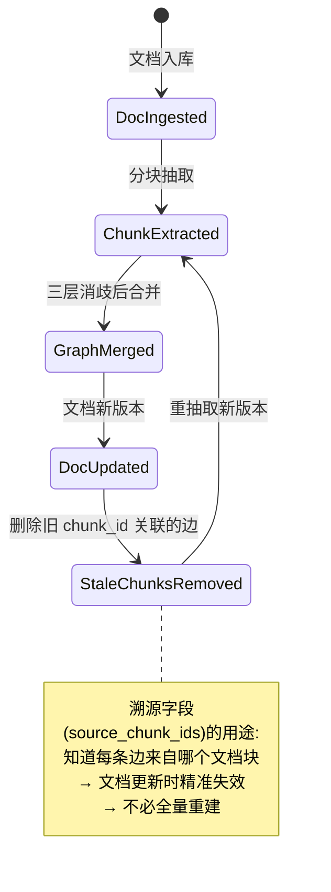
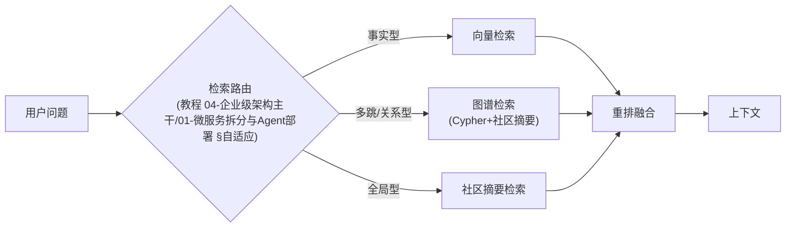

# 附录 13-00：Neo4j 落地 GraphRAG——知识图谱工程实践

> **定位**：本文是对 [教程 08-架构师进阶/01-高级RAG与AgenticRAG §GraphRAG] 的深入展开——把 GraphRAG 从概念（LLM 抽三元组+图遍历）落到工程：图谱 Schema 设计、实体抽取与消歧、增量更新、社区摘要、图谱质量评估、与 Spring 技术栈的集成。读者画像：要在生产实现 GraphRAG 的开发者。前置阅读：[教程 04-企业级架构主干/01-微服务拆分与Agent部署 §2]、[教程 00-基础与核心/05-RAG检索增强生成]。

---

## 1. 为什么 GraphRAG 需要工程化

朴素 RAG 的失败场景：跨文档多跳问题（"A 公司的 CFO 的母校的捐赠人是谁"）、全局性问题（"这批文档的主要主题演变"）。GraphRAG 用知识图谱补这两块短板，但生产化要回答五个朴素 RAG 没有的问题：

1. 图谱 Schema 怎么设计？
2. 实体抽取抽不准怎么办？
3. 实体消歧（"苹果"是三个实体）
4. 增量更新（文档变了图谱怎么变？）
5. 质量评估（图谱可信吗？）

## 2. 图谱 Schema 设计

> 需在 pom.xml 中添加依赖：

```xml
<dependency>
    <groupId>org.springframework.boot</groupId>
    <artifactId>spring-boot-starter-data-neo4j</artifactId>
</dependency>
```

```cypher
// 企业知识图谱的 Schema 约束（Neo4j）
CREATE CONSTRAINT org_id IF NOT EXISTS FOR (o:Organization) REQUIRE o.id IS UNIQUE;
CREATE CONSTRAINT person_id IF NOT EXISTS FOR (p:Person) REQUIRE p.id IS UNIQUE;
CREATE CONSTRAINT concept_id IF NOT EXISTS FOR (c:Concept) REQUIRE c.name IS UNIQUE;
// 关系类型受控词表: WORKS_FOR / INVESTS_IN / PARTNERS_WITH / MENTIONS / SUBSUMES ...
```

**Schema 设计三原则**：① 实体类型受控（不要 LLM 自由发明类型——消歧的地狱）；② 关系类型受控词表（可比、可查询）；③ 每个实体保留 `source_chunk_ids`（溯源——审计与重建的基础）。

## 3. 实体抽取与消歧（工程的核心难点）

### 3.1 抽取管道

```java
// Spring AI 2.0.0 —— 结构化抽取（entity() 两种真实形态之一）
public record ExtractionResult(
    List<ExtractedEntity> entities,
    List<ExtractedRelation> relations
) {}

ExtractionResult r = chatClient.prompt()
        .system("""
            从给定文本抽取实体与关系。规则：
            1. 实体类型只允许: Person/Organization/Product/Concept/Event
            2. 关系类型只允许: WORKS_FOR/INVESTS_IN/PARTNERS_WITH/MENTIONS/SUBSUMES
            3. 每个实体给出规范化名称与原文提及形式
            4. 不确定的抽取标注 confidence < 0.7
            """)
        .user(chunkText)
        .call()
        .entity(ExtractionResult.class);
```

### 3.2 消歧（"苹果"问题的三层解法）

| 层 | 机制 | 处理 |
|----|------|------|
| L1 规则 | 别名表/同义词词典（预置+人工维护） | 命中即合并 |
| L2 向量 | 实体名+描述 Embedding 相似度 > 阈值 | 候选集（不直接合并） |
| L3 LLM 判定 | "iPhone 制造商的'苹果'与水果'苹果'是同一实体吗？" | 候选集裁决（低频，成本可控） |

```java
// 消歧决策: 三层串联——规则快、向量中、LLM 准（与注入检测同构的分层思想, [项目 08 v5]）
public Entity resolve(ExtractedEntity e) {
    return aliasTable.hit(e).or(() -> embeddingCandidates(e, 0.92).map(this::llmAdjudicate))
                        .orElseGet(() -> createNew(e));
}
```

## 4. 增量更新（文档变更的图谱一致性）



**幂等纪律**：抽取→合并管道按 chunk 幂等（同 chunk 重跑产出相同变更集），配合 [教程 05-Observation可观测/02-组件交互：Registry、Handler、Convention、Filter协作 §幂等重试] 的检查点模式处理中断。

## 5. 社区摘要（全局性问题的钥匙）

Microsoft GraphRAG 的核心创新：对图谱做社区检测（Leiden 算法），逐层生成社区摘要——回答"这批文档讲了什么"类全局问题时检索社区摘要而非全部文档。

```java
// Neo4j GDS 库的社区检测（需在 pom.xml 中添加 graph-data-science 插件依赖/或在 Neo4j 侧安装）
// CALL gds.leiden.write('knowledge-graph', { writeProperty: 'communityId' })
// → 每社区: 聚合成员实体 → LLM 生成摘要 → 存为 Community 节点 → 递归上层社区
```

**成本警示**：社区摘要的 LLM 成本与图谱规模成正比（首次构建可能数倍于朴素 RAG 的索引成本）——按需启用：多跳/全局问题占比高才值得（[教程 04-企业级架构主干/01-微服务拆分与Agent部署 §成本收益] 的决策表）。

## 6. 图谱质量评估

| 维度 | 指标 | 方法 |
|------|------|------|
| 抽取准确率 | 实体/关系与人工标注的一致率 | 金标集抽检（每季度 100 条） |
| 消歧正确率 | 合并/区分决策的正确率 | 从合并日志抽样回溯 |
| 图谱新鲜度 | 过期边占比 | 文档更新到图谱同步的延迟监控 |
| 检索增益 | GraphRAG vs 向量 RAG 的多跳问题答对率 | 对照评估集 A/B（[教程 04-企业级架构主干/03-工具执行可观测与审计 §评估]） |

**上线门禁**：多跳问题对照测试无增益就不上——GraphRAG 的运维成本（消歧人工队列、社区重建）只有增益能支付。

## 7. 与向量 RAG 的混合架构（生产形态）



## 8. 总结

| 概念 | 一句话 |
|------|--------|
| Schema | 实体/关系类型受控 + 溯源字段 |
| 消歧三层 | 规则（快）→向量（中）→LLM 裁决（准） |
| 增量更新 | chunk 幂等 + 溯源精准失效 |
| 社区摘要 | Leiden 分层摘要，全局问题的钥匙，成本高按需启用 |
| 质量门禁 | 对照评估无增益不上线 |
