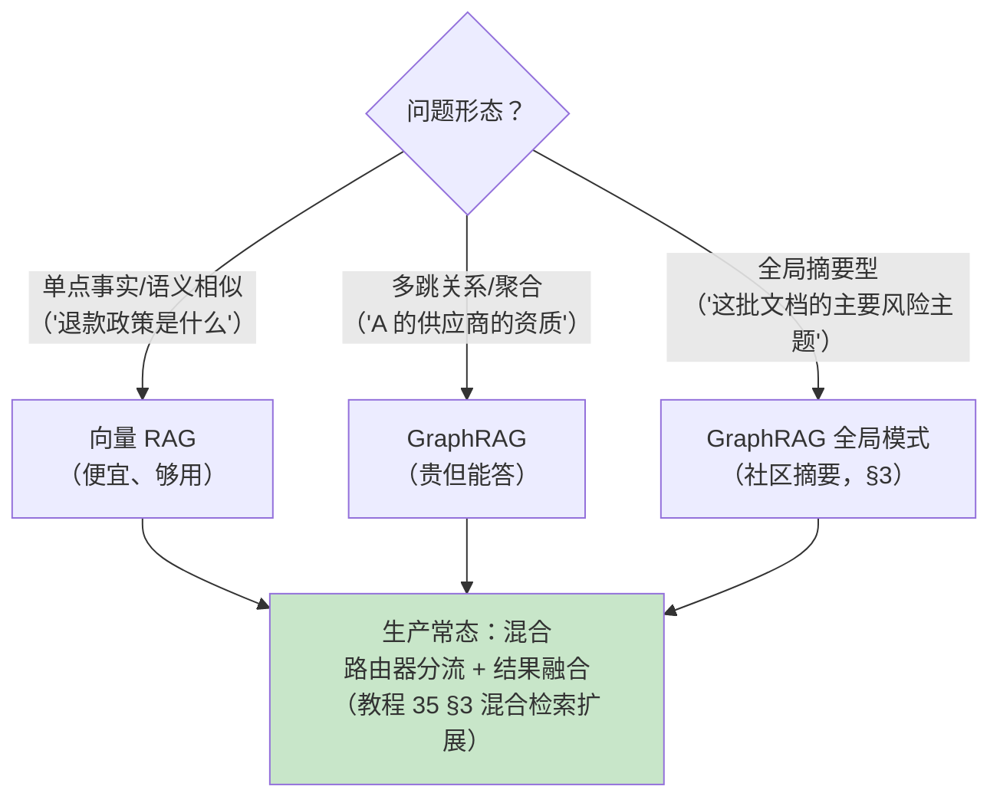
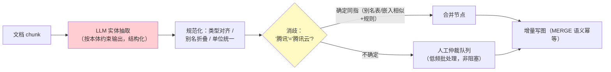

# GraphRAG 工程化落地

> **定位**：把 [教程 35-高级RAG与AgenticRAG §2] 里只画了架构图的 GraphRAG 补成工程——本体/schema 设计方法、实体抽取管线（含消歧与别名合并）、**局部 vs 全局两种检索模式**、增量更新 vs 全量重建、Cypher 实战、图谱质量评估与成本账。与 [附录 11-知识图谱工程/00-Neo4j落地GraphRAG]（Neo4j 基础与首次落地）衔接：00 讲"怎么搭"，本文讲"怎么在搭好之后活下来"。
>
> **读者画像**：评估过 GraphRAG、被"抽取成本"和"图谱越用越脏"劝退过或即将面对这些问题的工程师；要判断"该不该上 GraphRAG"的架构师。
>
> **前置阅读**：[教程 35-高级RAG与AgenticRAG §2]；[附录 11-知识图谱工程/00-Neo4j落地GraphRAG]。
>
> **版本基准**：Neo4j 5.x；Spring AI 2.0 的 GraphRepository 抽象以版本 Javadoc 为准（本文 Cypher 走原生驱动，**需在 pom.xml 中添加依赖**：`org.neo4j.driver:neo4j-java-driver`，版本随 Spring Data Neo4j BOM 对齐）。

---

## 1. GraphRAG 的真实定位：为多跳问题付钱

先回答"该不该上"：向量检索回答"和 X 相似的问题"；**多跳问题**（"给我们提供 A 组件的供应商中，ISO 认证过且在华南有仓库的三家"）需要沿关系链走——这是图谱的主场，也是它唯一的溢价来源。



## 2. 抽取管线：成本与脏数据都在这里



工程要点：

1. **本体先行（schema-first）**：先人工定实体类型（5-15 个起步）与关系类型（显式动词），抽取 Prompt 只允许输出本体内的类型——放任 LLM 自由抽类型，图谱三个月变垃圾场。最小可用本体：`(:Person/Doc/Org/Component/Policy/Event…)` + 关系如 `[:SUPPLIES][:MENTIONS][:CERTIFIED_BY][:LOCATED_IN]`。
2. **抽取 Prompt 用结构化输出**（[教程 13]）——JSON Schema 约束三元组列表，解析失败重试，别用正则刮自由文本。
3. **成本是 GraphRAG 第一约束**：抽取 Token ≈ 文档 token ×（3~10）倍（带上下文与 schema）。1GB 语料抽取一遍可能花掉几百到几千元级——**先在 1% 样本上验证问答提升，再全量抽取**（[附录 12-评估与可观测生态/02] 的数据集切片正是验证工具）。
4. **写图必须幂等**（Cypher `MERGE`）：同一文档重抽不产生重复节点——抽取管线天生 at-least-once（[17-Kafka/03 §5] 的幂等纪律平移到这里）。

## 3. 局部 vs 全局：两种检索模式

微软 GraphRAG 的核心区分（社区共识化后的工程形态）：

| 维度 | 局部：**Local** | 全局：**Global** |
|------|----------------|-----------------|
| 回答什么 | "X 和 Y 什么关系"、"X 的供应商"（具体实体出发） | "这批文档的主要主题/风险/共识"（无具体锚点的全局问题） |
| 机制 | 种子实体 → k 跳邻域子图 + 相邻文本块 → LLM 综合 | 社区检测（Leiden 算法）分层聚簇 → **每社区 LLM 预生成摘要** → Map-Reduce 全局综合 |
| 成本 | 查询时付费（子图大小可控） | 索引时付费（社区摘要预生成，文档变更要重算） |
| Cypher 骨架 | 见下方 | 摘要表驱动，图谱只供社区划分 |

```cypher
// Local：从实体"熔断器A"出发的两跳邻域（带关系类型过滤）
MATCH path = (e:Component {name: $name})-[r*1..2]-(n)
WHERE all(rel IN r WHERE type(rel) IN ['SUPPLIES','CERTIFIED_BY','LOCATED_IN'])
RETURN e, n, r,
       [x IN nodes(path) | x.name] AS chain
LIMIT 50
```

**生产的默认组合是混合**：向量检索召回种子实体（文本→实体消歧）→ 局部子图扩展 → 子图序列化进 Prompt → LLM 综合（多跳答案）。全局模式留给"主题级"的低频查询，且社区摘要要作为**派生物**随图版本重算。

## 4. 增量更新 vs 全量重建

文档变更后图谱怎么办——这是 [教程 35] 审计点名的落地空白：

| 策略 | 机制 | 适用 |
|------|------|------|
| **增量（推荐）** | CDC（[17-Kafka/07 §3] 知识库同步管线）→ 按 docId 触发：删除该文档贡献的三元组（`source_doc` 属性反查）→ 重抽该文档 → MERGE 回写 | 文档级更新为主的语料（绝大多数） |
| 影响重算 | 文档变更只重算受影响实体/社区的摘要 | 社区摘要维护 |
| 全量重建 | 版本化重建到新图库，验证后切换 | 本体大改 / 图谱污染修复 / 半年一次的卫生重建 |

关键设计：**每条边/节点带 `source_doc` + `extracted_at` + `extractor_version` 属性**——增量删除、按源审计、按抽取器版本定位"旧质量数据"全靠它（图谱的可回溯性是自己设计出来的）。

## 5. 图谱质量评估

- **结构指标**：孤儿节点率（>5% 说明抽取漏关系）、重复实体率（消歧不足）、平均度数（图太稀疏 = 关系抽取太保守）。
- **检索指标**：多跳测试集上的命中率（[02-评估数据集管理与版本化] 的多跳切片）——图谱质量最终由下游问答定义。
- **治理回路**：消歧仲裁队列的积累量是消歧规则迭代的输入；抽取错误样本回流 Prompt few-shot。

## 6. 适用场景与不适用场景

### 适用场景

- 多跳/关系密集领域（供应链、合规依赖、工单因果链、组织-项目-权限）
- 已有结构化半结构化数据（表/工单/变更记录）可低成本建边
- 查询量能摊薄索引成本（高价值内部知识库）

### 不适用场景

- 纯 FAQ 语料——向量 RAG 覆盖，图谱纯增成本
- 高频变更且无 docId 锚点的语料（增量删除失效 → 每次近全量重建）
- 抽取预算无审批的探索期——先 1% 样本验证（§2.3）

## 7. 常见误区与反模式

1. **无本体直接抽取**——类型爆炸不可逆；schema-first 是第一纪律。
2. **实体消歧全自动**——"同名不同物/同物不同名"全自动合并错一例污染一片；置信度阈值 + 人工仲裁队列。
3. **只建图不评估**——多跳测试集先行，否则"上图谱了"≠"答得对了"。
4. **全局模式当默认**——社区摘要的预生成与重算成本被低估；先局部+混合。
5. **图谱与向量库二选一**——生产答案几乎总是混合：向量找种子、图谱走关系（[教程 35 §3] 混合检索的自然延伸）。

## 8. 总结

GraphRAG 工程化五件套：**本体先行（类型封闭）→ 抽取管线（结构化输出 + 幂等 MERGE + 成本先验）→ 局部/全局双模式（默认混合）→ 增量更新（source_doc 可回溯 + CDC 触发）→ 多跳评估与治理回路**。它贵，且只为多跳问题贵得值——定位清楚再上，上了就把这五件套配齐。

**外部来源**：[Microsoft GraphRAG 论文 (Edge et al., 2024)](https://arxiv.org/abs/2404.16130) · [Neo4j GraphRAG 指南](https://neo4j.com/labs/genai-ecosystem/) · [Leiden 算法（社区检测）](https://en.wikipedia.org/wiki/Leiden_algorithm) · [Spring Data Neo4j](https://docs.spring.io/spring-data/neo4j/reference/)
