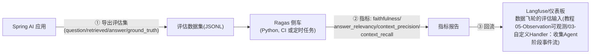
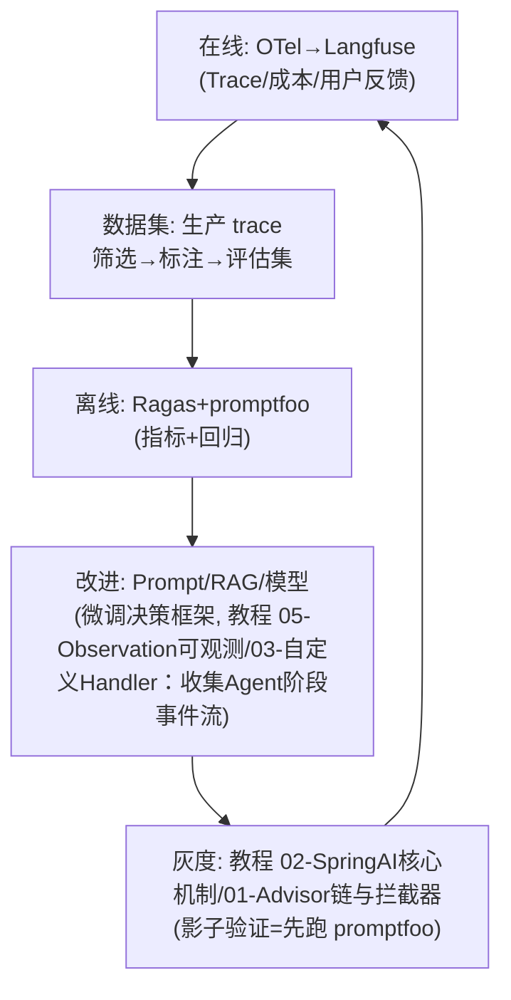

# 附录 14-00：评估与可观测生态集成（Langfuse / Ragas / OpenLLMetry）

> **定位**：本文是对 [教程 08-架构师进阶/03-自我反思与Agent评估] 与 [教程 08-架构师进阶/07-数据飞轮与持续改进] 的深入展开——自研评估之外，业界事实标准工具（Langfuse/Ragas/promptfoo/OpenLLMetry）与 Spring AI Observation 的集成方式，以及"自研 vs 采用"的选型。读者画像：要搭建评估闭环但不想全手写的团队。前置阅读：[教程 04-企业级架构主干/03-工具执行可观测与审计 §评估体系]、[教程 01-WebFlux与响应式编程/06-线程模型与调度器 §OTel 集成]。

---

## 1. 自研 vs 采用：先回答选型问题

本体系教程 00-基础与核心/04-记忆与会话管理 §36 全部手写评估（学习价值），生产选型的对照：

| 维度 | 自研 | Langfuse（观测+评估平台） | Ragas（RAG 评估库） | promptfoo（提示词评估） |
|------|------|--------------------------|--------------------|------------------------|
| 定位 | 完全控制 | Trace/数据集/评估一体 | RAG 专项指标 | 提示词回归测试 |
| 与 Spring 集成 | - | OTLP/OpenAI 兼容代理 | 侧车进程（Python） | CLI/CI 集成 |
| 何时用 | 特殊指标/强合规 | 需要可观测+评估闭环平台 | RAG 深度指标 | Prompt 变更防回归 |
| 代价 | 维护成本 | 引入外部平台 | Python 侧车 | - |

**主流组合**：Spring AI + OpenLLMetry OTel 导出 → Langfuse（观测与数据集）+ Ragas（RAG 离线指标）+ promptfoo（CI 回归）——三层各司其职，全开源可自托管（合规敏感场景的关键）。

## 2. OpenLLMetry / OTel：数据怎么流出去

Spring AI 原生 Observation 已经产出 gen_ai 语义约定的 Span（[教程 01-WebFlux与响应式编程/06-线程模型与调度器 §gen_ai]）。接 Langfuse 只需把 OTLP 指到它（或经 OTel Collector 转发）：

```yaml
# 需在 pom.xml 中添加依赖（OTel 导出器）后配置导出端点
otel:
  exporter:
    otlp:
      endpoint: http://langfuse:3000/otel   # Langfuse 的 OTLP/HTTP 入口
  traces:
    exporter: otlp
# 预期效果: ChatClient/ChatModel/Tool/VectorStore 的 Span 树(教程 01-WebFlux与响应式编程/06-线程模型与调度器)
#          直接出现在 Langfuse 的 Trace 视图中——零代码改动
```

**Trace 关联会话与用户**（Langfuse 数据集质量的关键）：Span 的 session.id/user.id 属性从业务上下文注入（Baggage 传播，[教程 01-WebFlux与响应式编程/06-线程模型与调度器 §Baggage]）。

## 3. Ragas：RAG 专项指标（侧车形态）

Java 生态没有 Ragas 等价物（RAG 评估的 Python 垄断区）。集成形态是**侧车进程**：



**四个核心指标的业务含义**（选型必背）：

| 指标 | 测什么 | 什么问题会暴露 |
|------|--------|---------------|
| faithfulness | 答案是否忠于检索内容 | 幻觉（答案编造） |
| context_precision | 检索内容的相关度排序 | 检索质量/重排失效 |
| context_recall | 该检到的是否检到 | 知识库覆盖缺口 |
| answer_relevancy | 答案与问题的相关性 | 答非所问/提示词漂移 |

## 4. promptfoo：Prompt 变更的回归测试

```yaml
# promptfooconfig.yaml —— CI 中的提示词回归门禁（接 [教程 02-SpringAI核心机制/01-Advisor链与拦截器 §灰度] 的影子验证）
prompts: [prompts/cs-main-v3.2.txt, prompts/cs-main-v3.3.txt]   # 新旧对照
providers: [deepseek:deepseek-chat]
tests:
  - vars: { question: "如何申请退款" }
    assert:
      - type: contains-any
        value: [退款流程, 7个工作日]
  - vars: { question: "订单 SO-123 状态" }
    assert:
      - type: llm-rubric
        value: "回答引导用户使用订单查询工具，不编造状态"
# 效果: Prompt v3.3 在既有测试集上不劣化 → 允许进灰度
```

## 5. 与数据飞轮的拼装（完整闭环）



这就是 [教程 05-Observation可观测/03-自定义Handler：收集Agent阶段事件流 §飞轮] 的工具化版本：飞轮的每一环都有标准工具承接，自研部分只剩"业务判断"（什么指标达标、如何改）——**把工程留给工具，把判断留给自己**。

## 6. 陷阱

| 陷阱 | 纠正 |
|------|------|
| 平台替代思考 | Langfuse 给数据，"改什么"仍是人的判断 |
| 评估集污染 | 生产 trace 直接当评估集→用当前答案自我验证；需人工标注金标子集 |
| Ragas 指标迷信 | LLM-as-Judge 的指标本身有偏差（[教程 04-企业级架构主干/03-工具执行可观测与审计 §Judge 偏差]），趋势比绝对值有用 |
| 侧车无人维护 | Python 侧车进 CI 与告警体系，别做"一次性脚本" |
| 双写 Trace（OTel+SDK 手动） | 二选一（[附录 18-可观测平台实践/00-OTel管道与gen_ai语义]） |

## 7. 总结

| 概念 | 一句话 |
|------|--------|
| 组合拳 | OpenLLMetry→Langfuse（在线）+ Ragas（RAG 离线）+ promptfoo（回归） |
| 零代码观测 | Spring AI 原生 OTel Span 直通 Langfuse |
| 四指标 | faithfulness/precision/recall/relevancy 各暴露一类问题 |
| 飞轮工具化 | 工程环节用工具，业务判断留给自己 |
