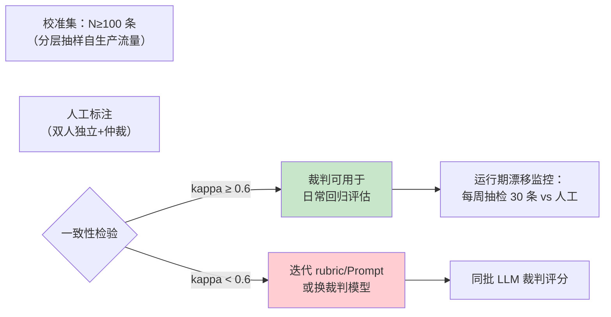
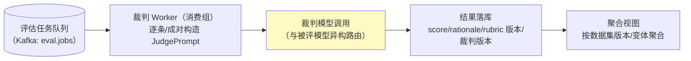

# LLM-as-Judge 工程化

> **定位**：把"用 LLM 评 LLM"从玄学变成工程——裁判的偏差分类与校准方法、pointwise vs pairwise 两种范式、多采样投票、裁判 Prompt 模板设计、裁判的成本与延迟账、以及 Java/Spring 侧的裁判服务化管道。本文是 [教程 08-架构师进阶/03-自我反思与Agent评估 §3.3]、[教程 08-架构师进阶/07-数据飞轮与持续改进 §5.3] 的下钻层，与 [附录 11-评估与可观测生态/00-Langfuse与Ragas集成]（工具生态侧）互补。
>
> **读者画像**：要为 Agent 平台搭离线评估流水线、被"裁判打分忽高忽低"困扰的工程师；需要向管理层解释"这个分数可信吗"的架构师。
>
> **前置阅读**：[教程 08-架构师进阶/03-自我反思与Agent评估]；[教程 08-架构师进阶/07-数据飞轮与持续改进 §5]（飞轮里裁判的位置）。
>
> **版本基准**：方法论文献为通用结论（2023-2026 社区共识），实现基于本体系技术栈（Spring Boot 4.1 / WebFlux）。

---

## 1. 为什么需要裁判，以及它的可信度公式

人工评估慢且贵（一条对话人工评分 1~5 分钟），规则评估只覆盖可枚举维度（长度/格式/关键词）——LLM 裁判填补中间地带。但**裁判分数只有在被校准后才是指标，否则只是另一个 LLM 的意见**：

```
裁判可信度 = 与人工标注的一致性 × 抗偏差设计 × 成本可负担性
```

三条全部可工程化，对应本文 §2/§3/§5。

## 2. 偏差分类与对抗设计

社区实证的四类主要偏差（MT-Bench/Chatbot Arena 时代以来反复验证）：

| 偏差 | 表现 | 对抗手段 |
|------|------|---------|
| **位置偏差** | 倾向选"第一个"或"第二个"答案 | pairwise 时**交换顺序评两次**，两次结论不一致记平局 |
| **长度偏差** | 更长 = 更好（verbosity bias） | rubric 显式声明"长度不是质量"；引用原文比对而非印象 |
| **自我偏好** | 偏爱与自己同家族模型的输出 | 裁判模型与被评模型异构（DeepSeek 被评、异构家族裁判） |
| **评分漂移** | 同一答案不同次评分差 1-2 分 | 量表从 1-10 收窄到 1-3/1-5；或改 pairwise；多次采样投票（§4） |

工程铁律：**每条偏差都要有对应设计或已知代价声明**——评审时"我们用了 LLM 裁判"必须能答出"位置偏差怎么处理的"。

## 3. 校准：让裁判分数变成指标



- **一致性指标用 Cohen's kappa**（而非裸一致率——50/50 猜也能对一半）：kappa ≥ 0.6 视为可用，≥ 0.8 良好；pairwise 用胜率一致性。
- **校准集分层**：按租户/任务类型/难度分层抽样，别只拿好答的样本（[附录 11-评估与可观测生态/02-评估数据集管理与版本化] 的金标集正是它）。
- **漂移监控**：裁判模型一旦更换（供应商静默更新，[教程 04-企业级架构主干/09-灰度发布与版本管理] 的模型漂移议题）需重新校准——把"裁判版本"记录进评估结果（§6 数据模型）。

## 4. 两种范式与多采样投票

| 范式 | 问法 | 输出 | 适用 |
|------|------|------|------|
| **pointwise** | "这个回答按 rubric 打 1-5 分" | 绝对分 | 基线追踪、回归门槛（可与历史比） |
| **pairwise** | "A 和 B 哪个更好？" | 相对胜负 | A/B 对比、新旧 Prompt/模型对比（更可靠但 2 倍样本） |
| 组合 | pointwise 筛 + pairwise 决胜 | — | 大规模初筛 + 关键对决 |

**多采样投票（self-consistency 的裁判版）**：同一裁决采 3/5/7 次（temperature>0），取多数——显著压评分漂移，代价是线性成本。经验组合：pointwise 单次打分做全量回归门槛 + pairwise 双序（正反各一次）三采样做发布决策。

## 5. 裁判 Prompt 模板（结构化输出落地）

```java
// 裁判请求——结构化输出（教程 01-WebFlux与响应式编程/03-Sinks详解），判据（rubric）显式注入
record Verdict(
    int score,                    // 1-5
    String rationale,             // 必须先写理由再给分（CoT 提升 judge 质量）
    List<String> rubricHits,      // 命中了哪些判据条目
    List<String> citationGaps     // 引用缺失（RAG 忠实度维度）
) {}

JudgePrompt prompt = JudgePrompt.builder()
    .rubric(rubricStore.active())          // 判据版本化管理（§6）
    .question(item.input())
    .reference(item.expectedOutput())      // 金标参考（有则评 correctness，无则只评 quality）
    .candidate(item.actualOutput())
    .scoringAnchors(ANCHORS_1_TO_5)        // 每档的锚定描述（压漂移）
    .build();
```

模板设计四要点：**先理由后分数**（rationale 字段在前）；**锚定描述**（"3 分 = 部分正确但有关键遗漏"）比裸数字稳定；**判据条目化**（rubricHits 可审计）；**参考答案可选**（无参考时改评 helpfulness/coherence，并在结果里区分维度——混合口径是常见事故）。

## 6. 裁判服务化：Java 管道



实现纪律（全部呼应既有机制）：裁判调用本身套 Observation（裁判成本/延迟进 [教程 04-企业级架构主干/07-成本治理与Token计量] 成本账——**裁判 Token 是评估预算的大头**，全量回归一次可能比一天生产流量还贵）；判据（rubric）与裁判模型版本记进每条结果——可复现性是评估系统的第一属性；管道与 [教程 07-Kafka事件骨干/00-Kafka全景与核心概念] 事件骨干同构（消费组扩缩容、DLT 处理毒样本）；失败样本进人工仲裁队列（裁判不确定的边界正是金标集的增量来源——飞轮闭环，[教程 08-架构师进阶/07-数据飞轮与持续改进]）。

## 7. 裁判的适用与不适用

### 适用场景

- 回归门槛：新 Prompt/模型上线前的全量离线对比（pointwise）
- 发布决策：新旧版本 pairwise + 双序 + 多采样
- 长文本/开放性任务的规模化评估（规则评不了的那部分）

### 不适用场景

- 可精确断言的任务（代码编译过没有/答案是不是 42）——**单元断言优先**，裁判是兜底不是万能闸
- 高风险合规结论（金融建议对错）——裁判只能做初筛，终审在人（HITL，[教程 04-企业级架构主干/08-Human-in-the-Loop与审批流]）
- 裁判与被评同家族且无法换——自我偏好偏差无解时，至少在报告里声明该局限

## 8. 常见误区与反模式

1. **1-10 分 + 单次采样**——漂移大到回归门槛失去意义；收窄量表+多采样。
2. **拿裁判分数当 KPI 对外承诺**——它是相对指标（相对 rubric/裁判版本），版本变更即不可比。
3. **校准一次用一年**——裁判模型静默更新后漂移无声发生；周期抽检是运维项。
4. **pairwise 只评一次**——位置偏差未消除；双序是底线。
5. **裁判成本不进预算**——评估洪峰把 API 配额打穿影响生产（隔离 Key 池，[教程 05-Observation可观测/11-深度整合：SpringAI2与Observation的完整结合面 §5]）。

## 9. 总结

LLM-as-Judge 工程化 = **偏差对抗（双序/异构/锚定）+ 校准（kappa 对人工，漂移周期抽检）+ 范式选择（pointwise 门槛 / pairwise 决胜）+ 服务化（版本可复现、成本进账、边界进金标）**。它接在 [教程 08-架构师进阶/03-自我反思与Agent评估] 的评估框架与 [教程 08-架构师进阶/07-数据飞轮与持续改进] 的飞轮之间，把"分数"变成可运营的指标。下一篇讲它的地基——数据：[附录 11-评估与可观测生态/02-评估数据集管理与版本化]。

**外部来源**：[Judging LLM-as-a-Judge with MT-Bench and Chatbot Arena (Zheng et al., 2023)](https://arxiv.org/abs/2306.05685) · [G-Eval (Liu et al., 2023)](https://arxiv.org/abs/2303.16634) · [Cohen's kappa (Wikipedia)](https://en.wikipedia.org/wiki/Cohen%27s_kappa) · [Langfuse LLM-as-Judge](https://langfuse.com/docs/scores/llm-as-judge)
