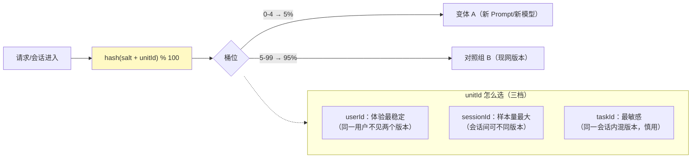

# 在线实验与 A/B 统计

> **定位**：把 [教程 04-企业级架构主干/09-灰度发布与版本管理] 的"哈希分流"和 [教程 08-架构师进阶/03-自我反思与Agent评估 §6] 的"统计对比"补成真正的统计工程——实验单元与分流、样本量计算（跑多久才可信）、显著性检验与置信区间、多重比较校正、护栏指标与新奇效应、peeking 陷阱，以及 Agent 平台的实验基建形态。
>
> **读者画像**：做过 A/B 但说不清"为什么跑七天"的工程师；要把模型/Prompt 上线决策从拍脑袋变成置信区间的架构师。
>
> **前置阅读**：[教程 04-企业级架构主干/09-灰度发布与版本管理 §2]（分流实现）；[教程 08-架构师进阶/03-自我反思与Agent评估 §6]（在线评估定位）；[附录 11-评估与可观测生态/01-LLM-as-Judge工程化]（离线侧对照）。

---

## 1. 离线赢了 ≠ 上线该赢

离线评估集是静态的、采样过的；线上分布是活的、长尾的。**离线 pairwise 赢是上线的必要条件，在线实验才是充分检验**——两道门缺一不可（[教程 05-Observation可观测/08-流式响应的观测：stream模式下的span闭合 §7] 飞轮的两级闸门）。

## 2. 实验单元与分流



三条纪律：**salt 每个实验独立**（多实验并行时避免分组相关，[教程 04-企业级架构主干/09-灰度发布与版本管理] 深化点）；**ramp-up 单调性**（`hash < percentage` 判定使放量只增不减组员，[教程 04-企业级架构主干/00-管控分离架构 §2.2]）；**曝光即计入**（进组的用户/会话必须全部进分析——只在"成功响应"上统计会引入幸存者偏差，取消/超时的请求同样算数）。

## 3. 样本量：为什么必须跑七天

统计功效问题：**样本太少时，"没检出差异"≠"没有差异"**。两比例检验的样本量（每变体）近似：

```
n ≈ 16 × p(1-p) / δ²        （α=0.05、power=0.8 的工程速算式）
p = 基线率（如当前满意度 0.80）
δ = 最小可检测差异 MDE（如 0.02，即 80% → 82%）
n ≈ 16 × 0.8 × 0.2 / 0.0004 = 6,400 / 变体
```

| 基线率 p | MDE δ | 每变体样本 | 按日 2,000 曝光需 |
|---------|-------|-----------|------------------|
| 0.80 | 0.05 | 1,024 | ~1 天 |
| 0.80 | 0.02 | 6,400 | ~3-4 天 |
| 0.80 | 0.01 | 25,600 | ~2 周 |
| 0.05（低基线错误率） | 0.01 | 760 | <1 天 |
| 0.05 | 0.005 | 3,040 | ~2 天 |

读表要点：**想检出的差异越小，样本平方级增长**——所以 MDE 要先定业务阈值（"差 2% 才值得换版本"），再算周期；**低基线指标（错误率 5%）反而便宜**——相对变化 20% 也只需千级样本。Agent 场景的日曝光量级决定了能做哪种实验：日均千会话别想验 0.5% 的差异，把 MDE 定在 3-5% 或攒多周期。周期还要覆盖**整周行为**（工作日/周末差异）——"跑满七天"的真实理由。

## 4. 显著性检验与置信区间

| 指标类型 | 检验 | Java/查询侧做法 |
|---------|------|----------------|
| 比例（满意率/解决率） | 两比例 z 检验 | Prometheus 两序列 rate 相减，脚本算 z |
| 连续（延迟/Token 成本） | Welch t 检验（方差不等） | 取各变体直方图（[教程 00-基础与核心/06-向量数据库选型 §4] SLO 桶辅助判断） |
| 有序（1-5 分） | Mann-Whitney U | 评估管道落库后离线算 |

**报告置信区间而不只是 p 值**："A 比 B 好 2.3%（95% CI [0.4%, 4.2%]）"——CI 不含 0 即显著，且给出效果大小；裸 p 值不告诉任何量级。实现上就是个几十行的工具类（或直接用 Apache Commons Math3 的 `TTest`/`ChiSquareTest`——**需在 pom.xml 中添加依赖**）。

## 5. 三个经典陷阱

1. **Peeking（偷看即停）**：每天看一次 p<0.05 就宣布胜利并停实验——多次检验下假阳性暴涨（名义 5% 实际可达 30%+）。对策：**预先注册**最小运行周期与 MDE，周期内只看不决策；或用序贯检验法（团队成熟后再上）。
2. **多重比较**：一次实验看 20 个指标、5 个切片，总有一个"显著"——假发现。对策：主指标**唯一且预注册**；次级指标用 Bonferroni 校正（α/指标数）；切片只做探索不做决策。
3. **新奇效应**：新版本初期差异大（用户/系统互动方式还没稳定），两周后收敛甚至反转——长观察期或剔除首日数据再验证。

## 6. 护栏指标：实验的熔断器

主指标可以赢，但护栏指标不能破：

| 护栏（低基数 Observation 标签切分，[教程 00-基础与核心/06-向量数据库选型 §6]） | 熔断线 |
|------|--------|
| P95 延迟 / TTFT | 超对照组 +10% 自动暂停放量 |
| 单会话 Token 成本 | 超 +15% 触发评审（[教程 04-企业级架构主干/07-成本治理与Token计量] 预算联动） |
| 工具失败率 / 拒答率 | 绝对值超阈值即回滚 |
| 投诉/取消率（业务级） | 人工快判 |

这就是 [教程 04-企业级架构主干/00-管控分离架构 §6.2] "自动回滚"缺的样本量护栏：护栏规则要加**最小样本**条件（前 N 条不判定，防止低流量误熔断）。

## 7. Agent 平台的实验基建形态

```mermaid
graph TB
    subgraph EXP["实验平面（控制面，教程 02-SpringAI核心机制/01-MCP协议）"]
        REG["实验注册表<br/>salt/主指标/MDE/周期/护栏"]
        DEC["决策器：周期满 → 拉数 → 检验 → 报告"]
    end
    subgraph DATA["数据面"]
        TAG["变体标签注入<br/>（Observation 低基数 key: experiment.variant）"]
        MET[("指标按 variant 切分<br/>（Prometheus）")]
        EVT[("事件级明细<br/>（Kafka → 数据集管道）")]
    end
    DATA --> DEC
    DEC -->|{"放量/回滚"}| ROUTE["路由配置（教程 00-基础与核心/04-记忆与会话管理 §32）"]

    style EXP fill:#e1bee7
```

要点：**变体作为低基数标签贯穿指标**（experiment.variant=A/B，一切按变体切片）；事件级明细回流数据集管道——实验结束后"负样本"成为 [02-评估数据集管理与版本化] 的增量金标候选（在线→离线闭环）；实验配置本身版本化（salt/阈值/周期随结果归档——可复现性同样适用于实验）。

## 8. 适用场景与不适用场景

### 适用场景

- Prompt/模型/检索策略的上线决策（主指标 + 护栏 + 预注册周期）
- 流量充足（日均千级会话以上）的核心链路迭代
- 需要向业务方量化"改版收益"的场景（CI 报效果量）

### 不适用场景

- 低流量长尾功能——样本量永远不够；用定性评估 + 灰度观察代替
- 紧急修复——直接全量 + 回滚预案，别做实验
- 强破坏性变更（安全相关）——灰度小流量人工盯守，不是统计问题
- 想靠"多看几个指标总能显著"证明自己——那是 §5 陷阱 2

## 9. 常见误区与反模式

1. **三天就说没差异**——功效不足 ≠ 无差异；先算样本量再开实验。
2. **p 值 0.049 vs 0.051 天壤之别**——显著性不是二值开关，看 CI 与效果量。
3. **一次实验一个以上主指标**——必然捞出假阳性；主指标唯一。
4. **曝光口径漂移**（中途改 unitId 粒度）——同实验内口径不可变。
5. **实验结果不复盘入数据集**——花的流量学费没沉淀成资产（[教程 08-架构师进阶/07-数据飞轮与持续改进] 飞轮断链）。

## 10. 总结

在线实验的工程骨架：**预注册（MDE/周期/主指标）→ 正确分流（盐/单调/曝光口径）→ 样本量算够（平方级代价，七天周期）→ 检验报告 CI 与效果量 → 护栏熔断 → 结果回流数据集**。它与 [01-LLM-as-Judge工程化]（离线）、[02-评估数据集管理与版本化]（数据）合成评估三件套，托住 [教程 04-企业级架构主干/09-灰度发布与版本管理]/[教程 08-架构师进阶/03-自我反思与Agent评估]/[教程 08-架构师进阶/07-数据飞轮与持续改进] 的所有"统计对比"承诺。

**外部来源**：[Kohavi et al., Trustworthy Online Controlled Experiments](https://experimentguide.com/) · [Evan Miller – Sample Size Calculator 与 A/B 文章集](https://www.evanmiller.org/) · [Microsoft ExP 简介](https://www.microsoft.com/en-us/research/group/experimentation-platform-exp/) · [Apache Commons Math3](https://commons.apache.org/proper/commons-math/)
