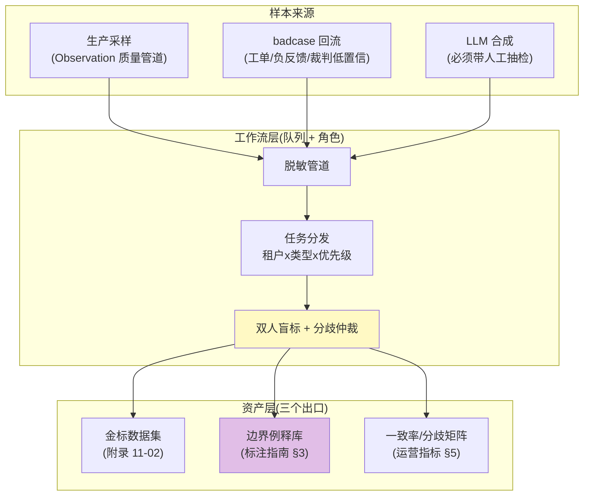
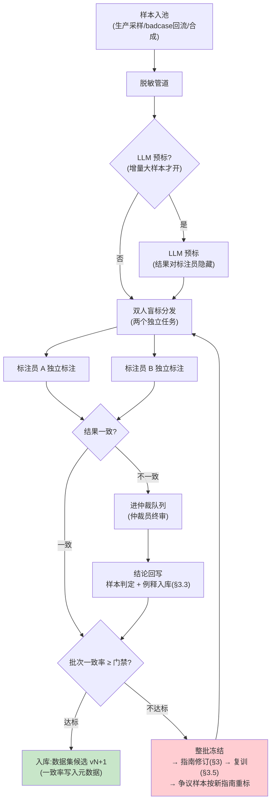
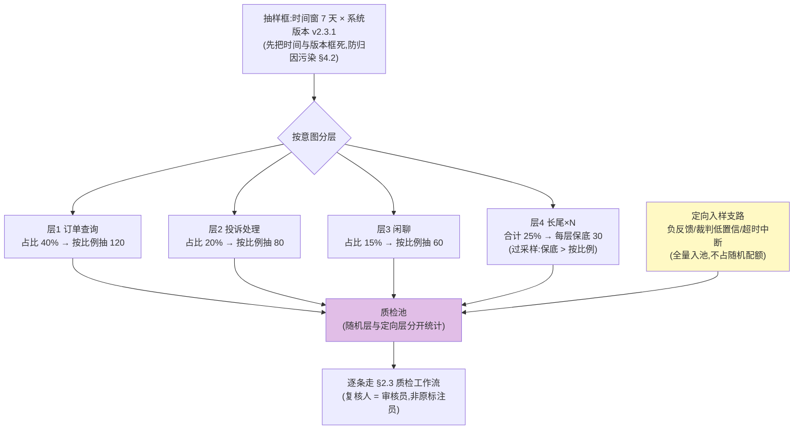
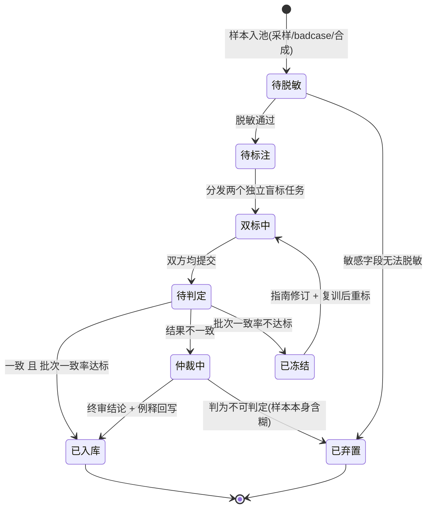

# 标注平台与人工质检运营

> **定位**：评估体系里最"人力密集"一环的工程化——标注平台的工作流架构（任务分发/角色分层/质检流）、标注指南工程（可操作化判定规则/边界例释库/版本化/上岗考核）、人工抽检的抽样方法论（抽样框/分层策略/抽检率实用口径/结果回流）、一致性劣化后的运营动作，以及 Agent 特有标注对象（对话轮次/工具调用/检索相关性/流式分段）的判定难点。本文是 [教程 08-架构师进阶/03-自我反思与Agent评估 §7.4]（标注治理三条动作）的下钻层：那里讲了"要双人标注、要仲裁、要复检"，这里讲"怎么把它建成一个可持续运转的运营体系"。
>
> **读者画像**：评估集"标注不动、标出来互相矛盾、抽检不知道抽多少"的工程师；要为多租户/多任务类型建平台级标注产能的架构师。
>
> **前置阅读**：[教程 08-架构师进阶/03-自我反思与Agent评估 §7]（评测集资产治理）；[附录 11-评估与可观测生态/02-评估数据集管理与版本化 §2]（标注流水线在数据集构建中的位置）；[附录 11-评估与可观测生态/01-LLM-as-Judge工程化 §3]（kappa 门禁——本文不重复其定义）。
>
> **版本基准**：方法论为标注行业与 LLM 评估社区通用结论（2023-2026），平台形态基于本体系技术栈（Spring Boot 4.1 / WebFlux / Kafka）。本文是**元篇**——几乎不含 Spring AI API，集成点只涉及已在 [附录 11-评估与可观测生态/00-Langfuse与Ragas集成] 实证的导出链路与配置键基线。

---

## 1. 标注是评估体系的产能瓶颈，也是质量天花板

评估链路自动化程度越高，人肉环节越是单点。三条链路全部终结于人：

| 链路 | 人肉环节 | 供给篇目 |
|------|---------|---------|
| LLM 裁判校准 | 校准集的人工标注（kappa ≥ 0.6 才放行） | [附录 11-评估与可观测生态/01-LLM-as-Judge工程化 §3] |
| 金标准集构建 | 双人标注 + 仲裁 + 一致率门禁 | [附录 11-评估与可观测生态/02-评估数据集管理与版本化 §2] |
| 生产质量巡检 | 周期抽检（30 条/周对裁判、抽检不合格率对告警） | [附录 11-评估与可观测生态/01-LLM-as-Judge工程化 §3]、[附录 18-可观测平台实践/01-AI事件响应工程] |

算一笔产能账就明白为什么它需要"运营"：一条对话人工标注 1~5 分钟，500 条金标集就是 2~4 人日；而数据集是会腐烂的资产（[02 §6] 漂移检测触发补样本），badcase 持续回流（[教程 08-架构师进阶/03-自我反思与Agent评估 §7.2]）——**标注是持续运营职能，不是一次性项目**。项目化思维（"评估集建完了"）是标注体系烂掉的第一原因。

标注质量只有三个变量：

```text
标注质量 = f( 指南清晰度, 标注员胜任度, 流程质量控制 )
```

三个变量各自对应本文一章：指南工程（§3）、培训考核（§3.5、§4.5）、流程与抽检（§2、§4）。三者中**指南模糊度是根变量**——[02 §2] 已断言"分歧大多源于指南含糊而不是标注员水平"，本文给出工程解法。最后提醒一个定位问题：**标注平台本质是"队列 + CRUD + 审计"的普通业务系统，不是 AI 系统**——这个定位直接决定 §7 的选型结论。

## 2. 标注平台的工作流架构

先看全景：样本从三个来源进来，经工作流层加工，产出三类资产。



### 2.1 角色分层：标注员 / 审核员 / 仲裁员

| 角色 | 职责 | 产能特征 | 配比经验 | 准入与晋升 |
|------|------|---------|---------|-----------|
| **标注员** | 按指南对样本执行判定 | 主产能，人均 30~60 条/小时（二分类） | 产能基数 | 培训 + 考核上岗（§3.5） |
| **审核员** | 抽检他人产出、复核 LLM 预标、维护队列 | 不产标，只质检 | 10~20 名标注员配 1 名 | 高分标注员晋升；质量连带（漏检追责到审核链） |
| **仲裁员** | 分歧终审 + **指南修订权** | 兼职即可（分歧量通常 < 总量 20%） | 1~2 名领域专家 | 必须有指南编辑权——否则仲裁结论落不了地（§3.3） |

**仲裁员必须掌握指南编辑权**是本表最重要的一格：仲裁的价值不在"把这条样本判掉"，而在"让下一批不再有这类分歧"——判掉不回写，仲裁员就沦为流水线工人，同类分歧无限复发（反模式 §9）。

**Agent 团队的特殊性**：多数团队没有专职标注员，工程师兼任。这里有一个必须点破的风险——**自己写的 Prompt 自己标，必然高估**（评估者与被评系统的作者重叠）。最低可接受配置：至少两人互标 + 第三人仲裁；有条件时标注员与开发人员分离。这与 [附录 11-评估与可观测生态/01-LLM-as-Judge工程化 §2] 裁判"自我偏好偏差"是同构问题，只是发生在人身上。

### 2.2 任务分发：队列模型

分发要回答三个问题——给谁、什么顺序、什么权限：

| 维度 | 设计 | 理由 |
|------|------|------|
| **租户** | 独立队列或队列内强隔离标签 | 合规要求：租户 A 的对话绝不能被租户 B 的标注员看到（多租户数据隔离，[教程 04-企业级架构主干/02-全链路可观测性 §6] 口径） |
| **任务类型 → 技能组** | 意图标注/工具标注/检索标注/流式分段各自绑定技能组（§6 四类对象分别设组） | 不同对象判定技能不同；考核按类型解锁（§3.5 分级上岗） |
| **优先级** | badcase 回流 > 周期抽检 > 存量补标 | badcase 有"先修后入"时限（[教程 08-架构师进阶/03-自我反思与Agent评估 §7.2]），排队等一周飞轮就断了 |
| **权限与脱敏** | 标注员只见脱敏后内容；高危样本（含敏感字段）对高级别角色开放 | 生产数据进标注队列前先过脱敏管道（[附录 08-Agent安全深度/06-数据分类分级与密级传导] 的定级决定谁可看） |

两个工程细节容易被忽略：

1. **双人盲标的"盲"要靠系统保证**：同一样本给两名标注员的是两个**独立任务**，界面互不可见对方结果，任务完成前也看不到对方是否完成。"标完 A 再把 A 的结果给 B 参考"是锚定污染，一致率虚高（反模式 §9）。
2. **认领-超时归还**：标注员不是消息消费者，会请假、会卡住。任务被认领后 N 小时未提交自动回池重派——这是标注队列与普通 Kafka 消费的本质差异（队列骨架可复用 [教程 07-Kafka事件骨干/00-Kafka全景与核心概念]，但消费语义必须换）。

### 2.3 质检工作流

核心流程一张图（分支点：是否 LLM 预标、双人是否一致、批次一致率是否达标）：



三条运行纪律：

- **LLM 预标的铁律**（[教程 08-架构师进阶/03-自我反思与Agent评估 §7.4] 已立，这里补实现口径）：复核人**不可见** LLM 预标结果（防锚定），且预标准确率本身要按 §4 的方法抽检——预标是产能放大器，也是偏差放大器，它错得稳定时全批次跟着错。
- **一致率门禁作用在批次上，不是单条上**：单条一致与否决定该条走入库还是仲裁；批次一致率（如 <85% 冻结）决定这条流水线还能不能继续跑。两个门禁不同层级，混用会把"个别样本有分歧"（正常）误报成"流水线失控"（异常）。
- **一致 ≠ 正确**：双人一致只说明指南清晰，不说明判定对。这就是为什么还需要审核员抽检（§4）——一致率与正确率是两个指标，别拿前者冒充后者。

### 2.4 与金标准集/回归集的联动

标注流水线的产出不是"标完的样本"一种，而是三类资产，各有去处：

| 产出 | 去处 | 联动机制 |
|------|------|---------|
| 金标样本 | [02-评估数据集管理与版本化] 数据集候选，走其 CI 门禁（去重/分布/冒烟） | 一致率写入数据集元数据 = 金标质量的置信度（[02 §2] 断言的来源机制在本文 §2.3） |
| 边界例释 | 标注指南例释库（§3.3） | 每条仲裁结论一条例释，判例沉淀 |
| 分歧统计 | 运营指标（一致率趋势/分歧矩阵，§5） | 一致性劣化的归因输入 |

反方向的联动同样重要：**回归集与校准集是标注流水线的下游客户，也是上游需求方**——[教程 08-架构师进阶/03-自我反思与Agent评估 §7.2] 的 badcase 入集流程里"ground truth 标注"一步，就是本篇流水线的高优先级队列（§2.2 优先级第一档）；[01 §3] 的裁判校准集（N≥100 分层抽样）与运行期每周 30 条漂移抽检，全都走同一条流水线。**把"标注"理解成一个服务，评估体系的其他组件都是它的客户**——这是平台化与脚本化的分水岭。

## 3. 标注指南工程

### 3.1 指南是根变量：模糊度决定一致率上限

Cohen's kappa 的天花板由指南决定：指南含糊时，再好的标注员也到不了 0.6 门禁（[01 §3]）。成本对比一目了然：改指南是几小时写文档，因指南含糊产生的重标是按人日计的工时——**在指南上花 1 小时，省 10 小时标注**。

"指南是否合格"要有一个可操作判据，而不是"感觉写清楚了"：

> **试标检验**：一名从未参与讨论的新人，只读指南（不许问人）对 20 条试标样本（含边界 case）独立标注，与资深标注员 kappa ≥ 0.6 → 合格；达不到 → 指南没写清楚，回炉。

这个检验同时就是 §3.5 上岗考核的前身——指南合格性检验与标注员合格性检验用的是同一套机制，只是受检对象不同。

### 3.2 判定规则可操作化：从形容词到判据

指南含糊的典型形态是用形容词下定义。可操作化的模板：**每条规则 = 触发条件（IF，可观测）+ 判定动作（THEN）+ 例外归属（UNLESS → 指向例释编号）**：

| 形容词（不可执行） | 判据化后（可执行） |
|-------------------|-------------------|
| "回答要相关" | "答案的主命题至少一个可追溯到被引用文档；引入文档外的事实性主张即判不合格（例释 E-014）" |
| "语气要专业" | "无敷衍短语（'不知道哦''亲'）；投诉场景必须先致歉再给方案（例释 E-021）；其余语气不作判定" |
| "工具用得对" | "三维独立判定：选型/参数/结果使用，任一维不合格即该维不合格（§6.2 口径），不合成总分" |

另一条通用手法是**维度拆分**：把"这个回答好不好"拆成正确性/完整性/引用忠实度/语气四个独立问题，每问独立判定后各自进一致率统计。维度混评（一个总分）是标注漂移的最大来源——两个标注员给同样的总分可能因为完全不同的理由，一致率虚高而信息量为零。这与 [01 §5] 裁判模板"判据条目化（rubricHits 可审计）"是同一个原则在人身上的应用。

### 3.3 边界 case 例释库：指南的判例法

指南是"成文法"，例释库是"判例法"——规则覆盖不了的靠例释，而例释的唯一合法来源是**仲裁结论**（§2.3 中"结论回写"那一格）：

```yaml
# 概念代码：例释条目结构
id: E-014
trigger: "答案主命题部分可追溯、但补充了文档外的常识性衔接句"
verdict: "合格——常识衔接不算事实性主张"
rationale: "仲裁案件 #2026-0812-03；分歧点在'引入'的定义"
guideVersion: "guide@v5"
promotedTo: null        # 同类例释 ≥5 条时升级为正式规则，此处填规则 id
```

三条治理规则：

1. **判例沉淀为成文**：同类例释累积 ≥ 5 条，说明该边界已高频出现，升级为正式规则并下线对应例释——否则例释库无限膨胀，新人检索成本反超读规则。
2. **例释检索前置到标注界面**：标注员判定犹豫时，按样本特征推荐相似例释（embedding 相似度即可，[附录 19-向量数据库与检索工程/01-重排序与Rerank工程] 的检索基建直接复用）——例释不被查到等于不存在。
3. **例释必须带 rationale**：只写"判合格"不写"为什么"，例释就退化成答案抄本，标注员遇到变体仍然不会判。

### 3.4 指南版本化与变更记录

与 [02 §4] 数据集版本化同构：**指南变更 = 换尺子**。标注产出必须记录"依据指南 vX"（进数据集样本 metadata），否则三个月后无法解释"为什么这批判定和那批口径不同"。

变更记录三问（写进每条 changelog）：改了什么；为什么改（哪条仲裁案件/哪次抽检触发）；影响哪些存量批次。大改版后的可比性处理：抽 50 条旧样本按新指南重标（**桥接样本**），对比漂移幅度——漂移小则历史标注仍然可用，漂移大则受影响批次标记"guide@vN-1 标注"，跨版本比较时显式声明。不要盲目全量重标：那是按人日计价的灾难，而桥接样本用 50 条的成本把"要不要重标"变成一个可测量的问题。

### 3.5 标注员培训与上岗考核

培训四步走：读指南 → 跟标（与资深标注员双标同一批样本，逐条对比分歧）→ 试标考核 → 上岗。

| 机制 | 设计 | 依据 |
|------|------|------|
| **考核集** | 金标子集 30~50 条，必须覆盖边界例释（只考简单题选不出真差异） | kappa ≥ 0.6 准入——与 [01 §3] 裁判同一门禁，人机同标尺 |
| **分级上岗** | 先标低难度任务类型（二分类/明确判据），考核达标后解锁高难度（轮次归因/工具三维标注，§6） | 复杂标注的错误代价高且难被抽检网住 |
| **复考触发** | 抽检质量分连续两周期低于线（§4.5）；指南大版本发布（全员复考新版本） | 漂移的两种来源：个人退化 / 规则变更 |
| **哨兵样本** | 每周 5 条已知金标的"锚点样本"混入日常队列（标注员不知情），个人对锚点的一致率即实时质量分 | 抽检是周期性的，哨兵是连续的；这也是标注行业通行的 gold samples 手法 |

哨兵样本值得单独强调：它是唯一**连续**的质量信号。抽检（§4）按周运行，期间发生的质量滑坡要等下一次抽检才发现；哨兵样本每周都在测，且成本几乎为零（5 条混进几百条日常任务里）。代价是哨兵集会缓慢过期——哨兵样本本身也要按 [02 §6] 的逻辑周期轮换。

## 4. 人工抽检的抽样方法论

### 4.1 抽检为什么必须讲方法论

全量质检的成本 = 标注成本 × 2（质检本身又是一次标注），不可持续——**抽检是唯一可持续的质检形态**。但抽检有两种失效模式，都源于"乱抽"：

- **偏样本**：只抽最近的、只抽某类意图、只抽"看起来有问题"的——检出来的结论不能外推到总体；
- **样本不足**：抽 5 条零问题就宣布"质量合格"——统计上毫无意义（§4.4 的口径表给出"抽多少才敢说话"）。

### 4.2 抽样框定义：时间窗 × 版本 × 业务切片

抽样框 = "从哪个总体里抽"。不定框就抽，是最常见也最难察觉的错误。三个维度必须先框死：

| 维度 | 框定方式 | 不框的后果 |
|------|---------|-----------|
| **时间窗** | 明确窗口（如最近 7 天），滚动更新 | 新旧样本混杂，趋势不可比 |
| **系统版本** | 模型/Prompt/工具版本（[教程 04-企业级架构主干/09-灰度发布与版本管理] 的版本维度） | **版本混样 = 归因污染**：检出的"标注不一致"可能其实是灰度中两个版本输出形态不同 |
| **业务切片** | 意图/租户/难度，与 [02 §3] 数据集 metadata 切片**用同一套切片语言** | 抽检结果无法映射到数据集切片分数，两套指标体系对不上 |

其中版本维度在 Agent 场景格外致命：灰度期生产流量同时跑两个 Prompt 版本，混样抽检会把"版本 B 的输出风格让标注员不适应"误诊为"标注员漂移"。

### 4.3 分层抽样 vs 随机抽样

| 方式 | 做法 | 优点 | 缺点 | 适用 |
|------|------|------|------|------|
| 随机抽样 | 窗口内均匀随机 | 实现最简、无偏 | 长尾意图可能一条都抽不到；好答的头部样本占满配额 | 总体分布均匀、只关心总体均值 |
| **分层抽样** | 按意图/难度分层，**层内**随机 | 保证每层最小样本量；长尾可过采样；结果可按层报告 | 需要维护分层字段（[02 §3] metadata 现成） | **默认选择**——Agent 的长尾意图恰是风险所在 |
| 定向入样 | 负反馈/裁判低置信/超时中断样本全量入池 | 问题密度高的层不靠运气 | 不随机，只能报告"这批样本的问题率"，不能外推 | 与分层**并行使用**，配额独立 |



数字示意读法：按比例抽时长尾层 25% 只能分到几十条再摊薄到 N 个小意图，每层可能不足 10 条——**保底 30 条是"能按层说话"的下限**，这就是分层相对随机的全部价值。定向支路同理：负反馈样本的问题密度可能是随机样本的 10 倍，让它们去赌随机抽中的概率是浪费，但统计时必须与随机层分开报告（它们代表"已知有问题的一层"，不代表总体）。

### 4.4 抽检率与置信度的实用口径

不推公式，给两条可执行的口径。第一条是**运营配额口径**（按周增量总体分档，标注行业惯例结合本体系场景）：

| 周增量总体 | 常规抽检量 | 高风险期（上线窗口/事件后，[附录 18-可观测平台实践/01-AI事件响应工程]） | 说明 |
|-----------|-----------|--------------------------------|------|
| < 1,000 条 | 10%，且 ≥ 100 条 | 20% | 小总体直接按比例 |
| 1,000 ~ 10,000 条 | 5%，且 ≥ 200 条 | 10% | 兼顾人力的常用档 |
| > 10,000 条 | 2~3%，封顶 1,000 条 | 5% | 人力封顶——抽检量超人力就是虚假计划 |

第二条回答"抽多少才敢说话"——**零不合格推断口径**（rule of three：95% 置信下，抽 n 条零不合格时，不合格率上界 ≈ 3/n）：

| 想声明的上界 | 需抽（零不合格时） | 含义 |
|-------------|------------------|------|
| 不合格率 < 10% | 30 条 | 最低可信门槛——"抽了 30 条没发现问题" |
| 不合格率 < 5% | 60 条 | 常规抽检档的信心水平 |
| 不合格率 < 3% | 100 条 | 高风险期档 |
| 不合格率 < 1% | 300 条 | 合规审计级，通常只在专项调查做 |

并配一条铁律：**抽检是"发现问题的网眼"，不是"证明合格的证书"**。抽 60 条零不合格的正确表述是"以 95% 置信不合格率 < 5%"，而不是"合格率 100%"——网眼漏过的鱼不算没鱼。这个口径与 [附录 11-评估与可观测生态/03-在线实验与AB统计 §3] 的样本量思想同源（检出能力由样本量决定），那边回答"实验跑多久"，这边回答"抽检抽多少"，互为参照。

### 4.5 抽检结果回流：三个闭环

抽检数据必须一开始就按"多用途"设计落库（样本 id / 标注员 / 指南版本 / 裁判分数 / 分层字段到可归因粒度），因为它同时喂养三个闭环：

| 闭环 | 触发条件 | 动作 | 去向 |
|------|---------|------|------|
| **标注员质量分** | 个人抽检一致率（对审核员/仲裁终审）连续两周期低于线 | 复训 → 复考（§3.5）；合格则累积分数，高质量分解锁高难度任务类型 | §3.5 考核体系 |
| **指南修订** | 同一条规则被 ≥ 3 人标错；同类分歧在分歧矩阵中重复出现 | 例释升级为正式规则（§3.3 判例沉淀）；规则改写进指南 changelog | §3.4 版本化 |
| **裁判校准** | 人工与裁判不一致的样本 | 回流 [01 §3] 校准集增量；触发裁判 rubric 迭代——**裁判掉分先查人肉锚点漂没漂** | [01-LLM-as-Judge工程化 §3] |

第三个闭环最容易被漏掉：抽检发现"裁判说好、人说差"，第一反应不该是改裁判，而是先确认人工口径没漂（哨兵样本与分歧矩阵可证）——**人工与裁判不一致是双向信号**，可能裁判偏差，也可能标注员/指南先错了。

## 5. 一致性劣化后的运营动作

门禁本身不重复——kappa ≥ 0.6 可用、≥ 0.8 良好，见 [01 §3]。本节只回答一个问题：**门禁红了之后做什么**。错误答案是不加归因地"全员重训"，因为一致性下降有三种病因，处置完全不同：

| 病因 | 症状（分歧矩阵特征） | 处置动作 |
|------|---------------------|---------|
| **指南歧义** | 分歧集中在**特定规则**或特定样本类型；多人两两分歧模式一致 | 例释补强 → 规则改写（§3.2/§3.3）→ 受影响批次按新指南重标（是否重标由桥接样本 §3.4 裁决） |
| **标注员个人漂移** | 单人质量分下滑，他人正常；哨兵样本一致率单点塌陷 | 该员复训 + 哨兵加密 → 复考；仍不达标则摘出当前任务类型（分级上岗回退） |
| **分布漂移** | 新样本类型大量出现，**所有人**都在新类型上互相分歧；老类型一切正常 | 不是任何人的错：为新分布写新规则新例释（[02 §6] 漂移检测的标注侧镜像），必要时定义新任务类型 |

归因的钥匙是**分歧矩阵**（谁和谁分歧、在哪些维度分歧、集中在哪类样本）——kappa 是全体聚合后的一个数，聚合把"两个人在语气维度系统性分歧"这种可修复问题压成了"整体 0.55 不可用"这种只能恐慌的数字。**门禁看聚合数，运营看矩阵**。

一条样本的完整状态机（含批次冻结与不可判定出口）：



两个状态值得解释：**已弃置**是合法出口——样本本身含糊（问题不完整、两种理解都合理）时，正确动作是弃置并把样本特征记入例释，而不是强迫仲裁员二选一（硬判会把含糊样本变成金标，污染下游）；**已冻结 → 重标**走的是新指南，重标量由 §3.4 桥接样本的漂移幅度决定，不是默认全量。

## 6. Agent 特有标注对象

通用标注方法论（§2-§5）落到 Agent 场景，对象本身有四类，各有判定难点：

### 6.1 对话轮次级标注

**对象**：单轮（该轮回答质量）与会话（整体任务完成度）两个粒度，都要标。

**判定难点**：

| 难点 | 说明 | 口径 |
|------|------|------|
| 前轮错误下游放大 | 第 3 轮答错，根源可能是第 1 轮的误导——轮次归因不能只看当前轮 | 标注界面必须带完整上文，并增加"根因轮"字段：标注员指出问题起源轮，而不只是问题轮 |
| 上下文依赖 | 同一回答脱离上文是错的、贴合上文是对的 | 轮次标注永不脱离上下文窗口 |
| "将错就错" | 上文已错，本轮纠正还是顺着错？顺着错算不算不合格 | 进例释库裁决（典型边界）；通行口径：顺着错误前提输出算不合格，纠正且不生硬算合格 |

### 6.2 工具调用正确性标注

**对象**：Agent 的每次工具调用，**三维独立判定**——选型（该不该用这个工具）/ 参数（入参对不对）/ 结果使用（返回值用对了吗）。

**判定难点**：

| 难点 | 说明 | 口径 |
|------|------|------|
| 多工具可行 | 查订单用专用 OrderQueryTool 还是通用 Search 都能达成 | "合理即对"：达成目标且无副作用差异即选型合格——把"唯一正确工具"当标准会制造系统性冤案 |
| 参数错 vs 工具自身失败 | 参数完全正确但工具 500——不算模型错 | 必须对照 trace 里的工具 span（入参/出参/错误码）区分；这正是 Agent 标注的独特优势：**标注对象有结构化 trace**，[教程 04-企业级架构主干/03-工具执行可观测与审计] 的观测数据直接是标注证据 |
| 幻觉参数 | 编造不存在的订单号/id 去调工具 | 高危单列：即使"碰巧成功"也不合格（[教程 10-调优实战与方法论/01-环节体检：五环节指标与判病阈值] 的参数幻觉自检在标注侧的镜像） |

三维不合成分：合成"工具调用对错"总分会重演 §3.2 的维度混评——两个标注员对同一调用的总分一致但归因完全不同，分歧信息全部丢失。工具维度的标注结论直接喂给 [教程 10-调优实战与方法论/04-工具调优下：执行与治理] 的 schema 调优飞轮。

### 6.3 检索相关性标注

**对象**：query-chunk 对，分级判定（0 = 无关 / 1 = 部分相关 / 2 = 直接支撑答案）。

**判定难点**：①**局部相关但整体无用**——每个 chunk 单看都对题，合起来仍没回答问题（相关性是必要不充分条件）；②**归因分界**——检索相关 + 答案不忠实 → 错在生成；检索不相关 → 错在检索。这条分界线是 [教程 10-调优实战与方法论/01-环节体检：五环节指标与判病阈值 §1.3] 检索环节体检的人工金标来源，标注时必须 query 级与 chunk 级两层都标才能画出分界。

**产出物**：graded 标签喂 rerank 的训练与评估（[附录 19-向量数据库与检索工程/01-重排序与Rerank工程]），这是四类对象中标注产出**直接可机器消费**的一类——金标相关性集既是 rerank 的评测集，也常常是其微调训练集。

### 6.4 流式输出的分段标注

**对象**：流式响应的时间轴分段——首 token 延迟（体验）/ 中间分段（连贯性、重复循环）/ 结尾（完整性、截断）。

**判定难点**：①分段都"正确"但整体不连贯（拼接痕迹）；②**截断归因**——超时？token 上限？护栏拦截？断线？不对照 trace 就会把"系统截断"错标成"模型没说完"（[教程 04-企业级架构主干/02-全链路可观测性] 的 Trace 是归因前提）；③体验类主观性最强（卡顿感因人而异），哨兵样本 + 多人仲裁的权重要高于其他三类。

**实践要求**：分段标注界面必须能**回放流式时序**（逐 token/逐段的到达节奏），静态全文界面根本标不出体验问题——这是四类对象中对标注工具形态最苛刻的一类。

## 7. 平台选型与 Java 侧集成点

重申 §1 的定位：标注平台是"队列 + CRUD + 审计"业务系统，不是 AI 系统。选型结论：

- **优先开源**：专业标注平台（Label Studio / Argilla）覆盖双标分配、盲标隔离、考核管理；Langfuse 自带 annotation/评分队列（[00-Langfuse与Ragas集成] 的生态位），与 Trace 天然关联——工具调用、流式分段这类需要对照 trace 的标注（§6.2/§6.4），Trace 平台内置标注比独立标注平台更顺手。
- **自研只做胶水**：自研部分是"样本入池管道 + 例释库 + 分歧矩阵报表"，队列/界面/用户系统全部复用现成组件。

Java 侧集成点极少，且全部是已实证的基线配置：标注样本的内容级数据来自 Spring AI Observation 管道，需要 `spring.ai.chat.observations.log-prompt=true` 与 `spring.ai.tools.observations.include-content=true` 才能拿到 Prompt/工具内容（配置键基准见 [附录 05-SpringAI2-API基准]；导出走 OTLP，见 [00 §2]）。入池服务本身是普通 WebFlux 服务，无特殊范式要求；唯一提醒：标注员的认领/提交是低频人机操作，不要为它建立长连接占住 EventLoop——普通请求-响应即可。

## 8. 适用场景与不适用场景

### 适用场景

- 平台级评估资产运营：金标集持续供给、多团队/多租户共享，且需要一致率背书（[02] 的元数据置信度）
- 裁判校准与漂移监控：[01 §3] 校准集的生产线、运行期每周人机对标的执行线
- 合规审计场景：标注可追溯（谁/依据哪版指南/何时）、考核留痕、抽样可复现——[附录 12-AI治理与合规/01-模型卡片与数据卡片] 的 `inter_annotator_agreement` 字段的数据来源正是本篇流水线
- badcase 驱动的飞轮：[教程 08-架构师进阶/07-数据飞轮与持续改进] 的"生产问题 → 金标 → 回归门禁"一环的落地形态

### 不适用场景

- 原型探索期：20 条随手标就够，建平台是把 §2 的全部成本付在验证假设之前（[02 §8] 同口径：过早重型化拖慢迭代）
- 每周标注量 < 50 条且只有单人：双人盲标的最低配置都凑不齐——用"时间分隔的自标 + 指南清单"过渡，别上流程
- 以计件 KPI 激励标注产量：产量激励与质量目标结构性冲突（反模式 §9 第 6 条），宁可外包给带质检体系的专业团队，也不要在内部造计件机器

## 9. 常见误区与反模式

1. **指南一锤定音**——写完不再改。指南是活的判例库（§3.3），不随仲裁结论演化的指南会在三个月内失去解释力。
2. **双人盲标退化成复核制**——B 能看到 A 的结果。锚定污染使一致率虚高、真分歧被掩盖，这是质检体系的静默失效。
3. **抽检只抽好抽的**——只抽最近一天/只抽头部意图/只抽没脱敏成本的渠道。偏样本让抽检结论不可外推（§4.1-4.2）。
4. **拿裸一致率当一致率**——二分类随机猜也有 50% 一致率。必须用 kappa（[01 §3]）。
5. **仲裁不回写指南**——仲裁只解决"这一条"，同类分歧下周再来。仲裁员没有指南编辑权的平台，仲裁是在白做（§2.1）。
6. **标注计件激励**——按条数付钱，质量必然崩塌，且崩塌会被"抽检前集中互刷"掩盖。考核锚一致率与哨兵表现，不锚产量（§3.5）。
7. **工程师自标自评**——作者兼裁判必然高估。最低两人互标 + 第三人仲裁（§2.1）。
8. **维度混评**——"整体打 1-5 分"。总分一致分歧归因全丢，一致率虚高而信息量为零（§3.2、§6.2）。
9. **抽检零发现当合格证书**——"60 条零不合格"的正确声明是"95% 置信不合格率 < 5%"，不是"合格率 100%"（§4.4）。
10. **版本混样抽检**——灰度期两个 Prompt 版本的流量混进同一抽检批次，标注口径被迫兼容两个版本的输出形态，检出的一切都不可归因（§4.2）。

## 10. 总结

标注运营一句话：**指南决定一致率上限（判据化 + 例释判例 + 版本化 + 考核上岗），流程保证下限（双人盲标 + 批次门禁 + 认领归还），抽检兜住现实（分框分层 + rule of three 口径 + 三路回流），一致性掉了先看分歧矩阵归因再动手**。四类 Agent 特有对象（轮次/工具三维/检索分级/流式分段）各自有判定难点与口径，其中工具与流式两类必须对照 Trace 标注——Agent 标注的独特优势与独特成本都来自"标注对象有结构化观测数据"。

三个出口各就各位：金标样本进 [附录 11-评估与可观测生态/02-评估数据集管理与版本化]（含一致率元数据），人机不一致样本进 [附录 11-评估与可观测生态/01-LLM-as-Judge工程化]（校准集增量），分歧矩阵与质量分留在本篇（运营指标）。至此评估四篇闭环：00 工具生态、01 裁判、02 数据集、03 在线实验、04 人肉供给线——[教程 08-架构师进阶/03-自我反思与Agent评估 §7] 的治理要求至此全部有了落地的组织与流程形态。

**外部来源**：[Artstein & Poesio, Inter-Coder Agreement for Computational Linguistics (2008)](https://aclanthology.org/J07-1002/) · [Cohen's kappa (Wikipedia)](https://en.wikipedia.org/wiki/Cohen%27s_kappa) · [Rule of three (statistics)](https://en.wikipedia.org/wiki/Rule_of_three_(statistics)) · [Label Studio](https://labelstud.io/) · [Argilla](https://argilla.io/) · [Langfuse Annotation](https://langfuse.com/docs/scores/annotation)
