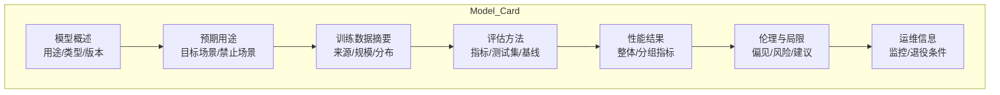
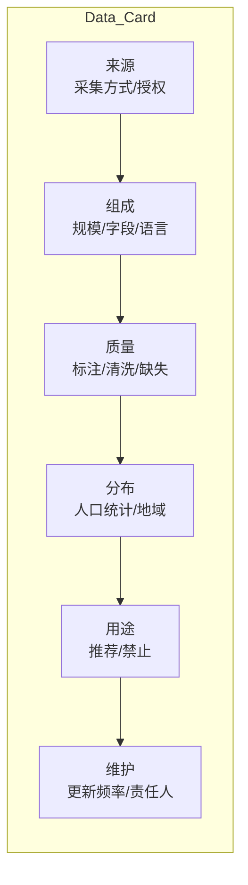
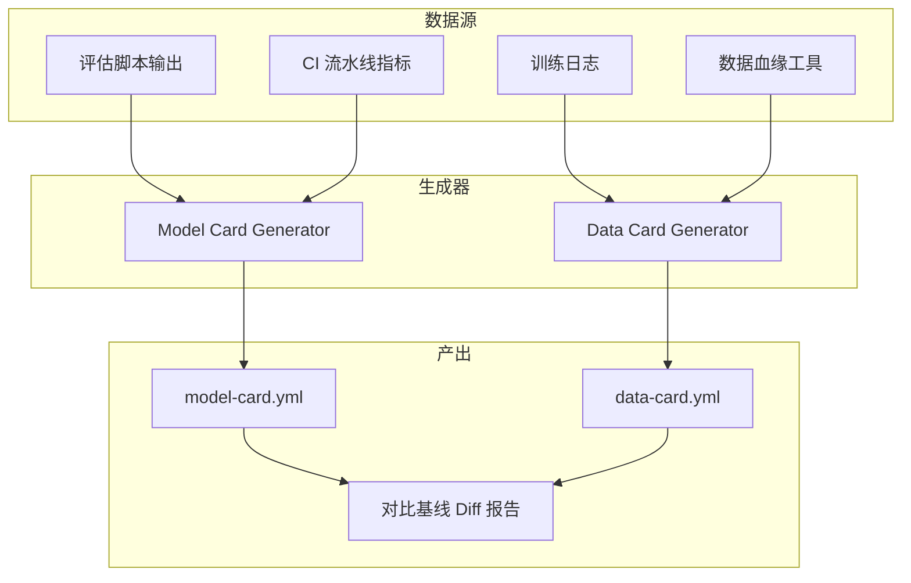
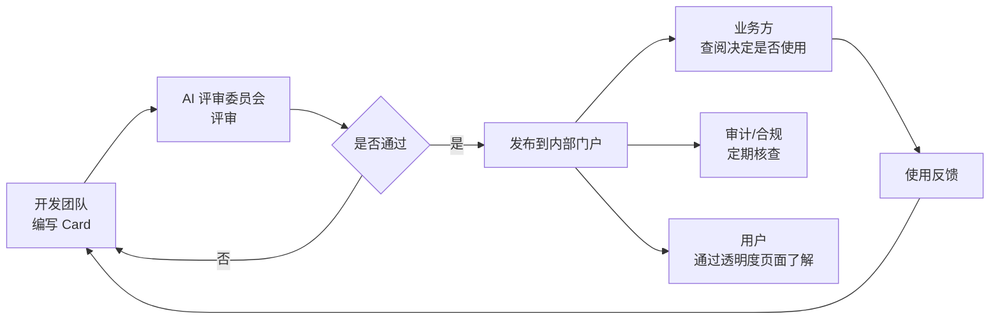

# 模型卡片与数据卡片：AI 透明度的两份"身份证"

「本文是对 [教程 08-架构师进阶/09-Agent治理与合规框架 §3] 的深入展开」

> [教程 08-架构师进阶/09-Agent治理与合规框架] 本文是治理合规系列的第二篇，深入讲解 Model Card 和 Data Card 两种透明度文档的写法、工具链、以及如何在 Java Agent 项目中自动化维护它们。

> 技术栈：Spring Boot 4.1 + Spring AI 2.0.0 + WebFlux + Java 21

---

## 一、为什么需要透明度文档

### 1.1 问题背景

AI 系统天然存在**信息不对称**：开发团队知道模型训练用了什么数据、在哪里表现好在哪里会出错，但使用者（业务方、终端用户、审计员）往往只能看到一个黑盒 API。这种不对称会导致三类问题：

- **误用**：业务方在不适合的场景使用了模型，比如把一个在内部客服数据上训练的 Agent 直接暴露给外部客户。
- **甩锅**：出问题时无法追溯是数据问题、模型问题还是使用方式问题。
- **审计困难**：监管或内部审计进场时，发现没有任何结构化文档可以展示。

### 1.2 两份文档的定位

| 文档 | 回答的问题 | 主要读者 |
|------|-----------|----------|
| **Model Card** | 这个模型能做什么、不能做什么、在哪里验证过 | 业务方、部署工程师、审计员 |
| **Data Card** | 这份数据从哪来、包含什么、有什么局限 | 数据科学家、法务、合规团队 |

可以类比：Model Card 是药品的**说明书**（适应症、禁忌、不良反应），Data Card 是药品的**成分表**（原料来源、纯度、检验报告）。

---

## 二、Model Card 详解

### 2.1 核心结构

Model Card 最初由 Google（Mitchell et al., 2019）提出，NIST AI RMF 和 ISO 42001 都推荐使用。一份合格的 Model Card 至少包含以下板块：



### 2.2 模板示例（YAML 格式）

以下是一个 LLM Agent 场景的 Model Card 模板，可以直接放在项目的 `docs/model-cards/` 目录下：

```yaml
model_card:
  model_name: CS-Helper-Agent-v2.1
  model_type: LLM Agent (GPT-4o + RAG)
  version: 2.1.0
  release_date: 2026-07-15
  owner: customer-service-team@company.com

  intended_use:
    primary: 内部客服坐席的知识检索与话术推荐
    out_of_scope:
      - 直接面向终端客户的自动回复
      - 法律/医疗/投资建议
    prohibited: 在未经评审的高风险场景使用

  training_data:
    description: 内部知识库 12000 篇 + 历史工单 50000 条
    demographics_note: 历史工单偏重华东地区用户
    preprocessing: 去除 PII，标注质量分级
    data_card_ref: data-cards/knowledge-base-v3.yml

  evaluation:
    metrics:
      - name: task_completion_rate
        value: 0.87
        test_set: eval-set-2026Q2 (800 cases)
      - name: hallucination_rate
        value: 0.04
      - name: tool_call_accuracy
        value: 0.92
    subgroup_analysis:
      - group: 新手坐席
        completion_rate: 0.79
      - group: 资深坐席
        completion_rate: 0.91
    robustness:
      prompt_injection_resistance: 通过
      jailbreak_resistance: 部分通过（3/20 样本被绕过）

  ethical_considerations:
    bias_risk: 历史数据可能偏向高频问题，长尾问题覆盖不足
    privacy: 输入经 PII 脱敏，日志保留 90 天
    environmental: 单次推理约 2.1g CO2（基于 EPA 区域系数）

  limitations:
    - 不支持多轮超过 20 轮的复杂推理
    - 对 2026 年 6 月后新增的产品知识覆盖不完整
    - 非英语输入准确率下降约 15%

  maintenance:
    monitoring: 在线监控用户反馈率、回退率
    retrain_trigger: 准确率连续两周低于 0.80
    sunset_condition: 12 个月内无迭代计划则进入退役评估
```

### 2.3 关键板块的写法要点

**预期用途（Intended Use）** 是最容易被忽视但最重要的板块。常见错误是只写"能做什么"而不写"不能做什么"（out_of_scope）和"禁止做什么"（prohibited）。三者必须同时写明，才能在出问题时界定责任。

**子群体分析（Subgroup Analysis）** 是公平性要求的核心。只给一个整体准确率是不够的——如果整体准确率 90%，但在某个子群体上只有 60%，这就是一个需要记录的公平性风险。

**限制（Limitations）** 要写得让使用者能据此判断"这个模型在我的场景能不能用"。模糊的表述（如"可能在某些情况下不太准确"）等于没写。

---

## 三、Data Card 详解

### 3.1 核心结构

Data Card 由 Pushkarna et al. (Google, 2022) 提出，关注的是数据集本身的生命周期信息。



### 3.2 模板示例

```yaml
data_card:
  dataset_name: knowledge-base-v3
  version: 3.2.0
  last_updated: 2026-06-30
  owner: data-platform-team@company.com

  provenance:
    sources:
      - type: 内部知识库文章
        count: 12000
        collection_method: CMS 自动同步
      - type: 历史客服工单
        count: 50000
        collection_method: 工单系统导出
    licensing: 内部使用，不包含第三方版权内容
    pii_handling: 已使用 Presidio 进行脱敏

  composition:
    total_records: 62000
    fields:
      - name: content
        type: text
        avg_length: 450 字
      - name: category
        type: enum
        values: [售后, 咨询, 投诉, 技术支持]
      - name: region
        type: enum
        values: [华东, 华南, 华北, 西部]
    languages:
      - 中文: 95%
      - 英文: 5%

  distribution:
    by_region:
      华东: 48%
      华南: 22%
      华北: 20%
      西部: 10%
    by_category:
      售后: 35%
      咨询: 30%
      技术支持: 25%
      投诉: 10%
    known_skew: 华东地区 + 售后类问题占比偏高

  quality:
    annotation_method: 人工标注 + 规则校验
    inter_annotator_agreement: 0.82 (Cohen's kappa)
    missing_rate: 2.3%
    validation: 每月抽样 200 条人工复核

  maintenance:
    update_frequency: 月度增量
    retention_policy: 原始数据保留 2 年，脱敏后长期保留
    change_log: data-cards/knowledge-base-v3-CHANGELOG.md
```

### 3.3 写法要点

**分布信息（Distribution）** 是 Data Card 的灵魂。仅记录"有多少条数据"是不够的，必须记录数据在人口统计、地域、时间等维度上的分布。分布偏差会直接传递到模型的输出偏差。

**授权与合规（Licensing/PII Handling）** 是法务最关心的板块。必须明确：数据从哪来、是否有使用授权、是否包含个人信息、如何脱敏。这一板块的准确性直接决定了数据集能否合规使用。

---

## 四、自动化生成与维护

手动维护这两份文档几乎一定会过时。务实的做法是半自动化生成。

### 4.1 自动化策略



### 4.2 代码集成方案

在 Java 项目中，可以利用构建工具（Maven/Gradle）在 CI 中自动生成指标部分：

1. **评估脚本**：在 `mvn test` 阶段运行评估套件，将结果输出为 JSON。
2. **Card 生成插件**：编写一个 Maven 插件或简单的 Java main 类，读取评估 JSON + 模板 YAML，生成最终的 Card 文件。
3. **Diff 检查**：在 PR 阶段对比 Card 变化，如果性能指标下降超过阈值则阻断合并。

模板中的**定量字段**（准确率、分布比例等）自动填充，**定性字段**（限制说明、伦理考量）由人工填写，CI 检查定性字段是否为空。

### 4.3 推荐工具

| 工具 | 用途 | 备注 |
|------|------|------|
| Hugging Face Model Card | 开源模型卡片标准 | 适合开放模型 |
| ML Metadata / Vertex AI | 自动记录训练血统 | 适合 GCP 用户 |
| DVC / DAGsHub | 数据版本化 + 卡片 | 适合数据驱动的团队 |
| 自研 YAML + Jinja 模板 | 灵活定制 | 推荐小型团队起步方案 |

---

## 五、透明度文档与组织流程的关系

文档本身不是目的，让正确的人在正确的时间看到它们才是。



建议在企业内部建立一个**模型注册中心（Model Registry）**，所有上线模型必须附带最新的 Model Card 和关联的 Data Card，否则不予发布。这把透明度从"自愿"变成了"强制"，是落地的关键一步。

---

## 六、常见问题

**Q：Model Card 是否需要对外公开？**
内部使用的模型，Card 至少对内部干系人公开。面向公众的模型（如聊天机器人），建议发布简化版"透明度声明"（Transparency Note），告知用户这是 AI 系统、能做什么、不能做什么。

**Q：Card 多久更新一次？**
每次模型版本更新必须更新 Card。即使模型不变，每季度也应复核一次，确认指标和限制说明是否仍然准确。

**Q：第三方模型（如调用 OpenAI API）怎么写 Card？**
无法获取训练数据细节时，Data Card 部分标注"供应商未披露"，Model Card 重点写：你如何使用这个模型、在你的测试集上表现如何、你观察到的局限是什么。供应商本身的限制（如数据保留政策）也要记录。

---

## 六（补充）、用 Spring AI 自动化生成 Model Card

以下 Java 代码演示如何在 CI/CD 流水线中自动填充 Model Card 的定量指标，并把卡片作为发布门禁。

```java
/**
 * 在模型版本发布前，自动跑评估集、填充 Model Card 的 metrics 字段。
 * 卡片中任一指标不达标则阻断发布。
 */
@Component
public class ModelCardPublisher {

    private final ChatClient agentClient;        // 被评估的 Agent
    private final EvalDatasetRepository evalSets; // 评估数据集
    private final ModelCardStore cardStore;       // 卡片存储

    public ModelCard publish(String modelVersion, String evalSetName) {
        // 1. 加载评估集
        List<EvalCase> cases = evalSets.load(evalSetName);

        // 2. 跑评估，采集指标
        EvalResult result = runEval(agentClient, cases);

        // 3. 填充 Model Card
        ModelCard card = ModelCard.builder()
            .modelVersion(modelVersion)
            .intendedUse("企业内部知识问答 Agent")
            .metrics(Map.of(
                "accuracy",        result.accuracy(),
                "toolCallSuccess", result.toolCallSuccessRate(),
                "safetyScore",     result.safetyScore(),
                "latencyP99Ms",    result.latencyP99Ms()
            ))
            .limitations(List.of(
                "对涉及精确数字的查询准确率较低",
                "长上下文(>50K)下存在 lost-in-the-middle"
            ))
            .outOfScope(List.of(
                "不用于法律/医疗建议",
                "不用于自动化决策（必须 HITL）"
            ))
            .evalDataset(evalSetName)
            .build();

        // 4. 发布门禁检查
        if (result.accuracy() < 0.85) {
            throw new PublishBlockedException(
                "Model Card 门禁: accuracy " + result.accuracy() + " < 0.85");
        }
        if (result.safetyScore() < 0.90) {
            throw new PublishBlockedException(
                "Model Card 门禁: safetyScore " + result.safetyScore() + " < 0.90");
        }

        // 5. 存储并归档
        return cardStore.save(card);
    }

    private EvalResult runEval(ChatClient client, List<EvalCase> cases) {
        int correct = 0, safeToolCalls = 0;
        List<Long> latencies = new ArrayList<>();
        for (EvalCase c : cases) {
            long t0 = System.nanoTime();
            String answer = client.prompt().user(c.input()).call().content();
            latencies.add(System.nanoTime() - t0);
            if (c.matcher().matches(answer)) correct++;
            if (c.expectsToolCall() == answer.contains("[tool:")) safeToolCalls++;
        }
        long p99 = latencies.stream().sorted().skip(latencies.size() * 99 / 100).findFirst()
            .map(ns -> ns / 1_000_000).orElse(0L);
        return new EvalResult(
            (double) correct / cases.size(),
            (double) safeToolCalls / cases.size(),
            computeSafety(cases),
            p99);
    }
}
```

**要点**：

- **`ModelCard` 是不可变 record**，发布后不可篡改，保证审计链完整。
- **门禁阈值写在代码里**，而非靠人工 review，避免"赶上线就放水"。
- **指标可追溯**：每次发布的 Model Card 与评估报告一起归档，合规审计时可调取任意历史版本。

---

## 七、总结

Model Card 和 Data Card 是 AI 透明度的基础设施。它们的价值在于：

1. **结构化**：把"关于这个模型/数据你需要知道的一切"固化成标准模板，避免遗漏关键信息。
2. **可追溯**：版本化的卡片记录了模型和数据随时间的演化，出问题时可以回溯。
3. **权责清晰**：通过 out_of_scope 和 prohibited 字段，划清了"模型能负责的范围"和"使用者需自担风险的范围"。

落地建议从简到繁：先用 YAML 模板手动填写一份 MVP 版本，验证模板是否适合你的场景；然后逐步接入 CI 自动化，把定量指标自动填充；最后建立模型注册中心，把卡片作为发布的硬性门槛。

下一篇 `02-数据隐私与偏见检测.md` 将从"体检"角度，讲解 GDPR 合规落地和偏见检测的具体方法。
