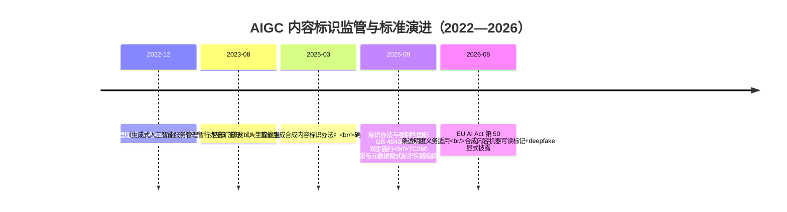
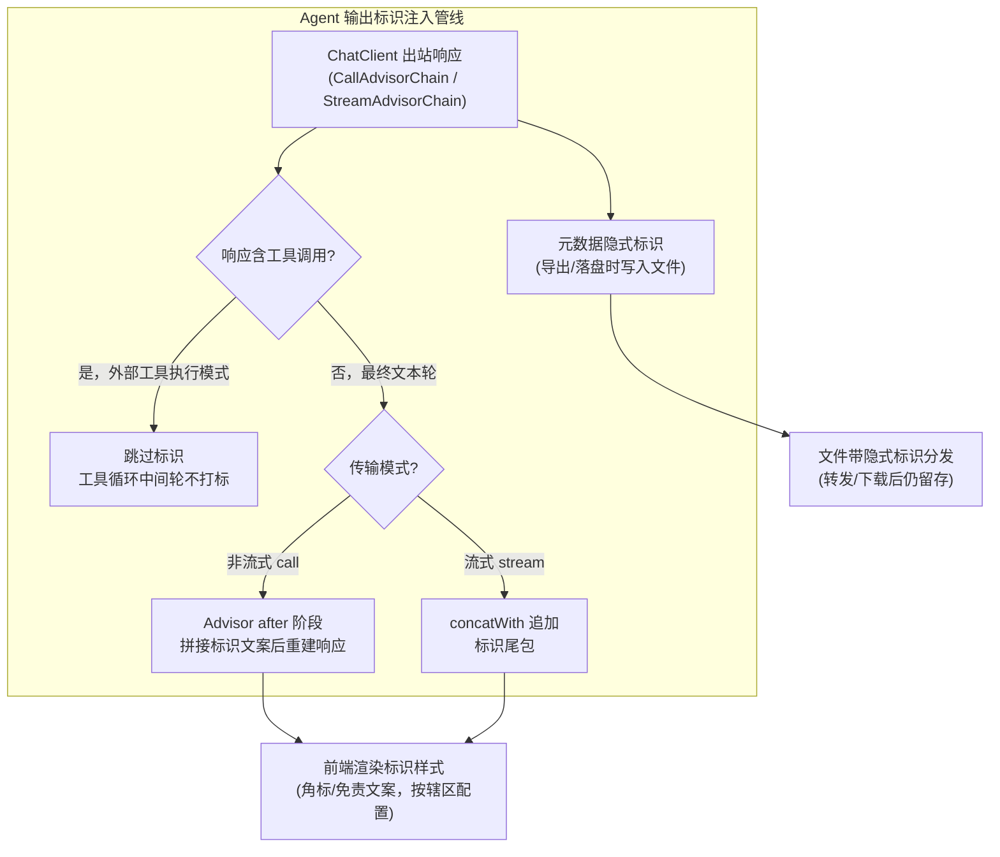
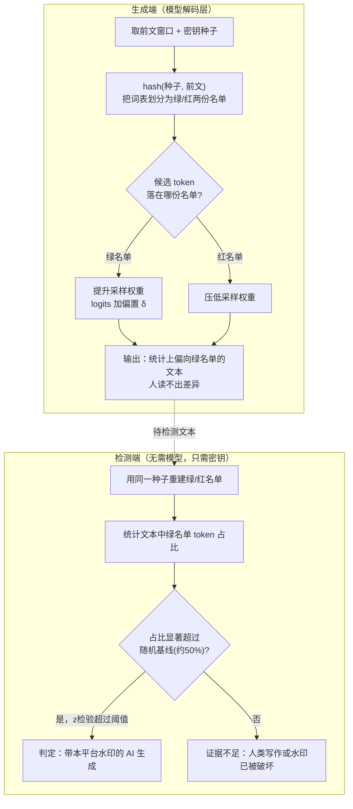
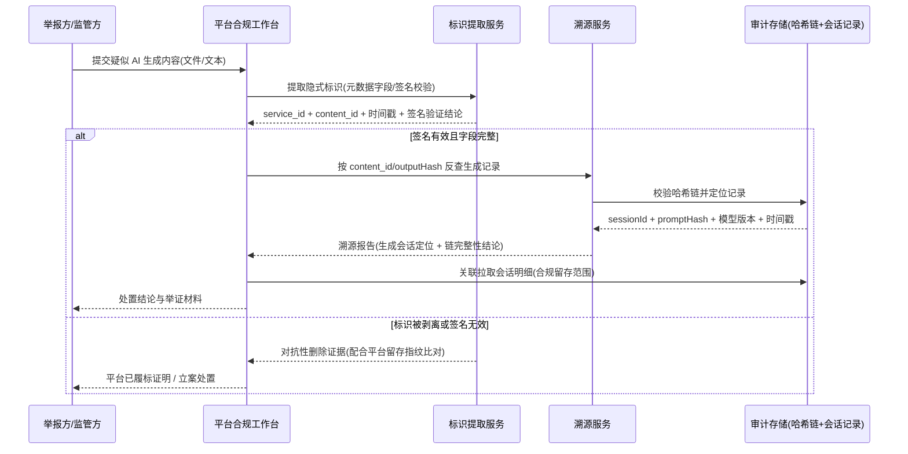

# AIGC 内容标识与数字水印：生成内容的溯源合规工程

「本文是对 [教程 08-架构师进阶/09-Agent治理与合规框架 §4] 中"AI 生成内容标识"义务的工程下钻」

> [教程 08-架构师进阶/09-Agent治理与合规框架] 教程篇把内容标识作为治理合规框架的一节概览带过；本文把它展开成一篇完整的合规工程篇——为什么标识是**法定义务**而非产品特性、三地监管的具体要求差异、显式标识与隐式水印的双轨实现、以及"内容出事可回溯到具体生成会话"的溯源审计闭环。落地载体见 [项目 14-企业级多微服务管控Agent平台/29-AIGC内容标识与适龄合规.md]，该篇在管控平台工程内实现双层标识架构；本文负责讲透其背后的原理、监管依据与边界。
>
> **读者画像**：正在搭建面向公众的 Agent 平台、需要落地 AIGC 标识合规的后端/平台架构师；已熟悉 Spring AI 的 Advisor 机制。
>
> **前置阅读**：[教程 02-SpringAI核心机制] 中 Advisor 链路（本文代码基于 CallAdvisor/StreamAdvisor）、[教程 04-企业级架构主干/05-历史记录持久化与合规]（审计留存是溯源的地基）。
>
> 技术栈：Spring Boot 4.1 + Spring AI 2.0.0 + WebFlux + Java 21（Advisor API 均经本地 jar javap 实证）

---

## 一、为什么标识是法定义务，而不是"产品体验优化"

很多团队对 AIGC 标识的第一反应是"前端加个角标、文案里写一句 AI 生成"，并且把它归入产品体验的打磨项。这个认知在 2025 年 9 月之后已经不成立：

- **中国**：《人工智能生成合成内容标识办法》（国家网信办等四部门 2025-03-07 印发）与其配套的**强制性国家标准** GB 45438-2025《网络安全技术 人工智能生成合成内容标识方法》已于 **2025-09-01 同步施行**。"强制"不是修饰词——GB 开头的标准号意味着不满足即不合规，显式与隐式**双标识**都是硬性要求。
- **欧盟**：EU AI Act（Regulation (EU) 2024/1689）于 2024-08-01 生效、分阶段适用，其第 50 条透明度义务（合成内容机器可读标记、deepfake 显式披露）自 **2026-08-02 起适用**——就在本月刚刚生效。面向欧盟用户提供服务的平台已经进入义务期。
- **美国**：联邦层面没有统一的 AIGC 标识立法，走的是**行业自治（C2PA 内容凭证）+ 州法分散立法**（如政治广告 AI 披露）路线。C2PA 虽非法规，但已成为跨平台内容溯源的事实标准，也是满足欧盟"机器可读标记"最现成的工程手段。



三个时间点共同定义了当下（2026 年）的现实：**一个面向公众上线的 Agent 系统，如果输出内容不带合规标识，它不是"不够完善"，而是不合法**。标识义务还带动了一整条工程链路——标识注入点、隐式水印、元数据规范、生成记录留存、溯源回查——这正是本文的主线。

> 想深入监管合规的整体框架（治理角色、风险管理、审计闭环）？→ [教程 08-架构师进阶/09-Agent治理与合规框架]

---

## 二、监管全景：三地义务对比

### 2.1 中国：显式 + 隐式双标识强制

《人工智能生成合成内容标识办法》全文十条，核心框架可以浓缩为四个动作：

1. **谁负责**：**服务提供者**（生成内容的平台）与**内容传播服务提供者**（分发内容的平台）分别承担义务。Agent 平台通常同时是两者——自己生成、也对外分发。
2. **标识什么**：利用人工智能技术生成、合成的文本、图片、音频、视频、虚拟场景等内容，都在义务范围内。
3. **怎么标**：
   - **显式标识**：在生成合成内容或交互场景界面中添加，以文字、声音、图形或图像呈现，**用户可明显感知**——即"人看得见"的那一层；
   - **隐式标识**：以技术措施在生成合成内容的**文件元数据**中添加，不易被用户明显感知——即"机器可读、随文件走"的那一层。GB 45438-2025 按模态细化了两者：例如文本类显式提示可置于内容的起始、中间或末尾等位置，音频可用语音提示或音频水印，图片、视频则要求可见水印类标识并在元数据中写入隐式标识字段。
4. **不许动**：恶意删除、篡改、伪造、隐匿他人标识是被明确禁止的行为，违者依《网络安全法》等法律处理——这直接决定了"隐式标识要抗篡改"是标准要求而非选配。

对传播侧的义务同样要重视：**传播平台需要对入站内容核验标识**。如果你的 Agent 平台允许用户上传内容再分发（如智能客服知识库、社区功能），你同时落入了核验义务。

### 2.2 欧盟：AI Act 第 50 条的透明度义务

EU AI Act Art.50 对不同角色分了三档：

- **Art.50(1)**：与 AI 系统直接交互的提供者，必须确保系统在交互中让用户**知道自己在与 AI 对话**（除非对一个理性人而言显而易见）——对应聊天界面的"AI 助手"身份声明；
- **Art.50(2)**：通用目的 AI 模型的提供者，须对合成内容输出以**机器可读格式**（如水印、元数据）进行标记——对应隐式标识层；
- **Art.50(4)**：发布**深度合成（deepfake）**图像、视频内容时必须显式披露其为人工生成；就公共利益事项发布的 AI 生成文本，也须告知（经人工编辑审查的除外）。

时间线上，Art.50 作为提供者/部署者义务自 **2026-08-02 起适用**。罚则上，违反透明度类义务按 AI Act Art.99 可处最高 **1500 万欧元或全球年营业额 3%**（取较高者）的行政处罚——与违反禁止性义务的最高档（3500 万欧/7%）仅差一档，不是"罚酒三杯"。

### 2.3 美国：C2PA 内容凭证——行业自治的事实标准

C2PA（Coalition for Content Provenance and Authenticity，内容溯源与真实性联盟）由 Adobe、Microsoft、Intel、BBC 等 2021 年发起，OpenAI、Google 等生成侧厂商也已加入。它的技术内核是一份**加密签名的内容凭证（Content Credential）manifest**：

- 以标准化 JSON（JUMBF 容器）记录**谁（签名的签发者）、用什么（生成/编辑工具及版本）、怎么生成（生成动作断言）、后续如何被编辑（编辑历史链）**；
- manifest 经数字签名后嵌入文件元数据，随文件分发；任何一次合法编辑会追加新断言并重新签名，形成**凭证链**；
- 验证端可校验签名与断言完整性，发现凭证被剥离或篡改。

C2PA 不是法规，但它同时是中国 GB 45438-2025 隐式标识（元数据路线）与欧盟 Art.50(2)"机器可读标记"的现成实现路径，也是美国市场事实上的通行证。

### 2.4 三地义务对比表

| 维度 | 中国（标识办法 + GB 45438-2025） | 欧盟（EU AI Act Art.50） | 美国（C2PA + 州法） |
|---|---|---|---|
| **性质** | 部门规章 + 强制性国标 | 条例（直接适用的法律） | 无联邦统一立法；行业标准 + 州法分散 |
| **适用对象** | 生成合成服务提供者、传播服务提供者 | GPAI 模型提供者、AI 系统（交互告知）、deepfake 发布部署者 | 自愿采用 C2PA 的厂商；特定场景（政治广告等）州法强制 |
| **标识形式** | 显式（人可感知）+ 隐式（元数据）**双强制** | 交互身份告知 + 输出机器可读标记 + deepfake 显式披露 | 无统一强制；C2PA 凭证（签名元数据链） |
| **元数据要求** | 隐式标识写入文件元数据、需抗篡改，字段与位置按国标执行 | 要求"机器可读格式"（如水印），形式自由度较高 | C2PA manifest：签名断言链，记录生成与编辑历史 |
| **罚则** | 未标识/恶意删改依《网络安全法》等处理；违反可致服务处置 | 最高 1500 万欧或全球年营业额 3%（Art.99） | 依各州法（如政治广告罚款）；C2PA 违反无直接罚则 |
| **状态（2026-08）** | 已施行近一年，执法常态化 | 透明度义务刚于 2026-08-02 适用 | C2PA 生态快速扩张，州法渐进增多 |

> **架构含义**：三地要求在工程上收敛于同一套双层架构——**显式标识层**（用户可见）+ **隐式标识层**（元数据/水印，机器可读、随文件留存）。做一套，同时满足三地的最大公约数；差异部分（如中国的国标字段、欧盟的身份告知文案）做成**按司法辖区的策略配置**，而不是各写一条管线。

---

## 三、显式标识工程：在输出管线统一注入

### 3.1 注入点选型：为什么是 Advisor 层

显式标识的注入点有三个候选，工程特性差异很大：

| 候选注入点 | 覆盖面 | 主要缺陷 |
|---|---|---|
| 前端组件加角标 | 仅当前 UI | 复制、导出、API 直出全部丢失；前端可以绕过 |
| 各 Controller 手工拼接 | 仅覆盖写了的接口 | 接口数量增长必漏；流式/非流式两套逻辑重复 |
| **Advisor 统一注入** | **所有经过 ChatClient 的出口** | 需处理流式语义（下文给出方案） |

结论：**Advisor 层是唯一"一次接入、全出口覆盖"的注入点**——这得益于 Spring AI 把所有模型出口收敛到 ChatClient 的管线设计。前端渲染只负责"样式"，不负责"有无"；导出/下载接口在文件生成时再次落标识（见 3.4）。



这张图里有两条关键分支：**工具调用轮不打标**（工具循环的中间响应不是面向用户的最终内容），以及**流式/非流式双模式**（同一个逻辑语义，两种 Reactive 实现）。

### 3.2 文本显式标识的位置与措辞要点

- **位置**：国标允许文本标识位于起始、中间或末尾。工程上推荐**正文末尾 + 换行隔离**：起始位置的标识会被 RAG 检索、下游系统误当正文消费；末尾 + `\n\n` 分隔对解析器最友好。
- **措辞要确定**："本内容可能由 AI 生成"是不合格的——显式标识的语义是**陈述事实**而非免责暗示。推荐"以上内容由 AI 生成，仅供参考"这类确定性表述。
- **交互入口单独声明**：除内容标识外，会话界面（首次进入、悬浮提示）需有"您正在与 AI 助手对话"的告知——这同时满足中国交互场景标识与欧盟 Art.50(1) 的身份告知。
- **按辖区配置**：中文服务用中文文案、欧盟服务按 Art.50 文案，**文案与位置进配置中心**，随合规要求变化热更（呼应灰度发布能力，见 [教程 04-企业级架构主干/09-灰度发布与版本管理]）。

### 3.3 代码：AiLabelAdvisor——一个 Advisor 覆盖 call 与 stream

以下代码基于 Spring AI 2.0.0，所有 Advisor/响应对象签名均经本地 jar `javap` 实证：`CallAdvisor.adviseCall(ChatClientRequest, CallAdvisorChain)`、`StreamAdvisor.adviseStream(ChatClientRequest, StreamAdvisorChain)`、`ChatClientResponse.builder().chatResponse(...).context(...).build()`、`ChatResponse.builder().from(...).generations(...).build()`、`Generation(AssistantMessage)` 与 `AssistantMessage.getText()`。

```java
// src/main/java/com/demo/agent/compliance/AiLabelProperties.java
package com.demo.agent.compliance;

import org.springframework.boot.context.properties.ConfigurationProperties;

/**
 * AIGC 显式标识配置。文案与开关走配置中心，按司法辖区差异化。
 */
@ConfigurationProperties(prefix = "app.aigc.label")
public record AiLabelProperties(
        boolean enabled,
        String textSuffix,        // 例如："以上内容由 AI 生成，仅供参考"
        String interactionNotice  // 例如："您正在与 AI 助手对话"（交互界面告知，前端消费）
) {
    public AiLabelProperties {
        if (textSuffix == null || textSuffix.isBlank()) {
            textSuffix = "以上内容由 AI 生成，仅供参考";
        }
    }
}
```

```java
// src/main/java/com/demo/agent/compliance/AiLabelAdvisor.java
package com.demo.agent.compliance;

import java.util.List;

import org.springframework.ai.chat.client.ChatClientRequest;      // Spring AI 2.0.0（record）
import org.springframework.ai.chat.client.ChatClientResponse;      // Spring AI 2.0.0（record）
import org.springframework.ai.chat.client.advisor.api.CallAdvisor;
import org.springframework.ai.chat.client.advisor.api.CallAdvisorChain;
import org.springframework.ai.chat.client.advisor.api.StreamAdvisor;
import org.springframework.ai.chat.client.advisor.api.StreamAdvisorChain;
import org.springframework.ai.chat.messages.AssistantMessage;
import org.springframework.ai.chat.model.ChatResponse;
import org.springframework.ai.chat.model.Generation;
import org.springframework.core.Ordered;

import reactor.core.publisher.Flux;
import reactor.core.publisher.Mono;

/**
 * AIGC 显式标识注入 Advisor：同时实现 CallAdvisor 与 StreamAdvisor（Spring AI 2.0.0），
 * 在输出管线最外层为最终文本轮追加"由 AI 生成"提示。
 *
 * 洋葱模型说明：order 最小 → 最早进入链条、最晚离开链条，
 * 因此对输出的改写在所有其他 Advisor（记忆/RAG/审计）之后执行，不会污染它们读取的文本。
 */
public class AiLabelAdvisor implements CallAdvisor, StreamAdvisor {

    private final AiLabelProperties props;

    public AiLabelAdvisor(AiLabelProperties props) {
        this.props = props;
    }

    @Override
    public String getName() {
        return "AiLabelAdvisor";
    }

    @Override
    public int getOrder() {
        // 标识是最外层后置动作，尽早进链、最后改写
        return Ordered.HIGHEST_PRECEDENCE + 10;
    }

    /** 非流式：取最终文本 → 拼接标识 → 重建响应。 */
    @Override
    public ChatClientResponse adviseCall(ChatClientRequest request, CallAdvisorChain chain) {
        ChatClientResponse response = chain.nextCall(request);
        if (!props.enabled()) {
            return response;
        }
        ChatResponse chatResponse = response.chatResponse();
        // 外部工具执行模式下响应含工具调用指令，此轮不面向用户，不打标
        if (chatResponse == null || chatResponse.hasToolCalls()
                || chatResponse.getResult() == null) {
            return response;
        }
        String text = chatResponse.getResult().getOutput().getText();
        AssistantMessage labeled = new AssistantMessage(text + "\n\n" + props.textSuffix());
        ChatResponse rebuilt = ChatResponse.builder()
                .from(chatResponse)                       // 保留原 metadata（token 用量等）
                .generations(List.of(new Generation(labeled)))
                .build();
        return ChatClientResponse.builder()
                .chatResponse(rebuilt)
                .context(response.context())              // 上下文原样透传，下游 Advisor 不受影响
                .build();
    }

    /**
     * 流式：原流逐片直通（零缓冲），末尾 concat 一个"标识尾包"。
     * 工具调用循环的中间增量片先流过，但整个编排（工具循环+最终文本轮）
     * 是同一条 Flux，onComplete 才代表编排结束——因此尾包恰好落在最终输出的末尾。
     */
    @Override
    public Flux<ChatClientResponse> adviseStream(ChatClientRequest request, StreamAdvisorChain chain) {
        if (!props.enabled()) {
            return chain.nextStream(request);
        }
        return chain.nextStream(request)
                .concatWith(Mono.fromSupplier(this::buildTail));
    }

    private ChatClientResponse buildTail() {
        AssistantMessage labelMsg = new AssistantMessage("\n\n" + props.textSuffix());
        ChatResponse tail = ChatResponse.builder()
                .generations(List.of(new Generation(labelMsg)))
                .build();
        return ChatClientResponse.builder()
                .chatResponse(tail)
                .context(java.util.Map.of())   // 标识尾包不依赖上游上下文，空 Map 即可
                .build();
    }
}
```

```java
// src/main/java/com/demo/agent/compliance/AigcLabelConfiguration.java
package com.demo.agent.compliance;

import org.springframework.ai.chat.client.ChatClient;             // Spring AI 2.0.0
import org.springframework.ai.chat.model.ChatModel;
import org.springframework.boot.context.properties.EnableConfigurationProperties;
import org.springframework.context.annotation.Bean;
import org.springframework.context.annotation.Configuration;

@Configuration
@EnableConfigurationProperties(AiLabelProperties.class)
public class AigcLabelConfiguration {

    @Bean
    public ChatClient chatClient(ChatModel chatModel, AiLabelProperties props) {
        return ChatClient.builder(chatModel)
                .defaultAdvisors(new AiLabelAdvisor(props))   // 一个实例同时进入 call 与 stream 两条链
                .build();
    }
}
```

三个工程要点：

1. **为什么尾包一定能落在最终输出末尾？** `chain.nextStream(request)` 返回的是"整条编排"的流——工具调用循环的中间增量片与最终文本轮都在其中，`onComplete` 才代表编排结束，因此 `concatWith` 的尾包恰好接在最终轮之后。`Mono.fromSupplier` 保证尾包仅在订阅到该位置时才构造，不预先计算、不缓冲原流。
2. **尾包会被前端按普通增量拼接**——所以尾包文本自带 `\n\n` 前缀，视觉上独立成段。更精细的方案是在 SSE Controller 层把尾包转成独立的 `event: aigc-label` 帧由前端单独渲染，Advisor 语义保持不变。
3. **SSE 与 WebFlux 铁律**：全程无 block、无 Thread.sleep；若在 Controller 层从 Reactor Context 取会话信息做标识归因，用 `contextWrite` 传递而非 ThreadLocal（见 [教程 01-WebFlux与响应式编程] 的上下文传递篇）。

### 3.4 多模态输出的显式标识

文本之外的模态，显式标识在**文件生成层**做，而非 Advisor 层：

- **图片**：导出时以 Java 2D `Graphics2D` 在角落绘制可见标识（文字或平台 logo），同时走 3.5 的元数据隐式标识；
- **音频**：生成完成后在头部或尾部拼接语音提示（"本内容由 AI 生成"），或叠加音频水印；
- **视频**：起播画面叠显式提示 + 播放期间保留可见水印，对应国标对视频"起始画面 + 播中"的位置要求。

工具生成的多模态内容（Agent 调用绘图工具产出的图片）同样走文件生成层打标——责任主体是**平台（服务提供者）**，与内容经由模型直出还是工具产出无关（详见第六节）。

---

## 四、隐式标识（数字水印）工程：机器可读、随文件留存

显式标识解决"人知道"，隐式标识解决"机器可证明、且删不掉"。删除路径是真实的：截图、复制粘贴、转码、录屏，显式标识一过这些操作就消失。隐式标识的三条技术路线对应三种"藏在哪"：

### 4.1 文本水印：绿名单/红名单 token 偏差

这是目前学术界与工业界（如 Google DeepMind 的 SynthID-Text）的主流文本水印思路，原理可以用一张图说清：



三个关键性质决定了它的工程边界：

1. **检测不需要模型**——只需要密钥种子与 hash 规则，检测端可以是一个轻量 API；
2. **密钥即身份**——不同业务线用不同种子，检测出哪条线的水印，就知道内容出自哪条产品线；
3. **攻击面明确**——改写/翻译/回译会整体替换 token，水印即被冲刷；低熵文本（代码、法律条文、数字清单）加偏置会直接产生事实错误；短文本绿名单占比的统计功效不足；温度过高会稀释偏置。**结论：文本水印是"概率性证据"，不能单独作为归责依据**。

`★ Insight ─────────────────────────────────────`
- 文本水印本质是在**生成分布上做有密钥的低幅扰动**：扰动方向由 hash(种子， 前文) 决定，因此独立于具体文本、可被检测端重建——这是"不可见但可验证"的关键。
- 它与 Agent 体系的衔接点在**模型接入方式**：闭源 API 拿不到 logits，平台侧无法实施；**只有自托管开源模型**时，水印器作为解码管线的一层才有落点。
`─────────────────────────────────────────────────`

```java
// 概念代码：仅示意绿名单/红名单机制，不可直接编译运行于 Spring AI 管线。
// 真实实现需在自托管模型的解码层干预 logits（如 tokennfg / SynthID-Text 类方案），
// 闭源模型 API（无法访问 logits）上不可实施。
public class GreenRedListWatermarker {

    /** 生成时：按 hash(种子, 前文窗口) 把词表分成两半，绿名单 token 获得偏置。 */
    public double[] biasLogits(double[] logits, List<Integer> prevTokens, long seed) {
        long h = seed;
        for (int t : prevTokens) {
            h = h * 31 + t;                     // 滚动 hash 前文窗口
        }
        double delta = 2.0;                     // 偏置强度：越大越可检测、越伤文本质量
        for (int v = 0; v < logits.length; v++) {
            if (hashToBucket(h, v) == 0) {      // 0=绿名单，1=红名单
                logits[v] += delta;
            }
        }
        return logits;
    }

    /** 检测端：同种子重建名单，统计绿名单占比，做 z 检验。 */
    public double greenRatio(List<Integer> tokens, long seed) {
        long h = seed;
        int green = 0;
        for (int i = 0; i < tokens.size(); i++) {
            if (hashToBucket(h, tokens.get(i)) == 0) {
                green++;
            }
            h = h * 31 + tokens.get(i);
        }
        return (double) green / tokens.size();  // 随机基线约 0.5，显著偏高即有水印证据
    }

    private int hashToBucket(long h, int vocabId) {
        return Long.hashCode(h * 1000003 + vocabId) & 1;
    }
}
```

### 4.2 图片隐式水印：从 LSB 到频域

- **LSB（最不重要位）**：把标识比特写进像素值的最低位，人眼不可见。实现最简单，但**极其脆弱**——转码、压缩、缩放都会冲掉。只适合防"无心之改"，不适合对抗场景。
- **频域水印（DCT/DWT）**：把标识嵌入变换域的中频系数（JPEG 的 DCT 块），在不可见性与抗压缩/缩放的鲁棒性之间取得平衡。算法成熟（如各类扩频水印），Java 侧可自研但强度有限，生产建议用成熟库或供应商能力。
- **生成过程潜伏（供应商能力）**：扩散模型可以把水印埋进**初始噪声**，从生成源头就不可分离（Google SynthID for Images 的路线）。这条路平台侧无法自研，选型图片生成供应商时把它作为评估项。

### 4.3 元数据隐式标识：GB 45438-2025 的主路线

对工程团队最重要、也最可自研的一条路：**在生成文件的元数据中写入结构化隐式标识**。国标的隐式标识定义即落在文件元数据上，TC260 已发布配套的元数据隐式标识实践指南。典型字段设计：

```json
{
  "aigc": true,
  "service_id": "demo-agent-platform",
  "content_id": "cnt_01J9X7K2M8",
  "generated_at": "2026-08-30T09:00:00Z",
  "model": "deepseek-chat",
  "label_version": "v1",
  "signature": "MEUCIQDz...（对以上字段的平台私钥签名，占位符，实际从 KMS/环境变量加载）"
}
```

- **写到哪里**：PNG 的 `tEXt`/`iTXt` 块、JPEG 的 `APP` 段、MP4 的 `udta` 框、PDF 的 `XMP` 元数据——各容器都有标准的扩展元数据位置；
- **为什么加签名**：办法明确禁止恶意删改标识。无签名的元数据字段任何人都能删；**签名后的字段被删除即可被验证"曾经存在过标识"**（配合平台留存的内容指纹），把"删标识"从无声操作变成可举证行为；
- **与 C2PA 的关系**：自研字段是满足国标的最低实现；C2PA manifest 是这条路线的工业化强化版（标准化字段 + 证书体系 + 编辑历史链）。面向国际业务建议直接采用 C2PA（需在 pom.xml 中添加对应 C2PA SDK 依赖并完成证书体系接入）。

### 4.4 Java 侧实现路径：哪些自研、哪些依赖外部

| 能力 | 自研可行性 | 说明 |
|---|---|---|
| 文本显式标识注入 | ✅ 完全自研 | 本节 §3.3 的 Advisor 即可 |
| 图片可见标识 | ✅ 自研 | Java 2D `Graphics2D` 叠加文字/logo |
| 文件元数据隐式标识 | ✅ 自研 | 按国标字段设计 + 平台私钥签名（密钥走环境变量/KMS，禁止硬编码） |
| 图片鲁棒水印 | ⚠️ 可自研但强度有限 | 频域算法复杂度高、对抗经验不足时容易"自研即漏"，建议成熟库/供应商 |
| 文本 token 水印 | ❌ 依赖模型侧 | 需解码层 logits 干预；闭源 API 不可行，自托管开源模型才有落点 |
| 图片生成过程水印 | ❌ 依赖供应商 | 扩散模型初始噪声路线，选型时作为供应商评估项 |
| C2PA 内容凭证 | ⚠️ 需 SDK + 证书体系 | 引入 C2PA SDK（需在 pom.xml 添加依赖），并建立平台签名证书的签发与轮转 |

---

## 五、溯源与审计：让"标识"能回答"这条内容是谁、何时、用什么生成的"

标识的价值在"出事时"。用户举报一条 AI 生成的误导内容、监管要求说明某条内容的生成过程、法务需要证明平台履行了标识义务——这些都要求：**从任意一条已分发的内容，回溯到具体的生成会话与生成参数**。这条回溯链的每一环都要求生成侧留了记录。

### 5.1 生成记录的哈希链结构

每条生成内容在产出时同步登记一条溯源记录，记录之间用哈希链串联（后一条的 hash 覆盖前一条的 hash，任何一条被删改都会断链）：

```java
// src/main/java/com/demo/agent/compliance/GenerationProvenanceService.java
package com.demo.agent.compliance;

import java.nio.charset.StandardCharsets;
import java.security.MessageDigest;
import java.security.NoSuchAlgorithmException;
import java.util.HexFormat;
import java.util.UUID;
import java.util.concurrent.atomic.AtomicReference;

import org.springframework.stereotype.Service;

/**
 * 生成溯源哈希链：每次 AIGC 输出登记一条记录，
 * hash = SHA-256(本记录字段 | 上一条 hash)，形成防篡改链条。
 *
 * 存储落点：写入审计存储（会话库/对象存储），呼应教程 04-企业级架构主干/05-历史记录持久化与合规；
 * 如需事件化广播（风控订阅/离线分析），可同步发 Kafka
 * （需在 pom.xml 中添加 spring-kafka 依赖，见教程 07-Kafka事件骨干）。
 */
@Service
public class GenerationProvenanceService {

    private static final String GENESIS = "GENESIS";

    /** 链头指针：CAS 推进，保证并发下链条不分叉。 */
    private final AtomicReference<String> head = new AtomicReference<>(GENESIS);

    public record ProvenanceRecord(
            String recordId,      // 溯源记录 ID
            String sessionId,     // 生成会话 ID（反查会话详情的钥匙）
            String promptHash,    // prompt 的 SHA-256（原文留存走会话存储，此处只存摘要）
            String modelVersion,  // 模型标识与版本
            String outputHash,    // 生成内容正文的 SHA-256（与文件元数据中的内容指纹对齐）
            long timestamp,
            String prevHash,
            String hash) { }

    public ProvenanceRecord append(String sessionId, String prompt, String modelVersion, String output) {
        String recordId = "prv_" + UUID.randomUUID();
        String promptHash = sha256Hex(prompt);
        String outputHash = sha256Hex(output);
        long ts = System.currentTimeMillis();
        for (;;) {                                     // CAS 重试：并发追加时以最新链头为准
            String prev = head.get();
            String payload = String.join("|",
                    recordId, sessionId, promptHash, modelVersion,
                    outputHash, String.valueOf(ts), prev);
            String hash = sha256Hex(payload);
            ProvenanceRecord rec = new ProvenanceRecord(
                    recordId, sessionId, promptHash, modelVersion,
                    outputHash, ts, prev, hash);
            if (head.compareAndSet(prev, hash)) {
                return rec;                            // TODO：落审计存储 + 可选 Kafka 事件
            }
        }
    }

    /** 校验：给定记录，重算 hash 并验证 prevHash 与链上记录一致。 */
    public boolean verify(ProvenanceRecord rec, String expectedPrevHash) {
        String payload = String.join("|",
                rec.recordId(), rec.sessionId(), rec.promptHash(), rec.modelVersion(),
                rec.outputHash(), String.valueOf(rec.timestamp()), rec.prevHash());
        return rec.prevHash().equals(expectedPrevHash)
                && rec.hash().equals(sha256Hex(payload));
    }

    private String sha256Hex(String input) {
        try {
            MessageDigest digest = MessageDigest.getInstance("SHA-256");
            return HexFormat.of().formatHex(digest.digest(input.getBytes(StandardCharsets.UTF_8)));
        } catch (NoSuchAlgorithmException e) {
            throw new IllegalStateException("SHA-256 unavailable", e);
        }
    }
}
```

工程上注意两点：内存 `AtomicReference` 链头是**单机示意**；多实例部署下链头应外置（数据库序列/Redis 原子操作），或直接按"记录内嵌 prevHash + 按时间排序校验"的弱链模式，让校验端能检测断链即可。哈希链防的是"事后删改"，与教程 05 的合规留存（防"事后找不到"）是互补的两层。

### 5.2 回溯链路：从一条内容到一次生成会话



这条链路能闭环的前提是三件事在生成时就做了：**内容指纹（outputHash）写入元数据并留档**、**溯源记录随生成同步登记**、**会话明细按合规范围留存**。三者缺一，溯源就在某一环断掉。留存策略本身（存多久、存什么、如何脱敏）见 [教程 04-企业级架构主干/05-历史记录持久化与合规]。

---

## 六、Agent 场景的特殊义务：工具、转发与未成年用户

### 6.1 工具生成内容：责任在平台侧，标识在包装层

Agent 的特殊性在于：内容不一定是模型直出的。用户说"帮我画一张海报"，Agent 调用绘图工具（MCP 工具/HTTP API）产出图片。此时标识义务归谁？**归平台**——在监管语义里，Agent 平台就是"生成合成服务提供者"，内容经由模型还是工具产出，不改变你的义务主体身份。

工程落点：在**工具执行管线**统一打标，而不是每个工具调用点手工处理。与 HITL 审批的落点同理（见 [教程 04-企业级架构主干/08-Human-in-the-Loop与审批流] 与附录 Advisor/HITL 落点篇），装饰 `ToolCallback` 或 `ToolCallingManager`，对工具产物（图片/音频/视频）在文件生成后立即写入元数据隐式标识并触发可见标识渲染。这保证任何新接入的工具，产物天然带标。

### 6.2 转发与二创：标识保留是硬要求

- **导出接口**：平台提供的一切内容导出（下载、分享链接、复制到剪贴板的长文）必须**保留隐式标识**；提供"去水印下载"类功能直接触碰办法的禁止条款。代码评审时把"导出路径是否绕过元数据写入"列入 checklist。
- **入站核验**：平台若允许用户上传内容再分发（社区、知识库共享），落入"传播服务提供者"义务——需核验入站内容的显式/隐式标识，并对未标识的可疑 AI 内容做检测与提示。这也是 5.2 中"标识被剥离"分支的现实来源：平台会持续收到标识被对抗性删除的内容。
- **二创场景**：用户在平台内对 AI 内容二次编辑后发布，编辑动作不应剥离标识——理想的 C2PA 式实现是追加编辑断言，最低实现是重新生成 content_id 并保留 lineage 字段指向前代。

### 6.3 适龄合规：未成年用户场景的额外标识

在标识办法的通用义务之外，面向未成年人的产品场景有更强的告知要求（《未成年人保护法》网络保护章 + 未成年人模式建设的地方标准/平台实践）：未成年人模式下，AI 内容标识应**更显眼**（不可折叠、不可隐藏）、生成内容入口应有适龄提示、涉及代写作业等场景需要额外的情景声明。落地载体见 [项目 14-企业级多微服务管控Agent平台/29-AIGC内容标识与适龄合规.md] 的未成年人模式分级策略——工程上表现为按用户画像切换标识策略（文案强度、位置、是否可关闭），而非另起一条管线。

---

## 七、落地检查清单

上线前逐条自查（每条对应义务来源与验证方式）：

| # | 义务来源 | 检查项 | 验证方式 |
|---|---|---|---|
| 1 | 标识办法（显式标识） | 文本输出末尾含确定性"由 AI 生成"文案 | 抽查非流式与流式出口真实响应 |
| 2 | 标识办法 + EU Art.50(1) | 会话入口有"正在与 AI 对话"告知 | UI 走查（首屏/悬浮） |
| 3 | GB 45438-2025 | 图片输出有可见标识（角落水印/角标） | 导出图片抽查 |
| 4 | GB 45438-2025 | 音频输出含语音提示或音频水印 | 生成音频抽查 |
| 5 | GB 45438-2025 | 视频输出起播画面提示 + 播中水印 | 生成视频抽查 |
| 6 | 标识办法（隐式标识） | 全部生成文件写入元数据隐式标识 | 用元数据读取工具抽验 PNG/JPEG/MP4 |
| 7 | GB 45438-2025 字段要求 | 元数据含服务标识、内容编号、时间戳、模型标识 | 字段 diff 校验脚本 |
| 8 | 标识办法（抗篡改） | 隐式标识字段经平台签名，可验证"是否被删改" | 删除字段后验签应失败 |
| 9 | 标识办法（禁止删改） | 导出/下载/分享接口无绕过标识的路径 | 代码评审 + 导出产物抽验 |
| 10 | 标识办法（服务提供者范围） | 工具生成内容（绘图/API 工具）同样带标 | 经工具链路生成内容抽查 |
| 11 | 审计留存（配合溯源） | 生成记录含 promptHash/模型版本/时间戳/输出指纹 | 溯源记录表抽验 |
| 12 | 溯源闭环 | 随机抽 N 条已分发内容，可回溯到生成会话 | 每月溯源演练（跑 5.2 全链路） |
| 13 | 未成年人保护相关要求 | 未成年人模式下标识更显眼、不可关闭 | 未成年人模式 UI 走查 |
| 14 | 标识办法（对抗删除） | 对入站/已分发内容有标识检测与"疑似 AI"提示能力 | 剥离标识样本回灌测试 |
| 15 | EU Art.50(2)（涉欧服务） | 输出有机器可读标记（元数据/水印/C2PA） | 欧盟辖区出口抽验 |

---

## 八、适用场景与不适用场景

**适用场景**：

- 面向中国境内公众提供生成内容的 Agent 产品（标识办法义务主体，双标识强制）；
- 触达欧盟用户的服务（Art.50 透明度义务已于 2026-08-02 适用）；
- 内容信任敏感行业——媒体、教育、医疗、金融投顾——即便所在辖区尚无强制，标识也是建立用户信任与内部审计的抓手；
- 允许内容导出/分发/二创的平台（隐式标识 + 溯源链的价值集中区）。

**不适用场景**（或需降级处理）：

- 纯企业内部研发、测试环境的非面向公众输出——义务主体是"向境内公众提供服务"，内部工具不触发（但建议保留标识能力，因为内部内容一旦外流，有标识可自证清白）；
- 不直接触达最终用户的中间推理产物（Agent 内部的工具调用中间结果、检索中间层）——不面向用户即无标识义务，且打标会污染下游消费；
- 无内容生成能力的纯检索/问答路由平台——不生成合成内容，不是义务主体（但作为传播渠道可能承担核验义务，需按业务形态判断）；
- 对**文本 token 水印**有强归责预期的场景——水印是概率性证据（可被改写/翻译破坏），不能作为唯一归责依据，必须与元数据标识 + 溯源链组合使用。

---

## 九、总结

AIGC 内容标识的工程主线可以压缩成一张双层结构：

1. **显式标识层（人可见）**：Advisor 统一注入是唯一全覆盖的落点；文本末尾确定性文案 + 交互入口告知 + 多模态可见标识，文案按辖区配置化。
2. **隐式标识层（机器可读）**：元数据隐式标识（GB 45438 主路线）完全可自研——结构化字段 + 平台签名，随文件分发留存；图片鲁棒水印与生成过程水印依赖外部能力；文本 token 水印仅在自托管模型时可行，且是概率性证据。
3. **溯源闭环**：内容指纹 + 生成记录哈希链 + 会话合规留存，三者齐备才能实现"任意内容 → 生成会话"的回溯，让标识从"贴标签"变成"可举证"。
4. **Agent 特殊性**：工具生成内容责任在平台侧（装饰工具管线统一打标）；导出必须保标、入站需要核验、未成年人模式要额外增强。

监管的时间线（中国 2025-09-01、欧盟 2026-08-02）已经把这条链路从"最佳实践"推成"上线前提"。对本体系读者，建议的落地区间是 [项目 14-企业级多微服务管控Agent平台/29-AIGC内容标识与适龄合规.md]——本文的 Advisor、元数据与溯源链设计在其中以管控平台的工程形态实现。

---

## 参考来源

- 《人工智能生成合成内容标识办法》全文（中国网信网）：https://www.cac.gov.cn/2025-03/14/c_1743654684782215.htm
- 四部门联合发布《人工智能生成合成内容标识办法》（答记者问）：https://www.cac.gov.cn/2025-03/14/c_1743654685899683.htm
- GB 45438-2025《网络安全技术 人工智能生成合成内容标识方法》（国家标准全文公开系统）：https://openstd.samr.gov.cn/bzgk/std/newGbInfo?hcno=F32EA2A561F1886CD8D606513512D547
- 给人工智能生成合成内容贴上数字标识（网信办专家解读）：https://www.cac.gov.cn/2025-09/05/c_1758792061408012.htm
- TC260 人工智能生成合成内容元数据隐式标识实践指南：https://www.tc260.org.cn/portal/article/2/20250828165129
- 《互联网信息服务深度合成管理规定》全文（司法部官网）：https://www.moj.gov.cn/pub/sfbgw/flfggz/flfggzbmgz/202307/t20230705_482071.html
- 《生成式人工智能服务管理暂行办法》发布（中国网信网）：http://www.cac.gov.cn/2023-07/13/c_1690898326795531.htm
- Regulation (EU) 2024/1689 (AI Act) 官方文本（EUR-Lex）：https://eur-lex.europa.eu/eli/reg/2024/1689/oj
- C2PA 内容凭证技术规范：https://spec.c2pa.org
