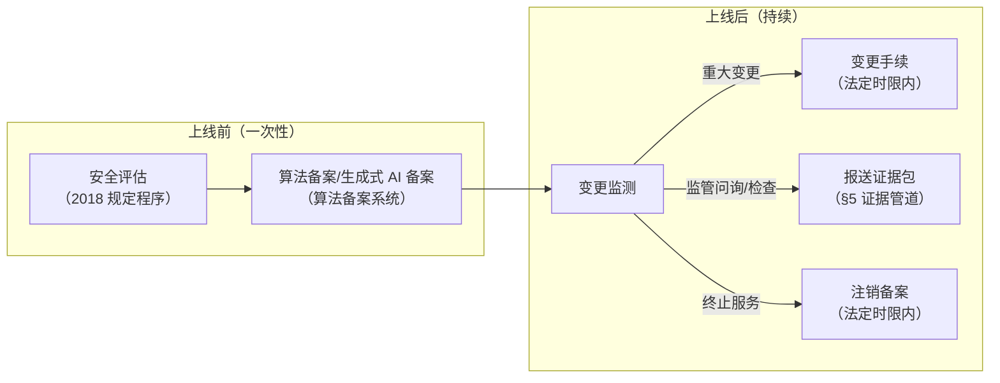
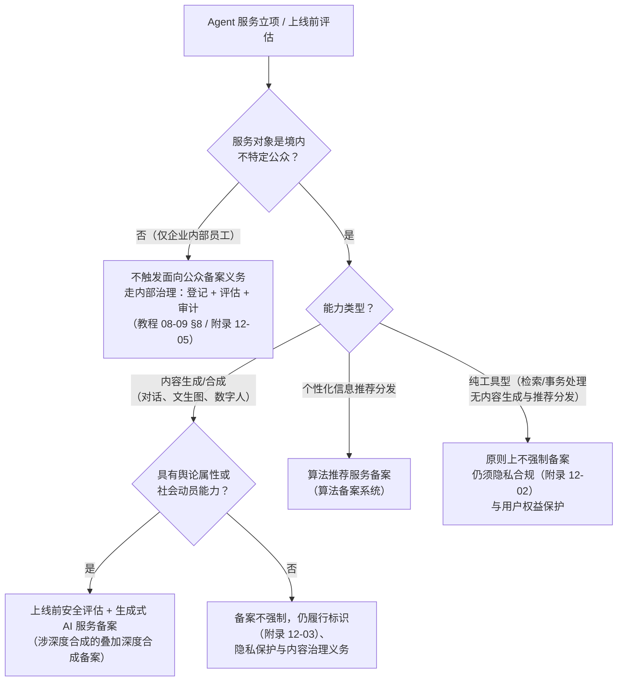
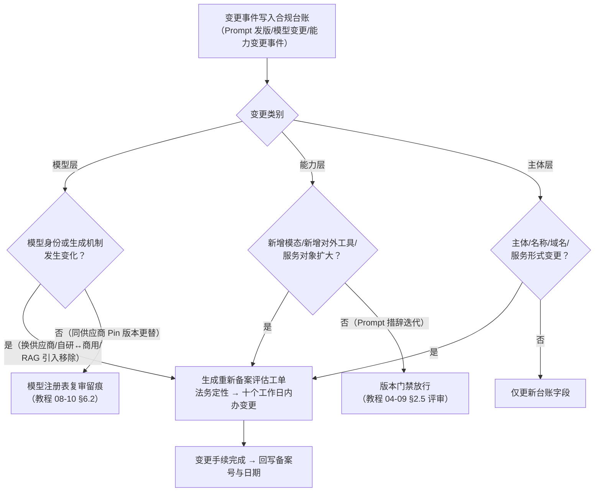

# 算法备案与监管报送运营

「本文是对 [教程 08-架构师进阶/09-Agent治理与合规框架 §8] 中"上线治理检查清单"合规项的运营流程展开」

> **定位**：教程篇把"备案、安全评估、材料齐备"作为上线检查清单里的**检查项**带过（[教程 08-架构师进阶/09-Agent治理与合规框架 §8]）；本文把这些检查项展开成**可持续运营的流程**——哪些 Agent 服务触发备案、备案材料如何从工程系统里"长"出来、什么变更触发重新备案、监管报送如何用审计日志自动汇编证据、以及与欧盟 AI Act 的义务对照。读者画像：负责 Agent 产品合规上线与属地监管对接的后端/平台架构师、合规工程师；已读过治理框架教程。前置阅读：[教程 08-架构师进阶/09-Agent治理与合规框架]（§6 审计日志、§8 检查清单——本文的材料管道消费它的审计能力）、[附录 12-AI治理与合规/03-AIGC内容标识与数字水印]（同源法规族下的标识义务，与备案是两件事）。
>
> 技术栈：Spring Boot 4.1 + Spring AI 2.0.0 + WebFlux + Java 21

---

## 一、备案是"登记 + 持续合规"的活状态，不是一次性申报

工程师对备案最常见的误解是把它当成"上线前填一次表格"。实际运营中，备案更像软件的**注册表 + 持续集成**：拿到备案号只是把服务登记进了监管视野，此后每一次重大变更都有法定的办理时限，监管问询时要在时限内拿得出与备案材料对应的运行证据。而 Agent 恰恰是变更最频繁的一类服务——模型版本静默漂移、Prompt 每周发版、工具热插拔、RAG 语料随时扩充——"这次变更算不算重大变更、要不要办变更手续"会成为高频运营决策，没有流程和台账根本接不住。

中国的备案义务由一组法规族构成，Agent 架构师需要知道每一部管什么：

| 法规 | 施行时间 | 管什么 | 与 Agent 服务的关系 |
|------|---------|--------|---------------------|
| 《互联网信息服务算法推荐管理规定》 | 2022-03-01 | 算法推荐服务的备案、变更、注销备案 | 具有舆论属性或社会动员能力的推荐类服务 |
| 《互联网信息服务深度合成管理规定》 | 2023-01-10 | 深度合成服务的备案与内容标识 | 文生图、语音克隆、数字人类 Agent |
| 《生成式人工智能服务管理暂行办法》 | 2023-08-15 | 生成式 AI 服务的安全评估 + 算法备案 | 面向公众的对话、内容生成类 Agent |
| 《具有舆论属性或社会动员能力的互联网信息服务安全评估规定》 | 2018-11-30 | 上线前的安全评估程序 | 备案动作的前置环节 |

四部法规共用"**舆论属性或社会动员能力**"这个判定轴，也共用同一个互联网信息服务算法备案系统。对 Agent 产品来说，合规上线通常是"**安全评估 + 备案登记**"两个动作的组合，而且《生成式人工智能服务管理暂行办法》第十七条把两者显式绑定：提供具有舆论属性或者社会动员能力的生成式人工智能服务的，应当按照国家有关规定开展安全评估，并按照《互联网信息服务算法推荐管理规定》履行算法备案和变更、注销备案手续。



> 想深入标识义务（显式标识与隐式水印）？那是同一法规族下的另一条强制义务，见 [附录 12-AI治理与合规/03-AIGC内容标识与数字水印]——本文不重复。

## 二、义务边界：哪些 Agent 服务触发备案

### 2.1 三个判定轴

是否触发备案，按三个轴依次判定：

**轴一：服务对象**。面向境内不特定公众提供服务（公网 App、网站、小程序、开放 API），还是仅在企业内部供员工使用。备案义务针对的是面向公众的信息服务；纯内部工具不触发面向公众的备案义务（但见 §2.4，不触发 ≠ 不管）。

**轴二：能力类型**。服务是否包含内容生成/合成（文本、图像、音频、视频）、个性化信息推荐分发、拟真场景（数字人、语音克隆）。生成合成类走生成式 AI 与深度合成路径，推荐分发类走算法推荐路径，两者可能叠加。

**轴三：舆论属性或社会动员能力**。即服务生成或分发的内容是否可能影响社会舆论、动员社会行为——新闻资讯、社交、评论互动、面向不特定众的公开内容发布，通常被认定具有；企业内部知识问答、单一客户私有化部署，通常不具有。这是四个判定中最依赖业务判断的一个，最终以属地网信部门的沟通口径为准。



### 2.2 服务提供者 vs 技术支持者：角色判别

法规族区分**服务提供者**（以自己的名义面向公众提供服务的主体，承担备案与内容治理主责）与**技术支持者**（为他人提供算法、模型等技术支持、自身不面向公众提供服务的主体，承担技术侧的配合义务）。Agent 产业链上这个划分有清晰的工程对应：

| 场景 | 谁是服务提供者 | 谁是技术支持者 | 备案义务落点 |
|------|---------------|---------------|-------------|
| 自研模型 + 自建面向公众 Agent 应用 | 自己 | 无 | 自己完整履行安全评估 + 备案 |
| 用第三方大模型 API 自建面向公众 Agent 应用 | 自己（应用方） | 模型厂商 | 应用方以自己名义备案；选用已备案模型并在材料中说明 |
| B2B SaaS：向企业客户输出 Agent 能力，客户面向公众使用 | 客户企业 | SaaS 厂商 | 客户以自己名义备案；SaaS 厂商提供技术文档配合，责任边界写进合同 |
| 模型厂商公开发布面向公众的模型服务 | 模型厂商 | 无 | 厂商就模型服务本身备案 |

B2B 场景是 Agent 架构师最容易踩边界的地方：**你的客户才是服务提供者，你的产品是它的技术支持**。这意味着工程上要主动配合客户的备案，把客户备案所需的信息做成可交付物——模型来源与版本说明、语料与数据流说明、内容安全措施说明、审计日志导出接口（[教程 04-企业级架构主干/05-历史记录持久化与合规 §4] 的审计日志规范在这里直接变成交付物）。缺这些，客户过不了备案，你的合同也就悬了。

### 2.3 不触发备案 ≠ 不管

内部工具和纯工具型服务不触发备案，但治理义务一条不少：数据出境与个人隐私处理走 [附录 12-AI治理与合规/02-数据隐私与偏见检测] 的框架；内部上线的治理检查与资产登记走 [教程 08-架构师进阶/09-Agent治理与合规框架 §8] 与 [附录 12-AI治理与合规/05-Agent资产清单与影子治理]。备案只是监管合规的子集，不是合规本身。

## 三、备案材料清单与证据地图

### 3.1 材料清单

实践中（以属地网信部门与算法备案系统的受理要求为准）两类备案的材料高度重叠，可复用大部分证据：

| 材料项 | 算法推荐服务备案 | 生成式 AI 服务备案 |
|--------|:---:|:---:|
| 主体信息（营业执照、负责人、安全责任人） | ✔ | ✔ |
| 算法基本原理与运行机制说明 | ✔ | ✔ |
| 算法安全自评估报告 | ✔ | ✔ |
| 拟公示内容（算法基本原理摘要） | ✔ | — |
| 产品及功能信息（服务形式、访问方式、应用领域） | ✔ | ✔ |
| 语料/训练数据来源合规声明 | — | ✔ |
| 安全评估报告（2018 规定程序） | ✔ | ✔ |
| 内容安全管理制度、投诉举报处理机制文件 | ✔ | ✔ |
| 模型安全评估（语料抽检、生成内容测试、题库测试，参照 TC260《生成式人工智能服务安全基本要求》） | — | ✔ |
| 拟提供的生成内容标识能力说明 | — | ✔（标识义务见附录 12-03） |

### 3.2 材料项 → 工程证据源映射

这是本文的核心增量：**每份备案材料都不是从零写的文档，而是工程系统已有数据的汇编**。把映射表建成台账，报送季就不是"全员写材料"，而是"跑一次汇编 + 人工审核"：

| 材料章节 | 工程证据源 | 系统锚点 |
|---------|-----------|---------|
| 算法基本原理与机制 | 架构文档 + 数据流图（ADR 沉淀） | [附录 07-架构决策方法论/00-ADR架构决策记录] |
| 数据来源与语料合规 | 语料清单 + 数据卡片（来源、授权、清洗记录） | [附录 12-AI治理与合规/01-模型卡片与数据卡片] |
| 安全评估-内容安全 | 护栏拦截率、内容审核记录、护栏测试报告 | [教程 04-企业级架构主干/14-输入输出护栏与内容审核]、[附录 08-Agent安全深度] |
| 安全评估-模型效果与偏见 | 评估集报告、分组公平性指标 | [教程 08-架构师进阶/03-自我反思与Agent评估]、[附录 12-AI治理与合规/02-数据隐私与偏见检测] |
| 安全评估-模型与版本管理 | 模型注册表（版本、Pin、复审记录） | [教程 08-架构师进阶/10-多模型协作与供应策略 §6.2] |
| 用户权益保护 | 投诉工单记录、用户权利响应记录（导出/删除） | [教程 08-架构师进阶/09-Agent治理与合规框架 §4.6] |
| 运行机制证据（抽查应对） | 审计日志（每次调用的模型、工具、Prompt 指纹、结果） | [教程 04-企业级架构主干/05-历史记录持久化与合规 §4] |
| 生成内容标识能力 | 标识 Advisor 实现与水印验证记录 | [附录 12-AI治理与合规/03-AIGC内容标识与数字水印] |
| 应急处置能力 | 事件分级与响应演练记录 | [教程 08-架构师进阶/09-Agent治理与合规框架 §8.3] |

> **与教程的分工**：教程 08-09 的 §8 告诉你"上线前要备齐这些**检查项**"；本文这张映射表告诉你每个检查项的**证据从哪个系统拉、以什么格式汇编**——是检查项背后的材料生产线。

## 四、变更管理与重新备案触发

### 4.1 法定时限

《互联网信息服务算法推荐管理规定》给出三个硬时限（第二十四条、第二十五条）：

- **首次备案**：具有舆论属性或者社会动员能力的算法推荐服务提供者，应当在提供服务之日起**十个工作日内**履行备案手续；
- **变更手续**：备案信息发生变更的，应当在变更之日起**十个工作日内**办理变更手续；
- **注销备案**：终止服务的，应当在终止服务之日起**二十个工作日内**办理注销备案手续。

生成式 AI 服务备案沿用同一套时限逻辑（暂行办法第十七条转致算法推荐规定）。工程上把这三个时限变成台账里的**工单 SLA**，而不是法务脑中的记忆。

### 4.2 Agent 变更判据矩阵

难点在"什么算备案信息变更"。Agent 的日常变更粒度远细于监管语言的粒度，需要一个判据矩阵把工程事件翻译成合规事件：

| 工程变更事件 | 合规定性 | 动作 |
|-------------|---------|------|
| 更换模型供应商 / 自研↔商用切换 | 算法机制重大变更 | 触发重新备案评估工单，法务判定后办理变更 |
| RAG 管线引入/移除、Agent 编排模式重构 | 算法机制变更（影响生成机制） | 同上，从严判定 |
| 同供应商模型 Pin 版本更替 | 不直接触发；触发内部复审 | 模型注册表复审流程（[教程 08-架构师进阶/10-多模型协作与供应策略 §6.2]），留痕备查 |
| System Prompt 措辞优化（同评审门禁） | 不触发 | Prompt 版本门禁放行（[教程 04-企业级架构主干/09-灰度发布与版本管理 §2.5]） |
| 新增生成模态（文本 → 图像/语音） | 服务形式/能力变更 | 触发重新备案评估工单（可能叠加深度合成备案） |
| 新增面向公众的对外工具/开放 API | 服务形式变更 | 触发评估工单 |
| 服务对象从内部扩大到公众 | 从"不触发"变为"触发" | 补做安全评估 + 首次备案 |
| 主体名称、域名、访问方式变更 | 备案信息变更 | 十个工作日内办变更手续 |
| 服务终止/下线 | 注销义务 | **二十个工作日内注销**——与下线流程联动（[附录 12-AI治理与合规/05-Agent资产清单与影子治理 §6]） |

### 4.3 变更决策流程



### 4.4 变更事件的工程捕获

判据矩阵要自动运转，前提是**变更事件能自动进台账**。工程上三类事件源已经在本体系存在：Prompt 发版事件（版本门禁的评审合并事件，[教程 04-企业级架构主干/09-灰度发布与版本管理 §2.5]）、模型变更事件（模型注册表变更记录，[教程 08-架构师进阶/10-多模型协作与供应策略 §6.2]）、能力发布事件（部署门禁的新版本登记，[附录 12-AI治理与合规/05-Agent资产清单与影子治理 §4]）。给台账加一个 `ComplianceLedgerService`，订阅这三类事件、按 §4.2 判据矩阵打标、满足触发条件的自动开评估工单——变更合规从"季度人工盘点"变成"事件驱动的流水线"。

## 五、监管报送运营：从审计日志到报送材料的自动化管道

### 5.1 报送节奏

| 报送动作 | 触发 | 材料来源 |
|---------|------|---------|
| 首次备案 | 服务上线之日起十个工作日内 | §3.1 清单首次汇编 |
| 变更手续 | §4 判据触发 | 上次报送材料 + 增量变更说明 |
| 注销备案 | 服务终止之日起二十个工作日内 | 下线证据包（附录 12-05 §6） |
| 监管问询/专项检查 | 随时 | §5.2 证据管道按需出报告 |
| 年度/定期自评估（属地管理实践） | 建议按季度自评、年度汇总 | 同上 |

监管对备案后的服务有持续的监督检查权，问询时通常给的材料窗口以"天"计——证据管道的价值就在把"天"压缩成"小时"。

### 5.2 证据汇编管道

```mermaid
flowchart LR
    subgraph SRC["证据源系统（机器自动拉取）"]
        AUDIT["审计日志库<br/>（教程 04-05 §4）"]
        EVALR["评估报告库<br/>（教程 08-03）"]
        INC["事件与响应记录<br/>（教程 08-09 §8.3）"]
        REDT["护栏与红队测试报告<br/>（附录 08）"]
        TOK["Token 计量与成本台账<br/>（教程 04-07）"]
    end
    subgraph ASM["ReportingAssembler 汇编服务"]
        EXTRACT["按报告模板章节<br/>抽取/统计/生成附录"]
        DRAFT["Markdown 报告草稿<br/>每节附证据链回链"]
    end
    subgraph HUMAN["人工闭环（结论责任不可外包）"]
        REVIEW["合规负责人审核定性结论"]
        SIGN["安全责任人签字"]
    end
    SUBMIT["监管系统提交/属地报送"] --> ARCH["回执归档进合规台账<br/>（下次报送的基线）"]
    SRC --> ASM --> HUMAN --> SUBMIT
```



### 5.3 汇编服务的工程实现

汇编服务消费的都是本体系已有的查询能力（审计查询 [教程 08-架构师进阶/09-Agent治理与合规框架 §6.3]、评估报告 [教程 08-架构师进阶/03-自我反思与Agent评估]、事件记录 §8.3），本身是纯 Java 装配逻辑。以下为概念代码（接口为自建服务契约，真实工程中对应审计/评估/事件三个库的查询服务）：

```java
// 概念代码：依赖的三个查询接口对应本体系已有的审计/评估/事件查询服务
public record ReportingPeriod(LocalDate from, LocalDate to) {}

public interface AuditEvidenceQuery {          // ← 教程 04-05 §4 审计日志的查询面
    long totalCalls(ReportingPeriod period);
    long blockedByGuardrail(ReportingPeriod period);   // 护栏拦截量（教程 04-14）
}

public interface EvaluationEvidenceQuery {     // ← 教程 08-03 评估报告的查询面
    List<EvalReportSummary> latestReports(ReportingPeriod period);
}

public interface IncidentEvidenceQuery {       // ← 教程 08-09 §8.3 事件记录的查询面
    List<IncidentSummary> incidents(ReportingPeriod period);
}
```

```java
// 概念代码：按"自评估报告"模板章节汇编证据，产出人工审核用的草稿
@Component
public class ReportingAssembler {

    private final AuditEvidenceQuery audit;
    private final EvaluationEvidenceQuery evaluation;
    private final IncidentEvidenceQuery incident;

    public ReportingAssembler(AuditEvidenceQuery audit,
                              EvaluationEvidenceQuery evaluation,
                              IncidentEvidenceQuery incident) {
        this.audit = audit;
        this.evaluation = evaluation;
        this.incident = incident;
    }

    /** 生成报告草稿：机器负责"证据齐全 + 数字准确"，人负责"结论与签字" */
    public String assembleSelfAssessmentDraft(ReportingPeriod period) {
        var sb = new StringBuilder();
        sb.append("# 算法安全自评估报告（草稿）\n\n");
        sb.append("## 一、服务运行概况（自动汇编）\n");
        sb.append("- 报告期：").append(period.from()).append(" 至 ").append(period.to()).append("\n");
        sb.append("- 服务调用总量：").append(audit.totalCalls(period)).append("\n");
        sb.append("- 护栏拦截次数：").append(audit.blockedByGuardrail(period)).append("\n");
        sb.append("## 二、模型安全评估（自动汇编 + 人工结论）\n");
        evaluation.latestReports(period).forEach(r ->
            sb.append("- 评估集 ").append(r.name())
              .append("：通过率 ").append(r.passRate())
              .append("（证据链：").append(r.reportRef()).append("）\n"));
        sb.append("_结论定性由合规负责人填写_\n");
        sb.append("## 三、事件与处置（自动汇编）\n");
        incident.incidents(period).forEach(i ->
            sb.append("- ").append(i.level()).append(" 级事件 ")
              .append(i.id()).append("：").append(i.containment())
              .append("（证据链：").append(i.timelineRef()).append("）\n"));
        sb.append("## 四、语料与数据来源合规声明\n");
        sb.append("_引用数据卡片汇编，见附录 12-01；声明文本由法务审核_\n");
        return sb.toString();
    }
}
```

### 5.4 机器汇编与人工签字的边界

管道有一条不可退让的边界：**机器汇编证据，人签字负结论**。自评估报告里"拦截率是多少、跑过哪些评估集、发生过几起事件"是事实性数据，机器汇总零差错；但"本服务是否具有舆论属性、风险是否可控、是否具备持续合规能力"是判断性结论，签字人要为它承担法律责任。草稿里凡是结论性段落一律留白并标注"由合规负责人填写"，防止"报告是系统生成的所以系统负责"的责任幻觉。同时每个数字都带**证据链回链**（指向审计原始记录），监管复核抽查时可以逐级下钻到单次调用——这正是 [教程 04-企业级架构主干/05-历史记录持久化与合规 §4] 审计日志字段规范在报送场景的回报。

## 六、与欧盟 AI Act 的分类风险对照

同一套 Agent 服务出海欧盟时，义务模型完全不同：中国是**特定服务事前登记 + 持续配合监督**，欧盟 AI Act（Regulation (EU) 2024/1689）是**全量服务自我风险分级 + 按等级履行义务包**。框架层面的分级思想（不可接受/高/有限/最小风险）与治理运营框架见 [附录 12-AI治理与合规/00-NIST-AI-RMF框架]，此处只给运营者视角的对照：

| 维度 | 中国备案制 | 欧盟 AI Act |
|------|-----------|-------------|
| 触发逻辑 | 面向公众 + 舆论属性/社会动员能力 → 事前登记 | 按用途自动归入风险等级，高风险用途触发义务包 |
| 核心动作 | 安全评估 + 备案系统登记 + 变更/注销时限 | 符合性评估、技术文档、日志留存、人工监督、透明度义务 |
| 角色划分 | 服务提供者 / 技术支持者 | 提供者（provider）/ 部署者（deployer）——Agent 团队常两头都占 |
| 生成内容义务 | 标识办法双标识（附录 12-03） | 第 50 条透明度：披露 AI 生成、标识深度伪造内容 |
| 处罚量级 | 下架、罚款等行政处置 | 最高 3500 万欧元或全球营业额 7%（禁止性违规档） |
| 对工程证据的要求 | 问询时能出与备案材料一致的运行证据 | 高风险系统要求自动记录日志（logs），能追溯每次使用 |

运营启示：**一套证据体系，双报告输出**。§5.2 的证据源（审计、评估、事件、卡片）同时是欧盟技术文档与日志义务的支撑——按合规域拆模板，而不是按监管建两套数据管道。

## 七、适用场景与不适用场景

**适用场景**：

- 面向境内公众提供内容生成、推荐分发类 Agent 服务，需要判定备案义务并落地首次备案
- 已备案 Agent 的持续变更治理（判据矩阵 + 变更工单 + 时限管理）
- 属地监管问询、专项检查、年度自评估的常态化报送
- B2B Agent 厂商为客户提供备案配合材料与审计证据接口
- 出海欧盟场景需要将同一套证据体系映射为 AI Act 义务文档

**不适用场景**：

- 纯企业内部工具（不触发面向公众备案义务，走内部治理与资产登记，见附录 12-05）
- 完全私有化部署给单一客户、客户自担服务提供者责任的交付（你作为技术支持者的配合义务仍在，但本文的备案运营流程由客户执行）
- 尚在离线评估阶段、未对任何真实用户提供服务的实验原型（备案前移会拖死迭代；上线闸门处再触发本流程）

## 八、总结

| 要点 | 一句话 |
|------|--------|
| 备案是活状态 | 登记 + 变更时限 + 注销时限 + 持续配合监督，不是一次性申报 |
| 三个判定轴 | 服务对象（公众？）× 能力类型（生成/推荐？）× 舆论属性——决定走哪条备案路径 |
| 提供者 vs 技术支持者 | 谁面向公众谁备案；B2B 厂商的备案配合材料是交付物 |
| 材料是汇编不是创作 | 每份材料章节映射到工程证据源：审计、评估、事件、卡片、注册表 |
| 变更判据矩阵 | 把工程变更事件（换模型/加模态/扩对象）翻译成合规事件与工单 SLA |
| 证据管道 | 机器汇编事实 + 人工签字结论 + 证据链回链，问询窗口从"天"压到"小时" |
| 欧盟对照 | 中国事前登记制 vs 欧盟风险自分级制；一套证据体系双报告输出 |

备案运营的落点回到两个工程设施：**合规台账**（变更事件、备案号、时限工单的单一事实源）与**证据管道**（§5.2 的汇编服务）。台账里每个 Agent 的备案状态字段，正是 [附录 12-AI治理与合规/05-Agent资产清单与影子治理] 资产清单的一列——下线注销备案的义务也在那一篇的下线流程中联动执行。

---

## 参考来源

- 《互联网信息服务算法推荐管理规定》全文（中国政府网）：https://www.gov.cn/zhengce/zhengceku/2022-01/05/content_5666260.htm
- 《生成式人工智能服务管理暂行办法》发布（中国网信网）：http://www.cac.gov.cn/2023-07/13/c_1690898326795531.htm
- 《互联网信息服务深度合成管理规定》全文（司法部官网）：https://www.moj.gov.cn/pub/sfbgw/flfggz/flfggzbmgz/202307/t20230705_482071.html
- 《具有舆论属性或社会动员能力的互联网信息服务安全评估规定》（中国网信网）：http://www.cac.gov.cn/2018-11/30/c_1123796111.htm
- 互联网信息服务算法备案系统：https://beian.cac.gov.cn
- 全国网络安全标准化技术委员会（TC260）《生成式人工智能服务安全基本要求》：https://www.tc260.org.cn
- Regulation (EU) 2024/1689 (AI Act) 官方文本（EUR-Lex）：https://eur-lex.europa.eu/eli/reg/2024/1689/oj
