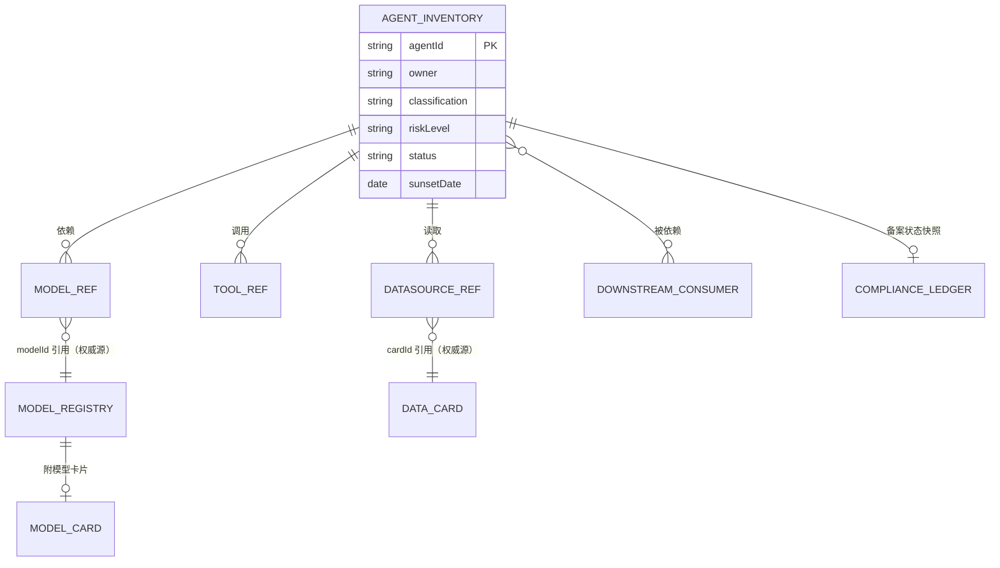
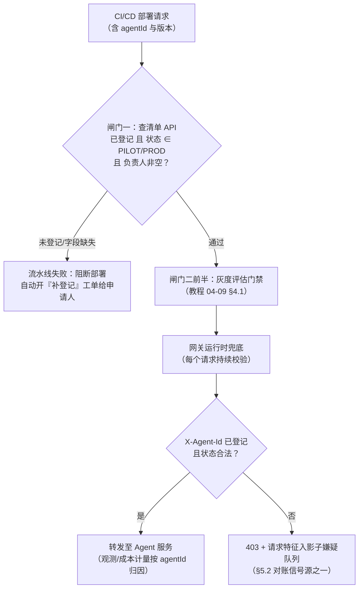
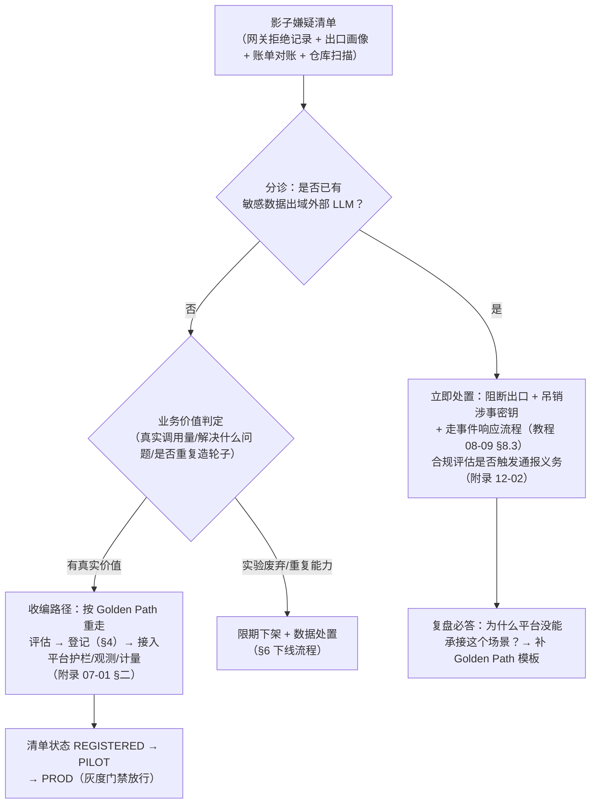
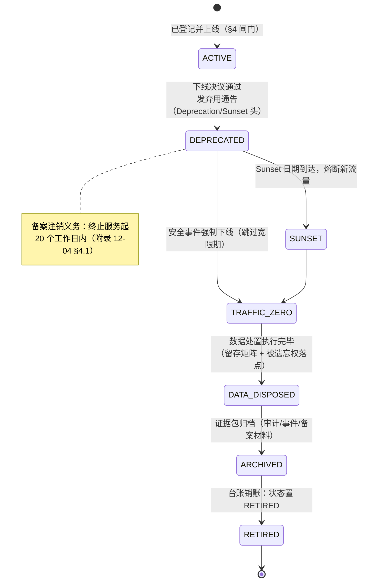

# Agent 资产清单与影子治理

「本文是对 [附录 07-架构决策方法论/01-平台工程与组织采纳] 开篇"影子 Agent"问题的治理展开，也是 [教程 08-架构师进阶/09-Agent治理与合规框架 §8] 上线检查清单中"资产登记"项的下钻」

> **定位**：教程 08-09 把"资产登记"作为上线治理检查清单的一个检查项带过；附录 07-01 指出了不做登记的后果（团队绕过平台裸调 LLM API——失控的影子成本 + 数据合规的雷）。本文把这两个钩子展开成完整的治理设施：**登记什么**（Agent 资产清单的数据模型）、**何时登记**（未登记不部署的上线闸门）、**怎么发现漏网的**（影子 Agent 的出口画像与收编决策）、以及全体系此前零覆盖的 **Agent 下线退役全流程**。读者画像：Agent 平台团队工程师、负责治理台账与合规对接的架构师。前置阅读：[附录 07-架构决策方法论/01-平台工程与组织采纳]（Golden Path 与采纳率即安全边界的动机）、[教程 08-架构师进阶/10-多模型协作与供应策略 §6.2]（模型注册表——本文清单中"模型"列的权威源）。
>
> 技术栈：Spring Boot 4.1 + Spring AI 2.0.0 + WebFlux + Java 21

---

## 一、为什么 Agent 需要一张"活"的资产清单

传统 CMDB 登记服务器、中间件、应用——这些资产的属性以月为单位变化，季度盘点能追上。Agent 资产的衰减速度完全不同：模型版本会被供应商静默更新（[教程 04-企业级架构主干/09-灰度发布与版本管理 §3.4] 模型漂移）、Prompt 每周发版、工具热插拔、RAG 语料持续扩充。一张"上线时填一次"的静态台账，在第一次 Prompt 发版后就开始说谎，三个月后就是废纸。

所以 Agent 资产清单（Agent Inventory）必须是**运行时数据**而非归档文档——它被三个治理设施在运行中反复消费：

| 消费方 | 怎么用 | 对应章节 |
|--------|--------|---------|
| 上线闸门 | 部署前查询：未登记的应用不许进生产 | §4 |
| 影子识别 | 对账：网关有流量、清单无记录 = 影子嫌疑 | §5 |
| 下线退役 | 反查：谁依赖这个 Agent、它占着哪些数据 | §6 |

判断一张清单是不是"活的"，就看它有没有至少一个**自动化消费方**。只有审计时才被打开的清单，注定过期。

## 二、登记什么：清单的数据模型

一个 Agent 应用在清单中的完整档案：

| 字段组 | 字段 | 说明与权威源 |
|--------|------|-------------|
| 身份 | `agentId`、名称、描述 | 全局唯一 ID，网关/观测/清单三处同键 |
| 责任 | 负责人（个人 + 团队）、值班渠道 | **无负责人的 Agent 不许上线**——事故时找不到人等于没有治理 |
| 分级 | 业务密级、风险等级 | 风险分级沿用 [教程 08-架构师进阶/09-Agent治理与合规框架 §2.3] 的四级 |
| 模型 | 依赖模型列表（`modelId` + Pin 版本 + 快照） | 引用**模型注册表**（[教程 08-架构师进阶/10-多模型协作与供应策略 §6.2]），不复制字段 |
| Prompt | 当前 Prompt 版本、发版通道 | 引用版本库，版本门禁（[教程 04-企业级架构主干/09-灰度发布与版本管理 §2.5]） |
| 工具 | 工具清单 + 权限分级声明 | 沿用工具权限分级（[教程 10-调优实战与方法论/04-工具调优下：执行与治理]） |
| 数据 | 数据源列表 + 数据卡片引用 | 引用 Data Card（[附录 12-AI治理与合规/01-模型卡片与数据卡片]） |
| 合规 | 备案状态、安全评估状态、审计留存策略 | 备案状态与流程见 [附录 12-AI治理与合规/04-算法备案与监管报送运营] |
| 拓扑 | 下游依赖（被哪些服务调用）、上游依赖 | 下线反查的关键（§6.2） |
| 生命周期 | 状态（`REGISTERED/PILOT/PROD/DEPRECATED/RETIRED`）、sunset 日期 | 状态机见 §6 |

Java 侧用不可变 record 建模档案、用枚举锁状态（以下为概念代码，存储实现自选——关系库或 `ReactiveRedisTemplate` 均可）：

```java
// 概念代码：Agent 资产档案（不可变 record + 状态枚举）
public record AgentInventoryRecord(
    String agentId,
    String name,
    Owner owner,                    // 个人 + 团队 + 值班渠道
    DataClassification classification,   // 业务密级
    RiskLevel riskLevel,            // 沿用教程 08-09 §2.3 四级
    List<ModelRef> models,          // modelId + pinVersion，权威源是模型注册表
    String promptVersionRef,        // Prompt 版本库引用
    List<ToolRef> tools,            // 工具 + 权限分级
    List<DataSourceRef> dataSources,// cardId 引用数据卡片
    ComplianceStatus compliance,    // 备案/评估状态（附录 12-04）
    List<String> downstreamConsumers, // 下游依赖方 agentId/服务名
    LifecycleStatus status,
    Optional<LocalDate> sunsetDate
) {}

public enum LifecycleStatus { REGISTERED, PILOT, PROD, DEPRECATED, RETIRED }
```

## 三、清单是索引，不是复制品：与模型注册表、数据卡片的关系

清单最容易犯的设计错误是把模型、数据、Prompt 的属性**复制**进自己——三个月后同一字段在两处不一致，没人知道哪个是真的。正确关系是**单一权威源 + 引用**：

- **模型注册表**（[教程 08-架构师进阶/10-多模型协作与供应策略 §6.2]）是"模型"字段的权威源：模型的供应商、准许数据密级、评测基线、复审周期都活在注册表里；清单只存 `modelId` 引用。"下架一个模型"仍然是改注册表一处，清单的消费方顺着引用自然拿到最新事实。
- **数据卡片**（[附录 12-AI治理与合规/01-模型卡片与数据卡片]）是数据源的权威源；清单存 `cardId`。删除请求（被遗忘权）执行时按卡片清点数据落点（[教程 08-架构师进阶/09-Agent治理与合规框架 §4.6]）。
- **合规台账**（备案状态，[附录 12-AI治理与合规/04-算法备案与监管报送运营]）是备案信息的权威源；清单存状态快照。

清单页本身是**一跳索引**：从 `agentId` 一跳到模型注册表、数据卡片、ADR、备案台账，拿到这个 Agent 的全部治理事实。



## 四、注册时机：上线闸门（未登记不部署）

登记不能靠自觉，要卡在**部署路径的物理闸门**上。双闸门设计：

**闸门一：CI/CD 流水线**。部署流水线的生产阶段前置一个登记校验步骤，查清单 API：`agentId` 已登记、状态合法（`PILOT/PROD`）、负责人字段非空——任一不满足则流水线失败，并自动给申请人开"补登记"工单。这道闸门与灰度发布的第一道门禁（[教程 04-企业级架构主干/09-灰度发布与版本管理 §4.1]）串成两步：先证明"你是谁、谁负责"，再证明"你够好"（评估门禁）。

**闸门二：网关运行时兜底**。流水线可以被绕过（手动发布、脚本直发），网关不能。网关校验每个进入 Agent 路由的请求携带 `X-Agent-Id`，且该 ID 在清单中状态合法——未登记的 ID 直接 403，同时把请求特征记入影子嫌疑队列（§5）。运行时兜底保证了"未登记不部署"在有人在场的流程之外依然成立。



网关侧的兜底过滤器（`WebFilter`，Spring Boot 4.1 WebFlux 标准 API）：

```java
// 概念代码：网关运行时兜底——未登记的 agentId 不许通过
@Component
public class RegistrationGateFilter implements WebFilter {

    private final InventoryQuery inventory;   // 清单查询服务（§2 数据模型）
    private final ShadowSignalQueue shadow;   // 影子嫌疑队列（§5.2）

    public RegistrationGateFilter(InventoryQuery inventory, ShadowSignalQueue shadow) {
        this.inventory = inventory;
        this.shadow = shadow;
    }

    @Override
    public Mono<Void> filter(ServerWebExchange exchange, WebFilterChain chain) {
        var agentId = exchange.getRequest().getHeaders().getFirst("X-Agent-Id");
        if (agentId == null || agentId.isBlank()) {
            return reject(exchange, agentId, "missing-agent-id");
        }
        return inventory.findLifecycleStatus(agentId)
            .flatMap(status -> LifecycleStatus.USABLE.test(status)
                ? chain.filter(exchange)
                : reject(exchange, agentId, "illegal-status:" + status))
            .switchIfEmpty(reject(exchange, agentId, "not-registered"));
    }

    private Mono<Void> reject(ServerWebExchange exchange, String agentId, String reason) {
        shadow.record(exchange.getRequest().getPath().value(), agentId, reason);
        exchange.getResponse().setStatusCode(HttpStatus.FORBIDDEN);
        return exchange.getResponse().setComplete();
    }
}
```

## 五、影子 Agent 治理：发现与收编

### 5.1 影子的四种形态

[附录 07-架构决策方法论/01-平台工程与组织采纳] 开篇指出了影子 Agent 的动因：裸调永远比接平台省事。落到企业里是四种形态，危害递增：

1. **内部脚本裸调**：数据分析脚本、自动化任务里直接写死 LLM API 调用——最常见的影子，往往当事人不认为自己在"做 Agent"；
2. **自建 Agent 绕过平台**：团队觉得平台模板限制多，自己拼 ChatClient + 记忆 + 工具，护栏与审计全缺失；
3. **借用密钥**：用别人的（甚至已离职员工的）API Key 调用，成本与责任都无法归因；
4. **"实验"赖在生产**：打着实验旗号上线、从未登记，跑着真实用户流量。

### 5.2 发现：出口画像与四方对账

影子 Agent 不在清单里，所以只能从**它必然留下的外部痕迹**反推。四个信号源，互相印证：

| 信号源 | 判据 | 置信度 |
|--------|------|:---:|
| 出口代理/DNS 日志 | 出站流量命中外部 LLM API 域名（api.openai.com、api.deepseek.com 等）且源服务不在清单内 | 高 |
| API 账单对账 | 供应商账单/计费台账与清单内 Agent 的计量数据（[教程 04-企业级架构主干/07-成本治理与Token计量]）对不齐，差额对应未知消费方 | 高 |
| 代码仓库扫描 | 依赖中出现 LLM SDK、配置/环境变量中出现 API Key（配合密钥托管策略，[教程 04-企业级架构主干/11-安全与权限控制]） | 中 |
| 网关对账 | 网关有 `X-Agent-Id` 未登记的请求、或流量存在但清单无对应记录（§4 闸门的拒绝记录） | 中 |

出口画像是四者中唯一不依赖"对方写代码"的信号——只要请求从公司网络出去，代理日志里就有。画像服务解析代理日志、按已知 LLM 服务商域名分类、与清单对账（概念代码）：

```java
// 概念代码：出口画像——代理日志 → 影子嫌疑清单
@Component
public class EgressAuditService {

    private static final Set<String> LLM_API_HOSTS = Set.of(
        "api.openai.com", "api.deepseek.com", "generativelanguage.googleapis.com");

    private final InventoryQuery inventory;     // 清单内的合法消费方
    private final ShadowSignalQueue shadow;     // 嫌疑清单（§4 网关队列同一处）

    public EgressAuditService(InventoryQuery inventory, ShadowSignalQueue shadow) {
        this.inventory = inventory;
        this.shadow = shadow;
    }

    /** line 为出口代理日志的一行：src=服务标识 host=目标域名 bytes=流量 */
    public void inspect(String line) {
        var src = extractField(line, "src");
        var host = extractField(line, "host");
        if (host != null && LLM_API_HOSTS.contains(host)
                && inventory.findByServiceName(src).isEmpty()) {
            // 源服务不在清单内却直连 LLM API → 影子嫌疑
            shadow.record("egress-proxy", src, "llm-api:" + host);
        }
    }
}
```

### 5.3 收编决策：先分诊风险，再定去留

发现的影子按**数据敏感性**优先分诊，再按业务价值定去留。顺序不能反——先谈价值会把高危影子拖成事故：



两条运营原则比流程本身更重要。其一，**收编优先于惩罚**：影子团队被处罚一次，下一个影子会学会把调用拆散、把流量藏进夜间批次——发现成本指数级上升；收编给路（评估、登记、迁移有平台团队陪跑），影子才会回流到治理视野。其二，**每个影子都是平台的需求信号**（[附录 07-架构决策方法论/01-平台工程与组织采纳] 的采纳度量）：复盘必答"平台为什么没能让这个团队走正门"——是模板缺场景，还是接入文档看不懂，还是登记流程太重。

## 六、Agent 下线退役全流程

### 6.1 为什么下线比上线难

上线有闸门，下线没有流程——这是大多数 Agent 平台的真实状态。后果在监管和工程两侧同时出现：监管侧，备案了的服务终止后不注销，台账与真实世界脱节，下次问询先自证清白（注销时限见 [附录 12-AI治理与合规/04-算法备案与监管报送运营 §4.1]）；工程侧，"删掉部署"不等于下线——上游调用方还在打（重试、缓存、别人的调度脚本）、数据还在留存区占着合规义务、清单里的僵尸条目让对账永远差一笔。

下线退役的本质是**把一个 agentId 在所有治理设施里的存在有序归零**：流量、数据、依赖、台账，缺一不可。

### 6.2 五阶段状态机



**阶段一：下线评估**。从清单反查事实，产出下线评估报告：`downstreamConsumers` 列出谁依赖我（清单的拓扑字段第一次兑现价值）；观测层拉 90 天调用量与调用方分布（[教程 04-企业级架构主干/02-全链路可观测性]），识别清单没登记的暗依赖；数据处置清单预生成——这个 Agent 的会话记忆、向量库 namespace、归档分层、审计日志各占哪些存储、各自的法定留存期还剩多久。

**阶段二：弃用通告与流量归零**。对下游 API 消费方，启用弃用协议：响应头带 `Deprecation` 与 `Sunset` 日期、弃用文档链接（Spring Framework 7.0 的 `StandardApiVersionDeprecationHandler` 原生支持，[教程 04-企业级架构主干/18-API版本管理与产品化 §4.2]）；对 Agent 会话用户，产品内通告 + 迁移指引。宽限期结束后熔断新流量（限流规则摘除路由，[教程 04-企业级架构主干/10-容错与弹性设计]），但**归零的判定不看代码删没删，看观测数据**：调用量为 0 且持续 14 天（窗口覆盖月度批任务），才算 `TRAFFIC_ZERO`。灰度发布层的 sunset 状态（[教程 04-企业级架构主干/09-灰度发布与版本管理 §3.6] 模型下线迁移四步法）在这里逐版本执行。

**阶段三：数据处置**。按预生成清单逐存储执行，且必须**先对账留存义务，再执行删除**：

| 数据落点 | 处置动作 | 约束 |
|---------|---------|------|
| 会话记忆（ChatMemory 持久化） | 删除表分区/键空间 | 逐租户确认，[教程 04-企业级架构主干/05-历史记录持久化与合规 §5] |
| 归档/冷存储 | 未满法定留存期的**先转合规留存区**（只读、单独密钥），到期自动销毁；已满期的直接删除 | 留存矩阵，[教程 04-企业级架构主干/05-历史记录持久化与合规 §6.2] |
| 向量库 | 删除本 Agent 的 namespace/collection | 被遗忘权落点之一：墓碑标记（[教程 08-架构师进阶/09-Agent治理与合规框架 §4.6]） |
| 评估集/微调数据 | 移除本 Agent 产生的样本；引用共享语料的重生成评估集 | 被遗忘权落点之二：评估集重生成 |
| 审计日志 | **不随 Agent 下线删除**——按全站留存策略独立管理；与该 Agent 实体的直接关联断链（映射表销毁） | 被遗忘权落点之三：审计断链；留存与隐私调和同教程 08-09 §6.4 |
| Prompt 版本/工具配置 | 归档进只读版本库（不再可发布） | 供事后回溯与事件复盘 |

**阶段四：归档**。打包下线证据包：弃用通告时间线、流量归零曲线截图（观测导出）、数据处置执行记录、该 Agent 的备案与评估材料（[附录 12-AI治理与合规/04-算法备案与监管报送运营 §5] 的证据管道直接复用出"终版报告"）。证据包是监管问询"服务哪去了、数据怎么处理的"的唯一答案。

**阶段五：台账销账**。清单状态置 `RETIRED`（记录本身保留——按台账留存策略保留数年，供审计与依赖考古）；备案注销在终止服务起二十个工作日内办结（[附录 12-AI治理与合规/04-算法备案与监管报送运营 §4.1]）；工具注册、密钥、配额、路由表中的残留条目全部回收。`RETIRED` 不是删除——**agentId 永不复用**，避免新旧流量在观测与审计里混叠。

### 6.3 退役服务的工程实现

状态推进器把五阶段做成工单流（概念代码）：

```java
// 概念代码：下线状态推进——每步前置校验，不满足则拒绝推进
@Component
public class DecommissionService {

    private final InventoryQuery inventory;
    private final TrafficEvidenceQuery traffic;   // 观测层查询（教程 04-02/04-03）
    private final DataDisposalExecutor disposal;  // §6.2 数据处置执行器

    public DecommissionService(InventoryQuery inventory,
                               TrafficEvidenceQuery traffic,
                               DataDisposalExecutor disposal) {
        this.inventory = inventory;
        this.traffic = traffic;
        this.disposal = disposal;
    }

    /** SUNSET → TRAFFIC_ZERO：归零由观测数据判定，不由人宣布 */
    public Mono<Void> confirmTrafficZero(String agentId, int quietDays) {
        return traffic.hasCallsSince(agentId, Duration.ofDays(quietDays))
            .flatMap(has -> has
                ? Mono.error(new IllegalStateException(
                    "agent " + agentId + " 仍有调用，禁止推进到 TRAFFIC_ZERO"))
                : inventory.transition(agentId,
                    LifecycleStatus.SUNSET, LifecycleStatus.TRAFFIC_ZERO));
    }

    /** TRAFFIC_ZERO → DATA_DISPOSED：按预生成清单执行，输出处置记录进证据包 */
    public Mono<DisposalReport> disposeData(String agentId) {
        return disposal.execute(agentId);   // 内部按 §6.2 矩阵逐存储执行并留痕
    }
}
```

## 七、适用场景与不适用场景

**适用场景**：

- Agent 平台团队建立统一的资产台账与上线闸门（未登记不部署）
- 企业出现裸调 LLM API 的影子成本/合规风险，需要系统化发现与收编
- Agent 服务终止运营：依赖方通知、流量归零、数据处置、备案注销、台账销账的全流程
- 监管问询需要回答"我们有哪些 Agent、谁负责、数据在哪、下线的怎么处理的"
- B2B 交付中客户要求证明供应商侧的 Agent 资产治理能力

**不适用场景**：

- 个人实验、尚未接入任何真实数据的一次性原型（闸门会增加摩擦；进入企业环境或接触真实用户数据那一刻起适用）
- 只有一个 Agent、一个团队的小型项目（清单退化为一张表格即可，网关兜底等设施待规模化后再建）
- 已有成熟 CMDB 且 Agent 变更频率极低的企业（可先在 CMDB 扩展字段，不必新建系统——但"活清单 + 自动消费方"的设计原则不变）

## 八、总结

| 要点 | 一句话 |
|------|--------|
| 活清单 | 资产清单是运行时数据，由闸门/影子识别/下线三个自动化设施消费——只给审计看的清单注定过期 |
| 登记什么 | 身份、负责人、密级、模型（引用注册表）、Prompt 版本、工具、数据源（引用卡片）、备案状态、拓扑、生命周期 |
| 索引不是复制品 | 模型注册表与数据卡片是权威源，清单只存引用——单源原则防字段漂移 |
| 上线闸门 | CI/CD 流水线 + 网关运行时兜底双闸门，未登记不部署 |
| 影子治理 | 出口画像/账单对账/仓库扫描/网关对账四信号发现；先分诊数据敏感性再定收编或下架；收编优先于惩罚 |
| 下线五阶段 | 下线评估 → 弃用通告与流量归零（观测判定）→ 数据处置（留存矩阵 + 被遗忘权三落点）→ 证据归档 → 台账销账 |
| agentId 永不复用 | RETIRED 是状态不是删除，避免观测与审计中的新旧混叠 |

资产清单是治理体系里最不起眼、又最被反复依赖的一张表：上线闸门查它、影子识别对它、监管问询翻它、下线退役靠它反查依赖。它把散落在教程各篇的治理能力（灰度门禁、成本计量、留存策略、备案台账）用 `agentId` 一个键串起来——这也是治理从"每篇各自为战"走向"体系化运营"的那颗钉子。

---

> **想深入？→ [附录 12-AI治理与合规/04-算法备案与监管报送运营]**：清单中"备案状态"列的完整运营流程与注销时限。
> **想深入？→ [教程 08-架构师进阶/09-Agent治理与合规框架 §8]**：上线治理检查清单——本文闸门所守护的检查项全集。
> **想深入？→ [附录 07-架构决策方法论/01-平台工程与组织采纳]**：影子问题的人和组织视角——Golden Path 与采纳度量。

## 参考来源

- [附录 07-架构决策方法论/01-平台工程与组织采纳]——影子 Agent 动机段与 Golden Path 方法论
- [教程 08-架构师进阶/10-多模型协作与供应策略 §6.2]——模型注册表（清单"模型"列的权威源）
- [教程 04-企业级架构主干/09-灰度发布与版本管理]——版本门禁、模型漂移与下线迁移
- [教程 04-企业级架构主干/18-API版本管理与产品化 §4.2]——`Deprecation`/`Sunset` 弃用协议头
- [教程 04-企业级架构主干/05-历史记录持久化与合规 §6.2]——数据留存期限矩阵
- [教程 08-架构师进阶/09-Agent治理与合规框架 §4.6、§6.4]——被遗忘权三落点与留存调和
- [附录 12-AI治理与合规/04-算法备案与监管报送运营]——备案状态权威源与注销时限
