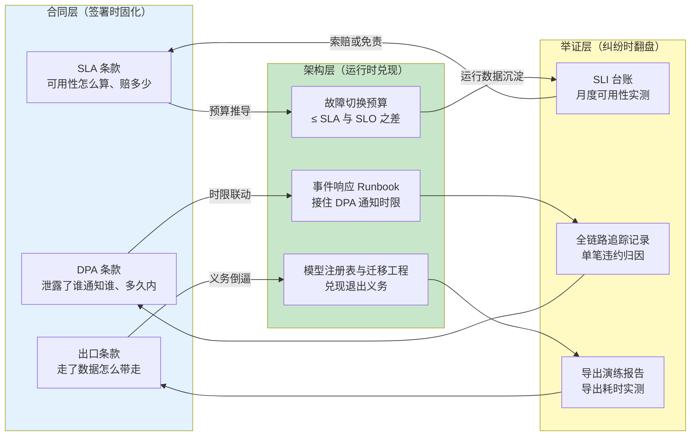
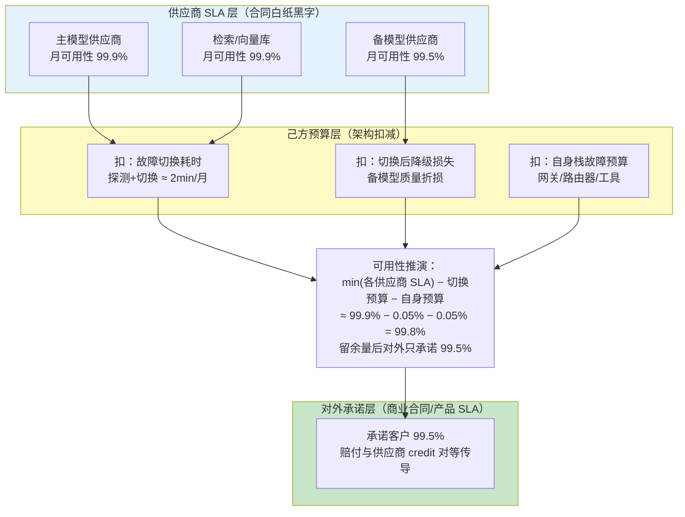
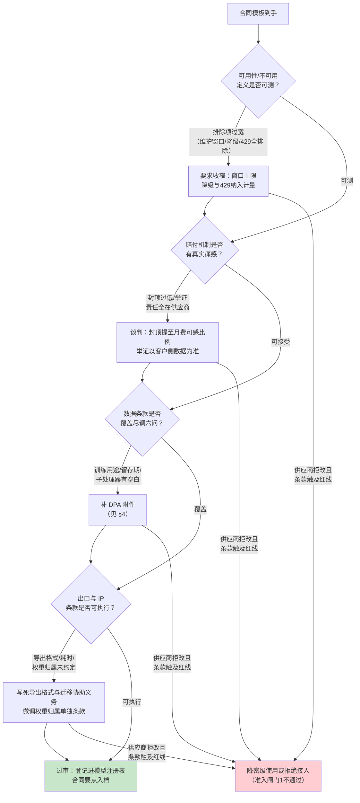
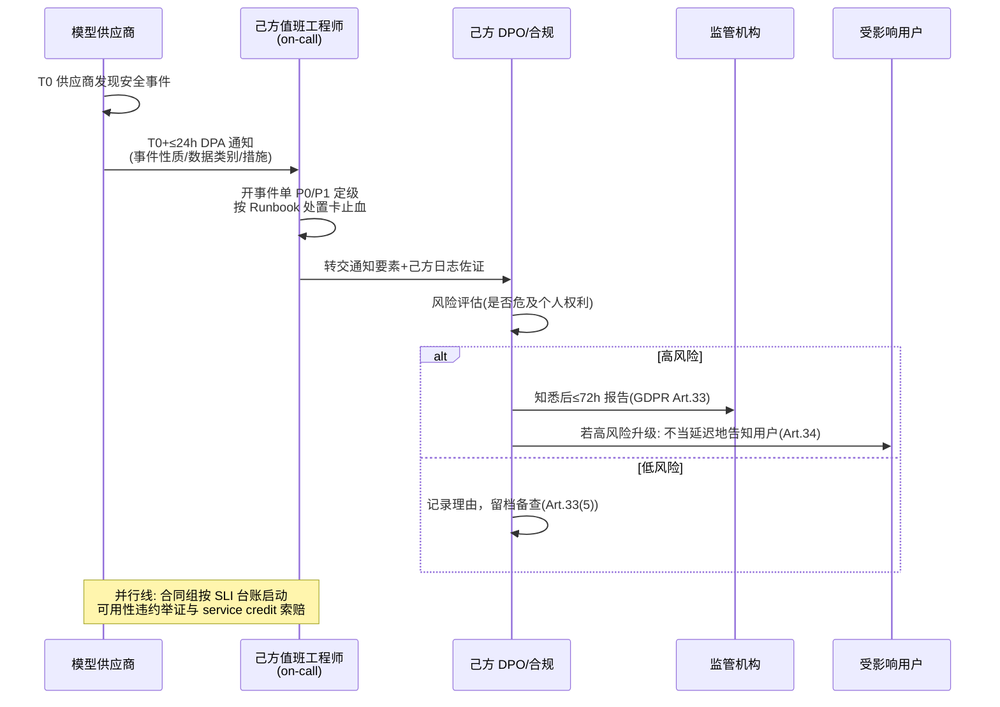
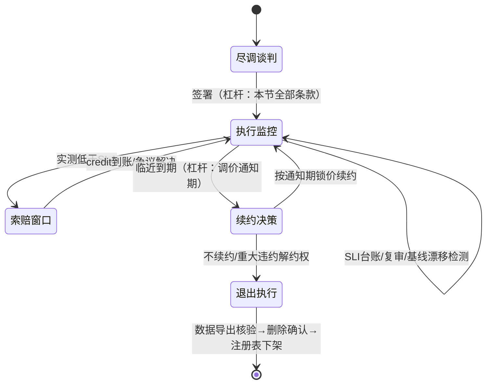

# 模型供应商合同与 SLA 审查：把架构预算写进法律文本

「本文是对 [教程 08-架构师进阶/10-多模型协作与供应策略 §6-§7] 中"模型准入尽调六问"与"供应商退出预案"的合同层下钻」

> **定位**：教程篇把供应商尽调作为准入四闸门的第一道概览带过，并指出"退出预案写不出来本身就是尽调不通过的信号"；本文回答的正是那个被留在门口的问题——**这些尽调结论如何落成可执行、可举证、可赔付的合同文本**。全体系此前对 SLI（服务指标）零展开、对 DPA（数据处理协议）仅一句"已签"（[附录 12-AI治理与合规/02-数据隐私与偏见检测 §一]实操检查清单末项）、对 service credit 赔付机制零覆盖，本文把这三块补齐：SLA/SLO/SLI 三层契约怎么推导、合同条款按什么清单审、DPA 里的角色与时限怎么卡、锁定风险用什么合同杠杆对冲。
>
> **读者画像**：需要与 LLM 供应商签年度合同的平台架构师/技术负责人——你不是法务，但合同里每一处"不可用""证据""通知期"最终都由你的监控系统、你的值班流程、你的迁移工程来兑现或买单。
>
> **前置阅读**：[教程 08-架构师进阶/10-多模型协作与供应策略]（准入尽调六问与退出预案，本文的母篇）、[教程 05-Observation可观测/07-指标治理：Token计量、SLO与基数熔断]（SLO 与错误预算方法，本文直接引用不重复）、[附录 12-AI治理与合规/02-数据隐私与偏见检测]（GDPR 五层防护，DPA 的合规地基）。
>
> 技术栈：Spring Boot 4.1 + Spring AI 2.0.0 + WebFlux + Java 21（代码段涉及的 Micrometer 1.15 / Reactor 3.7 / Spring AI 2.0.0 API 均经本地 jar javap 实证）

---

## 一、为什么合同是架构的第一行代码

工程师视角里，合同是法务的事，架构是自己的事。但对 LLM Agent 这类"核心能力整体外包"的系统，这个边界画错了位置：你的模型路由器（[教程 08-架构师进阶/10-多模型协作与供应策略 §3.2]）再精巧，它兜底的也只是在供应商**已经违约之后**的流量；而供应商承诺什么、怎么算违约、违约赔多少、证据认谁的——这些在合同签署那一刻就固化成了你系统的**能力上限**。

一个典型的事故链，把三个角色串在同一份合同上：



这张图是全文的地图：**合同条款决定架构预算，架构运行产生举证证据，证据反过来兑现合同权利**。三个方向缺一个角，合同就退化成"心理安慰"——条款写着 99.9%，你没有自己的测量就永远拿不到赔付；条款写着 24 小时通知，你的值班流程接不住，违约方就变成了你自己。

---

## 二、SLA / SLO / SLI 三层契约方法论

### 2.1 三个词的精确分工

这三个词在日常口语里经常混用，但在合同语境下混用会直接造成经济损失。它们的分工：

| 层 | 全称 | 谁定的 | 违反了怎么办 | 典型形态 |
|----|------|--------|-------------|---------|
| **SLA** | Service Level Agreement | 供应商写进合同 | 有**补救**（service credit 赔付/解约权） | "月度可用性 ≥ 99.9%，未达标赔付月费 10%" |
| **SLO** | Service Level Objective | 己方团队自定 | **无金钱后果**，只消耗错误预算、触发复盘 | "Agent 端到端成功率 ≥ 99.5%" |
| **SLI** | Service Level Indicator | 双方共同认可**测法** | 它是前两者的度量原料，本身无承诺 | "HTTP 2xx 且结构完整响应占比，按分钟窗口" |

关键在 SLI：**SLA 和 SLO 都是对同一个 SLI 的取值承诺，区别只在违反的后果**。所以合同审查的第一个动作不是看百分比数字，而是看"这个数字是用哪个 SLI、按什么测量方法算出来的"——数字再高，测法在供应商手里，等于没承诺。

### 2.2 Agent 场景怎么选 SLI

传统 Web 服务的 SLI 三件套（可用性/延迟/错误率）在 Agent 场景要重新定义，因为 Agent 的"失败"形态更多：

| SLI | 供应商侧测法（合同常见写法） | 己方 SLO 映射 | Agent 场景陷阱 |
|-----|---------------------------|--------------|---------------|
| **可用性** | API 端点返回 5xx 的分钟占比；或按"区域级"而非"账号级"统计 | 端到端 Agent 成功率（含工具执行） | 供应商按"全局多点采样"算可用性，你所在区域可能已经不可用但全局数字依然达标 |
| **TTFT（首 token 时间）** | P50/P95/P99，按分钟/小时窗口 | 用户感知的响应速度 SLO；流式 UI 的"卡没卡" | 只承诺 P50 等于没承诺——流式体验的抱怨集中在长尾；另外注意供应商是否把"排队时间"排除在外 |
| **错误率** | 4xx/5xx 占比，通常**排除 429（限流）** | Agent 任务失败率 | 429 被排除意味着限流风暴不计入 SLA——而高流量 Agent 恰恰死于限流；必须另谈速率条款或把 429 纳入 |
| **Token 吞吐** | 每分钟 token 数上限 | 成本与容量规划 | 只看吞吐不看"每账号并发请求数"，突发流量下照样被拒 |

选型的原则：**供应商侧可测、己方可独立复测、与用户感知相关**，三者缺一不可。供应商不可测的（如"回答质量"）写不进 SLA，只能作为尽调闸门 2 的评估项（[教程 08-架构师进阶/10-多模型协作与供应策略 §6.1] 金标准评测集）；己方不可复测的，纠纷时你拿不出证据。

### 2.3 从供应商 SLA 推导己方承诺

你的 Agent 链路里可能串着多个供应商（主模型、备模型、Embedding、向量库、工具服务），对外承诺不是拍脑袋定的，而是**逐层扣除预算**推导出来的：



推导规则一句话：**己方对外承诺 ≤ min(各供应商承诺) − 自身预算**。三个必须扣的预算项：

1. **故障切换预算**：从"主供应商实际不可用"到"流量稳定落在备供应商"之间的探测超时、重试、熔断恢复时间。[教程 05-Observation可观测/07-指标治理：Token计量、SLO与基数熔断] 的错误预算方法在这里的用法是：供应商 SLA 与你对外承诺之间的差额，就是你全部的**供应商侧错误预算**——切换机制、降级、重试消耗的都是它。SLO 与错误预算的内部管理方法（窗口、 burn rate、告警阈值）见该篇，本文不重复。
2. **降级质量预算**：切换到备模型后输出质量下降（备模型可能不在你的金标准集最优区间），部分"慢成功""低质成功"会推高你的任务级失败率——这笔账要按 [教程 08-架构师进阶/03-自我反思与Agent评估] 的评估集量化后折算进可用性。
3. **自身栈预算**：你的网关、路由器、工具服务自己的故障预算（SRE 惯例是自身 SLO 与对外承诺之间至少留一个数量级余量，如对外 99.5% 则自身各组件 99.9%）。

**只给单个供应商的 Agent**（尚无双供应商冗余，见 [教程 08-架构师进阶/10-多模型协作与供应策略 §4]）没有切换预算可扣，对外承诺必须更低，或者诚实写"尽力而为"——用供应商的 99.9% 直接当自己的 99.9% 对外承诺，是 Agent 创业公司最常见也最贵的合同错误。

### 2.4 测量分歧：合同最大的暗坑

同一个"99.9%"，供应商的账本和你的账本可能对不上，分歧点全部来自测法：

- **采样点分歧**：供应商用全球多点探针测"服务可达"，你的用户在某一区域超时——探针说可用，用户说不可用。
- **时间窗分歧**：供应商按自然月滚动分钟窗口，排除"计划维护窗口"（而维护窗口条款可能宽到每月 8 小时——这 8 小时足够你的夜间批处理任务死两次）。
- **计数分歧**：供应商只统计到达其网关的请求；你的请求还在 TCP 握手就超时了，根本没进它的账本。
- **降级分歧**：模型静默降级（响应 200 但悄悄换成了低配版本）在供应商账本里是"可用"，在你这里是事实违约——但若合同没写"模型版本变更通知义务"，你连违约都主张不了。

对策只有一个方向：**己方独立测量 + 台账留存**。你的 SLI 数据从第一天起就要按"将来会在仲裁庭上出示"的标准采集与保存（§4 给出工程实现），并在合同里争取一条"**测量以客户侧数据为准，或双方数据差异超过阈值时以客户侧为准**"——大客户经常能谈到，中小客户至少能谈到"双方数据各自留存、争议时交换审计"。

---

## 三、合同关键条款审查清单

拿到供应商合同模板后，按下面的决策路径逐条过审：



### 3.1 可用性承诺与"不可用"定义

审查要点是**排除项**——承诺数字由排除项定义，不看数字看排除：

- **维护窗口**：必须写明**时长上限**（如每月累计 ≤ 4 小时）、**提前通知期**（如 ≥ 72 小时）、以及"未按通知执行的计划维护按不可用计"。没有上限的维护窗口条款等于把可用性承诺掏空。
- **部分降级算不算不可用**：分三档写清——(a) 完全不可用（连接失败/5xx）必然算；(b) **性能降级**（TTFT 超阈值但成功返回）必须写入"降级即按比例计入不可用分钟"，否则供应商可以靠无限变慢来维持"可用"；(c) **质量降级**（模型版本静默变更）至少要挂钩"重大模型变更提前 N 天通知义务"，配合你侧的基线复审（[教程 08-架构师进阶/10-多模型协作与供应策略 §6.2] 复审周期）发现后主张。
- **计量粒度**：争取"账号级/区域级"计量而非"全局服务级"——你的 Agent 只部署在你用的区域。

### 3.2 赔付机制：没有痛感的 SLA 是优惠券

service credit 是供应商违约的对价，审查三要素：

**① 计算公式**。常见形态是"不可用时长 → 赔付比例阶梯"：

| 当月不可用时长 | credit（占当月账单） | 工程解读 |
|--------------|--------------------|---------|
| 45 min ~ 4 h（99.9%~99.5%） | 10% | 约等于一天 API 费用，仅够象征 |
| 4 h ~ 8 h（99.5%~98.9%） | 25% | 开始有痛感 |
| > 8 h（< 98.9%） | 50%~100% | 谈判焦点：大客户可谈到 100% + 解约权 |

公式审查点：**分母是什么**（当月该服务账单，还是全账户账单？——只用该服务账单时，你的 Embedding/其他调用不参与赔付）；**阶梯是不是"封顶即免责"**（警惕"累计赔付不超过当月账单 X%"的 X 被设为 5% 这种装饰性数字）。

**② 封顶与解约权**。credit 封顶是行业惯例（多为月费 30%~50%），但**重大持续性违约必须挂钩解约权**（如"连续两个月低于承诺，客户可无责解约并按比例退费"）——没有解约权的 SLA，你的退出谈判筹码为零，§6 的杠杆全部失效。

**③ 举证责任**。这是工程师最该争的一条：默认模板几乎都写"赔付以供应商监测数据为准"。要争取改写为：

- 客户侧监控数据可作为主张依据（与供应商数据不一致时触发对账而非直接驳回）；
- 供应商对"数据不实"承担说明义务；
- **索赔窗口期写宽**（常见 30 天，谈更久）——窗口期直接决定你的台账保存策略（§4.3）。

单笔请求级的违约归因（"我方 trace 显示该请求在 T1~T2 超时且未收到响应"）依赖全链路追踪记录，采集与 span 设计见 [教程 04-企业级架构主干/02-全链路可观测性]；本文 §4.3 只解决"从追踪/指标到可提交证据"的最后一跳。

### 3.3 数据条款：把尽调六问翻译成合同语言

[教程 08-架构师进阶/10-多模型协作与供应策略 §6.1] 的尽调六问，逐条对应的合同语言：

| 尽调六问 | 对应合同条款 | 红旗写法（拒签或降密级） | 合格写法 |
|---------|------------|----------------------|---------|
| 是否用我的输入再训练？ | 训练用途限制 | "供应商可改进服务"（开放式授权） | "客户数据仅用于向客户提供本服务；用于模型训练须单独书面同意/opt-out 开关默认关闭" |
| 留存期与删除方式？ | 数据留存与删除 | "留存期限另行通知" | "输入/输出留存 ≤ N 天（0 优先）；删除后 M 天内从备份清除并书面确认" |
| 法规管辖与出境？ | 管辖法律 + 数据驻留 | 管辖地在无法院协作地区、驻留未约定 | 明确管辖地；数据驻留区域白名单（衔接 §4 DPA） |
| SLA 与赔付？ | §3.1-§3.2 | 封顶 5%、举证全归供应商 | 账单可感比例 + 客户侧数据举证 |
| 价格调整通知期？ | 价格条款 | "价格可能随时调整" | "调价提前 ≥ 60~90 天书面通知；通知期内可按原价续约一个周期" |
| 退出数据导出？ | 出口条款 | "服务终止后数据即删除" | "终止前可导出，格式/耗时义务（§6.2）" |

### 3.4 审计权

合同应至少包含：**年度第三方审计报告的提供义务**（SOC 2 Type II / ISO/IEC 27001 证书与报告范围要覆盖你实际使用的服务——云大厂常把模型服务排除在主报告范围外，要单独确认）；**重大安全事件的审计配合义务**；大额合同可争取**客户或客户委托第三方的现场/远程审计权**（含渗透测试协调条款）。审计权与 NIST AI RMF 的 MEASURE/GOVERN 职能的映射见 [附录 12-AI治理与合规/00-NIST-AI-RMF框架]——没有合同审计权，你的治理职能就只剩"信任供应商的自述"一条腿。

---

## 四、DPA：数据处理协议要点

DPA（Data Processing Agreement）是主合同的数据附件，在 GDPR 语境下是第 28 条的**法定要求**而非商业礼节（条文见 [EUR-Lex GDPR](https://eur-lex.europa.eu/eli/reg/2016/679/oj/oj) Art. 28）。[附录 12-AI治理与合规/02-数据隐私与偏见检测 §一] 把"签 DPA"列为上线前检查清单的最后一项，本节讲清楚**签进去的内容怎么审**。

### 4.1 角色划分：controller 与 processor

- **己方 = controller（控制者）**：决定"为什么处理、处理什么数据"。你的 Agent 把用户对话发给模型供应商，是为了实现你的业务目的——你是控制者。
- **供应商 = processor（处理者）**：仅按你的指示处理数据。DPA 的全部条款本质上都在把"按指示"四个字具体化：指示的范围、子处理的许可、安全义务、事故通知、返还与删除。
- **子处理器链条**：供应商再调用其上游（基座模型方、云托管方、标注服务）时是链条的下一环。DPA 必须含**子处理器清单 + 变更通知权 + 异议权**（收到变更通知后合理期限内可反对，反对不成可解约退费）——这是把尽调六问里"子处理器列表"变成持续权利的唯一方式，因为清单会变。

一个 LLM 特有的角色争议点要预先想清楚：**供应商用你的输入"改进服务"时它是什么角色？** 一旦它把你的数据用于自己的（模型训练）目的，它实质上在为自己的目的处理——欧盟数据保护委员会（EDPB）对这一情形的立场是它可能构成**独立或共同控制者**，而非单纯 processor。所以 §3.3 的训练用途条款不是格式条款，它决定了整个责任结构。

### 4.2 跨境传输

DPA 的跨境条款要与你的数据驻留白名单互相咬合：传输机制（SCC 标准合同条款/充分性认定/认证）、传输目的地清单、**传输影响评估（TIA）的配合义务**。完整的跨境合规分析（三地法规差异、SCC 落地、数据出境安全评估）见 [附录 12-AI治理与合规/02-数据隐私与偏见检测 §一.1.3] 第三层"数据驻留"的展开，本文只强调合同动作：**把"允许的处理地"写成白名单枚举，新增目的地须事先书面同意**——供应商把新区域纳入服务网络是常态，没有白名单条款，你的数据可能先于你知情地出了境。

### 4.3 安全事件通知时限与己方事件响应联动

GDPR 第 33 条要求 controller 在**知悉泄露后 72 小时内**报告监管机构（除非不太可能产生风险）。推导链是：监管的 72 小时从"你知悉"起算 → 你的"知悉"时点 = 供应商通知你的时点 → **供应商的通知时限必须显著短于 72 小时**，否则你的评估、定级、报告窗口被吃光。行业标准争取值是"知悉后**24 小时内**通知"，并写明通知内容最低要素（事实性质、涉及数据类别与大致数量、可能后果、已采取措施）。



这张时序图里有两个工程侧的"接住"动作：其一，值班侧从收到通知到止血的处置流程必须**预先演练**，Runbook 分级与处置卡见 [附录 18-可观测平台实践/01-AI事件响应工程]——DPA 给了你 24 小时，但如果你的事件响应从零起步，24 小时只够开会。其二，图底部的并行线：**数据事件与可用性违约常常同源**（供应商被攻击导致宕机），事件单要同时挂合同索赔线，台账证据在事件复盘时同步封存，避免索赔窗口（§3.2 的 30 天）被事件善后耗完。

---

## 五、SLI 台账：赔付举证的工程实现

### 5.1 为什么"有监控"不等于"有证据"

多数团队挂在嘴边的"我们 Grafana 上都有"在举证场景有四个洞：**窗口洞**（Micrometer 客户端百分位是滚动环形缓冲，`distributionStatisticExpiry` 过期即丢，撑不过 30 天索赔窗口）；**粒度洞**（仪表盘聚合到天，纠纷要的是分钟级单笔）；**完整性洞**（采样聚合丢了"那一次失败的请求号"）；**公信洞**（截图不是证据，可复核的原始记录才是）。所以台账要按四个要求设计：分钟级落盘、含请求级明细、不可变存储（append-only）、保存期 ≥ 合同索赔窗口 + 争议处理期。

### 5.2 采集：把 TTFT 与错误率记进供应商维度

以下采集器在 Spring AI 流式调用上挂 SLI 埋点，所有 API 均经本地 jar 实证（Micrometer 1.15.12 / Reactor 3.7.15 / Spring AI 2.0.0）：

```java
// Spring AI 2.0.0 / Micrometer 1.15 / Reactor 3.7 —— javap 实证
import io.micrometer.core.instrument.MeterRegistry;
import io.micrometer.core.instrument.Timer;
import org.springframework.ai.chat.client.ChatClient;
import org.springframework.stereotype.Service;
import reactor.core.publisher.Flux;

import java.time.Duration;
import java.util.concurrent.TimeUnit;
import java.util.concurrent.atomic.AtomicLong;

@Service
public class SupplierSliRecorder {

    private final ChatClient chatClient;   // 构造注入，ChatClient.create(model)（2.0 入口，javap 实证）
    private final MeterRegistry registry;

    public SupplierSliRecorder(ChatClient chatClient, MeterRegistry registry) {
        this.chatClient = chatClient;
        this.registry = registry;
    }

    /** 按供应商维度建 Timer：分钟级窗口由台账落盘承担，这里的百分位仅用于实时告警 */
    private Timer sliTimer(String provider, String outcome) {
        return Timer.builder("ai.provider.sli")
            .description("供应商调用时延与结果（SLI 台账原料）")
            .tag("provider", provider)
            .tag("outcome", outcome)          // success / error / timeout
            .publishPercentiles(0.5, 0.95, 0.99)
            .register(registry);
    }

    /**
     * 带 SLI 采集的流式调用。
     * TTFT = 订阅发起 → 首个 token 到达；总时延 = 订阅 → 流终止（含错误终止）。
     * doFinally 在 complete/error/cancel 三种终态都触发，保证错误样本也进台账。
     */
    public Flux<String> streamWithSli(String provider, String userMessage) {
        long submitAt = System.nanoTime();
        AtomicLong firstTokenAt = new AtomicLong();
        return chatClient.prompt()             // prompt()/user(String)/stream()/content() 均 javap 实证
            .user(userMessage)
            .stream()
            .content()                          // Flux<String>
            .doOnNext(token -> firstTokenAt.compareAndSet(0, System.nanoTime()))
            .doFinally(signal -> {
                long endAt = System.nanoTime();
                String outcome = signal == reactor.core.publisher.SignalType.ON_ERROR
                    ? "error" : "success";
                sliTimer(provider, outcome).record(Duration.ofNanos(endAt - submitAt));
                long ft = firstTokenAt.get();
                if (ft > 0) {
                    sliTimer(provider, "ttft-" + outcome)
                        .record(Duration.ofNanos(ft - submitAt));
                }
                // 台账落盘（append-only 存储 + 请求级明细）在 emit 侧挂接，此处从略
            })
            .timeout(Duration.ofSeconds(30));
    }

    /** 月度汇总：对账单里的三个数字从同一口径读出（percentile 需建 Timer 时声明 publishPercentiles） */
    public MonthlySliReport monthlyReport(String provider) {
        Timer ok = sliTimer(provider, "success");
        Timer err = sliTimer(provider, "error");
        long total = ok.count() + err.count();
        double availability = total == 0 ? 1.0 : (double) ok.count() / total;  // 演示：分钟级台账才是索赔口径
        return new MonthlySliReport(
            provider,
            availability,
            ok.percentile(0.95, TimeUnit.MILLISECONDS),   // percentile(double, TimeUnit) javap 实证
            err.count());
    }

    record MonthlySliReport(String provider, double availability,
                            double ttftP95Ms, long errorCount) {}
}
```

两个实现要点：**其一**，`percentile()` 读的是进程内环形缓冲，只适合实时告警，不能直接当证据——月度报告的真实可用性要从**台账**（分钟级事件流落盘）重算，上面 `monthlyReport` 的注释即为此而写；**其二**，TTFT 的起算点要在合同对账时与供应商对齐（从"请求离开己方出口"还是"到达供应商网关"起算，两边时钟要做过 NTP 校验说明），否则 P95 数字对不上。

### 5.3 举证封装

台账到证据只差一个导出动作：按供应商对账口径生成月度 PDF/CSV（附测量方法说明、时钟校验记录、原始数据指纹），与 §3.2 的索赔窗口期联动设定保存与可导出期限。证据链设计与"监控数据即证据"的观测基础，见 [教程 04-企业级架构主干/02-全链路可观测性] 与 [教程 05-Observation可观测/07-指标治理：Token计量、SLO与基数熔断]。

---

## 六、供应商锁定与退出的合同杠杆

[教程 08-架构师进阶/10-多模型协作与供应策略 §6.3] 说"退出预案写不出来本身就是尽调不通过"；本节给退出预案配上**合同杠杆**——没有这些条款，预案只是愿望。

### 6.1 合同生命周期与杠杆点位



杠杆按点位分四类：

**① 价格通知期与续约方式**。两个陷阱：自动续约条款（auto-renewal）的退出通知期太短（如"到期前 30 天书面异议"——错过即再绑一年）；调价自由（"价格以供应商现价为准"）。合格写法：调价提前 ≥ 60~90 天通知 + 通知期内可按原价续约一个周期 + 自动续约次数上限。这个通知期还有架构侧用途——它就是你双供应商灰度切流的时间预算（[教程 08-架构师进阶/10-多模型协作与供应策略 §4] 的多供应商冗余要在通知期内完成评估与切换，闸门 2 的金标准评测集此时复用）。

**② 出口义务的可执行化**。"客户可导出数据"若没有格式与耗时承诺，等于没有。要写死：**格式**（业界通行的 JSONL/CSV，字段 schema 附件化；对话记录含完整元数据而非仅正文）、**完整性**（条数对账单）、**耗时**（如"请求后 ≤ 7 日内交付"）、**迁移协助**（大客户可争取合理范围的迁移技术支持义务）。导出的可执行性要**每年演练**：从生产账号真实导出一次，计时并核验完整性，演练报告进尽调档案——导出义务的兑现成本只有演练时才暴露。

**③ 知识产权归属**。四个对象分别约定：输入与输出数据（归客户，供应商仅在服务必需范围内使用许可）；**微调权重**（在供应商平台上微调的模型，权重文件能否导出、合同终止后供应商可否继续使用——不加条款的默认答案是"不能带走、且供应商留存"，这在 [教程 08-架构师进阶/10-多模型协作与供应策略 §6.2] 的模型注册表里要登记为该模型的合同要点；最稳妥的架构对策是把微调放在本地/自有基础设施，供应商只提供基座）；派生数据（用量统计、评测结果）；反馈数据（你提交的 badcase 供应商可否自由使用）。

**④ 解约权触发器**。把"重大违约"具体化成可自动判定的条件：连续 N 个月 SLA 不达标、安全事件通知超时（§4.3）、数据驻留白名单被违反、控制权变更（供应商被收购到竞争对手麾下）——每一项都能从你的台账与事件单里自动取数，避免"是否重大"沦为律师的持久战。

---

## 七、适用场景与不适用场景

### 适用场景

- 与 LLM/Embedding/向量库供应商签订年度付费合同的场景（金额越大，本文每一条的杠杆价值越高）
- Agent 对外承载商业 SLA（对客户承诺可用性），需要从供应商 SLA 反推承诺边界
- 处理个人数据/受监管数据（金融、医疗、跨境业务），DPA 条款直接决定合规成败
- 多供应商体系（[教程 08-架构师进阶/10-多模型协作与供应策略 §4]）的供应商准入、复审与退出演练
- 供应商集中度高、锁定期长（平台微调/私有化部署绑约）的重决策场景

### 不适用场景

- 原型/Demo 阶段的按量付费（标准条款无谈判空间，读 §2 建立概念即可）
- 纯本地/开源自部署模型（无外部供应商，SLA 由自己 SRE 体系承担；DPA 角色不变但对象变为内部部门）
- 组织没有独立法务/合规职能——本文只能帮你**提出**条款要求，谈判与文本定稿必须由法务执行
- 与个人开发者级别的免费 API 往来（供应商连 DPA 模板都未必提供，此时答案是"不送个人数据出去"而不是"审合同"）

---

## 八、本章总结

| 概念 | 一句话 |
|------|--------|
| **SLA/SLO/SLI 分工** | SLA 是带赔付的合同承诺，SLO 是内部目标，SLI 是双方认可的测法——先审测法再审数字 |
| **承诺推导** | 己方对外承诺 ≤ min(供应商承诺) − 切换预算 − 降级预算 − 自身预算 |
| **测量分歧** | 采样点/时间窗/计数/降级四个分歧点决定了"必须己方独立测量" |
| **条款审查** | 排除项、赔付三要素（公式/封顶/举证）、数据条款对齐尽调六问、审计权覆盖所用服务 |
| **DPA** | controller/processor 角色定责；子处理器清单要变成持续权利；供应商通知时限必须短于己方 72h 报告线 |
| **事件联动** | DPA 通知时限驱动值班 Runbook，事件与索赔两条线并行封存证据 |
| **SLI 台账** | 分钟级落盘 + 请求级明细 + append-only + 保存期覆盖索赔窗口；环形缓冲只配做告警 |
| **退出杠杆** | 调价通知期、导出格式/耗时义务、微调权重归属、可自动取数的解约触发器 |

合同审查的产出不是"签/不签"一个字，而是三份可执行的资产：**承诺推导表**（进对外 SLA 决策）、**SLI 台账**（进监控系统需求）、**退出预案**（进模型注册表与年度演练计划）。做到这三份，合同才真正从法务的抽屉走进了架构的运行时。

---

> **想深入？→ [教程 08-架构师进阶/10-多模型协作与供应策略]**：本文条款的母篇——准入四闸门、模型注册表与多供应商冗余的架构实现。
> **想深入？→ [教程 05-Observation可观测/07-指标治理：Token计量、SLO与基数熔断]**：错误预算与 burn rate 的完整方法，§2.3 扣预算的内部管理细则。
> **想深入？→ [附录 12-AI治理与合规/02-数据隐私与偏见检测]**：GDPR 五层防护与跨境传输的合规展开，DPA 的上游依据。
> **想深入？→ [附录 18-可观测平台实践/01-AI事件响应工程]**：§4.3 时序图里值班侧 Runbook 分级与处置卡的完整工程。
> **想深入？→ [教程 04-企业级架构主干/02-全链路可观测性]**：请求级违约归因所依赖的全链路追踪设施。
