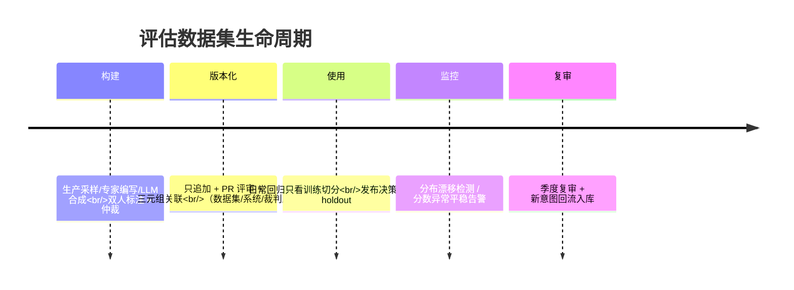
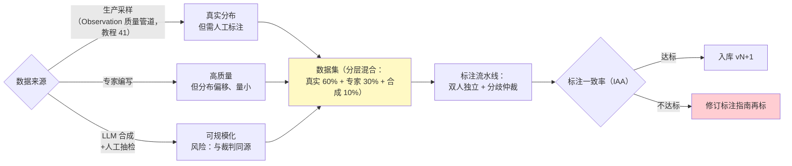

# 评估数据集管理与版本化

> **定位**：评估体系的地基——数据集的构建（金标从哪来）、Schema 设计、版本化与不可变性、污染与泄漏防护、漂移检测、数据集 CI。回应 [教程 41-数据飞轮与持续改进] 的"数据集如何演进"与"防过拟合评估集的定期更新具体怎么做"，与 [01-LLM-as-Judge工程化]（评的方法）、[00-Langfuse与Ragas集成]（工具）构成评估三篇。
>
> **读者画像**：要建平台级评估资产（多个团队共用一套金标）的工程师；发现"评估分数很高、线上效果平平"的架构师。
>
> **前置阅读**：[教程 37-自我反思与Agent评估 §2]（数据集概念引入）；[教程 41-数据飞轮与持续改进 §2]（飞轮中数据集的位置）。

---

## 1. 数据集是资产，不是测试夹具

区别决定一切：测试夹具跟着代码走、可随手改；**评估数据集是独立版本化的资产**——改它等于改尺子。一次评估结果 = （被评系统版本 × 数据集版本 × 评估配置版本）的函数，三者缺一不可复现：

```
评估报告 = f(系统: v2.3.1, 数据集: cs-qa@v14, 裁判: judge-p@v3, rubric@v5)
```

## 2. 构建：金标从哪来

数据集的全生命周期先行总览（版本路线用 timeline）：





要点：**混合来源**（纯合成集会把系统往"像裁判"的方向优化）；**标注指南是一等公民**（分歧大多源于指南含糊而不是标注员水平）；**双人独立标注 + 仲裁**（一致率进数据集元数据——它就是金标质量的置信度）。

## 3. Schema：一条评估样本的完整形态

```json
{
  "id": "case-000817",
  "input": "帮我查一下订单 83721 的物流状态",
  "expectedOutput": "引用式参考答案（可选，无则为纯质量评估）",
  "rubric": ["必须包含物流状态", "不得泄露其他用户信息"],
  "metadata": {
    "domain": "order-query", "difficulty": "easy",
    "tenantTier": "pro", "tools": ["OrderQueryTool"],
    "source": "prod-sample@2026-08-01"
  },
  "annotations": { "labelerA": 4, "labelerB": 4, "arbitrated": null },
  "excludes": { "systemVersions": [] }
}
```

设计纪律：`metadata` 是**分层切片**的依据（按域/难度/租户等级分别看分数——总分掩盖问题）；`rubric` 挂在样本级（与全局 rubric 合并进裁判，[01 §5]）；`expectedOutput` 允许缺失（区分 correctness 与 quality 两类样本）。

## 4. 版本化与不可变

| 规则 | 做法 |
|------|------|
| 只追加，不改写 | 修正样本 = 新 id + supersedeOf 指向旧样本；旧版永不就地编辑 |
| 语义化版本 | vMAJOR（删了/换了分布）/ vMINOR（新增样本）/ 内容哈希清单 |
| 存储形态 | JSONL 文件（Git 仓库管理，天然 diff/PR 评审）或对象存储 + 清单；**评审走 PR**——数据集变更和人一样要 review |
| 结果关联 | 每次评估记录（数据集版本，系统版本，裁判版本）三元组——三个月后还能回答"这分数怎么来的" |

**文件 + Git 优先**：千条级数据集 JSONL 进 Git，PR 评审即数据集 CI 入口（规模到十万条再上对象存储 + 清单哈希）。

## 5. 污染与泄漏：分数虚高的两大来源

1. **训练污染**：样本太"经典"（接近公开 benchmark）被模型背过——对策：定期从**新鲜生产流量**补充（飞轮的意义）；合成样本换表述再入库。
2. **评估泄漏**：开发迭代时反复对同一评估集调 Prompt——**过拟合评估集**（分数 95、线上 70 的典型病因）。对策：**训练/验证/保留三切分**——日常迭代只看训练切分，发布决策才看保留切分（holdout，且 holdout 样本进系统上下文即触发样本轮换）；[教程 29] 的灰度流量切分思想平移到数据切分。

## 6. 漂移检测：数据集的保质期

数据集会过期（业务变化、用户问法演化、工具升级）。三个信号触发数据集复审：**生产分布漂移**（新增意图类聚类在生产日志中出现，[教程 41 §6] 归因分析的输出）、**分数异常平稳**（模型改了分数不动 = 数据集测不出差异）、**时间阈值**（季度复审）。漂移检测的工程实现：对生产样本与数据集样本做 embedding 聚类对比（[附录 01-LLM基础理论/01-Embedding原理]），新簇即新数据集候选。

## 7. 数据集 CI

评估数据集的 PR 门禁（并入 [附录 04-测试策略/01-集成测试] 的 CI 讨论）：

| 检查 | 规则 |
|------|------|
| Schema 校验 | JSONL 逐条过 JSON Schema（必填/类型/metadata 枚举） |
| 去重 | embedding 相似度 > 0.95 拒绝（防刷分样本） |
| 分布检查 | 各切片占比变化超阈值需在 PR 说明 |
| 冒烟评估 | 新版本跑 50 条冒烟子集，裁判可正常评完（防毒样本） |
| 基线对比 | 新旧版本各跑一次当前生产系统——分数差 >2% 要求归因说明（尺子变了要知道影响） |

## 8. 适用场景与不适用场景

### 适用场景

- 平台级评估资产（多团队共享金标 + 切片分数）
- 发布门禁（holdout 保留集 + pairwise 决胜，[01 §4]）
- 飞轮闭环（生产采样→标注→版本递增→复审）

### 不适用场景

- 快速实验期（Prompt 探索用随手 20 条即可，过早重型化拖慢迭代）
- 强隐私场景直接搬生产数据入库——先脱敏/合成化（[教程 25 §6]、[教程 31 §6] 的口径）
- 以"刷高评估分"为目标的 KPI 挂钩——必然过拟合（§5），评估分只作回归参考不作 OKR

## 9. 常见误区与反模式

1. **单文件随手改**——尺子每星期变形，历史分数全部失去可比性；版本化从第一天开始。
2. **只有一个总分数**——切片分数（按域/难度）才是排障入口，总分用于汇报。
3. **holdout 也天天看**——泄漏；holdout 只在发布决策时解封。
4. **数据集大 = 好**——分布覆盖与标注质量优先于数量；10k 噪声样本不如 1k 金标。
5. **合成样本当主力**——合成占比过高时系统学会的是"像裁判"（[01 §2] 自我偏好）；控制占比并抽检。

## 10. 总结

数据集管理一句话：**金标是版本化资产（只追加/PR 评审/三元组可复现），污染靠三切分防、过期靠漂移检测管、质量靠标注一致率保**。它给 [01-LLM-as-Judge工程化] 提供尺子、给 [教程 41] 的飞轮提供落点。下一篇从离线走向在线：[附录 12-评估与可观测生态/03-在线实验与AB统计]。

**外部来源**：[Langfuse Datasets](https://langfuse.com/docs/datasets/overview) · [Ragas – Evaluation Dataset 设计](https://docs.ragas.io/) · [OpenAI Evals（数据集工程参考）](https://github.com/openai/evals) · [DVC（数据版本化工具，思路参考）](https://dvc.org/)
