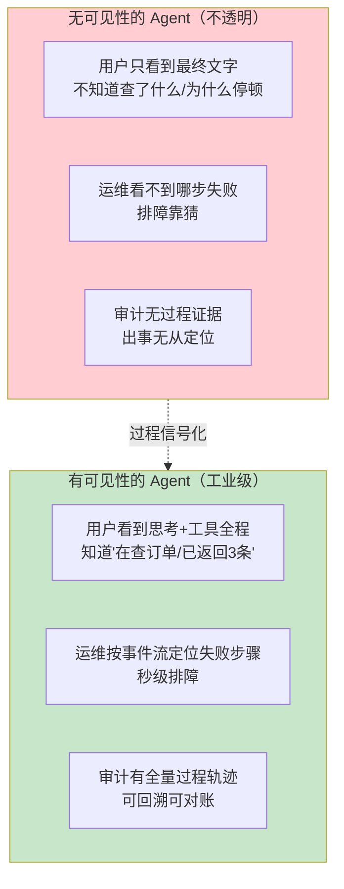
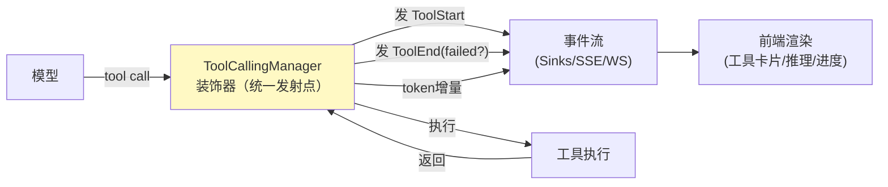

# 01-中间过程可见性设计：工业级 Agent 的透明化工程

> **定位**：中间过程可见性（Agent 在想什么、在调什么工具、检索了什么、进行到哪一步）是企业级 Agent 的**标配能力**——不是锦上添花，而是可信基础设施：用户看不到过程就不敢信结果，运维看不到过程就无法排障，审计看不到过程就无从追责。本文从**后端工程视角**统一设计这个过程信号的产生、传输、消费三件事，是可复用范式；前端如何渲染见 [附录 14/00-Agent用户体验设计]。读者画像：要给 Agent 加"过程透明度"的后端架构师。锚点：[教程 28-流式工具调用与事件协议]（事件协议载体）、[教程 27-Agentic-UI设计]（前端消费）、[教程 31-全链路可观测性]（过程已观测衔接）、[教程 03-工具调用 §5 工具调用循环]。
>
> **铁律 0**：事件协议自研；LLM/工具调用用已实证基准（`AssistantMessage.ToolCall`/`ToolCallingManager`，见附录 05）。

---

## 一、为什么可见性是标配而非可选项



企业级 Agent 的信任链是"**过程可信 → 结果可信 → 敢用**"。没有过程可见性，任何"A 能生成好结果"的说法都是黑盒自证——这正是其他旗舰（评测/仿真）解决的"敢不敢"问题的**同一信任前提的体验侧**。

## 二、六类过程信号（统一模型）

过程可见性的落地物是**结构化事件流**。六类信号覆盖 Agent 几乎全部"中间过程"：

| # | 信号 | 事件 | 内容 | 前端如何用 |
|---|------|------|------|-----------|
| 1 | 思考过程 | ThoughtStart/ThoughtDelta/ThoughtEnd | 模型推理文本增量 | 渲染"推理中"与推理片段 |
| 2 | 工具调用 | ToolStart/ToolProgress/ToolEnd | 工具名/参数预览/进度/结果预览 | 工具卡片（调用中→成功/失败）|
| 3 | 工具结果 | ToolEnd.resultPreview | 截断的结果摘要 | 可展开详情（按需拉全量） |
| 4 | 检索/访存 | RetrievalStart/RetrievalHit(可扩展) | 检索源/命中的文档/分数 | 显示"检索了哪些资料" |
| 5 | 状态变化 | 生命周期 + 步骤 | TurnStarted/TurnComplete 等 | 整体进度骨架 |
| 6 | 成本/资源 | TokenCount | 本步 token/累计 | 实时成本显示/预算感知 |

**核心纪律**：这些信号由**同一事件协议**承载（非每类各造一个），流经同一通道（有界命令/无界事件，见 [项目 22 会话引擎]），保证乱序补偿与断线重放一致。

## 三、信号从哪来：统一发射点

错误做法是把信号埋进**每个工具/每个模块内部**（散落必漏、难维护）。正确做法是**在横向切面统一发射**，对齐 [项目 22/03 编排层] 的 ToolCallingManager 装饰器落点（HITL/审计/可见性的共同锚点）：



**为何必须集中**：拦截、审批（教程 28）、审计（教程 22）、可见性都拦截在工具执行边界；同一装饰器同时发射这几类信号，既避免重复注入，又保证**可见性不因工具实现差异而缺失**（任何工具经同一管道，天然有事件）。

## 四、三类关键设计决策

### 4.1 preview 截断（事件流不能背全量）

| 数据 | 截断起点 | 原因 |
|------|---------|------|
| 工具参数 | 120 字符 | 防敏感参数与超大输入进事件流 |
| 工具结果 | 500 字符 | 防大结果（如拉取整文件）撑爆流 |
| 推理 delta | 逐 token 发（本身就是增量） | 推理天然适合流式 |

**完整内容走按需 REST**：事件 stream 只给摘要，详情（完整工具输出/完整检索文档）用事件里带的引用 id 按需拉取——前端内存/带宽双约束下成立。安全敏感结果（密钥/涉密）在预览层就脱敏，不进事件流。

### 4.2 成对与恰好一次

- **ToolStart↔ToolEnd 必须一一配对**，异常路径也发 ToolEnd(failed=true)。孤儿 ToolStart（有开始无结束）是前端"转圈卡死"的信号源，也是监控告警的对象。
- **终态/工具结束事件恰好一次**（AtomicBoolean/幂等键，见 [项目 22/04]）——异步竞态下重复通知会让前端状态机错乱。

### 4.3 乱序与断线

- 事件携带**单调递增 id + 时间戳**；前端按 id 排序/去重，容忍网络乱序。
- 断线重连带 `Last-Event-ID` 补发缺口（[教程 57] / [项目 22/10 投影层]），**事件序完整无损**是唯一不变式。

## 五、与前几大体系的衔接

| 关联体 | 分工 |
|--------|------|
| [附录 14/00] 前端 UX | 00 讲"怎么展示"（思考卡片/工具卡片/步进），本文讲"后端怎么产生过程信号"——两者合成完整可见性 |
| [教程 28] 事件协议 | 载体现成可复用——直接在项目的 AgentEvent 上扩展六类信号 |
| [教程 31] 可观测 | 可观测是**给开发者的**全链路 Span；过程可见性是**给用户/业务的**过程事件——同一发射点，两个消费出口 |
| [项目 22 会话引擎] | 单写者 actor + 无界事件通道就是过程可见性的天然载体 |
| 各企业级项目 | 每个项目按**其领域工具**定制六类信号的具体事件字段（见项目进阶各篇） |

## 六、检验方式（通用断言，各项目套用）

```bash
# 1. 全量断言：含工具 turn 的事件流，ToolStart 数 == ToolEnd 数（成对、0 孤儿）
# 2. 失败路径：异常工具 → ToolEnd(failed=true) 仍在（不吞）
# 3. 截断：任意事件 payload ≤500 字符（扫描断言）；含敏感字段的事件已脱敏
# 4. 有序：ThoughtDelta→ToolStart→ToolEnd→Token 时序正确（按 id 排序后断言）
# 5. 断线：模拟重连，重放无缺无重（事件序完整）
```

**下一篇**：接入 [项目 22-会话引擎] 的事件协议，或在各项目进阶篇按领域落地。
