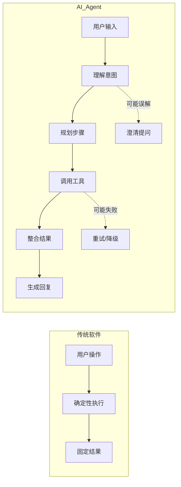
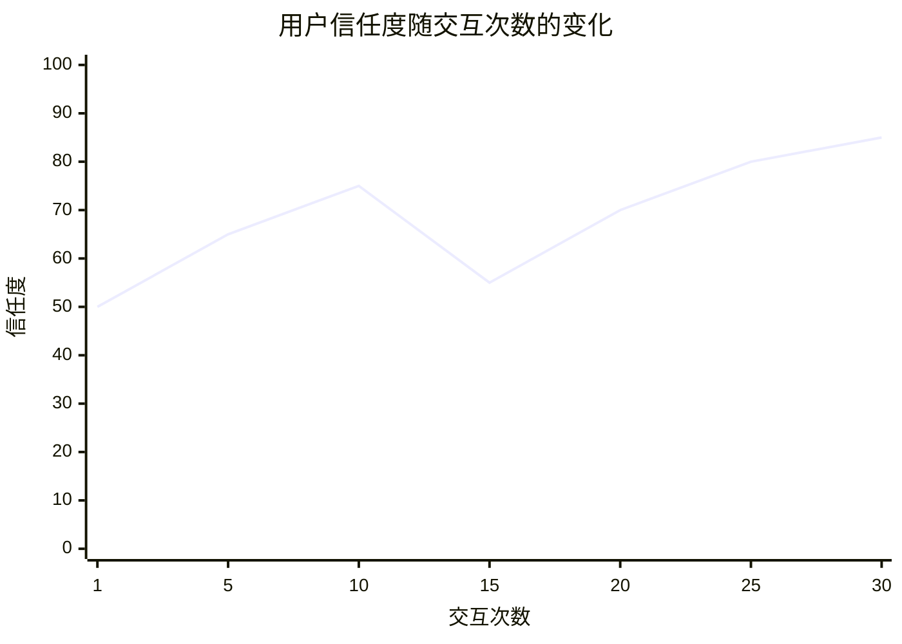
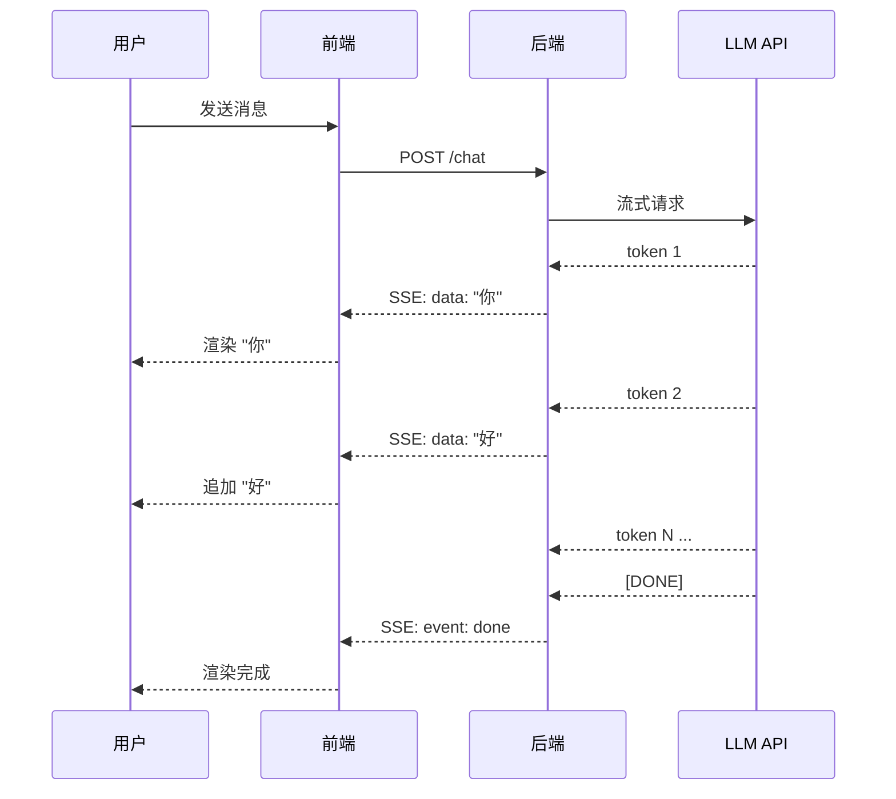
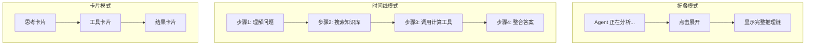
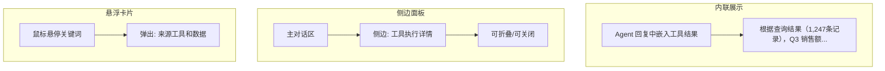
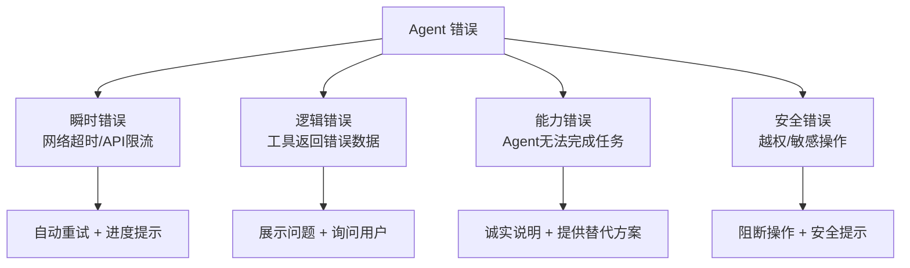
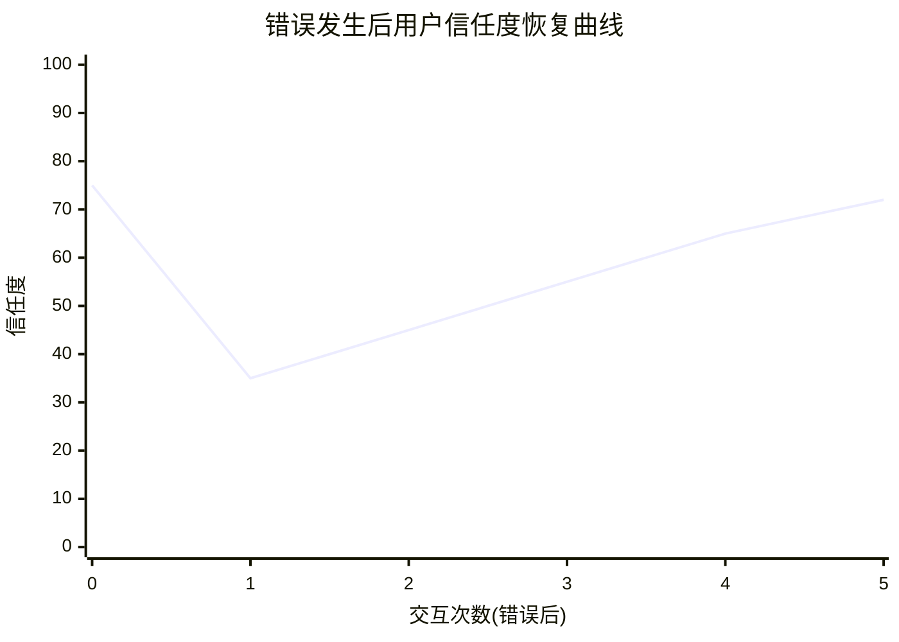
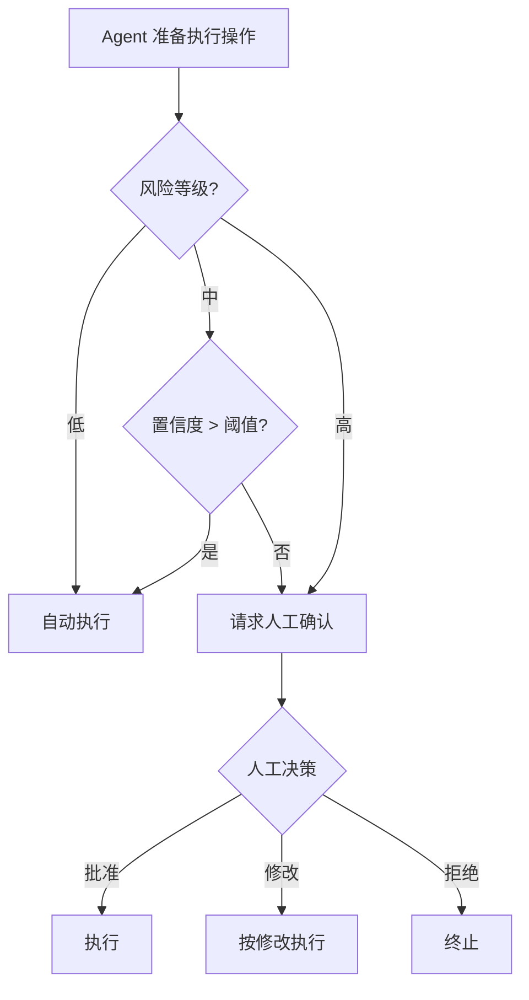
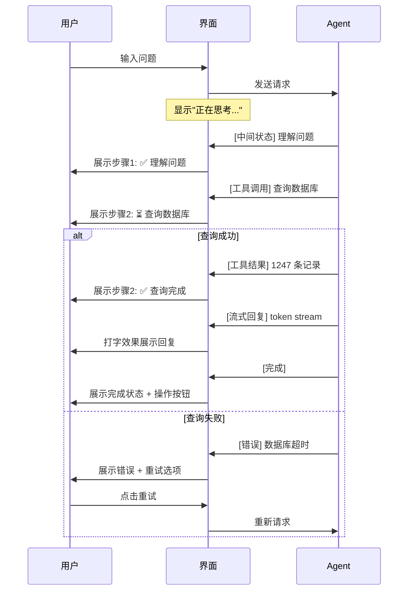

# Agent 用户体验设计：让 AI 的每一步都被看见、被理解、被信任

「本文是对 [教程 10-SSE流式通信 §1-§3] 的深入展开」

> [教程 10-SSE流式通信] [教程 24-多页面流式响应与会话管理] [教程 28-Human-in-the-Loop与审批流] 本文系统讲解 AI Agent 面向用户端的交互设计原则与模式，涵盖流式打字效果、中间状态展示、工具执行透明化、错误交互四个核心主题。技术实现细节可回查对应教程章节。

> 技术栈：Spring Boot 4.1 + Spring AI 2.0.0 + WebFlux + Java 21

---

## 一、为什么 Agent UX 不同于传统应用 UX

### 1.1 根本差异

传统软件的交互模型是**确定性的**：用户点击按钮 → 系统执行 → 返回结果。响应时间可预测，输出格式固定。

AI Agent 的交互模型是**概率性的**：

- 响应时间不确定：可能 2 秒，也可能 30 秒。
- 输出内容不确定：同样的输入可能得到不同回答。
- 执行路径不确定：Agent 可能调用一个工具，也可能调用五个工具。
- 可能出错：幻觉、工具调用失败、上下文超限、超时。



这种不确定性意味着：**Agent UX 的核心任务不是美化界面，而是管理用户的不确定感和信任度。** 如果用户不知道 Agent 在做什么、做得对不对，再漂亮的界面也没用。

### 1.2 信任曲线

用户对 AI Agent 的信任不是线性的，而是会随着交互经历波动：



第 15 次左右的信任下降代表一次"预期落差"——Agent 给出了不完美或错误的回答。良好的 UX 设计可以降低落差幅度，并加速信任恢复。

---

## 二、流式打字效果：不是装饰，是必需

> 技术实现详见 [教程 10-SSE流式通信]。

### 2.1 为什么必须流式

LLM 生成完整回答可能需要 5–20 秒。如果在这段时间内界面没有任何反馈，用户会以为系统卡死了。流式打字效果解决了三个问题：

- **感知延迟降低**：看到第一个 token 的瞬间，用户就知道"系统在工作"。心理学上，"看到进展"的等待感远低于"干等"。
- **提前纠偏**：用户在看到前几个词时就能判断方向是否正确，如果跑偏可以提前打断，而不是等 20 秒后看到一整段无用内容。
- **自然感**：打字效果模拟了人类对话的节奏，让交互更有"对话感"。

### 2.2 实现要点



**UX 细节清单：**

| 细节 | 做法 | 原因 |
|------|------|------|
| 首 token 延迟 | 显示"正在思考..."动画 | 缓解等待焦虑 |
| 打字速度 | 跟随 LLM 实际输出速度，不要人为限速 | 保持真实感 |
| 光标样式 | 闪烁的块状光标 | 标识"还在输入" |
| 打字中交互 | 允许用户点击"停止生成" | 用户发现跑偏时可以及时止损 |
| Markdown 渲染 | 流式过程中实时渲染 | 用户能边看边理解结构 |
| 代码块处理 | 在代码块完整接收前显示"代码生成中..." | 避免闪烁的不完整代码 |

### 2.3 多页面流式

> 技术实现详见 [教程 24-多页面流式响应与会话管理]。

当 Agent 生成的内容涉及多个页面/标签时（例如生成了一个分析报告 + 对应的图表），流式输出的 UX 设计需要额外考虑：

- **内容路由**：不同类型的输出流式推送到不同的 UI 区域（主对话区 + 侧边报告区）。
- **进度同步**：多页面内容的生成进度需要统一展示，避免用户在多个标签页之间来回切换。
- **完成提示**：当所有关联内容生成完毕时，给出明确的"全部完成"提示和导航入口。

---

## 三、中间状态展示：让 Agent 的思考过程可见

### 3.1 为什么需要中间状态

Agent 不是"一问一答"，它有多步推理和工具调用。如果用户只看到最终结果，会面临两个问题：

- **黑盒焦虑**："这个结论是怎么得出来的？"
- **错误难以发现**：如果某一步工具调用出了问题，用户无法定位。

解决方案是把 Agent 的"思考过程"可视化。

### 3.2 思考链展示模式



**推荐：时间线模式**，因为它最直观地展示了 Agent 的执行顺序，用户可以清楚地看到"先做了什么，后做了什么"。

### 3.3 时间线设计示例

```
🔍 Agent 正在工作...

  ✅ 理解你的问题
     "你想了解 Q3 销售数据环比变化"

  ✅ 查询数据库
     SELECT * FROM sales WHERE quarter = '2026Q3'
     → 返回 1,247 条记录

  ⏳ 计算环比变化
     正在对比 Q2 和 Q3 数据...

  ⬜ 生成分析报告
```

关键设计原则：

- **每个步骤有一个清晰的状态**：已完成（✅）、进行中（⏳）、待执行（⬜）、失败（❌）。
- **步骤描述用人话**：不要写"调用 Tool_3"，写"查询数据库"。
- **可展开查看详情**：点击步骤可以展开查看实际的工具调用参数和返回结果（面向技术用户或审计场景）。
- **进行中步骤有动画**：加载指示器让用户知道这一步还活着，没有卡死。

---

## 四、工具执行透明化

### 4.1 透明度等级

Agent 调用工具时的透明度可以分为四个等级，适用于不同的用户群体和场景：

| 等级 | 用户感知 |
|------|----------|
| 等级1：隐形 | 用户不知道工具被调用 |
| 等级2：摘要 | 显示"正在查询数据库" |
| 等级3：详情 | 显示 SQL 语句和结果 |
| 等级4：原始 | 显示完整的 API 请求/响应 |

| 等级 | 适用场景 | 适用用户 |
|------|----------|----------|
| 隐形 | 简单查询、内部辅助 | 终端消费者 |
| 摘要 | 常规业务操作 | 业务用户 |
| 详情 | 关键决策、数据敏感操作 | 分析师、审计员 |
| 原始 | 调试、开发 | 工程师 |

### 4.2 交互设计要点

**工具名称的"翻译"**：Agent 内部的工具名称通常对用户不友好。需要一个展示层映射：

```
内部名称: knowledge_base_search_v2
展示名称: 搜索知识库
描述: "在公司知识库中查找相关文档"
```

**参数脱敏**：展示工具调用参数时，对敏感字段（如 API key、用户密码）进行脱敏。在详情层级展示 SQL 时，移除或遮盖 WHERE 条件中的 PII。

**结果预览**：工具返回大量数据时，不要全部展示。给出摘要 + "查看完整结果"的折叠区域。

**可中断性**：长时间运行的工具（如大规模数据查询）必须支持用户中断。中断按钮应明确标注"停止当前操作"。

### 4.3 工具执行的视觉模式



**推荐组合**：摘要内联 + 详情侧边面板。用户在主对话区看到结果概要，需要深入了解时打开侧边面板查看执行细节。

---

## 五、错误交互：出错时的用户体验决定了信任底线

### 5.1 错误分类与处理策略



### 5.2 各类错误的交互设计

#### 瞬时错误（可重试）

```
⚠️ 查询超时，正在重试...（第 2/3 次）
[取消] [立即重试]
```

关键点：告诉用户发生了什么、系统正在怎么做、用户可以做什么。

#### 逻辑错误（需要用户介入）

> [教程 28-Human-in-the-Loop与审批流] 这是最需要人工介入（Human-in-the-Loop）的场景。

```
🔍 查询到 3 个匹配的客户：
   1. 张三（上海） - 最近活跃
   2. 张三（北京） - 已注销
   3. 张三（深圳） - 活跃

请选择您要查询的客户，或者补充更多信息。
```

关键点：不要默默选择一个可能错误的结果，把选择权交给用户。

#### 能力错误（Agent 做不到）

```
抱歉，我目前无法直接访问外部网站。
不过我可以通过以下方式帮助您：
   1. 根据您的描述搜索内部知识库
   2. 指导您如何在浏览器中查找该信息

您希望怎么做？
```

关键点：**诚实 > 掩饰**。承认局限并提供替代方案，比假装能做到但给出错误结果好得多。每一次"假装能做到"都是对信任的透支。

#### 安全错误

```
⛔ 该操作需要管理员权限。
已自动终止，并记录到安全审计日志。

如需申请权限，请联系：admin@company.com
```

关键点：安全错误不可协商，直接阻断，清晰说明原因和后续步骤。

### 5.3 错误恢复的用户心理



良好的错误交互可以把信任谷底从 35 抬高到 55 左右，关键因素是：

- **及时性**：错误发生后立即告知，不要等用户自己发现。
- **可理解**：用用户能理解的语言解释错误，不要展示原始 stack trace。
- **可操作**：给出用户可以采取的具体后续步骤。
- **可归因**：说清楚是系统的问题还是用户输入的问题，不要甩锅给用户。

---

## 六、人机协作（HITL）的交互设计

> 技术实现详见 [教程 28-Human-in-the-Loop与审批流]。

### 6.1 何时需要人工介入



### 6.2 确认交互的设计原则

- **展示足够的信息**：让审批者在充分了解上下文的情况下做决策。展示 Agent 的推理过程、将要执行的操作、预期结果。
- **默认安全**：确认弹窗的默认按钮应该是"取消"或"需要更多信息"，而不是"确认执行"。
- **支持修改**：不要只给"批准/拒绝"两个选项。允许用户修改 Agent 的方案后再批准。
- **时间戳**：如果确认请求需要等待（如排队等人工审批），展示预计等待时间。

### 6.3 典型的 HITL 交互流

```
🤖 Agent: 我准备执行以下操作：

   操作: 发送客户回访邮件
   收件人: zhang.san@example.com
   邮件主题: 关于您上次咨询的跟进
   邮件内容: [预览]

   理由: 客户的工单已处理完毕，按流程应发送满意度回访。

   [批准发送] [修改后发送] [拒绝] [需要更多信息]
```

---

## 七、整体交互编排

一个完整的 Agent 交互流，通常包含以上所有元素的组合：



### 设计清单

| 阶段 | 必须有 | 最好有 |
|------|--------|--------|
| 请求发出 | 加载动画 | 预计耗时 |
| 推理中 | 步骤时间线 | 可展开的思考链 |
| 工具调用 | 工具摘要 | 参数详情（可展开） |
| 结果生成 | 流式打字 | Markdown 实时渲染 |
| 结果完成 | 复制/再试按钮 | 来源引用、相关推荐 |
| 出错 | 错误说明 | 恢复选项 |
| 高风险操作 | 确认弹窗 | 可修改方案 |

### 7.3 流式 SSE 的 Java 实现（Spring AI + WebFlux）

以下代码展示如何用 Spring AI 2.0 的 `stream()` + WebFlux 构建一个带"工具调用透明化"的 SSE 端点，把 Agent 的每一步都实时推送给前端。

```java
@RestController
@RequestMapping("/api/agent")
public class AgentStreamController {

    private final ChatClient agentClient;
    private final SseEventBuilder sseBuilder;

    @GetMapping(value = "/chat", produces = MediaType.TEXT_EVENT_STREAM_VALUE)
    public Flux<ServerSentEvent<String>> chat(@RequestParam String q) {
        // 1. 先推送"思考中"状态
        Flux<ServerSentEvent<String>> thinking = Flux.just(
            ServerSentEvent.<String>builder()
                .event("status")
                .data("{\"phase\":\"thinking\"}")
                .build());

        // 2. 启动流式推理，每个 chunk 作为 "token" 事件推送
        Flux<ServerSentEvent<String>> tokens = agentClient.prompt()
            .user(q)
            .stream()
            .content()
            .map(chunk -> ServerSentEvent.<String>builder()
                .event("token")
                .data(chunk)
                .build());

        // 3. 工具调用事件：通过 Advisor 在工具触发时推送
        Flux<ServerSentEvent<String>> toolEvents = ToolEventBus.events()
            .map(evt -> ServerSentEvent.<String>builder()
                .event("tool")
                .data("{\"tool\":\"" + evt.name() + "\",\"status\":\"" + evt.status() + "\"}")
                .build());

        // 4. 合并流，完成时推送 "done" 事件
        Flux<ServerSentEvent<String>> done = Flux.just(
            ServerSentEvent.<String>builder()
                .event("done")
                .data("{}")
                .build());

        return Flux.merge(thinking, Flux.merge(tokens, toolEvents)).concatWith(done);
    }
}

/**
 * 工具调用事件总线：在 ToolGuardAdvisor 中发布事件，
 * 让前端实时看到"Agent 正在调用 readFile 工具"。
 */
@Component
public class ToolEventBus {
    private static final Sinks.Many<ToolEvent> sink =
        Sinks.many().multicast().onBackpressureBuffer();

    public static Flux<ToolEvent> events() { return sink.asFlux(); }

    public static void publish(ToolEvent evt) {
        sink.tryEmitNext(evt);
    }

    public record ToolEvent(String name, String status, Map<String,Object> args) {}
}
```

前端收到的事件流示例：

```
event: status
data: {"phase":"thinking"}

event: tool
data: {"tool":"readFile","status":"started"}

event: token
data: 根据

event: token
data: 文件内容

event: tool
data: {"tool":"readFile","status":"completed"}

event: done
data: {}
```

**设计要点**：

- **`event` 字段区分事件类型**：`status`（阶段切换）、`token`（文本流）、`tool`（工具调用）、`done`（完成）。前端按事件类型渲染不同 UI 组件。
- **工具事件通过 `ToolEventBus` 解耦**：Advisor 不直接操作 SSE 流，而是发布事件，由控制器层订阅并转发。
- **`onBackpressureBuffer`**：WebFlux 背压处理，避免慢客户端导致内存溢出。

---

## 八、总结

Agent UX 的核心理念可以用一句话概括：**让 AI 的每一步都被看见、被理解、被信任。**

四个关键主题各自承担不同职责：

1. **流式打字**解决"等待焦虑"——让用户第一时间知道系统在响应。
2. **中间状态展示**解决"黑盒焦虑"——让用户看到 Agent 的推理路径。
3. **工具执行透明化**解决"来源焦虑"——让用户知道结果从哪来、可不可信。
4. **错误交互**解决"信任底线"——出错时如何保持用户信任不被彻底击碎。

这四个主题的共同底层逻辑是：**Agent 不是魔法，它是会思考、会使用工具、也会犯错的系统。好的 UX 不掩饰这一点，而是让这种不确定性变得可控、可理解。**

最终目标是一个看似矛盾的双重追求：一方面让用户感觉 Agent"像一个聪明的同事"，另一方面让用户始终清楚"这是一个需要监督的 AI 工具"。在拟人化和透明化之间找到平衡，是 Agent UX 设计者最核心的功课。
