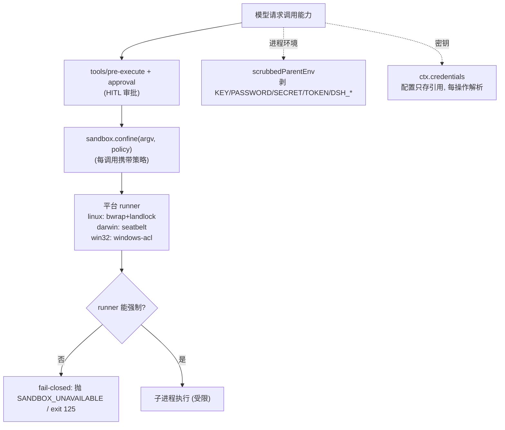
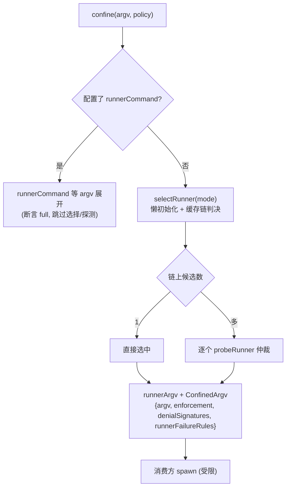
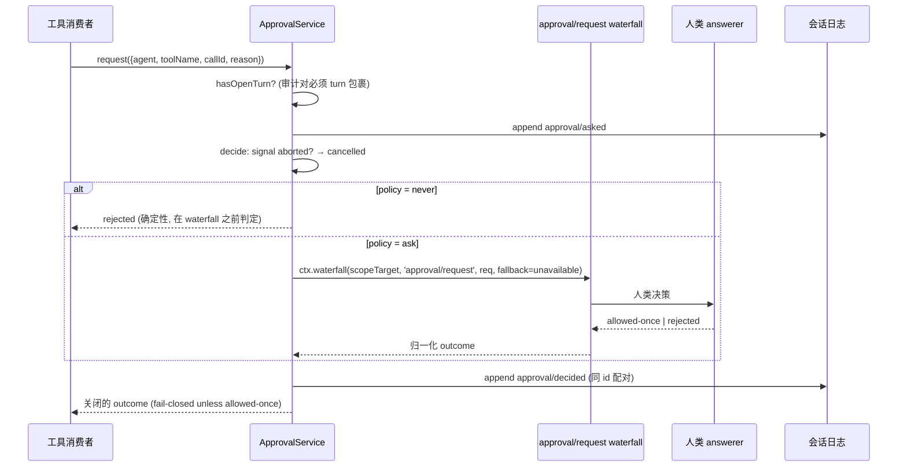

> **定位**：本文深入 DeepSeek Harness 的安全体系——沙箱缝、Landlock/Seatbelt/Windows ACL 三平台 runner、审批（HITL）、凭证缝、权限预设、外部 CLI 钩子桥接与 E2B 远程沙箱。读完你将理解「fail-closed 哲学如何贯穿一个 Agent 框架的安全设计」。前置阅读：[04-模型可见能力]（bash/fs 是沙箱的消费方）、[02-核心引擎与Agent生命周期]。
> **代码位置**：`packages/sandbox/`、`packages/guard/`、`packages/credentials/`、`packages/interaction/`、`packages/hooks/`、`packages/e2b/`、`native/landlock-run/`。

## 一、领域概览：安全体系在设计上回答什么问题

**设计问题**：Agent 框架让模型「可能执行任意代码、读写任意文件、访问任意网络」——安全体系必须回答：**模型误操作/被诱导时，系统如何把伤害限制在可控范围？** 本领域的答案是一条贯穿所有子系统的铁律 + 五道防线。

本领域所有子系统共享一条铁律：**无法保证安全就拒绝执行，绝不静默直通**。

### 本领域的设计哲学（Why）

本领域是「fail-closed + 敌意 peer + 显式优先」安全三原则（[11-设计哲学与架构模式 §二]）的完整落地，可展开为五条：

1. **fail-closed 是地板，不是选项**——沙箱无 backend → 抛 `SANDBOX_UNAVAILABLE`；Landlock 内核不执行 → 不 exec；审批无 answerer → `unavailable`（调用方拒绝）；`never` 策略先于任何 listener 判定（`prepend` 不能绕过）。**为什么**：安全失败的默认值必须是「拒绝」，而不是「放行 + 期望没事」。
2. **per-call 而非 per-provider**——`SandboxPolicy` 每次调用完整解析后随调用携带。**为什么**：两个消费方可同时用不同边界（bash read-only、子代理写状态目录）；批准的一次性升级就是一次更宽的调用。
3. **凭证不落地**——配置只存 `CredentialRef`（环境变量名），provider 持值，每操作解析。**为什么**：轮换零重启；`describe` 永不暴露值；错误诊断不引用秘密；空值处处视为不存在。
4. **会话日志即安全状态**——`sandbox/mode`、`approval/policy`、`permission/preset`、`command/*`、`hook/*` 都是 log-only durable 事件，折叠=重放。**为什么**：无带外配置存储，审计可重放，崩溃不丢安全决策。
5. **stderr 方言而非跨后端并集**——`denialSignatures` 只报本 backend 产生的拒绝；`runnerFailureRules` 用 exit 门控 + 签名区分「runner 没跑」与「confinement 拦住了」。**为什么**：把「命令被拒绝」与「命令没跑成」混为一谈会掩盖安全事件。

用一张图概括安全防线：

## 二、sandbox：进程沙箱缝

### 2.1 Service Definition（`packages/sandbox/sandbox/src/index.ts`）

- `SandboxMode = 'read-only' | 'workspace-write' | 'danger-full-access'`（`:29`）；`ConfinedSandboxMode` 排除 full-access。
- `SandboxExecutionPolicy`（`:39`）：`{mode, workspaceRoot, sessionId?}`——**每次能力调用完整解析后随调用携带**（per-call 而非 per-provider，两个消费方可以同时用不同边界）。
- `ConfinedArgv`（`:95`）：`{argv, enforcement, denialSignatures, runnerFailureRules}`。**`denialSignatures` 是所选 backend 自己的 stderr 方言**（bwrap=EROFS、Landlock=EACCES、Seatbelt=EPERM），禁止跨 backend 求并集。
- 抽象方法 `confine(argv, policy): ConfinedArgv`（`:175`）：要么返回可执行的包装 argv，要么在包装/runner 执行时抛错；**静默无限制直通永远非法**。
- `SandboxUnavailableError`：请求受限模式但无可用 backend 时 **fail-closed**。

### 2.2 沙箱升级词汇（`escalation.ts`，被 bash/fs 工具族共享）

- `WIDER_MODES`：`read-only → ['workspace-write','danger-full-access']`、`workspace-write → ['danger-full-access']`——严格变宽表，**在 exec 时检查，不烘焙进工具 schema**。
- `approveEscalation`：有序 fail-closed 序列——先严格变宽校验（**非变宽永不提示人类**）→ 缺 approval 服务抛错 → `ctx.approval.request(...)` → 按 outcome 返回授予的模式或抛错。
- 模型可见标记：`[sandbox: file access denied under <mode> mode]`、`[sandbox: escalation available — retry this exact <subject> once with sandbox_permissions ...]`。

### 2.3 LocalSandboxProvider（`sandbox-local`）

- **按平台选链**：`linux: ['bwrap','landlock']`、`darwin: ['seatbelt']`、`win32: ['windows-acl']`（`:159`）。**探测只在链上有多个候选时仲裁**（单一候选直接选中）。
- **`STATIC_ENFORCEMENT`**：bwrap/landlock/seatbelt 无探针选中时声称 `full`；`windows-acl` 恒 `partial`（WRITE_RESTRICTED 必须保留 Everyone 且 NTFS 硬链接可别名跨路径）。
- **`RUNNER_FAILURE_RULES`**（`:231`）：bwrap=`['bwrap: ']`；landlock 用 `LAUNCHER_FAILURE_EXIT=125` 门控 + `landlock-run: ` 签名 + informational 行；seatbelt=`['sandbox-exec: ']`；windows-acl 用 exit 127 门控。**exit status 本身从不单独证明 runner 失败**——这是「命令被拒绝」与「命令没跑成」的分类契约。
- `probeRunner`：bwrap 探测 `spawnSync('bwrap', ['--ro-bind','/','/','--dev','/dev','--proc','/proc','--die-with-parent','--','true'])`；Landlock 探测用 `probe(launcher)` 真强制；Seatbelt 探测 `sandbox-exec -p <read-only profile> -- true`。

## 三、Landlock：原生执行器（Linux）

Landlock 是 Linux 内核的 **allow-list** 强制访问控制——`landlock-run`（约 300 行 C11，静态链 musl、裸内核 UAPI）是「先自我限制再 exec」的 launcher。**`execve` 后 ruleset 被子进程继承，命令及其全部后代受限，调用方进程不受限**。内核无法强制则**不 exec、直接退出**（fail-closed）。

详细机制见 [本系列 09-Python-SDK·原生沙箱与示例] 的第四节，此处只强调三个安全要点：

1. **ABI 协商**：`landlock_create_ruleset(NULL, 0, VERSION)` 探测内核 ABI（ENOSYS=没编译 Landlock，EOPNOTSUPP=禁用，均 fail closed）；先 `prctl(PR_SET_NO_NEW_PRIVS, 1)`（必须且中和 setuid/setgid 提权）再 `restrict_self`。
2. **`--probe` 真强制**：在自身短命进程里对 `/` 构建最大规则集并真 restrict——「有 syscall 但拒绝强制」的内核版本检查会漏掉，真正 restrict 是唯一诚实信号。
3. **退出码 125 门控**：`LAUNCHER_FAILURE_EXIT=125` 对每个 launcher 层失败；被 exec 的子命令也可能返回 125，所以消费方必须同时要求 `landlock-run: ` 致命 stderr 行。

## 四、Windows ACL（`sandbox-windows-acl`）

`AclSandbox` 用 **WRITE_RESTRICTED restricted token**（restricting SID 含 workspace 与 temp 写 SID，交集检查只在对应 ACE 存在处放行写）实现文件效应限制。

- **授权生命周期**：workspace 写 SID 是**每 workspace 确定性身份**（`workspaceWriteSid(root)`），workspace 根 ACE 每 provider 生命周期物化一次并**常驻**（跨会话复用缓存）；每个 live session/workspace 对拿一个**随机私有临时目录 + 独立 temp SID**，dispose 时撤销。
- **`setTokenDefaultDaclGrant`**：把 temp SID 的 full-access ACE 合入 restricted token 的 default DACL——否则受限进程新建的管道/同步对象写 pass-2 检查会失败。
- **已知边界**（README 明示）：只限制写（读/网络/进程可见性不受限）；控制台隔离不可用；NTFS 硬链接可别名越界——因此 `STATIC_ENFORCEMENT` 报告 `partial`。

## 五、guard：工具执行防护

### 5.1 timeout-policy（`dsh-tool-call-timeout-policy`）

零配置超时强制器。**协作式而非硬杀**：`deadline(exec.signal, timeoutMs, TOOL_TIMEOUT)` 把派生信号换到 `exec.signal` 上，**终止权在工具**（声明 `timeoutMs` 意味着「协作于 exec.signal」）。命中本插件自己的 timer 时，把 provider 的任意返回替换成 `toolTimeoutResult`（`error.code='TOOL_TIMEOUT'`）。

### 5.2 repeat-tool-reminder（`dsh-repeat-tool-reminder`）

**咨询性**逐 agent 重复调用检测器——只注入模型上下文，不 veto、不改写调用。`thresholds` 默认 `[3,5,8]`；链 key=`[toolName, canonicalize(arguments)]`（深 key 排序后 `JSON.stringify`，属性顺序不同视为同一）；命中阈值返回 `createUserMessage({source:{kind:'plugin',...}})` 通知。`agent/pre-step` 遇 `source.kind==='user'` 消息重置该 agent 链（用户插话不构成循环）。

## 六、credentials：凭证缝

### 6.1 Service Definition

`ctx.credentials`（`CredentialProvider`，`credentials/src/index.ts:60`）：配置与 `cordis.yml` 只携带**引用**（`CredentialRef` = POSIX shell 标识符），provider 拥有值。**消费方每操作解析一次**——轮换凭据无需重启即达下一请求。

- `resolve(ref)` → `{value, source}`；`describe(ref)` → `{configured, source?, writable}`（**绝不暴露值**，供配置 UI）。
- **缝级铁律：空存储值处处视为不存在**（resolve 跳过、describe 报 unconfigured）——空白永远不冒充已配置密钥。
- `credentials/updated`（emit）：provider 管理的源的**已提交**变更后发射；消费方不需要它（每操作重解析），它为配置 UI 刷新「已配置」徽章存在。

### 6.2 credentials-local（`$DSH_HOME/.credentials.yaml`）

按信任度分层：`继承进程环境(只读,赢) > $DSH_HOME/.credentials.yaml(可写) > <cwd>/.env(只读fallback) > $DSH_HOME/.env`。**环境赢**是因为 `DEEPSEEK_API_KEY=… dsh` 是本次运行的显式意图且无法从内部编辑，必须**可见地只读**而非静默遮蔽写。

- `assertOwnerOnly`：凭证文档存在即检查 mode 无 group/other 位（`0o077`），否则拒绝读取；
- **错误诊断绝不引用值**（`describeYamlError` 只给 code+line/col——parser message 内嵌的是秘密行）；
- 写前在跨进程 writer lock 下 `reconcileFromDisk` 再只 patch 自己的 key；`assertUnshadowed` 拒绝被 inherited env 遮蔽的写（写了也像成功但解析一直返回遮蔽值）；
- 热重载：chokidar watcher，读失败**警告并保留最后好快照**。

## 七、approval：HITL 审批缝

`ctx.approval`（`ApprovalService`，`interaction/user-approval/src/index.ts`）回答「这个具体动作可以进行吗」。

关键设计：

- `ApprovalOutcome = 'allowed-once' | 'rejected' | 'cancelled' | 'unavailable'`；`ApprovalPolicy = 'ask' | 'never'`（`never` 确定性返回 rejected——CI/无人值守）。
- `ApprovalRequest` **刻意省略工具参数**——answerer 通过 `callId` 挂到已流式展示的 tool call 上，避免渲染会漂移的第二份副本。
- **`never` 策略在 waterfall dispatch 之前判定**——后注册的 `prepend` answerer 也不能绕过「never 确定性拒绝」承诺。
- 审计事件 `approval/asked`/`approval/decided` 全部 log-only、不进模型转录本。

## 八、permission-presets：把旋钮捆绑成预设

`ctx.permissionPresets` 把两个独立旋钮——沙箱模式（`sandbox/mode`）与审批策略（`approval/policy`）——捆绑成命名预设：

- 预设表：默认 `workspace-write`（`{sandbox:'workspace-write', approval:'ask'}`）与 `danger-full-access`（`{sandbox:'danger-full-access', approval:'never'}`）；
- `set(session, name)` → 当前预设不同于目标才 append `permission/preset`；然后**只在各自旋钮有效值变化时**分别调 `setSandboxMode` 与 `setApprovalPolicy`；
- `sandbox/mode`/`approval/policy`/`permission/preset` 都是 **log-only durable 会话事件**——折叠=重放，无带外配置存储。

## 九、commands：人类命令注册表

`ctx.commands`（`CommandRuntime extends TypertRemoteService`）是插件持有的、供交互 UI 适配器**发现并直接执行**的命令注册表——**不创建模型消息**。区分三种「命令」：模型工具（`ctx.tools`）、Shell 命令（bash executor）、人类命令（slash command）。

- `execute`：mint `CommandId`（`cmd-<instanceToken>-<seq>`）→ append `command/run`（`recordInput:false` 时省略 args）→ handler → `normalizeResult`（在注册表边界校验 untrusted handler 返回值）→ append `command/done`；
- 两者都是直接 log-only append（不包 turn）；
- `commands/change` 观察者失败被包含不可否决（`notifyChange` 手动逐回调 try/catch）。

## 十、hooks：外部 CLI 钩子桥接

### 10.1 hook-protocol（共享库）

把外部 CLI 的 command hooks（Claude Code / Codex 双方言）桥接进 harness 拦截点：

- `runHook` 经 **`ctx.shell` 执行**（吃 shell 的凭证 scrub、进程组取消、超时机制）；基础设施拒绝变成「无 exit code 的 outcome」，**绝不 throw 打崩调用 turn**；
- `parseHookOutput`：exit 2 = block；顶层 legacy `decision` 只接受 `approve/block`（`allow/deny/ask` 是 `hookSpecificOutput.permissionDecision` 专属——**越权的 `{"decision":"deny"}` 非法被忽略**）；
- `mergeHookOutputs`：权限优先级 `deny > ask > allow`，首个 `continue:false` sticky；
- 每 hook 写 `hook/invoked` + `hook/result` durable 对。

### 10.2 hooks-claude-code vs hooks-codex

| 维度 | hooks-claude-code | hooks-codex |
|---|---|---|
| 支持点 | 7 点（含 SubagentStart/Stop） | 5 点（无子代理点） |
| matcher | 纯 word + `\|` 字面量 / unanchored regex | 总是 regex |
| payload | snake_case + 尾换行 | snake_case、**无尾换行** |
| 权限 | approve/allow/block/deny/ask 全支持 | **只 honor 阻塞决策**（deny → block） |
| 差异 | 可 rewrite（`updatedInput` 只 warn 不处理） | 无 pre-tool approval 或 rewrite 路径 |

| 步骤 | 处理内容 |
|------|----------|
| 1 | 外部 hooks.json（Claude Code / Codex） |
| 2 | 桥 apply 解析 |
| 3 | 拦截点监听（agent/pre-step、tools/pre-execute、tools/post-execute、turn-stopping…） |
| 4 | runPoint：matcher 选择 + runHook |
| 5 | 经 ctx.shell 执行（凭证 scrub + 超时） |
| 6 | parseHookOutput 解码 |
| 7 | mergeHookOutputs（deny > ask > allow） |
| 8 | 映射 PreToolDecision / PostToolDecision / steer / inject |
| 9 | 写 hook/invoked + hook/result |

## 十一、E2B：远程 Linux 沙箱

`ctx.e2b`（`E2BRuntime`）拥有**一个** E2B SDK handle；`fs-e2b` 与 `subprocess-e2b` 两个 provider **共享同一个远程 Linux 世界**。

- `Sandbox.create({apiKey, timeoutMs, secure:true, lifecycle:{onTimeout:'kill'}})`；`apiKey` 省略读 `E2B_API_KEY`，**绝不转发进沙箱**；
- fs-e2b 的 `writeAtomic`：随机 staging 目录 `chmod 700` → 写临时文件（带 `dsh-version` metadata）→ `createIfAbsent` 用 `ln -T` 守卫发布，否则 `rename`；
- subprocess-e2b：每条命令用**远端 bootstrap 脚本**做进程组管理（`setsid --wait`）、scrubbed 环境经 `env -i --` 装载、pid/exit code 写状态文件、控制面轮询；`terminate` SIGTERM→grace→SIGKILL 全进程组；**pid 发布校验拒绝 `<=1`**（`kill -- -1` 防任意进程寻址）。

## 十二、事件总表

| 事件 | 模式 | 位置 | 说明 |
|---|---|---|---|
| `sandbox/mode` | 会话日志 | `sandbox-policy/session-mode.ts:33` | 唯一写路径 `setSandboxMode` |
| `approval/request` | waterfall | `user-approval/index.ts:30` | scope 过滤，agent-scoped 监听只收该 agent |
| `approval/asked`/`decided` | 会话日志 | `:44/:55` | 审计对，必须 turn 包裹 |
| `credentials/updated` | emit | `credentials/types.ts:29` | 已提交变更通知 |
| `permission/preset` | 会话日志 | `permission-presets/index.ts:50` | 用户意图 |
| `commands/change` | emit | `commands/types.ts:72` | 注册/注销通知 |
| `command/run`/`done` | 会话日志 | `:88/:95` | 人类命令执行 |
| `hook/invoked`/`result` | 会话日志 | `hook-protocol/types.ts` | 钩子审计 |

## 十三、设计决策（Why / 代价 / 选择依据）

**D1. fail-closed 是地板，不是选项**
- **Why**：沙箱无 backend → 抛错而非直通；Landlock 内核不执行 → 不 exec；approval 无 answerer → `unavailable`；`never` 策略先于任何 listener 判定（`prepend` 不能绕过）。
- **代价**：安全优先意味着更多拒绝，模型偶尔要走审批/升级。
- **选择依据**：安全失败的默认值必须是「拒绝」。这是与「尽力而为」系统的根本分界。

**D2. per-call 而非 per-provider**
- **Why**：`SandboxPolicy` 每次调用携带，两个消费方同时用不同边界；批准的一次性升级就是一次更宽的调用。
- **代价**：每次调用都要解析策略（有缓存优化）。
- **选择依据**：把「边界」做成调用的参数而非提供者的属性，才支持同一执行器服务不同安全等级的调用方。

**D3. 凭证不落地**
- **Why**：配置只存 `CredentialRef`；`describe` 永不暴露值；错误诊断不引用秘密；空值处处视为不存在；每操作重解析 = 热轮换。
- **代价**：配置无法直接看到密钥值，需要凭证 UI。
- **选择依据**：密钥的暴露面越小越好；「空值即不存在」防止空白冒充已配置密钥。

**D4. 会话日志即安全状态**
- **Why**：`sandbox/mode`、`approval/policy`、`permission/preset` 都是 log-only durable 事件，折叠=重放。
- **代价**：读取安全状态要走 fold，不能点查。
- **选择依据**：安全决策也必须可重放、可审计，与业务状态同一条真相链。

**D5. stderr 方言而非跨后端并集**
- **Why**：`denialSignatures` 只报本 backend 产生的拒绝；`runnerFailureRules` 用 exit 门控 + 签名区分「runner 没跑」与「confinement 拦住了」。
- **代价**：每加一个 runner 都要维护它的方言签名。
- **选择依据**：把「命令被拒绝」误判成「命令没跑成」会掩盖安全事件，值得维护方言。

**D6. 包含式回调 + hook 输出限定映射**
- **Why**：`credentials/updated`、`commands/change` 的监听失败被记录不否决已提交变更；hook 顶层 `decision` 只 approve/block，越权值被忽略——「faithful-but-degraded」。
- **代价**：被忽略的越权值不会报错，可能让用户困惑。
- **选择依据**：外部 CLI 是「不可靠集成方」，宁可诚实降级也不假装支持不存在的语义。

## 十四、转译到 Spring AI / Java 生态

| DeepSeek Harness | Java/Spring AI 对应物 | 启示 |
|---|---|---|
| Landlock allow-list + fail-closed | JVM SecurityManager（已弃用）/ seccomp / 容器 | allow-list 比 deny-list 安全；「未授予即拒绝」是沙箱黄金法则（对应 [教程 04-企业级架构主干/11-安全与权限控制]） |
| `approval/request` waterfall HITL | 自定义审批拦截器 | 审批审计对必须 turn 包裹、fail-closed unless allowed-once（对应 [教程 04-企业级架构主干/08-Human-in-the-Loop与审批流]） |
| 凭证每操作解析 + 轮换即生效 | `@ConfigurationProperties` 静态 | 「配置存引用、provider 持值、每操作解析」让轮换零重启 |
| 沙箱升级严格变宽表 | 权限升级检查 | 非变宽永不提示人类——升级路径必须可穷举 |
| hooks 桥接 Claude Code/Codex | 外部 CLI 集成 | 「faithful-but-degraded」：不支持的能力只 warn 不假装支持 |

> **适用场景**：要设计生产级 Agent 的安全防线（沙箱 + 审批 + 凭证 + 钩子）。
> **不适用场景**：demo 级、无敏感操作的场景。

## 十五、总结

本文拆解了安全体系的五个层面：**沙箱缝**（per-call 策略 + 平台 runner 链 + fail-closed）、**审批缝**（waterfall + 审计对 + `never` 确定性拒绝）、**凭证缝**（引用化 + 每操作解析 + 空值即不存在）、**权限预设**（旋钮捆绑 + 事件溯源）、**外部钩子**（协议规范化 + 越权值忽略）。贯穿始终的是同一条哲学：**fail-closed、不落地、可审计、诚实降级**。

> **定位回顾**：本文是系列的「安全」篇。下一站 [06-编排：子代理/调度/工作流/目标]，看多 Agent 协作与长任务编排如何构建。
